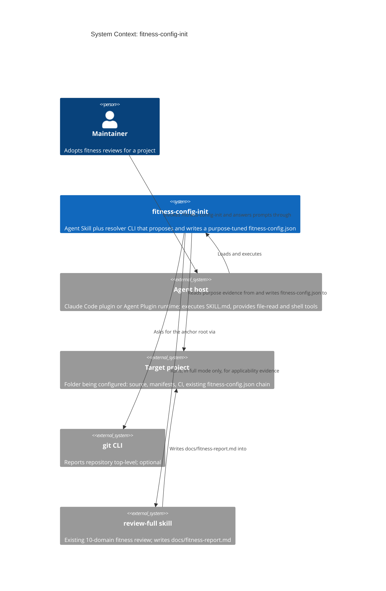
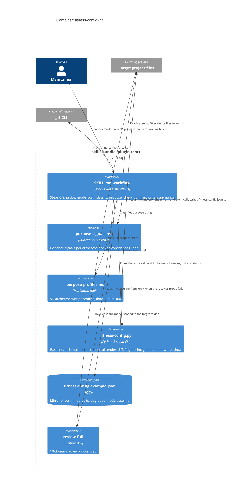

# Architecture Design: fitness-config-init

**Wave**: DESIGN | **Date**: 2026-09-28 | **Persona**: Morgan (nw-solution-architect) | **Mode**: propose (decisions pre-answered by user)
**Job**: J-FCI-01 (inferred, accepted per DQ-8) | **Status**: IMPLEMENTED (DELIVER complete 2026-09-29; resolver since split into `scripts/fitness_config/` per ADR-012). Design review: conditionally approved for DISTILL (see section 11)

Companion documents: [technology-stack.md](technology-stack.md), [component-boundaries.md](component-boundaries.md), [data-models.md](data-models.md).
ADRs: [ADR-007](../../adrs/ADR-007-purpose-profiles-with-bounded-judgment.md), [ADR-008](../../adrs/ADR-008-strict-stdlib-validator.md), [ADR-009](../../adrs/ADR-009-baseline-and-anchor-selection.md), [ADR-010](../../adrs/ADR-010-deterministic-write-gate.md), [ADR-011](../../adrs/ADR-011-rationale-printed-not-persisted.md).

---

## 1. Drivers and Constraints

| # | Quality attribute (ISO 25010) | Architectural response |
|---|---|---|
| 1 | Functional correctness: the file on disk is always a valid config | Every write passes through one deterministic gate in the resolver (ADR-010) using the strict stdlib validator (ADR-008). The agent never writes `fitness-config.json` itself. |
| 2 | Safety: no overwrite without confirmation, no other file touched | Write gate refuses existing files without `--force`, requires the fingerprint of the proposal the user reviewed, writes atomically, verifies, and rolls back. Proposal travels on stdin, so no temp file lands in the project. |
| 3 | Maintainability (single maintainer) | Judgment lives in two markdown references; determinism lives in the existing single-file resolver, extended in its established style (ADR-006). No new files in `scripts/`, no dependencies. |
| 4 | Time-to-market | Reuse `build_seed_config`, `walk_up_chain_with_status`, `_read_chain_configs`, `validate_schema_versions`, `validate_effective`, `render_show_output`. New Python is roughly 150 LOC. |
| 5 | Portability | Resolver located via `${CLAUDE_SKILL_DIR}/../../scripts/fitness-config.py` (convention from commit 4b25d78); Python 3 stdlib only; works in Claude Code plugin, Agent Plugin, and symlink installs. |

Constraints: one maintainer; deliverable is an Agent Skill plus small stdlib Python changes; no new runtime dependencies; no schema change; review-full invoked unchanged; do not edit CLAUDE.md.

Conway check: one maintainer, one repo, one release unit (the skills bundle). No team boundary to respect. The boundary that matters is the agent/deterministic-code seam (section 4).

## 2. Existing System Analysis (reuse over rebuild)

| Existing asset | Current behavior | Use in this feature |
|---|---|---|
| `build_seed_config(raw_configs)` | Parent chain merged over `DEFAULT_*`, or pure defaults when chain empty | **Reused as the baseline** (DQ-3). Exposed read-only by `init --path F --dry-run`. |
| `cmd_init_path(target, base)` | Walks up from target's parent, seeds, refuses overwrite | **Extended**: `--dry-run`, `--from`, `--force`, `--expect`. Seed-only path unchanged. |
| `walk_up_chain_with_status`, `_read_chain_configs`, `validate_schema_versions`, `validate_effective` | Chain discovery, parse, version gate, sum gate | **Reused** by the write gate to pre-check ancestors and post-check the effective config. |
| `validate_config(data)` | version int, weights sum, confidenceThreshold 1-10 | **Extended** (ADR-008): known domain names, numeric 0-100, schema shape. Fixes the crash on a non-numeric threshold. |
| `render_show_output` / `show --path` | Chain and `Config:` line | **Reused verbatim** for the final summary (FR-8). |
| `cmd_audit` | Scans `skills/review-*/SKILL.md` for inline weights / direct loads | **Extended** to also scan `skills/fitness-config-init/SKILL.md`. |
| `DEFAULT_*` constants | Built-in defaults | **Single baseline source.** `fitness-config.example.json` becomes a checked mirror (parity test) and a degraded-mode fallback only. |
| `skills/review-full` | 10 parallel domain reviews, writes `docs/fitness-report.md` | **Invoked unchanged** in full mode, scoped explicitly to the target folder. |
| `cmd_init` (legacy, positional) | Writes defaults, no trailing newline | Untouched (backward compatibility; CI uses it). |

New and justified (no existing alternative): the skill itself; two reference files (`purpose-signals.md`, `purpose-profiles.md`); proposal completeness rules, canonical renderer, value diff, and fingerprint in the resolver.

**Latent defect found**: `cmd_init_path` (lines 629-633) walks from the target's parent with `stop=cwd`. When target == cwd, the parent is above the stop boundary, so the walk continues to the filesystem root (or the 64-level cap) and can read an unrelated `fitness-config.json` (for example, in `$HOME`). ADR-009 fixes the rule: the walk never leaves the anchor. The guard's location, rule, and three required tests are in data-models.md section 6.3. It applies to every `init --path` form, not only the new flags.

## 3. Resolution of DISCUSS Open Questions

| DQ | Decision | Record |
|---|---|---|
| DQ-1 | Rationale is printed in the summary only. No sidecar, no `$comment`. | ADR-011 |
| DQ-2 | review-full evidence affects applicability only (skipped or absent domain goes toward the floor). Low scores never raise a weight. Purpose drives weights. | ADR-007 |
| DQ-3 | Baseline = built-in defaults when the target is the anchor root. Otherwise = parent chain merged (`build_seed_config`). The anchor is the git top-level, or the target when no git repo exists. | ADR-009 |
| DQ-4 | Six archetype profiles in `references/purpose-profiles.md`, plus bounded adjustment (up to ±4 per domain, evidence required), floor 1, integers, sum 100. | ADR-007 |
| DQ-5 | Confidence below high means the skill asks for the primary purpose. Low or unknown with no answer means baseline. Mixed repos: mention per-directory overrides, never create them. | ADR-007 |
| DQ-6 | Extend the stdlib validator (names, 0-100, schema shape) and add a write gate. With no python3, refuse to write and print the proposal. | ADR-008, ADR-010 |
| DQ-7 | Mode taken from the argument or unambiguous invocation text. Otherwise ask; default fast. Never upgraded silently. **Unambiguous** means the argument is exactly `fast` or `full`, or the text contains "full review", "full mode", or "run review-full" and none of "fast"/"quick". Anything else, or both signals, prompts. Examples: "full review first" is full; "do a quick one" is fast; "set up fitness config" prompts (Enter means fast); "fast, or full if needed" prompts. | Section 5 |
| DQ-8 | Keep `J-FCI-01`. No `jobs.yaml`. | This document |
| Skill location | `${CLAUDE_SKILL_DIR}/../../scripts/fitness-config.py`; fallback "the directory containing this SKILL.md" (same text as review-*). Probed at step 0. The example file is at `${CLAUDE_SKILL_DIR}/../../fitness-config.example.json` and is read only in degraded mode. | Section 6 |

## 4. Architecture

**Style**: unchanged from ADR-006 (modular library with dependency inversion at the I/O boundary, inside the single-file resolver per ADR-004). The feature adds one more *driving adapter* (the agent executing SKILL.md) on top of the existing CLI port. The paradigm follows the existing code: pure functions for rules, rendering, diff, and fingerprint; impure adapters only at the filesystem edge.

**Split of responsibility (the key boundary)**:

| Concern | Owner | Why |
|---|---|---|
| Evidence gathering, purpose classification, weight judgment, rationale, conversation (mode, correction, confirm) | Agent, following SKILL.md and references | Needs reading and judgment; cannot be computed |
| Baseline, validation, canonical bytes, existing-vs-proposed diff, identical detection, overwrite refusal, atomic write, post-write verification | Resolver CLI (`fitness-config.py`) | Must be deterministic, testable in pytest, identical across agents |

The agent never writes, reads, or parses `fitness-config.json` directly (US-08 rule, audited). It hands a proposal to the resolver on stdin and relays the result.

### 4.1 C4 Level 1: System Context

### 4.2 C4 Level 2: Container

Level 3 is omitted: the resolver additions are 5 small functions inside an existing component (see component-boundaries.md).

## 5. Runtime Flow

| Step | Actor | Action | Resolver call (cwd = anchor) |
|---|---|---|---|
| 0 Probe | Agent | Resolve target (arg or cwd) and anchor (`git -C <target> rev-parse --show-toplevel`, else target). Probe the resolver. First output line names the target (FR-1). | `init --path <target> --dry-run` gives the baseline JSON. Failure means degraded mode (6.2). |
| 1 Mode | Agent | Argument or unambiguous text, else ask; default fast. In full mode, disclose `docs/fitness-report.md` and wait for yes. | none |
| 2 Evidence | Agent | Fast: read at most 40 files per `purpose-signals.md` (README, manifests, top-level layout, deploy/CI). No project code, no network. Full: also run review-full scoped to the target; a failed domain falls back to fast evidence. | none |
| 3 Classify | Agent | Archetype plus confidence plus evidence paths (each verified to exist). If confidence is below high, ask for the primary purpose. Unknown, or low with no answer, means baseline. | none |
| 4 Propose | Agent | Profile, then bounded adjustment, then floor, integer, and sum-100 check. One reason per value that differs from the baseline. Apply user edits and rebalance. | none |
| 5 Check and diff | Resolver | Strict validation, completeness, canonical bytes, diff against the existing file, fingerprint. Nothing written. | `init --path <target> --from - --dry-run` |
| 6 Confirm | Agent | New file: the user accepts the proposal. Existing: show the diff, `Overwrite? [y/N]`, only `y`/`yes`. Unchanged: stop, nothing written. | none |
| 7 Write | Resolver | Recompute the fingerprint and compare it with `--expect`. Pre-check ancestors. Atomic write, re-read, verify, and roll back on mismatch. | `init --path <target> --from - --expect <fp> [--force]` |
| 8 Summarize | Agent | Rationale table, `Config:` chain verbatim, override notice (ADR-005 wording) when the chain has more than one entry, next step: run review-full. | `show --path <target>` |

## 6. Skill Location and Earned Trust

### 6.1 Locating bundle resources

The same convention as all review-* skills (commit 4b25d78): `python3 "${CLAUDE_SKILL_DIR}/../../scripts/fitness-config.py"`, with the same one-line fallback ("if your agent does not expand the variable, substitute the directory containing this SKILL.md"). The references load relative to the skill (`references/...`). The skill never reads `fitness-config.example.json` except in degraded mode, because the baseline comes from the resolver (ADR-009).

The symlink install (`install-skills.sh`) links each skill directory individually. `../..` resolves physically through the symlink to the repo, so it works. A host that normalizes the path lexically before use would break it. The step-0 probe detects that case.

### 6.2 Dependency probes (what if the environment lies?)

| Dependency | Lie or failure | Probe | Behavior on failure |
|---|---|---|---|
| `python3` / resolver path | Missing interpreter, unexpanded variable, lexically normalized symlink path | Step 0 `init --path T --dry-run` must exit 0 and emit parseable JSON | **Degraded mode**: baseline from the example file (labeled as such; built-ins only, no ancestor merge). Proposal printed for manual use. **Nothing written** (DQ-6). If the example file is also unreachable, stop and state why. |
| git | Absent, or target not in a repo | `rev-parse` exit code | Anchor = target. Say "no repository found; ancestor configs not considered". |
| Ancestor configs | Malformed JSON, version mismatch | Write gate runs the existing chain checks before writing | Refuse; name the offending file (existing messages). |
| Filesystem write | Partial write, silent no-op, concurrent creation | Temp file in the same directory, then `os.replace`. Re-read and compare the fingerprint. Run `validate_effective` on the new chain. Exclusive create when no `--force`. | Restore the prior bytes (or remove the new file). Exit non-zero. The agent reports "not written". |
| Agent re-emits a different proposal between check and write | LLM drift | `--expect` fingerprint of the canonical bytes shown at step 5 | Refuse the write; the agent must re-run step 5 and re-confirm. |
| Evidence citations | Invented paths | Agent cites only paths returned by its own read/list tools; the functional test checks every cited path exists | Treated as a defect (BR-2). |
| review-full | A domain fails; report missing; scope silently narrowed to pending changes | Check `docs/fitness-report.md` exists, each domain row parses, and the `**Scope:**` line names the target folder | Per-domain fallback to fast evidence, stated in the output (US-05). A narrowed scope means all review-full evidence is discarded, with a notice. |

Note on principle 12's three-layer enforcement: ADR-006 explicitly rejects Protocol/ABC ports for this codebase, and there is one driven adapter (the filesystem). Probe enforcement is therefore behavioral (pytest fault-injection tests of the write gate, listed in 9.2) plus structural (the `audit` verb). No mypy Protocol layer is added.

## 7. Quality Attribute Scenarios

| Attribute | Scenario | Measure |
|---|---|---|
| Correctness | Any proposal the gate accepts | The written file passes `validate <file>`, `validate --path`, and a JSON Schema check (dev-time test) in 100% of gate tests |
| Correctness | Canonical rendering of the defaults | `init --path <empty> --dry-run` stdout is header lines (`STATUS: baseline`, `Baseline-Source: defaults`) then a canonical JSON block that starts at a line that is exactly `{` and runs to the end. Only that block is byte-identical to `fitness-config.example.json`; the header is not part of the comparison |
| Safety | Existing file with no `--force`, or a wrong `--expect` | Bytes and mtime unchanged in 100% of tests |
| Safety | Fast mode | The project shows 0 or 1 changed path (`git status`) |
| Performance | Fast scan on a 10k-file repo | Under 2 min. Bounded at 40 reads plus at most 3 resolver calls (each well under 1 s). |
| Maintainability | Profile table edit | A pytest parses `purpose-profiles.md`: 6 rows, 10 domains, integers, each at least 1, sum 100, each passes the strict validator |
| Portability | Claude Code plugin, Agent Plugin, symlink install | Step-0 probe succeeds in all three (functional test matrix) |

Security: the only untrusted input is the target project's content, which is read as data. The scan executes nothing. The proposal reaches the resolver on stdin as JSON; it is parsed, never evaluated. The write path is fixed to `<target>/fitness-config.json`, and the resolver rejects a target outside the anchor.

## 8. Architecture Enforcement

Style: modular library with DIP at the I/O boundary (ADR-006) | Language: Python 3 stdlib | Tools: the existing `fitness-config.py audit` verb, pytest.

- `audit` covers `skills/fitness-config-init/SKILL.md`: no inline `"weights": {` JSON, no direct `json.load`/`open` of `fitness-config.json`.
- Pure functions (rules, render, diff, fingerprint) do no I/O. Enforced by unit tests that call them with in-memory data only, as for the existing merger/validator.
- Parity fitness functions: canonical defaults == example bytes; every profile row passes `validate_config` and the completeness rules; the strict validator agrees with `fitness-config.schema.json` on a fixture corpus (jsonschema as an optional dev-only dependency; the test skips if it is absent).
- ADR-004 size trigger: the resolver is already about 930 lines (threshold 600). This feature adds about 150. The package split is deferred to a follow-up ADR after this feature ships (recorded in ADR-010 consequences).

## 9. Handoff Notes

### 9.1 For DEVOPS (platform)

- CI runs no pytest today. Add a job: `pip install pytest` (plus optional `jsonschema`) and run `tests/unit` and `tests/acceptance`.
- Add `python3 scripts/fitness-config.py audit` to PR checks (not wired today).
- Keep the existing `validate fitness-config.example.json` and `init /tmp/...` steps. The stricter validator must still pass both.
- No external integrations: no network APIs, so no contract tests apply. review-full is an in-repo skill and is covered by functional tests.

### 9.2 For DISTILL (acceptance)

- Deterministic acceptance tests (pytest, subprocess, `tmp_path`) cover the resolver contract in data-models.md section 4: dry-run baseline at root and subfolder; target == anchor never reads above the anchor; strict rejects (unknown domain, 101, -1, bool, missing domain, sum 101, non-contiguous bands when US-06 lands); unchanged, create, and replace; refusal without `--force`; `--expect` mismatch; malformed existing file; post-write verification with rollback via an injected writer.
- Agent-behavior ACs (classification, rationale count, mode default, 40-file cap, `git status` cleanliness) stay in `tests/functional-tests.md` with the six DISCUSS fixtures.
- Housekeeping for DELIVER: README skills table, SETUP.md list, `tests/trigger-tests.md`, `tests/functional-tests.md`, and the `plugin.json` / `.claude-plugin/plugin.json` description. `skill-structure-tests.sh` auto-discovers. Utility skill: no scoring dimensions, no checklist, no `skill-sources.json` entry needed.

### 9.3 Open items and risks

| Item | Owner | Note |
|---|---|---|
| review-full scope defaults to pending git changes | Decided; DELIVER writes it | review-full stays unchanged. The skill invokes it with an explicit scope: "review the entire folder <target>, not pending changes" (review-full step 1 honors user-specified directories). Probe: after the run, the report's `**Scope:**` line must name the folder. If it names a diff or changed files, the skill says "review-full reviewed changes only; its results are not used as evidence", uses fast-scan evidence only, and continues. Functional test: full mode on a fixture with a dirty working tree. |
| review-full invoked from a subfolder session anchors at the session cwd, not the git top-level | Future | The skill's summary shows the git-anchored chain. A review started from a subfolder would not see the root config. State this in the summary when target != anchor. |
| Profile numbers are content, not architecture | DELIVER | Seed from the US-02 examples; the fitness test enforces the invariants |
| ADR-001 text says the walk stops at `.git`; the code stops at cwd | Doc debt | ADR-009 aligns the skill with git top-level by running the resolver with cwd = anchor. No resolver change beyond the anchor guard. |
| Resolver file size past the ADR-004 threshold | Follow-up ADR | Not in scope |

## 10. Quality Gate Checklist

- [x] Requirements traced to components (component-boundaries.md section 3)
- [x] Component boundaries with responsibilities
- [x] Decisions in ADRs with 2+ alternatives (ADR-007..011)
- [x] Quality attributes addressed (section 7)
- [x] Dependency inversion preserved (ADR-006; I/O only in adapters)
- [x] C4 L1 and L2 in Mermaid
- [x] Integration patterns specified (CLI subprocess, stdin JSON, stdout status contract)
- [x] OSS/stdlib only; no proprietary components
- [x] ACs remain behavioral
- [x] External integrations: none (no contract tests needed)
- [x] Enforcement tooling named (section 8)
- [x] Peer review (section 11)

## 11. Peer Review

Reviewer: nw-solution-architect-reviewer, two iterations.

| Iteration | Result | Critical/High raised | Resolution |
|---|---|---|---|
| 1 | conditionally approved | C1 (critical): contract flags absent from code. C2: anchor guard location and tests. C3: review-full scope. C4: mode-detection rule. | C1: the contract is marked a DELIVER spec (data-models 6). C2: data-models 6.3. C3: sections 9.3 and 6.2 (explicit scope, Scope-line probe). C4: section 3 DQ-7. Mediums and lows also fixed: rationale display (data-models 5), ADR column in traceability, archetype grounding (ADR-007), trade-off note (ADR-010). |
| 2 | conditionally approved: "ready for DISTILL/DELIVER" | none new | C3 and C4 resolved. C1 and C2 are resolved at spec level; their remaining condition is implementation in DELIVER, as intended. |

The remaining conditions are DELIVER work items: the new `init --path` flags, the anchor guard plus 3 tests, profile content, SKILL.md, and the write-gate pytest suite.
