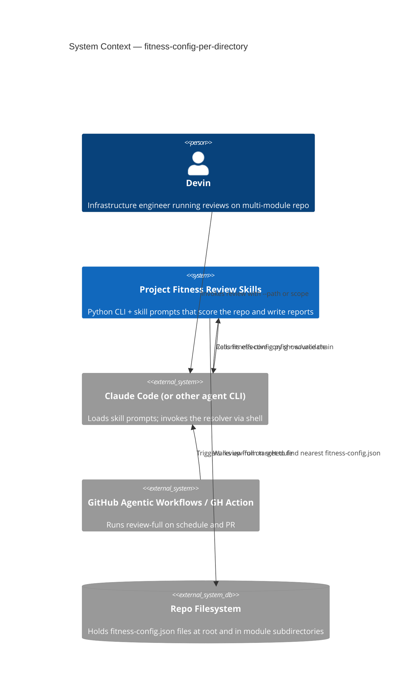
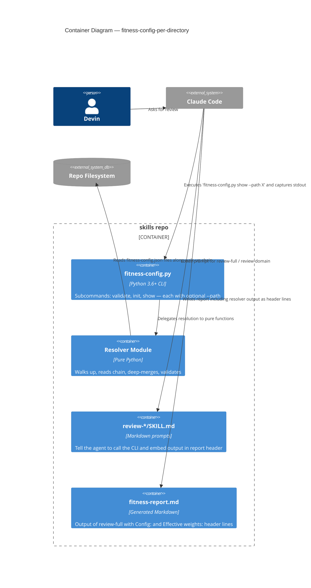
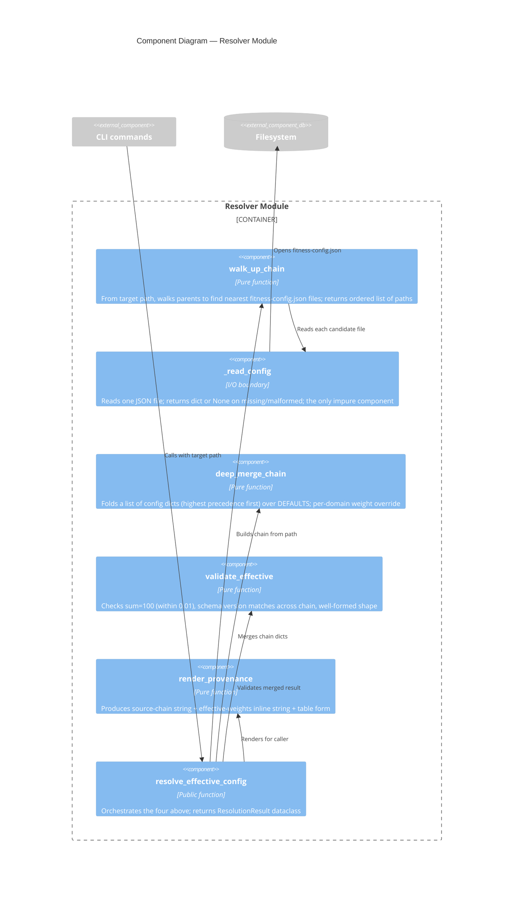

# Architecture Design — fitness-config-per-directory

**Wave**: DESIGN
**Date**: 2026-04-25
**Persona**: Morgan (nw-solution-architect)
**Feature**: fitness-config-per-directory
**Status**: DRAFT (pre-review)

---

## 1. Problem Statement and Quality Attributes

### 1.1 Problem
Today the `skills` repo loads a single root-level `fitness-config.json` for every fitness review, regardless of which subtree is being reviewed. Multi-module repositories (Devin Park's Terraform homelab being the canonical example) need module-specific weight overrides so reviews of `infrastructure/modules/postgresql/` weight `data` and `reliability` higher than reviews of `infrastructure/modules/networking/`.

### 1.2 Quality Attributes (priority order)

| # | Attribute (ISO 25010) | Why it dominates |
|---|----------------------|------------------|
| 1 | **Functional correctness / determinism** | The resolver MUST produce byte-identical output for identical input across runs and machines (NFR-2). Silent fallback on validation failure breaks user trust. |
| 2 | **Maintainability / testability** | Single solo maintainer; resolver logic must be a pure function so it can be unit-tested without filesystem fixtures. |
| 3 | **Backward compatibility** | Repos with no subdirectory configs MUST behave identically to today (NFR-3). Existing `tests/functional-tests.md` continues to pass. |
| 4 | **Performance** | Resolver overhead under 100 ms in a 10k-file repo (NFR-1). Walk-up is bounded by tree depth, so this is a soft target. |
| 5 | **Portability** | macOS, Linux, Windows; Python 3.6+ stdlib only (NFR-5). |
| 6 | **Discoverability / usability** | `show --path`, `init --path`, and report header lines together make the feature self-explanatory. |

Security and scalability are not driving attributes for this feature: the configs are local files in a single-developer's repo with no network surface and no untrusted input.

### 1.3 Constraints

| Constraint | Source | Implication |
|-----------|--------|-------------|
| Solo developer (Jeff) | Team structure | No microservices, no service-oriented anything; minimum operational overhead. |
| Python 3.6+, stdlib only | Existing `scripts/fitness-config.py` | No new dependencies (no `pydantic`, no `jsonschema` runtime); manual schema validation continues. |
| JSON Schema 2020-12 already declared | `fitness-config.schema.json` | Schema additions for v1 must remain backward-compatible (still version=1). |
| Existing CLI surface | `validate`, `init`, `show` already public | New flags are additive. Argument-less invocations preserve today's behavior. |
| Skill-prompt consumers (CI workflow + every `review-*/SKILL.md`) | Multiple readers | Resolver must be the single source of truth (BR-5/FR-7); we cannot tolerate silent drift. |

### 1.4 Conway's Law check
One developer, one repo, one deployment unit (the skills bundle). No team boundary to align with. The code organization just needs to keep concerns separable so future contributors can extend a single domain (e.g., add a new merge mode) without reading the entire script.

---

## 2. Existing System Analysis

### 2.1 Today's `scripts/fitness-config.py` shape

| Function | Role | Reusability |
|---------|------|-------------|
| `load(path)` | JSON file -> dict\|None | Reusable; expand error reporting |
| `validate_config(data)` | Sum-100 + confidenceThreshold range | Reusable; needs to operate on merged dict |
| `merge_defaults(data)` | One-level dict-spread of a single config over `DEFAULT_*` constants | Replace with N-arity deep merge |
| `cmd_validate(path)` | CLI entry: load + validate single file | Extend with `--path` mode |
| `cmd_init(path)` | CLI entry: write defaults to file | Extend with `--path` mode (seed from root effective) |
| `cmd_show(path)` | CLI entry: print merged config as JSON | Extend with `--path` mode (run resolver, render table+sum line) |

The script is already procedural-functional with pure data transforms separated from CLI commands. This shape supports the resolver extraction cleanly.

### 2.2 Current consumers of fitness-config

| Consumer | How it loads config today |
|---------|---------------------------|
| `src/review-full/SKILL.md` | Prose instruction: "If the project root contains `fitness-config.json`, read it and use its `weights` and `statusThresholds` for scoring." (No code; the agent reads it.) |
| `src/review-<domain>/SKILL.md` (10 of these) | Inconsistent — some reference fitness-config, some don't. (Per US-08, all must be unified.) |
| `.github/fitness-review-prompt.md` | Hardcoded weight numbers in prose (Architecture: 14%, Security: 14%, ...). Not driven by config today. |
| `.github/workflows/fitness-review.yml` | No direct config read. Sets up the agent which then follows the prompt. |
| `scripts/fitness-config.py` CLI | The validator/initializer/printer itself. |

**Migration implication**: Skill markdown files instruct the agent. The resolver must expose a CLI verb that any skill prompt can call — `python3 scripts/fitness-config.py show --path <target>` — and capture its output as the authoritative effective config. Skill prompts then reference the resolver call rather than inlining weight values.

### 2.3 What does NOT exist yet (clean greenfield within this scope)

- A walk-up algorithm (today's `load(path)` reads exactly one file at exactly one path).
- Multi-config merge — `merge_defaults` only merges one config with hardcoded defaults.
- Validation across a chain (sum-100 today validates a single file, not the merged result).
- A provenance/source-chain record type.
- A schema-version-mismatch check across files.
- A report header pattern naming the source chain (must be added to consuming skill prompts).

### 2.4 Integration points (to be reachable by the new resolver)

1. CLI subcommands (`validate`, `init`, `show`) — extend with `--path` flag.
2. Every `src/review-*/SKILL.md` — must reference the resolver (US-08).
3. `src/review-full/SKILL.md` — orchestrator that runs the resolver once and embeds output in the report header (US-03).
4. `.github/fitness-review-prompt.md` — switch from hardcoded weights to `Effective weights from <call to resolver>`.
5. `tests/functional-tests.md` — extend with override-aware scenarios per domain.
6. `tests/trigger-tests.md` — unchanged (trigger phrases are skill-level, not config-level).

---

## 3. Paradigm Decision

**Decision**: Functional paradigm for the resolver and merger; procedural-thin shell for CLI commands.

**Rationale**:
- Existing `scripts/fitness-config.py` already follows this style (pure `load`, `validate_config`, `merge_defaults`).
- The core resolution logic is a pure function from `(target_path, filesystem_view) -> EffectiveConfig`. Pure functions are trivially unit-testable without mocks.
- Python is multi-paradigm; functional style fits stdlib-only constraints (no class hierarchies needed).
- Filesystem I/O is isolated at the boundary (one `read_config_file(path)` function); the rest is in-memory data transforms.
- No state to maintain across invocations: the CLI runs to completion each call.

**Auto-mode note**: per the orchestrator's instruction, the agent should normally confirm paradigm with the user via AskUserQuestion before writing to CLAUDE.md. With auto mode active and the existing code already procedural-functional, this confirmation is deferred to a CLAUDE.md update at handoff. The choice does not block any AC.

---

## 4. Architecture Recommendation

### 4.1 Style: Modular library with dependency inversion at the I/O boundary

Within `scripts/fitness-config.py` (or a small `scripts/fitness_config/` package — see ADR-004), establish three logical modules with clear responsibilities:

| Module | Responsibility | I/O? |
|--------|---------------|------|
| **resolver** | Walk up from a path; collect chain of config dicts; return `(source_chain, raw_configs)` | Reads files (the only impure boundary) |
| **merger** | Deep-merge a chain of dicts into one effective config; pure function | None |
| **validator** | Validate effective config (sum=100, version match, schema shape); pure function | None |
| **reporter** | Render effective config + source chain as: human table (for `show`), inline header line (for skill prompts), error message (for validation failures); pure function | None |

Filesystem reading is the single impure boundary — exposed as a small `_read_config(path) -> dict | None` helper that the resolver calls. Tests substitute this with an in-memory dict map `{Path -> dict}` to drive the resolver without touching disk.

This is **hexagonal-lite** in spirit:
- Primary port: CLI command functions (`cmd_validate`, `cmd_init`, `cmd_show`).
- Secondary port: filesystem reader (`_read_config`).
- Core: resolver + merger + validator + reporter (pure).

We do not introduce explicit `Protocol` or ABC port classes — that ceremony is overkill for ~300 LOC of stdlib Python. The dependency inversion is achieved by passing the reader function as a parameter (or using a module-level rebindable hook in tests).

### 4.2 Alternatives Considered (see ADR-005 for the formal record)

| Alternative | Why rejected |
|-------------|--------------|
| **Monolithic script extension** (cram everything into the existing single file with no internal boundaries) | Works but loses unit-testability; resolver tests would need disk fixtures; review reuse would require running the CLI as a subprocess instead of importing functions. |
| **Plugin system** (registered config providers) | Resume-driven complexity. Five years from now there is still exactly one provider: `fitness-config.json`. |
| **Runtime config server** (long-running daemon serving effective configs over Unix socket) | Absurd for a solo dev local repo; introduces operational burden for zero benefit. |
| **Embed resolver into each `SKILL.md`** | Violates BR-5 (single source of truth); guarantees drift; impossible to unit-test. |

### 4.3 ISO 25010 mapping

| Attribute | How addressed |
|-----------|---------------|
| Correctness/determinism | Pure functions on copied dicts; no mutation of inputs; sorted iteration in merge to avoid Python dict-ordering surprises across versions |
| Testability | All non-I/O logic is pure; one I/O boundary mockable via reader parameter |
| Maintainability | Three clearly-named domain functions (resolve, merge, validate, render); each <50 LOC |
| Backward compatibility | Existing CLI args still work without `--path`; existing `merge_defaults(data)` semantics preserved when chain length = 1 |
| Performance | Walk-up is O(depth); reads at most depth files; merge is O(keys); for a 10-deep tree with 4 keys this is microseconds, not milliseconds |
| Portability | `pathlib.Path`, `json`, `argparse`, `sys` only |

---

## 5. C4 Diagrams

### 5.1 System Context (C4 Level 1)



### 5.2 Container (C4 Level 2)



### 5.3 Component (C4 Level 3) — Resolver Module Internal

The resolver module is the only place with non-trivial internal structure. (Other modules — CLI, prompts, report — are flat.)



---

## 6. Component Boundaries

See `component-boundaries.md` for the full table; summary here:

- **resolver** owns walk-up algorithm + I/O boundary
- **merger** owns deep-merge semantics
- **validator** owns sum-100 + version-match rules
- **reporter** owns rendering (table, inline line, error text)
- **CLI** owns argument parsing + exit codes; no business logic
- **skill prompts** own embedding the resolver output into review reports; no parsing/validation of their own

No two modules share a responsibility. Every consumer of the effective config goes through the resolver (BR-5).

---

## 7. Technology Stack

See `technology-stack.md`. Briefly:

| Layer | Choice | License | Rationale |
|-------|--------|---------|-----------|
| Language | Python 3.6+ stdlib | PSF | Continuity with existing `scripts/fitness-config.py`; cross-platform |
| JSON parsing | `json` (stdlib) | PSF | Already used; no new dependency |
| Path handling | `pathlib.Path` (stdlib) | PSF | Cross-platform path semantics |
| CLI | `argparse` (stdlib) | PSF | Already used |
| Test framework (when tests are added in DELIVER) | `pytest` | MIT | De facto Python test runner, OSS, mature, already part of dev tooling assumed |
| Architecture enforcement | `import-linter` config (optional) OR a simple `grep` audit step | MIT | A `grep` audit (no `json.load` of `fitness-config.json` outside the resolver module) is sufficient given project size; import-linter only needed if the script is split into a package |

No new runtime dependencies. No proprietary technology.

---

## 8. Integration Patterns

### 8.1 CLI as the integration boundary

The agent (Claude Code, Copilot, Codex) is the only consumer at runtime, and it always calls the CLI via shell. The CLI's stdout is the contract:

- `show --path X` prints a human-readable rendering AND a machine-parseable embedded JSON block (delimited by sentinels), so skill prompts can either show the human view to the user or extract the JSON for downstream processing. Format defined in `data-models.md`.
- `validate --path X` prints a human message and exits 0/1.
- `init --path X` writes a file and prints the created path.

### 8.2 Skill prompt -> CLI integration

Each `review-*/SKILL.md` will instruct the agent to:

1. Identify the review target path.
2. Run `python3 <skills-path>/scripts/fitness-config.py show --path <target>` and capture stdout.
3. Embed the rendered Config: and Effective weights: lines in the first 10 lines of the generated report.
4. Use the parsed effective weights to compute the weighted overall score.

This is an integration pattern — not an API contract — because the skill prompt is markdown-as-instruction to an LLM agent, not direct code-to-code. The agent acts as the integration runtime.

### 8.3 No external service integrations

This feature does not consume any third-party API. No contract testing required. (The only "external" integration is the local filesystem, which is in-process and not a contract boundary.)

---

## 9. Quality Attribute Strategies

### 9.1 Determinism (NFR-2)

- Walk-up uses `Path.resolve(strict=False)` to canonicalize symlinks before ascending.
- Merge iterates keys in `sorted()` order before applying overrides (Python 3.7+ guarantees insertion order, but we guard against pre-3.7 dict ordering).
- Output rendering sorts effective weights by descending value, ties broken alphabetically.
- Test: run resolver twice on same input fixture, byte-compare outputs.

### 9.2 Performance (NFR-1)

- Walk-up reads at most `depth` files (typically <10 in practice).
- Merge is O(total_keys) — well under a millisecond.
- No filesystem traversal beyond the walk-up chain (NO globbing, NO directory enumeration of subdirs).
- Test: 10-deep nested file in a 10k-file fixture; benchmark `show --path` 10 times; assert avg < 100 ms.

### 9.3 Backward compatibility (NFR-3)

- `validate` (no `--path`) defaults to today's behavior: read `fitness-config.json` at CWD, validate single file.
- `init` (no `--path`) defaults to creating `fitness-config.json` at CWD with DEFAULT_WEIGHTS.
- `show` (no `--path`) defaults to printing merged-with-defaults config of CWD's `fitness-config.json`.
- Existing functional tests run unchanged.

### 9.4 Fail-closed (NFR-4)

- The resolver raises `ResolutionError` (or returns a result with `valid=False` and an error message) on any failure (sum != 100, version mismatch, malformed JSON in any chain entry).
- CLI commands translate failures to exit code 1 BEFORE any review work is dispatched.
- The skill prompt explicitly instructs: "If `fitness-config.py show --path` exits non-zero, abort the review and surface the error verbatim."

### 9.5 Observability

- Every CLI invocation prints, on success, the source chain and effective totals — making the resolution self-documenting.
- On failure, error messages name all files in the chain and offer remediation (per AC-02.4 and AC-02.5).

---

## 10. Deployment Architecture

No deployment changes. The skills bundle is installed by `scripts/install-skills.sh` (via symlink or clone). The resolver lives in the same `scripts/fitness-config.py` location as today.

CI workflow (`.github/workflows/fitness-review.yml`) is unaffected at the structural level; only the prompt (`.github/fitness-review-prompt.md`) needs updating to reference resolver-driven weights instead of hardcoded percentages.

---

## 11. Architecture Enforcement

**Style**: Modular library with dependency inversion at the I/O boundary
**Language**: Python
**Tool recommendation**: Lightweight enforcement appropriate for a single-file ~300-LOC script:

1. **Primary mechanism — `grep` audit step in CI**:
   ```bash
   # Fail CI if any non-resolver code reads fitness-config.json directly
   ! grep -rn "json\.load.*fitness-config\.json\|open.*fitness-config\.json" \
       --include="*.py" --include="*.md" \
       --exclude-dir=docs \
       --exclude="scripts/fitness-config.py" .
   ```
   This implements BR-5 / FR-7 enforcement without needing any new tool.

2. **Secondary mechanism (only if the script is later split into a `scripts/fitness_config/` package)**: `import-linter` contracts:
   ```ini
   [importlinter:contract:io-isolation]
   name = Only resolver module touches the filesystem
   type = forbidden
   source_modules = scripts.fitness_config.merger, scripts.fitness_config.validator, scripts.fitness_config.reporter
   forbidden_modules = pathlib, builtins.open
   ```

For v1 (single-file script), the grep audit is sufficient. Move to import-linter only if/when ADR-004 splits the script.

Rules to enforce:
- No file outside `scripts/fitness-config.py` may directly `json.load()` a `fitness-config.json`.
- Every `review-*/SKILL.md` must reference `fitness-config.py show --path` for runtime weight resolution.

---

## 12. Decisions Resolving Open Questions (DQ-1..DQ-5)

Each DQ is resolved with a dedicated ADR; this section is the index. See `docs/adrs/` for the full records.

| DQ | Decision | ADR |
|----|---------|-----|
| DQ-1 | Discovery rule = walk-up only for v1; explicit `--config` flag deferred to v2 | ADR-001 |
| DQ-2 | Merge semantics = deep-merge per top-level key, per domain weight; no opt-in full-replacement mode in v1 | ADR-002 |
| DQ-3 | Schema version mismatch = hard error (exit 1) | ADR-003 |
| DQ-4 | Resolver lives in `scripts/fitness-config.py` as a single file with internal logical modules; SKILL.md files call it via shell | ADR-004 |
| DQ-5 | Broad-scope reviews (target path is at or above the override directory) use only the root config; subtree overrides apply only when the review target is within the override's directory; documented as a known v1 limitation | ADR-005 |

ADR-006 records the architectural style choice (modular library with dependency inversion at I/O boundary) and the alternatives.

---

## 13. Risks (architecture level)

| Risk | Mitigation |
|------|-----------|
| Skill prompts (markdown-as-instruction) drift from CLI contract over time | Embed the exact CLI invocation string in `tests/functional-tests.md`; CI grep audit detects direct config reads. |
| Walk-up performance degrades on extremely deep trees | NFR-1 budget is 100 ms; trees deeper than 100 levels are pathological. Hard cap walk-up at 64 levels with a clear error if exceeded. |
| Future schema v2 breaks chain merging | ADR-003 enforces hard mismatch error today; future migration tooling is documented as out-of-scope (R-out). |
| `fitness-config.json` files committed in unintended subdirectories (e.g. test fixtures) accidentally override real reviews | Walk-up always names the resolved file in the report header (US-03); a misplaced override is immediately visible to the reviewer. |

---

## 14. Handoff to DEVOPS / DISTILL

See `wave-decisions.md` for the consolidated handoff package.

Key annotations:
- **No external integrations** -> no contract test recommendations.
- **Architecture enforcement** -> grep-based CI audit step (immediate); import-linter (future, if package-split happens).
- **Paradigm** -> functional Python; pure resolver/merger/validator/reporter functions; one mockable I/O boundary.
- **Test strategy** -> pure-function unit tests for merge/validate; in-memory filesystem fixtures for walk-up; one end-to-end CLI test per CLI verb.
