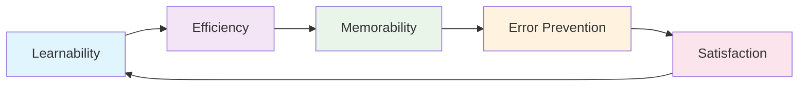

# Domain Knowledge Reference

Auto-generated from blog posts. Do not edit manually.
Last updated: 2026-03-03

---

## Source: fundamentals-of-software-accessibility

URL: https://jeffbailey.us/blog/2025/11/30/fundamentals-of-software-accessibility

## Introduction

Why do some websites work for everyone while others exclude users with disabilities? The difference is understanding accessibility fundamentals.

Accessibility means building interfaces that everyone can use, regardless of ability. Sound accessibility practices create inclusive experiences. Poor accessibility creates barriers that exclude users and can lead to legal issues.

Most developers know accessibility matters, but many lack fundamentals. Building without this creates interfaces that work for some users but not all. Understanding accessibility ensures interfaces work for everyone.

**What this is (and isn't):** This article explains accessibility principles and trade-offs, focusing on *why* accessibility works and how core pieces fit together. It doesn't cover every legal requirement or provide a compliance checklist.

**Why accessibility fundamentals matter:**

* **Inclusive experiences** - Understanding accessibility helps you build interfaces that work for all users.
* **Better code** - Accessible code, like semantic HTML and proper form labels, enhances quality and maintainability.
* **Broader user base** - Millions of users have disabilities affecting how they use interfaces.
* **Business value** - Accessible interfaces serve more users and improve business outcomes.

Mastering accessibility fundamentals moves you from building for some users to building for everyone.

This article outlines a basic workflow for every project:

1. **Semantic HTML** – give the page a meaningful structure.
2. **Keyboard navigation** – make that structure operable without a mouse.
3. **ARIA** – fill in the gaps when HTML alone isn't enough.
4. **Testing** – verify that real users and assistive tech can actually use what you built.

> Type: **Explanation** (understanding-oriented).  
> Primary audience: **beginner to intermediate** developers learning accessibility fundamentals

### Prerequisites & Audience

**Prerequisites:** You should be familiar with basic HTML, CSS, and JavaScript. No prior accessibility experience is needed.

**Primary audience:** Beginner to intermediate developers, including full-stack engineers, seeking a stronger foundation in accessibility.

**Jump to:**

* [What is Accessibility?](#section-1-what-is-accessibility--building-for-everyone)
* [Semantic HTML](#section-2-semantic-html--the-foundation-of-accessibility)
* [Keyboard Navigation](#section-3-keyboard-navigation--ensuring-keyboard-accessibility)
* [ARIA and Assistive Technologies](#section-4-aria-and-assistive-technologies--enhancing-html)
* [Testing and Validation](#section-5-testing-and-validation--ensuring-accessibility)
* [Common Mistakes](#section-6-common-accessibility-mistakes--what-to-avoid)
* [Misconceptions](#section-7-misconceptions-and-when-not-to-use)
* [Future Trends](#future-trends--evolving-standards)
* [Limitations & Specialists](#limitations--when-to-involve-specialists)
* [Glossary](#glossary)

If you're new to accessibility, start with semantic HTML and keyboard navigation. Experienced developers can focus on ARIA and advanced testing techniques.

**Escape routes:** If you need a refresher on semantic HTML and keyboard navigation, read Sections 2 and 3, then skip to "Common Accessibility Mistakes".

### TL;DR – Accessibility Fundamentals in One Pass

If you only remember one workflow, make it this:

* **Use semantic HTML** so assistive technologies can understand your page.
* **Guarantee keyboard navigation** so nobody is blocked by mouse-only interactions.
* **Add ARIA only when HTML can't express your intent.**
* **Test with tools *and* humans** (keyboard + screen reader) so you know it actually works.

**The Accessibility Workflow:**

The following diagram shows the four-step accessibility workflow: Semantic HTML provides the foundation, Keyboard Navigation ensures operability, ARIA Enhancements fill gaps when needed, and Testing validates with both automated tools and manual testing.

```text
┌────────────────────────────┐
│ Semantic HTML (meaning)    │
└─────────────┬──────────────┘
              ↓
┌────────────────────────────┐
│ Keyboard Navigation         │
│ (operability for everyone)  │
└─────────────┬──────────────┘
              ↓
┌────────────────────────────┐
│ ARIA Enhancements           │
│ (only when needed)          │
└─────────────┬──────────────┘
              ↓
┌────────────────────────────┐
│ Testing (automated + manual)│
└────────────────────────────┘
```

### Learning Outcomes

By the end of this article, you will be able to:

* Explain **why** semantic HTML enhances accessibility and when to use various HTML elements.
* Describe **why** keyboard navigation is critical (beyond screen readers) and how it shapes interface design.
* Explain **why** ARIA attributes enhance HTML and when to use them versus semantic HTML.
* Learn how screen readers work and how to structure content for assistive technology.
* Describe how color contrast affects readability and when contrast ratios meet Web Content Accessibility Guidelines (WCAG) standards.
* Explain how accessibility testing tools work and when to use automated versus manual testing.

## Section 1: What is Accessibility? – Building for Everyone

Accessibility means building interfaces that everyone can use, regardless of ability. This includes users with visual, auditory, motor, and cognitive disabilities.

### Understanding Disability Types

Different disabilities affect how users interact with interfaces:

**Visual disabilities:** Users who are blind, have low vision, or are color blind need interfaces that work without visual cues. Screen readers, high contrast modes, and keyboard navigation help these users.

**Auditory disabilities:** Users who are deaf or hard of hearing need captions, transcripts, and visual indicators for audio content.

**Motor disabilities:** Users with limited dexterity or mobility need keyboard navigation, voice control, and interfaces that don't require precise mouse movements.

**Cognitive disabilities:** Users with attention, memory, or processing differences need clear navigation, consistent patterns, and simplified interfaces.

### Why Accessibility Matters

Accessibility is ethical, inclusive, and legally mandated by laws such as the ADA (US), AODA (Canada), Section 508 (US Federal), and EAA (EU). Following WCAG AA reduces risk and broadens access.

**Ethical responsibility:** Building inaccessible interfaces excludes users. Everyone deserves access to online information and services.

**Business value:** Accessible interfaces serve more users, boost Search Engine Optimization (SEO), and enhance user experiences.

**Better code:** Accessible coding practices, such as semantic HTML and proper form labels, enhance maintainability and robustness.

### The Web Content Accessibility Guidelines (WCAG)

The Web Content Accessibility Guidelines (WCAG) are international standards for web accessibility, organized by four principles:

**Perceivable:** Information should be perceptible through text alternatives for images, video captions, and adequate color contrast.

**Operable:** Interface components must be accessible to all users, including keyboard access, seizure-safe content, and sufficient time for tasks.

**Understandable:** Information and interface operation must be understandable, including readable text, predictable functionality, and input assistance.

**Robust:** Content must be robust for current and future assistive technologies, using valid HTML and proper ARIA attributes.

WCAG has three conformance levels: A (minimum), AA (standard), and AAA (enhanced). Most organizations aim for AA compliance.

### The Accessibility Workflow

Building accessible interfaces is a logical process, like building a house: start with a solid foundation, add structural elements, then enhance with details.

**Foundation: Semantic HTML** - Start with semantic HTML that conveys meaning, like using proper building materials instead of cardboard. A house needs a solid foundation, and your interface needs semantic HTML as its base.

**Structure: Keyboard Navigation** - Ensure all interactive elements work with keyboards. Keyboard navigation is like installing doors and hallways accessible for everyone, not just those who can climb walls. It creates pathways through your interface.

**Enhancement: ARIA Attributes** - Add ARIA when semantic HTML isn't enough, like signage for unclear layouts. ARIA offers extra cues when structure needs clarification.

**Validation: Testing** - Test with automated tools and assistive technologies. Automated tools verify code compliance, while manual testing with assistive technologies confirms usability.

This workflow integrates accessibility from the start, not retroactively. Each step builds on the last: semantic HTML ensures understandability, keyboard navigation ensures operability, ARIA addresses gaps, and testing confirms usability.

## Section 2: Semantic HTML – The Foundation of Accessibility

Semantic HTML employs elements that convey meaning, aiding screen readers and assistive tech in understanding and navigating content.

Think of semantic HTML like a book's table of contents. Just as chapter titles help readers understand a book's structure, semantic HTML elements help assistive technologies understand a webpage's structure. A `<button>` element tells screen readers "this is a button", the same way a chapter title tells readers "this is a new section."

### What Makes HTML Semantic

Semantic HTML uses descriptive elements; a `<button>` indicates a button to assistive tech, unlike a `<div>` with a click handler.

**Semantic elements:** HTML5 introduced semantic elements like `<header>`, `<nav>`, `<main>`, `<article>`, `<section>`, `<aside>`, and `<footer>`, aiding screen readers and search engines in understanding content structure.

**Form elements:** Use proper form elements like `<label>`, `<input>`, `<select>`, and `<textarea>`. Connect labels to inputs using the `for` attribute, or wrap inputs in labels.

**Heading hierarchy:** Use heading elements (`<h1>` through `<h6>`) to create a logical document outline. Don't skip heading levels, and use headings to organize content, not for styling.

### Semantic HTML Examples

Here's an example of semantic HTML structure:

```html
<header>
  <nav aria-label="Main navigation">
    <ul>
      <li><a href="/">Home</a></li>
      <li><a href="/about">About</a></li>
      <li><a href="/contact">Contact</a></li>
    </ul>
  </nav>
</header>

<main>
  <article>
    <h1>Article Title</h1>
    <p>Article content goes here.</p>
  </article>
</main>

<footer>
  <p>© 2025 Company Name</p>
</footer>
```

This structure helps screen readers understand the page layout and navigate efficiently.

### Why Semantic HTML Works

Semantic HTML helps browsers and assistive tech create an accessibility tree that shows your content's structure and meaning. Using semantic elements clarifies each part's function.

Browsers add default behaviors to semantic elements. For example, a `<button>` gets keyboard focus, responds to Enter and Space, and announces itself as a button for screen readers. In contrast, a `<div>` with a click handler lacks these behaviors, making semantic HTML more accessible.

Semantic HTML enhances SEO by using semantic structure, helping search engines better understand and index content, just as it improves screen reader accessibility.

### Trade-offs and Limitations of Semantic HTML

Semantic HTML has limitations, and sometimes you need custom components without semantic equivalents. For example, complex date pickers or custom dropdowns require ARIA attributes to convey their purpose.

Semantic HTML is a foundation, but it's not a complete fix for accessibility; it also requires proper contrast, keyboard navigation, and testing. It's like a house that needs doors, windows, and an inspection to be livable.

### When Semantic HTML Isn't Enough

Sometimes, semantic HTML lacks enough info for assistive tech. Use semantic HTML first, then add ARIA only if needed.

### Quick Check: Semantic HTML

Before moving on, test your understanding:

* Can you identify which HTML elements in your project are semantic versus presentational?
* Do your forms use proper `<label>` elements connected to inputs?
* Is your heading hierarchy logical without skipping levels?

If unsure, audit one page of your project to identify where semantic HTML could replace `<div>` or `<span>` elements.

**Answer guidance:** **Ideal result:** You can identify semantic elements (like `<button>`, `<nav>`, `<article>`) and distinguish them from presentational elements (like `<div>` or `<span>`). Your forms use proper `<label>` elements, each connected to an input via the `for` attribute. Your heading hierarchy follows a logical order (h1 → h2 → h3) without skipping levels.

If you found mostly presentational elements, review Section 2's semantic HTML examples. Replace `<div>` elements used for buttons with `<button>`, navigation containers with `<nav>`, and content sections with semantic elements like `<article>` or `<section>`. Use the W3C HTML Validator to check your HTML structure.

## Section 3: Keyboard Navigation – Ensuring Keyboard Accessibility

Keyboard navigation ensures that all interactive elements work without a mouse, supporting users with motor disabilities, keyboard users, and screen reader users.

Think of keyboard navigation as a guided tour. The Tab key advances through interactive elements, focus indicators show your location, and skip links let you jump to specific sections.

### How Keyboard Navigation Works

Keyboard users navigate using the Tab key to move forward, Shift+Tab to move backward, Enter or Space to activate buttons, and arrow keys to navigate within components.

**Tab order:** Elements receive focus in the order they appear in the HTML. The browser follows the document order, creating a predictable navigation path. Use `tabindex` to control focus order, but avoid `tabindex` values greater than 0 unless necessary.

Why this matters: When you use `tabindex="0"`, you add an element to the natural tab order. When you use `tabindex="1"` or higher, you create a custom order that can confuse users. Screen reader users expect focus to follow document order, and breaking that expectation creates navigation problems.

**Focus indicators:** Visible focus indicators show users where they are. Browsers provide default focus styles, but you can customize them. Never remove focus indicators.

*Why this matters:* Without focus indicators, keyboard users can't tell what has focus, like being in a dark room without a flashlight.

Focus indicators are essential for keyboard navigation and should never be removed.

**Skip links:** Skip links let keyboard users skip navigation to the main content, saving time and improving the experience.

*Why this matters:* Keyboard users shouldn't tab through many links to reach content. Skip links offer direct access to the main content, enhancing efficiency.

### Keyboard Navigation Examples

Here's an example of a keyboard-accessible navigation menu:

```html
<nav aria-label="Main navigation">
  <a href="#main-content" class="skip-link">Skip to main content</a>
  <ul>
    <li><a href="/">Home</a></li>
    <li><a href="/about">About</a></li>
    <li><a href="/contact">Contact</a></li>
  </ul>
</nav>

<main id="main-content">
  <!-- Main content here -->
</main>
```

The skip link lets keyboard users jump to the main content, and all navigation links are accessible via keyboard.

### Focus Management

Focus management guides the logical focus flow in interfaces, including dynamic content such as modals and dropdowns.

**Trapping focus:** In modals, trap focus within the modal so users can't tab to content behind it. Return focus to the triggering element when the modal closes.

*Why this matters:* Without focus trapping, keyboard users can tab into content behind a modal, which is confusing and breaks the modal's purpose. Focus trapping keeps users within the modal until they close it.

**Moving focus:** When content changes, move focus appropriately. For example, when opening a modal, move focus to the modal's first focusable element.

*Why this matters:* When you open a modal, keyboard focus should move to the modal so users can interact with it immediately. If focus stays on the button that opened the modal, users might not realize the modal opened.

**Announcing changes:** Use ARIA live regions to announce dynamic content changes to screen reader users.

*Why this matters:* Screen reader users must be notified of content changes; without announcements, they might miss vital updates, such as errors and success messages.

### Trade-offs and Limitations of Keyboard Navigation

Keyboard navigation has limitations, especially for drag-and-drop or complex gestures. Provide alternative keyboard-accessible methods.

Keyboard navigation needs careful planning because dynamic content can confuse users by changing focus order. Test thoroughly, especially in single-page apps that update content without reloading.

### Quick Check: Keyboard Navigation

Test your understanding:

* Can you navigate your interface using only the keyboard?
* Do all interactive elements receive focus in a logical order?
* Are focus indicators visible on all focusable elements?
* Do modals trap focus and return it when closed?

Try navigating your latest project with only the keyboard. Note where you get stuck or confused, then fix those issues.

**Answer guidance:** **Ideal result:** You can navigate your interface seamlessly, with focus moving logically through all elements and clearly visible indicators. Modals trap focus and return it to the trigger when closed.

If you couldn't navigate your entire interface, review Section 3's focus management and keyboard navigation patterns. Check that all interactive elements are focusable and that focus order follows document order. If modals don't trap focus, implement focus trapping as described in Section 3.

Review Section 3's focus management and keyboard navigation if you can't navigate your interface. Ensure all interactive elements are focusable, with focus order in document order. If modals don't trap focus, implement focus trapping as outlined.

Reuse these questions as interview prompts or discussion starters to spread the fundamentals of accessibility across your team.

## Section 4: ARIA and Assistive Technologies – Enhancing HTML

ARIA (Accessible Rich Internet Applications) attributes enhance HTML when semantic elements fall short, providing extra information to assistive technologies.

Think of ARIA like movie subtitles: they provide extra information for assistive tech, just as subtitles aid viewers. But don't add ARIA to semantic HTML that already communicates meaning, just as you wouldn't add subtitles to a silent film that shows everything visually.

### Semantic HTML vs ARIA at a Glance

Knowing when to use semantic HTML or ARIA is crucial for accessibility. This comparison clarifies the trade-offs.

**Semantic HTML:**

* **When to use it:** Default for all standard UI elements.
* **Strengths:** Built-in keyboard and assistive technology support, simpler code, better performance.
* **Limitations:** May not cover highly custom interactions.

**ARIA:**

* **When to use it:** Custom widgets or complex, dynamic interactions.
* **Strengths:** Can describe rich behavior to assistive technologies.
* **Limitations:** Easy to misuse, must stay in sync with JavaScript.

Knowing when to use semantic HTML or ARIA is crucial for accessibility. This comparison clarifies the trade-offs.

**Three quick rules of thumb:**

1. If a **native HTML element exists** (e.g., button, link, or input), use it instead of ARIA.
2. If you build a **custom widget**, prove it works with keyboard-only and a screen reader *before* layering on extra ARIA.
3. If ARIA and native semantics disagree, **the browser wins** and users lose—fix the HTML first.

### Quick Reference: Accessibility Patterns at a Glance

**A clickable control:**

* **Use:** `<button>`
* **Avoid:** `<div role="button">`

**Navigation areas:**

* **Use:** `<nav>`
* **Avoid:** Generic containers

**Hidden live updates:**

* **Use:** `aria-live="polite"`
* **Avoid:** Silent DOM text changes

**Menus/dialogs:**

* **Use:** roles + labels + keyboard trapping
* **Avoid:** mouse-only click toggles

This quick reference guides your choices; when unsure, use semantic HTML.

### What ARIA Does

ARIA doesn't alter appearance or behavior; it provides information to assistive technologies by communicating roles, properties, and states.

**ARIA roles:** Roles clarify element purpose; use roles like `button`, `dialog`, `navigation`, and `region` when HTML lacks semantic meaning.

**ARIA labels:** Labels provide text alternatives. Use `aria-label` for elements without visible text, and `aria-labelledby` to reference existing labels.

**ARIA states:** States indicate element conditions. Use `aria-expanded`, `aria-hidden`, `aria-disabled`, and `aria-checked` to convey dynamic states.

**ARIA properties:** Properties provide additional information. Use `aria-describedby` to reference descriptive text, and `aria-required` to indicate required form fields.

### When to Use ARIA

Use ARIA when semantic HTML isn't sufficient:

**Custom components:** Use ARIA to communicate purpose when building custom interactive components without semantic HTML.

**Dynamic content:** Use ARIA live regions to announce dynamic content changes to screen reader users.

**Complex widgets:** Use ARIA to communicate structure and behavior when building complex widgets, such as date pickers or autocomplete fields.

### When NOT to Use ARIA

ARIA isn't always necessary. Avoid using ARIA when:

* Semantic HTML elements already provide the needed meaning (`<button>` instead of `<div role="button">`).
* You're using ARIA to fix problems that semantic HTML would solve better.
* ARIA attributes conflict with native element semantics.
* You're adding ARIA without understanding how assistive technologies use it.

Use semantic HTML first, then add ARIA if needed.

### Trade-offs and Limitations of ARIA

ARIA has trade-offs that add complexity and require maintenance. ARIA attributes must stay synced with element behavior; if JavaScript changes but ARIA doesn't update, it can break.

ARIA has compatibility issues because screen readers interpret ARIA attributes differently, and some attribute combinations conflict. Testing with assistive tech is essential.

Performance matters. While ARIA attributes don't affect performance, complex ARIA-dependent components can slow down. Custom widgets with extensive ARIA may be slower than native elements.

### ARIA Examples

Here's an example of ARIA used appropriately:

```html
<button aria-expanded="false" aria-controls="menu" id="menu-button">
  Menu
</button>

<ul id="menu" aria-labelledby="menu-button" hidden>
  <li><a href="/">Home</a></li>
  <li><a href="/about">About</a></li>
  <li><a href="/contact">Contact</a></li>
</ul>
```

The `aria-expanded` attribute indicates whether the menu is open, `aria-controls` links the button to the menu, and `aria-labelledby` associates the menu with its label.

### Screen Readers and Assistive Technologies

Screen readers are software that read content aloud for users who are blind or have low vision. Knowing how they work helps create accessible interfaces.

**How screen readers work:** Screen readers navigate the accessibility tree from HTML and ARIA, announcing elements, roles, states, and content.

**Navigation patterns:** Screen reader users navigate with keyboard shortcuts, jumping by headings, landmarks, links, and form controls.

**Content structure:** Screen readers depend on the heading hierarchy, semantic HTML, and ARIA attributes for navigating content.

### Why Screen Readers Work This Way

Screen readers use the same accessibility tree from semantic HTML and ARIA. A clear structure ensures straightforward navigation; a messy one confuses.

Screen reader users use keyboard shortcuts to navigate because they cannot see the visual layout. They jump by headings for structure, landmarks for sections, and links for pages. Semantic structure is crucial as it shapes the navigation model.

### Quick Check: ARIA and Screen Readers

Test your understanding:

* Do you understand when to use ARIA versus semantic HTML?
* Can you identify ARIA attributes that might conflict with native element semantics?
* Have you tested your ARIA implementations with actual screen readers?

Review your project for ARIA usage, identify where semantic HTML could replace ARIA, and ensure ARIA attributes align with element behavior.

**Answer guidance:** **Ideal result:** You understand that semantic HTML should be your default choice, and ARIA is only for cases where semantic HTML isn't sufficient (custom widgets, complex interactions). You can identify when ARIA attributes might conflict with native element semantics. You've tested your ARIA implementations with a screen reader to verify announcements make sense.

If you're unsure about when to use ARIA, review Section 4's "When to Use ARIA" and "When NOT to Use ARIA" subsections. Test with NVDA (free) or VoiceOver (macOS) to see how your ARIA attributes are announced.

Semantic HTML forms the foundation, keyboard navigation is the doorway, and ARIA is the signage added when needed. More signs don't improve a building—just the right signs do. Use ARIA sparingly, test thoroughly, and prioritize semantic HTML when adequate.

## Section 5: Testing and Validation – Ensuring Accessibility

Testing ensures interfaces meet accessibility standards by using automated tools to catch issues and manual testing with assistive technologies.

Accessibility testing is like quality assurance: automated tools catch obvious defects quickly, like machines checking for manufacturing flaws, while manual testing detects subtle issues needing human judgment, like inspectors spotting design problems.

### Automated Testing Tools

Automated tools quickly identify many accessibility issues, such as missing alt text, low contrast, and absent form labels. However, they can't assess if alt text is meaningful, keyboard navigation is logical, or ARIA attributes are correct.

Understanding *why* they miss specific problems helps avoid relying solely on automated accessibility scores.

**axe DevTools:** Browser extension that tests pages for WCAG violations and offers guidance on fixing issues.

**WAVE:** Web accessibility tool visualizes issues on pages, showing errors, warnings, and features.

**Lighthouse:** Google's tool offers accessibility audits, scores, and improvement suggestions.

**HTML validators:** Valid HTML tends to be more accessible. Use the W3C HTML Validator to check for errors.

**CI/CD integration:** Integrate automated accessibility testing into your workflow using tools like `axe-core` in pipelines and Storybook's add-on to catch issues during development, preventing problems before code reaches production.

### Why Automated Testing Has Limits

Automated tools detect code patterns, missing alt text, and color contrast, but can't judge if alt text is meaningful or if color alone conveys information.

Automated tools can't test user experience, like keyboard navigation or screen reader announcements. Manual testing with assistive technologies is essential.

### Manual Testing

Manual testing catches issues automated tools miss:

**Keyboard testing:** Navigate the interface using only the keyboard, ensuring all elements are reachable and usable.

**Screen reader testing:** Test with screen readers like NVDA (Windows), JAWS (Windows), or VoiceOver (macOS). Experience how screen reader users interact with your interface.

**Quick start:** Try VoiceOver right now: press Command + F5 → Tab around → use Control + Option + Arrow keys to move through the accessibility tree. This single line turns theory into action.

**Color contrast testing:** Check color contrast ratios using tools like WebAIM's Contrast Checker. Ensure text meets WCAG contrast requirements.

**Zoom testing:** Test interfaces at 200% zoom to ensure content remains usable. Many users with low vision rely on browser zoom.

**Reduced motion testing:** Test with `prefers-reduced-motion` enabled. Many users with vestibular disorders need animations slowed or disabled. Respect the system preference by using CSS media queries like `@media (prefers-reduced-motion: reduce)` to disable or slow animations.

**System preference check:** Enable `prefers-reduced-motion` in your operating system settings, then test your interface. Animations should slow or disable automatically when this preference is enabled.

### Testing Checklist

Use this checklist when testing for accessibility:

* All images have appropriate alt text.
* All form inputs have associated labels.
* All interactive elements are keyboard accessible.
* Focus indicators are visible on all focusable elements.
* Color contrast meets WCAG AA standards (4.5:1 for normal text, 3:1 for large text).
* Heading hierarchy is logical and doesn't skip levels.
* ARIA attributes are used correctly and only when necessary.
* Dynamic content changes are announced to screen reader users.
* Content is readable and functional at 200% zoom.
* No content relies solely on color to convey information.
* Animations respect `prefers-reduced-motion` system preference.

### Trade-offs in Testing Approaches

Understanding *why* different testing approaches have different strengths helps you build a testing strategy that catches both obvious and subtle accessibility issues. Automated testing is fast but limited. Manual testing is thorough but time-consuming. The best approach combines both: use automated tools to catch common issues quickly, then perform manual testing for complex interactions and user experience.

#### Example: Automated vs Manual Testing

Consider a modal dialog that opens when users click a button. Automated testing with axe DevTools might report a perfect score: the button has proper ARIA attributes, the modal has correct roles, and all elements are keyboard accessible. However, manual testing with a screen reader reveals the modal announcement happens twice—once from the ARIA live region and once from the modal's role announcement. This redundant announcement confuses screen reader users, but automated tools can't detect it because the code technically follows ARIA patterns correctly.

This example illustrates why both approaches matter: automated tools catch structural issues (missing labels, low contrast), while manual testing catches user experience problems (confusing announcements, illogical focus order).

Testing with assistive technologies requires learning how they work. This takes time but provides insights that automated tools can't. Budget time for learning screen readers and keyboard navigation patterns.

### Quick Check: Testing

Test your understanding:

* Have you run automated accessibility tests on your project?
* Can you navigate your interface using only a keyboard?
* Have you tested with a screen reader?
* Do you know how to check color contrast ratios?

Set up automated testing in your development workflow, then schedule time for manual testing with assistive technologies.

**Answer guidance:** **Ideal result:** You've run automated tests (axe or Lighthouse), fixed the issues they found, can navigate your entire interface with only the keyboard, and have verified screen reader announcements on your main flows. You know how to check color contrast ratios using tools like WebAIM's Contrast Checker.

If you haven't run automated tests, start with axe DevTools or Lighthouse. If you haven't tested with assistive technologies, begin with keyboard navigation testing, then add screen reader testing. Review Section 5's testing checklist to ensure comprehensive coverage.

## Section 6: Common Accessibility Mistakes – What to Avoid

Common mistakes create barriers for users. Understanding these mistakes helps you avoid them.

### Missing Alt Text

Images without alt text are inaccessible to screen reader users. Provide descriptive alt text for informative images, or empty alt attributes for decorative images.

**Incorrect:**

```html

```

**Correct:**

```html

```

### Poor Keyboard Navigation

Interfaces that rely solely on mouse interactions exclude keyboard users. Make all interactive elements keyboard accessible.

**Incorrect:**

```html
<div onclick="submitForm()">Submit</div>
```

**Correct:**

```html
<button type="submit">Submit</button>
```

### Low Color Contrast

Text with low contrast is difficult to read for many users. Check contrast ratios to meet WCAG standards.

**Incorrect:** Light gray text on a white background (contrast ratio 2:1).

**Correct:** Dark text on a white background (contrast ratio 4.5:1 or higher).

### Missing Form Labels

Form inputs without labels confuse screen reader users. Always associate labels with inputs.

**Incorrect:**

```html
<input type="text" placeholder="Enter your name">
```

**Correct:**

```html
<label for="name">Enter your name</label>
<input type="text" id="name" name="name">
```

### Inaccessible Dynamic Content

Content that changes without announcements confuses screen reader users. Use ARIA live regions to announce dynamic updates.

**Incorrect:**

```html
<div id="status"></div>
<script>
  document.getElementById('status').textContent = 'Form submitted successfully';
</script>
```

**Correct:**

```html
<div id="status" aria-live="polite" aria-atomic="true"></div>
<script>
  document.getElementById('status').textContent = 'Form submitted successfully';
</script>
```

### Overusing ARIA

Using ARIA when semantic HTML would work creates unnecessary complexity. Use semantic HTML first, then add ARIA only when needed.

**Incorrect:**

```html
<div role="button" tabindex="0" onclick="handleClick()">Click me</div>
```

**Correct:**

```html
<button onclick="handleClick()">Click me</button>
```

### Quick Check: Common Mistakes

Test your understanding:

* Can you identify images in your project that lack alt text?
* Do all your form inputs have associated labels?
* Are there any interactive elements that only work with mouse clicks?
* Does your interface rely solely on color to convey information?

**Answer guidance:** **Ideal result:** All images have appropriate alt text (descriptive for informative images, empty for decorative). All form inputs have associated labels connected via the `for` attribute. All interactive elements work with keyboards, not just mouse clicks. Information is never conveyed solely through color—text labels or icons accompany color coding.

If you found any issues, review the corresponding sections above. For images, add descriptive alt text or empty alt attributes for decorative images. For forms, connect labels using the `for` attribute. For mouse-only interactions, replace them with semantic HTML elements that work with keyboards. For color-only information, add text labels or icons.

### Common Component Audit Examples

Here are specific examples of how to audit common interface components:

**Modal dialogs:**

* **Good implementation:** Focus trap + return focus to trigger + ARIA labelling (`role="dialog"`, `aria-labelledby`, `aria-describedby`).
* **Common failure:** Opens visually but no focus shift, focus escapes to background content, no keyboard close option.

**Tab interfaces:**

* **Good implementation:** `<button role="tab">` with arrow key navigation, proper `aria-selected` states, `aria-controls` linking to panels.
* **Common failure:** List of clickable `<div>` elements, no keyboard navigation, no ARIA roles or states.

**Form error messages:**

* **Good implementation:** Announced via `aria-live="polite"` or `aria-live="assertive"`, associated with inputs via `aria-describedby`.
* **Common failure:** Only visible text, no announcement to screen readers, errors appear but aren't discoverable.

These examples show how the fundamentals apply to real components. Audit your components against these patterns.

## Section 7: Misconceptions and When Not to Use

Common misconceptions about accessibility create barriers. Understanding these misconceptions helps you avoid them.

### Misconception: ARIA Fixes Everything

ARIA doesn't fix accessibility problems. It only provides information to assistive technologies. If your interface isn't keyboard accessible, ARIA won't make it keyboard accessible. If your color contrast is too low, ARIA won't fix it.

**What to do instead:** Start with semantic HTML elements that provide built-in accessibility. Use `<button>` instead of `<div role="button">`. Use `<nav>` instead of `<div role="navigation">`. Only add ARIA when semantic HTML isn't sufficient, such as for custom widgets or dynamic content announcements. Test keyboard navigation before adding ARIA attributes.

**Example:** Instead of using `<div role="button" tabindex="0">`, use `<button>`. The button element provides keyboard support, focus management, and screen reader announcements automatically.

### Misconception: Automated Testing Is Enough

Automated testing catches many issues, but it can't catch everything. Manual testing with assistive technologies is essential. Automated tools can't tell if keyboard navigation is logical or if screen reader announcements make sense.

**What to do instead:** Set up automated testing in your continuous integration pipeline to catch common issues. Then schedule weekly manual testing sessions where you navigate your interface using only the keyboard and test with a screen reader. Document keyboard navigation patterns and screen reader announcements for complex components.

**Example:** Run axe DevTools on every pull request to catch missing alt text and low contrast. Then, during code review, manually test new interactive components with keyboard navigation and screen reader announcements.

### Misconception: Accessibility Is Only for Screen Reader Users

Accessibility benefits all users, not just screen reader users. Keyboard navigation helps users with motor disabilities, users who prefer keyboards, and users in situations where mice aren't available. Color contrast helps users with low vision and users viewing screens in bright sunlight.

**What to do instead:** Test your interface from multiple perspectives. Use keyboard navigation to experience motor disability constraints. Test at 200% zoom to experience low vision. Test in bright sunlight to experience contrast issues. Build accessibility into your design system so all components work for diverse users.

**Example:** When designing a new component, test it with keyboard navigation, screen reader, and browser zoom before considering it complete. Document accessibility requirements in your component library so all team members understand the standards.

### Misconception: Accessibility Is a One-Time Checklist

Accessibility is an ongoing practice, not a one-time checklist. New features need accessibility testing. Content updates need accessibility review. Design changes need accessibility validation.

**What to do instead:** Integrate accessibility checks into your development workflow. Add accessibility testing to your definition of done. Include accessibility review in design critiques. Set up automated accessibility testing in your CI/CD pipeline. Schedule regular accessibility audits, not just one-time checks.

**Example:** Create a pre-commit hook that runs automated accessibility tests. Include accessibility requirements in your pull request template. Review accessibility during design handoffs and code reviews.

#### When NOT to Reach for…

**Custom widgets + ARIA:**

* **When to avoid it:** When a native HTML control exists.
* **What to do instead:** Use `<button>`, `<a>`, `<input>` first.

**Visual-only indicators:**

* **When to avoid it:** When color is the only signal.
* **What to do instead:** Add text, icons, or patterns as backups.

**One-off audits:**

* **When to avoid it:** When your product changes frequently.
* **What to do instead:** Build checks into CI, design reviews, and code reviews.

### When Fundamentals Don't Apply

Accessibility fundamentals apply to most web interfaces, but some situations require specialist expertise. Complex applications with extensive custom widgets may need accessibility audits from specialists. Legal compliance requirements may need expert review.

When in doubt, test with actual assistive technologies and involve users with disabilities in your design and development process.

### Limitations of Accessibility Fundamentals

Accessibility fundamentals provide a foundation, but they don't cover every situation. Some disabilities require specialized solutions. Some interfaces need custom approaches that go beyond standard practices.

The fundamentals covered in this article provide a starting point. Continue learning, testing with assistive technologies, and involving users with disabilities in your process.

### Quick Check: Misconceptions

Test your understanding:

* Have you tested your interface with keyboard navigation and screen readers?
* Is accessibility integrated into your development workflow, not just a one-time check?
* Do you understand that accessibility benefits all users, not just screen reader users?

**Answer guidance:** **Ideal result:** You've tested your interface with keyboard navigation and screen readers. Accessibility is integrated into your development workflow (automated tests in CI, manual testing during development, accessibility review in code reviews). You understand that accessibility benefits all users, including those with motor disabilities, low vision, and situational limitations.

If you answered no to any question, review the misconceptions above and implement the "What to do instead" actions. Start with weekly keyboard testing sessions and monthly screen reader testing. Add accessibility requirements to your definition of done and pull request templates.

## Building Accessible Interfaces

Building accessible interfaces requires understanding fundamentals and applying them consistently. The workflow we covered—semantic HTML foundation, keyboard navigation structure, ARIA enhancement, and testing validation—creates interfaces that work for everyone.

### Evaluation & Next Steps at a Glance

### Key Takeaways

* **Semantic HTML is the foundation** - Start with semantic elements that convey meaning. This creates the structure that assistive technologies use to understand and navigate content.

* **Keyboard navigation is essential** - All interactive elements must work with keyboards. This includes proper focus management, visible focus indicators, and logical tab order.

* **ARIA enhances, doesn't replace** - Use ARIA when semantic HTML isn't sufficient. ARIA adds complexity and requires maintenance, so use it only when necessary.

* **Testing combines automated and manual** - Automated tools catch common issues quickly, but manual testing with assistive technologies catches user experience problems.

* **Accessibility is ongoing** - Build accessibility into your process from the start. Test as you build, not after everything is complete.

### How These Concepts Connect

Semantic HTML creates the foundation that keyboard navigation and ARIA build upon. Without semantic HTML, keyboard navigation becomes difficult and ARIA becomes necessary but fragile. Without keyboard navigation, ARIA can't help users who rely on keyboards. Without testing, you can't know if your accessibility efforts are working.

These concepts work together: semantic HTML provides structure, keyboard navigation ensures operability, ARIA enhances when needed, and testing validates the result.

### Getting Started with Accessibility

If you're new to accessibility, start with a narrow, repeatable workflow instead of trying to fix everything at once:

1. **Pick one page** in your product as your "accessibility lab".

2. **Audit semantic HTML** on that page: replace `<div>`-based buttons, fix headings, and add proper labels.

3. **Test keyboard-only navigation** on that page until you can complete key tasks without a mouse.

4. **Run an automated accessibility tool** (like axe or Lighthouse) and fix the highest-impact issues it finds.

5. **Do a short screen reader test** on your main flows to hear how your structure reads aloud.

Once this feels routine on one page, expand the same workflow to the rest of your product.

### Next Steps

**Immediate actions:**

* Audit one page of your current project for semantic HTML usage.
* Test keyboard navigation on your latest interface.
* Run automated accessibility tests and fix the issues they find.

**Learning path:**

* Practice building a simple interface using only semantic HTML and keyboard navigation.
* Learn to use a screen reader (NVDA, JAWS, or VoiceOver) to experience how assistive technologies work.
* Study the [WAI-ARIA Authoring Practices Guide](https://www.w3.org/WAI/ARIA/apg/) for complex widget patterns.

**Practice exercises:**

* Build a form with proper labels and keyboard navigation.
* Create a modal dialog with focus trapping and keyboard closing.
* Add ARIA attributes to a custom component and test with a screen reader.

**Questions for reflection:**

* Where does your product rely solely on color to convey information?
* Can you navigate your entire interface using only the keyboard?
* What accessibility issues would users with disabilities encounter in your current project?

Accessibility isn't a checklist to complete once. It's an ongoing practice that improves interfaces for all users. Building accessibility into your process from the start is easier than retrofitting it later. The fundamentals covered in this article provide a foundation, but continue learning, testing with assistive technologies, and involving users with disabilities in your design and development process.

### The Accessibility Workflow: A Quick Reminder

Before we conclude, here's the core workflow one more time:

```text
SEMANTIC HTML → KEYBOARD → ARIA (sparingly) → TESTING (real users + tools)
```

This four-step process applies to every interface you build. Start with semantic HTML for meaning, ensure keyboard navigation for operability, add ARIA only when needed, and test with both automated tools and real assistive technologies.

### Final Quick Check

Before you move on, see if you can answer these out loud:

1. Why is semantic HTML the foundation of accessibility?

2. What are two concrete reasons keyboard navigation matters, even for sighted users?

3. When would you choose ARIA over native HTML elements?

4. Why can't automated accessibility tests replace manual testing?

5. In your current product, where would involving an accessibility specialist make the most sense?

If any answer feels fuzzy, revisit the matching section and skim the examples again.

### Self-Assessment – Can You Explain These in Your Own Words?

Before moving on, see if you can explain these concepts in your own words:

* How semantic HTML, keyboard navigation, ARIA, and testing fit into a single workflow.

* Two examples of when semantic HTML is enough, and one when ARIA is needed.

* One concrete way you'll change your current project to improve accessibility this week.

If you can explain these clearly, you've internalized the fundamentals. If not, revisit the relevant sections and practice explaining them to someone else.

## Future Trends & Evolving Standards

Accessibility standards and practices continue to evolve. Understanding upcoming changes helps you prepare for the future and build interfaces that remain accessible as standards update—**without throwing away the semantic HTML, keyboard navigation, ARIA, and testing fundamentals you learned earlier in this article.**

### WCAG 2.2 to 3.0 Transition

The Web Content Accessibility Guidelines (WCAG) 2.2, published in 2023, added new success criteria for focus visibility, dragging movements, and target size. WCAG 3.0, currently in development, shifts from strict pass/fail rules to a more flexible scoring system.

Understanding *why* standards evolve helps you build interfaces that adapt to changes rather than breaking when new guidelines emerge.

**What this means:** WCAG 3.0 will use a points-based system instead of binary pass/fail criteria. This allows for partial credit and recognizes that accessibility exists on a spectrum. The new guidelines will also better address mobile accessibility and cognitive disabilities.

**How to prepare:** Stay informed about WCAG 3.0 development through the [W3C WAI website](https://www.w3.org/WAI/). Continue following WCAG 2.2 AA standards while monitoring 3.0 progress. Build interfaces with flexibility in mind, focusing on user experience rather than just checklist compliance.

WCAG 3.0 won't invalidate WCAG 2.2—conformance will remain relevant for years. You're building future-proof fundamentals, not throwaway knowledge. The semantic HTML, keyboard navigation, ARIA patterns, and testing approaches you learn here will serve you regardless of which WCAG version becomes dominant.

### Native Browser Improvements

Browsers continue to improve native accessibility features. Modern browsers provide better default focus indicators, improved screen reader support, and enhanced keyboard navigation.

**What this means:** Native HTML elements receive better accessibility support over time. Semantic HTML becomes more powerful as browsers improve. Custom components may need updates to match native improvements.

**Recent examples:** Chrome 123 (2024) introduced improved default focus ring styles that are more visible and consistent across platforms. Safari's VoiceOver rotor enhancements in iOS 17 allow users to navigate by form controls more efficiently. Firefox 120 (2023) improved screen reader announcements for dynamic content updates.

**How to prepare:** Prefer native semantic elements over custom components when possible. Test with the latest browser versions to take advantage of improvements. Monitor browser release notes for accessibility enhancements, such as [Chrome developer blog](https://developer.chrome.com/blog/) and [MDN's accessibility documentation](https://developer.mozilla.org/en-US/docs/Web/Accessibility).

### Evolving Assistive Technologies

Screen readers and other assistive technologies continue to evolve. New features, improved navigation patterns, and better integration with web standards emerge regularly.

**What this means:** Screen reader users develop new navigation patterns as tools improve. Your interfaces should work with both current and emerging assistive technology features. Testing with multiple assistive technologies becomes more important.

**Recent examples:** NVDA 2024.1 added improved support for ARIA 1.2 properties, making complex widgets more navigable. JAWS 2024 introduced enhanced virtual cursor navigation for single-page applications. VoiceOver in macOS Sonoma (2023) improved navigation by landmarks and added better support for ARIA live regions.

**How to prepare:** Test with multiple screen readers (NVDA, JAWS, VoiceOver) to ensure compatibility. Stay informed about assistive technology updates through [NVDA downloads and changelog](https://www.nvaccess.org/download/), [JAWS product information](https://www.freedomscientific.com/products/software/jaws/), and [Apple accessibility updates](https://www.apple.com/accessibility/). Involve users with disabilities in testing to understand real-world usage patterns.

**Quick start:** To try VoiceOver today: press Command + F5 → Tab around → use Control+Option+Arrow keys to move through the accessibility tree. This lowers the barrier from "I should test someday" to "I can test in 10 seconds."

### Emerging Standards and Patterns

New accessibility patterns emerge as web technologies evolve. ARIA patterns improve, new semantic elements are proposed, and best practices refine over time.

**What this means:** Accessibility practices aren't static. What works today may be superseded by better approaches tomorrow. Staying current with best practices ensures your interfaces remain accessible.

**How to prepare:** Follow accessibility communities and resources like [The A11y Project](https://www.a11yproject.com/) and [WebAIM](https://webaim.org/). Participate in accessibility discussions. Review and update your accessibility practices regularly.

**Looking ahead:** Role-based ARIA will matter less over the next decade as browsers ship more native semantics—custom widgets will shrink in relevance. The fundamentals of semantic HTML and keyboard navigation will remain constant, but the need for complex ARIA patterns will decrease as native browser support improves.

## Limitations & When to Involve Specialists

Accessibility fundamentals provide a strong foundation, but some situations require specialist expertise. Understanding when to escalate ensures you get the right help at the right time.

### When Fundamentals Aren't Enough

Some accessibility challenges go beyond the fundamentals covered in this article. A good rule of thumb: if a pattern can't be expressed with standard HTML, basic ARIA, and straightforward keyboard flows, you may be entering specialist territory.

**Complex data visualizations:** Charts, graphs, and interactive data visualizations require specialized accessibility approaches. Simple alt text isn't sufficient for complex data relationships.

**Legal compliance requirements:** Organizations subject to specific accessibility laws may need legal review to ensure compliance. Accessibility audits from certified professionals may be required.

**Specialized assistive technologies:** Some users rely on assistive technologies beyond screen readers, such as eye-tracking systems, switch controls, or voice recognition software. These require specialized testing and implementation.

**Complex custom widgets:** Highly customized interface components may need accessibility audits from specialists who understand advanced ARIA patterns and assistive technology interactions.

### When Not to DIY Accessibility

There are situations where fundamentals alone aren't enough and "DIY accessibility" becomes risky:

* **Complex, interactive data visualizations** that represent critical information.

* **Highly customized widgets** that don't match any standard HTML/ARIA pattern.

* **Products that must meet strict legal or contractual accessibility requirements.**

* **Large legacy codebases** with known accessibility issues and tight timelines.

In these cases, specialists can help you apply the fundamentals correctly and design patterns that work reliably with assistive technologies.

### When to Involve Accessibility Specialists

Consider involving accessibility specialists when:

* Your organization requires legal compliance certification or audits.
* You're building complex data visualizations that need alternative representations.
* You're creating highly customized widgets that go beyond standard patterns.
* You need accessibility training for your entire team.
* You're retrofitting a large existing application with accessibility issues.
* You need expert review of your accessibility implementation.

**How to find specialists:** Look for certified accessibility professionals through organizations like the [International Association of Accessibility Professionals (IAAP)](https://www.accessibilityassociation.org/). Many accessibility consultancies offer audits, training, and implementation support.

### Working with Specialists

When working with accessibility specialists:

* Share your accessibility fundamentals knowledge so specialists can build on your foundation.
* Provide access to your codebase, design system, and user research.
* Involve specialists early in the design and development process, not just for audits.
* Ask questions to understand their recommendations and learn from their expertise.
* Implement their recommendations and follow up with testing to ensure improvements work.

Accessibility fundamentals provide the foundation, but specialists help with complex challenges and ensure compliance. Build your fundamentals knowledge, then involve specialists when you encounter situations beyond your expertise.

## Glossary

## References

### Industry Standards

* [Web Content Accessibility Guidelines (WCAG) 2.2](https://www.w3.org/WAI/WCAG22/quickref/): International standards for web accessibility published by the World Wide Web Consortium (W3C).
* [WAI-ARIA Authoring Practices Guide](https://www.w3.org/WAI/ARIA/apg/): Comprehensive guide to using ARIA attributes effectively from the W3C.
* [MDN Web Docs - Accessibility](https://developer.mozilla.org/en-US/docs/Web/Accessibility): Comprehensive documentation on web accessibility from Mozilla.

### Testing Tools

* [axe DevTools](https://www.deque.com/axe/devtools/): Browser extension for automated accessibility testing with detailed guidance on fixing issues.
* [WAVE Web Accessibility Evaluation Tool](https://wave.webaim.org/): Free tool that visualizes accessibility issues on web pages.
* [WebAIM Contrast Checker](https://webaim.org/resources/contrastchecker/): Tool for checking color contrast ratios against WCAG standards.
* [Lighthouse](https://developer.chrome.com/docs/lighthouse/): Google's tool that includes accessibility audits along with performance and other metrics.

### Community Resources

* [The A11y Project](https://www.a11yproject.com/): Community-driven effort to make web accessibility easier with checklists, resources, and patterns.
* [WebAIM](https://webaim.org/): Comprehensive resource for web accessibility information, training, and tools.
* [Inclusive Components](https://inclusive-components.design/): Blog and pattern library focused on building accessible interface components.

### Legal Requirements

* [Americans with Disabilities Act (ADA)](https://www.ada.gov/): United States law requiring accessibility in public accommodations, including websites.
* [Section 508](https://www.section508.gov/): United States federal law requiring accessibility in information and communication technology.
* [European Accessibility Act (EAA)](https://ec.europa.eu/social/main.jsp?catId=1202): European Union legislation requiring accessibility in products and services.

### Screen Readers

* [NVDA (NonVisual Desktop Access)](https://www.nvaccess.org/): Free, open-source screen reader for Windows.
* [JAWS (Job Access With Speech)](https://www.freedomscientific.com/products/software/jaws/): Popular commercial screen reader for Windows.
* [VoiceOver](https://www.apple.com/accessibility/vision/): Built-in screen reader for macOS and iOS devices.

### Color and Contrast

* [WebAIM Contrast Checker](https://webaim.org/resources/contrastchecker/): Tool for checking color contrast ratios.
* [Color Contrast Analyzer](https://www.tpgi.com/color-contrast-checker/): Application for checking color contrast in desktop applications and web pages.

### Note on Verification

Accessibility standards and best practices evolve. The Web Content Accessibility Guidelines are updated periodically, and new assistive technologies emerge. Verify current information and test with actual assistive technologies to ensure your interfaces work for users with disabilities.


---

## Source: fundamentals-of-software-usability

URL: https://jeffbailey.us/blog/2026/01/01/fundamentals-of-software-usability

## Introduction

Why do some software interfaces feel intuitive while others require constant help documentation? The difference lies in understanding the fundamentals of software usability.

Software usability became a field in the 1980s when researchers observed that functional software often failed because users struggled, made errors, or abandoned it. This gap between software capabilities and user success prompted the study of how effectively users can complete tasks with software.

Software usability measures effectiveness: can users learn, use efficiently, remember, avoid errors, and feel satisfied? Unlike user experience, which covers the whole journey, usability focuses on these five dimensions.

Most teams build functional software but struggle with usability. Without understanding usability, they create interfaces that work but frustrate users, causing abandoned features, support tickets, and low adoption. Knowing usability helps teams create software users can effectively use.

**What this is (and isn't):** This article explains software usability principles and trade-offs, focusing on *why* usability matters and how core elements interconnect. It doesn't cover detailed design tool tutorials, specific UI frameworks, or all aspects of user experience design.

**Why software usability fundamentals matter:**

Usability relies on core elements: learnability for first-time use, efficiency for experienced users, memorability for returning users, error prevention for safety, and satisfaction for continued use. These elements form a system that makes software truly usable.

> Type: **Explanation** (understanding-oriented).  
> Primary audience: **beginner to intermediate** software developers, designers, and product builders learning why usability matters and how to achieve it

### Prerequisites & Audience

**Prerequisites:** Know basic software development concepts. Experience building user interfaces helps, but no specific design background is required.

**Primary audience:** Beginner to intermediate software developers, designers, and product builders seeking to understand why usability matters and how to achieve it in practice.

**Jump to:** [Learnability](#section-1-learnability--first-time-use) • [Efficiency](#section-2-efficiency--rapid-task-completion) • [Memorability](#section-3-memorability--returning-users) • [Error Prevention](#section-4-error-prevention--avoiding-mistakes) • [Satisfaction](#section-5-satisfaction--positive-experiences) • [Usability Testing](#section-6-usability-testing--evaluating-effectiveness) • [Common Mistakes](#section-7-common-usability-mistakes--what-to-avoid) • [Misconceptions](#section-8-common-misconceptions) • [When NOT to Focus on Usability](#section-9-when-not-to-focus-on-usability) • [Future Trends](#future-trends--evolving-standards) • [Limitations & Specialists](#limitations--when-to-involve-specialists) • [Glossary](#glossary)

New developers should focus on learnability and error prevention, while experienced developers can prioritize efficiency and satisfaction.

**Escape routes:** For a quick refresher on learnability, read Section 1, then skip to "Common Usability Mistakes".

### TL;DR – Software Usability Fundamentals in One Pass

Understanding software usability involves recognizing how core elements function as a system:

* **Learnability** helps users complete basic tasks quickly, minimizing training and answering "Can users figure this out?"
* **Efficiency** enables users to complete tasks quickly, boosting productivity. It asks, "How fast can users work?"
* **Memorability** enables returning users to be productive faster by reducing relearning time. It asks, "Can users remember how to use this?"
* **Error prevention** prevents mistakes via good design, lowering frustration and consequences. It asks, "Does this prevent user errors?"
* **Satisfaction** creates positive experiences, encouraging continued use and building loyalty. It asks, "Do users enjoy this?"

These elements form a system: learnability enables first use, efficiency supports productivity, memorability reduces relearning, error prevention avoids frustration, and satisfaction encourages continued use. Each relies on the others for effectiveness. High learnability creates positive first impressions, increasing satisfaction, while error prevention builds trust that supports memorability. Efficiency without learnability limits use to experts, while learnability without efficiency frustrates experienced users. The elements work together, not in isolation.



*Figure 1. The software usability system includes learnability for first-time use, efficiency for rapid task completion, memorability for returning users, error prevention for avoiding mistakes, and satisfaction for continued use.*

### Learning Outcomes

By the end of this article, readers can:

* Explain **why** learnability matters and how to design intuitive interfaces for first use.
* Explain **why** efficiency matters and how to enable quick task completion.
* Explain **why** memorability aids returning users and how to design for retention.
* Explain how error prevention reduces frustration and the design patterns that prevent mistakes.
* Explain how satisfaction influences continued use and what creates positive experiences.
* Explain how usability testing assesses effectiveness and appropriate timing for tests.

## Section 1: Learnability – First-Time Use

Learnability indicates how easily users can perform basic tasks on first use. High learnability shows users can understand the interface without training or documentation.

Think of learnability as a first impression. When users encounter new software, they quickly judge if they can use it. Interfaces with high learnability feel familiar and predictable, while low learnability causes confusion and abandonment.

### Understanding Learnability

Learnability comes from several principles working together:

**Familiar patterns** use conventions users know. A disk icon for save is more learnable than a custom symbol since users recognize it from years of software use. Familiar patterns leverage users' existing knowledge.**

**Clear affordances** show what users can do: buttons look clickable, text fields look editable, and links appear navigable. They communicate function through appearance.

**Discoverable features** are findable without documentation. Important actions are visible, and navigation is intuitive. Hidden features reduce learnability because users can't find them.

**Consistent language** uses familiar terms, as technical jargon hampers learnability. Labels should match users' vocabulary.

**Progressive disclosure** reveals complexity gradually. Simple interfaces are easier to learn than complex ones. Showing advanced features after basic ones helps users learn incrementally.

**Why learnability works:** Human cognition relies on pattern matching. Familiar patterns allow users to predict behavior without learning new rules, reducing cognitive load and enabling faster task completion. They activate mental models from previous software use, making new software seem intuitive rather than requiring learning from scratch.

### Design Patterns for Learnability

Several design patterns improve learnability:

**Standard layouts** follow common conventions: navigation on top, content in the center, actions on the right—familiar web patterns. Deviating from standards forces users to learn new layouts, increasing cognitive load.

**Icon conventions** use universal symbols, such as a trash can for delete, a magnifying glass for search, and a plus sign for add. Custom icons require learning.

**Wizard patterns** guide users through multi-step processes. Installation wizards in macOS and Windows break complex setups into clear steps with progress indicators, making it understandable even for non-technical users.

**Tooltips and hints** offer quick help without clutter. Brief explanations are provided as needed to support efficient learning.

**Why these patterns work:** They leverage existing knowledge. Users don't need to learn new conventions because they already know standard patterns. This reduces learning time and builds confidence.

### Trade-offs and Limitations of Learnability

Learnability involves trade-offs: highly learnable interfaces may sacrifice efficiency for experienced users, and familiar patterns may limit innovation. The goal is balance, not perfection.

**When learnability isn't enough:** Learnable interfaces are essential but not enough for usability. Even highly learnable software can still be inefficient, hard to remember, or error-prone. While learnability aids first-time use, other factors influence long-term usability.

### When Learnability Fails

Learnability declines if interfaces use unfamiliar patterns, hide key features, or need specialized knowledge.

**Signs of poor learnability:** Users often ask, "How do I...?" due to an unclear interface, leading first-timers to abandon tasks and submit basic usage support requests. They need training or documentation for simple tasks.

### Quick Check: Learnability

Test understanding:

* Can users accomplish basic tasks without training or documentation?
* Do interfaces use familiar patterns and conventions?
* Are important features discoverable without help?

If unclear, observe first-time users: can they complete basic tasks independently?

**Answer guidance:** **Ideal result:** Users can complete basic tasks on first use through familiar patterns, clear affordances, and discoverable features.

If learnability is unclear, test with first-time users and watch their difficulties.

## Section 2: Efficiency – Rapid Task Completion

Efficiency measures how quickly users complete tasks. High efficiency indicates users work rapidly without delays or unnecessary steps.

Think of efficiency as productivity. Experienced users want to complete tasks quickly, and efficient interfaces support that goal. Inefficient interfaces force users through unnecessary steps, slowing work and creating frustration.

### Understanding Efficiency

Efficiency comes from several principles:

**Keyboard shortcuts** enable quick input, preferred by power users over mouse clicks.

**Bulk operations** let users handle multiple items simultaneously, saving time by applying actions to many at once instead of one by one.

**Smart defaults** simplify choices, allowing users to accept them most of the time, which reduces clicks and mental effort.

**Minimal steps** eliminate unnecessary actions, saving time and reducing errors. Efficient interfaces keep steps few and clear.

**Contextual actions** appear when needed, reducing navigation and searching by providing relevant actions for the current context.

**Why efficiency works:** Experienced users develop mental models from practice. Efficient interfaces match these models, allowing quick, effortless work without cognitive load. When interfaces align with user workflows, users work naturally without struggling or translating between their mental model and the interface.

### Design Patterns for Efficiency

Several patterns improve efficiency:

**Command palettes** give quick access to features. Apps like VS Code and Sublime Text let users type `Ctrl+P` to search for commands, which is much faster than navigating menus.

**Keyboard navigation** provides full control via the keyboard, using Tab, arrow keys, and shortcuts so users can operate without a mouse.

**Batch processing** manages multiple items at once by selecting and applying actions to minimize time and repetition.

**Auto-complete and suggestions** reduce typing and decision-making. Gmail's email autocomplete and Google Search's query suggestions help users complete tasks faster by predicting needs based on context.

**Why these patterns work:** They respect experienced users' knowledge and preferences. Power users want speed, and these patterns deliver it. They don't sacrifice learnability because they're optional enhancements, not replacements for basic functionality.

### Trade-offs and Limitations of Efficiency

Efficiency involves trade-offs: highly efficient interfaces may be less learnable, and power-user features may complicate basic use. The goal is to support both beginners and experts.

**When efficiency isn't enough:** Efficient interfaces matter, but aren't enough for usability. Even efficient software can be hard to learn, remember, or prone to errors. Efficiency benefits experienced users, but other factors are crucial for overall usability.

### When Efficiency Fails

Efficiency drops when interfaces have unnecessary steps, lack shortcuts, or impose slow workflows.

**Signs of poor efficiency:** Experienced users find workflows slow, with tasks taking longer than necessary. They request shortcuts or automation. Power users avoid the software despite its features.

### Quick Check: Efficiency

Test understanding:

* Can experienced users complete tasks quickly without extra steps?
* Are keyboard shortcuts available for everyday actions?
* Do interfaces support bulk operations when appropriate?

If unclear, observe experienced users: how quickly do they complete daily tasks?

**Answer guidance:** **Ideal result:** Experienced users can complete tasks rapidly using keyboard shortcuts, bulk operations, and minimal steps.

If efficiency is unclear, measure task completion times for experienced users and identify bottlenecks.

## Section 3: Memorability – Returning Users

Memorability measures how easily users recall software after disuse, enabling quick productivity without relearning.

Think of memorability as retention. Memorable interfaces help users return efficiently, while low memorability leads to relearning, wasted time, and frustration.

### Understanding Memorability

Memorability comes from several principles:

**Consistent patterns** use the same conventions throughout, helping users remember and apply them across interfaces.

**Logical organization** groups related features, helping users find them through understanding rather than memorization.

**Clear visual hierarchy** highlights essential elements, helping users recall where to find items in order of importance.

**Meaningful labels** use descriptive terms that help users remember their purpose through understanding, rather than arbitrary names.

**Predictable behavior** is consistent across similar contexts, enabling users to recall patterns rather than specific instances.

**Why memorability works:** Human memory depends on patterns and associations. Consistent interface patterns help users form stable mental models that last over time through pattern recognition. These models enable rapid recall upon return, minimizing relearning because patterns remain familiar even after absence.

### Design Patterns for Memorability

Several patterns improve memorability:

**Consistent navigation** maintains the same structure across applications like GitHub, helping users remember where features are even after months away.

**Standard terminology** employs consistent terms for concepts, helping users remember their meanings.

**Visual consistency** employs uniform styles and layouts, helping users remember appearances and locations.

**Logical grouping** organizes features by function, helping users remember them by purpose.

**Why these patterns work:** They create stable mental models. Consistent interfaces help users form reliable, persistent memories, enabling quick recall and faster productivity for returning users.

### Trade-offs and Limitations of Memorability

Memorability involves trade-offs: highly memorable interfaces may sacrifice innovation, and consistency can limit flexibility. The goal is balance, not perfection.

**When memorability isn't enough:** Memorable interfaces are valuable but not sufficient for usability. Even memorable software can be inefficient, hard to learn, or error-prone. Memorability aids returning users, but other factors also impact usability.

### When Memorability Fails

Memorability drops with inconsistent patterns, random organization, or unpredictable behavior.

**Signs of poor memorability:** Returning users forget how to use the software and must relearn basic tasks. Support requests also come from experienced users who forget how things work.

### Quick Check: Memorability

Test understanding:

* Can returning users be productive quickly without relearning?
* Are interfaces consistent enough to build stable mental models?
* Do patterns persist across software areas?

If unclear, observe returning users: how quickly can they resume work?

**Answer guidance:** **Ideal result:** Returning users become productive quickly due to consistent patterns, organization, and predictable behavior.

Test returning users after a break to measure how quickly they resume productive work.

## Section 4: Error Prevention – Avoiding Mistakes

Error prevention measures evaluate how well interfaces avoid user mistakes. High error prevention indicates mistakes are rare and recovery is easy.

Treat error prevention as safety. User errors cause lost work, incorrect data, or wasted time. Preventing errors protects users and reduces frustration.

### Understanding Error Prevention

Error prevention comes from several principles:

**Constraints** prevent invalid actions by disabling buttons and validating input.

**Confirmation** requires explicit approval for destructive actions. Delete confirmations prevent data loss, and dialog boxes avoid irreversible errors.

**Clear feedback** shows results instantly, indicating success or failure and preventing repeats.

**Undo functionality** allows users to reverse actions, promoting experimentation and reducing anxiety.

**Input validation** prevents invalid data entry and displays errors in real time, reducing errors early.

**Why error prevention works:** Human error is inevitable, but good design minimizes mistakes through constraints, confirmations, and validation. Error-preventing interfaces help users avoid frustration and issues. Prevention is better than recovery, reducing problems, frustration, and system complexity from error handling.

### Design Patterns for Error Prevention

Several patterns prevent errors:

**Disabled states** disable the submit button until required fields are filled, preventing invalid submissions and errors.

**Confirmation dialogs** require approval for destructive actions. Delete confirmations avoid accidental data loss, while confirmation dialogs prevent irreversible mistakes.

**Input validation** prevents invalid data entry by showing errors in real-time.**

**Undo and redo** allow users to reverse actions. Text editors like Google Docs and VS Code provide undo, fostering experimentation, reducing anxiety, and enabling exploration.

**Progressive enhancement** offers basic functionality first, then adds features. When the core works, users avoid errors from missing features.

**Why these patterns work:** Interfaces prevent errors, helping users avoid consequences and frustration. Prevention is preferable to recovery, as it stops problems before they occur.

### Trade-offs and Limitations of Error Prevention

Error prevention involves trade-offs: constrained interfaces reduce flexibility, and confirmations may slow experienced users. The goal is to prevent errors without sacrificing usability.

**When error prevention isn't enough:** Preventing errors helps but isn't enough for usability. Error-free software can still be hard, inefficient, or forgettable. While error prevention ensures safety, other factors also influence usability.

### When Error Prevention Fails

Error prevention drops when interfaces allow invalid actions, lack confirmation, or give unclear feedback.

**Signs of poor error prevention:** Users frequently make errors, such as accidental deletions or incorrect data entry, leading to support requests. They also avoid features, fearing mistakes.

### Quick Check: Error Prevention

Test understanding:

* Do interfaces prevent invalid actions through constraints?
* Are destructive actions confirmed before execution?
* Can users recover from mistakes easily?

If any answer is unclear, observe users: do they make preventable errors?

**Answer guidance:** **Ideal result:** Interfaces prevent errors with constraints, confirmations, and validation, allowing easy recovery when mistakes happen.

If error prevention is unclear, track user errors and identify preventable mistakes.

## Section 5: Satisfaction – Positive Experiences

Satisfaction assesses the enjoyment of using software. High satisfaction indicates positive experiences that promote continued use.

Think of satisfaction as delight. Unlike effectiveness, satisfaction emphasizes enjoyment. Satisfying software elicits positive associations that promote continued use.

### Understanding Satisfaction

Satisfaction comes from several principles:

**Pleasant aesthetics** create appealing interfaces. While aesthetics don't replace functionality, attractive interfaces are more satisfying.

**Responsive feedback** provides immediate responses, making interfaces feel quick and user-controlled, thereby boosting satisfaction.

**Polished interactions** are smooth and refined, with animations, transitions, and micro-interactions that enhance satisfaction.

**Helpful messaging** provides clear, friendly communication that supports users and enhances satisfaction.

**Respectful behavior** treats users with dignity. When software respects users' time, preferences, and data, users feel valued, increasing satisfaction.

**Why satisfaction works:** Human psychology links positive experiences with continued use through emotional memory. When software satisfies users, it fosters positive associations that encourage return and loyalty. Satisfaction boosts enjoyment and long-term use without replacing functionality.

### Design Patterns for Satisfaction

Several patterns increase satisfaction:

**Micro-interactions** provide subtle feedback, such as Twitter's post-like animation or iPhone's haptic feedback, thereby enhancing user satisfaction.

**Polished animations** make interfaces smooth, purposeful, and satisfying.

**Helpful error messages** provide clear, user-friendly support, reducing frustration and maintaining satisfaction.

**Personalization** tailors to user preferences, making users feel valued and boosting satisfaction.

**Why these patterns work:** They create positive experiences, and respectful interfaces foster positive user associations, encouraging continued use, boosting satisfaction and retention.

### Trade-offs and Limitations of Satisfaction

Satisfaction involves trade-offs: polished interfaces may take longer to build, and aesthetics can distract from functionality. The goal is satisfaction that enhances, not replaces, effectiveness.

**When satisfaction isn't enough:** Satisfying software is valuable but not sufficient for usability. It can still be difficult to learn, inefficient, or error-prone. Satisfaction increases enjoyment, but other factors are vital for usability.

### When Satisfaction Fails

Satisfaction decreases with unpolished interfaces, poor feedback, or disrespect.

**Signs of low satisfaction:** Users find the interface unpolished and avoid the software despite its functionality, citing negative feedback mainly about the user experience.

### Quick Check: Satisfaction

Test understanding:

* Do users have positive experiences with the software?
* Are interfaces polished and respectful?
* Do interactions feel smooth and responsive?

If any answer is unclear, survey users: do they enjoy using the software?

**Answer guidance:** **Ideal result:** Users enjoy polished, respectful, smooth, and responsive interfaces.

If satisfaction is unclear, survey users about their experience and identify areas for improvement.

## Section 6: Usability Testing – Evaluating Effectiveness

Usability testing evaluates how effectively users use software, finds issues, and confirms improvements to meet usability goals.

Think of usability testing as validation. Without testing, teams guess about usability. Testing offers evidence of what works and what doesn't, enabling data-driven improvements.

### Understanding Usability Testing

Usability testing comes in several forms:

**Moderated testing** involves observing users perform tasks, with moderators asking questions and probing issues to gather detailed qualitative data.

**Unmoderated testing** lets users complete tasks at their own pace, providing quantitative data.

**Remote testing** allows testing from anywhere, broadening participant pools and lowering costs for more frequent testing.

**In-person testing** offers direct observation, rich interaction, and immediate follow-up, yielding detailed insights.

**Why usability testing works:** It highlights usability issues teams might overlook. Watching users struggle uncovers real problems. Testing confirms that fixes assist users and prevent worsening issues. Without it, teams guess and may focus on the wrong problems.

### Testing Methods

Several methods evaluate usability:

**Task-based testing** has users complete specific tasks, and observing helps identify usability problems by showing where users struggle.

**Think-aloud protocols** ask users to verbalize thoughts, revealing mental models and confusion sources for usability insights.

**A/B testing** compares designs to find the best ones, enabling data-driven choices.

**Analytics** track user behavior to reveal usability problems by analyzing patterns where users struggle.

**Why these methods work:** They provide various evidence types: task-based testing finds problems, think-aloud shows thinking, A/B compares solutions, and analytics reveal patterns, offering comprehensive usability insights.

### Trade-offs and Limitations of Usability Testing

Usability testing involves trade-offs: thorough testing takes time, and small samples may not reflect all users. The aim is valuable testing at a reasonable cost.

**When usability testing isn't enough:** Testing finds problems but doesn't fix them. Teams must act on results, fix issues, and validate improvements. Testing is valuable, but action is essential.

### When Usability Testing Fails

Testing fails if teams ignore results, test with wrong users, or focus on incorrect tasks.

**Signs of ineffective testing:** Test results don't lead to changes; teams test but don't improve, and usability problems persist.

### Quick Check: Usability Testing

Test understanding:

* Do teams regularly test usability with real users?
* Are test results used to improve software?
* Do tests evaluate the right tasks and users?

If any answer is unclear, review testing practices: are tests driving improvement?

**Answer guidance:** **Ideal result:** Teams test usability with real users, use results to improve software, and evaluate suitable tasks and users.

If testing is unclear, conduct regular usability testing and use the results to inform improvement.

## Section 7: Common Usability Mistakes – What to Avoid

Common mistakes hinder usability. Knowing them helps me avoid errors.

### Mistake 1: Hiding Important Features

Hiding key features behind menus or requiring discovery hampers learnability and efficiency, as users can't access features they can't find.

**Incorrect:**

```text
Important action buried in a three-level menu:
File → Settings → Advanced → Enable Feature
```

**Correct:**

```text
Important action visible and accessible:
Primary button: "Enable Feature"
```

### Mistake 2: Inconsistent Patterns

Using different patterns for similar functions decreases memorability as users must learn multiple ways to do the same thing.

**Incorrect:**

```text
Some forms use "Submit" button, others use "Save",
others use "Continue", with no clear pattern.
```

**Correct:**

```text
Consistent pattern: Primary actions use "Save",
secondary actions use "Cancel", navigation uses "Next".
```

### Mistake 3: Poor Error Messages

Unclear error messages hinder error prevention and user satisfaction, as users can't fix problems they don't understand.

**Incorrect:**

```text
Error: "Invalid input"
```

**Correct:**

```text
Error: "Email address must include @ symbol.
Please enter a valid email address."
```

### Mistake 4: No Keyboard Shortcuts

Requiring mouse clicks for everything reduces efficiency. Experienced users prefer keyboard shortcuts.

**Incorrect:**

```text
All actions require mouse clicks, no keyboard support.
```

**Correct:**

```text
Common actions have keyboard shortcuts:
Ctrl+S for save, Ctrl+Z for undo, Tab for navigation.
```

### Mistake 5: No Undo Functionality

Irreversible actions lower error prevention and user satisfaction, as users avoid features they can't undo.

**Incorrect:**

```text
Delete action is permanent, no way to recover.
```

**Correct:**

```text
Delete action moves to trash, can be restored.
Destructive actions require confirmation.
```

### Quick Check: Common Mistakes

Test understanding:

* Are important features visible and accessible?
* Do interfaces use consistent patterns?
* Are error messages clear and helpful?
* Do interfaces support keyboard shortcuts?
* Can users undo actions?

**Answer guidance:** **Ideal result:** Important features are visible, patterns are consistent, error messages are clear, keyboard shortcuts are available, and undo is supported.

If mistakes are found, prioritize fixes based on impact and frequency.

## Section 8: Common Misconceptions

Common misconceptions about usability include:

* * **"Usability is about making things pretty."** Usability focuses on effectiveness rather than aesthetics. Attractive interfaces can be unusable if they hide features or confuse users. Functional designs can be satisfying without polish. Aesthetics boost satisfaction but don't replace learnability, efficiency, or error prevention.

* **"Users will learn it eventually."** High learnability accelerates adoption by reducing training time and preventing early abandonment due to poor first impressions. Even after learning, low learnability boosts support costs and lowers user confidence.

* **"Power users don't need usability."** Even power users benefit from usability, which improves efficiency, memorability, and error prevention. Speed, recall, and error prevention help all users, including experts, by reducing cognitive load and mistakes.

* **"Usability testing is expensive."** Usability testing can be simple and inexpensive, with five users revealing most problems. Informal testing with colleagues or observing support tickets costs little but offers valuable insights. Expensive testing is optional.

* **"Usability is subjective."** Usability is measurable through objective metrics like task completion, time, errors, and satisfaction scores, which validate effectiveness. While satisfaction involves subjective preferences, effectiveness can be objectively assessed.

## Section 9: When NOT to Focus on Usability

Usability isn't always the top priority. Knowing when to skip detailed usability work helps me focus on what's important.

**Prototypes and experiments** - Early prototypes focus on validating concepts rather than polishing. Basic usability suffices for learning; detailed usability work can wait until concepts are validated.

**Internal tools with expert users** - Tools used by expert developers may prioritize efficiency over learnability, valuing power-user features more than beginner-friendly design.

**One-time scripts and utilities** - Scripts used once don't require high memorability; learnability matters, but detailed memorability work isn't necessary.

**Highly specialized domains** - Software for domain experts uses specialized terminology and workflows. Usability differs from that for general users.

**Time-constrained projects** - When deadlines are tight, prioritize critical usability: learnability and error prevention. Polish can wait.

Even skipping detailed usability work, some usability is valuable. Basic learnability and error prevention aid all users.

## Building Usable Software

### Key Takeaways

* **Learnability enables adoption** - Users should be able to use software immediately. High learnability cuts training time and boosts adoption.

* **Efficiency supports productivity** - Experienced users need quick task completion. High efficiency boosts productivity for power users.

* **Memorability reduces relearning** - Returning users must be productive fast; high memorability cuts relearning time and frustration.

* **Error prevention protects users** - User errors have consequences. High error prevention protects users and reduces frustration.

* **Satisfaction encourages use** - Positive experiences lead to continued use, as high satisfaction boosts loyalty and retention.

### How These Concepts Connect

Usability elements form an integrated system, supporting each other. Weakness in one impacts others. When strong, they produce software that users learn quickly, use efficiently, remember easily, trust fully, and enjoy.

### Getting Started with Usability

For those new to usability, start with a focused approach:

1. **Test learnability** with first-time users on main flows
2. **Measure efficiency** by timing experienced users on common tasks
3. **Evaluate memorability** by testing returning users after a break
4. **Track errors** and identify preventable mistakes
5. **Survey satisfaction** to understand user experience

Once this feels routine, expand the approach to the rest of the software.

### Next Steps

**Immediate actions:**

* Conduct usability testing on main user flows
* Identify and fix the highest-impact usability problems
* Establish regular usability testing practices

**Learning path:**

* Study usability principles and design patterns
* Practice conducting usability tests
* Learn from usability testing results

**Practice exercises:**

* Apply the "Getting Started with Usability" steps to your own software

**Questions for reflection:**

* What usability problems do users encounter most?
* Which usability elements need the most improvement?
* How can usability testing inform design decisions?

### Final Quick Check

Test understanding by answering these questions:

1. What makes software learnable?
2. How does efficiency differ from learnability?
3. Why does memorability matter for returning users?
4. How can interfaces prevent user errors?
5. What creates satisfaction in software?

If any answer feels fuzzy, revisit the matching section and review the examples again.

### Self-Assessment – Can You Explain These in Your Own Words?

Test whether you can explain these concepts in your own words:

* Learnability and how it enables first-time use
* Efficiency and how it supports experienced users
* Memorability and how it helps returning users
* Error prevention and how it protects users
* Satisfaction and how it encourages continued use

If you can explain these clearly, you've internalized the fundamentals.

## Future Trends & Evolving Standards

Usability standards and practices continue to evolve. Understanding upcoming changes helps me prepare for the future.

### Accessibility Integration

Usability now includes accessibility, as usable software must serve all users. Accessibility is a core part of usability, not a separate issue.

**What this means:** Usability work must include diverse users, like those with disabilities. Accessible design benefits all.

**How to prepare:** Learn accessibility fundamentals and incorporate them into usability. Test with diverse users, including those with disabilities.

### AI and Personalization

AI provides personalized interfaces that adapt to users, boosting efficiency and satisfaction by aligning with their preferences and patterns.

**What this means:** Interfaces learn from user behavior and adapt, enhancing efficiency and satisfaction.

**How to prepare:** Understand personalization trade-offs. Consider how it impacts learnability and memorability, ensuring adaptations don't confuse users.

### Voice and Conversational Interfaces

Voice interfaces and conversational UIs are increasingly common, requiring different usability considerations than traditional graphical interfaces.

**What this means:** Usability principles apply to voice interfaces but are implemented differently. Learnability, efficiency, and error prevention are viewed differently in voice interfaces.

**How to prepare:** Understand voice interface principles, focusing on learnability, efficiency, and error prevention in conversations.

### Mobile-First Design

Mobile devices are primary interfaces for many users. Mobile-first design prioritizes mobile usability and adapts to larger screens.

**What this means:** Usability must be optimized for small screens with touch input. Mobile constraints impact learnability, efficiency, and error prevention.

**How to prepare:** Design for mobile first, then adapt to larger screens. Test usability on mobile devices, not just desktop.

## Limitations & When to Involve Specialists

Usability fundamentals offer a strong foundation, but some situations need specialist expertise.

### When Fundamentals Aren't Enough

Some usability challenges go beyond the fundamentals.

**Complex information architecture:** Organizing large information requires architecture expertise. Specialists help structure content and navigation.

**Advanced interaction design:** Complex interactions may need interaction design expertise. Specialists can craft sophisticated interactions while maintaining usability.

**Accessibility compliance:** Meeting accessibility standards may require expertise. Specialists ensure compliance and usability for diverse users.

### When Not to DIY Usability

There are situations where fundamentals alone aren't enough:

* **Legal compliance requirements** - Accessibility and usability regulations may require expert knowledge
* **Complex user research** - Advanced research methods may require research expertise
* **Specialized domains** - Domain-specific usability may require domain expertise

### When to Involve Usability Specialists

Consider involving specialists when:

* Usability problems persist despite improvements
* Complex information architecture is needed
* Accessibility compliance is required
* Advanced user research is necessary

**How to find specialists:** Look for usability professionals, UX researchers, or accessibility experts. Professional organizations and communities can help find qualified specialists.

### Working with Specialists

When working with specialists:

* Share context about your users and goals
* Involve specialists early in the design process
* Use specialist expertise to complement, not replace, team knowledge
* Learn from specialists to build internal capability

## Glossary

## References

### Industry Standards

* [ISO 9241-11:2018](https://www.iso.org/standard/63500.html): Ergonomics of human-system interaction, Part 11: Usability: Definitions and concepts. International Organization for Standardization.

* [WCAG 2.1](https://www.w3.org/WAI/WCAG21/quickref/): Web Content Accessibility Guidelines. World Wide Web Consortium.

### Foundational Works

* [Nielsen, J. (1994). Usability Engineering](https://www.nngroup.com/books/usability-engineering/). Morgan Kaufmann. The foundational work on usability engineering principles and methods.

* [Norman, D. (2013). The Design of Everyday Things](https://jnd.org/books/the-design-of-everyday-things-revised-and-expanded-edition/). Basic Books. Explains fundamental design principles including affordances, constraints, and feedback.

### Usability Testing

* [Rubin, J., & Chisnell, D. (2008). Handbook of Usability Testing](https://www.wiley.com/en-us/Handbook+of+Usability+Testing%2C+2nd+Edition-p-9780470185483). Wiley. Comprehensive guide to planning and conducting usability tests.

* [Krug, S. (2014). Rocket Surgery Made Easy](https://www.sensible.com/rocket-surgery-made-easy/). New Riders. Practical guide to do-it-yourself usability testing.

### Usability Principles

* [Nielsen's 10 Usability Heuristics](https://www.nngroup.com/articles/ten-usability-heuristics/). Nielsen Norman Group. Ten general principles for interaction design.

* [Shneiderman's Eight Golden Rules of Interface Design](https://www.cs.umd.edu/users/ben/goldenrules.html). University of Maryland. Eight principles for designing effective user interfaces.

### Tools & Resources

* [Nielsen Norman Group](https://www.nngroup.com/): Research and articles on usability and user experience.

* [Usability.gov](https://www.usability.gov/): Usability basics and guidelines from the U.S. Department of Health and Human Services.

### Note on Verification

Usability standards and best practices evolve. Verify current information and test with actual users to ensure your software meets usability goals. Usability testing with real users provides the most reliable validation of usability improvements.


---

## Source: fundamentals-of-color-and-contrast

URL: https://jeffbailey.us/blog/2025/12/05/fundamentals-of-color-and-contrast

## Introduction

Think about the last time you tried to read light gray text on a white background, or use a dark mode interface in bright sunlight. You probably squinted, leaned closer to the screen, or gave up entirely. That isn't just "bad design taste"—it's a color and contrast problem.

Color and contrast influence how we perceive and interact with interfaces. Good choices enhance readability and accessibility, while poor decisions exclude users and hinder usability.

Most developers know color matters, but many lack an understanding of fundamentals. Teams often ship interfaces that appeal to some users but leave others behind. Knowing the fundamentals of color and contrast helps design interfaces that work for everyone, not just those who see color the same way.

**What this is (and isn't):** This article covers color and contrast principles, their importance, and their impact on readability and accessibility. It does **not** include detailed design workflows, advanced color theory, or step-by-step implementation. For details, refer to [Fundamentals of Frontend Engineering](/blog/2025/11/26/fundamentals-of-frontend-engineering/).

**Why color and contrast fundamentals matter:**

* **Readable interfaces** - Understanding contrast helps you create readable text.
* **Accessibility** - Proper contrast ratios ensure interfaces work for users with visual impairments.
* **Inclusive design** - Color choices that don't rely solely on color ensure all users can understand interfaces.
* **Better user experiences** - Effective color and contrast improve usability and reduce eye strain.
* **Legal compliance** - Many countries require accessible digital experiences under laws like the Americans with Disabilities Act (ADA). Web Content Accessibility Guidelines (WCAG) contrast requirements are commonly used to demonstrate compliance.

Mastering color and contrast fundamentals moves you from guessing at colors to making informed decisions that serve all users.


> Type: **Explanation** (understanding-oriented)  
> Audience: **Beginner to intermediate** developers

### Prerequisites & Audience

**Prerequisites:** This article assumes basic web development literacy—specifically, familiarity with HTML and CSS—but no prior color theory or accessibility experience.

**Primary audience:** Beginner to intermediate developers, including full-stack engineers seeking a stronger foundation in visual design and accessibility.

**Jump to:** [What is Color Contrast?](#section-1-what-is-color-contrast--ensuring-readability) • [Color Theory Basics](#section-2-color-theory-basics--understanding-color) • [WCAG Contrast Standards](#section-3-wcag-contrast-standards--meeting-accessibility-requirements) • [Color Accessibility](#section-4-color-accessibility--designing-for-everyone) • [Practical Applications](#section-5-practical-applications--using-color-and-contrast-effectively) • [Evaluation & Validation](#section-55-evaluation--validation) • [Common Mistakes](#section-6-common-mistakes--what-to-avoid) • [Glossary](#glossary)

If you're new to color and contrast, start with contrast ratios and WCAG standards. Experienced developers can focus on color accessibility and advanced applications.

### Learning Outcomes

By the end of this article, you will be able to:

* Explain why contrast ratios impact readability and accessibility, noting when higher contrast helps or causes issues.
* Understand how color models relate to perception and interface design, including when to use different models.
* Describe how Web Content Accessibility Guidelines (WCAG) contrast requirements work, including when WCAG Level AA versus Level AAA requirements apply and their real-world trade-offs.
* Explain why color accessibility matters and how to design interfaces that don't rely solely on color, including how different types of color blindness affect users.
* Understand how to evaluate, select, and test colors using accessible design practices, including using tools and simulators to verify color choices.

## Section 1: What is Color Contrast? – Ensuring Readability

Color contrast measures the difference in brightness between text and its background. High contrast makes text readable. Low contrast makes text difficult or impossible to read.

### Understanding Contrast Ratios

Contrast ratios range from 1:1 (no contrast, same color) to 21:1 (maximum contrast, black on white). Higher ratios mean better readability.

**How contrast ratios work:** The ratio compares the relative luminance of the lighter color to the darker color. Luminance measures how bright a color appears, accounting for how different colors affect perception.

**Normal and large text:** WCAG defines different contrast thresholds for normal and large text. In short, smaller text requires higher contrast than large text to remain readable.

**Details and exact ratios:** See [WCAG Contrast Standards – Meeting Accessibility Requirements](#section-3-wcag-contrast-standards--meeting-accessibility-requirements) for specific AA and AAA contrast ratios and how they apply in practice.

### Trade-offs in Contrast Design

Extremely high contrast boosts readability but can cause visual fatigue over long reads. Pure black on white may be harsh, increasing glare. Lower contrast is softer but may exclude low-vision users. Good design balances readability, hierarchy, and brand while meeting accessibility.

**When higher contrast helps:** Short-form content, important information, and interfaces used in bright environments benefit from it.

**When lower contrast may be acceptable:** Large text, decorative elements, and interfaces designed for extended reading may use slightly lower contrast while still meeting WCAG standards.

### Why Contrast Matters

Contrast affects readability for all users, not just those with visual impairments.

**Eye strain:** Low contrast forces users to strain their eyes, leading to fatigue and reduced productivity.

**Reading speed:** Higher contrast improves reading speed and comprehension for most users.

**Accessibility:** Users with visual impairments, including low vision and color blindness, require sufficient contrast to read content.

**Environmental factors:** Screens viewed in bright sunlight, on low-quality displays, or at unusual angles need higher contrast to remain readable.

### Measuring Contrast

You can measure contrast using tools or calculations.

**Automated tools:** Browser extensions can check contrast ratios automatically and flag violations.

**Manual tools:** Contrast checkers let you input colors and see contrast ratios instantly.

For specific tool recommendations, see [Evaluation & Validation](#section-55-evaluation--validation).

**Calculation:** Contrast ratios use the relative luminance formula, which accounts for how the human eye perceives different colors. Most developers use tools rather than calculating manually.

> **Note:** The WCAG contrast formula is (L1 + 0.05) / (L2 + 0.05), where L1 and L2 are the relative luminance of the lighter and darker colors. You don't need to calculate this manually—tools do it for you—but knowing the formula helps you understand why small luminance changes matter so much.

Here's an example of checking contrast in CSS:

```css
/* Low contrast - fails WCAG AA */
.low-contrast {
    color: #999999; /* Light gray */
    background-color: #ffffff; /* White */
    /* Contrast ratio: 2.84:1 - too low */
}

/* High contrast - passes WCAG AA */
.high-contrast {
    color: #333333; /* Dark gray */
    background-color: #ffffff; /* White */
    /* Contrast ratio: 12.63:1 - passes */
}
```

### Common Misconceptions About Contrast

* **"More contrast is always better."** Not always. Very high contrast can create visual fatigue, especially for extended reading (see [When NOT to Use High Contrast](#when-not-to-use-high-contrast) for details).

* **"Brand colors must be used exactly as-is."** Most brand systems include accessible variants or allow adjustments for compliance. You can create lighter or darker variants of brand colors that meet contrast requirements.

* **"If I can see it, it must be fine."** Designers rarely have color blindness, and individual perception varies. Always test beyond your own perception using tools and simulators.

* **"Large text doesn't need much contrast."** While large text requires lower contrast ratios (3:1 for WCAG AA), it still needs sufficient contrast to be readable, especially for users with visual impairments.

### Quick Check: Color Contrast

Ask yourself:

1. Can you explain why large text can use a lower contrast ratio than normal text?
2. What happens when contrast is too high for extended reading?
3. Why is testing contrast important even if colors look acceptable to you?

## Section 2: Color Theory Basics – Understanding Color

Color theory provides principles for using color effectively in interfaces. Understanding basic color concepts helps you make informed design decisions.

### Color Models

Different color models serve various purposes in digital interfaces.

**RGB (Red, Green, Blue):** Additive color model used for screens. Colors combine light to create other colors. RGB values range from 0 to 255 for each channel. Think of RGB as mixing colored flashlights, where adding more light makes colors brighter.

**HSL (Hue, Saturation, Lightness):** Perceptual color model that describes colors in human terms. Hue is the color itself, saturation is intensity, and lightness is brightness. HSL makes it easier to adjust colors intuitively.

**HEX:** Hexadecimal representation of RGB values, commonly used in CSS. Each color channel is represented by two hexadecimal digits (00 to FF).

**CMYK (Cyan, Magenta, Yellow, Black):** Subtractive color model used for printing and not typically used for web interfaces. Think of CMYK as mixing physical paint, where adding colors reduces the amount of light. This explains why colors that look vibrant on a monitor may print duller on paper.

**When to use each model:**

* **RGB / HEX:** Think "screen-native." These are how monitors and browsers actually store and render color. Most CSS color values you see in code are HEX or RGB.

* **HSL:** Think "designer knobs." Use HSL when you want to tweak a color's hue, saturation, or lightness in a way that matches how humans describe color.

* **CMYK:** Think "ink on paper." Use CMYK only for print design, not for web interfaces.

### Color Properties

Color properties help you create effective color schemes.

**Hue:** The color itself, like red, blue, or green. Hue is what we typically think of as "color."

**Saturation:** The intensity or purity of a color. High saturation means vivid colors. Low saturation means muted or grayish hues.

**Lightness (or Value):** How light or dark a color appears.

Lightness influences contrast more than hue or saturation because brightness differences are perceived more strongly than color differences. For instance, dark blue and dark red can have similar contrast against a light background despite being very different hues.

**Opacity:** How transparent a color is. Opacity affects contrast when colors overlap or sit on backgrounds.

### Color Relationships

Color relationships help create harmonious color schemes.

**Complementary colors:** Colors opposite on the color wheel, like red and green or blue and orange. Complementary colors create high contrast but can be jarring when used together.

**Analogous colors:** Colors next to each other on the color wheel, like blue, blue-green, and green. Analogous colors create harmonious, low-contrast schemes.

**Monochromatic colors:** Variations of a single hue using different lightness and saturation levels. Monochromatic schemes ensure consistent contrast while maintaining visual harmony.

**Triadic colors:** Three colors evenly spaced on the color wheel, like red, yellow, and blue. Triadic schemes provide balanced contrast and variety.

### Color Temperature

Color temperature affects how colors appear and how they interact.

**Warm colors:** Reds, oranges, and yellows feel energetic and advance visually. Warm colors work well for calls to action and important information.

**Cool colors:** Blues, greens, and purples feel calm and recede visually. Cool colors work well for backgrounds and secondary information.

**Neutral colors:** Grays, whites, and blacks provide balance and don't compete with other colors. Neutral colors work well for text and backgrounds.

### Limitations of Color Theory in Practice

Color theory offers helpful principles, but real-world interface design faces limits. Display tech varies, and devices show colors differently. Environmental factors like brightness, ambient light, and viewing angles affect perception. Color theory also overlooks accessibility needs, which may require adjustments to harmonious schemes.

See: [Fundamentals of Software Accessibility](/blog/2025/11/30/fundamentals-of-software-accessibility/)

**When color theory falls short:** Cross-device rendering differences, accessibility requirements, and brand constraints may require deviating from theoretical color relationships. Always test color choices on actual devices and with accessibility tools.

### Quick Check: Color Theory

Ask yourself:

1. What is the difference between saturation and lightness, and why does lightness affect contrast more?
2. How does RGB differ from CMYK, and why does this matter for web interfaces?
3. When might you need to adjust a theoretically harmonious color scheme for practical reasons?

## Section 3: WCAG Contrast Standards – Meeting Accessibility Requirements

The Web Content Accessibility Guidelines (WCAG) define contrast requirements for accessible interfaces.

### WCAG Conformance Levels

WCAG has three conformance levels with different contrast requirements.

**Level A (Minimum):** Basic accessibility requirements. Level A doesn't specify contrast ratios, but interfaces should be readable.

**Level AA (Standard):** Most organizations aim for AA compliance. Level AA requires 4.5:1 for normal text and 3:1 for large text.

**Level AAA (Enhanced):** Highest level of accessibility. Level AAA requires a 7:1 ratio for standard text and a 4.5:1 ratio for large text. AAA is difficult to achieve and not always necessary. Most organizations aim for AA compliance, which provides good accessibility while being more achievable.

**Trade-offs between conformance levels:** Higher conformance levels offer greater accessibility but may limit design flexibility, especially when it comes to brand colors. Level AA balances accessibility and design freedom for most use cases. Level AAA may be required for government websites or educational content.

#### Quick Reference: WCAG 2.2 Contrast Ratios

**WCAG Level AA:**

* Normal text: 4.5:1
* Large text: 3:1
* Most common target for product teams
--card--
**WCAG Level AAA:**

* Normal text: 7:1
* Large text: 4.5:1
* Higher bar, harder to achieve consistently
* **Normal text:** Smaller than 18 pt regular or 14 pt bold.

* **Large text:** 18 pt or larger, or 14 pt bold or larger.

### Text Contrast Requirements

WCAG AA contrast requirements depend on text size and weight.

**Normal text:** Text smaller than 18 point (or 14 point bold) needs 4.5:1 contrast ratio.

**Large text:** Text 18 point or larger (or 14 point bold or larger) needs 3:1 contrast ratio.

**UI components (text):** Any text inside interactive elements like buttons and form controls must meet the same contrast requirements as other text (4.5:1 for normal text, 3:1 for large text).

**Graphical objects (with text):** Any text that appears inside icons or graphical elements also needs to meet the relevant text contrast requirements.

#### WCAG Contrast Summary

**Body text (Level AA):**

* Normal text contrast: 4.5:1
* Large text contrast: 3:1
* Most common target for product teams
--card--
**Body text (Level AAA):**

* Normal text contrast: 7:1
* Large text contrast: 4.5:1
* Higher bar, harder to achieve consistently
--card--
**UI components (Level AA):**

* Contrast: 3:1 (against adjacent colors)
* Applies to: Buttons, inputs, focus indicators
* Text inside components must still meet separate text contrast requirements
--card--
**Graphical objects (Level AA):**

* Contrast: 3:1 (against background)
* Applies to: Icons and data that convey information
Use this summary as a quick reference when checking whether your text and UI elements meet contrast requirements.

### Non-Text Contrast

WCAG also requires contrast for non-text elements—the shapes and boundaries that help users understand what is interactive or important.

**User interface components (boundaries and states):** Interactive elements like buttons and form controls need at least 3:1 contrast between their visible boundaries (borders, fills) and adjacent colors so users can see their location and state.

**Graphical objects:** Icons, charts, and graphics that convey information need at least 3:1 contrast against their background so their shapes and patterns are perceivable—even when no text is involved.

**Focus indicators:** Keyboard focus indicators need sufficient contrast (typically 3:1) to be visible, so keyboard users can always tell where focus is.

### Testing for WCAG Compliance

Testing ensures interfaces meet WCAG contrast requirements.

**Automated testing:** Browser extensions can check contrast automatically and flag violations.

**Manual testing:** Use contrast checkers to verify specific color combinations meet requirements.

For specific tool recommendations, see [Evaluation & Validation](#section-55-evaluation--validation).

**Real-world testing:** Test interfaces in different lighting conditions and on different devices. Display technologies like OLED screens and high-contrast modes can affect how colors appear, so testing on actual devices matters.

### Quick Check: WCAG Standards

Ask yourself:

1. What is the difference between WCAG AA and AAA contrast requirements?
2. Why might an organization choose AA over AAA compliance?
3. What factors beyond contrast ratios affect whether text is readable in practice?

Factors like font size, weight, line height, and letter spacing also affect readability, so treat contrast ratios as *necessary but not sufficient* for comfortable reading.

## Section 4: Color Accessibility – Designing for Everyone

Color accessibility means designing interfaces that work for users with different color vision abilities. Relying solely on color excludes users with color blindness.

### Understanding Color Blindness

Color blindness affects how users perceive colors. Different types of color blindness affect different color combinations.

**Protanopia:** Red-green color blindness where red appears darker. Users with protanopia struggle to distinguish reds and greens.

**Deuteranopia:** Red-green color blindness where green appears darker. Users with deuteranopia struggle to distinguish reds and greens.

**Tritanopia:** Blue-yellow color blindness where blue appears greener. Users with tritanopia struggle to distinguish blues and yellows.

**Achromatopsia:** Complete color blindness where users see only shades of gray. Users with achromatopsia rely entirely on contrast and patterns.

### Designing for Color Blindness

Design interfaces that work without relying solely on color.

**Use patterns and shapes:** Combine color with patterns, shapes, or icons to convey information. Don't use color alone.

**Ensure sufficient contrast:** Even if colors look different to you, they may appear similar to users with color blindness. Ensure contrast ratios meet WCAG standards.

**Test with simulators:** Use color blindness simulators to see how interfaces appear to users with different color vision abilities.

**Provide text labels:** Add text labels alongside color indicators. Use "Error" text with red error indicators, not just red color.

### Color and Information

Color should enhance information, not be the only way to convey it.

**Status indicators:** Use icons, text, or patterns alongside color. A green checkmark with "Success" text works better than just green color.

**Form validation:** Show validation errors with icons and text, not just red borders. Users with color blindness need other cues.

**Charts and graphs:** Use patterns, textures, or labels in addition to color to distinguish data series. Color alone isn't sufficient.

**Links:** Underline links or use other visual indicators. Users with color blindness may not distinguish link colors from regular text.

### Testing Color Accessibility

Test interfaces to ensure they work for users with different color vision abilities.

**Color blindness simulators:** Tools can show how interfaces appear to users with different types of color blindness.

**Contrast checkers:** Verify contrast ratios meet WCAG standards, as contrast affects readability for all users, including those with color blindness.

For specific tool recommendations, see [Evaluation & Validation](#section-55-evaluation--validation).

**Manual testing:** Test interfaces without relying on color perception. Can you understand the interface if you ignore color differences?

**User testing:** Include users with color blindness in testing to identify issues automated tools might miss.

Real users provide insights that simulators cannot capture, including how color choices affect both usability and emotional response.

### Limitations and Exceptions

Color accessibility principles work well in most cases, but limitations exist. Simulators provide approximations, not exact representations. Different types of color blindness affect colors differently, so testing multiple types matters. Some brand requirements may conflict with accessibility needs, requiring accessible color variants.

**When color accessibility testing may be insufficient:** Complex data visualizations, artistic interfaces, and legacy systems may require additional approaches beyond standard color accessibility practices.

### Quick Check: Color Accessibility

Ask yourself:

1. Why is relying solely on color insufficient for status indicators?
2. How do different types of color blindness affect color perception differently?
3. What should you do if brand colors don't meet accessibility requirements?

## Section 5: Practical Applications – Using Color and Contrast Effectively

Applying color and contrast fundamentals helps you build readable, accessible interfaces.

### Text and Backgrounds

Text readability depends on contrast between text and background colors.

**Dark text on light backgrounds:** High contrast and familiar to most users. Dark gray (#333333) on white (#ffffff) provides 12.63:1 contrast, exceeding WCAG AAA.

**Light text on dark backgrounds:** High contrast when done correctly. White (#ffffff) on dark gray (#1a1a1a) provides 15.3:1 contrast.

**Avoid low contrast:** Light gray text on white backgrounds or dark gray text on black backgrounds creates readability problems.

Here's an example of accessible text colors:

```css
/* Accessible body text */
.body-text {
    color: #333333; /* Dark gray */
    background-color: #ffffff; /* White */
    /* Contrast ratio: 12.63:1 - passes WCAG AAA */
}

/* Accessible large text */
.large-text {
    color: #666666; /* Medium gray */
    background-color: #ffffff; /* White */
    /* Contrast ratio: 5.74:1 - passes WCAG AA for large text */
}

/* Accessible dark mode text */
.dark-mode-text {
    color: #ffffff; /* White */
    background-color: #1a1a1a; /* Dark gray */
    /* Contrast ratio: 15.3:1 - passes WCAG AAA */
}
```

### Interactive Elements

Interactive elements need sufficient contrast to be distinguishable and usable.

**Buttons:** Buttons need contrast against their background. Button text should meet normal text contrast requirements (4.5:1 for WCAG AA).

**Form controls:** Input borders and labels need sufficient contrast. Focus indicators need 3:1 contrast to be visible.

**Links:** Links need contrast from regular text. Underline links or use sufficient color difference (typically 3:1 contrast).

**Focus indicators:** Keyboard focus indicators need visible contrast. Browsers provide default focus styles, but you can customize them.

### Data Visualization

Charts and graphs need color choices that work for all users.

**Use patterns and labels:** Combine color with patterns, textures, or data labels to distinguish data series.

**Ensure contrast:** Colors in charts need sufficient contrast against backgrounds and each other. Test with color blindness simulators.

**Provide alternatives:** Offer text descriptions or data tables as alternatives to color-coded visualizations.

**Limit color palette:** Use a limited color palette with sufficient contrast between colors. Too many similar colors create confusion.

### Brand Colors

Brand colors often have specific requirements, but accessibility still matters.

**Test brand colors:** Check if brand colors meet contrast requirements when used for text or interactive elements.

**Create accessible variants:** Develop lighter or darker variants of brand colors that meet contrast requirements. For example, many design systems use a brand color for accents but create `tint-90` and `shade-30` variants specifically for accessible text and buttons.

**Use brand colors strategically:** Use brand colors for accents and non-text elements. Use accessible colors for text and backgrounds.

**Document color usage:** Create style guides that specify when to use brand colors versus accessible alternatives.

### Getting Started with Accessible Colors

If you're new to accessible color design, use this simple workflow:

1. **Choose a base palette:** Start with 3–5 colors that can cover text, backgrounds, and interactive elements. Aim for at least one high-contrast text/background pair that meets WCAG AA.

2. **Check contrast systematically:** Use contrast checkers to verify:

   * Normal text ≥ 4.5:1

   * Large text ≥ 3:1

3. **Check color blindness impact:** Run your palette through color blindness simulators. Make sure critical states (success, error, warning) are still distinguishable.

4. **Add non-color cues:** For every color-coded state, add at least one non-color indicator: text, icon, pattern, or shape.

5. **Document decisions:** Capture your palette, contrast ratios, and usage rules in a style guide or design system so teams can reuse them.

6. **Test on real devices:** Validate your choices on different screens, in both light and dark environments, before shipping.

Treat this as a loop, not a one-time checklist. As your product grows, revisit these steps whenever you introduce new colors or themes.

### Quick Check: Practical Applications

Ask yourself:

1. What steps should you take when starting a new project with accessible colors?
2. How can you balance brand colors with accessibility requirements?
3. What tools help you verify color choices meet accessibility standards?

## Section 5.5: Evaluation & Validation

Understanding color and contrast fundamentals is only useful if you can verify that your interfaces meet accessibility requirements. Evaluation and validation turn theory into confidence.

### Layers of Evaluation

Think of evaluation as three layers that build on each other:

1. **Automated checks:** Catch obvious violations quickly.
2. **Tool-assisted inspection:** Verify specific color pairs and scenarios.
3. **Real-world testing:** Confirm that actual users can comfortably use your interface.

### Automated Checks

Use automated tools early and often to flag common issues:

* **axe DevTools, WAVE, Lighthouse:** Run on pages to identify low-contrast text, missing focus indicators, and other accessibility problems.
* **Continuous integration:** Add accessibility checks to your CI pipeline so regressions are caught before release.

### Tool-Assisted Inspection

Automated tools can't see every combination, especially in dynamic or data-heavy interfaces.

* **Contrast checkers:** Use tools like WebAIM's Contrast Checker or the Color Contrast Analyzer to verify specific text–background pairs.
* **Color blindness simulators:** Use tools like Color Oracle, Sim Daltonism, or Coblis to see how your interface appears to users with different types of color blindness.

### Real-World Testing

No tool replaces feedback from real people:

* **Device and environment testing:** Try your interface on different devices, in bright light and low light, and with both light and dark modes.
* **User testing:** Include users with different color vision abilities when possible. Ask where they struggle to read text, distinguish states, or interpret charts.
* **Accessibility modes:** Test with high-contrast themes and platform accessibility settings to see how your colors behave in those contexts.

The goal isn't perfection—it's a repeatable evaluation process that helps you make informed trade-offs and catch accessibility issues before users do.

## Section 6: Common Mistakes – What to Avoid

Common mistakes create readability and accessibility problems.

### Low Contrast Text

Text with insufficient contrast is difficult or impossible to read.

**Incorrect:**

```css
.low-contrast {
    color: #cccccc; /* Light gray */
    background-color: #ffffff; /* White */
    /* Contrast ratio: 1.6:1 - fails WCAG AA */
}
```

**Correct:**

```css
.high-contrast {
    color: #333333; /* Dark gray */
    background-color: #ffffff; /* White */
    /* Contrast ratio: 12.63:1 - passes WCAG AAA */
}
```

### Relying Solely on Color

Using color alone to convey information excludes users with color blindness.

**Incorrect:** Form validation that only uses red borders. Users with color blindness may not see the difference.

**Correct:** Form validation that uses red borders, error icons, and error text messages. Multiple indicators ensure all users understand errors.

**Incorrect:** Charts that distinguish data series only by color. Users with color blindness may not distinguish the series.

**Correct:** Charts that use color, patterns, and data labels. All users can understand the data.

### Ignoring Focus Indicators

Removing or reducing focus indicator contrast makes keyboard navigation difficult.

**Incorrect:**

```css
button:focus {
    outline: none; /* Removes focus indicator */
}
```

**Correct:**

```css
button:focus {
    outline: 2px solid #0066cc; /* Visible focus indicator */
    outline-offset: 2px;
    /* Contrast ratio: 4.5:1 - passes WCAG AA */
}
```

### Poor Color Choices for Interactive Elements

Interactive elements that blend into backgrounds are difficult to find and use.

**Incorrect:** Buttons with low contrast against backgrounds. Users may not notice interactive elements.

**Correct:** Buttons with sufficient contrast and clear visual distinction.

### Not Testing with Real Users

Assuming colors work without testing excludes users with different color vision abilities.

**Incorrect:** Designing interfaces and assuming they work for all users without testing.

**Correct:** Testing interfaces with color blindness simulators and including users with different color vision abilities.

### When NOT to Use High Contrast

While high contrast generally improves readability, there are situations where extremely high contrast may be problematic:

* **Extended reading:** Pure black text on pure white backgrounds can cause glare and eye fatigue. Consider softer contrasts (like dark gray on off-white) for long-form content.

* **Dark mode interfaces:** Very bright text on very dark backgrounds can cause halation effects on some displays, especially OLED screens. Use slightly muted whites instead of pure white.

* **Visual hierarchy:** Extremely high contrast everywhere can eliminate visual hierarchy, making it difficult to distinguish important from secondary information.

* **Brand expression:** Some brand guidelines require specific color combinations that may not achieve maximum contrast. Balance brand requirements with accessibility needs using accessible color variants.

* **Decorative elements:** Non-informative decorative elements don't need to meet text contrast requirements, allowing more design flexibility.

The key is meeting WCAG standards while considering context and user experience. WCAG AA (4.5:1 for normal text) provides good readability without the potential drawbacks of maximum contrast.

## Building Accessible Color and Contrast

Building interfaces with proper color and contrast requires understanding fundamentals and applying them consistently.

Color and contrast aren't one-time aesthetic choices. They're fundamental requirements that affect readability and accessibility for all users. Building proper color and contrast into your process from the start is easier than retrofitting it later.

The fundamentals covered in this article provide a foundation for building readable, accessible interfaces.

A simple way to remember the process is to think in terms of **PACT**:

* **Perceive** – Start from human perception: luminance, color blindness, device, and environment.
* **Assess** – Apply WCAG contrast requirements to text, UI components, and graphics.
* **Communicate** – Make sure information isn't conveyed by color alone; add text, icons, and patterns.
* **Test** – Use automated tools, contrast checkers, simulators, and real users to validate your choices.

If you follow this PACT consistently, your color and contrast decisions will be grounded in both human perception and accessibility standards.

### Reflection: Applying This to Your Own Work

Think about an interface you've recently designed, developed, or used:

* Where did color and contrast help you understand what was important or interactive?
* Where did you struggle to read text, distinguish states, or interpret charts—and how might contrast, non-color cues, or better testing have helped?
* If you applied the **PACT** process to that interface today, what is the first change you would make?

Spending a few minutes answering these questions will make the concepts in this article stick and reveal concrete improvements you can make right away.

## Conclusion & Key Takeaways

Color and contrast determine whether interfaces are readable, inclusive, and effective. By understanding luminance, color models, contrast ratios, and accessibility requirements, you can build interfaces that work for all users.

**Key principles to remember:**

* Contrast ratios measure the difference in brightness between text and backgrounds, with WCAG AA requiring 4.5:1 for normal text and 3:1 for large text.

* Color theory provides useful principles, but real-world design must account for accessibility requirements, device differences, and brand constraints.

* WCAG standards provide clear requirements, but effective design balances accessibility with usability, visual hierarchy, and brand expression (see [When NOT to Use High Contrast](#when-not-to-use-high-contrast)).

* Color accessibility means designing interfaces that work without relying solely on color, using patterns, icons, and text alongside color indicators.

* Testing with tools, simulators, and real users ensures your color choices work in practice, not just in theory.

These fundamentals are the foundation for more advanced visual design, typography, and accessibility practices. For deeper exploration of accessibility principles, see [Fundamentals of Software Accessibility](/blog/2025/11/30/fundamentals-of-software-accessibility/). For practical implementation, see [Fundamentals of Frontend Engineering](/blog/2025/11/26/fundamentals-of-frontend-engineering/).

## Future Trends in Color and Contrast

Color and contrast standards continue to evolve. Understanding emerging trends helps you prepare for future requirements:

**WCAG 3.0 and APCA:** The Web Content Accessibility Guidelines are evolving toward WCAG 3.0, which may introduce the Advanced Perceptual Contrast Algorithm (APCA). APCA considers spatial context, font weight, and text size more accurately than current contrast calculations. While WCAG 2.2 remains the current standard, understanding APCA helps prepare for future requirements.

**Perceptual contrast algorithms:** New contrast calculation methods better account for how human vision perceives contrast, especially for colored text on colored backgrounds. These algorithms may become standard in future accessibility guidelines.

**Display technology evolution:** OLED screens, high dynamic range (HDR) displays, and variable refresh rate technologies affect how colors appear. Future contrast standards may need to account for these display differences.

**Dark mode considerations:** As dark mode becomes standard, contrast requirements and best practices for dark interfaces continue to evolve. Understanding how contrast works in dark mode helps build interfaces that work in both light and dark themes.

While current WCAG 2.2 standards remain the authoritative reference, staying aware of evolving standards helps you build interfaces that remain accessible as requirements change.

## Glossary

## References

### Industry Standards

* [Web Content Accessibility Guidelines (WCAG) 2.2](https://www.w3.org/WAI/WCAG22/quickref/): International standards for web accessibility published by the World Wide Web Consortium (W3C), including contrast requirements.
* [Understanding WCAG 2.2 - Contrast (Minimum)](https://www.w3.org/WAI/WCAG22/Understanding/contrast-minimum.html): Detailed explanation of WCAG contrast requirements from the W3C.
* [Understanding WCAG 2.2 - Contrast (Enhanced)](https://www.w3.org/WAI/WCAG22/Understanding/contrast-enhanced.html): Explanation of enhanced contrast requirements for WCAG AAA compliance.

### Testing Tools

* [WebAIM Contrast Checker](https://webaim.org/resources/contrastchecker/): Free tool for checking color contrast ratios against WCAG standards.
* [Color Contrast Analyzer](https://www.tpgi.com/color-contrast-checker/): Application for checking color contrast in desktop applications and web pages.
* [axe DevTools](https://www.deque.com/axe/devtools/): Browser extension for automated accessibility testing, including contrast checks.
* [WAVE Web Accessibility Evaluation Tool](https://wave.webaim.org/): Free tool that visualizes accessibility issues, including contrast problems.

### Color Blindness Resources

* [Color Oracle](https://colororacle.org/): Free color blindness simulator for Windows, Mac, and Linux.
* [Sim Daltonism](https://michelf.ca/projects/sim-daltonism/): Color blindness simulator for macOS and iOS.
* [Coblis - Color Blindness Simulator](https://www.color-blindness.com/coblis-color-blindness-simulator/): Online tool for simulating different types of color blindness.

### Color Theory Resources

* [MDN Web Docs - Color](https://developer.mozilla.org/en-US/docs/Web/CSS/color): Comprehensive documentation on CSS color from Mozilla.
* [Adobe Color](https://color.adobe.com/): Color wheel and palette generator with accessibility features.
* [Coolors Contrast Checker](https://coolors.co/contrast-checker): Tool for checking contrast and generating accessible color palettes.

### Accessibility Guidelines

* [WebAIM - Color Contrast](https://webaim.org/articles/contrast/): Comprehensive guide to color and contrast accessibility from WebAIM.
* [The A11y Project - Color Contrast](https://www.a11yproject.com/posts/what-is-color-contrast/): Community-driven resource explaining color contrast and accessibility.
* [Inclusive Components - Color](https://inclusive-components.design/): Blog focused on building accessible interface components, including color considerations.

### Legal Requirements

* [Americans with Disabilities Act (ADA)](https://www.ada.gov/): United States law requiring accessibility in public accommodations, including websites with color and contrast requirements.
* [Section 508](https://www.section508.gov/): United States federal law requiring accessibility in information and communication technology, including color contrast standards.

### Note on Verification

Color and contrast standards evolve, and new accessibility testing tools emerge. The Web Content Accessibility Guidelines are updated periodically, and display technologies change how colors appear. Verify current contrast ratios with testing tools and test with actual users to ensure your interfaces work for users with different color vision abilities.


---

## Source: fundamentals-of-typography

URL: https://jeffbailey.us/blog/2026/01/17/fundamentals-of-typography

Failed to fetch content.
