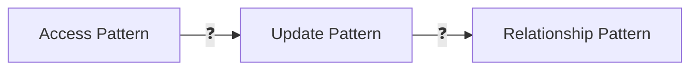

# Domain Knowledge Reference

Auto-generated from blog posts. Do not edit manually.
Last updated: 2026-03-03

---

## Source: fundamentals-of-algorithms

URL: https://jeffbailey.us/blog/2025/12/04/fundamentals-of-algorithms

## Introduction

Algorithm fundamentals provide teams with a shared language for discussing trade-offs, helping them recognize problem patterns that are solvable with established techniques. This keeps systems fast, predictable, and understandable during data or traffic spikes.

Most developers learn algorithms through interview prep or courses, focusing on memorizing solutions rather than understanding their importance, creating a gap between theory and practical use in production.

**What this is (and isn't):** This article explains core algorithmic principles and their application in real systems, focusing on **why** algorithmics matters and **how** to recognize when fundamental principles solve problems, rather than listing every algorithm.

**Why algorithms matter:**

* **Performance at scale** - Algorithms guide system behavior, avoiding slowdowns and outages. as data expands
* **Shared language** - Algorithm fundamentals establish a common vocabulary for discussing trade-offs and performance.
* **Problem recognition** - Understanding algorithm families helps you recognize patterns and select solutions.
* **Debugging and optimization** - Algorithm thinking helps diagnose performance issues and find optimization opportunities.
* **System reliability** - Well-designed algorithms prevent hidden performance bugs that cause incidents.

Algorithm fundamentals are key for building scalable, fast, and understandable software.


> Type: **Explanation** (understanding-oriented).  
> Primary audience: **intermediate** developers learning algorithm fundamentals and performance optimization

## Prerequisites: What You Need to Know First

Before diving into algorithm fundamentals, you should be comfortable with these basics:

**Basic Programming Skills:**

* **Code familiarity** - Ability to read and write code in at least one programming language (Python, JavaScript, Java, or similar).
* **Data structures** - Familiar with basic structures like arrays, lists, or dictionaries (not necessary to understand their internal workings).
* **Control flow** - Comfort with loops, conditionals, and functions.

**Mathematical Concepts:**

* **Basic math** - Comfort with simple mathematical operations and comparisons (addition, subtraction, multiplication, comparison).
* **Growth patterns** - Intuitive sense that some operations take longer than others as data grows (optional, but helpful).

**Software Development Experience:**

* **Some coding experience** - You've written data-related programs, including small scripts or projects.
* **Performance awareness** - Basic sense that some code runs faster than others.

You don't need formal computer science training, advanced math, or experience in multiple programming languages. This article focuses on practical programming and real-world applications over theory.

## What You Will Learn

By the end of this article, you will understand:

* Why algorithm fundamentals matter in production systems.
* How data structures influence algorithm performance.
* Using Big O notation for growth analysis.
* Core algorithmic families in software engineering.
* How to identify hidden performance and reliability risks in real systems.
* Building lasting algorithm intuition through deliberate practice.

## Section 1: Understanding Algorithms

### What algorithms actually are

An algorithm is a repeatable set of steps that converts inputs into outputs.

A good everyday analogy is a recipe:

* The **ingredients** are your inputs.
* The **steps** are your operations.
* The **finished dish** is your output.

* **Clear** means another engineer can read the steps and understand each stage.
* **Repeatable** means the same input always yields the same output under identical conditions.
* **Steps** imply a total order of operations, even if they run in parallel on hardware.

This definition reveals a problem in systems where teams run code without a clear algorithm. Logic is scattered across services, message queues, and jobs, making it hard to describe and debug.

A disciplined approach solves this problem by writing algorithms in [pseudocode](https://jeffbailey.us/what-is-pseudocode/) for key behaviors, detailing the inputs, outputs, and steps, then reviewing them with teammates before choosing data structures and implementations.

This practice is a diagnostic tool in messy systems: if a clear description can't be written, the problem or domain model isn't clear enough.

## Section 2: Data Structures and Performance

### Data structures and algorithms live together

Algorithms are always used with data structures, which influence performance and complexity. They should be treated as a pair, as data representation choices determine the suitable algorithm family.

Common data structures used in production systems include:

* Arrays represent ordered sequences with fast index-based access.
* Hash maps represent key-to-value lookup with fast average time for reads and writes.
* Trees represent hierarchical relationships and ordered sets.
* Graphs represent entities with relationships that are not strictly hierarchical.

Selecting the wrong structure makes even clever algorithms slow and brittle, while choosing the proper structure makes many algorithms simple loops and lookups. A helpful approach is to ask: "What shape does this data have, and what are the most important operations on it?" The answer drives both the data structure and the selection of the algorithm.

### Big O notation as a thinking tool

Big O notation is a form of asymptotic notation describing how an algorithm's time or space costs grow with input size. <!-- Draft-only link removed: learn-asymptotic-notations --> It’s part of a broader category that includes Omega and Theta notations. In practice, Big O is most common because it depicts worst-case performance, which is crucial for production systems.

Big O notation describes how an algorithm’s resource usage grows as the input size increases. It compares growth rates, not exact runtimes, so it doesn’t tell you how fast an algorithm runs on a specific machine or input — only how it scales. Because Big O ignores constant factors, an **O(n)** algorithm can still run faster than an **O(log n)** algorithm for small input sizes. Time complexity describes how the number of operations grows with the input size, while space complexity describes how much additional memory an algorithm requires.

Common complexity patterns appear in production systems:

* Constant time: **O(1)**, access a value in a fixed-size collection.
* Logarithmic time: **O(log n)**, binary search in a sorted array.
* Linear time: **O(n)**, scan each item once.
* Linearithmic time: **O(n log n)**, many efficient sorting algorithms.
* Quadratic time: **O(n^2)**, naive pairwise comparison of elements.

Each pattern has distinct characteristics:

**O(1)**

*Example operation:* Hash map lookup

*Behavior as `n` grows:* Stays roughly constant
--card--
**O(log n)**

*Example operation:* Binary search in a sorted array

*Behavior as `n` grows:* Grows slowly
--card--
**O(n)**

*Example operation:* Single pass over a list

*Behavior as `n` grows:* Grows linearly
--card--
**O(n log n)**

*Example operation:* Efficient general-purpose sorting

*Behavior as `n` grows:* Grows faster than linear
--card--
**O(n^2)**

*Example operation:* Pairwise comparison of all items

*Behavior as `n` grows:* Explodes once `n` gets large
Constant-time operations appear free for small scales, but quadratic ones are manageable with ten items, yet problematic at a hundred thousand. Exact formulas are rarely necessary; what's crucial is whether a change causes a new growth pattern.

**Amortized analysis example:**

Appending to a dynamic array is usually **O(1)** on average, even though occasional resizes take **O(n)**. Over many appends, the average cost stays constant, making it amortized **O(1)**. Amortized analysis helps explain why this pattern holds despite occasional expensive operations.

Converting a single list pass into nested loops that compare every pair multiplies work for large inputs. When reviewing code, look for nested loops and code that calls remote services. These often cause latency issues.

**Quick check:**

* In one of your services, can you identify a path that is effectively **O(n^2)** because of nested loops or repeated scans over the same data?

### Recognizing growth patterns in code

When reviewing code, look beyond syntax and focus on growth:

* Where are the nested loops?
* Where are loops making remote calls or heavy allocations?

These hot spots are where time complexity turns into latency tickets. [Example 1: Performance Bug from Naive Algorithm](#example-1-performance-bug-from-naive-algorithm) illustrates how the algorithm's structure affects performance. The key is understanding that structure, not just syntax, determines latency growth, requiring thinking about inputs, outputs, and growth.

## Section 3: Core Algorithm Families

### Core families of algorithms

Textbooks list many algorithms, but in production, fewer are used repeatedly, forming practical families:

* **Searching:** find an item that matches a condition.
* **Sorting:** order data to make other operations cheaper.
* **Hash-based lookup:** efficiently map keys to values.
* **Traversal:** visit each element in a structure.
* **Divide and conquer:** split a problem into smaller pieces, solve them, and combine the results.
* **Dynamic programming:** reuse results of overlapping subproblems instead of recomputing them.
* **Greedy algorithms:** make locally optimal choices step by step, leading to a good global result.

Each family solves a different shape of problem:

* **Searching** – "Find the thing that matches this condition."
* **Sorting** – "Put things in an order so other work becomes cheaper."
* **Hash-based lookup** – "Jump directly to what you need using a key."
* **Traversal** – "Visit everything in a structure once."
* **Divide and conquer** – "Split the problem, solve smaller pieces, then combine."
* **Dynamic programming** – "Remember sub-results so you never redo expensive work."
* **Greedy algorithms** – "Grab the best option you can see right now, step by step."

Understanding the problem shape is the key skill that makes algorithmic knowledge practically useful.

**Traversal** involves visiting all nodes or vertices, such as exploring a dependency graph to determine startup order. **Dynamic programming** solves overlapping subproblems, such as finding the cheapest paths, by memoizing results to avoid exponential recomputation. **Greedy algorithms** select the highest-priority job next, leading to effective global schedules.

Here's a simple traversal example for exploring a dependency graph:

```python
def traverse_dependencies(service, visited, startup_order):
    if service in visited:
        return
    visited.add(service)
    for dependency in service.dependencies:
        traverse_dependencies(dependency, visited, startup_order)
    startup_order.append(service)  # Add after dependencies
```

This depth-first traversal ensures that dependencies start before the services they depend on.

**Quick check:**

* Can you identify a problem in your current work that matches one of these algorithm families?

Most implementations don't need to be built from scratch. Recognizing which problems belong to these families helps determine which libraries or database features to use and what performance to expect.

### Searching

*Searching algorithms answer a question:* "Where is the item that matches this condition?" In practice, two main patterns appear:

* Linear search in an unsorted collection.
* Structured search in an indexed or sorted structure.

Linear search has **O(n)** complexity and is suitable for small n or when the cost of indexing outweighs its benefits. Structured search builds an often costly index up front, then answers queries faster.

Binary search in a sorted array is the classic example:

```python
def binary_search(sorted_items, target):
    left, right = 0, len(sorted_items) - 1
    while left <= right:
        mid = (left + right) // 2
        value = sorted_items[mid]
        if value == target:
            return mid
        if value < target:
            left = mid + 1
        else:
            right = mid - 1
    return -1
```

This function runs in **O(log n)** time because it halves the search space at each step.

The concept matters more than the specific implementation.

When performing repeated searches on the same data, consider maintaining an index to keep search time logarithmic rather than linear.

In distributed systems, that index might be a database index, an in-memory cache, or a precomputed materialized view, a precomputed snapshot that storage keeps up to date.

**Self check:**

* Can you identify where to add an index in your system to turn linear searches into logarithmic time?

### Sorting

Sorting algorithms reorder elements so that the key increases or decreases monotonically. Many algorithms run faster once data is sorted. Most standard sorting functions use quicksort, mergesort, or hybrid algorithms, balancing speed and guarantees. Good sorting algorithms have a time complexity of **O(n log n)**. Sorting is rarely done manually in production.

*Two questions guide sorting choices:*

* Can repeated re-sorting be avoided by incrementally maintaining sorted structures?
* Can sorting be integrated into the database or storage layer to utilize indexes and streaming?

When a product feature needs to be sorted, maintain a single, clear place for the ordering. Otherwise, small ad hoc sorts creep into many call sites, making it harder to reason about total cost.

See [Fundamentals of Databases](/blog/2025/09/24/fundamentals-of-databases/).

### Hash based lookup

Hash-based lookup algorithms use a hash function to map keys to buckets. Hash maps and hash sets give average **O(1)** time for inserts, deletes, and lookups when the hash function behaves well. Hashing changes the shape of work.

Instead of comparing keys one by one, the hash function maps each key to a bucket. This makes lookups appear constant time because it jumps rather than searches. The cost moves from searching items to maintaining a good key distribution across buckets. Hash-based structures handle collisions using techniques such as chaining or open addressing. They are the default choice for fast equality lookups when ordering isn't needed.

## Section 4: When Algorithms Fail in Real Systems

### Common pitfalls and misconceptions

Algorithm discussions often include myths that hinder clear thinking.

Common misconceptions include:

* Algorithms are whiteboard trivia for interviews.
* Big O notation predicts exact performance numbers.
* Hash maps always give constant time operations.
* Sorting is always **O(n log n)** and is always the right tool for ordering.

The reality differs in practice. Algorithms are tools used to prevent and debug incidents. Big O notation describes how costs grow, not how many milliseconds a request will take. Hash maps degrade when hash functions misbehave or when adversarial inputs cause collisions. Sorting repeatedly can be slower than maintaining incremental order or using an index. Understanding these limits keeps the abstractions accurate.

### When not to use specific techniques

Good algorithm work requires knowing when a tool is wrong for the job. Families like hashing, sorting, traversal, and dynamic programming are helpful in most cases, but have precise limits.

*Examples in real systems include:*

* Avoid unbounded hash maps for ordering, range queries, or strict memory control.
* Avoid recursive depth-first search on infinitely deep trees.
* Avoid dynamic programming if subproblems don't overlap or if the state space explodes, becoming too large to store or compute.
* Avoid repeated full sorts; use incremental ordering, streaming, or indexes.

When reviewing designs, identify where techniques might fail, such as unbounded growth, recursion depth, or access pattern mismatches, and change the design. Common issues include poor key ordering, unstable iteration order, and failure to account for memory growth as keys increase. Large systems are at risk of memory leaks from unbounded hash maps. Use explicit capacity limits and eviction policies instead of unbounded in-memory caches.

### When algorithms go wrong in real systems

Algorithm textbooks focus on correctness and asymptotic complexity, but in production, algorithms should be evaluated by their behavior under real load and failure conditions. Production systems fail in specific ways, with recurring patterns including:

* Hidden quadratic behavior in nested loops or naive joins.
* Unbounded memory growth from caches or accumulators that never release data.
* Algorithms that assume perfectly clean input and fail when the data is messy.
* Distributed algorithms that ignore network partitions or partial failures.

The problem is rarely a lack of advanced algorithms; it's usually a lack of clear algorithmic thinking applied to domain constraints.

### Algorithm Incident Debugging Checklist

When debugging an algorithm-related production incident, follow this four-step loop:

1. **Measure the input size** – What is the adequate input size for this failing path?
2. **Locate loops and remote calls** – Which loops and remote calls are inside that path?
3. **Check growth when input doubles** – How does the work or memory usage grow when the input doubles?
4. **Confirm safeguards or limits** – Where are limits enforced to keep growth under control?

These questions turn an incident from a mysterious outage into an algorithmic analysis, often leading to fixes such as restructuring loops, reorganizing layers, or adding limits.

See [Fundamentals of Incident Management](/blog/2025/11/16/fundamentals-of-incident-management/).

## Section 5: Building Algorithm Intuition

### Getting Started: How to Practice Algorithms

Algorithm intuition is not built by memorizing pages of algorithms.

It grows by practicing a small set of patterns in realistic scenarios until they feel natural.

A practical approach to building algorithm intuition:

* Reimplement core algorithms from scratch a few times, such as binary search, merge sort, and depth-first search.
* Use profiling tools to measure how different implementations behave on large inputs.
* Read high-quality open source implementations and compare design decisions.
* Write down a short natural language description of any non-trivial algorithm added to a system.

**Self check:**

* Can you explain in simple terms how binary search, merge sort, and depth-first search work without looking them up?

Combine this with deliberate exposure to algorithm-rich domains:

* Text search and indexing.
* Recommendation systems.
* Streaming data pipelines.
* Graph analysis in social or organizational networks.

These domains require thinking about performance, correctness, and failure modes, and they reward clear algorithm design.

**Quick check:**

* Can you identify an algorithm-rich domain in your work to practice recognizing problem patterns?

## Section 6: Algorithms in Your Fundamentals Toolkit

### How does this fits into broader fundamentals

Algorithm fundamentals are one part of a larger toolkit.

They connect to data structures, architecture, testing, and observability.

Good observability and logging turn poor algorithm behavior into precise diagnoses. Well-designed data structures simplify algorithms and make them more reliable. Aligning architecture with domain boundaries ensures each service encapsulates a few algorithms, avoiding complexity. Algorithms are a vital part of the system, not just abstract exercises. As requirements evolve, revisit core algorithms to ensure they still align with key operations and constraints.

See [Fundamentals of Software Architecture](/blog/2025/10/19/fundamentals-of-software-architecture/), [Fundamentals of Monitoring and Observability](/blog/2025/11/16/fundamentals-of-monitoring-and-observability/), and [Fundamentals of Software Design](/blog/2025/11/05/fundamentals-of-software-design/).

### Evaluating Algorithm Behavior in Production

To evaluate an algorithm's performance in a real system.

* Use profiling tools to identify hot paths and confirm where time is spent.
* Compare expected growth (e.g., **O(n)** vs **O(n^2)**) with latency and memory changes as input size grows.
* Add metrics and logs for input sizes, loop counts, and cache hit rates on critical paths.

This closes the loop between theory and real-world performance.

### Where algorithms are heading next

New areas like vector search, approximate nearest neighbor algorithms, and machine learning ranking are increasingly common in production. They rely on core principles: balancing accuracy and speed, matching data structures to data shapes, and managing growth to support fast queries. When learning a new algorithm, identify familiar patterns: data shape, growth, and trade-offs.

See [Fundamentals of Machine Learning](/blog/2025/11/20/fundamentals-of-machine-learning/).

## Examples: What This Looks Like in Practice

Here are examples demonstrating how algorithm fundamentals work in real scenarios:

### Example 1: Performance Bug from Naive Algorithm

This example shows why understanding algorithm structure prevents incidents.

**Problem:** A service receives IDs and returns profiles. The naive method makes a remote call for each user.

**Naive Implementation:**

```python
def get_profiles_naive(user_ids, client):
    profiles = []
    for user_id in user_ids:
        profiles.append(client.fetch_profile(user_id))
    return profiles
```

**Why this fails:** Total latency increases linearly with the number of identifiers, and external dependencies often have rate limits. Pulling thousands of profiles causes a performance incident.

**Algorithm-aware solution:**

```python
def get_profiles_batched(user_ids, client, batch_size=100):
    profiles = []
    for i in range(0, len(user_ids), batch_size):
        batch = user_ids[i:i + batch_size]
        profiles.extend(client.fetch_profiles_batch(batch))
    return profiles
```

**Why this works:** The complexity stays linear in total identifiers, but constant factors improve as each round trip retrieves a batch. The algorithm's structure, not just syntax, determines latency growth.

**Quick comparison:**

* Which version scales better from 100 to 10,000 user identifiers?
* What assumptions does each implementation make about data shape and API capabilities?
* How would you modify the naive version without batching?

### Example 2: Binary Search for Efficient Lookups

This example shows how choosing the correct algorithm family dramatically improves performance.

**Problem:** Finding an item in a sorted collection. Linear search works but slows with more data.

**Linear search approach:**

```python
def linear_search(items, target):
    for i, item in enumerate(items):
        if item == target:
            return i
    return -1
```

**Time complexity:** **O(n)** - must check each item in worst case.

**Binary search approach:**

```python
def binary_search(sorted_items, target):
    left, right = 0, len(sorted_items) - 1
    while left <= right:
        mid = (left + right) // 2
        value = sorted_items[mid]
        if value == target:
            return mid
        if value < target:
            left = mid + 1
        else:
            right = mid - 1
    return -1
```

**Time complexity:** **O(log n)** - cuts search space in half on each step.

**Why this matters:** In a collection of 1,000,000 items, linear search checks about 500,000 items on average, whereas binary search checks up to 20. This is crucial in systems managing large datasets.

### Example 3: Recognizing Algorithm Families

This example shows that recognizing problem patterns improves solutions.

**Problem:** Finding all users who match multiple criteria from a large dataset.

**Naive approach:** Nested loops checking every combination.

**Algorithm-aware approach:**

Treat this as a search problem: use hash lookups for equality, sorted structures with binary search for ranges, and database indexes or specialized structures for complex criteria.

The key insight is recognizing the problem shape before choosing an implementation.

## Troubleshooting: What Could Go Wrong

Here are common algorithm problems and solutions:

### Problem: Hidden Quadratic Behavior

**Symptoms:**

* System performance degrades rapidly as data grows.
* Latency increases exponentially with input size.
* Production incidents during traffic spikes.

**Solutions:**

* Scan code for nested loops, especially those calling remote services.
* Use profiling tools to identify hot paths with quadratic complexity.
* Replace nested loops with hash lookups or indexed searches.
* Add input size limits to prevent unbounded growth.

### Problem: Unbounded Memory Growth

**Symptoms:**

* Memory usage grows continuously over time.
* System crashes or becomes unresponsive.
* Memory leaks in long-running processes.

**Solutions:**

* Avoid unbounded hash maps and caches without eviction policies.
* Set explicit capacity limits on data structures.
* Use streaming algorithms for large datasets instead of loading everything into memory.
* Monitor memory growth patterns and set alerts.

### Problem: Algorithm Assumes Clean Input

**Symptoms:**

* Algorithm works in tests but fails in production.
* Edge cases cause unexpected behavior.
* System fails when data doesn't match expected format.

**Solutions:**

* Validate input data before processing.
* Handle edge cases explicitly (empty inputs, null values, malformed data).
* Design algorithms to be robust to data quality issues.
* Add monitoring to detect when assumptions are violated.

**Quick check:**

* Have you faced a production issue with these problem patterns? What algorithm thinking helped diagnose or fix it?

### Problem: Wrong Algorithm for the Problem

**Symptoms:**

* Solution works but feels overly complex.
* Performance doesn't match expectations.
* Difficult to maintain or modify.

**Solutions:**

* Step back and identify the problem shape before implementing.
* Consider whether the problem matches a known algorithm family.
* Evaluate trade-offs between different approaches.
* Choose simplicity when multiple solutions work.

## Reference: Where to Find Specific Details

For deeper coverage of specific algorithm topics:

**Algorithm Analysis:**

* Big O notation and asymptotic analysis for understanding growth patterns.
* Time and space complexity analysis for comparing algorithm efficiency.
* Amortized analysis for understanding average-case performance.

**Data Structures:**

* [Fundamentals of Databases](/blog/2025/09/24/fundamentals-of-databases/) - How databases use algorithms and indexes for efficient queries.
* Standard library documentation for your programming language's data structures.

**Algorithm Implementation:**

* High-quality open source implementations in languages you use.
* Algorithm visualization tools for understanding how algorithms work.
* Competitive programming resources for practice problems.

**Performance Optimization:**

* Profiling tools for identifying performance bottlenecks.
* Benchmarking frameworks for comparing algorithm implementations.
* System monitoring tools for detecting algorithm-related performance issues.

## Conclusion

Algorithm fundamentals are vital, not just for interview questions. They create a common language for trade-offs, identify recurring problem patterns, and prevent performance issues before incidents occur.

The fundamentals are simple:

* Describe important behaviors as precise algorithms in plain language before coding.
* Choose data structures based on the data's shape and the operations that matter most.
* Use Big O notation as a way to reason about growth, not as a precise benchmark.
* Learn to recognize a handful of algorithm families and map real problems to them.
* Watch for hidden quadratic behavior, unbounded memory growth, and unrealistic assumptions about clean input.
* Practice by reimplementing core algorithms, reading high-quality implementations, and measuring performance.

Applying these fundamentals requires practice and experience. Begin with small projects, learn from performance incidents, and gradually develop algorithm thinking skills.

The goal isn't to become an algorithm expert overnight but to develop the habit of thinking algorithmically about software's behavior as it scales. Systems that endure are built with algorithm fundamentals from the start.

### Key Takeaways

* Algorithms are everyday tools that maintain system speed and reliability, not just interview trivia.
* Data structures and algorithms should be designed together based on data shape and key operations.
* Big O notation is a way to reason about how work grows, not a prediction of exact latency.
* A small set of algorithm families (searching, sorting, hashing, traversal, divide-and-conquer, dynamic programming, greedy algorithms) covers most real-world problems.
* Many production incidents result from hidden quadratic behavior, unbounded memory growth, and unrealistic input assumptions.

### What's Next?

To apply these concepts, consider these following steps:

* **Practice with real projects** - Apply algorithm thinking to the next project, no matter how small.
* **Study performance incidents** - When systems slow down, consider if better algorithms could have prevented it.
* **Learn about specific algorithms** - Deep dive into the algorithm families of most interest.
* **Read implementations** - Study how real systems use algorithms to solve problems.

The best way to learn algorithm fundamentals is to practice them. Start thinking algorithmically about the next project to see the difference it makes.

**Reflection prompt:**

* Consider a recent performance or reliability issue. How could an algorithm choice, data structure change, or better understanding of growth patterns have improved the outcome?

### Related Articles

*Related fundamentals articles:*

**Software Engineering:** [Fundamentals of Software Development](/blog/2025/10/02/fundamentals-of-software-development/) shows how algorithms fit into the broader software development process. [Fundamentals of Software Architecture](/blog/2025/10/19/fundamentals-of-software-architecture/) teaches you how architectural decisions affect algorithm choices. [Fundamentals of Software Design](/blog/2025/11/05/fundamentals-of-software-design/) helps you understand how design principles inform algorithm selection.

**Data and Infrastructure:** [Fundamentals of Databases](/blog/2025/09/24/fundamentals-of-databases/) explains how databases use algorithms and indexes to provide efficient data access. [Fundamentals of Distributed Systems](/blog/2025/10/11/fundamentals-of-distributed-systems/) helps you understand how algorithms work in distributed environments.

**Production Systems:** [Fundamentals of Reliability Engineering](/blog/2025/11/17/fundamentals-of-reliability-engineering/) helps you understand how algorithm choices affect system reliability. [Fundamentals of Monitoring and Observability](/blog/2025/11/16/fundamentals-of-monitoring-and-observability/) explains how to detect algorithm-related performance issues.

## Glossary

## References

### Algorithm Theory and Analysis

* Cormen, T. H., Leiserson, C. E., Rivest, R. L., & Stein, C. (2022). Introduction to Algorithms (4th ed.). MIT Press. - Comprehensive reference for algorithm analysis and design.
* Sedgewick, R., & Wayne, K. (2011). Algorithms (4th ed.). Addison-Wesley Professional. - Practical coverage with strong visual explanations and code examples.

### Practical Algorithm Resources

* [Algorithms, Part I, Princeton University](https://www.coursera.org/learn/algorithms-part1) - Accessible course on core data structures and algorithms with Java implementations.
* [The Algorithm Design Manual](https://www.algorist.com) - Steven Skiena's guidance and case studies focus on matching real problems to suitable algorithms.
* [Big O Notation, Khan Academy](https://www.khanacademy.org/computing/computer-science/algorithms#asymptotic-notation) - Gentle intro to asymptotic analysis and complexity classes.

### Algorithm Visualization and Practice

* [VisuAlgo](https://visualgo.net/) - Interactive algorithm and data structure visualizations.
* [VisuAlgo Data Structure Visualizations](https://visualgo.net/en) - Interactive visualizations of algorithms and data structures.
* [LeetCode](https://leetcode.com/) - Platform for practicing algorithm problems with real-world scenarios.

*Note: Algorithm fundamentals stay the same, but implementations and best practices evolve. Always verify current approaches for your technology stack and use case.*


---

## Source: fundamental-algorithmic-patterns

URL: https://jeffbailey.us/blog/2025/12/12/fundamental-algorithmic-patterns

## Introduction

This page is a **reference catalog** of algorithmic patterns and pattern families.

**Use this page when** you need to quickly map a problem statement to a known approach, then recall the core constraints and a canonical implementation shape.

**This page is not** a deep “why it works” explanation, nor a full tutorial on each algorithm.

**Why patterns matter (in work mode):**

* **Faster problem solving**: You can pick a known template instead of starting from scratch.
* **Cleaner implementations**: Patterns reduce accidental complexity and edge-case bugs.
* **Shared vocabulary**: You can name the approach quickly in reviews and design discussions.

> Type: **Reference** (pattern catalog with recognition guidance).
> Primary audience: **intermediate** developers learning to recognize and apply algorithmic patterns in real problems.

Examples are in **Python**, but the recognition cues are language-agnostic.

If you want the study-oriented explanation of *why* patterns work, and how to build intuition, read [How Algorithmic Patterns Work](https://jeffbailey.us/how-algorithmic-patterns-work/).

## Prerequisites: What You Need to Know First

Before exploring algorithmic patterns, you should be comfortable with these basics:

**Basic Programming Skills:**

* **Code familiarity** - Ability to read and write code in at least one programming language (Python, JavaScript, Java, or similar).
* **Data structures** - Familiar with basic structures like arrays, lists, hash maps, and trees.
* **Control flow** - Comfort with loops, conditionals, and functions.

**Algorithm Fundamentals:**

* **Big O notation** - Basic understanding of time and space complexity.
* **Algorithm families** - Familiarity with searching, sorting, and traversal concepts.

**Software Development Experience:**

* **Some coding experience** - You've written programs that process data or solve problems.
* **Problem-solving practice** - Experience breaking down problems into smaller pieces.

You don't need to memorize every algorithm. This article focuses on pattern recognition and application over implementation details.

See [Fundamentals of Algorithms](/blog/2025/12/04/fundamentals-of-algorithms/) for core algorithmic concepts and [Fundamentals of Data Structures](/blog/2025/12/06/fundamentals-of-data-structures/) for data structure fundamentals.

If you are rusty on the basics, skim these first:

* [Fundamentals of Algorithms](/blog/2025/12/04/fundamentals-of-algorithms/).
* [Fundamentals of Data Structures](/blog/2025/12/06/fundamentals-of-data-structures/).
* [Fundamentals of Computer Processing](/blog/2025/12/11/fundamentals-of-computer-processing/).

## How to Use This Page

Use this as a lookup:

* Start at **Pattern Selection Guide** to narrow down the family.
* Jump via **Pattern Index (Quick Jump)** to the specific entry.
* Use each entry’s **Constraints / gotchas** to sanity check before you implement.

## Pattern Selection Guide

If you are deciding which pattern fits, scan this index first.

Use this section when you are still diagnosing the problem from its wording and constraints.

* **Two pointers**: Sorted sequences, pairs/triplets, “meet in the middle”.
* **Sliding window**: Contiguous subarray/substring, longest/shortest, “at most k”.
* **Prefix sum**: Range sums, “sum equals k”, subarray counts.
* **Monotonic stack and queue**: “Next greater/smaller”, histogram, temperatures, spans.
* **Merge intervals**: Overlapping ranges, scheduling, consolidation.
* **Binary search**: Sorted input, “min feasible”, “max feasible”, log-time hints.
* **Graph traversals (BFS/DFS)**: Connected components, reachability, shortest unweighted paths.
* **Dynamic programming**: “Optimal”, overlapping subproblems, exponential brute force smell.

## Pattern Index (Quick Jump)

Use this section when you already know the family and want the specific entry.

* **Pointer-based patterns.**
    * [Two Pointers](#two-pointers).
    * [Fast and Slow Pointers](#fast-and-slow-pointers).
* **Window and range patterns.**
    * [Sliding Window](#sliding-window).
    * [Prefix Sum](#prefix-sum).
* **Stack and queue patterns.**
    * [Monotonic Stack and Queue](#monotonic-stack-and-queue).
    * [Expression Evaluation, Stacks and Queues](#expression-evaluation-stacks-and-queues).
* **Interval and sorting patterns.**
    * [Merge Intervals](#merge-intervals).
    * [Overlapping Intervals](#overlapping-intervals).
    * [Sorting-Based Patterns](#sorting-based-patterns).
    * [Cyclic Sort](#cyclic-sort).
* **Search patterns.**
    * [Binary Search and Variants](#binary-search-and-variants).
* **Divide and conquer patterns.**
    * [Divide and Conquer](#divide-and-conquer).
* **Greedy and optimization patterns.**
    * [Greedy Algorithms](#greedy-algorithms).
* **Dynamic programming patterns.**
    * [Dynamic Programming, 1D and 2D, Knapsack, Range DP](#dynamic-programming-1d-and-2d-knapsack-range-dp).
* **Backtracking patterns.**
    * [Backtracking and Recursive Search](#backtracking-and-recursive-search).
* **Graph and tree patterns.**
    * [Graph Traversals, BFS and DFS](#graph-traversals-bfs-and-dfs).
    * [Topological Sort](#topological-sort).
    * [Binary Tree Traversals, Preorder, Inorder, Postorder, Level Order](#binary-tree-traversals-preorder-inorder-postorder-level-order).
    * [Path Sum and Root to Leaf Techniques](#path-sum-and-root-to-leaf-techniques).
    * [Union Find, Disjoint Set](#union-find-disjoint-set).
    * [Shortest Path Pattern Family](#shortest-path-pattern-family).
    * [Minimum Spanning Tree Pattern Family](#minimum-spanning-tree-pattern-family).
* **Matrix and grid patterns.**
    * [Matrix Traversal](#matrix-traversal).
* **Linked list patterns.**
    * [Linked List Techniques, Dummy Node, In Place Reversal](#linked-list-techniques-dummy-node-in-place-reversal).
* **Heap and selection patterns.**
    * [Top K Elements, Heap and QuickSelect](#top-k-elements-heap-and-quickselect).
    * [Kth Largest and Smallest Elements](#kth-largest-and-smallest-elements).
    * [Two Heaps Pattern](#two-heaps-pattern).
* **Hash-based patterns.**
    * [Hashmaps and Frequency Counting](#hashmaps-and-frequency-counting).
* **Trie and string patterns.**
    * [Trie and Prefix Tree](#trie-and-prefix-tree).
* **Design pattern problems.**
    * [Design Problems, Least Recently Used Cache, Twitter, Rate Limiter](#design-problems-least-recently-used-cache-twitter-rate-limiter).
* **Bit manipulation patterns.**
    * [Bit Manipulation](#bit-manipulation).

## Pointer-Based Patterns

### Two Pointers

**When to use:** Problems involving sorted arrays or sequences where you need to find pairs, triplets, or validate conditions.

**Contract:** A sequence (often sorted) plus a target or predicate, return indices, values, or a boolean.

**Typical complexity:** \(O(n)\) time, \(O(1)\) extra space, plus \(O(n \log n)\) if you must sort first.

**Key characteristics:**

* Array or sequence is sorted (or can be sorted).
* Looking for pairs, triplets, or combinations.
* Need to compare elements from different positions.
* Linear or near-linear time complexity desired.

**Common problems:**

* Find two numbers that sum to a target.
* Remove duplicates from sorted array.
* Validate palindrome.
* Find three numbers that sum to zero.

**How to spot it:**

* Sorted array with pair-finding requirements.
* Need to compare elements at different indices.
* Can eliminate possibilities by moving pointers.

**Canonical shape:**

```python
def two_pointers(arr, target):
    left = 0
    right = len(arr) - 1
    
    while left < right:
        current_sum = arr[left] + arr[right]
        if current_sum == target:
            return [left, right]
        elif current_sum < target:
            left += 1
        else:
            right -= 1
    return []
```

### Fast and Slow Pointers

**When to use:** Problems involving cycles, middle elements, or linked list operations.

**Contract:** A linked list or pointer chain, return cycle existence, cycle entry, or a position like the middle.

**Typical complexity:** \(O(n)\) time, \(O(1)\) extra space.

**Key characteristics:**

* Need to detect cycles or loops.
* Finding middle element without knowing length.
* Need to traverse at different speeds.
* Linked list or sequence with potential cycles.

**Common problems:**

* Detect cycle in linked list.
* Find middle of linked list.
* Find kth element from end.
* Detect palindrome in linked list.

**How to spot it:**

* Linked list problems.
* Cycle detection requirements.
* Need to find position without full traversal.
* "Floyd's cycle detection" or "tortoise and hare" mentioned.

**Canonical shape:**

```python
def has_cycle(head):
    slow = fast = head
    
    while fast and fast.next:
        slow = slow.next
        fast = fast.next.next
        if slow == fast:
            return True
    return False
```

## Window and Range Patterns

### Sliding Window

**When to use:** Problems involving subarrays, substrings, or contiguous sequences with constraints.

**Contract:** A sequence plus a window constraint, return a best window metric (max, min, count) or a window itself.

**Decision rules:**

* **Fixed-size window:** Keep a running sum or counts, slide one step each time.
* **Variable-size window:** Expand to include new items, shrink while the constraint is violated.
* **“At most k”:** Usually sliding window with shrink-on-violation.
* **“Exactly k”:** Often “at most k” difference, or prefix sum counting depending on the constraint.

**Typical complexity:** Usually \(O(n)\) time, \(O(1)\) to \(O(\Sigma)\) extra space for counts (alphabet size, distinct keys).

**Key characteristics:**

* Need to find subarray or substring.
* Window size is fixed or variable.
* Optimizing for maximum, minimum, or count.
* Linear time complexity possible.

**Common problems:**

* Maximum sum subarray of size k.
* Longest substring with k distinct characters.
* Minimum window substring.
* Find all anagrams in a string.

**How to spot it:**

* "Subarray" or "substring" in problem description.
* Need to maintain a window of elements.
* Constraints on window contents (unique characters, sum limits).
* Can expand and contract window based on conditions.

**Canonical shape:**

```python
def sliding_window(arr, k):
    window_start = 0
    max_sum = 0
    window_sum = 0
    
    for window_end in range(len(arr)):
        window_sum += arr[window_end]
        
        if window_end >= k - 1:
            max_sum = max(max_sum, window_sum)
            window_sum -= arr[window_start]
            window_start += 1
    
    return max_sum
```

### Prefix Sum

**When to use:** Problems requiring frequent range sum queries or cumulative calculations.

**Contract:** A numeric sequence, return fast range aggregates, or count subarrays that match a condition.

**Decision rules:**

* **Repeated range sum queries:** Build a prefix array, query each range in \(O(1)\).
* **Count subarrays with sum equals k:** Track prefix sum frequencies in a hashmap while scanning.

**Typical complexity:** \(O(n)\) build time, \(O(1)\) per range query, \(O(n)\) time and \(O(n)\) space for counting problems.

**Key characteristics:**

* Multiple range sum queries.
* Need cumulative information.
* Preprocessing allowed for faster queries.
* Range updates or queries.

**Common problems:**

* Range sum queries.
* Subarray sum equals k.
* Equilibrium index.
* Maximum size subarray sum.

**How to spot it:**

* "Range sum" or "subarray sum" queries.
* Need to answer multiple queries efficiently.
* Can precompute cumulative values.
* O(1) range queries after O(n) preprocessing.

**Constraints / gotchas:**

* Prefix sums are \(O(n)\) memory, they trade memory for faster repeated queries.
* For “subarray sum equals k” counting, you usually need a hashmap of prefix sum frequencies, not just the prefix array.

**Canonical shape:**

```python
def prefix_sum(arr):
    prefix = [0]
    for num in arr:
        prefix.append(prefix[-1] + num)
    return prefix

def range_sum(prefix, i, j):
    return prefix[j + 1] - prefix[i]
```

## Stack and Queue Patterns

### Monotonic Stack and Queue

**When to use:** Problems requiring next/previous greater or smaller elements, or maintaining monotonic order.

**Contract:** A sequence, return “next greater/smaller” answers, spans, or range extents for each position.

**Typical complexity:** \(O(n)\) time, \(O(n)\) extra space for the stack or deque.

**Key characteristics:**

* Need next greater/smaller element.
* Maintaining increasing or decreasing order.
* Problems involving temperature, stock prices, or heights.
* Stack or queue maintains monotonic property.

**Common problems:**

* Next greater element.
* Largest rectangle in histogram.
* Daily temperatures.
* Trapping rain water.

**How to spot it:**

* "Next greater" or "next smaller" in problem.
* Need to compare with previous elements.
* Maintaining sorted order as you process.
* Stack-based solution with monotonic property.

**Canonical shape:**

```python
def next_greater_element(nums):
    stack = []
    result = [-1] * len(nums)
    
    for i in range(len(nums)):
        while stack and nums[stack[-1]] < nums[i]:
            result[stack.pop()] = nums[i]
        stack.append(i)
    
    return result
```

### Expression Evaluation, Stacks and Queues

**When to use:** Problems involving parsing, evaluating expressions, or handling nested structures.

**Contract:** A token stream or string expression, return a computed value, a decoded string, or a validity boolean.

**Typical complexity:** Usually \(O(n)\) time, \(O(n)\) extra space for the stack.

**Key characteristics:**

* Expression evaluation (infix, postfix, prefix).
* Parentheses matching.
* Nested structure processing.
* Operator precedence handling.

**Common problems:**

* Evaluate arithmetic expression.
* Valid parentheses.
* Basic calculator.
* Decode string.

**How to spot it:**

* Expression parsing or evaluation.
* Nested parentheses or brackets.
* Operator precedence matters.
* Need to process in reverse order (stack).

**Canonical shape:**

**Constraints:** This example is intentionally simplified. It assumes input contains digits, `+`, `-`, `(`, and `)`, and does not handle spaces or other operators.

```python
def evaluate_expression(s):
    stack = []
    num = 0
    sign = 1
    result = 0
    
    for char in s:
        if char.isdigit():
            num = num * 10 + int(char)
        elif char == '+':
            result += sign * num
            num = 0
            sign = 1
        elif char == '-':
            result += sign * num
            num = 0
            sign = -1
        elif char == '(':
            stack.append(result)
            stack.append(sign)
            result = 0
            sign = 1
        elif char == ')':
            result += sign * num
            num = 0
            result *= stack.pop()
            result += stack.pop()
    
    return result + sign * num
```

## Interval and Sorting Patterns

### Merge Intervals

**When to use:** Problems involving overlapping intervals, scheduling, or time ranges.

**Contract:** A list of intervals, return a merged list, or a decision like “can schedule without conflicts”.

**Typical complexity:** Usually \(O(n \log n)\) time for sorting, \(O(n)\) extra space for the output.

**Key characteristics:**

* Collection of intervals.
* Need to merge overlapping intervals.
* Scheduling or time-based problems.
* Range consolidation required.

**Common problems:**

* Merge intervals.
* Insert interval.
* Meeting rooms.
* Non-overlapping intervals.

**How to spot it:**

* "Intervals" or "ranges" in problem.
* Overlapping conditions.
* Need to consolidate or merge.
* Scheduling or time-based context.

**Canonical shape:**

```python
def merge_intervals(intervals):
    if not intervals:
        return []
    
    intervals.sort(key=lambda x: x[0])
    merged = [intervals[0]]
    
    for current in intervals[1:]:
        last = merged[-1]
        if current[0] <= last[1]:
            merged[-1] = [last[0], max(last[1], current[1])]
        else:
            merged.append(current)
    
    return merged
```

### Overlapping Intervals

**When to use:** Problems requiring detection, counting, or scheduling under overlapping time ranges.

**Contract:** A list of intervals, return overlap counts, conflict detection, or maximum concurrency.

**Decision rules:**

* **Half-open intervals** (`[start, end)`): Process end events before start events at the same time.
* **Closed intervals** (`[start, end]`): Process start events before end events at the same time.

**Typical complexity:** Usually \(O(n \log n)\) time for event sorting, \(O(n)\) extra space for events.

**Key characteristics:**

* Multiple intervals.
* Need to find overlaps or conflicts.
* Counting maximum overlaps.
* Scheduling conflicts.

**Common problems:**

* Meeting rooms II.
* Car pooling.
* Employee free time.
* Maximum overlapping intervals.

**How to spot it:**

* Interval overlap detection.
* Maximum concurrent events.
* Resource allocation with conflicts.
* Sweep line or event-based approach.

**Constraints / gotchas:**

* Endpoints matter, decide whether intervals are closed (`[start, end]`) or half-open (`[start, end)`).
* If you are counting concurrent intervals, tie-breaking at equal timestamps changes results.

**Canonical shape (sweep line, max concurrency):**

```python
def max_overlaps(intervals):
    events = []
    for start, end in intervals:
        events.append((start, 1))   # start adds one active interval
        events.append((end, -1))    # end removes one active interval

    # If you treat intervals as [start, end), sorting (time, delta) works.
    events.sort()

    active = 0
    best = 0
    for _, delta in events:
        active += delta
        best = max(best, active)
    return best
```

### Sorting-Based Patterns

**When to use:** Problems where sorting enables efficient solutions or reveals structure.

**Contract:** Unordered items, return an ordered scan result like grouping, boundary detection, or schedule feasibility.

**Typical complexity:** Usually \(O(n \log n)\) time, \(O(n)\) extra space depending on the language and output needs.

**Key characteristics:**

* Sorting reveals solution structure.
* Need ordered processing.
* Comparison-based problems.
* Can sort to simplify logic.

**Common problems:**

* K closest points to origin.
* Largest number.
* Meeting rooms.
* Non-overlapping intervals.

**How to spot it:**

* Problem becomes easier with sorted data.
* Order matters for solution.
* Can preprocess with sort.
* Comparison or ordering requirements.

**Constraints / gotchas:**

* Sorting cost is often the bottleneck, expect \(O(n \log n)\) time.
* Sorting can change the meaning of indices, keep original positions if you need them.
* Comparator and key functions can dominate runtime if they are expensive.
* Stability matters when you rely on secondary ordering (Python’s sort is stable).

**Canonical shape (sort, then scan):**

```python
def sort_then_scan(items, key_fn):
    items = sorted(items, key=key_fn)

    i = 0
    while i < len(items):
        j = i
        while j < len(items) and key_fn(items[j]) == key_fn(items[i]):
            j += 1

        group = items[i:j]
        # process: replace this with your operation
        _ = group

        i = j

```

### Cyclic Sort

**When to use:** Problems involving arrays with numbers in a specific range (1 to n or 0 to n-1).

**Contract:** An array with values that map to indices, return the array rearranged in-place, or a derived value like “missing number”.

**Typical complexity:** Usually \(O(n)\) time, \(O(1)\) extra space.

**Key characteristics:**

* Array contains numbers in range 1 to n or 0 to n-1.
* Need to place each number at its correct index.
* In-place sorting without extra space.
* O(n) time complexity possible.

**Common problems:**

* Find missing number.
* Find all duplicates.
* Find first missing positive.
* Cyclic sort array.

**How to spot it:**

* Array with numbers in range 1 to n or 0 to n-1.
* Need to find missing or duplicate numbers.
* Can use indices as hash map.
* O(n) time, O(1) space possible.

**Canonical shape:**

```python
def cyclic_sort(nums):
    i = 0
    while i < len(nums):
        correct_index = nums[i] - 1
        if nums[i] != nums[correct_index]:
            nums[i], nums[correct_index] = nums[correct_index], nums[i]
        else:
            i += 1
    return nums
```

## Search Patterns

### Binary Search and Variants

**When to use:** Problems with sorted data, search space reduction, or peak finding.

**Contract:** A sorted array, or a monotonic predicate over a search space, return an index, a boundary, or an extremal feasible value.

**Decision rules:**

* **Exact match in sorted array:** Standard binary search.
* **First or last occurrence:** Binary search on boundaries, not equality, return the leftmost or rightmost index.
* **“Minimum feasible” or “maximum feasible”:** Binary search on the answer, use a monotonic feasibility function.
* **Rotated array:** Decide which side is sorted each step, then discard half.

**Typical complexity:** \(O(\log n)\) time, \(O(1)\) extra space.

**Key characteristics:**

* Sorted array or search space.
* Can eliminate half the search space.
* Logarithmic time complexity.
* Search space reduction.

**Common problems:**

* Binary search in sorted array.
* Search in rotated sorted array.
* Find peak element.
* Search for range.

**How to spot it:**

* Sorted data available.
* "Search" or "find" in problem.
* O(log n) time complexity hint.
* Can eliminate half the possibilities.

**Canonical shape:**

```python
def binary_search(arr, target):
    left, right = 0, len(arr) - 1
    
    while left <= right:
        mid = (left + right) // 2
        if arr[mid] == target:
            return mid
        elif arr[mid] < target:
            left = mid + 1
        else:
            right = mid - 1
    
    return -1
```

See [Fundamentals of Algorithms](/blog/2025/12/04/fundamentals-of-algorithms/) for more on binary search and search algorithms.

## Divide and Conquer Patterns

### Divide and Conquer

**When to use:** Problems that can be broken into independent subproblems.

**Contract:** A problem that decomposes into subproblems, return a combined result from recursively solved parts.

**Typical complexity:** Often \(O(n \log n)\) time with \(O(\log n)\) recursion stack, but it depends on the split and combine cost.

**Key characteristics:**

* Problem can be divided into smaller subproblems.
* Subproblems are independent.
* Solutions can be combined.
* Recursive structure.

**Common problems:**

* Merge sort.
* Quick sort.
* Maximum subarray.
* Count inversions.

**How to spot it:**

* Problem breaks into smaller versions.
* Can solve subproblems independently.
* Combine solutions for final answer.
* Recursive thinking applies.

**Canonical shape:**

```python
def divide_and_conquer(arr, left, right):
    if left == right:
        return arr[left]
    
    mid = (left + right) // 2
    left_result = divide_and_conquer(arr, left, mid)
    right_result = divide_and_conquer(arr, mid + 1, right)
    combined = combine(left_result, right_result)
    
    return combined
```

See [Fundamentals of Algorithms](/blog/2025/12/04/fundamentals-of-algorithms/) for more on divide and conquer.

## Greedy and Optimization Patterns

### Greedy Algorithms

**When to use:** Problems where locally optimal choices lead to globally optimal solution.

**Contract:** A space of choices where a safe local decision exists, return an optimal solution without backtracking.

**Typical complexity:** Varies by problem, many greedy solutions are \(O(n)\) or \(O(n \log n)\) due to sorting or a heap.

**Key characteristics:**

* Make best local choice at each step.
* No need to reconsider previous choices.
* Optimal substructure property.
* Greedy choice property.

**Common problems:**

* Activity selection.
* Fractional knapsack.
* Minimum spanning tree.
* Huffman coding.

**How to spot it:**

* Can make optimal choice without looking ahead.
* Local optimization leads to global optimum.
* No need to backtrack.
* "Greedy" or "optimal at each step" thinking.

**Constraints / gotchas:**

* Greedy works only if the greedy-choice property holds.
* Many problems that feel greedy actually require dynamic programming.
* Validate with a counterexample before you commit to greedy.

See [Fundamentals of Algorithms](/blog/2025/12/04/fundamentals-of-algorithms/) for more on greedy algorithms.

## Dynamic Programming Patterns

### Dynamic Programming, 1D and 2D, Knapsack, Range DP

**When to use:** Problems with overlapping subproblems and optimal substructure.

**Contract:** A problem that can be expressed as a state machine with a recurrence, return an optimal value, count, or reconstruction.

**Decision rules:**

* **Memoization:** Start with recursion when the state is hard to enumerate, cache results as you go.
* **Tabulation:** Prefer bottom-up when you can order states cleanly and want predictable memory.
* **State first:** Define the state and the transition before you touch code, most bugs come from a wrong state.

**Typical complexity:** Often \(O(\#states \times \#transitions)\) time and \(O(\#states)\) space.

**Key characteristics:**

* Overlapping subproblems.
* Optimal substructure.
* Can memoize or tabulate results.
* Avoid recomputing same subproblems.

**Common problems:**

* Fibonacci numbers.
* Longest common subsequence.
* Knapsack problem.
* Edit distance.

**How to spot it:**

* "Optimal" or "maximum/minimum" in problem.
* Can break into smaller subproblems.
* Subproblems overlap.
* Brute force would be exponential.

**Constraints / gotchas:**

* Dynamic programming correctness depends on defining the state and transition clearly, incorrect state choice is the most common bug.

**Canonical shape:**

```python
def dp_1d(n):
    dp = [0] * (n + 1)
    dp[0] = base_case
    
    for i in range(1, n + 1):
        dp[i] = recurrence_relation(dp, i)
    
    return dp[n]
```

See [Fundamentals of Algorithms](/blog/2025/12/04/fundamentals-of-algorithms/) for more on dynamic programming.

## Backtracking Patterns

### Backtracking and Recursive Search

**When to use:** Problems requiring exploring all possibilities or finding all solutions.

**Contract:** A search space of partial choices, return all valid solutions, one valid solution, or a count.

**Typical complexity:** Often exponential time in the worst case, pruning and ordering determine whether it is usable.

**Key characteristics:**

* Need to explore all possibilities.
* Can prune invalid paths early.
* Recursive exploration.
* Undo choices (backtrack).

**Common problems:**

* N-Queens problem.
* Generate parentheses.
* Subset generation.
* Sudoku solver.

**How to spot it:**

* "Find all" or "generate all" in problem.
* Need to explore possibilities.
* Can eliminate invalid paths.
* Recursive structure with undo.

**Constraints / gotchas:**

* Deep recursion can hit Python’s recursion limit, prefer an explicit stack for very deep searches.
* Time can blow up exponentially, pruning is the difference between usable and unusable.

**Canonical shape:**

```python
def backtrack(path, choices):
    if is_solution(path):
        result.append(path[:])
        return
    
    for choice in choices:
        if is_valid(choice, path):
            path.append(choice)
            backtrack(path, updated_choices)
            path.pop()  # backtrack
```

## Graph and Tree Patterns

### Graph Traversals, BFS and DFS

**When to use:** Problems involving graphs, trees, or relationships between entities.

**Contract:** A graph plus a start node or a set of nodes, return visited nodes, components, levels, or a derived property.

**Decision rules:**

* **Breadth-first search (BFS):** Shortest path in an unweighted graph, level-by-level traversal.
* **Depth-first search (DFS):** Connected components, cycle detection, topological sort variants, exploring a space deeply.

**Typical complexity:** \(O(V + E)\) time, \(O(V)\) space for visited, plus queue or stack.

**Key characteristics:**

* Graph or tree structure.
* Need to visit all nodes.
* Path finding or connectivity.
* Level-order or depth-first exploration.

**Common problems:**

* Level-order traversal.
* Shortest path.
* Connected components.
* Clone graph.

**How to spot it:**

* Graph or tree in problem.
* "Traverse" or "visit all nodes."
* Path finding requirements.
* BFS for shortest path, DFS for exploration.

**Constraints / gotchas:**

* For DFS in Python, deep recursion can hit the recursion limit, iterative DFS avoids that.
* Always define what “visited” means (node-level, edge-level, state-level) to avoid missing valid paths.
* For shortest paths, BFS is correct only for unweighted graphs (or equal weights).

**Canonical shape:**

```python
from collections import deque

def bfs(graph, start):
    q = deque([start])
    visited = {start}

    while q:
        node = q.popleft()
        process(node)  # replace with your operation

        for neighbor in graph.get(node, []):
            if neighbor not in visited:
                visited.add(neighbor)
                q.append(neighbor)
```

See [Fundamentals of Algorithms](/blog/2025/12/04/fundamentals-of-algorithms/) for more on graph traversals.

### Topological Sort

**When to use:** Problems involving dependencies, ordering, or prerequisite relationships in a **DAG** (directed acyclic graph).

**Contract:** A directed acyclic graph (DAG), return a valid ordering of nodes that respects edges.

**Typical complexity:** \(O(V + E)\) time, \(O(V + E)\) space for the graph and indegree.

**Key characteristics:**

* Directed acyclic graph (DAG).
* Dependency relationships.
* Need valid ordering.
* Prerequisites before dependents.

**Common problems:**

* Course schedule.
* Build order.
* Alien dictionary.
* Task scheduling.

**How to spot it:**

* "Dependencies" or "prerequisites" in problem.
* Directed graph with no cycles.
* Need valid ordering.
* Kahn's algorithm or DFS-based approach.

**Constraints / gotchas:**

* If the graph has a cycle, there is **no valid ordering**.
* Detect cycles by checking whether you process all nodes (Kahn), or by tracking a recursion stack (DFS).

**Canonical shape (Kahn’s algorithm):**

```python
from collections import deque

def topo_sort(nodes, edges):
    # nodes: iterable of node ids
    # edges: iterable of (u, v) meaning u -> v
    graph = {n: [] for n in nodes}
    indegree = {n: 0 for n in nodes}

    for u, v in edges:
        graph[u].append(v)
        indegree[v] += 1

    q = deque([n for n in nodes if indegree[n] == 0])
    order = []

    while q:
        u = q.popleft()
        order.append(u)
        for v in graph[u]:
            indegree[v] -= 1
            if indegree[v] == 0:
                q.append(v)

    if len(order) != len(indegree):
        return []  # cycle detected
    return order
```

### Binary Tree Traversals, Preorder, Inorder, Postorder, Level Order

**When to use:** Problems requiring tree node processing in specific orders, or when an order constraint is part of correctness.

**Contract:** A binary tree, return values in an order, or compute an aggregate while visiting nodes.

**Typical complexity:** \(O(n)\) time, \(O(h)\) space where \(h\) is tree height.

**Key characteristics:**

* Binary tree structure.
* Need specific traversal order.
* Recursive or iterative approach.
* Order matters for problem.

**Common problems:**

* Serialize binary tree.
* Construct tree from traversal.
* Validate BST.
* Tree to linked list.

**How to spot it:**

* Binary tree in problem.
* Specific order mentioned.
* Need to process nodes in order.
* Recursive or iterative traversal.

**Constraints / gotchas:**

* Recursive traversals can hit recursion limits on deep trees.
* Inorder traversal only implies sorted output if the tree is a valid BST.

**Canonical shape (iterative inorder):**

```python
def inorder(root):
    stack = []
    node = root
    out = []

    while node or stack:
        while node:
            stack.append(node)
            node = node.left
        node = stack.pop()
        out.append(node.val)
        node = node.right

    return out
```

### Path Sum and Root to Leaf Techniques

**When to use:** Problems involving paths from root to leaves or path-based conditions.

**Contract:** A tree and a path condition, return a boolean, a count, or the set of matching paths.

**Typical complexity:** Often \(O(n)\) time, \(O(h)\) space, plus output size if you return all paths.

**Key characteristics:**

* Tree path problems.
* Root to leaf paths.
* Path sum or path validation.
* Accumulate values along path.

**Common problems:**

* Path sum.
* All paths from root to leaf.
* Path with given sequence.
* Maximum path sum.

**How to spot it:**

* "Path" in problem description.
* Root to leaf requirements.
* Sum or validation along path.
* Tree traversal with path tracking.

**Constraints / gotchas:**

* Be explicit about whether the path can stop early, or must end at a leaf.
* For “any path” (not just root-to-leaf), you usually need prefix sums, not just DFS accumulation.

**Canonical shape (root-to-leaf sum exists):**

```python
def has_root_to_leaf_sum(root, target):
    if not root:
        return False
    target -= root.val
    if not root.left and not root.right:
        return target == 0
    return has_root_to_leaf_sum(root.left, target) or has_root_to_leaf_sum(root.right, target)
```

### Union Find, Disjoint Set

**When to use:** Problems involving connectivity, grouping, or cycle detection in undirected graphs.

**Contract:** A set of elements with union operations and connectivity queries, return component membership or connectivity.

**Typical complexity:** Amortized near-constant time per operation with path compression and union by rank, \(O(n)\) space.

**Key characteristics:**

* Need to track connected components.
* Union and find operations.
* Cycle detection in undirected graphs.
* Dynamic connectivity queries.

**Common problems:**

* Number of connected components.
* Detect cycle in undirected graph.
* Friend circles.
* Redundant connection.
* Accounts merge.

**How to spot it:**

* "Connected" or "group" in problem.
* Need to merge sets dynamically.
* Cycle detection in undirected graphs.
* Union and find operations required.

**Canonical shape:**

```python
class UnionFind:
    def __init__(self, n):
        self.parent = list(range(n))
        self.rank = [0] * n
    
    def find(self, x):
        if self.parent[x] != x:
            self.parent[x] = self.find(self.parent[x])
        return self.parent[x]
    
    def union(self, x, y):
        root_x = self.find(x)
        root_y = self.find(y)
        
        if root_x == root_y:
            return False
        
        if self.rank[root_x] < self.rank[root_y]:
            self.parent[root_x] = root_y
        elif self.rank[root_x] > self.rank[root_y]:
            self.parent[root_y] = root_x
        else:
            self.parent[root_y] = root_x
            self.rank[root_x] += 1
        
        return True
```

### Shortest Path Pattern Family

**When to use:** Problems requiring finding shortest paths in weighted graphs.

**Contract:** A graph or grid plus a source (and sometimes a target), return shortest distances, and sometimes the path.

**Choose the algorithm:**

* **Unweighted graph:** Breadth-first search (BFS).
* **0 or 1 edge weights:** 0 to 1 BFS with a deque.
* **Non-negative weights:** Dijkstra's algorithm.
* **Negative weights (no negative cycles):** Bellman-Ford.
* **Directed acyclic graph (DAG):** Topological order dynamic programming.
* **All-pairs, small n:** Floyd-Warshall.

**Typical complexity:** Varies by algorithm, Dijkstra is often \(O(E \log V)\) with a heap, Bellman-Ford is \(O(VE)\), Floyd-Warshall is \(O(V^3)\).

**Key characteristics:**

* Weighted graph structure.
* Need shortest path from source to target.
* Different algorithms for different constraints.
* Single-source or all-pairs shortest path.

**Common problems:**

* Network delay time.
* Cheapest flights within k stops.
* Path with minimum effort.
* Shortest path in binary matrix.

**How to spot it:**

* "Shortest path" or "minimum cost" in problem.
* Weighted graph or grid.
* Path optimization required.
* Choose algorithm based on constraints (non-negative weights, cycles, etc.).

**Reference algorithms:**

* **Dijkstra's algorithm** - Non-negative weights, single-source shortest path.
* **Bellman-Ford** - Handles negative weights, detects negative cycles.
* **Floyd-Warshall** - All-pairs shortest path, handles negative weights (no negative cycles).

**Canonical shape (Dijkstra's):**

```python
import heapq

def dijkstra(graph, start):
    distances = {node: float('inf') for node in graph}
    distances[start] = 0
    pq = [(0, start)]
    visited = set()
    
    while pq:
        dist, node = heapq.heappop(pq)
        if node in visited:
            continue
        visited.add(node)
        
        for neighbor, weight in graph[node]:
            new_dist = dist + weight
            if new_dist < distances[neighbor]:
                distances[neighbor] = new_dist
                heapq.heappush(pq, (new_dist, neighbor))
    
    return distances
```

### Minimum Spanning Tree Pattern Family

**When to use:** Problems requiring connecting all nodes with minimum total cost.

**Contract:** A weighted graph, return a minimum spanning tree or the minimum total cost to connect all nodes.

**Choose the algorithm:**

* **Kruskal's algorithm:** Sort edges, best fit when you already have an edge list and the graph is sparse.
* **Prim's algorithm:** Grow from a start node, often simpler with adjacency lists and a heap.

**Typical complexity:** Kruskal is \(O(E \log E)\), Prim is often \(O(E \log V)\) with a heap.

**Key characteristics:**

* Need to connect all nodes.
* Minimize total edge weight.
* No cycles in final tree.
* All nodes must be reachable.

**Common problems:**

* Connect all cities with minimum cost.
* Minimum cost to connect points.
* Network connections.
* Building connections.

**How to spot it:**

* "Connect all" or "minimum cost" in problem.
* Need spanning tree (all nodes, no cycles).
* Weighted graph.
* Kruskal's or Prim's algorithm applicable.

**Reference algorithms:**

* **Kruskal's algorithm** - Sort edges, use Union-Find to avoid cycles.
* **Prim's algorithm** - Start from node, grow tree greedily.

**Canonical shape (Kruskal's):**

```python
def kruskal(n, edges):
    edges.sort(key=lambda x: x[2])  # Sort by weight
    uf = UnionFind(n)
    mst = []
    total_cost = 0
    
    for u, v, weight in edges:
        if uf.union(u, v):
            mst.append((u, v))
            total_cost += weight
            if len(mst) == n - 1:
                break
    
    return mst, total_cost
```

## Matrix and Grid Patterns

### Matrix Traversal

**When to use:** Problems involving 2D grids, matrices, or spatial relationships.

**Contract:** A grid plus movement rules, return visited cells, components, or a computed value like shortest steps.

**Typical complexity:** Usually \(O(R \times C)\) time and space, where \(R\) is rows and \(C\) is columns.

**Key characteristics:**

* 2D grid or matrix.
* Need to traverse or process cells.
* Adjacent cell relationships.
* Direction-based movement.

**Common problems:**

* Number of islands.
* Word search.
* Rotate image.
* Spiral matrix.

**How to spot it:**

* 2D grid or matrix.
* "Traverse" or "visit all cells."
* Adjacent cell operations.
* Direction-based logic (up, down, left, right).

**Canonical shape:**

```python
def matrix_traversal(matrix):
    rows, cols = len(matrix), len(matrix[0])
    directions = [(0, 1), (1, 0), (0, -1), (-1, 0)]
    visited = set()

    def in_bounds(r, c):
        return 0 <= r < rows and 0 <= c < cols

    def dfs(r, c):
        if not in_bounds(r, c) or (r, c) in visited:
            return
        visited.add((r, c))

        # process: replace this with your operation
        _ = matrix[r][c]

        for dr, dc in directions:
            dfs(r + dr, c + dc)

    for r in range(rows):
        for c in range(cols):
            if (r, c) not in visited:
                dfs(r, c)
```

## Linked List Patterns

### Linked List Techniques, Dummy Node, In Place Reversal

**When to use:** Problems involving linked list manipulation or transformation.

**Contract:** A linked list, return a modified list, a removed node, or a derived property like palindrome detection.

**Typical complexity:** Often \(O(n)\) time, \(O(1)\) extra space for in-place operations.

**Key characteristics:**

* Linked list operations.
* Need to handle edge cases.
* In-place modifications.
* Pointer manipulation.

**Common problems:**

* Reverse linked list.
* Remove nth node from end.
* Merge two sorted lists.
* Detect cycle.

**How to spot it:**

* Linked list in problem.
* Need to modify structure.
* Pointer manipulation required.
* Dummy node simplifies edge cases.

**Canonical shape:**

```python
def reverse_linked_list(head):
    prev = None
    current = head
    
    while current:
        next_node = current.next
        current.next = prev
        prev = current
        current = next_node
    
    return prev
```

## Heap and Selection Patterns

### Top K Elements, Heap and QuickSelect

**When to use:** Problems requiring finding k largest, smallest, or most frequent elements.

**Contract:** A collection plus k, return the k best items, or one boundary item like the kth largest.

**Decision rules:**

* **Heap:** Great when k is small relative to n, and you want streaming-friendly behavior.
* **QuickSelect:** Great when you only need the kth boundary, not the whole top-k set, average linear time.

**Typical complexity:** Heap is \(O(n \log k)\) time, QuickSelect is \(O(n)\) average time, both use \(O(k)\) to \(O(n)\) space depending on implementation.

**Key characteristics:**

* Need k elements with specific property.
* Don't need full sort.
* Heap or selection algorithm.
* Efficient for large datasets.

**Common problems:**

* K largest elements.
* Top k frequent elements.
* Find median.
* K closest points.

**How to spot it:**

* "Top k" or "k largest/smallest" in problem.
* Don't need full ordering.
* Heap data structure applicable.
* O(n log k) or O(n) time complexity.

**Canonical shape:**

```python
import heapq

def top_k_elements(arr, k):
    heap = []
    
    for num in arr:
        heapq.heappush(heap, num)
        if len(heap) > k:
            heapq.heappop(heap)
    
    return heap
```

### Kth Largest and Smallest Elements

**When to use:** Problems requiring finding specific ranked element.

**Contract:** A collection plus a rank k, return the kth smallest, kth largest, or a partition around that boundary.

**Typical complexity:** QuickSelect is \(O(n)\) average time, \(O(n^2)\) worst-case unless you randomize, \(O(1)\) extra space for in-place variants.

**Key characteristics:**

* Need kth ranked element.
* QuickSelect algorithm.
* Partition-based approach.
* O(n) average time complexity.

**Common problems:**

* Kth largest element.
* Kth smallest element.
* Find median.
* QuickSelect variations.

**How to spot it:**

* "Kth" in problem description.
* Don't need full sort.
* Partition-based thinking.
* Average O(n) time complexity.

**Constraints / gotchas:**

* QuickSelect is average O(n), but worst-case O(n^2) unless you randomize the pivot.
* Be careful about “kth largest” vs “kth smallest”, and whether k is 0-based or 1-based.
* This version favors clarity over in-place partitioning, in-place variants reduce memory usage.

**Canonical shape (QuickSelect, kth smallest, 0-based k):**

```python
import random

def quickselect(nums, k):
    if len(nums) == 1:
        return nums[0]

    pivot = random.choice(nums)
    lows = [x for x in nums if x < pivot]
    highs = [x for x in nums if x > pivot]
    pivots = [x for x in nums if x == pivot]

    if k < len(lows):
        return quickselect(lows, k)
    if k < len(lows) + len(pivots):
        return pivot
    return quickselect(highs, k - len(lows) - len(pivots))
```

### Two Heaps Pattern

**When to use:** Problems requiring maintaining a balanced partition or finding medians dynamically.

**Contract:** A stream of numbers, return running medians, or maintain a split between “small half” and “large half”.

**Typical complexity:** \(O(\log n)\) time per insert, \(O(1)\) time to read the median, \(O(n)\) space.

**Key characteristics:**

* Need to maintain two halves of data.
* Find median or balanced partition.
* Min heap and max heap together.
* Dynamic data stream.

**Common problems:**

* Find median from data stream.
* Sliding window median.
* Initial Public Offering (IPO) maximize capital.
* Maximize capital.

**How to spot it:**

* "Median" or "balanced" in problem.
* Need to maintain two halves.
* Dynamic data (streaming or sliding window).
* Min heap for larger half, max heap for smaller half.

**Canonical shape:**

```python
import heapq

class MedianFinder:
    def __init__(self):
        self.max_heap = []  # Smaller half (negated for max heap)
        self.min_heap = []  # Larger half
    
    def add_num(self, num):
        if not self.max_heap or num <= -self.max_heap[0]:
            heapq.heappush(self.max_heap, -num)
        else:
            heapq.heappush(self.min_heap, num)
        
        # Balance heaps
        if len(self.max_heap) > len(self.min_heap) + 1:
            heapq.heappush(self.min_heap, -heapq.heappop(self.max_heap))
        elif len(self.min_heap) > len(self.max_heap) + 1:
            heapq.heappush(self.max_heap, -heapq.heappop(self.min_heap))
    
    def find_median(self):
        if len(self.max_heap) == len(self.min_heap):
            return (-self.max_heap[0] + self.min_heap[0]) / 2
        return -self.max_heap[0] if len(self.max_heap) > len(self.min_heap) else self.min_heap[0]
```

## Hash-Based Patterns

### Hashmaps and Frequency Counting

**When to use:** Problems requiring counting, grouping, or fast lookups.

**Contract:** Items plus a keying rule, return counts, groups, or fast membership tests.

**Typical complexity:** Usually \(O(n)\) time, \(O(n)\) space, assuming near-constant average hash operations.

**Key characteristics:**

* Need to count occurrences.
* Group elements by property.
* Fast lookup required.
* Frequency-based problems.

**Common problems:**

* Two sum.
* Group anagrams.
* Longest substring without repeating characters.
* First unique character.

**How to spot it:**

* "Count" or "frequency" in problem.
* Need fast lookups.
* Grouping or categorization.
* O(1) average lookup time.

**Constraints / gotchas:**

* Hashmaps trade memory for speed, worst-case performance degrades with heavy collisions.
* Be explicit about what makes a key “the same” (case sensitivity, normalization, hashing of composite keys).

**Canonical shape:**

```python
def frequency_count(arr):
    freq = {}
    
    for item in arr:
        freq[item] = freq.get(item, 0) + 1
    
    return freq
```

## Trie and String Patterns

### Trie and Prefix Tree

**When to use:** Problems involving prefix matching, word search, or string autocomplete.

**Contract:** A set of strings, support fast prefix queries like “does any word start with prefix p”.

**Typical complexity:** Insert and lookup are \(O(L)\) where \(L\) is word length, space is \(O(\text{total characters})\).

**Key characteristics:**

* Prefix-based operations.
* String search and matching.
* Autocomplete functionality.
* Efficient prefix queries.

**Common problems:**

* Implement Trie.
* Word search II.
* Longest common prefix.
* Add and search words.

**How to spot it:**

* "Prefix" in problem description.
* String matching or search.
* Autocomplete or dictionary.
* Tree structure for strings.

**Constraints / gotchas:**

* Tries use more memory than hash-based lookups, but they make prefix queries fast and predictable.
* If you only need exact membership checks (not prefixes), a hashmap or hash set is usually simpler and smaller.
* Define the alphabet and normalization upfront (case-folding, Unicode normalization) or your trie will behave inconsistently.

**Canonical shape:**

```python
class TrieNode:
    def __init__(self):
        self.children = {}
        self.is_end = False

class Trie:
    def __init__(self):
        self.root = TrieNode()
    
    def insert(self, word):
        node = self.root
        for char in word:
            if char not in node.children:
                node.children[char] = TrieNode()
            node = node.children[char]
        node.is_end = True
```

## Design Pattern Problems

### Design Problems, Least Recently Used Cache, Twitter, Rate Limiter

**When to use:** Problems requiring designing data structures or systems with specific behaviors.

**Contract:** A required API plus performance constraints, return a design that meets the complexity requirements.

**Typical complexity:** Depends on the chosen data structures, most interview-style designs target \(O(1)\) average time for the core operations.

**Key characteristics:**

* Design a data structure.
* Specific operations and constraints.
* Performance requirements.
* Real-world system design.

**Common problems:**

* Least Recently Used (LRU) cache.
* Design Twitter.
* Rate limiter.
* Design parking lot.

**How to spot it:**

* "Design" in problem description.
* Specific operations required.
* Performance constraints.
* System design aspects.

**Canonical shape:**

```python
from collections import OrderedDict

class LRUCache:
    def __init__(self, capacity):
        self.cache = OrderedDict()
        self.capacity = capacity
    
    def get(self, key):
        if key not in self.cache:
            return -1
        self.cache.move_to_end(key)
        return self.cache[key]
    
    def put(self, key, value):
        if key in self.cache:
            self.cache.move_to_end(key)
        self.cache[key] = value
        if len(self.cache) > self.capacity:
            self.cache.popitem(last=False)
```

## Bit Manipulation Patterns

### Bit Manipulation

**When to use:** Problems involving optimization, subset generation, or bit-level operations.

**Contract:** Integers or bitmasks, return a derived value, a transformed representation, or a generated set of subsets.

**Typical complexity:** Often \(O(n)\) over input length, or \(O(\text{number of bits})\) per number, subset generation is \(O(2^n)\).

**Key characteristics:**

* Need to track multiple states or flags.
* Subset generation without recursion.
* XOR tricks for finding unique elements.
* Bit masks for state representation.

**Common problems:**

* Single number (find unique element).
* Subsets generation.
* Power of two.
* Number of 1 bits.
* Reverse bits.

**How to spot it:**

* "Unique" or "single" element in array.
* Need to generate all subsets.
* Power of two checks.
* Bit counting or manipulation.
* Optimization problems with state tracking.

**Common bit tricks:**

* **Exclusive or (XOR) properties** - `a ^ a = 0`, `a ^ 0 = a`, `a ^ b ^ a = b`.
* **Power of two** - `n & (n - 1) == 0`.
* **Set bit** - `n | (1 << i)`.
* **Clear bit** - `n & ~(1 << i)`.
* **Toggle bit** - `n ^ (1 << i)`.

**Canonical shape:**

```python
def single_number(nums):
    result = 0
    for num in nums:
        result ^= num
    return result

def generate_subsets(nums):
    n = len(nums)
    subsets = []
    for i in range(1 << n):  # 2^n subsets
        subset = []
        for j in range(n):
            if i & (1 << j):
                subset.append(nums[j])
        subsets.append(subset)
    return subsets

def is_power_of_two(n):
    return n > 0 and (n & (n - 1)) == 0
```

## Troubleshooting: What Could Go Wrong

Here are common pattern application problems and solutions:

When something breaks, go back to the pattern’s recognition cues first, then re-check the decision rules and constraints.

### Problem: Wrong Pattern Selection

**Symptoms:**

* Solution feels overly complex.
* Performance doesn't match expectations.
* Difficult to implement or maintain.

**Solutions:**

* Re-read problem description for key characteristics.
* List problem requirements and constraints.
* Match characteristics to pattern features.
* Consider simpler patterns first.

### Problem: Pattern Misapplication

**Symptoms:**

* Pattern seems right but solution doesn't work.
* Edge cases break the solution.
* Performance is worse than expected.

**Solutions:**

* Verify pattern assumptions match problem constraints.
* Check edge cases (empty input, single element, etc.).
* Review pattern prerequisites (sorted data, specific structure).
* Test with small examples before full implementation.

### Problem: Overlooking Pattern Combinations

**Symptoms:**

* Solution works but feels incomplete.
* Missing optimization opportunities.
* Complex nested logic.

**Solutions:**

* Look for secondary patterns that can simplify code.
* Break problem into subproblems with distinct patterns.
* Consider if combining patterns improves clarity or performance.

## Reference: Pattern Quick Reference

Use this section when you already recognize the data shape and want a fast mapping from data shape to pattern.

### Pattern Selection Cheatsheet

**Sorted array problems:**

* Two pointers.
* Binary search.

**Subarray/substring problems:**

* Sliding window.
* Prefix sum.

**Graph/tree problems:**

* Breadth-first search (BFS) and depth-first search (DFS).
* Topological sort.
* Tree traversals.
* Union-Find.
* Shortest path algorithms.
* Minimum spanning tree.

**Optimization problems:**

* Dynamic programming.
* Greedy algorithms.

**Search problems:**

* Binary search.
* Hash maps.

**Interval problems:**

* Merge intervals.
* Overlapping intervals.

**String problems:**

* Trie.
* Sliding window.
* Two pointers.

**Design problems:**

* Hash maps.
* Heaps.
* Custom data structures.

**Bit manipulation problems:**

* XOR tricks.
* Bit masks.
* Subset generation.
* Power of two checks.

### Related Articles

*Related fundamentals articles:*

**Algorithm Fundamentals:** [Fundamentals of Algorithms](/blog/2025/12/04/fundamentals-of-algorithms/) explains core algorithmic principles and how algorithms work in production systems. [Fundamentals of Data Structures](/blog/2025/12/06/fundamentals-of-data-structures/) teaches you how data structure choices affect algorithm performance.

**Software Engineering:** [Fundamentals of Software Development](/blog/2025/10/02/fundamentals-of-software-development/) shows how algorithmic patterns fit into the broader software development process. [Fundamentals of Software Design](/blog/2025/11/05/fundamentals-of-software-design/) helps you understand how design principles inform pattern selection.

## Glossary

## References

### Algorithm Pattern Resources

* LeetCode Patterns - [14 Patterns to Ace Any Coding Interview Question](https://hackernoon.com/14-patterns-to-ace-any-coding-interview-question-c5bb3357f6ed) - Comprehensive guide to coding interview patterns with examples.
* Grokking the Coding Interview - [Patterns for Coding Questions](https://www.educative.io/courses/grokking-the-coding-interview) - Structured course covering major algorithmic patterns.
* Tech Interview Handbook - [Algorithm Patterns](https://www.techinterviewhandbook.org/algorithms/study-cheatsheet/) - Quick reference for common patterns and when to use them.

### Pattern Recognition and Problem Solving

* Skiena, S. S. (2020). The Algorithm Design Manual (3rd ed.). Springer. - Comprehensive guide to algorithm design with pattern-based problem solving approach.
* Laakmann McDowell, G. (2015). Cracking the Coding Interview (6th ed.). CareerCup. - Interview preparation guide that emphasizes pattern recognition.

### Practice Platforms

* [LeetCode](https://leetcode.com/) - Platform for practicing algorithm problems organized by pattern and difficulty.
* [HackerRank](https://www.hackerrank.com/) - Coding challenges and competitions with pattern-based problem sets.
* [CodeSignal](https://codesignal.com/) - Interview preparation with pattern-focused practice problems.

*Note: Algorithmic patterns remain consistent, but problem variations and best practices evolve. Always verify current approaches for your specific technology stack and use case.*


---

## Source: fundamental-data-structures

URL: https://jeffbailey.us/blog/2025/12/10/fundamental-data-structures

## Introduction

Data structures organize information in programs. Every language ships nearly the same core set of structures, even if they appear under different names or with slightly different APIs.

This catalog exists to help you build a **cross-language mental model** of those types. Once you understand each structure's **core properties** and **trade-offs**, choosing between "list vs map vs set" stops being guesswork and starts being deliberate.

**What this is:** a **catalog of fundamental data structure types.** For each type, you'll see:

* **What** it is
* **Why** it exists (what problem it solves)
* **Where** it appears across popular languages
* **When** its properties make it the right choice

**What this isn't:** a deep dive on performance tuning and system design. For that, see [Fundamentals of Data Structures](/blog/2025/12/06/fundamentals-of-data-structures/), which focuses on using these structure types effectively in real systems.

**Why this catalog matters:**

* **Language familiarity** – Reading code in a new language gets easier when you can map `dict` ↔ `map` ↔ `HashMap` in your head.
* **Property awareness** – Knowing "this structure has O(1) lookup but no order" prevents nasty surprises in production.
* **Structure selection** – You stop guessing between lists, maps, and sets and start choosing based on operations.
* **Debugging clarity** – "This request is slow because we used a list instead of a set" becomes an obvious diagnosis.
* **Interview preparation** – Most data structure questions boil down to "which type and why?"; this catalog gives you those mental models.


> Type: **Explanation** (understanding why structure types exist and when to use them).
> Primary audience: **beginner to intermediate** developers who can already write small programs but want a cross-language mental model of data structure types and their use cases.

## Prerequisites: What You Need to Know First

Before exploring this catalog, you should be comfortable with these basics:

**Basic Programming Skills:**

* **Code familiarity** - Ability to read code in at least one programming language.
* **Variable concepts** - Understanding of how data is stored and accessed.
* **Basic operations** - Familiarity with creating, reading, and modifying data.

**Software Development Experience:**

* **Some coding experience** - You've written programs that store and process data.
* **Language exposure** - Experience with at least one programming language's standard library.

You don't need to *master* Big O notation or do formal proofs. This article emphasizes structure properties and language appearances, using light complexity labels to aid comparisons.

See [Fundamentals of Data Structures](/blog/2025/12/06/fundamentals-of-data-structures/) for effective data structure use in software—performance, reliability, system design. See Learn Asymptotic Notations for learning asymptotic notations. <!-- Draft-only link removed: learn-asymptotic-notations -->

## What You Will Learn

By the end of this article, you will understand:

* Why fundamental data structures exist and their purpose.
* Where each structure appears across language ecosystems.
* The core properties that define each structure type and why they matter.
* When to select each structure based on the problems you're solving.
* How to recognize structure patterns in real code.

**Use this article when:** You need to understand data structure types, recognize them across languages, learn their purposes, or choose the proper structure for a problem. It serves as a catalog focused on recognition, language mapping, and use cases.

**Use [Fundamentals of Data Structures](/blog/2025/12/06/fundamentals-of-data-structures/) when:** You need to understand how to use data structures effectively in software—performance optimization, reliability patterns, system design implications, and real-world usage patterns.

**How to use this guide:**

* **New to data structures?** Read Sections 1–4 in order.
* **Need a quick reference?** Jump straight to the section for the structure you're using.
* **Debugging performance?** Use **Section 8: Choosing Structures** and the **Troubleshooting** section.

## What Data Structures Actually Do

Data structures organize memory information. Programs store data, input, results, and settings.

Data structures determine:

* **How data is arranged** - In sequence (arrays), by relationships (trees), or by associations (hash maps)
* **How data is accessed** - By position (arrays), by key (hash maps), or by traversal (trees)
* **The optimum operation** - Different structures optimize different operations

Data structures organize data: arrays are shelves, hash maps are catalogs, and trees are charts. Each simplifies some operations but complicates others. Understanding trade-offs helps choose the best structure for each problem.

### The Unifying Mental Model: Three Axes of Structure Choice

All data structures answer one fundamental question: **which operations must be fast?** Every structure optimizes different operations by making different trade-offs. Understanding these trade-offs helps you choose the proper structure.

All data structures optimize certain operations through trade-offs. Understanding these helps in selecting the appropriate structure.

**The three axes of structure choice:**



1. **Access Pattern** - How do you need to access data?
   * By position (index)? → Arrays
   * By key/name? → Hash maps
   * By priority? → Heaps
   * By relationship? → Trees/Graphs

2. **Update Pattern** - How do you need to modify data?
   * At ends only? → Stacks, Queues, Deques
   * In the middle? → Linked lists
   * Anywhere? → Arrays (with shifting cost) or Hash maps

3. **Relationship Pattern** - How are elements related?
   * Sequential (no relationships)? → Arrays, Lists
   * Key-value associations? → Hash maps
   * Hierarchical (parent-child)? → Trees
   * Network (many-to-many)? → Graphs

**The key insight:** Every structure balances operations: arrays offer quick access but slow insertions, hash maps enable fast lookups but lack order, and trees provide hierarchy with slower searches.

When choosing a structure, ask: "Which operations dominate my use case?" Then pick the structure that optimizes them.

## Section 1: Understanding Fundamental Structures

### What makes a structure fundamental

A fundamental data structure appears in most programming languages because it solves a common problem. These structures are so essential that language designers include them in standard libraries or core language features.

Fundamental structures share these characteristics:

* **Universal need** - They solve problems that appear in most programs.
* **Language support** - They're built into languages or provided in standard libraries.
* **Clear properties** - They have consistent behaviors across implementations.
* **Practical utility** - They're used often in real-world code.

### How structures appear in languages

The same structure may appear under different names or with slight variations:

* **Arrays** might be called "lists," "vectors," or "slices" depending on the language.
* **Hash maps** might be called "dictionaries," "objects," "maps," or "associative arrays."
* **Sets** might be built-in types or library classes.

Despite name differences, the fundamental properties remain consistent. Recognizing these helps identify structures across languages.

## Section 2: Linear Structures

### Arrays and Lists

**What they are:** Ordered sequences of elements accessed by numeric index.

**Why they exist:** Arrays exist because programs need to store sequences where position matters. When you need "the 5th item" or want to process items in order, arrays give you direct access by position, solving the "I need item at index X" problem efficiently. Contiguous storage means elements sit next to each other in memory, allowing the computer to calculate any element's location instantly: `address = start_address + (index × element_size)`. This is why array access is `O(1)`.

*Mental model:* Picture an array as a single row of numbered lockers—you can jump directly to locker #5 without checking lockers 1-4 first.
wtf
**Core properties:**

* **Ordered** - Elements maintain insertion order.
* **Indexed access** - Elements accessed by numeric position (0, 1, 2, ...).
* **Contiguous storage (for arrays)** – Low-level arrays store elements in adjacent memory locations; many high-level "list/array" types use a contiguous array of references internally.
* **Variable length (for dynamic arrays)** – Many modern languages provide dynamic array types (`list`, `ArrayList`, `vector`) that can grow or shrink; low-level fixed-size arrays still exist.
* **Homogeneous or heterogeneous** - May contain same-type or mixed-type elements depending on language.

**Where they appear:**

* **Python:** `list` - `[1, 2, 3]` (maintains insertion order, can contain mixed types)
* **JavaScript:** `Array` - `[1, 2, 3]` (sparse arrays possible, length property tracks highest index)
* **Java:** `ArrayList`, `Array` - `new ArrayList<>()` or `int[] arr` (ArrayList is dynamic, arrays are fixed-size)
* **C++:** `std::vector`, `std::array` - `std::vector<int> v` (vector is dynamic, array is fixed-size)
* **Go:** `slice`, `array` - `[]int{1, 2, 3}` (slices are references, arrays are values; slices are more common)
* **Rust:** `Vec`, `[T; N]` - `vec![1, 2, 3]` (Vec is dynamic, [T; N] is fixed-size at compile time)
* **Ruby:** `Array` - `[1, 2, 3]` (can contain mixed types, negative indices supported)

**Common operations:**

* Access by index: `arr[0]`
* Append element: `arr.append(x)` or `arr.push(x)`
* Insert at position: `arr.insert(i, x)`
* Remove element: `arr.remove(x)` or `arr.pop()`
* Iterate: `for item in arr`

**Code example:**

```python
# Creating and using a list
numbers = [10, 20, 30, 40, 50]

# Fast indexed access
first = numbers[0]  # 10
third = numbers[2]  # 30

# Appending is efficient
numbers.append(60)  # [10, 20, 30, 40, 50, 60]

# Inserting in the middle is expensive (shifts elements)
numbers.insert(2, 25)  # [10, 20, 25, 30, 40, 50, 60]

# Iterating
for num in numbers:
    print(num)

# Slicing (Python-specific)
subset = numbers[1:4]  # [20, 25, 30]
```

**Common mistakes:**

* **Frequent middle insertions** - Using arrays for frequent insertions in the middle causes performance issues. Consider linked lists or other structures.
* **Index out of bounds** - Accessing `arr[length]` instead of `arr[length-1]` causes errors. Always validate indices.
* **Assuming fixed size** - Dynamic arrays can grow, but resizing has costs—pre-allocate capacity when size is known.
* **Shallow vs deep copies** - Copying arrays may create references, not new data. Understand your language's copy semantics.

**When to recognize them:**

* Numeric indexing is used for access.
* Elements maintain order.
* Sequential iteration is common.
* Position matters for operations.

**When NOT to use arrays:** Don't use arrays for frequent insertions in the middle (use linked lists), when you need key-based access (use hash maps), or when order doesn't matter, and you need uniqueness (use sets).

### Stacks

**What they are:** Last-in-first-out (LIFO) collections where elements are added and removed from one end.

**Why they exist:** Many problems require "most recent first" access. Function calls use call stacks, where the most recently called function must finish first. Undo operations reverse the last action first. Stacks solve reverse-order processing by restricting access to one end.

*Mental model:* Picture a stack of plates - you can only add or remove from the top. The last plate you put on is the first one you can take off.

**Core properties:**

* **LIFO order** - Last element added is first removed.
* **Single access point** - Operations happen at one end (the "top").
* **Push and pop** - Add with push, remove with pop.
* **No random access** - Cannot access elements by index.
* **Dynamic size** - Grows and shrinks as elements are added or removed.

**Where they appear:**

* **Python:** `list` used as stack – `stack.append(x)`, `stack.pop()`. For concurrency, use `queue.LifoQueue`. There is no built-in `Stack` class in the standard library.
* **JavaScript:** `Array` used as stack - `stack.push(x)`, `stack.pop()` (push/pop operate on end, efficient)
* **Java:** `Stack` class - `new Stack<>()` (legacy class, prefer `Deque` interface with `ArrayDeque`)
* **C++:** `std::stack` - `std::stack<int> s` (container adapter, defaults to deque)
* **Go:** `slice` used as stack - `stack = append(stack, x)`, `stack[len(stack)-1]` (append grows, efficient)
* **Rust:** `Vec` used as stack - `stack.push(x)`, `stack.pop()` (returns `Option<T>`, safe)

**Common operations:**

* Push: `stack.push(x)` or `stack.append(x)`
* Pop: `stack.pop()`
* Peek: `stack.top()` or `stack[-1]`
* Check empty: `stack.empty()` or `len(stack) == 0`

**Code example:**

```python
# Using a list as a stack
stack = []

# Push elements (add to end)
stack.append(10)
stack.append(20)
stack.append(30)
# Stack: [10, 20, 30]

# Pop element (remove from end)
top = stack.pop()  # Returns 30, stack: [10, 20]

# Peek without removing
if stack:
    current = stack[-1]  # 20, stack unchanged

# Check if empty
is_empty = len(stack) == 0
```

**Common mistakes:**

* **Using wrong end for operations** - Stacks use one end only. Using `insert(0, x)` instead of `append(x)` in Python creates an inefficient stack.
* **Accessing empty stack** - Always check if the stack is empty before popping or peeking to avoid errors.
* **Mixing stack and queue operations** - Don't use `pop(0)` or `shift()` on stacks; that's queue behavior.
* **Stack overflow** - Deep recursion using the call stack can overflow. Use explicit stack structure for deep traversals.

**When to recognize them:**

* Last-in-first-out access pattern.
* Function call management (call stack).
* Expression evaluation.
* Undo/redo operations.
* Backtracking algorithms.

**When NOT to use stacks:** Don't use stacks when you need first-in-first-out access (use queues), when you need random access to elements (use arrays), or when you need to access elements in the middle (use arrays or lists).

### Queues

**What they are:** First-in-first-out (FIFO) collections where elements are added at one end and removed from the other.

**Why they exist:** Many systems process items in the order they arrive. Print queues, task schedulers, and message queues all require first-in-first-out processing. Queues enforce FIFO discipline at both ends.

*Mental model:* Picture a line at a coffee shop - the first person in line is the first person served. New people join at the back, service happens at the front.

**Core properties:**

* **FIFO order** - First element added is first removed.
* **Two access points** - Add at rear, remove from front.
* **Enqueue and dequeue** - Add with enqueue, remove with dequeue.
* **No random access** - Cannot access elements by index.
* **Dynamic size** - Grows and shrinks as elements are added or removed.

**Where they appear:**

* **Python:** `collections.deque` or `queue.Queue` – `from collections import deque` (prefer `deque` for both queues and deques when you need O(1) operations at both ends; `Queue` is thread-safe)
* **JavaScript:** `Array` used as queue - `queue.push(x)`, `queue.shift()` (shift() is O(n), inefficient for large queues)
* **Java:** `Queue` interface, `LinkedList` - `new LinkedList<>()` (LinkedList is O(1) for both ends)
* **C++:** `std::queue` - `std::queue<int> q` (container adapter, defaults to deque)
* **Go:** `slice` or `container/list` - `list.New()` (slices are inefficient for queues, use container/list)
* **Rust:** `VecDeque` - `use std::collections::VecDeque` (double-ended queue, efficient)

**Common operations:**

* Enqueue: `queue.enqueue(x)` or `queue.push(x)`
* Dequeue: `queue.dequeue()` or `queue.pop()` or `queue.shift()`
* Peek: `queue.front()` or `queue[0]`
* Check empty: `queue.empty()` or `len(queue) == 0`

**Code example:**

```python
from collections import deque

# Using deque as a queue (efficient)
queue = deque()

# Enqueue (add to rear)
queue.append(10)
queue.append(20)
queue.append(30)
# Queue: deque([10, 20, 30])

# Dequeue (remove from front)
front = queue.popleft()  # Returns 10, queue: deque([20, 30])

# Peek without removing
if queue:
    next_item = queue[0]  # 20, queue unchanged

# Check if empty
is_empty = len(queue) == 0
```

**Common mistakes:**

* **Using array shift() for queues** - JavaScript `Array.shift()` is O(n) and inefficient. Use a proper queue implementation or a deque.
* **Wrong end operations** - Queues add at the rear, remove from the front. Mixing ends breaks the FIFO guarantee.
* **Not checking empty** - Always verify the queue isn't empty before dequeuing to avoid errors.
* **Thread-safety assumptions** - Regular queues aren't thread-safe. Use thread-safe variants (like `queue.Queue` in Python) for concurrent access.

**When to recognize them:**

* First-in-first-out access pattern.
* Task scheduling.
* Breadth-first search.
* Message processing.
* Print job queues.

**When NOT to use queues:** Don't use queues when you need last-in-first-out access (use stacks), when you need random access (use arrays), or when you need to access elements by key (use hash maps).

**Reflection:** Think about the code you've written recently. Did you use arrays when a stack or queue might have been clearer? What access patterns did your code need?

### Deques (Double-Ended Queues)

**What they are:** Queues that allow adding and removing elements from both ends.

**Why they exist:** Some problems require flexible end access - stack behavior (LIFO), queue behavior (FIFO), or both-end manipulation. Sliding window algorithms add at one end and remove from the other. Deques provide O(1) operations at both ends without middle access.

**Core properties:**

* **Double-ended access** - Operations at both front and rear.
* **Flexible order** - Can behave like a stack or a queue.
* **Efficient operations** - O(1) operations at both ends.
* **No random access** - Cannot access middle elements efficiently.
* **Dynamic size** - Grows and shrinks as needed.

**Where they appear:**

* **Python:** `collections.deque` - `from collections import deque` (efficient O(1) operations at both ends)
* **JavaScript:** Custom implementation or `Array` with methods (no built-in deque, Array methods are inefficient)
* **Java:** `ArrayDeque` - `new ArrayDeque<>()` (preferred over Stack and LinkedList for most cases)
* **C++:** `std::deque` - `std::deque<int> dq` (chunked storage, good for large data)
* **Go:** `container/list` - `list.New()` (doubly-linked list, not true deque but similar)
* **Rust:** `VecDeque` - `use std::collections::VecDeque` (ring buffer implementation)

**Common operations:**

* Add front: `deque.appendleft(x)` or `deque.push_front(x)`
* Add rear: `deque.append(x)` or `deque.push_back(x)`
* Remove front: `deque.popleft()` or `deque.pop_front()`
* Remove rear: `deque.pop()` or `deque.pop_back()`

**Code example:**

```python
from collections import deque

# Creating a deque
dq = deque([1, 2, 3])

# Add to front
dq.appendleft(0)  # deque([0, 1, 2, 3])

# Add to rear
dq.append(4)  # deque([0, 1, 2, 3, 4])

# Remove from front
front = dq.popleft()  # Returns 0, deque([1, 2, 3, 4])

# Remove from rear
rear = dq.pop()  # Returns 4, deque([1, 2, 3])
```

**Common mistakes:**

* **Using Array for deque operations** - JavaScript arrays don't efficiently support front operations. Use a proper deque or a custom implementation.
* **Confusing with queue/stack** - Deques support both patterns, but aren't automatically FIFO or LIFO. Document intended usage.
* **Random access assumptions** - Deques don't efficiently support middle access. Use arrays if random access is needed.

**When to recognize them:**

* Need stack and queue operations.
* Sliding window problems.
* Palindrome checking.
* Both ends of the manipulation are needed.

**When NOT to use deques:** Don't use deques when you need random access to middle elements (use arrays), when you only need one-end access (use stacks or queues), or when you need key-based access (use hash maps).

**If you remember only one thing about linear structures:** Arrays give you fast index access; stacks provide you with last-in-first-out; queues give you first-in-first-out. Choose based on how you *need* to pull things out.

**Reflection Questions:**

* Think about code you've written recently. Did you use arrays when a stack or queue might have been clearer? What access patterns did your code need?
* When would you choose a deque over a stack or queue? What problems require flexible end access?
* Quick check: You need to process items in reverse order of arrival. Which linear structure fits? (Answer: Stack - LIFO gives reverse order)

## Section 3: Key-Value Structures

### Hash Maps (Dictionaries, Maps, Objects)

**What they are:** Collections that map keys to values using hash functions for fast lookup.

**Why they exist:** Programs need fast lookups by name or identifier. Array searches take O(n) time. Hash maps use hash functions to compute array positions from keys, enabling O(1) average-case lookups. Hash functions work like a library's card catalog - compute a shelf number from the title, then go directly to that shelf.

*Mental model:* Picture a hash map as a row of lockers with a "magic" function that picks the locker for a given name. Give it "Alice," and it instantly tells you locker #42, no searching needed.

**Core properties:**

* **Key-value pairs** - Each element is a key mapped to a value.
* **Fast lookup** - Average O(1) access by key.
* **Unique keys** - Each key appears once.
* **Unordered** - Key order not guaranteed (language-dependent).
* **Dynamic size** - Grows as key-value pairs are added.

**Where they appear:**

* **Python:** `dict` - `{'key': 'value'}` (maintains insertion order since Python 3.7, O(1) average case)
* **JavaScript:** `Object` or `Map` - `{key: 'value'}` or `new Map()` (Map preserves insertion order, Object has prototype issues)
* **Java:** `HashMap` - `new HashMap<>()` (no order guarantee, use LinkedHashMap for order)
* **C++:** `std::unordered_map` - `std::unordered_map<string, int> m` (hash table, no order)
* **Go:** `map` - `map[string]int{}` (random iteration order, not thread-safe)
* **Rust:** `HashMap` - `use std::collections::HashMap` (no order, use BTreeMap for sorted)
* **Ruby:** `Hash` - `{key: 'value'}` (maintains insertion order since Ruby 1.9)

**Common operations:**

* Get value: `map.get(key)` or `map[key]`
* Set value: `map.put(key, value)` or `map[key] = value`
* Check key: `key in map` or `map.containsKey(key)`
* Remove key: `map.remove(key)` or `del map[key]`
* Iterate: `for key, value in map.items()`

**Code example:**

```python
# Creating a dictionary
user_data = {
    "name": "Alice",
    "age": 30,
    "email": "alice@example.com"
}

# Fast key-based lookup
name = user_data["name"]  # "Alice"
age = user_data.get("age", 0)  # 30, with default if missing

# Setting values
user_data["city"] = "New York"

# Checking existence
if "email" in user_data:
    print(user_data["email"])

# Iterating
for key, value in user_data.items():
    print(f"{key}: {value}")

# Counting occurrences
word_counts = {}
words = ["apple", "banana", "apple", "cherry"]
for word in words:
    word_counts[word] = word_counts.get(word, 0) + 1
# Result: {"apple": 2, "banana": 1, "cherry": 1}
```

**Common mistakes:**

* **Assuming order** - Many hash maps don't guarantee order. Don't rely on iteration order unless documented (Python 3.7+, JavaScript Map).
* **Key type restrictions** – Hash/set keys must be *hashable*, which means they have a stable hash and equality definition. Mutable built-ins like `list` and `dict` are deliberately unhashable in Python, because if their contents changed while they were in a set or dict, lookups would break.
* **Collision performance** - Poor hash functions or many collisions degrade to O(n). Use proper hash functions.
* **Missing key errors** - Accessing non-existent keys may raise errors. Use `get()` with defaults or check existence first.
* **JavaScript Object vs Map** - Objects have prototype pollution risks and string-only keys. Use Map for general key-value storage.

**When to recognize them:**

* Key-based lookups needed.
* Associative relationships.
* Caching data.
* Counting occurrences.
* Grouping by key.

**When NOT to use hash maps:** Don't use hash maps when you need ordered iteration (use sorted structures), when you need range queries (use trees), when keys are not hashable/immutable, or when you only need to track membership without values (use sets).

### Hash Sets

**What they are:** Collections that store unique elements using hash functions for fast membership testing.

**Why they exist:** Programs need fast membership testing - "have I seen this before?" or "is this item in my collection?" Array/list membership checks take O(n) time. Hash sets use the same hash function approach as hash maps but store only keys, providing O(1) average-case membership testing for duplicate detection, visited node tracking, and unique value storage.

**Core properties:**

* **Unique elements** - No duplicates allowed.
* **Fast membership** - Average O(1) to check if element exists.
* **Unordered** - Element order not guaranteed (language-dependent).
* **No values** - Stores only keys, not key-value pairs.
* **Dynamic size** - Grows as elements added.

**Where they appear:**

* **Python:** `set` – `{1, 2, 3}` (mutable, no duplicates; iteration order should be treated as undefined for sets, even if some implementations appear to preserve insertion order)
* **JavaScript:** `Set` - `new Set([1, 2, 3])` (preserves insertion order, uses SameValueZero equality)
* **Java:** `HashSet` - `new HashSet<>()` (no order, use LinkedHashSet for order)
* **C++:** `std::unordered_set` - `std::unordered_set<int> s` (hash set, no order)
* **Go:** `map[T]bool` or custom implementation (no built-in set, map pattern is common)
* **Rust:** `HashSet` - `use std::collections::HashSet` (no order, use BTreeSet for sorted)
* **Ruby:** `Set` - `require 'set'` (requires require statement, not built-in)

**Common operations:**

* Add element: `set.add(x)`
* Remove element: `set.remove(x)`
* Check membership: `x in set` or `set.contains(x)`
* Union: `set1.union(set2)`
* Intersection: `set1.intersection(set2)`

**Code example:**

```python
# Creating a set
visited = {1, 2, 3}

# Fast membership testing
if 2 in visited:
    print("Already visited")

# Adding elements
visited.add(4)
visited.add(2)  # No duplicate, set unchanged

# Removing elements
visited.remove(1)

# Set operations
set1 = {1, 2, 3, 4}
set2 = {3, 4, 5, 6}

union = set1.union(set2)  # {1, 2, 3, 4, 5, 6}
intersection = set1.intersection(set2)  # {3, 4}
difference = set1.difference(set2)  # {1, 2}

# Removing duplicates from a list
numbers = [1, 2, 2, 3, 3, 4]
unique = list(set(numbers))  # [1, 2, 3, 4]
```

**Common mistakes:**

* **Assuming order** - Sets are unordered in most languages. Don't rely on iteration order.
* **Mutable elements** – Hash/set keys must be *hashable*, which means they have a stable hash and equality definition. Mutable built-ins like `list` and `dict` are deliberately unhashable in Python, because if their contents changed while they were in a set or dict, lookups would break.
* **Equality semantics** - JavaScript Set uses SameValueZero (NaN equals NaN), which differs from `===`.
* **Using lists for membership** - Checking `x in list` is O(n). Use sets for O(1) membership testing.
* **Go map pattern** - Using `map[T]bool` as a set works, but isn't as clear. Consider documenting the pattern.

**When to recognize them:**

* Duplicate elimination needed.
* Fast membership testing.
* Set operations (union, intersection).
* Tracking visited elements.
* Unique value storage.

**When NOT to use hash sets:** Don't use hash sets when you need ordered elements (use sorted sets), when you need to store key-value pairs (use hash maps), when elements are not hashable/immutable, or when you need range queries (use trees).

**Reflection Questions:**

* Have you ever used a list to check membership (`if x in list`)? How would using a set change the code and performance?
* Quick check: When would a hash set be better than a hash map for tracking visited items? (Hint: Do you actually need a value attached to each key?)

**Key-Value Structures Summary:**

* Hash maps provide fast key-based lookups with associated values
* Hash sets provide fast membership testing without values
* Both use hash functions for O(1) average-case operations
* Choose maps when you need values, sets when you only need presence

**Reflection Questions:**

* Quick check: You need to track which users have logged in today, but don't need any additional data about them. Which structure fits? (Answer: Hash set - membership testing without values)
* When would you choose a HashMap over an array of key-value pairs? What's the performance difference?
* For a deeper comparison between lists and sets for membership testing, see the reflection questions at the end of the Hash Sets section.

## Section 4: Hierarchical Structures

Linear structures handle sequence-like data. Many systems organize information hierarchically, where relationships follow a parent-child pattern rather than a sequential order.

### Trees

**What they are:** Hierarchical structures with nodes connected by edges, where each node has one parent and zero or more children.

**Why they exist:** Many real-world relationships are hierarchical. File systems, organization charts, and expression trees all follow parent-child patterns. Trees organize information like a company org chart: the CEO is the root, departments are children, and teams are grandchildren. The single-parent constraint prevents cycles, making traversal predictable and efficient.

*Mental model:* Picture a tree as an organizational chart where each person reports to exactly one manager (except the CEO). This structure prevents confusion - you always know who reports to whom.

**Core properties:**

* **Hierarchical** - Parent-child relationships.
* **Root node** - One node with no parent.
* **Leaf nodes** - Nodes with no children.
* **No cycles** - Cannot form loops.
* **Single parent** - Each node has exactly one parent (except the root).

**Where they appear:**

* **Python:** Custom classes or `collections` (no built-in tree).
* **JavaScript:** Custom classes or libraries.
* **Java:** Custom classes or `TreeMap`, `TreeSet` for binary search trees.
* **C++:** `std::map`, `std::set` (red-black trees) or custom classes.
* **Go:** Custom structs and pointers.
* **Rust:** Custom structs with `Box` or `Rc`.

*Note: Many "sorted map" or "sorted set" types in standard libraries are implemented as self-balancing binary search trees (e.g., red-black trees, AVL trees).*

**Common tree types:**

* **Binary trees** - Each node has at most two children.
* **Binary search trees** - Sorted binary trees for fast lookups.
* **N-ary trees** - Nodes can have multiple children.
* **Tries** - Trees for string storage and prefix matching.

**Common operations:**

* Insert node: `tree.insert(value)`
* Search: `tree.find(value)`
* Traverse: Pre-order, in-order, post-order, level-order.
* Delete node: `tree.delete(value)`

**Conceptual example:**

Trees organize data hierarchically. A file system is a tree: folders contain subfolders and files. Each folder has one parent (except the root) and can have multiple children. This structure prevents cycles and makes navigation predictable.

**Advanced Implementation Notes:**

<details>
<summary>Tree implementation example (click to expand)</summary>

This example illustrates the tree structure, not the best-practice implementation. For production code, use language-provided tree structures or established libraries.

```python
# Simple tree node structure
class TreeNode:
    def __init__(self, value):
        self.value = value
        self.children = []

# Creating a tree
root = TreeNode("A")
root.children = [TreeNode("B"), TreeNode("C")]
root.children[0].children = [TreeNode("D"), TreeNode("E")]

# Tree traversal (pre-order)
def traverse(node):
    if node is None:
        return
    print(node.value)  # Process node
    for child in node.children:
        traverse(child)  # Recurse on children

traverse(root)  # Prints: A, B, D, E, C
```

</details>

**Common mistakes:**

* **No cycle detection** - Trees shouldn't have cycles, but code might create them. Validate tree structure.
* **Stack overflow** - Deep recursion on unbalanced trees can overflow the call stack. Use iterative traversal or limit depth.
* **Missing null checks** - Always check if the node is None before accessing children to avoid errors.
* **Assuming balanced** - Unbalanced trees degrade performance. Use self-balancing trees (AVL, red-black) when needed.

**When to recognize them:**

* Hierarchical data representation.
* File system structures.
* Organization charts.
* Expression trees.
* Decision trees.

**When NOT to use trees:** Don't use trees when you need flexible many-to-many relationships (use graphs), when you need fast key-based lookups without hierarchy (use hash maps), or when data is flat with no relationships (use arrays or lists).

### Binary Search Trees

**What they are:** Binary trees where the left child values are less than the parent, and the correct child values are greater.

**Why they exist:** Binary search trees combine sorted array ordering with dynamic tree insertion/deletion. Unlike sorted arrays, insertion and deletion are O(log n). Unlike hash maps, BSTs provide ordered iteration and range queries. BSTs maintain ordering through a tree structure rather than an array position.

**Core properties:**

* **Sorted order** - In-order traversal produces a sorted sequence.
* **Fast search** - O(log n) average case for balanced trees.
* **Binary structure** - Each node has at most two children.
* **Ordering invariant** - Left < Parent < Right maintained.
* **Balance matters** - Unbalanced trees degrade to O(n) performance.

**Where they appear:**

* **Python:** `sortedcontainers` library or custom implementation.
* **JavaScript:** Custom implementation or libraries.
* **Java:** `TreeMap`, `TreeSet` - `new TreeMap<>()`
* **C++:** `std::map`, `std::set` - `std::map<int, string> m`
* **Go:** Custom implementation.
* **Rust:** `BTreeMap`, `BTreeSet` - `use std::collections::BTreeMap`

**Common operations:**

* Insert: `bst.insert(value)`
* Search: `bst.find(value)`
* Delete: `bst.delete(value)`
* Minimum/Maximum: `bst.min()`, `bst.max()`
* Range queries: `bst.range(low, high)`

**Conceptual example:**

BSTs maintain sorted order through a tree structure. Imagine a phone book organized as a BST: names less than "M" go left, names greater go right. This organization enables fast searches by eliminating half the remaining possibilities at each step.

**Advanced Implementation Notes:**

<details>
<summary>BST implementation example (click to expand)</summary>

This example illustrates BST structure and search logic, not a production-ready implementation. For production code, use language-provided sorted structures or established libraries.

```python
# Binary search tree node
class BSTNode:
    def __init__(self, value):
        self.value = value
        self.left = None
        self.right = None

# Search in BST
def search(root, value):
    if root is None or root.value == value:
        return root
    if value < root.value:
        return search(root.left, value)
    return search(root.right, value)

# Insert in BST
def insert(root, value):
    if root is None:
        return BSTNode(value)
    if value < root.value:
        root.left = insert(root.left, value)
    else:
        root.right = insert(root.right, value)
    return root
```

</details>

**Common misconceptions:**

* **"BSTs always guarantee O(log n) performance"** - Reality: Only self-balancing BSTs (AVL, red-black) guarantee O(log n). Regular BSTs can degrade to O(n) with sorted input, creating a linked-list-like structure. Always use self-balancing variants when performance matters.

* **"BSTs are faster than hash maps for lookups"** - Reality: Hash maps are O(1) average case, BSTs are O(log n). Use BSTs when you need ordering or range queries, not for pure lookup speed.

* **"Any traversal gives sorted order"** - Reality: Only in-order traversal produces sorted sequence. Pre-order and post-order traversals don't maintain sorted order.

**Common mistakes:**

* **Unbalanced trees** - Inserting sorted data creates linked-list-like tree with O(n) performance. Use self-balancing variants.
* **Duplicate handling** - BSTs typically don't allow duplicates or handle them inconsistently. Define behavior explicitly.
* **Complex deletion** - Deleting nodes with two children requires finding a successor. Implementation can be error-prone.
* **Assuming sorted** - Only in-order traversal gives sorted order. Other traversals don't.

**When to recognize them:**

* Sorted data needed.
* Range queries required.
* Ordered iteration is essential.
* Fast insertion and deletion with ordering.

**When NOT to use binary search trees:** Don't use BSTs when you don't need ordering (use hash maps), when data arrives pre-sorted (unbalanced BSTs degrade to O(n)), when you need guaranteed O(log n) performance (use self-balancing trees), or when you only need fast lookups without ordering (use hash maps).

### Heaps (Priority Queues)

**What they are:** Complete binary trees that maintain the heap property (parent greater than/less than children).

**Why they exist:** Many systems process items by priority rather than by arrival order. Task schedulers, event simulators, and algorithms like Dijkstra's need priority-ordered access. Heaps maintain the min/max at the root while allowing efficient O(log n) insertion and extraction.

**Core properties:**

* **Heap property** - Parent nodes greater (max-heap) or less (min-heap) than children.
* **Complete tree** - All levels filled except possibly last, filled left to right.
* **Fast access** - O(1) access to min/max element.
* **Efficient insertion** - O(log n) insertion.
* **Priority ordering** - Highest/lowest priority element always at root.

**Where they appear:**

* **Python:** `heapq` module - `import heapq`
* **JavaScript:** Custom implementation or libraries.
* **Java:** `PriorityQueue` - `new PriorityQueue<>()`
* **C++:** `std::priority_queue` - `std::priority_queue<int> pq`
* **Go:** `container/heap` - `import "container/heap"`
* **Rust:** `BinaryHeap` - `use std::collections::BinaryHeap`

**Common operations:**

* Insert: `heap.push(value)`
* Extract min/max: `heap.pop()`
* Peek: `heap.top()` or `heap[0]`
* Build heap: `heapify(array)`

**Code example:**

```python
import heapq

# Python heapq creates a min-heap by default
heap = []
heapq.heappush(heap, 5)
heapq.heappush(heap, 2)
heapq.heappush(heap, 8)
heapq.heappush(heap, 1)
# Heap: [1, 2, 8, 5] (min at root)

# Get minimum
min_val = heapq.heappop(heap)  # Returns 1, heap: [2, 5, 8]

# Peek without removing
if heap:
    next_min = heap[0]  # 2, heap unchanged

# Build heap from list
numbers = [3, 1, 4, 1, 5, 9, 2, 6]
heapq.heapify(numbers)  # In-place heapify
```

**Common misconceptions:**

* **"Heaps are sorted arrays"** - Reality: Heaps only guarantee that the root is min/max. Other elements aren't sorted. Only the root is efficiently accessible. Use sorted structures if you need all elements in order.

* **"Heaps are always faster than sorted arrays"** - Reality: Heaps excel at priority queue operations (O(log n) insert/extract), but if you need sorted iteration or frequent access to all elements, sorted arrays or BSTs may be better.

* **"All heaps are min-heaps"** - Reality: Most libraries default to min-heaps, but max-heaps exist. Understand your library's default and how to create max-heaps (often by negating values or using comparators).

**Common mistakes:**

* **Max-heap confusion** - Most libraries provide min-heap. For a max heap, negate values or use a custom comparator.
* **Index assumptions** - Only root (index 0) is guaranteed min/max. Other elements aren't sorted.
* **Not a sorted array** - Heaps don't provide sorted iteration. Only the root is accessible efficiently.
* **Python list as heap** - Don't modify heap list directly. Always use heapq functions to maintain the heap property.

**When to recognize them:**

* Priority queue needed.
* K most significant/smallest elements.
* Scheduling with priorities.
* Event simulation.
* Dijkstra's algorithm.

**When NOT to use heaps:** Don't use heaps when you need sorted iteration (only root is accessible efficiently), when you need random access (use arrays), when you need key-based lookups (use hash maps), or when you need all elements in sorted order (use sorted structures).

**Hierarchical Structures Summary:**

* Trees organize data with parent-child relationships and no cycles
* Binary search trees provide sorted data with efficient insertion/deletion
* Heaps provide priority-ordered access with efficient min/max extraction
* All hierarchical structures enable efficient traversal following relationships

**Reflection Questions:**

* Quick check: You need to process tasks by priority (highest first), but don't need all tasks sorted. Which structure fits? (Answer: Heap - provides priority queue with O(1) access to the highest priority)
* When would you choose a BST over a HashMap? What trade-offs are you making?
* Think about a file system. Why is it a tree structure? What would break if it were a graph instead?

## Section 5: Graph Structures

Hierarchical structures enforce single-parent relationships. Graphs remove these constraints to model flexible, many-to-many connections found in networks, dependencies, and social relationships.

### Graphs

**What they are:** Collections of nodes (vertices) connected by edges, without hierarchical constraints.

**Why they exist:** Graphs exist because many relationships don't fit hierarchical structures. Social networks model friendships where people can be friends with many others who are also friends with each other. Road networks connect cities in complex ways. Dependency graphs show how components depend on each other.

*Mental model:* A graph is a map of cities with roads. Any city can connect to any other, and routes can be one-way (directed) or bidirectional (undirected). Unlike trees, there's no single "root," and cities can form loops.

*Quick comparison:* Trees are graphs with no cycles and exactly one parent per node. Graphs drop those constraints so you can model any connection pattern.

**Core properties:**

* **Nodes and edges** - Vertices connected by relationships.
* **Flexible connections** - No parent-child restrictions.
* **Cycles allowed** - Can form loops.
* **Directed or undirected** - Edges may have direction.
* **Weighted or unweighted** - Edges may have associated weights.

**Where they appear:**

* **Python:** Custom classes, `networkx` library - `import networkx as nx`
* **JavaScript:** Custom classes or libraries like `graphlib`.
* **Java:** Custom classes or libraries like JGraphT.
* **C++:** Custom classes or Boost Graph Library.
* **Go:** Custom structs with adjacency lists or matrices.
* **Rust:** Custom structs or crates like `petgraph`.

**Common representations:**

* **Adjacency list** - Each node stores a list of neighbors.
* **Adjacency matrix** - 2D array where `matrix[i][j]` indicates edge.
* **Edge list** - List of all edges as pairs.

**Common operations:**

* Add vertex: `graph.add_vertex(v)`
* Add edge: `graph.add_edge(u, v)`
* Traverse: Depth-first search, breadth-first search.
* Shortest path: Dijkstra's, Bellman-Ford algorithms.
* Cycle detection: Detect if cycles exist.

**Code example:**

```python
# Graph using adjacency list
from collections import defaultdict

class Graph:
    def __init__(self):
        self.graph = defaultdict(list)
    
    def add_edge(self, u, v):
        self.graph[u].append(v)
        # For an undirected graph, also add: self.graph[v].append(u)
    
    def dfs(self, start, visited=None):
        if visited is None:
            visited = set()
        visited.add(start)
        print(start)
        for neighbor in self.graph[start]:
            if neighbor not in visited:
                self.dfs(neighbor, visited)

# Usage
g = Graph()
g.add_edge(0, 1)
g.add_edge(0, 2)
g.add_edge(1, 2)
g.add_edge(2, 3)
g.dfs(0)  # Traverses graph starting from 0
```

**Common misconceptions:**

* **"Graphs are just complex trees"** - Reality: Trees are graphs with restrictions (no cycles, single parent). Graphs remove these constraints to model flexible relationships. The key difference: graphs allow cycles and multiple parents, making traversal more complex.

* **"All graph algorithms work the same on directed and undirected graphs"** - Reality: Directed and undirected graphs have different properties. Algorithms like shortest path behave differently. Always verify whether your graph is directed or undirected before choosing algorithms.

* **"Adjacency matrices are always better"** - Reality: Adjacency matrices use O(V²) space and are only efficient for dense graphs. Adjacency lists are better for sparse graphs (most real-world graphs). Choose based on graph density.

**Common mistakes:**

* **Cycle infinite loops** - Graphs can have cycles. Always track visited nodes to prevent infinite traversal.
* **Memory for dense graphs** - Adjacency matrices use O(V²) space. Use adjacency lists for sparse graphs.
* **Directed vs undirected** - Confusing directed and undirected graphs leads to incorrect algorithms.
* **No path exists** - Not all nodes are reachable. Handle disconnected components.

**When to recognize them:**

* Network relationships.
* Social networks.
* Dependency graphs.
* Route finding.
* Recommendation systems.

**When NOT to use graphs:** Don't use graphs when relationships are strictly hierarchical (use trees), when you only need simple key-value lookups (use hash maps), when data has no relationships (use arrays or lists), or when you need guaranteed acyclic structures (use trees or DAGs—Directed Acyclic Graphs, which are a special case of graphs used for topological sorting, build systems, and dependency resolution).

**Reflection Questions:**

* Quick check: What's the key difference between a tree and a graph that makes trees easier to traverse? (Answer: Trees have no cycles and a single parent per node, making traversal predictable)
* Think about social networks. Why are they graphs rather than trees? What relationships would break the tree constraint?
* When would you choose an adjacency list over an adjacency matrix? What factors influence this choice?

## Section 6: Specialized Structures

### Linked Lists

**What they are:** Sequences of nodes where each node contains data and a reference to the next node.

**Why they exist:** Arrays require shifting all subsequent elements for middle insertions/deletions, which is O(n). Linked lists store elements in separate nodes connected by pointers, enabling middle insertions by updating pointers rather than moving data. This trades random access for efficient middle insertions/deletions.

**Core properties:**

* **Node-based** - Elements stored in separate nodes.
* **Dynamic size** - Grows and shrinks easily.
* **Sequential access** - Must traverse from start to reach element.
* **No random access** - Cannot jump to the index directly.
* **Flexible allocation** – Allocates nodes individually as needed, avoiding large contiguous blocks, but with pointer overhead and weaker cache locality than arrays.

**Where they appear:**

* **Python:** Custom classes or `collections.deque` (doubly-linked internally).
* **JavaScript:** Custom classes.
* **Java:** `LinkedList` - `new LinkedList<>()`
* **C++:** `std::list` - `std::list<int> l`
* **Go:** `container/list` - `list.New()`
* **Rust:** Custom structs with `Box` or `Rc`.

**Common types:**

* **Singly-linked** - Each node points to the next only.
* **Doubly-linked** - Each node points to the next and the previous.
* **Circular** - Last node points back to first.

**Common operations:**

* Insert at head: `list.prepend(value)`
* Insert at tail: `list.append(value)`
* Remove: `list.remove(value)`
* Traverse: Iterate from head to tail.

**Conceptual example:**

Linked lists store elements in separate nodes connected by pointers. Think of a treasure hunt where each clue points to the following location. Unlike arrays, where all items are in one place, linked list items can be scattered in memory, connected only by these pointers.

**Advanced Implementation Notes:**

<details>
<summary>Linked list implementation example (click to expand)</summary>

This example illustrates linked list structure and pointer manipulation, not a production-ready implementation. Most languages provide linked list implementations in standard libraries.

```python
# Simple linked list node
class ListNode:
    def __init__(self, value):
        self.value = value
        self.next = None

# Linked list operations
class LinkedList:
    def __init__(self):
        self.head = None
    
    def prepend(self, value):
        new_node = ListNode(value)
        new_node.next = self.head
        self.head = new_node
    
    def append(self, value):
        new_node = ListNode(value)
        if self.head is None:
            self.head = new_node
            return
        current = self.head
        while current.next:
            current = current.next
        current.next = new_node
    
    def traverse(self):
        current = self.head
        while current:
            print(current.value)
            current = current.next
```

</details>

**Common misconceptions:**

* **"Linked lists are always better than arrays for insertions"** - Reality: Linked lists excel at middle insertions when you already have a pointer to the insertion point. But finding that point is O(n). Arrays are often better suited to append-heavy workloads due to better cache locality and a more straightforward memory layout.

* **"Linked lists use less memory than arrays"** - Reality: Linked lists have pointer overhead (8 bytes per node in 64-bit systems). Arrays have no pointer overhead. For small elements, arrays may use less total memory.

* **"Linked lists are faster because they don't need to shift elements"** - Reality: While true for middle insertions, arrays benefit from CPU cache locality. Sequential array access is much faster than jumping through pointer-chased linked list nodes. Modern CPUs optimize for contiguous memory access.

**Common mistakes:**

* **Losing references** - When inserting/deleting, update pointers correctly, or you'll lose parts of the list.
* **Null pointer errors** - Always check if node is None before accessing `next` to avoid errors.
* **Circular references** - Accidentally creating cycles makes traversal infinite. Validate list structure.
* **Inefficient operations** - Finding tail for append is O(n). Keep tail pointer for O(1) appends.

**When to recognize them:**

* Frequent insertions/deletions in the middle.
* Unknown size at creation.
* Implementing stacks or queues.
* Memory-efficient sequential access.

**When NOT to use linked lists:** Don't use linked lists when you need random access by index (use arrays), when you need cache-friendly access patterns (arrays are better), when memory overhead matters (pointers add overhead), or when you primarily append/access from ends (arrays or deques are better).

### Strings

**What they are:** Sequences of characters, often implemented as arrays or specialized structures.

Strings are included here because they behave like specialized arrays and are fundamental in every language. While strings are often implemented as character arrays, they're treated as a fundamental type because text manipulation has unique requirements: encoding (e.g., UTF-8, UTF-16), immutability (in many languages), and specialized operations (concatenation, searching, pattern matching). Strings solve the problem of storing and manipulating sequences of characters with language-specific optimizations for text processing.

**Core properties:**

* **Character sequence** - Ordered collection of characters.
* **Immutable or mutable** - May or may not allow in-place modification (language-dependent).
* **Indexed access** - Can access characters by position.
* **String operations** - Concatenation, slicing, searching built-in.
* **Encoding aware** - May handle Unicode, UTF-8, etc.

**Where they appear:**

* **Python:** `str` (immutable) - `"hello"`
* **JavaScript:** `String` (immutable) - `"hello"`
* **Java:** `String` (immutable), `StringBuilder` (mutable) - `"hello"`
* **C++:** `std::string` (mutable) - `std::string s = "hello"`
* **Go:** `string` (immutable) - `"hello"`
* **Rust:** `String`, `&str` - `String::from("hello")`

**Common operations:**

* Concatenate: `str1 + str2`
* Slice: `str[start:end]`
* Find: `str.find(substring)`
* Replace: `str.replace(old, new)`
* Split: `str.split(delimiter)`

**Code example:**

```python
# String operations
text = "Hello, World!"

# Concatenation (creates a new string if immutable)
greeting = "Hello" + ", " + "World!"  # New string

# Slicing
substring = text[0:5]  # "Hello"
last_word = text[-6:]  # "World!" (negative indexing)

# Finding
index = text.find("World")  # 7, or -1 if not found

# Replacing (creates a new string)
new_text = text.replace("World", "Python")  # "Hello, Python!"

# Splitting
parts = text.split(", ")  # ["Hello", "World!"]

# Joining
words = ["Hello", "World"]
joined = ", ".join(words)  # "Hello, World"
```

**Common misconceptions:**

* **"String concatenation is always O(1)"** - Reality: In languages with immutable strings (Python, JavaScript, Java), concatenation creates new strings, making repeated concatenation O(n²). Use `join()` or string builders for multiple concatenations.

* **"Strings are just character arrays"** - Reality: While strings are often implemented as character arrays, they have unique properties: immutability (in many languages), encoding awareness (UTF-8, UTF-16), and specialized operations. Treating them as simple arrays can lead to encoding bugs.

* **"All languages handle strings the same way"** - Reality: String mutability, encoding, and memory representation vary significantly. Python strings are immutable and Unicode-aware. C++ strings are mutable. Rust has both `String` (owned) and `&str` (borrowed). Understand your language's model.

**Common mistakes:**

* **Inefficient concatenation** - Repeated `str1 + str2` creates many temporary strings. Use `join()` for multiple concatenations.
* **Mutability assumptions** - Most languages have immutable strings. Operations return new strings, don't modify in place.
* **Encoding issues** - Strings may be bytes or Unicode. Understand your language's string model (UTF-8, UTF-16, etc.).
* **Index out of bounds** - String indices can be out of range. Validate indices before access.

**When to recognize them:**

* Text processing.
* Pattern matching.
* String manipulation.
* Parsing and tokenization.

**When NOT to use strings:** Don't use strings when you need to store binary data (use byte arrays), when you need mutable character sequences (use string builders or character arrays), or when you need numeric operations (use numeric types).

**Reflection Questions:**

* Quick check: You need to concatenate 1000 strings. In a language with immutable strings, what's the most efficient approach? (Answer: Use `join()` or a string builder - repeated concatenation creates many temporary strings)
* Think about the text processing you've done. Did you treat strings as arrays? What encoding issues might arise?
* When would you choose a string builder over regular string concatenation? What's the performance difference?

## Section 7: Structure Recognition in Code

### How to identify structures

When reading code, look for these patterns to identify data structures:

**Arrays/Lists:**

* Numeric indexing: `arr[0]`, `arr[i]`
* Sequential iteration: `for item in arr`
* Length property: `len(arr)`, `arr.length`

**Hash Maps:**

* Key-value access: `map[key]`, `map.get(key)`
* Key iteration: `for key in map`
* Key existence checks: `key in map`

**Sets:**

* Membership testing: `x in set`
* No value access: Only keys, no `set[key]`
* Set operations: `union`, `intersection`

**Stacks:**

* Last-in operations: `push()`, `pop()`
* Single-end access: Only the top element is accessed.
* LIFO pattern: Last added, first removed.

**Queues:**

* Two-end operations: `enqueue()`, `dequeue()`
* FIFO pattern: First added, first removed.
* Front/rear access: Different ends for add/remove.

**Trees:**

* Node references: `node.left`, `node.right`, `node.children`
* Recursive traversal: Functions that call themselves on children.
* Hierarchical access: Parent-child relationships.

**Graphs:**

* Edge lists: Collections of `(u, v)` pairs.
* Adjacency structures: Nodes storing neighbor lists.
* Traversal algorithms: DFS, BFS patterns.

**Quick Check – Tree vs Graph:** What's the key difference between a tree and a graph that makes trees easier to traverse?
*Hint: what constraints do trees have that graphs don't?*

### Language-specific naming

The same structure may have different names:

* **Hash map:** Dictionary (Python), Object/Map (JavaScript), HashMap (Java), unordered_map (C++), map (Go).
* **Array:** List (Python), Array (JavaScript/Java), vector (C++), slice (Go), Vec (Rust).
* **Set:** Set (Python/JavaScript/Java), unordered_set (C++), HashSet (Rust).

Focus on properties, not names. A structure that maps keys to values is a hash map, regardless of the language's naming conventions.

## Section 8: Choosing Structures

### Comparing Similar Structures

When multiple structures seem to fit your problem, understanding their differences helps you choose the right one. These comparisons highlight key trade-offs:

--card--
**Stacks vs Queues**

**Stacks (LIFO):** Last-in-first-out. Use when you need reverse-order processing: function calls, undo operations, backtracking.

**Queues (FIFO):** First-in-first-out. Use when you need arrival-order processing: task scheduling, message queues, breadth-first search.

**Key difference:** Stacks process most recent first; queues process oldest first.
--card--
**Hash Maps vs Binary Search Trees**

**Hash Maps:** O(1) average lookups, no ordering. Use for fast key-based access when order doesn't matter.

**BSTs:** O(log n) lookups, maintains sorted order. Use when you need ordered iteration or range queries.

**Key difference:** Hash maps prioritize speed; BSTs prioritize ordering.
--card--
**Arrays vs Linked Lists**

**Arrays:** Fast index access (O(1)), cache-friendly, but slow middle insertions (O(n)). Use for sequential access patterns.

**Linked Lists:** Fast middle insertions when you have a pointer (O(1)), but slow access (O(n)). Use for frequent middle modifications.

**Key difference:** Arrays optimize access; linked lists optimize middle insertions.
--card--
**Hash Sets vs Hash Maps**

**Hash Sets:** Store only keys, fast membership testing. Use when you only need to track presence: visited nodes, unique values.

**Hash Maps:** Store key-value pairs and provide fast key-based lookups. Use when you need associated data, such as user preferences and configurations.

**Key difference:** Sets track membership; maps store associations.
--card--
**Heaps vs Sorted Arrays**

**Heaps:** O(1) access to min/max, O(log n) insert/extract. Use for priority queues when you only need the top element.

**Sorted Arrays:** O(log n) search, O(n) insert, but all elements accessible. Use when you need sorted iteration or frequent access to all elements.

**Key difference:** Heaps optimize priority access; sorted arrays optimize sorted iteration.
--card--
**Trees vs Graphs**

**Trees:** Hierarchical, no cycles, single parent. Use for file systems, organization charts, and expression trees.

**Graphs:** Flexible connections, cycles allowed, multiple parents. Use for social networks, dependency graphs, and route finding.

**Key difference:** Trees enforce hierarchy; graphs allow flexible relationships.
### Structure Selection Workflow

When choosing a data structure, follow this systematic process:

1. **Identify access patterns** - How will you access data? By position, by key, by priority?
2. **List required operations** - Insert, delete, search, iterate? Which are most frequent?
3. **Consider data characteristics** - Ordered? Unique? Hierarchical? Networked?
4. **Check time complexity** - Use the complexity table to verify operations match your needs
5. **Consider language specifics** - Some languages have quirks (JavaScript `Array.shift()` is O(n))
6. **Start simple, optimize later** - Begin with the simplest structure that works

**Memory aid:** "Access, Operations, Characteristics, Complexity, Language, Simple" (AOC-CLS)

**Quick decision flow:**

* Need to access by index? → Array/List
* Need key-based lookup? → Hash Map / Map
* Need uniqueness only? → Set
* Need FIFO/LIFO? → Queue / Stack
* Need hierarchy? → Tree
* Need arbitrary connections? → Graph

### Time complexity quick reference

The following cards compare the typical time and space complexities of common operations across fundamental data structures. Use this to verify that your chosen structure's operations match your performance needs:

--card--
**Array/List**

* Access: O(1)
* Search: O(n)
* Insert: amortized O(1) end, O(n) middle
* Delete: O(n) end, O(n) middle
* Space: O(n)

*Note: Dynamic arrays grow occasionally, so appends are amortized O(1) but worst-case O(n) during resize.*
--card--
**Stack**

* Access: O(1) top
* Search: O(n)
* Insert: O(1)
* Delete: O(1)
* Space: O(n)
--card--
**Queue**
* Access: O(1) front
* Search: O(n)
* Insert: O(1)*
* Delete: O(1)*
* Space: O(n)

*Assuming a proper queue implementation (linked list, deque, ring buffer). Naïve array-based queues that use `shift()` or `pop(0)` are O(n).*
--card--
**Deque**

* Access: O(1) ends
* Search: O(n)
* Insert: O(1) ends
* Delete: O(1) ends
* Space: O(n)
--card--
**Hash Map**
* Access: O(1) avg
* Search: O(1) avg
* Insert: O(1) avg
* Delete: O(1) avg
* Space: O(n)
--card--
**Hash Set**
* Access: N/A
* Search: O(1) avg
* Insert: O(1) avg
* Delete: O(1) avg
* Space: O(n)
--card--
**Binary Search Tree**
* Access: O(log n) avg
* Search: O(log n) avg
* Insert: O(log n) avg
* Delete: O(log n) avg
* Space: O(n)
--card--
**Heap**
* Access: O(1) root
* Search: O(n)
* Insert: O(log n)
* Delete: O(log n)
* Space: O(n)
--card--
**Linked List**
* Access: O(n)
* Search: O(n)
* Insert: O(1) known pos
* Delete: O(1) known pos
* Space: O(n)
--card--
**Graph**
* Access: Varies
* Search (traversal): O(V+E)
* Insert/Delete vertex/edge: typically O(1)–O(degree) with adjacency lists
* Space: O(V+E)

*Complexity depends on representation (adjacency list vs matrix) and operation type.*
*Note: "avg" indicates average case. Worst case may differ (e.g., hash map collisions, unbalanced BST).*

### Quick selection guide

**Need ordered, indexed access?**

* Use **arrays/lists** for sequential data with position-based access.

**Need fast key-based lookup?**

* Use **hash maps** for key-value relationships.

**Need unique elements only?**

* Use **hash sets** for membership testing without values.

**Need last-in-first-out?**

* Use **stacks** for LIFO access patterns.

**Need first-in-first-out?**

* Use **queues** for FIFO access patterns.

**Need hierarchical relationships?**

* Use **trees** for parent-child structures.

**Need flexible connections?**

* Use **graphs** for network relationships.

**Need priority ordering?**

* Use **heaps** for priority queue operations.

**Quick Decision Scenarios:**

1. **You're building a task scheduler that processes tasks in arrival order.** Which structure fits? (Answer: Queue - FIFO processing matches arrival order)

2. **You need to find the 5 largest numbers from a stream of 1 million numbers.** Which structure fits? (Answer: Heap - maintains top K elements efficiently)

3. **You're tracking which users have viewed a page, but don't need any additional data.** Which structure fits? (Answer: Hash set - membership testing without values)

4. **You need to store user preferences keyed by user ID with fast lookups, but order doesn't matter.** Which structure fits? (Answer: Hash map - O(1) key-based lookups, no ordering needed)

### Common structure combinations

Real programs often combine structures:

* **Hash map of arrays** - Grouping items by key.
* **Array of hash maps** - Records with key-value fields.
* **Tree with hash map cache** - Hierarchical data with fast lookups.
* **Stack of hash maps** - Scoped variable storage.

Understanding individual structures helps you recognize and design these combinations.

### Evaluating your current data structure choices

Before troubleshooting, evaluate whether your structure choice is working:

* **Ask:** Which operations dominate? (Lookups, inserts, deletes, scans?)
* **Measure:** Use simple timers or profilers on hot paths to identify bottlenecks.
* **Inspect:** Look for suspicious patterns (e.g., lots of `insert(0, …)` on arrays, or `x in list` when a set would be better).
* **Experiment:** Swap in an alternative (e.g., list → deque, map → ordered map) and compare performance.

This evaluation connects the complexity table, selection workflow, and troubleshooting guidance into a cohesive decision-making path.

## Section 9: Troubleshooting Common Issues

These troubleshooting patterns map directly to the Structure Selection Workflow (Section 8) and the Complexity Table. Use them together to diagnose and resolve structure-related issues.

### Problem: Structure performance doesn't match expectations

**Symptoms:**

* Operations that should be fast are slow.
* Performance degrades unexpectedly as data grows.
* Code works with small data but fails with significant inputs.

**Solutions:**

* **Verify time complexity** - Check if you're using the proper structure for your access patterns. Arrays aren't efficient for frequent middle insertions.
* **Profile operations** - Use profiling tools to identify which operations are slow. The bottleneck might not be where you expect.
* **Check for hidden operations** - Some operations trigger hidden work (e.g., array resizing, hash map rehashing). Understand amortized costs.
* **Review language implementation** - Some language implementations have quirks. JavaScript `Array.shift()` is O(n), not O(1).

### Problem: Structure behaves differently across languages

**Symptoms:**

* Code works in one language but fails in another.
* The iteration order differs unexpectedly.
* Operations that work in one language cause errors in another.

**Solutions:**

* **Understand language semantics** - Python dicts maintain order since 3.7, but Java HashMaps don't. Read language documentation.
* **Check for language-specific types** - JavaScript has both `Object` and `Map`. Understand when to use each.
* **Validate assumptions** - Don't assume all languages implement structures identically. Test behavior, don't assume.

### Problem: Memory usage grows unexpectedly

**Symptoms:**

* Memory consumption increases over time.
* Structures consume more memory than expected.
* System runs out of memory with moderate data sizes.

**Solutions:**

* **Check for unbounded growth** - Hash maps and caches can grow without limits: set capacity limits or eviction policies.
* **Understand structure overhead** - Linked structures have pointer overhead. Arrays have contiguous memory but may overallocate.
* **Monitor structure sizes** - Add logging to track structure sizes over time. Identify which structures grow unexpectedly.
* **Use appropriate structures** - Don't use hash maps for small, fixed datasets. Arrays might be more memory-efficient.

### Problem: Structure operations cause errors

**Symptoms:**

* Accessing elements raises index errors.
* Null pointer exceptions when accessing structure elements.
* Operations fail on empty structures.

**Solutions:**

* **Validate before access** - Always check if the structure is empty before accessing elements. Check bounds before array access.
* **Handle missing keys** - Use safe access methods (`get()` with defaults) instead of direct key access that may raise errors.
* **Initialize properly** - Ensure structures are initialized before use. Some languages require explicit initialization.
* **Understand error semantics** - Different languages handle missing keys differently. Python raises `KeyError`, JavaScript returns `undefined`.

### Problem: Choosing between similar structures

**Symptoms:**

* Multiple structures fit the problem.
* Unclear which structure to use for a specific use case.
* Performance differences between similar structures are unclear.

**Solutions:**

* **Identify access patterns** - List the operations you need (insert, delete, search, iterate) and their frequencies.
* **Consider data size** - Small datasets might not show performance differences. Choose for clarity over micro-optimization.
* **Review time complexity table** - Use the complexity reference to understand trade-offs between structures.
* **Start simple, optimize later** - Begin with the simplest structure that works. Optimize only if profiling shows it's needed.

## Self-Assessment: Test Your Understanding

Before moving on, test your understanding:

1. **Structure Selection:** You need to store user preferences keyed by user ID, with fast lookups. Which structure fits? Why?
   * *Answer guidance: Hash maps provide O(1) key-based lookups, perfect for user ID → preferences mapping.*

2. **Property Recognition:** You see code using `push()` and `pop()` on an array. What structure pattern is this? What are the performance implications?
   * *Answer guidance: This is a stack pattern. If using the correct end (i.e., the last element), it's O(1). If using the wrong end, it's O(n).*

3. **Trade-off Analysis:** When would you choose a binary search tree over a hash map? What are the trade-offs?
   * *Answer guidance: Choose BSTs when you need ordered iteration or range queries. Trade-off: BSTs are O(log n) vs hash maps' O(1), but provide ordering.*

4. **Language Recognition:** You see `std::unordered_map` in C++ code. What fundamental structure is this? What properties does it have?
   * *Answer guidance: This is a hash map. Properties: key-value pairs, O(1) average lookup, no order guarantee, unique keys.*

5. **Problem-Solution Matching:** What structure solves the problem of "I need to process tasks in the order they arrive"?
   * *Answer guidance: A queue provides first-in-first-out (FIFO) processing, perfect for task scheduling in arrival order.*

## Structure Relationships

These fundamental structures form a cohesive toolkit for organizing data. Understanding how they relate helps you see the bigger picture:

* **Arrays are building blocks** - Many other structures use arrays internally. Hash maps use arrays for buckets, heaps use arrays for storage, and strings are often character arrays.

* **Hash maps use hash functions** - Hash maps solve the "fast lookup by key" problem by using hash functions to compute array positions, combining arrays with hash functions.

* **Trees are restricted graphs** - Trees are graphs with the constraint of no cycles and a single parent per node. This restriction makes traversal predictable and efficient.

* **Stacks and queues are access patterns** - These aren't separate storage mechanisms but access patterns that can be implemented with arrays or linked lists, depending on performance needs.

* **Sets are simplified maps** - Hash sets use the same hash function approach as hash maps, but store only keys, solving the "membership testing" problem efficiently.

Understanding these relationships helps you see why specific structures exist and when to combine them to solve complex problems.

## Future Trends: Fundamentals Remain Constant

While programming languages evolve, fundamental data structures remain constant:

* **New languages, same structures** - Rust, Go, and modern languages still provide arrays, hash maps, and trees. The structures are universal because they solve universal problems.

* **Implementation improvements** - Hash maps get better collision handling, trees get better balancing algorithms, but properties stay the same. O(1) hash map lookups remain O(1) even as implementations improve.

* **Specialized variants** - New structures like skip lists or bloom filters build on fundamentals. Understanding fundamentals helps you learn these variants quickly.

* **Performance optimizations** - Cache-friendly layouts, memory pooling, and SIMD optimizations improve performance but don't change fundamental properties. Arrays are still O(1) access, just faster.

The structures described in this article will remain fundamental in 20 years because they solve universal problems. What changes is how languages expose them and how implementations optimize them.

## Conclusion

### The Complete Catalog of Structure Types

This catalog has covered the fundamental data structure types found in most programming languages. Each type exists because it solves a specific problem by optimizing certain operations:

* **Linear structures** (arrays, stacks, queues, deques) handle sequential data with different access patterns
* **Key-value structures** (hash maps, sets) enable fast lookups by key or membership testing
* **Hierarchical structures** (trees, BSTs, heaps) organize relationships and priorities
* **Graph structures** model flexible, many-to-many connections
* **Specialized structures** (linked lists, strings) solve specific problems efficiently

### The Unifying Framework: Choose Based on Operations

All data structures answer one fundamental question: **which operations must be fast?** The three-axes mental model—**access pattern, update pattern, relationship pattern**—helps you see why each structure type exists and when to choose each one:

* **Arrays** optimize index access at the cost of middle insertions
* **Hash maps** optimize key lookups at the cost of ordering
* **Trees** optimize hierarchical relationships at the cost of lookup speed
* **Stacks** optimize last-in access at the cost of random access
* **Heaps** optimize priority access at the cost of sorted iteration

Understanding when each type fits—based on which operations dominate your use case—helps you choose the right structure type for each problem.

### Key Takeaways

* **Fundamental data structure types exist because they solve universal problems** – Organizing data efficiently for different access patterns.
* **Structure type names vary across languages, but properties remain constant** – Recognize types by properties, not names.
* **Each structure type optimizes different operations** – Linear types (arrays, stacks, queues) handle sequential data; key-value types (hash maps, sets) provide fast lookups; hierarchical types (trees, heaps) organize relationships; graph types model flexible connections.
* **Choose based on use cases** – Identify which operations must be fast, then pick the structure type that optimizes those operations.
* **Every structure type makes trade-offs** – There's no "best" type, only the right type for your problem.
* **Real programs combine structure types** – Complex problems require combining multiple types.

Recognize these structure types in code you read and write. Frequent exposure builds an intuitive structure-selection mechanism based on operational requirements and use cases, rather than memorized rules.

### Getting Started & Next Steps

**Getting started (today):**

* Refactor one small function to use a more appropriate structure.
* Look at the code you wrote recently. Which fundamental structures did you use? Could you have chosen different structures?

**Next week:**

* Read code in different languages and identify structures by properties, not names.
* Practice structure recognition - identify structures in code you encounter.

**Longer term:**

* Pair this catalog with [Fundamentals of Data Structures](/blog/2025/12/06/fundamentals-of-data-structures/) to connect structure types with effective usage in software.
* Study language documentation to learn how your languages implement these structure types.
* Build small projects using different structure types to solve problems.

Recognize fundamental structure types in daily coding to build intuition.

### Related Articles

*Related fundamentals articles:*

**Data Structures:** [Fundamentals of Data Structures](/blog/2025/12/06/fundamentals-of-data-structures/) covers how to use data structures effectively in software—performance, reliability, and system design. 

<!-- [Fundamental Algorithmic Patterns]({{ "{{" }}< ref "fundamental-algorithmic-patterns" >{{ "}}" }}) shows how algorithms use data structures to solve problems. -->

**Algorithms:** [Fundamentals of Algorithms](/blog/2025/12/04/fundamentals-of-algorithms/) explains how algorithms work with data structures to process information efficiently.

**Software Engineering:** [Fundamentals of Software Design](/blog/2025/11/05/fundamentals-of-software-design/) helps you understand how design principles inform structure selection.

## Glossary

## References

### Data Structure Theory

* Cormen, T. H., Leiserson, C. E., Rivest, R. L., & Stein, C. (2022). Introduction to Algorithms (4th ed.). MIT Press. - Comprehensive reference covering fundamental data structures and their properties.

* Sedgewick, R., & Wayne, K. (2011). Algorithms (4th ed.). Addison-Wesley Professional. - Practical coverage of data structures with code examples in Java.

### Language-Specific Documentation

* [Python Data Structures Documentation](https://docs.python.org/3/tutorial/datastructures.html) - Official Python documentation for built-in data structures.

* [JavaScript MDN Web Docs - Data Structures](https://developer.mozilla.org/en-US/docs/Web/JavaScript/Data_structures) - Comprehensive guide to JavaScript data types and structures.

* [Java Collections Framework](https://docs.oracle.com/javase/tutorial/collections/) - Oracle's guide to Java's collection classes.

* [C++ Standard Library Containers](https://en.cppreference.com/w/cpp/container) - Reference for C++ standard library data structures.

* [Go Data Structures](https://go.dev/blog/slices) - Official Go blog posts on slices and other data structures.

* [Rust Collections](https://doc.rust-lang.org/std/collections/index.html) - Rust standard library collections documentation.

### Data Structure Visualization

* [VisuAlgo](https://visualgo.net/) - Interactive visualizations of data structures and algorithms.

* [VisuAlgo Data Structure Visualizations](https://visualgo.net/en) - Interactive visualizations showing how data structures work.

### Practice Resources

* [LeetCode](https://leetcode.com/) - Platform for practicing problems that use fundamental data structures.

* [HackerRank Data Structures](https://www.hackerrank.com/domains/data-structures) - Practice problems organized by data structure type.

*Note: Data structure implementations and language support evolve. Always verify current documentation for your specific language and version.*
