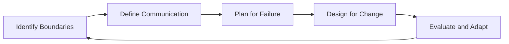
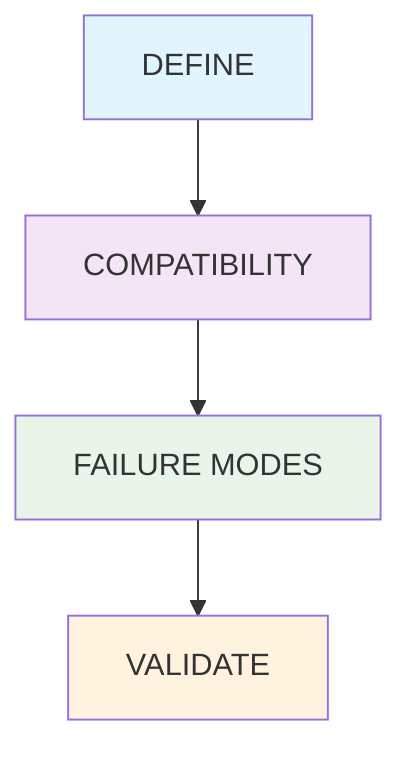

# Domain Knowledge Reference

Auto-generated from blog posts. Do not edit manually.
Last updated: 2026-03-03

---

## Source: fundamentals-of-software-architecture

URL: https://jeffbailey.us/blog/2025/10/19/fundamentals-of-software-architecture

### Introduction

You've seen it happen: a team builds a simple app that works for 100 users, then struggles as it grows to 1,000, 10,000, and beyond. It becomes unusable, needing constant fixes.

Sound familiar? This happens when software grows without intentional architecture.

Most developers learn to code by building small projects, focusing on features rather than how they work together as a system scales. Software architecture isn't about perfect code, but making decisions that allow your system to evolve without falling apart.

This article explains **why architectural decisions matter** and how to reason about trade-offs shaping long-term system behavior.

## What Software Architecture Actually Does

Software architecture is the set of decisions that determine how your system will behave as it grows. Think of it like the foundation of a building. You can't see it once the building is complete, but everything depends on it being solid.

*When you make architectural decisions, you're answering questions like:*

* How will different parts of your system communicate?
* What happens when one part fails?
* How will you add new features without breaking existing ones?
* Where will your data live, and how will it be accessed?

These are system questions, not coding ones. Understanding them differentiates short-lived software from lasting solutions. The answers decide if your software is maintainable or a nightmare.


> Type: **Explanation** (understanding-oriented).  
> Primary audience: **intermediate to advanced** developers and architects learning software architecture

## The Core Problem Architecture Solves

Every software system faces the same fundamental challenge: complexity grows faster than our ability to manage it.

A simple web application might start with a few HTML pages and a database. But as it grows, you need user authentication, payment processing, email notifications, file uploads, search functionality, and mobile apps. Each new feature interacts with existing features in ways you didn't anticipate.

Without architectural thinking, you end up with what I call "spaghetti architecture." Everything connects to everything else. Change one thing and you break three other things. Add a new feature and you have to modify code in five different places.

Good architecture prevents this by creating clear boundaries between different parts of your system. It's like organizing a messy room by putting things in labeled boxes. You know exactly where to find what you need, and you can change the contents of one box without affecting the others.

## The Software Architecture Workflow

Understanding software architecture follows a systematic process. Here's how architectural thinking works:



*Figure 1. The software architecture workflow loop.*

Each step exists to manage a specific dimension of complexity — scope, communication, failure, and change.

### 1. Identify System Boundaries

First, you need to understand what your system actually does and where its boundaries are. This sounds obvious, but it's surprisingly difficult.

Ask yourself: What is the core purpose of this system? What are the essential capabilities it must provide? What are the external systems it needs to interact with?

For example, an e-commerce system might have these boundaries:
* Product catalog management
* Order processing
* Payment handling
* Customer account management
* Inventory tracking

Each boundary represents a distinct area of responsibility. Changes in one area shouldn't require changes in others.

### 2. Define Communication Patterns

Once you know your boundaries, you need to decide how different parts will communicate. This is where most architectural mistakes happen.

The key question is: How will information flow between different parts of your system?

Think of communication like city infrastructure. Function calls are direct roads — fast but prone to traffic jams. Message queues are like postal systems — slower but resilient. REST APIs are highways — efficient but noisy. Event-driven systems resemble social networks — powerful but unpredictable.

You have several options:
* **Direct function calls** - Simple but creates tight coupling
* **Message queues** - Decoupled but adds complexity
* **REST APIs** - Standard but can become chatty
* **Event-driven architecture** - Flexible but harder to debug

The right choice depends on your specific needs, but the wrong choice will haunt you for years.

### 3. Plan for Failure

This is where architectural thinking really matters. What happens when things go wrong?

In a well-architected system, failure in one part doesn't bring down the whole system. You might lose the ability to process payments, but customers can still browse products. You might lose the search functionality, but users can still make purchases.

Imagine Netflix losing its recommendation service — you'd still stream movies, just with less personalization. That's architectural resilience: degradation without collapse.

This isn't just about technical resilience. It's about business continuity. Your architecture determines how gracefully your system degrades when problems occur.

### 4. Design for Change

The final step is planning for evolution. How will you add new features? How will you modify existing ones? How will you scale when usage grows?

Good architecture makes common changes easy and expensive changes possible. Bad architecture makes every change expensive and many changes impossible.

### 5. Evaluate and Adapt

Architectural decisions should be revisited regularly. Track metrics like availability, latency, deployment frequency, and recovery time. When these degrade, it's a signal your architecture needs attention. Architecture isn't a one-time design — it's a continuous conversation between code, users, and context.

Each step in the architectural workflow serves a single purpose: to reduce unmanaged complexity. When systems evolve without this systematic thinking, technical debt compounds faster than it can be repaid.

**Quick Check (1 min) — Why Each Step?**

1. Why define boundaries before communication patterns? (**To prevent tight coupling and clarify responsibilities.**)
2. How does planning for failure improve business resilience? (**It ensures graceful degradation rather than total collapse.**)

**Reflection:** Think about a system you've worked on. How might it change if you explicitly defined system boundaries and communication patterns?

## Types of Architectural Patterns

Different problems require different architectural approaches. Here are the main patterns you'll encounter:

### Monolithic Architecture

Everything runs in a single process. Simple to develop and deploy, but becomes difficult to scale and maintain as it grows.

**When to use:** Small applications, rapid prototyping, teams with limited DevOps experience.

**Trade-offs:** Easy to start, hard to scale, single point of failure.

### Microservices Architecture

The system is broken into many small, independent services. Each service handles one specific business capability.

**When to use:** Large teams, complex business domains, need for independent scaling.

**Trade-offs:** More complex to develop and deploy, better scalability and fault isolation.

### Event-Driven Architecture

Components communicate by publishing and subscribing to events. Loose coupling but harder to understand data flow.

**When to use:** Systems with complex business processes, need for real-time updates, multiple consumers of the same data.

**Trade-offs:** Very flexible, harder to debug, eventual consistency challenges.

### Layered Architecture

The system is organized into horizontal layers (presentation, business logic, data access). Clear separation of concerns.

**When to use:** Traditional business applications, teams familiar with enterprise patterns.

**Trade-offs:** Simple to understand, can become rigid, potential performance issues.

### Architectural Patterns Comparison

| Pattern       | Strengths           | Weaknesses     | When to Use       |
| ------------- | ------------------- | -------------- | ----------------- |
| Monolithic    | Easy deployment     | Hard to scale  | Small/simple apps |
| Microservices | Independent scaling | Complex ops    | Large teams       |
| Event-driven  | Flexible, reactive  | Debugging hard | Real-time systems |
| Layered       | Clear separation    | Can be rigid   | Traditional apps  |

**Reflection:** Which architectural pattern best fits your current project? What trade-offs are you willing to accept?

## Common Architectural Mistakes

Most architectural problems come from a few common mistakes:

### Mistake 1: Premature Optimization

You design for problems you don't have yet. You build a complex microservices architecture for an application that serves 100 users.

**Why it's wrong:** You're solving imaginary problems while creating real complexity.

**Better approach:** Start simple and evolve your architecture as you encounter real problems.

### Mistake 2: Ignoring Non-Functional Requirements

You focus on features and ignore performance, security, and maintainability until they become crises.

**Why it's wrong:** Non-functional requirements are much harder to add later than functional ones.

**Better approach:** Consider performance, security, and maintainability from the beginning.

### Mistake 3: Copying Architecture Without Understanding

You see that Netflix uses microservices, so you decide your startup needs microservices too.

**Why it's wrong:** Architecture should solve your specific problems, not someone else's.

**Better approach:** Understand the problems each pattern solves, then choose what fits your situation.

### Mistake 4: No Clear Boundaries

You let different parts of your system communicate directly without clear interfaces.

**Why it's wrong:** Changes ripple through the entire system, making maintenance impossible.

**Better approach:** Define clear boundaries and communication patterns between different parts.

### Architectural Mistakes Summary

| Mistake | Why It Happens | Architectural Remedy |
|----------|----------------|----------------------|
| Premature Optimization | Solving problems that don't exist yet | Start simple, evolve incrementally |
| Ignoring Non-Functional Requirements | Over-focus on features | Incorporate performance and security early |
| Copying Architecture Blindly | Cargo-culting large-scale systems | Choose patterns that fit your scale |
| No Clear Boundaries | Uncontrolled coupling | Explicit module and interface design |

## Getting Started with Software Architecture

If you're new to architectural thinking, here's how to start:

### 1. Study Existing Systems

Look at systems you use daily. How do they handle different types of users? How do they manage data? How do they handle errors?

Don't just use software. Understand how it's built.

### 2. Practice with Small Projects

Start applying architectural thinking to your own projects. Even a simple todo app can benefit from clear boundaries between data storage, business logic, and user interface.

### 3. Learn from Failures

When systems break, ask why. Was it a coding problem or an architectural problem? Could better architecture have prevented the failure?

### 4. Read About Real Systems

Study how companies like Amazon, Google, and Netflix have evolved their architectures. Understand the problems they were solving and why they chose their solutions.

## When NOT to Focus on Architecture

Architecture isn't always the answer. Sometimes you need to focus on other things:

* **Learning new technologies** - Architecture knowledge won't help if you don't understand the tools
* **Very small projects** - A simple script doesn't need complex architecture
* **Proof of concepts** - Focus on proving the concept works before worrying about architecture
* **One-person teams** - Architectural complexity can slow down solo development

The key is understanding when architectural thinking adds value and when it creates unnecessary complexity.

## The Future of Software Architecture

Software architecture is evolving, but the fundamentals remain constant. New technologies like containers, serverless computing, and AI are changing how we build systems, but the core principles of boundaries, communication, failure handling, and change management still apply.

The systems that succeed are the ones that balance innovation with solid architectural foundations. They use new technologies to solve new problems while maintaining the principles that make systems maintainable and scalable. The workflow loop (see Figure 1) remains the same: identify boundaries, define communication, plan for failure, design for change, and evaluate continuously.

## Key Takeaways

Software architecture isn't about following rules or copying patterns. It's about making conscious decisions about how your system will behave as it grows.

The fundamentals are simple:
* Define clear boundaries between different parts of your system
* Plan how those parts will communicate
* Design for failure and change
* Choose patterns that solve your specific problems

But applying these fundamentals requires practice and experience. Start with small projects, learn from failures, and gradually build your architectural thinking skills.

The goal isn't to become an architecture expert overnight. It's to develop the habit of thinking systematically about how your software will evolve. Because the systems that survive are the ones built with architectural thinking from the beginning.

## Quick Check

Before moving forward, test your understanding:

* **Can you explain why boundaries matter in architecture?** Think about how clear boundaries prevent changes from rippling through your entire system.
* **What trade-offs exist between REST APIs and event-driven systems?** Consider both technical complexity and business flexibility.
* **When is architecture overkill?** Remember that architectural thinking should solve real problems, not imaginary ones.
* **How does architectural resilience differ from system reliability?** Think about graceful degradation versus complete failure.

If you can answer these questions confidently, you're ready to apply architectural thinking to your next project.

## Next Steps

Ready to apply these concepts? Here are your next steps:

* **Practice with a real project** - Apply architectural thinking to your next project, no matter how small
* **Study system failures** - When systems break, analyze whether better architecture could have prevented the problem
* **Learn about specific patterns** - Deep dive into the architectural patterns that interest you most
* **Read case studies** - Study how real companies have evolved their architectures over time

The best way to learn software architecture is to practice it. Start thinking architecturally about your next project, and you'll begin to see the difference it makes.

### Related Articles

*Related fundamentals articles:*

**Software Engineering:** [Fundamentals of Software Development](/blog/2025/10/02/fundamentals-of-software-development/) shows how architecture fits into the broader software development process. [Fundamentals of Software Design](/blog/2025/11/05/fundamentals-of-software-design/) teaches you the design principles that inform architectural decisions. [Fundamentals of Software Testing](/blog/2025/11/30/fundamentals-of-software-testing/) helps you understand how architectural decisions affect testing strategies.

**Engineering Practices:** [Fundamentals of Backend Engineering](/blog/2025/10/14/fundamentals-of-backend-engineering/) shows how to architect backend systems and APIs. [Fundamentals of Frontend Engineering](/blog/2025/11/26/fundamentals-of-frontend-engineering/) teaches you how to structure frontend applications and user interfaces.

**Infrastructure:** [Fundamentals of Distributed Systems](/blog/2025/10/11/fundamentals-of-distributed-systems/) helps you understand how to architect systems that span multiple machines and handle scale. [Fundamentals of Databases](/blog/2025/09/24/fundamentals-of-databases/) shows how database architecture affects system design.

**Production Systems:** [Fundamentals of Reliability Engineering](/blog/2025/11/17/fundamentals-of-reliability-engineering/) helps you understand how architectural decisions affect system reliability and how to set quality targets. [Fundamentals of Monitoring and Observability](/blog/2025/11/16/fundamentals-of-monitoring-and-observability/) explains how architecture affects your observability strategy.

## Glossary

## References

**Academic Sources:**
* Bass, L., Clements, P., & Kazman, R. (2012). Software Architecture in Practice. Addison-Wesley Professional.
* Fowler, M. (2018). Microservices Patterns. Manning Publications.

**Industry Reports:**
* Thoughtworks Technology Radar (2024). Architecture patterns and practices in enterprise software development.
* IEEE Software Architecture Working Group (2023). Current trends in software architecture practices.

**Practical Resources:**
* Martin Fowler's Architecture Blog - Real-world architectural decision case studies
* AWS Architecture Center - Cloud-specific architectural patterns and best practices
* Google Cloud Architecture Framework - Enterprise architecture guidance and patterns

**Expert Opinions:**
* Sam Newman on Microservices (2015). Building Microservices: Designing Fine-Grained Systems.
* Neal Ford on Evolutionary Architecture (2017). Building Evolutionary Architectures.

*Note: Software architecture practices evolve rapidly. While these fundamentals remain constant, specific implementation patterns and technologies change frequently. Always verify current best practices for your specific technology stack and use case.*


---

## Source: fundamentals-of-software-design

URL: https://jeffbailey.us/blog/2025/11/05/fundamentals-of-software-design

## Introduction

Why do some codebases remain maintainable for years while others become unworkable in less than a year? The difference comes down to software design.

If you've spent hours debugging code that should have been simple, you need the fundamentals of software design. If your team argues about how to add new features without breaking existing code, you need these fundamentals. Software design is the process of making decisions that shape how code is organized, how components interact, and how systems evolve.

**Software design** is the art and science of organizing code and systems to meet requirements while remaining maintainable, testable, and extensible. Good design makes code easy to understand, modify, and extend. Bad design makes every change a risk, every bug a mystery, and every feature addition a nightmare.

The software industry overflows with design patterns, principles, and methodologies. Each claims to solve the problems of software complexity. But the fundamentals of design remain constant across languages, frameworks, and paradigms. By mastering these fundamentals, you develop judgment for when to apply patterns, how to balance competing concerns, and what makes design decisions effective.

**What this is (and isn't):** This article explains core principles of software design and trade-offs between different approaches. This is not a step-by-step tutorial or a catalog of every design pattern. It's about understanding **why** design matters and **how** to make design decisions that create lasting value.

**Why software design matters:**

* **Maintainability** - Well-designed code is easier to understand and modify months or years later.
* **Testability** - Good design makes code easier to test, which catches bugs earlier.
* **Scalability** - Design decisions determine whether systems can grow without significant rewrites.
* **Team productivity** - Clear design reduces confusion and enables parallel development.
* **Technical debt** - Poor design decisions compound into unmanageable complexity over time.

Mastering software design transforms you from someone who writes code that works to someone who writes code that works and remains maintainable for years.


> Type: **Explanation** (understanding-oriented).  
> Primary audience: **all levels** - beginners learning design principles, experienced developers evaluating their design decisions

## Section 1: What Software Design Actually Means

Software design happens at multiple levels, from individual functions to entire systems. Understanding these levels helps you recognize where design decisions matter most.

### Design as Decision-Making

Design is fundamentally about making decisions. Every time you write code, you're making design decisions:

* **Naming** - What do you call variables, functions, and classes?
* **Organization** - How do you structure files, modules, and packages?
* **Abstraction** - What details do you hide, and what do you expose?
* **Coupling** - How do components depend on each other?
* **Cohesion** - What belongs together in a single component?

These decisions accumulate into the design of your system. There's no such thing as "no design" - there's only intentional design or accidental design. Accidental design creates systems that are hard to understand and maintain.

### Levels of Design

Software design operates at different levels of abstraction:

**Code-level design** - How individual functions and classes are structured. This includes naming, parameter choices, and function responsibilities.

**Component-level design** - How modules and packages interact. This includes APIs, interfaces, and component dependencies.

**System-level design** - How entire systems are architected. This includes [software architecture](/blog/2025/10/19/fundamentals-of-software-architecture/) patterns, deployment strategies, and integration approaches.

Each level has its own design concerns, but they all follow the same fundamental principles. A well-designed function is easy to understand. A well-designed component is easy to use. A well-designed system is easy to evolve.

### Design vs. Architecture

Design and architecture are related but distinct. **Architecture** describes the high-level structure of a system—the major components and their interactions. **Design** represents the detailed decisions for implementing those components.

You can have good architecture with poor design (well-structured components that are poorly implemented). You can have a good design with poor architecture (well-implemented components in a poorly structured system). You need both, but design fundamentals apply at every level.

## Section 2: Core Design Principles

Design principles are guidelines that help you make better design decisions. They're not rules to follow mindlessly, but tools for reasoning about trade-offs.

### SOLID Principles

SOLID is an acronym for five object-oriented design principles that help create maintainable, flexible code:

**Single Responsibility Principle (SRP)** - A class should have one reason to change. If a class handles user authentication, database access, and email sending, it has multiple responsibilities. When requirements change in any area, you risk breaking others.

**Open/Closed Principle (OCP)** - Software should be open for extension but closed for modification. You should be able to add new features by extending existing code rather than modifying it. This prevents changes in one area from breaking others.

**Liskov Substitution Principle (LSP)** - Subtypes must be substitutable for their base types. If you have a `Bird` class and a `Penguin` subclass, code that works with `Bird` should work with `Penguin` without knowing the difference.

**Interface Segregation Principle (ISP)** - Clients shouldn't depend on interfaces they don't use. Instead of a single large interface, create multiple smaller ones. This prevents clients from depending on methods they don't need.

**Dependency Inversion Principle (DIP)** - High-level modules shouldn't depend on low-level modules. Both should depend on abstractions. This makes systems more flexible and testable.

SOLID principles work together to create code that's easier to change, test, and understand. They're not about perfection, but about reducing the cost of change.

### DRY (Don't Repeat Yourself)

DRY emphasizes eliminating duplication. When the same logic appears in multiple places, changes require updating various locations. This increases the chance of bugs and inconsistencies.

DRY doesn't mean you should never duplicate code. Sometimes duplication is acceptable when the cost of abstraction exceeds the cost of duplication. But when duplication represents the same knowledge or requirement, it should be eliminated.

### KISS (Keep It Simple, Stupid)

Simplicity is the ultimate sophistication. The simplest solution that works is usually the best solution. Complex designs are challenging to understand, test, and maintain.

KISS doesn't mean avoiding necessary complexity. Some problems are inherently complex. But it means avoiding unnecessary complexity—abstractions, patterns, and structures that don't provide clear value.

### YAGNI (You Aren't Gonna Need It)

YAGNI cautions against adding functionality before you need it. Premature abstraction and "future-proofing" often create complexity that never pays off.

Design for today's requirements, not tomorrow's hypothetical requirements. When requirements change, refactor to accommodate them. This keeps design relevant and avoids wasted effort.

### The Principle of Least Surprise

Code should behave the way readers expect. Function names should accurately describe what they do. APIs should follow conventions. Behavior should be predictable.

When code surprises readers, it's hard to understand and more likely to be misused. Predictable code is maintainable code.

## Section 3: Design Patterns

Design patterns are reusable solutions to common design problems. They're not code to copy, but templates for solving specific types of issues.

### Why Patterns Matter

Patterns provide a shared vocabulary for discussing design. When you say "we should use a Factory pattern here," other developers understand what you mean. Patterns also encode knowledge about which designs work well in which situations.

But patterns are tools, not goals. Using a pattern doesn't automatically make code better. Patterns solve specific problems, and applying them to problems they don't solve creates unnecessary complexity.

### Common Design Patterns

**Creational Patterns** - How objects are created:

* **Factory** - Creates objects without specifying exact classes.
* **Builder** - Constructs complex objects step by step.
* **Singleton** - Ensures only one instance exists (use sparingly).

**Structural Patterns** - How objects are composed:

* **Adapter** - Allows incompatible interfaces to work together.
* **Decorator** - Adds behavior to objects dynamically.
* **Facade** - Provides a simplified interface to a complex subsystem.

**Behavioral Patterns** - How objects communicate:

* **Observer** - Notifies multiple objects about state changes.
* **Strategy** - Encapsulates algorithms and makes them interchangeable.
* **Command** - Encapsulates requests as objects.

These patterns appear frequently because they solve everyday problems. Understanding them helps you recognize when to apply them and when simpler solutions suffice.

*Dive deeper into design patterns with Learn Software Design Patterns.* <!-- Draft-only link removed: learn-software-design-patterns -->

### When Not to Use Patterns

Patterns are solutions to problems. If you don't have a problem, you don't need a pattern. Adding patterns "just in case" violates You Aren't Gonna Need It (YAGNI) and creates unnecessary complexity.

I've seen codebases where every class follows a pattern, even when simple functions would work. The result is complexity that makes the code harder to understand without providing benefits.

Use patterns when they solve real problems, not when they make code look "professional."

## Section 4: Design Trade-offs

Every design decision involves trade-offs. Understanding trade-offs helps you make better decisions.

### Flexibility vs. Simplicity

Flexible designs handle many scenarios but are often more complex. Simple designs are easier to understand but may be less flexible.

**Trade-off:** More flexibility usually means more complexity. Only add flexibility when you need it.

### Performance vs. Maintainability

Optimized code is often more complicated to understand. Readable code is sometimes less efficient.

**Trade-off:** Start with maintainable code. Optimize only when performance matters and you've measured the need.

### Abstraction vs. Clarity

Abstractions hide complexity but can obscure understanding. Direct code is clear but may be verbose.

**Trade-off:** Abstractions are valuable when they hide complexity that doesn't need to be understood. They're harmful when they hide necessary complexity.

### Coupling vs. Cohesion

Tight coupling makes components interdependent. Loose coupling makes components independent, but it may lead to code duplication.

High cohesion keeps related things together. Low cohesion spreads related things apart.

**Trade-off:** Aim for high cohesion and loose coupling. This is easier said than done and requires constant attention.

### Consistency vs. Context

Consistent designs are easier to learn. But different contexts may need different approaches.

**Trade-off:** Be consistent within contexts, but allow variation between contexts when it makes sense.

## Section 5: Design Quality Indicators

How do you know if your design is good? These indicators help you evaluate design quality.

### Readability

Can someone new to the codebase understand what's happening? If the code requires extensive comments to explain, the design may be too complex.

Code should be self-documenting through clear names, simple structure, and obvious intent.

### Testability

Can you write tests for the code easily? If testing requires a complex setup or mocking, the design may have too many dependencies.

Good design makes testing straightforward. Functions do one thing. Dependencies are explicit. Side effects are minimized.

### Changeability

How hard is it to add features or fix bugs? If changes require modifying code in many places, coupling is too high.

Good design localizes changes. When requirements change, you should know exactly where to modify code.

### Discoverability

Can developers find what they need? If it's unclear where functionality lives, the organization needs improvement.

Good design makes code easy to navigate. Related things are grouped. Naming reveals purpose.

### Debuggability

When something breaks, can you find the problem quickly? If bugs are mysteries, design may be hiding important information.

Good design makes problems obvious. Errors are clear. Logging is helpful. State is visible.

## Section 6: Common Design Mistakes

Understanding common mistakes helps you avoid them. I've made all of these mistakes, and they've cost me weeks of debugging and refactoring.

### Over-Engineering

Creating elaborate abstractions for simple problems. This violates the You Aren't Gonna Need It (YAGNI) and Keep It Simple, Stupid (KISS) principles.

**Symptoms:** Complex class hierarchies for straightforward logic. Patterns applied without problems to solve. Abstraction layers that don't add value.

**Solution:** Start simple. Add complexity only when you have concrete problems to solve.

### Under-Engineering

Ignoring design entirely and writing code that "just works." This creates technical debt that compounds over time.

**Symptoms:** Copy-pasted code everywhere. Functions that do too many things. No clear organization.

**Solution:** Apply basic design principles from the start. Refactor regularly to improve design.

### Premature Abstraction

Abstracting before you understand the problem. This creates abstractions that don't fit actual needs.

**Symptoms:** Interfaces that are too generic or too specific. Abstractions that leak implementation details.

**Solution:** Write concrete code first. Extract abstractions when you see patterns across multiple implementations.

### Pattern Abuse

Using patterns everywhere because they're "best practices." This creates unnecessary complexity.

**Symptoms:** Every class implements multiple interfaces. Factory factories. Strategy strategies. Patterns nested inside patterns.

**Solution:** Use patterns to solve problems, not to demonstrate knowledge.

### Magic Numbers and Strings

Hard-coding values instead of using named constants. This makes the code more complicated to understand and modify.

**Symptoms:** Numbers like `86400` or strings like `"active"` scattered throughout code.

**Solution:** Extract magic values into named constants with precise meanings.

### God Objects

Classes that know too much or do too much. This violates the Single Responsibility Principle (SRP) and makes code hard to change.

**Symptoms:** Classes with hundreds of methods. Classes that handle multiple unrelated responsibilities.

**Solution:** Break large classes into smaller, focused classes with single responsibilities.

## Section 7: Design in Practice

Theory is useless without practice. Here's how to apply design principles in real development.

### Start with Clarity

Write code that's easy to understand. Well-designed code is easier to write because you can see what it does.

If you can't explain what the code does in simple terms, the design needs improvement.

### Relentlessly Refactor

Design improves through iteration. Refactor code regularly to improve design without changing behavior.

Don't wait for "refactoring sprints." Make minor improvements continuously, but try to isolate major refactors from feature additions and changes.

### Learn from Mistakes

When code is hard to change, understand why. What design decisions made it difficult? What would you do differently?

Every difficult change is a learning opportunity about design.

### Review with Others

Design benefits from multiple perspectives. Code reviews help catch design problems early.

Ask reviewers to evaluate design, not just correctness. Does the design make sense? Is it easy to understand?

### Measure What Matters

Track metrics that indicate design quality:

* **Cyclomatic complexity** - Measures code complexity.
* **Coupling metrics** - Measures dependencies between components.
* **Code review time** - Long review times may indicate design problems.
* **Bug frequency** - Frequent bugs in an area may indicate design issues.

Use metrics to identify problems, but don't optimize metrics at the expense of solving real problems.

## Section 8: Design and Related Fundamentals

Software design connects to other fundamental areas. Understanding these connections helps you make better design decisions.

### Design and Architecture

[Software architecture](/blog/2025/10/19/fundamentals-of-software-architecture/) defines the high-level structure of systems. Design implements that structure. Good architecture enables good design by providing clear boundaries and responsibilities.

### Design and Development Practices

[Software development](/blog/2025/10/02/fundamentals-of-software-development/) practices influence design. Test-driven development encourages testable designs. Continuous refactoring improves design over time.

### Design and Databases

[Database design](/blog/2025/09/24/fundamentals-of-databases/) affects application design. Data models shape how applications organize and access information. Understanding database fundamentals helps you design applications that work well with data.

### Design and Distributed Systems

[Distributed systems](/blog/2025/10/11/fundamentals-of-distributed-systems/) design requires considerations different from single-machine applications. Understanding the fundamentals of distributed systems helps you design applications that work across networks.

## Conclusion

Software design is the foundation of maintainable, scalable systems. Good design makes code easier to understand, test, and modify. Poor design creates technical debt that compounds into unmanageable complexity.

The developers who build lasting systems aren't those who know every design pattern. They're the ones who understand design principles deeply enough to make good decisions in specific contexts. They recognize when to apply patterns and when simpler solutions work better.

Ignore design and you'll spend your career fighting complexity, debugging mysteries, and struggling to add features. Master design fundamentals and you'll spend your career building systems that remain maintainable as they grow and evolve.

The choice is yours. You can write code that works today but quickly becomes unmaintainable, or you can invest in design fundamentals that create lasting value.

## Call to Action

Start improving your design skills today. Choose one area where you feel design is weakest and commit to applying design principles.

**Getting Started:**

1. **Review existing code** - Identify design problems in the code you work with regularly.
2. **Apply one principle** - Pick a SOLID principle and look for opportunities to apply it.
3. **Refactor something** - Improve the design of a small piece of code without changing behavior.
4. **Read design code** - Study well-designed open source projects to see principles in practice.
5. **Get feedback** - Ask experienced developers to review your design decisions.

*Here are resources to help you begin:*

* **Books**: [Design Patterns: Elements of Reusable Object-Oriented Software](https://en.wikipedia.org/wiki/Design_Patterns), [Clean Code](https://www.amazon.com/Clean-Code-Handbook-Software-Craftsmanship/dp/0132350882), [Refactoring](https://refactoring.com/)
* **Practice**: Refactor existing code, contribute to open source projects, build projects with design in mind

### Related Articles

*Related fundamentals articles:*

**Software Engineering:** [Fundamentals of Software Development](/blog/2025/10/02/fundamentals-of-software-development/) shows how design fits into the broader software development process. [Fundamentals of Software Architecture](/blog/2025/10/19/fundamentals-of-software-architecture/) helps you understand how design decisions scale to architectural patterns. [Fundamentals of Software Testing](/blog/2025/11/30/fundamentals-of-software-testing/) teaches you how to design code that's testable and maintainable.

**Engineering Practices:** [Fundamentals of Backend Engineering](/blog/2025/10/14/fundamentals-of-backend-engineering/) shows how to apply design principles to backend systems and APIs. [Fundamentals of Frontend Engineering](/blog/2025/11/26/fundamentals-of-frontend-engineering/) teaches you how to design user interfaces and frontend components.

**Infrastructure:** [Fundamentals of Databases](/blog/2025/09/24/fundamentals-of-databases/) helps you understand how database design affects application design. [Fundamentals of Distributed Systems](/blog/2025/10/11/fundamentals-of-distributed-systems/) shows how design principles apply to systems that span multiple machines.

**Production Systems:** [Fundamentals of Metrics](/blog/2025/11/09/fundamentals-of-metrics/) teaches you how design decisions affect the metrics you'll track and measure.

## Glossary

## References

* [SOLID Principles]
* [Design Patterns: Elements of Reusable Object-Oriented Software]
* [DRY Principle]
* [KISS Principle]
* [YAGNI Principle]
* [Code Refactoring]

[SOLID Principles]: https://en.wikipedia.org/wiki/SOLID
[Design Patterns: Elements of Reusable Object-Oriented Software]: https://en.wikipedia.org/wiki/Design_Patterns
[DRY Principle]: https://en.wikipedia.org/wiki/Don%27t_repeat_yourself
[KISS Principle]: https://en.wikipedia.org/wiki/KISS_principle
[YAGNI Principle]: https://en.wikipedia.org/wiki/You_aren%27t_gonna_need_it
[Code Refactoring]: https://en.wikipedia.org/wiki/Code_refactoring


---

## Source: fundamentals-of-api-design-and-contracts

URL: https://jeffbailey.us/blog/2026/01/16/fundamentals-of-api-design-and-contracts

## Introduction

Why do some integrations feel calm while others feel like stepping on a rake every release? The root cause is usually the contract: it is either clear and stable or fuzzy and brittle.

An Application Programming Interface (API) contract is a shared promise between a provider and a consumer about what the API accepts, returns, and how it handles failures. As [systems grew distributed](/blog/2026/01/19/fundamentals-of-centralized-software-systems/) and teams worked independently, explicit promises became essential. Treating the contract as a product helps solidify design choices.

Unclear contracts create invisible work.

**What this is (and isn't):** This article explains API design and contracts, emphasizing why contracts matter and their core components, without covering implementation details, tooling, or exhaustive catalogs.

**Why API design and contract fundamentals matter:**

* **Predictable integrations** - People can build against the API without fear of surprise behavior.
* **Change safety** - Systems can evolve without breaking clients each release.
* **Operational clarity** - Failures are easier to diagnose if the contract defines errors.

This article outlines a workflow for projects:

1. **Define the contract** - Clarify inputs, outputs, and invariants.
2. **Model compatibility** - Decide what can change and what cannot.
3. **Design failure modes** - Treat errors as part of the contract.
4. **Validate and communicate** - Keep the contract visible and testable.

> Type: **Explanation** (understanding-oriented).  
> Primary audience: **beginner to intermediate** engineers and product teams.

### Prerequisites & Audience

**Prerequisites:** Basic understanding of Hypertext Transfer Protocol (HTTP) requests, JSON payloads, and client-server interactions.

**Primary audience:** Engineers, product managers, and technical writers who need a clear mental model for API contracts.

**Jump to:** [Section 1: Contracts as Promises](#section-1-contracts-as-promises) • [Section 2: Representation and Semantics](#section-2-representation-and-semantics) • [Section 3: Versioning and Compatibility](#section-3-versioning-and-compatibility) • [Section 4: Errors and Status Codes](#section-4-errors-and-status-codes) • [Section 5: Idempotency and Reliability](#section-5-idempotency-and-reliability) • [Section 6: Common API Design Mistakes](#section-6-common-api-design-mistakes) • [Section 7: Common Misconceptions](#section-7-common-misconceptions) • [Section 8: When NOT to Use Formal Contracts](#section-8-when-not-to-use-formal-contracts) • [Future Trends](#future-trends--evolving-standards) • [Limitations & Specialists](#limitations--when-to-involve-specialists) • [Glossary](#glossary)

### TL;DR - API Design Fundamentals in One Pass

If I only remember one workflow, make it this:

* **Name the promises** so consumers understand what the API guarantees.
* **Preserve compatibility** so changes do not break existing clients.
* **Treat errors as data** so failures are diagnosable and consistent.

**The API Contract Workflow:**



### Learning Outcomes

By the end of this article, I will be able to:

* Explain **why** API contracts reduce integration risk and confusion, and how ambiguity causes rework.
* Explain **why** representation and semantics must align for reliable APIs and how misalignment leads to integration failures.
* Explain how idempotency impacts safety in distributed systems and identify when operations must or cannot be idempotent.

## Section 1: Contracts as Promises {#section-1-contracts-as-promises}

An API contract is a promise about behavior, not just a list of endpoints. It defines the boundary between teams, services, and time.

A contract is like a lease agreement. The provider promises heat and water, the tenant promises rent and a deposit.

### Understanding the Basics

**Inputs and outputs:** A contract defines request and response shapes and the meaning of each field.

**Invariants:** These are the rules that must always hold, such as ordering guarantees or required fields.

### Why This Works

Contracts reduce ambiguity, which forces teams to guess, test, and debug, leading to rework. A precise contract eliminates guesswork, makes integration straightforward, lowers costs, and enables faster construction.

### Examples

Here is a short OpenAPI Specification (OAS) example that shows a clear contract for a read-only endpoint:

```yaml
openapi: 3.1.0
paths:
  /customers/{id}:
    get:
      summary: Get a customer
      parameters:
        - name: id
          in: path
          required: true
          schema:
            type: string
      responses:
        "200":
          description: Customer found
        "404":
          description: Customer not found
```

### Quick Check: Contracts as Promises

Before moving on, I should test my understanding:

* Can I describe the core promises of one API I use weekly?
* Can I explain how the API behaves when the input is invalid?

**Answer guidance:** **Ideal result:** I can summarize the endpoint's inputs, outputs, and failure behavior without guessing.

## Section 2: Representation and Semantics {#section-2-representation-and-semantics}

Representation and semantics matter because an API is two things at once. It is the payload's shape and the meaning behind it.

Think of a shipping label. It is just ink on paper, but it also encodes who pays, where it goes, and how it should be handled. If the label is wrong, the package fails even if the box is fine.

### Understanding the Basics

**Representation:** The structure of requests and responses, usually JSON.

**Semantics:** The meaning of each field, the allowed values, and the business rules behind them.

### Why This Works

Representation without semantics is like a dictionary without definitions, and semantics without representation is shared understanding that never enters code.

### Examples

Here is a request that shows semantic expectations for a money transfer:

```json
{
  "amount": 2500,
  "currency": "USD",
  "recipient_id": "cust_3471",
  "idempotency_key": "f2c1e8a1-3a53-4d8a-9f0a-1b9a1d2a6f7f"
}
```

The representation is JSON, but the semantics say the amount is in cents and the currency uses ISO 4217 codes.

### Quick Check: Representation and Semantics

Before moving on, I should test my understanding:

* Can I explain what each field means, not just its type?
* Can I explain a real business rule that affects the payload?

**Answer guidance:** **Ideal result:** I can explain both the shape and the meaning of the data.

## Section 3: Versioning and Compatibility {#section-3-versioning-and-compatibility}

Versioning tells consumers when a change is safe and when it is not.

Compatibility is the mental model. Backward-compatible changes keep existing clients working. Breaking changes require a new version or a contract migration plan.

### Understanding the Basics

**Backward compatibility:** Older clients continue to work without code changes.

**Deprecation:** A documented path for removing behavior without surprise.

### Why This Works

Compatibility enables teams to work independently; without it, changes cause coordination issues and integration risks.

### Examples

Here is a backward-compatible response change. It adds a new optional field:

```json
{
  "id": "cust_3471",
  "status": "active",
  "loyalty_tier": "gold"
}
```

Adding loyalty_tier is usually safe. Removing status or changing its meaning is not.

### The Schema-as-Contract Versioning Problem

Consumers often treat the schema as part of the contract and assume it must remain unchanged. This creates a versioning problem: if you publish a schema in your OpenAPI spec, consumers will code against that exact structure and expect it to remain stable.

**The problem:** When evolving the schema, even for backward-compatible changes like adding optional fields, consumers may resist or misunderstand, assuming any change needs a new API version, causing unnecessary version proliferation.

**The reality:** The contract focuses on behavior and compatibility, not precise schema matching. Backward-compatible schema changes (adding optional fields, extending enums) shouldn't need versioning, but consumers might act as if they do.

**How to address it:** Clearly document which schema changes are backward compatible and communicate that the contract focuses on behavior, not exact structure. Use deprecation warnings for fields you plan to remove, but make it clear that adding optional fields does not break the contract.

### Version Lifecycle Management

A critical question that versioning strategies must answer: **How many versions do you need to support?** All of them? Indefinitely?

**The practical limit:** You cannot support every version forever. At some point, you will need to retire old versions, but the question is when and how.

**The root issue:** Supporting multiple API versions is costly and often unsustainable due to storage refactors, security risks, performance issues, third-party dependency changes, and increasing costs, making indefinite support impractical.

**Version lifecycle strategy:**

1. **Set a deprecation policy** - Document how long you will support deprecated versions (e.g., "deprecated versions supported for 12 months").
2. **Plan for major changes** - When a major refactor is upcoming (storage migrations, security updates, dependency changes), plan the API version retirement accordingly.
3. **Communicate early** - Give consumers months of notice before version retirement, not weeks.
4. **Provide migration paths** - Offer clear documentation and tooling to help consumers move to newer versions.

**Example:** If you're migrating from a relational database to a document store, you may need to retire API v1 because the data model fundamentally changes. Announce the retirement 6-12 months in advance, provide migration guides, and offer support during the transition.

### Trade-offs and Limitations

Compatibility rules may delay redesigns, but the cost is worth it. Breaking client trust erodes it faster than it saves time.

However, versioning has practical limits. You cannot support every version indefinitely, especially when underlying storage schemas change. The challenge is balancing consumer stability with your ability to evolve the system. A clear deprecation policy and early communication help manage this tension.

### Quick Check: Versioning and Compatibility

Before moving on, I should test my understanding:

* Can I tell which changes are backward compatible and which are not?
* Can I explain how I communicate breaking changes to consumers?
* Do I have a deprecation policy that defines how long I'll support old versions?
* What happens when a storage schema refactor makes supporting an old API version impractical?

**Answer guidance:** **Ideal result:** I can classify changes, explain my versioning policy clearly, and have a plan for version lifecycle management including retirement.

## Section 4: Errors and Status Codes {#section-4-errors-and-status-codes}

Errors are not exceptions to the contract; they are part of it. When errors are not designed intentionally, clients invent their own handling.

The Hypertext Transfer Protocol (HTTP) gives a baseline with status codes. Error bodies still need to explain what happened and what the client should do next.

### Understanding the Basics

**Status codes:** HTTP status codes explain the category of the outcome.

**Error shapes:** Consistent fields for error code, message, and details.

### Why This Works

When errors are structured, support tickets become quick diagnoses. Without structure, errors become stories, and nobody can reproduce them.

### Examples

Here is a consistent error response for a validation failure:

```json
{
  "error": {
    "code": "invalid_argument",
    "message": "email must be a valid address",
    "field": "email"
  }
}
```

This response tells the client what failed and where.

### Quick Check: Errors and Status Codes

Before moving on, I should test my understanding:

* Do my errors have a stable structure across endpoints?
* Do I document which errors are retryable?

**Answer guidance:** **Ideal result:** Errors are predictable, structured, and documented with recovery hints.

## Section 5: Idempotency and Reliability {#section-5-idempotency-and-reliability}

Distributed systems are noisy with retries, network failures, and clients hitting the same endpoint twice. Idempotency keeps it safe.

Idempotency means an operation can be repeated without changing the result beyond the first success, making it a promise about side effects.

### Understanding the Basics

**Idempotent operations:** Repeating the request does not create additional side effects.

**Idempotency keys:** Client-generated tokens that let the server recognize duplicates.

### Why This Works

Retries are inevitable. Idempotency makes retries safe and predictable, preventing double charges or duplicates.

### Examples

Here is a simplified example of how an idempotency key appears in a request header:

```bash
curl -X POST "https://api.example.com/payments" \
  -H "Content-Type: application/json" \
  -H "Idempotency-Key: f2c1e8a1-3a53-4d8a-9f0a-1b9a1d2a6f7f" \
  -d '{"amount": 2500, "currency": "USD"}'
```

The contract states that the same key should produce the same outcome.

### Quick Check: Idempotency and Reliability

Before moving on, I should test my understanding:

* Can I explain which operations must be idempotent and why?
* Can I explain how retries interact with timeouts?

**Answer guidance:** **Ideal result:** I can map retries to safe, documented outcomes.

## Section 6: Common API Design Mistakes {#section-6-common-api-design-mistakes}

Common mistakes cause brittle integrations and debugging debt. Recognizing them helps avoid future issues.

### Mistake 1: Hiding Breaking Changes

Releasing breaking changes without a version plan forces clients to make urgent fixes.

**Incorrect:**

```json
{
  "id": "cust_3471",
  "state": "active"
}
```

**Correct:**

```json
{
  "id": "cust_3471",
  "status": "active",
  "state": "active"
}
```

The correct version retains the status and adds the state during transition.

### Mistake 2: Inconsistent Error Shapes

When each endpoint has a different error format, clients must write custom logic for each call.

**Incorrect:**

```json
{
  "message": "invalid token"
}
```

**Correct:**

```json
{
  "error": {
    "code": "unauthenticated",
    "message": "invalid token",
    "request_id": "req_9821"
  }
}
```

A consistent error model lets clients handle failures uniformly.

### Quick Check: Common Mistakes

I should test my understanding:

* Do I have a documented policy for breaking changes?
* Can every endpoint produce a consistent error shape?

**Answer guidance:** **Ideal result:** The API avoids silent breaking changes and uses one error schema everywhere.

## Section 7: Common Misconceptions {#section-7-common-misconceptions}

Common misconceptions about API design and contracts include:

* **"A schema is the same as a contract."** A schema defines a shape, a contract defines behavior and guarantees. A schema says "this field is a string." A contract says "this field is required, this endpoint is idempotent, and this error code means retry after 5 seconds." Behavior promises make contracts useful, not just structure. This misconception creates versioning problems: consumers often assume the schema must remain unchanged and treat any schema modification as a breaking change, even when backward-compatible changes (like adding optional fields) should not require versioning. See [The Schema-as-Contract Versioning Problem](#the-schema-as-contract-versioning-problem) for more details.

* **"Status codes are enough for errors."** Status codes are categories, but clients need structured details. A 400 code indicates "bad request" but not which field failed or how to fix it. Structured error bodies give actionable info that codes alone lack.

* **"Version numbers solve all breaking changes."** Versioning aids but doesn't replace compatibility rules or deprecation paths. Numbers signal change but don't prevent breaking changes or guide migration. Compatibility rules specify safe changes, and deprecation paths detail transition methods.

## Section 8: When NOT to Use Formal Contracts {#section-8-when-not-to-use-formal-contracts}

Formal contracts aren't always necessary; skipping them can be right if costs outweigh benefits.

**Private prototypes** - If an API is temporary and used by one engineer, a light contract may suffice.

**Single-team codebases** - If the provider and consumer are the same team and churn is high, a lighter contract can accelerate progress.

**Exploratory research** - Early research APIs evolve quickly, making detailed contracts unnecessary.

Even without a formal contract, basic shapes and error patterns must still be documented to clarify the API.

## Contract-First Development and OpenAPI Specification

Contract-first development treats the API specification as the source of truth, driving implementation rather than documenting it after the fact.

**The problem:** Many teams generate OpenAPI specs from code or update contracts manually, causing drift between the contract and the API. When the contract follows the code, it documents what exists rather than what should exist.

**Why contract-first matters:** Starting with the contract drives design decisions early, making it a product requirement rather than an afterthought. It shifts the focus from "what did we build?" to "what should we promise?"

**The mental model:** In contract-first development, the OpenAPI Specification guides the entire API lifecycle. Teams design the contract first, generate mocks for early testing, validate implementation in CI/CD, and generate code from it. The contract serves as the single source of truth, preventing drift between promise and reality.  

**Benefits:**

* **Early feedback** - Consumers can test against mocks before implementation, catching design issues early
* **Reduced drift** - Contract and implementation stay aligned because the contract drives the code
* **Better collaboration** - Design discussions happen before coding, when changes are cheaper
* **Automated validation** - CI/CD pipelines catch contract violations automatically, preventing accidental breaking changes

**The tooling ecosystem:** Tools like Spectral for linting, Prism for mock servers, and code generators that create server stubs and client Software Development Kit (SDK) libraries from OpenAPI specs make contract-first development practical. These tools treat the specification as the source of truth, not just documentation.

Mature teams treat the OpenAPI Specification as a living document that drives all API-related work, not just documentation. The contract becomes the product requirement that implementation must satisfy.

## Building Contract Focused APIs

API contracts keep teams aligned. When treated as living promises, they improve compatibility, clarify errors, and reduce anxiety on release day.

### Core Concepts

* **Contracts are promises** - They set expectations about behavior and outcomes.
* **Semantics matter** - The meaning behind fields is part of the contract.
* **Errors are product surface** - Clients need structured, actionable failures.

### How These Concepts Connect

Contracts define promises between provider and consumer, with representation and semantics ensuring mutual understanding. Versioning and compatibility allow safe evolution, while errors enable predictable failures and diagnostics. Idempotency ensures safe retries in distributed systems. These concepts make APIs reliable, predictable products, not fragile integrations.

### Next Steps

**Learning path:**

* Read [Fundamentals of Technical Writing](/blog/2025/10/12/fundamentals-of-technical-writing/) to improve my API documentation structure.
* Explore [Fundamentals of Software Architecture](/blog/2025/10/19/fundamentals-of-software-architecture/) for broader system boundaries.
* Study [Fundamentals of Centralized Software Systems](/blog/2026/01/19/fundamentals-of-centralized-software-systems/) to understand when centralized architectures work well and when API contracts become critical for distributed systems.

**Questions for reflection:**

* Which promises are implicit instead of explicit in my APIs?

### The API Contract Workflow: A Quick Reminder

Here is the core workflow one more time:


### Final Quick Check

Before I move on, I should see if I can answer these out loud:

1. What is the most important promise in my main API?
2. Which changes are backward compatible?
3. How does my API represent errors consistently?

If any answer feels fuzzy, I should revisit the matching section and skim the examples again.

### Self-Assessment - Can I Explain These in My Own Words?

Before moving on, I should see if I can explain these concepts in my own words:

* Contract versus schema.
* Compatibility and versioning trade-offs.

If I can explain these clearly, I have internalized the fundamentals.

## Future Trends & Evolving Standards {#future-trends--evolving-standards}

API standards and practices continue to evolve. Understanding upcoming changes helps teams plan ahead.

### Trend: AI-Ready APIs and Agent Integration

Many developers design APIs for AI agents, with unauthorized calls as the top security concern. Organizations benefit from APIs that support AI workflows. Learn more about how AI agents access tools through [What Is MCP?](/blog/2026/01/15/what-is-mcp/), coordinate with each other through [What Is the Agent2Agent Protocol (A2A)?](https://jeffbailey.us/what-is-the-agent2agent-protocol-a2a/), and acquire procedural knowledge through [Agent Skills](https://jeffbailey.us/what-are-agent-skills/)

**What this means:** APIs should manage agent-specific patterns like tool calling, streaming, and rate limiting for automation. This transforms API design from human-readable to machine-parseable contracts that agents can discover and use independently.

**Why this matters:** Agent-driven consumption alters the failure model, with agents retrying aggressively and creating unexpected request patterns. Contracts must specify rate limits, authentication, and error recovery, as agents lack human intuition about API behavior.

### Trend: OpenAPI 3.2 and Enhanced Streaming

OpenAPI 3.2 (September 2025) adds hierarchical tags, QUERY method, streaming media types (SSE, JSON Lines, multipart/mixed), and improved OAuth 2.0 Device flow.

**What this means:** Better support for real-time APIs, event streaming, and complex authentication. The spec now recognizes that APIs include streaming, long connections, and complex queries.

**Why this matters:** Streaming and real-time patterns need different contract guarantees than traditional REST, including connection behavior, timeout handling, and delivery of partial results. They extend contract promises beyond request and response shapes.

### Trend: GraphQL Incremental Delivery and Federation 2

GraphQL over HTTP is becoming a standard, with increased use of @defer/@stream for incremental delivery. Apollo Federation 2 is now recommended, as Fed 1 support ends.

**What this means:** GraphQL delivers partial results progressively, boosting perceived performance. Federation 2 offers improved composition for large-scale graphs, shifting from all-or-nothing responses to incremental updates delivery.

**Why this matters:** Incremental delivery changes the contract's promise. It specifies how partial results are delivered, what happens if the connection drops, and how clients handle incomplete data. The contract becomes about delivery patterns, not just data shapes.

### Trend: Contract Testing and AI-Assisted Validation

Contract testing tools now add AI-assisted test generation and review. Pact v4 and Swagger integrate with OpenTelemetry and have faster diff engines.

**What this means:** Automated contract validation is becoming smarter, detecting compatibility issues early. AI tools generate test cases and find edge cases humans might overlook.

**Why this matters:** Contract testing automates validation, making violations immediate and enforceable. It helps teams catch breaking changes early, ensuring compatibility at build time instead of runtime, thus preventing drift between specifications and implementation.

## Limitations & When to Involve Specialists {#limitations--when-to-involve-specialists}

API contract fundamentals provide a strong foundation, but some situations require specialist expertise.

### When Fundamentals Aren't Enough

**Regulatory requirements:** Finance and healthcare APIs can require compliance and audit planning.

**Large-scale multi-consumer APIs:** Public platforms need governance, tooling, and external developer support.

### When to Involve API Specialists

Consider involving specialists when:

* You need a public API program and a developer portal.
* You must meet formal compliance requirements.

**How to find specialists:** Search for platform engineers, API governance roles, or technical writers experienced with the OpenAPI Specification.

## Glossary

## References

### Industry Standards

* [RFC 9110: HTTP Semantics], for HTTP status code meaning and caching rules.
* [RFC 8259: The JavaScript Object Notation (JSON) Data Interchange Format], for JSON syntax and interoperability.
* [OpenAPI Specification], for contract format and definitions.
* [ISO 4217], for currency code definitions used in API payloads.

### Tools & Resources

* [Google API Improvement Proposals], for compatibility guidance and API governance.
* [JSON Schema], for expressing data shape and validation rules.

### Community Resources

* [Roy Fielding Dissertation], for the original REST constraints and rationale.

### Note on Verification

API standards and best practices evolve. Verify current information and test with actual tooling to ensure your contracts match runtime behavior.

[RFC 9110: HTTP Semantics]: https://www.rfc-editor.org/rfc/rfc9110.html
[RFC 8259: The JavaScript Object Notation (JSON) Data Interchange Format]: https://www.rfc-editor.org/rfc/rfc8259.html
[OpenAPI Specification]: https://spec.openapis.org/oas/latest.html
[ISO 4217]: https://www.iso.org/iso-4217-currency-codes.html
[Google API Improvement Proposals]: https://google.aip.dev
[JSON Schema]: https://json-schema.org/
[Roy Fielding Dissertation]: https://www.ics.uci.edu/~fielding/pubs/dissertation/top.htm
