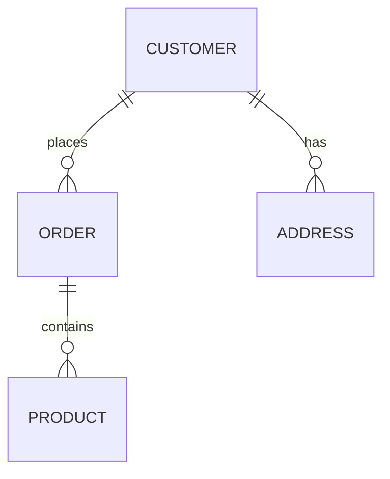
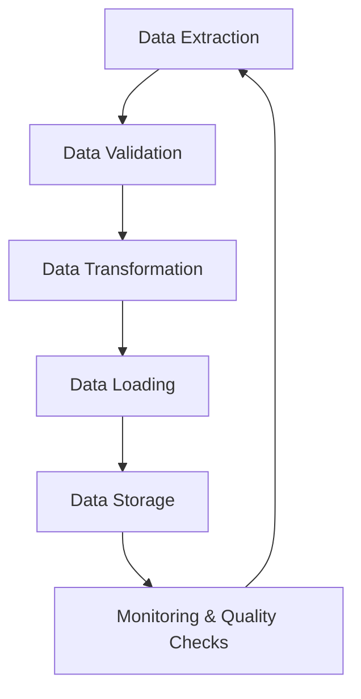
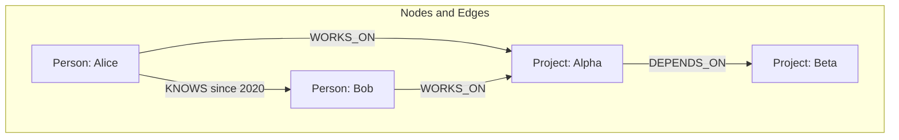
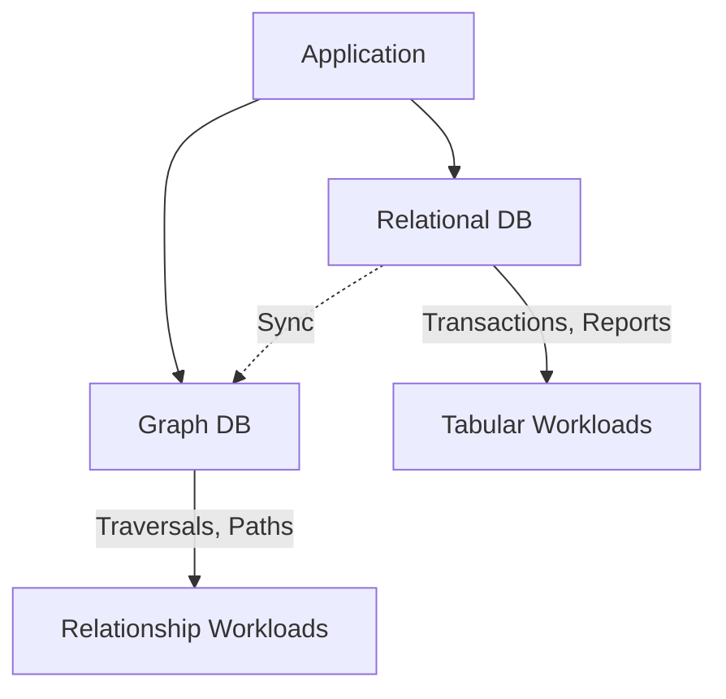

# Domain Knowledge Reference

Auto-generated from blog posts. Do not edit manually.
Last updated: 2026-03-03

---

## Source: fundamentals-of-databases

URL: https://jeffbailey.us/blog/2025/09/24/fundamentals-of-databases

### Introduction

What is a database? Whenever you check your bank balance, scroll social media, or search online, you're using databases. These systems store, organize, and retrieve data essential to modern life.

A **database** is an organized collection of data stored electronically in a computer system, typically managed by a **Database Management System (DBMS)** that enforces constraints, handles concurrency, and provides security. Think of it as a digital filing cabinet for easy management, updating, and retrieval.

The history of databases dates back to the 1960s, when businesses sought more effective ways to manage data. Early **DBMS** were hierarchical and network models. In the 1970s, **relational databases** transformed data storage with a table-based structure. Later, **NoSQL databases** such as MongoDB and Redis emerged for handling unstructured and semi-structured data.

Today, databases power everything from smartphone apps to financial systems. Understanding database fundamentals is crucial for developers, data analysts, business professionals, and IT workers. These concepts build upon [fundamentals of software development](/blog/2025/10/02/fundamentals-of-software-development/) and complement [fundamental software concepts](/blog/2025/10/11/fundamental-software-concepts/).


> Type: **Explanation** (understanding-oriented).  
> Primary audience: **beginner to intermediate** developers learning database fundamentals

### Section 1: Core Database Concepts

Before exploring database types and technologies, it is essential to understand the fundamental concepts that underlie database functionality.

#### Data and Information

**Data** are raw facts; **information** is processed, organized data that is meaningful. For example, "25, 30, 35" is data, but "The average age of our customers is 30" is information.

#### Tables, Rows, and Columns

In relational databases, data is organized in **tables** that look like spreadsheets:

* **Tables** are collections of related data.
* **Rows** (also called **records**) represent individual entries.
* **Columns** (also referred to as **fields**) represent attributes.

A "Customers" table could have columns for **CustomerID**, **Name**, **Email**, **Phone**, with each row representing a single customer.

#### Primary Keys and Foreign Keys

* **Primary Key**: A unique identifier for each row; no two rows can share the same value.
* **Foreign Key**: A field that links to another table's primary key, thereby creating **relationships**.

#### ACID Properties

Databases ensure **data integrity** with four key **ACID properties**:

1. **Atomicity**: Transactions are all-or-nothing operations
2. **Consistency**: Data remains valid according to defined database constraints and rules
3. **Isolation**: Concurrent transactions don't interfere with each other (implemented at different levels like read committed or serializable)
4. **Durability**: Committed data survives system failures

***💡 Note:** In distributed systems, "consistency" often refers to different consistency models (strong vs. eventual), but in ACID, it means that explicit database constraints are preserved.*

### Section 2: Types of Databases

Not all databases are equal; different types serve different needs.

#### Relational Databases (SQL)

**Relational databases** store data in tables with predefined relationships. They use **Structured Query Language (SQL)** for data manipulation.

**Popular Examples:**

* **MySQL**: Open-source, widely used for web applications.
* **PostgreSQL**: Advanced open-source database with extensive features
* **Oracle**: Enterprise-grade database with advanced security
* **Microsoft SQL Server**: Microsoft's flagship database system
* **SQLite**: Lightweight, file-based database perfect for mobile apps

**When to Use:**

* Structured data with clear relationships
* Complex queries and transactions
* Data integrity is critical.
* ACID compliance is required

#### NoSQL Databases

**NoSQL** (Not Only SQL) databases are designed for flexibility and handling large-scale data with adaptable schemas**.

**Document Databases:**

* **MongoDB**: Stores data as JSON-like documents
* **CouchDB**: Document database with built-in replication

**Key-Value Stores:**

* **Redis**: In-memory data structure store, commonly used for caching and real-time applications
* **DynamoDB**: Amazon's managed NoSQL database

**Column-Family Stores:**

* **Cassandra**: A distributed database for handling large amounts of data
* **HBase**: Open-source, distributed database

**Graph Databases:**

* **Neo4j**: Graph database for complex relationships
* **Amazon Neptune**: Managed graph database service

**When to Use:**

* Rapid development and iteration
* Large-scale data with varying structures
* Real-time applications
* Horizontal scaling requirements

***💡 Note:** Many NoSQL systems achieve horizontal scaling by relaxing certain consistency guarantees or transactional support. This tradeoff between consistency and scalability is a key consideration when choosing NoSQL databases.*

#### NewSQL Databases

**NewSQL databases** combine the benefits of SQL and NoSQL, offering **ACID compliance** with improved **scalability** through distributed consensus protocols (Raft, Paxos) and sharding techniques. For comprehensive coverage of distributed systems concepts, see [fundamentals of distributed systems](/blog/2025/10/11/fundamentals-of-distributed-systems/).

**Examples:**

* **Google Spanner**: Globally distributed database
* **CockroachDB**: Distributed SQL database
* **TiDB**: MySQL-compatible distributed database

### Section 3: Database Design Principles

Good **database design** is the foundation of efficient data management. Poor design leads to **performance issues**, **data inconsistencies**, and maintenance nightmares.

#### Normalization

**Normalization** is the process of organizing data to reduce **redundancy** and improve **data integrity**. The most common **normal forms** are:

Before diving into the normal forms, let's understand **transitive dependencies**. A transitive dependency occurs when a non-key column depends on another non-key column, rather than directly on the primary key. 

For example, consider a table with the following columns: `OrderID` (primary key), `CustomerID`, `CustomerName`, and `CustomerEmail`. Here, `CustomerName` and `CustomerEmail` don't directly depend on `OrderID` (the primary key). Instead, they depend on `CustomerID`, which in turn depends on `OrderID`. This creates a chain: `OrderID` → `CustomerID` → `CustomerName`/`CustomerEmail`. This is a transitive dependency, and it can lead to data redundancy and update anomalies.

Now, let's understand **atomic values**. An atomic value is a single, indivisible piece of data that cannot be meaningfully broken down further. Think of it as the smallest meaningful unit of information for that particular field.

A FullName field with "John Smith" is atomic as it represents one complete name. In contrast, storing "John Smith, 123 Main St, New York, NY 10001" in a single field isn't atomic because it contains multiple data elements (name, address, city, state, zip).

**First Normal Form (1NF):**

* Each column contains atomic values.
* No repeating groups or arrays

**Second Normal Form (2NF):**

* Meets 1NF requirements
* All non-key columns depend on the entire primary key.

**Third Normal Form (3NF):**

* Meets 2NF requirements
* No transitive dependencies

#### Entity-Relationship Modeling

**Entity-Relationship (ER) modeling** helps visualize database structure:

* **Entities**: Objects or concepts (e.g., Customer, Product)
* **Attributes**: Properties of entities (e.g., Name, Price)
* **Relationships**: Connections between entities (e.g., Customer orders Product)



#### What Are Database Indexes?

Think of a **database index** like the index in a book. When you want to find information about "databases" in this book, you don't flip through every page. Instead, you look in the index, which tells you exactly which page to go to.

A **database index** works similarly. It's a separate data structure that stores a sorted list of values from one or more columns, along with pointers to the actual rows in the table. When you search for data, the database can use the index to quickly locate the relevant rows, rather than scanning every single row in the table.

**Why indexes matter:**

* **Speed**: Using an index to find data is like using GPS instead of wandering randomly.
* **Efficiency**: Without indexes, databases must check every row (called a "full table scan")
* **Scalability**: As data grows, indexes are crucial for performance.

***💡 Note:** Indexes speed up reads but can slow down writes. They require storage space and maintenance overhead because the database must update both the index and the data.*

#### Indexing Strategies

**Indexes** improve **query performance** by creating pointers to data locations:

* **Primary Index**: Automatically created for primary keys
* **Secondary Index**: Created on non-primary key columns
* **Composite Index**: Created on multiple columns
* **Unique Index**: Ensures no duplicate values

### Section 4: SQL Fundamentals

**SQL** (Structured Query Language) is the standard language for interacting with relational databases. 

Born in the 1970s at IBM, SQL was developed to address a core problem: querying databases for specific information without complex programming. Instead of scripting: "Go through each row, check if the name is 'John', and retrieve the phone number," you write:

```sql
SELECT phone_number FROM customers WHERE name = 'John';
```

SQL became the standard because it's declarative, English-like, and portable. In 1986, it became an official standard, allowing you to learn SQL once and use it across multiple databases, such as MySQL, PostgreSQL, and Oracle.

Today, SQL is the most widely used language for database management and data manipulation, and it is present in modern databases, including Delta Lake, Apache Spark, and Snowflake.

Here are the essential **SQL operations**:

#### Data Definition Language (DDL)

**DDL** (Data Definition Language) commands create and modify the database structure:

```sql
-- Create a table
CREATE TABLE customers (
    customer_id INT PRIMARY KEY,
    name VARCHAR(100) NOT NULL,
    email VARCHAR(255) UNIQUE,
    created_at TIMESTAMP DEFAULT CURRENT_TIMESTAMP
);

-- Modify table structure
ALTER TABLE customers ADD COLUMN phone VARCHAR(20);

-- Remove table
DROP TABLE customers;
```

#### Data Manipulation Language (DML)

**DML** (Data Manipulation Language) commands work with data:

```sql
-- Insert data
INSERT INTO customers (customer_id, name, email) 
VALUES (1, 'John Doe', 'john@example.com');

-- Update data
UPDATE customers 
SET email = 'john.doe@example.com' 
WHERE customer_id = 1;

-- Delete data
DELETE FROM customers WHERE customer_id = 1;
```

#### Data Query Language (DQL)

**DQL** (Data Query Language) commands retrieve data:

```sql
-- Basic SELECT
SELECT name, email FROM customers;

-- Filter with WHERE
SELECT * FROM customers WHERE created_at > '2024-01-01';

-- Join tables
SELECT c.name, o.order_date, o.total
FROM customers c
JOIN orders o ON c.customer_id = o.customer_id;

-- Aggregate functions
SELECT COUNT(*), AVG(total) FROM orders;
```

### Section 5: Database Performance Optimization

Slow databases can significantly impact **user experience** and **business productivity**. Here's how to keep your databases running fast.

#### Query Optimization

**Use EXPLAIN Plans:**

```sql
EXPLAIN SELECT * FROM customers WHERE email = 'john@example.com';
```

**Index Frequently Queried Columns:**

```sql
CREATE INDEX idx_customer_email ON customers(email);
```

**💡 Remember:** Not all columns are good index candidates. Indexes are most beneficial for columns used in WHERE clauses, JOIN conditions, and ORDER BY statements.

**Prefer Specific Columns Over SELECT \*:**

```sql
-- Less efficient for large tables
SELECT * FROM customers;

-- More efficient
SELECT customer_id, name, email FROM customers;
```

This improves performance by reducing data transfer and memory usage while enhancing query maintainability. While SELECT * may be acceptable for small tables, exploration queries, or analytical workloads where columnar databases optimize differently, limiting columns remains a sound principle for most production applications.

#### Connection Pooling

**Connection pooling** reuses database connections, enhancing performance.

#### Caching Strategies

* **Query Result Caching**: Store frequently accessed query results
* **Application-Level Caching**: Cache data in application memory
* **CDN Caching**: Cache static database-driven content

#### Monitoring and Profiling

* **Slow Query Logs**: Identify problematic queries
* **Performance Metrics**: Monitor response times and throughput
* **Resource Usage**: Track CPU, memory, and disk usage

### Section 6: Database Security

**Database security** protects sensitive data from unauthorized access, modification, or destruction. Databases hold personal and financial info, making them targets for cybercriminals. Breaches can expose millions, lead to fines, and damage trust.

*Here are the key aspects of database security:*

#### Authentication and Authorization

* **User Authentication**: Verify user identity before access
* **Role-Based Access Control (RBAC)**: Assign permissions based on user roles
* **Principle of Least Privilege**: Grant minimum necessary permissions

#### Data Encryption

* **Encryption at Rest**: Protect stored data
* **Encryption in Transit**: Secure data during transmission
* **Key Management**: Safely store and rotate **encryption keys**

#### Backup and Recovery

* **Regular Backups**: Automated backup schedules
* **Point-in-Time Recovery**: Restore to specific moments
* **Disaster Recovery**: Plan for catastrophic failures
* **Testing Recovery**: Regularly test backup restoration

#### Common Security Threats

* **SQL Injection**: Malicious code injection through user input
* **Privilege Escalation**: Unauthorized access to higher permissions
* **Data Breaches**: Unauthorized access to sensitive information
* **Insider Threats**: Malicious actions by authorized users

*The primary defense against SQL injection is the use of parameterized queries (prepared statements), which separate SQL code from user data.*

### Section 7: Database Administration

**Database administrators (DBAs)** manage databases to ensure smooth, secure, and efficient operation, overseeing data integrity and performance to maintain optimal system functionality. Modern Software Engineers are also expected to be proficient in database administration.

#### Daily Administration Tasks

1. **Monitor System Health**: Check performance metrics and error logs.
2. **Backup Verification**: Ensure backups complete successfully
3. **Security Audits**: Review access logs and user permissions
4. **Performance Tuning**: Optimize slow queries and resource usage
5. **Capacity Planning**: Monitor growth and plan for scaling

#### Maintenance Activities

* **Index Maintenance**: Rebuild fragmented indexes
* **Statistics Updates**: Keep query optimizer statistics current
* **Log Management**: Archive and clean up log files
* **Schema Updates**: Apply database structure changes safely

#### Troubleshooting Common Issues

* **Connection Problems**: Network and authentication issues
* **Performance Degradation**: Identify and resolve bottlenecks
* **Data Corruption**: Detect and repair data integrity issues
* **Resource Exhaustion**: Handle memory and disk space problems

### Section 8: Modern Database Trends

The database landscape continues evolving with new technologies and approaches.

*Here are some of the modern database trends:*

#### Cloud Databases

**Cloud databases** are database systems deployed in cloud environments. They can be self-managed or fully managed (DBaaS), providing automatic scaling, backups, and maintenance.

**What they do:**
* Provide managed database services with automatic scaling, backups, and maintenance.
* Handle infrastructure provisioning, monitoring, and security updates.
* Offer high availability and disaster recovery capabilities.
* Eliminate database administration tasks and reduce operational overhead.

**Why do you use them:**

* Eliminate the need to manage database infrastructure.
* Reduce operational overhead and maintenance costs.
* Scale automatically based on demand.
* Access enterprise-grade features without upfront investment.
* Focus on application development instead of infrastructure.

**Popular examples:**
* **Amazon RDS**: Managed relational database service
* **Google Cloud SQL**: Fully managed database service
* **Azure Database**: Microsoft's managed database offerings
* **PlanetScale**: Serverless MySQL platform built on Vitess

#### Multi-Model Databases

**Multi-model databases** are database management systems that support multiple data models within a single integrated backend.

**What they do:**
* Support multiple data models (document, graph, key-value, relational) in one system.
* Provide unified query interfaces for different data types.
* Eliminate the need for multiple specialized databases.

**Why do you use them:**

* Reduce complexity by using one database for multiple data types.
* Simplify data management and reduce operational overhead.
* Enable flexible data modeling for complex applications.
* Reduce data movement between different database systems.

**Popular examples:**
* **ArangoDB**: Document, graph, and key-value in one database
* **Amazon Neptune**: Graph and document capabilities
* **OrientDB**: Multi-model database with graph focus

#### Edge Computing and Databases

**Edge databases** are database systems designed to run closer to where data is generated and consumed, typically at the edge of the network.

**What they do:**
* Process and store data locally at edge locations
* Provide offline capabilities and reduced latency.
* Optimize bandwidth usage by reducing data transfer.

**Why do you use them:**

* Reduce latency for real-time applications.
* Enable offline functionality for mobile and IoT devices.
* Optimize bandwidth costs and improve performance.
* Support distributed applications and edge computing scenarios

**Popular examples:**
* **SQLite**: Lightweight, serverless SQL database ideal for local/embedded use
* **Redis**: In-memory data store, commonly used as a low-latency cache at cloud/CDN edge deployments
* **CockroachDB**: Distributed SQL database with edge features for distributed setups
* **FaunaDB**: Serverless database with edge computing and global distribution capabilities

*💡 **Note:** Whether a database system is suitable "at the edge" depends heavily on latency requirements, resource constraints, connectivity, and specific use cases.*

#### Purpose-Built Databases

**Purpose-built databases** are specialized database systems designed for specific use cases and data types.

**What they do:**

* Optimize for specific data patterns and query types.
* Provide specialized features for particular domains.
* Offer better performance for specific workloads.

**Why do you use them:**

* Achieve better performance for specific use cases.
* Access specialized features not available in general-purpose databases
* Optimize costs by using the right tool for the job.
* Handle unique data requirements more effectively.

**Popular examples:**
* **Time-Series Databases**: InfluxDB, TimescaleDB, Prometheus
* **Search Engines**: Elasticsearch, Apache Solr, OpenSearch
* **Graph Databases**: Neo4j, Amazon Neptune, ArangoDB
* **Vector Databases**: Pinecone, Weaviate, Qdrant, Chroma
* **OLAP Databases**: ClickHouse, Apache Druid, Snowflake

### Section 9: Choosing the Right Database

Selecting the appropriate database depends on your specific **requirements** and **constraints**.

#### Decision Factors

**Data Characteristics:**

* **Structure**: Structured, semi-structured, or unstructured
* **Volume**: Small datasets vs. big data
* **Velocity**: Real-time vs. batch processing
* **Variety**: Single vs. multiple data types

**Application Requirements:**

* **Consistency**: Strong vs. eventual consistency
* **Availability**: High availability requirements
* **Performance**: Response time and throughput needs
* **Scalability**: Vertical vs. horizontal scaling

**Operational Considerations:**

* **Team Expertise**: Available skills and knowledge
* **Budget**: Licensing and operational costs
* **Compliance**: Regulatory requirements
* **Vendor Support**: Available support and documentation

#### Database Selection Matrix

| Database Type | Best For | Strengths | Weaknesses |
|---------------|----------|-----------|------------|
| MySQL | Web applications, small to medium scale | Fast, reliable, easy to use | Limited advanced features |
| PostgreSQL | Complex applications, data integrity | Advanced features, extensible | Steeper learning curve |
| MongoDB | Rapid development, flexible schemas | Easy to use, flexible | Memory usage, consistency |
| Redis | Caching, real-time data | Extremely fast, simple | Limited data types |
| Cassandra | Large scale, high availability | Highly scalable, fault-tolerant | Complex queries |

### Section 10: Database Best Practices

Following established **best practices** prevents common pitfalls and ensures database success.

*Here are some database best practices:*

#### Design Best Practices

* **Plan for Growth**: Design with future scaling in mind
* **Normalize Appropriately**: Strike a balance between normalization and performance.
* **Use Meaningful Names**: Clear, descriptive table and column names.
* **Document Everything**: Maintain comprehensive documentation
* **Version Control**: Track schema changes with version control

#### Development Best Practices

* **Use Parameterized Queries**: Prevent **SQL injection** attacks.
* **Handle Errors Gracefully**: Implement proper error handling.
* **Test Thoroughly**: Comprehensive testing of database operations
* **Monitor Performance**: Continuous performance monitoring.
* **Code Reviews**: Regular review of database-related code

#### Operational Best Practices

* **Regular Backups**: Automated, tested backup procedures
* **Security Updates**: Keep database software current
* **Access Control**: Implement **least privilege** access
* **Monitoring**: Comprehensive monitoring and alerting
* **Documentation**: Maintain operational runbooks

### Conclusion

💡 Databases are fundamental to modern applications. Understanding their basics is essential for anyone in tech.

Mastering database concepts, selecting the right technology, and adhering to best practices help build reliable, scalable, and secure applications. Whether you're a developer or architect, database knowledge is essential.

The database landscape evolves with new tech like cloud databases, multi-model systems, and edge computing. Staying updated and learning helps you leverage these innovations for better applications and tackling complex data issues. Consider contributing to [open source database projects](/blog/2025/03/06/fundamentals-of-open-source/) to see these concepts applied in real-world systems.

### Call to Action

Ready to explore databases? Set up a local environment, practice with real data, build a simple app, then progress to complex scenarios.

*Here are some resources to help you get started:*

* **Learning Platforms**: [SQLBolt], [Mode Analytics SQL Tutorial], [MongoDB University]
* **Practice Environments**: [SQLFiddle], [DB-Fiddle], [MongoDB Atlas]
* **Documentation**: [MySQL Documentation], [PostgreSQL Documentation], [MongoDB Documentation]

### Related Articles

*Related fundamentals articles:*

**Data and Analytics:** [Fundamentals of Data Engineering](/blog/2025/11/22/fundamentals-of-data-engineering/) shows how databases fit into data pipelines and how to efficiently store and retrieve data. [Fundamentals of Data Analysis](/blog/2025/10/19/fundamentals-of-data-analysis/) helps you understand how to query and analyze data stored in databases. [Fundamentals of Machine Learning](/blog/2025/11/20/fundamentals-of-machine-learning/) teaches you how databases store the data that feeds ML models.

**Software Engineering:** [Fundamentals of Software Development](/blog/2025/10/02/fundamentals-of-software-development/) shows how databases fit into the broader software development process. [Fundamentals of Backend Engineering](/blog/2025/10/14/fundamentals-of-backend-engineering/) teaches you how to integrate databases into backend systems and APIs. [Fundamentals of Software Design](/blog/2025/11/05/fundamentals-of-software-design/) helps you understand how database design affects application design.

**Infrastructure:** [Fundamentals of Distributed Systems](/blog/2025/10/11/fundamentals-of-distributed-systems/) helps you understand how to scale databases across multiple machines and handle distributed data.

**Production Systems:** [Fundamentals of Reliability Engineering](/blog/2025/11/17/fundamentals-of-reliability-engineering/) helps you understand how to build reliable database systems and set quality targets. [Fundamentals of Monitoring and Observability](/blog/2025/11/16/fundamentals-of-monitoring-and-observability/) explains how to monitor database performance and detect issues.

## Glossary

## References

* [Database Fundamentals - Oracle Documentation]
* [SQL Performance Best Practices]
* [NoSQL Database Types]
* [Database Security Guidelines]
* [ACID Properties in Database Systems]
* [Database Normalization Explained]
* [Cloud Database Services Comparison]
* [Database Performance Monitoring]

[Database Fundamentals - Oracle Documentation]: https://docs.oracle.com/en/database/
[SQL Performance Best Practices]: https://use-the-index-luke.com/
[NoSQL Database Types]: https://www.mongodb.com/nosql-explained
[Database Security Guidelines]: https://owasp.org/www-project-data-security-top-10/
[ACID Properties in Database Systems]: https://en.wikipedia.org/wiki/ACID
[Database Normalization Explained]: https://www.digitalocean.com/community/tutorials/database-normalization
[Cloud Database Services Comparison]: https://aws.amazon.com/products/databases/
[Database Performance Monitoring]: https://www.datadoghq.com/database-monitoring/
[SQLBolt]: https://sqlbolt.com/
[Mode Analytics SQL Tutorial]: https://mode.com/sql-tutorial/
[MongoDB University]: https://university.mongodb.com/
[SQLFiddle]: https://sqlite.org/fiddle/
[DB-Fiddle]: https://www.db-fiddle.com/
[MongoDB Atlas]: https://www.mongodb.com/atlas
[MySQL Documentation]: https://dev.mysql.com/doc/refman/8.0/en/
[PostgreSQL Documentation]: https://www.postgresql.org/docs/
[MongoDB Documentation]: https://docs.mongodb.com/


---

## Source: fundamentals-of-data-engineering

URL: https://jeffbailey.us/blog/2025/11/22/fundamentals-of-data-engineering

## Introduction

Why do some teams have accessible data ready while others struggle to get reliable data for analysis? The main difference is their understanding of data engineering fundamentals.

If you're building data pipelines without understanding why they fail or collecting data without a plan for using it, this article explains how data engineering transforms raw data into reliable information, why data quality matters more than processing speed, and how to make informed decisions about data systems.

**Data engineering** creates systems for collecting, transforming, and storing data for analysis and machine learning. It forms the foundation that makes data useful, not just collected.

The software industry depends on data engineering for analytics, machine learning, and business intelligence. Understanding the basics of data engineering helps build reliable pipelines, make better decisions, and develop effective data systems.

**What this is (and isn't):** This article explains data engineering basics, including its purpose, effectiveness, and potential failures. It doesn't include coding or framework tutorials but offers a mental model for understanding its role. A brief "Getting Started" section at the end gives a starting point.

* **Reliable data access** - Understanding data pipelines ensures data availability.
* **Data quality** - Knowing how to validate and clean data prevents downstream errors.
* **Cost efficiency** - Proper pipeline design saves storage and processing costs.
* **Team productivity** - Clean, accessible data enables faster analysis and decision-making.
* **System reliability** - Well-designed pipelines handle failures gracefully and recover automatically.

You'll learn **when to avoid complex data engineering**, such as when simple scripts or direct database queries are sufficient.

Mastering data engineering basics shifts you from collecting data randomly to building systems that transform raw data into reliable information.


> Type: **Explanation** (understanding-oriented).  
> Primary audience: **beginner to intermediate** engineers learning to build reliable data pipelines

**Prerequisites:** Basic understanding of databases and some programming experience. If you're new to data analysis, consider starting with [Fundamentals of Data Analysis](/blog/2025/10/19/fundamentals-of-data-analysis/) first. Understanding [Fundamentals of Databases](/blog/2025/09/24/fundamentals-of-databases/) helps with storage concepts.

**Primary audience:** Beginner–Intermediate engineers learning to build reliable data pipelines, providing enough depth for experienced developers to align on foundational concepts.

**Jump to:**

* [What Is Data Engineering](#section-1-what-is-data-engineering) • [The Data Engineering Workflow](#section-2-the-data-engineering-workflow) • [Types of Data Processing](#section-3-types-of-data-processing) • [Data Pipeline Patterns](#section-4-data-pipeline-patterns)
* [Data Quality and Governance](#section-5-data-quality-and-governance) • [Data Storage and Warehousing](#section-6-data-storage-and-warehousing) • [Deployment and Operations](#section-7-deployment-and-operations)
* [Data Engineering Products](#section-8-data-engineering-products) • [Common Pitfalls](#section-9-common-pitfalls) • [Boundaries and Misconceptions](#section-10-boundaries-and-misconceptions)
* [Future Trends](#future-trends-in-data-engineering) • [Getting Started](#getting-started-with-data-engineering) • [Glossary](#glossary)

### Learning Outcomes

By the end of this article, you will be able to:

* Explain how data engineering transforms raw data into reliable information.
* Follow the complete data engineering workflow from extraction to storage.
* Choose appropriate processing patterns for different data needs.
* Design data pipelines that gracefully handle failures.
* Treat data engineering as a software product, with proper code testing and user acceptance testing.
* Recognize common data engineering pitfalls and avoid them.
* Decide when data engineering is the right solution.

## Section 1: What Is Data Engineering

The core idea is simple: collect data from various sources, transform it into a usable format, and store it where it can be accessed reliably.

### What Data Engineering Actually Does

Data engineering creates pipelines that transfer and transform data from source to destination, ensuring it's clean, consistent, and accessible.

### The Data Pipeline Concept

Imagine a water treatment plant. Water flows from rivers through filters and treatment into storage tanks ready for use.

Data engineering works similarly:

* **Sources** - Applications, databases, APIs, files generate raw data.
* **Transformation** - Data is cleaned, validated, and reformatted.
* **Destination** - Data is stored in warehouses, databases, or data lakes for analysis.

Just as you can't drink untreated water, you can't analyze raw, unstructured data. Data engineering prepares data for analysis.

### Why Data Engineering Matters

Data engineering is crucial because raw data is messy, scattered, and unreliable. Without it, analysts spend more time cleaning data than analyzing, and machine learning models fail due to poor data quality.

**User impact:** Data engineering supports real-time dashboards, accurate reports, and dependable machine learning models that users need.

**Business impact:** Data engineering facilitates data-driven decisions, quickens insights, and supports scalable analytics as the business grows.

**Technical impact:** Data engineering requires proper pipeline design, error handling, and monitoring to prevent data chaos and unreliable systems.

### Data Engineering vs Data Analysis

Data analysis extracts insights, while data engineering prepares data for analysis.

**Data analysis:** Uses clean data to answer questions, create visualizations, and generate insights.

**Data engineering:** Builds systems to collect, transform, and store data for reliable analysis.

**When to use data analysis:** You have accessible data and need to answer specific questions.

**When to use data engineering:** You have raw data from multiple sources to clean, transform, and store for analysis.

**Running Example – Customer Analytics:**

Imagine a company analyzing customer behavior across web, mobile, and email channels.

* **Sources** include web analytics, mobile app events, and email campaign data.
* **Transformation** standardizes user IDs, converts timestamps to a common timezone, and joins data from different sources.
* **Destination** is a data warehouse where analysts can query customer behavior across all channels.

We'll revisit this example to link the data engineering workflow, processing types, pipeline patterns, and storage strategies.

**Section Summary:** Data engineering creates systems that turn raw data into reliable information. Knowing when to use it versus simple analysis helps select the right approach.

**Reflection Prompt:** Think about a data analysis project you've done. How much time was spent cleaning data compared to analyzing? What would change with proper data engineering?

**Quick Check:**

1. What's the difference between data engineering and data analysis?
2. When would you choose data engineering over simple data analysis?
3. How does data engineering transform raw data into usable information?

## Section 2: The Data Engineering Workflow

Every data engineering project moves from raw data to reliable info, with each stage building on the last to ensure quality. Understanding this workflow is crucial, as skipping steps leads to unreliable data.

**Data Engineering Workflow Overview:**

```text
Data Extraction → Data Validation → Data Transformation → Data Loading → 
Data Storage → Data Monitoring → Pipeline Maintenance
```

Each stage feeds into the next, forming a continuous improvement cycle.

This workflow applies to batch processing, streaming, and hybrid approaches. The extract-transform-load cycle remains universal.

**Memory Tip:** *Extract Validate Transform Load Store Monitor Maintain*: Extraction, Validation, Transformation, Loading, Storage, Monitoring, Maintenance.



*A circular flow from extraction to monitoring, representing continuous pipeline operation.*

Think of this loop as an assembly line: raw materials enter, are checked, transformed into products, stored, and monitored for defects.

### Data Extraction

Quality extraction is key to data engineering success or failure.

**Why Data Extraction Exists**: Data exists in various locations like databases, APIs, files, and streams. Extraction retrieves data from these sources for processing. Without reliable extraction, subsequent steps break down.

**Extraction Methods**: Different sources need different approaches: database extraction uses SQL or change data capture, API extraction uses authenticated HTTP requests, file extraction reads storage files, and streaming extraction processes real-time event streams.

**Extraction Challenges**: Sources modify schemas, APIs rate-limit requests, and files arrive late or in the wrong formats. Robust extraction manages these issues gracefully.

**Data Extraction**: Extraction is similar to gathering ingredients from different stores, requiring reliable suppliers, consistent formats, and error handling for unavailable items.

### Data Validation

Raw data contains errors; catch them early to prevent propagation.

**Why Data Validation Exists**: Invalid data causes failures and incorrect analysis. Validation catches errors early, preventing corrupted data from entering.

**Validation Checks**: Type checking verifies data formats. Range validation detects invalid values. Completeness checks find missing fields. Referential integrity maintains valid relationships.

**Validation Strategy**: Validate early and often by checking data during extraction, transformation, and loading, as each stage catches different errors.

**Data Validation**: Validation is like quality control in manufacturing. You inspect materials before processing to catch defects early.

**Running Example - Customer Analytics**:

* **Extraction:** Pull web analytics from Google Analytics, mobile events from Firebase, and email data from the marketing platform.
* **Validation:** Verify user IDs, ensure timestamps are valid, and event types match expected values.
* **Transformation:** Standardize user IDs, convert timestamps to UTC, and join data on common IDs.

### Data Transformation

Raw data often doesn't fit analysis needs; transformation converts it into usable structures.

**Why Data Transformation Exists**: Different sources use varied formats, schemas, and conventions. Transformation standardizes data for combined analysis. Without it, data from multiple sources can't be merged.

**Transformation Types**: Cleaning removes errors; normalization standardizes formats; enrichment adds derived fields and joins data; aggregation summarizes data for faster analysis.

**Transformation Process**: Transformations occur in stages: initial cleaning, later enrichment and aggregation.

**Data Transformation**: Transformation is like translating languages, converting data from source formats into a common language understood by analysis tools.

### Data Loading

Load transformed data into storage for user access.

**Why Data Loading Exists**: Analysis tools require data in specific formats and locations. Loading places data correctly is essential; without proper loading, data is inaccessible.

**Loading Strategies**: Full loads replace all data each time. Incremental loads update only changed data. Upsert loads insert new records and update existing ones. Each strategy balances freshness, performance, and complexity.

**Loading Challenges**: Large datasets take time to load, and concurrent loads can conflict, leaving data inconsistent. Robust loading handles these gracefully.

**Data Loading**: Loading is like stocking a warehouse, placing products in the right spots for easy access.

### Data Storage

Store data in systems optimized for different access patterns.

**Why Data Storage Exists**: Different use cases require specific storage types. Analytics benefits from columnar storage for quick queries. Machine learning uses feature stores for training. Real-time dashboards need fast key-value stores. Proper storage selection enhances performance and cost-efficiency.

**Storage Types**: Data warehouses store structured data for analytics, data lakes hold raw and processed data in various formats, and feature stores organize data for machine learning, each serving different needs.

**Storage Design**: Schema design impacts query performance. Partitioning and indexing enhance speed and lookups. Proper design ensures efficient data access.

**Data Storage**: Storage is like organizing a library, arranging books for quick access.

### Monitoring and Maintenance

Monitor pipelines to ensure they work as systems evolve.

**Why Monitoring Exists**: Pipelines break when sources, formats, or systems fail. Monitoring detects issues early, preventing user impact. Without it, failures go unnoticed until complaints arise.

**Monitoring Metrics**: Data quality metrics track completeness and accuracy. Performance metrics measure processing time and throughput. Error metrics count failures and retries. Each metric signals different types of problems.

**Maintenance Process**: Regularly update pipelines as requirements change. Schema evolution manages new fields. Performance tuning speeds up slow queries. Error handling boosts resilience.

**Monitoring and Maintenance**: Monitoring is like checking a car's dashboard for warning lights indicating problems early.

**Section Summary:** The data engineering workflow involves extraction, validation, transformation, loading, storage, monitoring, and maintenance, each building on the previous in a continuous cycle. Understanding it prevents pipelines that work initially but fail as data evolves.

**Reflection Prompt:** Think of a data pipeline you've used or built. How does it compare to this workflow? Were stages skipped or done poorly? How would proper stages improve reliability?

**Quick Check:**

1. What are the main stages of the data engineering workflow?
2. Why does workflow order matter? What if you skip validation and go straight to transformation?
3. Why is monitoring needed even if pipelines work at first?

## Section 3: Types of Data Processing

Data engineering employs various processing patterns based on data availability speed and arrival.

### Batch Processing

**Why Batch Processing Exists**: Batch processing manages large data volumes efficiently by processing in groups. It's cost-effective and simpler than streaming, suitable when data doesn't require immediate access.

Batch processing collects data over time and processes it in scheduled runs, like processing mail: you gather letters throughout the day and sort them in the evening.

**Decision Lens**: If your team is small and doesn’t need second-level freshness, batch processing simplifies and reduces costs.

**Characteristics**: High throughput for large volumes, cost-effective due to resource efficiency, easier to build and maintain than streaming, with latency in hours or days.

**Use Cases**: Daily reports, monthly analytics, data loads, and historical analysis—acceptable when data freshness is in hours.

**Running Example - Customer Analytics**: Process all customer events daily to generate reports and update the data warehouse.

### Streaming Processing

**Why Streaming Processing Exists**: Streaming processing manages data as it arrives, providing real-time insights and responses. It's essential when data freshness in seconds or minutes is crucial.

Streaming processing handles data continuously like a live news feed, with stories appearing as they happen, not in daily batches.

**Characteristics**: Low latency in seconds or minutes with continuous data processing. More complex and costly to build and operate.

**Use Cases**: Real-time dashboards, fraud detection, alerting, and live recommendations enable immediate data access, adding value in time-sensitive scenarios.

**Running Example - Customer Analytics**: Process customer events in real-time, updating dashboards and triggering alerts for unusual behavior.

### Hybrid Processing

**Why Hybrid Processing Exists**: Most systems require both batch and streaming: batch for historical analysis and backfills, streaming for real-time needs, and hybrid combines both.

Hybrid processing combines batch for bulk tasks and streaming for real-time needs, like a restaurant prepping ingredients in batches (batch) and cooking orders as they arrive (streaming).

**Lambda Architecture**: Processes data via batch and streaming pipelines, then merges results to offer real-time and accurate historical views.

**Kappa Architecture**: Uses streaming for all tasks, reprocessing historical data via the same stream when needed. Simpler than lambda but needs more advanced infrastructure.

**Use Cases**: Systems requiring real-time dashboards and historical analysis; machine learning pipelines that train on batch data but serve real-time predictions.

**Section Summary:** Batch processing handles large volumes with higher latency, while streaming offers low latency for real-time needs. Hybrid methods combine both. The right choice depends on latency needs and data size.

**Quick Check:**

1. What's the difference between batch and streaming processing?
2. When would you choose batch processing over streaming?
3. Why do many systems use hybrid processing approaches?

## Section 4: Data Pipeline Patterns

Data pipelines follow patterns for recurring problems. Understanding these patterns aids in designing effective pipelines.

### ETL (Extract, Transform, Load)

**Why ETL Exists**: ETL separates extraction, transformation, and loading into stages, making pipelines easier to understand and maintain. It's the traditional pattern for moving data from sources to warehouses.

ETL processes data in three stages: extract, transform, load. Think of it like a factory: raw materials enter, are processed, then packaged for shipping.

**Characteristics**: Clear separation of concerns. Transformation occurs before loading, ideal for batch processing with mature tools and patterns.

**Use Cases**: Data warehouse loads, reporting, analytics pipelines—any scenario needing data transformation before storage.

### ELT (Extract, Load, Transform)

**Why ELT Exists**: ELT loads raw data first, then transforms it in the destination system, leveraging data warehouses and lakes to perform transformations where data resides.

ELT quickly extracts and loads data, then transforms it using the destination system's power. Like shipping raw materials to a factory: move everything first, then process at the destination.

**Characteristics**: Faster loading; leverages destination system power for exploration but requires robust destination systems.

**Use Cases**: Data lakes and cloud warehouses enable preserving raw data and transforming it on demand for exploratory analytics.

### Change Data Capture (CDC)

**Why CDC Exists**: CDC captures only changed data instead of reprocessing everything, making pipelines more efficient and enabling near-real-time updates.

CDC tracks source systems for changes, capturing only new or modified data, like processing only new packages in a warehouse.

**Characteristics**: Efficient for large datasets, enabling near-real-time updates and reducing processing load, but requires source system support.

**Use Cases**: Replicating production databases and syncing warehouses in real-time, especially when sources change frequently but incrementally.

### Data Replication

**Why Data Replication Exists**: Replication copies data unchanged, preserving source state. Useful for backups, disaster recovery, and read replicas.

Replication creates exact data copies across systems, similar to making photocopies for various uses.

**Decision Lens**: Use ETL for complex transformations and high security; use ELT for speed and flexibility when the destination can handle the load.

**Characteristics**: Simple, fast, preserves source data, useful for redundancy, no transformation overhead.

**Use Cases**: Database backups, read replicas, disaster recovery, multi-region deployments—scenarios requiring exact, unaltered copies.

**Section Summary:** ETL transforms before loading, ELT loads then transforms, CDC captures changes incrementally, and replication creates exact copies. Each pattern serves different needs. Choosing the correct pattern depends on transformation needs, latency requirements, and system capabilities.

**Quick Check:**

1. What's the difference between ETL and ELT?
2. When would you use Change Data Capture instead of full loads?
3. Why is data replication useful even without transformation?

## Section 5: Data Quality and Governance

Data quality affects whether pipelines produce useful results or garbage, and governance ensures responsible data management.

### Data Quality Dimensions

**Completeness**: Missing data causes gaps in analysis. Completeness measures the percentage of expected data that is present. Strategies manage missing values via imputation, defaults, or exclusion.

**Accuracy**: Incorrect data causes wrong conclusions. Accuracy shows how well data reflects reality. Validation rules catch errors, but some inaccuracies need business logic to detect.

**Consistency**: Inconsistent formats hinder data integration. Consistency ensures data adheres to the same rules across systems. Standardization enforces uniform formats and conventions.

**Timeliness**: Stale data loses value; timeliness measures how recent the data is. Freshness needs vary—real-time systems require seconds, batch reports need hours or days.

**Validity**: Invalid data violates rules; validity checks ensure data meets constraints through type checking, range validation, and referential integrity.

**Uniqueness**: Duplicate data skews analysis. Uniqueness makes each record appear once. Deduplication removes duplicates based on key fields.

### Data Quality Monitoring

**Why Data Quality Monitoring Exists**: Data quality declines over time as sources change and errors build up. Monitoring identifies issues early to prevent impact downstream.

Quality monitoring tracks metrics and alerts when thresholds are exceeded, serving as a quality control dashboard that monitors issues.

**Monitoring Strategies**: Automated checks validate data in pipelines. Sampling reviews subsets for manual review. Anomaly detection identifies unusual patterns that indicate quality issues.

**Quality Metrics**: Completeness rates, accuracy scores, consistency checks, timestamps, violations, duplicates. Each metric highlights different quality issues.

### Data Governance

**Why Data Governance Exists**: Governance manages data responsibly through ownership, access controls, and compliance. Without it, data risks increase.

Governance sets policies, processes, and responsibilities for data management, similar to a library system where rules keep books organized, accessible, and maintained.

**Governance Components**: Data ownership assigns responsibility for datasets. Access controls limit who can view or modify data. Lineage tracking documents data flow and transformations. Compliance ensures adherence to regulations such as GDPR and HIPAA.

**Governance Practices**: Data catalogs list datasets. Access policies specify permissions. Audit logs record access and changes. Documentation details data meaning and usage.

**Running Example - Customer Analytics**: Implement data quality checks to verify user IDs, timestamps, and event types. Establish governance policies on data access and retention.

**Section Summary:** Data quality dimensions include completeness, accuracy, consistency, timeliness, validity, and uniqueness. Quality monitoring detects issues early. Governance ensures responsible data management. Quality and governance together ensure data is reliable and trustworthy.

**Quick Check:**

1. What are the main dimensions of data quality?
2. Why is data quality monitoring necessary despite initial data being clean?
3. How does data governance differ from data quality?

## Section 6: Data Storage and Warehousing

Store data in systems optimized for various access patterns and use cases.

### Data Warehouses

**Why Data Warehouses Exist**: Data warehouses store structured data for analytics, offering fast query performance for reporting and business intelligence.

Data warehouses organize data in analysis-friendly schemas with columnar storage for quick aggregations. Like a research library, books are arranged by topic for easy discovery.

**Characteristics**: Optimized for read-heavy analytics with columnar storage for fast aggregations. Schema-on-write needs structure before loading. Ensures quick queries for complex tasks analytics.

**Use Cases**: Business intelligence, reporting, analytics dashboards, ad-hoc analysis for fast queries on structured data.

### Data Lakes

**Why Data Lakes Exist**: Data lakes store raw and processed data in various formats, enabling flexible exploration and diverse use cases.

Data lakes store raw data, applying schema when read, like a warehouse of materials organized when needed.

**Characteristics**: Schema-on-read applies structure during queries,. It's cost-effective for large volumes and flexible for exploration and multiple uses. storing data in various formats

**Use Cases**: Data exploration, machine learning, storing raw data, multi-format data, useful when you need flexibility and lack upfront use-case knowledge.

### Data Lakehouses

**Why Data Lakehouses Exist**: Data lakehouses blend the performance of warehouses with the flexibility of data lakes, enabling both structured analytics and raw data storage.

Data lakehouses combine lake storage with warehouse-like query performance, acting as a hybrid store with organized sections and bulk storage.

**Characteristics**: Combines lake flexibility with warehouse performance in a single system for multiple uses, reducing data duplication—a pattern with evolving tooling.

**Use Cases**: Organizations needing analytics and exploration to avoid maintaining separate warehouses and lakes.

### Feature Stores

**Why Feature Stores Exist**: Feature stores organize data for machine learning with versioned features and serving capabilities.

Feature stores manage features for training and serving, like a kitchen where ingredients are prepared and organized.

**Decision Lens**: Start with a data warehouse for core reporting; add a data lake for unstructured data or raw history.

**Characteristics**: Versioned features ensure reproducibility. Fast serving enables real-time predictions. Features are shared across models, optimized for ML workflows.

**Use Cases**: Machine learning pipelines, model training, real-time feature serving. Scenarios needing multiple models with the same features.

**Section Summary:** Data warehouses optimize for analytics, data lakes for exploration, and lakehouses combine both. Feature stores organize data for machine learning. Choosing the right storage depends on access patterns, data formats, and use cases.

**Quick Check:**

1. What's the difference between a data warehouse and a data lake?
2. When would you choose a data lakehouse over separate warehouse and lake?
3. Why do machine learning systems need feature stores?

## Section 7: Deployment and Operations

Moving pipelines to production needs careful planning and discipline.

### Pipeline Deployment Challenges

**Scalability**: Production pipelines must handle larger volumes than development data with varying daily load patterns.

**Reliability**: Pipelines should recover automatically from failures and alert operators when manual help is needed.

**Monitoring**: Production pipelines require monitoring to detect issues early.

**Change Management**: Test and deploy pipeline changes safely, with rollback options when issues arise.

### Pipeline Monitoring

**Why Pipeline Monitoring Exists**: Pipelines fail when sources, data formats, or systems change. Monitoring detects issues early, before user impact.

Effective monitoring tracks data quality, pipeline performance, and system health, like a car's dashboard watching indicators for problems.

**Monitoring Metrics**: Data quality metrics track completeness and accuracy. Performance metrics measure processing time and throughput. Error metrics count failures and retries. System metrics monitor resource usage.

**Alerting Strategy**: Alert only on issues requiring action, not minor ones. Set thresholds by business impact. Escalate critical failures immediately.

### Error Handling and Recovery

**Why Error Handling Exists**: Pipelines face errors from network failures, data quality issues, and system problems. Proper error handling prevents failures and allows recovery.

Error-handling strategies include retries for transient failures, dead-letter queues for unprocessable data, and circuit breakers to prevent overwhelming failing systems.

**Recovery Strategies**: Automatic retries handle transient failures; manual intervention covers data quality issues; reprocessing recovers from partial failures. Each strategy targets different failures.

**Running Example - Customer Analytics**: Implement monitoring to alert on data quality drops, SLA breaches, or error spikes. Enable auto-retries for API failures and manual reviews for data issues.

**Section Summary:** Deployment tackles scalability, reliability, monitoring, and change management. Monitoring checks quality, performance, and errors. Error handling allows graceful recovery. Production pipelines need discipline for reliability.

**Quick Check:**

1. What are the main challenges when deploying pipelines to production?
2. Why is pipeline monitoring needed even in development?
3. How do error handling strategies adapt to different failure types?

## Section 8: Data Engineering Products

Data engineering pipelines are software products, not just scripts. Treating them as products entails applying software practices such as testing, user acceptance testing, product management, and continuous improvement.

### Why Data Engineering Should Be Treated as a Product

**Why This Matters**: Data pipelines serve users who rely on trustworthy data. Without product thinking, pipelines turn into unreliable scripts that fail silently, leaving users without data when they needed it.

Data engineering products have users, requirements, and success criteria, like any software. Analysts need data for reports. Machine learning engineers require features for models. Business users depend on dashboards for decisions. Each user has expectations to meet.

**Product vs Script Mindset**: Scripts address immediate issues, while products provide reliable long-term solutions through testing, documentation, user feedback, and ongoing improvements.

### Understanding Your Users

**Why User Understanding Exists**: Different users have different needs: analysts require historical data, dashboards need fresh data, machine learning needs clean features, and understanding users ensures pipelines deliver value.

**User Types**: Data consumers access pipelines via dashboards and reports, analysts query engineered data directly, data scientists need features for models, and business users rely on data for decisions. Each has distinct requirements and success criteria.

**User Requirements**: Define success criteria for each user, including required data, freshness, and quality standards. Address data unavailability. Precise requirements guide pipeline design and testing.

**Running Example - Customer Analytics**: Analysts need daily customer reports, marketing requires real-time campaign data, data scientists need clean features for churn prediction, and each user type has different pipeline needs.

### Testing Data Engineering Products

**Why Testing Exists**: Untested pipelines cause data outages and errors. Testing catches issues early, ensuring pipelines work as intended.

Testing data pipelines involves different approaches than application testing, as it includes testing data transformations, quality checks, and pipeline logic, not just code correctness.

**Unit Testing**: Test transformation functions with known inputs and outputs. Verify data cleaning handles edge cases. Ensure business rules are correctly applied. Unit tests catch errors early.

**Integration Testing**: Test pipeline stages work together: verify extraction connects to sources, validate transformation outputs match schemas, confirm loading writes data correctly, and use integration tests to catch connection and schema issues.

**Data Quality Testing**: Test data quality checks catch invalid data and verify completeness, accuracy, and consistency. Ensure bad data is rejected or flagged, maintaining data standards.

**End-to-End Testing**: Test complete pipelines with realistic data. Verify data flows correctly from source to destination. Validate transformations yield expected results. Confirm monitoring and alerting work. End-to-end tests catch issues missed by unit tests.

**Test Data Management**: Use realistic test data reflecting production. Create datasets with known traits. Test edge cases like missing fields, invalid formats, and schema changes. Good test data identifies problems early.

**Testing Strategy**: Begin with unit tests for key transformations, then add integration tests for pipeline stages, include data quality checks, and perform end-to-end tests before releases. This comprehensive testing helps prevent failures.

### User Acceptance Testing

**Why User Acceptance Testing Exists**: Technical tests ensure pipelines work; user acceptance testing (UAT) confirms they meet user needs. Without UAT, pipelines may be technically correct but useless.

User acceptance testing confirms pipelines meet actual user needs, not just developers' assumptions.

**UAT Process**: Define acceptance criteria with users. Test pipelines with realistic scenarios. Validate data meets expectations. Confirm performance requirements. Get user sign-off before deployment.

**Acceptance Criteria**: Define success criteria: data completeness over 95%, freshness within 4 hours, query performance under 2 seconds. Clear criteria make UAT objective.

**User Scenarios**: Test with real user workflows. Analysts run typical queries. Dashboards display expected data. Reports generate correctly. Machine learning models train successfully. Scenario testing validates practical usability.

**Performance Acceptance**: Verify pipelines meet performance requirements, complete within SLA, return results quickly, and ensure data loads don't impact source systems. Performance UAT prevents production slowdowns.

**Data Quality Acceptance**: Users validate data quality meets their needs. Completeness suffices for analysis. Accuracy supports decisions. Consistency enables reliable reporting. Quality UAT confirms data usefulness.

**Running Example - Customer Analytics**: UAT confirms analysts can query customer behavior, marketing ensures real-time dashboards update correctly, datafy feature quality, and each user group approves before production. scientists veri

### Product Management for Data Engineering

**Why Product Management Exists**: Data engineering products require product management to prioritize features, manage requirements, and align with business goals; without it, pipelines risk disconnecting from user needs.

Product management for data engineering balances user needs, technical constraints, and business priorities.

**Requirements Management**: Gather requirements from users, document data needs, quality expectations, and performance requirements. Prioritize features by business value and manage evolving needs.

**Roadmap Planning**: Plan pipeline improvements over time, prioritizing high-value features first. Balance new capabilities with reliability updates and communicate timelines to users. Roadmaps align expectations and guide development.

**Stakeholder Communication**: Keep users updated on pipeline status, changes, outages, and improvements. Gather feedback regularly and build relationships with data consumers. Good communication avoids surprises and fosters trust.

**Success Metrics**: Define and track metrics like user satisfaction, data quality, pipeline reliability, and usage to guide product decisions and show value.

**Iterative Improvement**: Continuously improve pipelines by acting on user feedback, adding requested features, fixing issues, and optimizing performance. Iterative improvements maintain product value.

### Documentation and Knowledge Sharing

**Why Documentation Exists**: Undocumented pipelines are unmaintainable; users lack data visibility, and developers can't safely modify them. Documentation facilitates self-service and lowers support needs.

**User Documentation**: Document available data and access methods, explain schemas and transformations, provide query examples, create guides for user types, and enable self-service through documentation.

**Technical Documentation**: Document pipeline architecture, design, transformation logic, and business rules. Record deployment, operations, and runbooks for issues. Technical docs facilitate maintenance.

**Data Catalog**: Maintain a catalog of datasets, documenting sources, schemas, quality, lineage, and transformation history to enable discovery and understanding, helping users find and grasp data.

### Version Control and Change Management

**Why Version Control Exists**: Pipeline code requires version control to track changes, review edits, and revert when necessary. It ensures safe iteration and collaboration.

**Code Versioning**: Store pipeline code in version control with branches for features and fixes. Review changes before merging, tag releases for deployment. Versioning enables safe modifications.

**Schema Versioning**: Version data schemas as they evolve, document changes, test before deployment. Schema versioning prevents breaking changes.

**Change Management**: Review pipeline changes before deployment, test in staging, communicate to users, plan rollbacks—change management avoids issues.

**Section Summary:** Data engineering pipelines are products needing testing, UAT, management, and documentation. Treating them as products ensures they meet user needs reliably. Testing finds errors, UAT confirms value, and management aligns with business goals.

**Reflection Prompt:** Think about a data pipeline you've used or built. Was it treated as a product with testing and UAT, or as a script? How would product thinking change its development and maintenance?

**Quick Check:**

1. Why treat data engineering pipelines as software products instead of scripts?
2. What testing is needed for data pipelines and how does it differ from application testing?
3. Why is user acceptance testing important despite passing technical tests?
4. How does product management assist data engineering teams in delivering value?

## Section 9: Common Pitfalls

Understanding common mistakes helps avoid data engineering issues that waste effort or create unreliable systems.

### Data-Related Mistakes

**Ignoring Data Quality**: Assuming data is clean causes downstream errors. Always validate data quality early and often.

**Schema Drift**: Sources change schemas without notice, breaking pipelines. Monitor schema changes and handle them gracefully.

**Data Volume Growth**: Small-scale pipelines fail as data grows; design for scale early.

### Pipeline-Related Mistakes

**Over-Engineering**: Building complex pipelines when simple scripts suffice wastes effort and increases maintenance burden.

**Under-Engineering**: Building pipelines without error handling or monitoring leads to unreliable systems that fail silently.

**Tight Coupling**: Pipelines linked to specific sources or formats break when systems change. Design for flexibility.

### Operational Mistakes

**Lack of Monitoring**: Deploying pipelines without monitoring lets failures go unnoticed until users complain.

**No Error Handling**: Pipelines without error handling crash at first error, stopping valid data processing.

**Poor Documentation**: Undocumented pipelines become unmaintainable as team members change and requirements evolve.

**Common Pitfalls Summary:**

* **Ignoring data quality**
    * *Symptom*: Downstream errors and incorrect analysis.
    * *Prevention*: Validate early, monitor continuously.

* **Schema drift**
    * *Symptom*: Pipeline failures when sources change.
    * *Prevention*: Monitor schemas, handle changes gracefully.
    * *Real-world impact*: Developers spend days debugging a pipeline before realizing a vendor silently changed a date format from MM-DD-YYYY to DD-MM-YYYY. That schema drift cost thousands in bad reporting.

* **Over-engineering**
    * *Symptom*: Complex pipelines that are difficult to maintain.
    * *Prevention*: Start simple, add complexity only when needed.

**Section Summary:** Pitfalls include ignoring data quality, schema drift, over- and under-engineering, tight coupling, lack of monitoring, no error handling, and poor documentation. Avoid these by validating data, designing flexibly, monitoring pipelines, handling errors, and documenting systems.

**Reflection Prompt:** Which pitfalls have you encountered? How might avoiding them improve your data engineering practices?

Some pitfalls arise from how you use data engineering or using it where it's not the right tool—see next section.

## Section 10: Boundaries and Misconceptions

### When NOT to Use Data Engineering

Data engineering isn't always the best choice; knowing when to avoid it saves effort and helps pick the right tool for each problem.

### Use Simple Scripts When

* You have a one-time data migration or transformation task.
* Data volume is small and processing is straightforward.
* You don't need ongoing data pipelines or monitoring.

### Use Direct Database Queries When

* You need real-time data from a single source.
* Data is already in the right format and location.
* Query performance is sufficient without transformation.

### Use Data Engineering When

* You need to combine data from multiple sources regularly.
* Data requires transformation before analysis.
* You need reliable, automated data pipelines.
* Data volume or complexity requires specialized tooling.

Make informed trade-offs; don't ignore data engineering. Know what you're trading and why.

## Common Data Engineering Misconceptions

Let's debunk myths that cause unrealistic expectations and project failures.

**Myth 1: "Data engineering is just ETL." Data engineering encompasses ETL, data quality, governance, storage design, monitoring, and operations. It's a whole discipline, not just moving data.

**Myth 2: "More data always means better pipelines"** - Quality beats quantity. Poor data makes unreliable pipelines; small high-quality datasets often outperform large poor ones.

**Myth 3: "Streaming is always better than batch"** - Streaming increases complexity and cost, while batch processing is usually enough and cheaper. Choose based on latency needs, not trends.

**Myth 4: "Data lakes replace data warehouses"** - Data lakes offer flexibility; warehouses give performance. Most organizations need both.

**Myth 5: "Once built, pipelines work forever"** - Pipelines need ongoing maintenance due to changing sources, evolving data, and shifting requirements. Regular monitoring and updates are essential.

Understanding these misconceptions helps you set realistic expectations and build reliable data engineering systems.

## Future Trends in Data Engineering

Data engineering evolves fast, but fundamentals remain. Knowing these core concepts prepares you for the future.

A few trends to watch:

* **Automated Data Quality**: Tools that automatically detect and fix data quality issues are becoming more sophisticated.

* **Real-Time Everything**: Demand for real-time data drives streaming architecture adoption.

* **Data Mesh**: Decentralized data ownership and architecture are increasingly adopted by large organizations.

* **Cloud-Native Pipelines**: Cloud services can make data engineering more accessible and affordable.

Tools change rapidly; fundamentals stay the same. Data quality, reliable pipelines, and proper storage design are vital for future tools.

As you explore these trends, consider which practices are tooling-driven or based on fundamentals from this article.

**Reflection Prompt:** Choose a trend (automated quality, real-time, data mesh, or cloud-native). How does it balance new tools with core skills like data quality, pipeline design, and storage optimization?

## Conclusion

Data engineering converts raw data into reliable info via collection, transformation, and storage. Success relies on quality data, proper pipeline design, dependable storage, and operational discipline.

The workflow from extraction to storage is complex, but understanding each step helps build reliable systems. Start with simple pipelines, learn the fundamentals, and gradually tackle more challenging ones.

Most importantly, data engineering helps make data useful by focusing on business needs and data requirements, not just technical details.

These fundamentals explain how data engineering works and why it enables analytics, machine learning, and data-driven decisions across industries. The core principles of data quality, reliable pipelines, and proper storage design stay consistent even as tools evolve, serving as a foundation for effective data systems.

**You now understand** how data engineering transforms raw data into reliable info, the workflow, selecting processing patterns, designing pipelines, and avoiding pitfalls.

### Key Takeaways

* **Data engineering transforms raw data into reliable information** through systematic pipelines.
* **The data engineering workflow progresses** from extraction through storage and monitoring.
* **Choose processing patterns** based on latency requirements and data volume.
* **Data quality determines pipeline value** more than processing speed.
* **Design pipelines** with error handling, monitoring, and flexibility.
* **Treat data engineering as a software product** with proper testing, user acceptance, and product management.
* **Monitor production pipelines** to detect issues and ensure reliability.
* **Data governance ensures responsible data management**, not optional overhead.

## Getting Started with Data Engineering

This section provides an optional starting point from the article, bridging explanation and exploration, not serving as a complete implementation guide.

Start building data engineering fundamentals today. Focus on one area to improve.

1. **Start with simple pipelines** - Start with simple ETL scripts to extract, transform, and load data.
2. **Practice with real data** - Use public datasets or your application data to reveal real data's messiness and challenges.
3. **Learn the tools** - Python with pandas and SQL are common starting points. Cloud services like AWS Glue or Google Dataflow provide managed options.
4. **Understand the workflow** - Follow the full data engineering workflow, from extraction to storage, even for simple projects.
5. **Add monitoring** - Implement basic logging and error handling.
6. **Build a tiny end-to-end project** – For example, extract data from an API, validate and transform it, then load it into a database. Focus on *walking the workflow*, not building complex systems. [Data Engineering Project for Beginners](https://www.startdataengineering.com/post/data-engineering-project-for-beginners-batch-edition/) is a great hands-on guide to building your first pipeline.

*Here are resources to help you begin:*

**Recommended Reading Sequence:**

1. This article (Foundations: data engineering workflow, processing patterns, pipeline design)
2. [Fundamentals of Databases](/blog/2025/09/24/fundamentals-of-databases/) (understanding data storage and retrieval)
3. [Fundamentals of Data Analysis](/blog/2025/10/19/fundamentals-of-data-analysis/) (understanding how to use data after engineering)
4. [Fundamentals of Machine Learning](/blog/2025/11/20/fundamentals-of-machine-learning/) (understanding how engineered data feeds models)

* See the [References](#references) section below for books, frameworks, and tools.

### Self-Assessment

Test your understanding of data engineering fundamentals.

<!-- markdownlint-disable MD033 -->
1. **What's the difference between batch and streaming processing?**
   
   <details><summary>Show answer</summary>
   
   Batch processing manages data ins with higher latency but better efficiency. Streaming processing handles data continuously with lower latency but higher complexity and cost. scheduled group
   
   </details>
   
2. **Why does data quality matter more than processing speed?**
   
   <details><summary>Show answer</summary>
   
   Data quality affects pipeline results: fast processing of poor data yields unreliable outcomes, while slower, quality data produces dependable results.
   
   </details>
   
3. **What is schema drift and why is it dangerous?**
   
   <details><summary>Show answer</summary>
   
   Schema drift happens when source data structuresd, breaking pipelines expecting specific formats, causing failures that go undet change unnoticeected until data stops flowing.
   
   </details>
   
4. **When would you prefer ELT over ETL?**
   
   <details><summary>Show answer</summary>
   
   Prefer ELT to preserve raw data, leverage destination processing, or for exploration. ELT loads data quickly then transforms it where stored.
   
   </details>
   
5. **What's a common pitfall when deploying data pipelines?**
   
   <details><summary>Show answer</summary>
   
   Common pitfalls include deploying without monitoring, no error handling, and ignoring data quality, which can lead to failures going unnoticed, complete pipeline failures, and downstream errors.
   
   </details>

6. **What are the main stages of the data engineering workflow, and why does their order matter?**
   
   <details><summary>Show answer</summary>
   
   The main stages are: Data Extraction → Data Validation → Data Transformation → Data Loading → Data Storage → Monitoring & Quality Checks → Pipeline Maintenance. The order matters because each stage builds on the previous one. Skipping validation means errors propagate. Transforming before validating wastes effort on corrupt data. Loading before transformation means data isn't ready for use. Monitoring detects when maintenance is needed.
   
   </details>
   <!-- markdownlint-enable MD033 -->

### Glossary

## References

### Related Articles

*Related fundamentals articles:* 

**Data and Storage:** [Fundamentals of Data Analysis](/blog/2025/10/19/fundamentals-of-data-analysis/) helps you understand how engineered data is used for analysis. [Fundamentals of Databases](/blog/2025/09/24/fundamentals-of-databases/) teaches you how to efficiently store and retrieve data in data engineering systems. [Fundamentals of Statistics](/blog/2025/10/19/fundamentals-of-statistics/) provides the mathematical foundation for understanding data quality metrics and validation.

**Infrastructure:** [Fundamentals of Backend Engineering](/blog/2025/10/14/fundamentals-of-backend-engineering/) shows how to deploy data pipelines as backend services with proper APIs and scaling. [Fundamentals of Distributed Systems](/blog/2025/10/11/fundamentals-of-distributed-systems/) helps you understand how large-scale data processing distributes workloads across multiple machines.

**Production Systems:** [Fundamentals of Metrics](/blog/2025/11/09/fundamentals-of-metrics/) teaches you how to measure pipeline performance and connect technical metrics to business outcomes. [Fundamentals of Monitoring and Observability](/blog/2025/11/16/fundamentals-of-monitoring-and-observability/) is essential for detecting pipeline failures, debugging data quality issues, and understanding why pipelines behave differently over time. [Fundamentals of Reliability Engineering](/blog/2025/11/17/fundamentals-of-reliability-engineering/) helps you set SLOs and error budgets for data pipelines in production.

**Software Engineering:** [Fundamentals of Software Architecture](/blog/2025/10/19/fundamentals-of-software-architecture/) shows how to design systems that incorporate data pipelines. [Fundamentals of Software Design](/blog/2025/11/05/fundamentals-of-software-design/) helps you build maintainable pipeline code that remains understandable as requirements evolve.

**Machine Learning:** [Fundamentals of Machine Learning](/blog/2025/11/20/fundamentals-of-machine-learning/) shows how engineered data feeds ML models and why data quality matters for model performance.

### Academic Sources

* Kimball, R., & Ross, M. (2013). *The Data Warehouse Toolkit: The Definitive Guide to Dimensional Modeling*. Wiley. Comprehensive guide to data warehouse design and dimensional modeling.
* Inmon, W. H. (2005). *Building the Data Warehouse*. Wiley. Classic introduction to data warehousing concepts and architecture.
* Kleppmann, M. (2017). *Designing Data-Intensive Applications*. O'Reilly Media. Detailed coverage of data systems architecture and trade-offs.

### Industry Reports

* Gartner. (2023). *Magic Quadrant for Data Integration Tools*. Analysis of data integration and pipeline tooling.
* Databricks. (2023). *The Data Engineering Landscape*. Industry trends in data engineering practices and tools.

### Practical Resources

* [Apache Airflow Documentation](https://airflow.apache.org/docs/). Comprehensive guide to workflow orchestration and pipeline management.
* [dbt Documentation](https://docs.getdbt.com/). Guide to building data transformation pipelines using SQL.
* [Data Engineering Podcast](https://www.dataengineeringpodcast.com/). Interviews and discussions about data engineering practices and tools.

**Note**: Data engineering is evolving quickly. These references offer solid foundations, but always verify current best practices and tool capabilities for your use case.


---

## Source: fundamentals-of-graph-databases

URL: https://jeffbailey.us/blog/2026/02/14/fundamentals-of-graph-databases

## Introduction

Why do some queries that feel simple in your head turn into multi-table joins, subqueries, and endless recursion in SQL?

Years ago, I modeled a permission system where "User A has role X in project Y" became a maze of join tables. I envisioned a graph, but the implementation struggled with the database. A graph database would have fit my thinking better.

When your data is about relationships (who knows whom, what depends on what, how things connect), a relational database makes you work against its grain. Graph databases emerged in the 2000s precisely because of this friction, as social networks, recommendation engines, and fraud detection systems pushed relationship queries far beyond what SQL was designed for. Graph databases flip that friction around. They make relationships first-class: stored explicitly, queried directly.

This article explains why graph databases exist, how the core model works, and when they help (and when they don't). It builds on concepts from [Fundamentals of Databases][databases-ref].


> Type: **Explanation** (understanding-oriented).
> Primary audience: **beginner to intermediate** developers and architects evaluating data storage options

## The Graph Model: Nodes, Edges, and Properties

A graph database stores data as a graph: **nodes** (entities) connected by **edges** (relationships). Both nodes and edges can carry **properties** (key-value attributes).

Think of a whiteboard diagram. You draw boxes for people, projects, and events. You draw lines between them: "works on," "knows," "depends on." A graph database stores that whiteboard directly, rather than flattening it into tables and foreign keys.

### Nodes

Nodes represent entities: users, products, orders, concepts, or anything you model.

In a property graph, each node has:

* A **label** (or type), such as `Person`, `Product`, `Project`.
* **Properties**, such as `name`, `email`, `created_at`.

```cypher
(:Person {name: "Alice", email: "alice@example.com"})
(:Product {sku: "WIDGET-1", price: 29.99})
```

Labels group similar nodes. Properties attach data to each node.

### Edges (Relationships)

Edges connect nodes and represent relationships. They have:

* A **type**, such as `KNOWS`, `PURCHASED`, `DEPENDS_ON`.
* **Direction** (from one node to another).
* Optional **properties** (e.g., `since`, `quantity`).

Unlike relational foreign keys, edges are first-class. You can query "all paths between A and B" or "friends of friends" without building join chains.

```cypher
(Alice)-[:KNOWS {since: 2020}]->(Bob)
(Alice)-[:PURCHASED {quantity: 2}]->(Widget)
```

### Why Edges Beat Foreign Keys

In a relational database, relationships are implicit: foreign keys pointing between tables. To traverse "friends of friends," you join, filter, and join again. Each hop adds another join and more complexity.

In a graph database, relationships are explicit. Traversing from a node to its neighbors is a core operation, not something you reconstruct. The storage engine and query model both favor "follow the edges" over "build the joins."

This difference compounds. One hop is manageable in SQL. Two hops are awkward. Five hops are miserable. In a graph database, depth has little effect on the query.

## Why Graphs Help: When Relationships Dominate

Graph databases shine when your questions are about connections, not just attributes.

### The Relational Struggle

In a relational database, "friends of friends" might look like:

```sql
SELECT f2.user_id
FROM friendships f1
JOIN friendships f2 ON f1.friend_id = f2.user_id
WHERE f1.user_id = ? AND f2.user_id != ?
```

For one hop, that's manageable. For "friends of friends of friends" or variable depth, you need recursive common table expressions (CTEs). Each level of depth adds another layer of joins, and performance degrades fast.

### The Graph Approach

In a graph database, the same query becomes:

```cypher
MATCH (me:Person {name: "Alice"})-[:KNOWS*2..3]-(friend)
RETURN DISTINCT friend
```

The `*2..3` means "2 to 3 hops." The database is built for this kind of traversal. You describe the pattern; the engine follows the edges.

### Where This Matters Most

* **Social graphs**: friends, followers, influence.
* **Recommendations**: "users who bought X also bought Y."
* **Dependency graphs**: packages, services, data pipelines.
* **Fraud detection**: suspicious connection patterns across shared devices, addresses, or payment methods.
* **Knowledge graphs**: entities and how they relate.

If your most important queries are about "who is connected to whom" or "how do these things relate," a graph database removes the friction that a relational database creates.

## Property Graphs: The Dominant Model

Two main graph paradigms exist: **property graphs** and **RDF (Resource Description Framework)** triple stores. In application development, property graphs dominate.

### How Property Graphs Work

In a property graph:

* **Nodes** have labels and properties.
* **Edges** have types, direction, and optional properties.
* **No global schema**: different nodes can have different properties.

This flexibility suits application data where structure evolves. You can add a new property to a node without migrating a schema. You can introduce a new edge type without creating a join table.

### RDF Versus Property Graphs

RDF models data as **subject-predicate-object** triples. It's well standardized and strong for semantic data and interoperability, but tends toward rigidity in application code. SPARQL is its query language.

Property graphs optimize for traversal and flexibility. Neo4j, Amazon Neptune, and others use this model. This article focuses on property graphs because they're what most application developers encounter first.

### Visualizing a Property Graph



Nodes are entities. Edges are relationships. Properties live on both. This diagram could be a whiteboard sketch, and that's the point: the database stores what you'd naturally draw.

## Query Languages: Cypher and Gremlin

SQL can't naturally express "from here, follow these edges, optionally N hops." Graph databases offer declarative or traversal-oriented query languages that can, and the database optimizes traversal rather than emulating it with joins.

### Cypher (Declarative)

Cypher (used by Neo4j and others) is a pattern-based language. You sketch the shape of the subgraph you want; the engine finds matches.

```cypher
MATCH (p:Person {name: "Alice"})-[:KNOWS]->(friend)
RETURN friend.name
```

Read it as: find `Person` nodes named Alice, follow `KNOWS` edges, and return the connected friends' names.

For variable-depth paths:

```cypher
MATCH (p:Person {name: "Alice"})-[:KNOWS*1..4]-(distant)
RETURN DISTINCT distant.name
```

`*1..4` means 1 to 4 hops. The engine handles the traversal.

### Gremlin (Traversal)

Gremlin (used by Apache TinkerPop and databases like JanusGraph) describes step-by-step traversals.

```groovy
g.V()
  .has('Person', 'name', 'Alice')
  .out('KNOWS')
  .values('name')
```

Translation: start at vertices, filter to Person with name Alice, go out along KNOWS edges, and return name values.

Cypher favors pattern matching. Gremlin favors explicit traversal steps. Both work; I've found that choice usually comes down to ecosystem and team preference rather than any fundamental capability difference.

## When to Use Graph Databases

Graph databases are well-suited to problems where relationships and connectivity are central. But they aren't a default choice. They solve specific problems well and come with real trade-offs.

### Where Graphs Fit

* **Social and recommendation systems**: "People you may know" and "users who liked X also liked Y" are graph traversals. Doing this with joins across many tables is possible, but brittle and slow to evolve.
* **Fraud detection**: Fraud rings show up as unusual connection patterns. Graphs make it natural to find clusters and suspicious paths.
* **Knowledge graphs and master data**: When you have many entity types and relationship types, a graph keeps the model understandable. Adding a new relationship type doesn't require new join tables.
* **Dependency and impact analysis**: Package dependencies, microservice dependencies, and data lineage are all graphs. "What depends on this?" becomes a straightforward traversal.

### Where Graphs Don't Fit

* **Tabular, aggregate-heavy workloads**: Reports, dashboards, and analytics over large fact tables are simpler and faster in a relational or columnar database. SQL and Online Analytical Processing (OLAP) tools are built for this.
* **Simple CRUD with few relationships**: If your data is mostly independent records with few relationship queries, a relational database is simpler and cheaper to operate. Don't pay the learning curve for a problem that doesn't need it.
* **Team readiness**: Graph databases require different mental models, query languages, and operational practices. If the team is small or new to graphs, the learning curve can outweigh the benefits.

### The Hybrid Approach

Many systems use both relational and graph stores: relational for transactional and aggregate workloads, graph for relationship-heavy analytics or features. You sync relevant data and keep each system focused. This is common and often the right answer.



## Common Misconceptions

I've seen a few beliefs that trip teams up when evaluating graph databases.

* **"Graph databases can't scale."** Many support clustering and partitioning. Scalability depends on the product and the shape of your data, not on the graph model itself.

* **"You have to choose graph or relational."** Hybrid architectures are common and often the right answer. I'd argue they're the norm for any system that genuinely needs both patterns.

* **"Graphs are only for social networks."** Any domain where relationships and connectivity matter is a candidate: fraud, recommendations, dependencies, knowledge graphs.

* **"Cypher and Gremlin are the only options."** Other languages exist (SPARQL for RDF, for instance). The emerging GQL (Graph Query Language) standard aims to be the SQL of graphs, potentially reducing vendor lock-in over time.

* **"Graphs are slow for simple lookups."** With proper indexes, key-based lookups are fast. Traversal is where graphs pull ahead.

## Modeling Pitfalls

A few modeling mistakes recur when teams adopt graph databases for the first time.

**Over-modeling edge types.** Creating a new edge type for every nuance bloats the model. `KNOWS_CASUALLY`, `KNOWS_PROFESSIONALLY`, `KNOWS_FAMILY` could just be one `KNOWS` edge with a `type` property. Add new edge types only when the relationship meaning actually changes.

**Choosing a graph for the wrong workload.** Graph hype is real. Storing high-volume event logs in a graph "because we might want to analyze relationships later" adds complexity without payoff. Use a relational or time-series store for logs. Use a graph only when relationship traversal is a primary workload.

**Ignoring indexes.** Graph databases need indexes on the properties you filter by, just like relational databases do. Without indexes on the labels and properties used in `MATCH` or `WHERE` clauses, lookups that should be fast become full scans. I've seen teams blame the graph engine for poor performance when the real problem was missing indexes.

## Wrapping Up

Graph databases exist because some data is fundamentally about connections. When your mental model is a graph (nodes and edges, not rows and columns), a graph database lets you store and query that model directly.

The core idea is simple: make relationships first-class. Store them explicitly. Query them by following edges instead of reconstructing paths through joins. That shift makes certain classes of queries (traversals, paths, pattern matching) dramatically simpler.

The decision comes down to workload. If your most important queries are about how things relate, a graph database removes friction. Suppose your workload is tabular reporting and aggregates, stick with relational. If you need both, use both.

If you want to go deeper, start with the [Neo4j Cypher Manual][neo4j-cypher] for hands-on query practice, or read [Graph Databases (O'Reilly)][graph-db-book] for a thorough treatment of graph modeling.

### Related Articles

[Fundamentals of Databases][databases-ref] explains database types and when to choose each. [Fundamentals of Backend Engineering][backend-ref] covers data storage in backend systems. [Fundamentals of Data Engineering][data-eng-ref] shows how graph data fits into data pipelines.

## Glossary

## References

### Industry Sources

* [Neo4j Graph Database Platform][neo4j-home], property graph database and Cypher documentation.
* [Apache TinkerPop][tinkerpop], a graph computing framework and Gremlin language.
* [Amazon Neptune][neptune], managed graph database service.
* [Graph Databases (O'Reilly)][graph-db-book] by Robinson, Webber, and Eifrem, a foundational book on graph database concepts.

### Standards and Specifications

* [GQL Standard (ISO)][gql-iso], efforts toward a standard graph query language.
* [W3C RDF][w3c-rdf], RDF specification and semantic web standards.

### Learning Resources

* [Neo4j Cypher Manual][neo4j-cypher], official Cypher reference and tutorials.
* [Gremlin Documentation][gremlin-docs], Gremlin traversal language guide.

[neo4j-home]: https://neo4j.com/
[neo4j-cypher]: https://neo4j.com/docs/cypher-manual/
[tinkerpop]: https://tinkerpop.apache.org/
[gremlin-docs]: https://tinkerpop.apache.org/docs/current/reference/
[neptune]: https://aws.amazon.com/neptune/
[graph-db-book]: https://graphdatabases.com/
[gql-iso]: https://www.gqlstandards.org/
[w3c-rdf]: https://www.w3.org/RDF/
[databases-ref]: /blog/2025/09/24/fundamentals-of-databases/
[backend-ref]: /blog/2025/10/14/fundamentals-of-backend-engineering/
[data-eng-ref]: /blog/2025/11/22/fundamentals-of-data-engineering/
