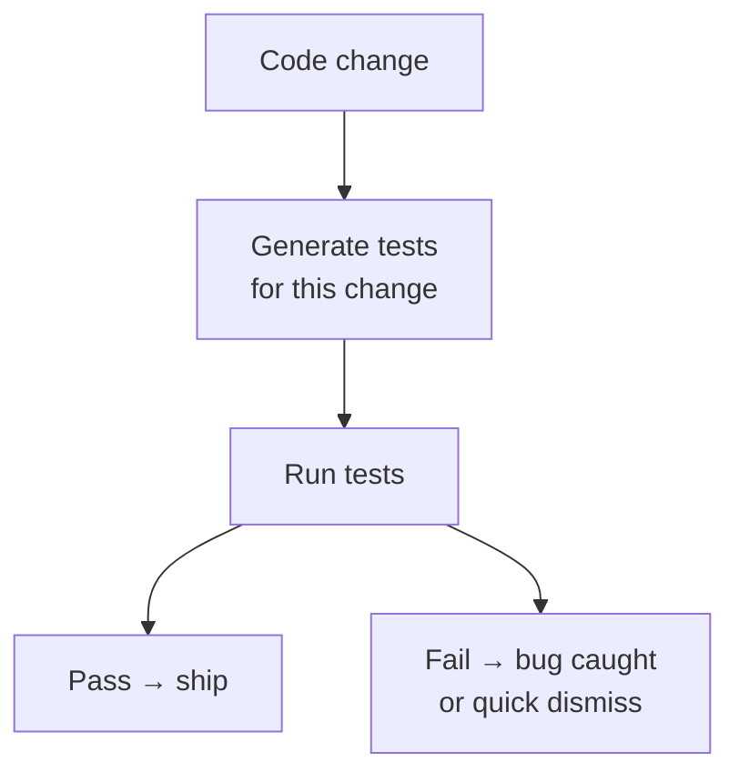

# Domain Knowledge Reference

Auto-generated from blog posts. Do not edit manually.
Last updated: 2026-03-03

---

## Source: what-is-just-in-time-catching-test-generation

URL: https://jeffbailey.us/blog/2026/02/14/what-is-just-in-time-catching-test-generation

## Introduction

When I submit a pull request, I rely on [existing tests](https://jeffbailey.us/fundamentals-of-software-testing/), written months or years ago, which run with each change. But what if tests could be automatically generated for each diff, tailored to catch bugs before code lands? That's the premise of Just-in-Time (JIT) Catching Test Generation.

This approach turns traditional testing on its head. Instead of maintaining a static test suite that you update whenever behavior changes, catching tests are generated on the fly by large language models (LLMs). They are meant to fail when they find a bug. They do not live in your codebase. They exist only to catch regressions in the specific code change under review.

The mental model: tests generated just-in-time, tailored to each change, to catch bugs before production while minimizing the friction of false positives.

## What Is Just-in-Time Catching Test Generation?

Just-in-Time Catching Test Generation creates tests when code changes are submitted. LLMs generate and run these tests against the change, designed to fail if regression is detected. A failed test indicates a potential bug, while passing tests suggest the change is clean.

A **catching test** differs from a **hardening test**. A hardening test passes upon initial writing, gets checked into the codebase, and runs on all subsequent changes, preventing regressions. A catching test, designed to fail at generation time, catches bugs during review. It can't be checked in with the change that causes it to fail; either the bug is fixed, making the test obsolete, or the test is discarded as a false positive.

Think of it like a tailor versus a clothing rack. A hardening test is off-the-shelf: you pick an existing test that fits the current code and hope it still fits future changes. A catching test is bespoke: it is made for this specific change, at this moment, to catch bugs it might introduce. When the change lands or is abandoned, the test is discarded.

The **Just-in-Time** test is generated at the time of diff submission, not written beforehand. No one maintains or reviews it during development. Human oversight is only needed when a test catches an issue.

## Why JIT Catching Test Generation Exists

Traditional testing assumes slower change. Engineers write, review, and update tests as code evolves, but this breaks when code changes faster than engineers can keep up.

Augmented software development accelerates change by having AI assistants rapidly generate and modify vast amounts of code. This speeds up writing, reviewing, and shipping code, overwhelming test suites in the process. Tests become outdated or produce false positives, failing even when the code is correct. The result is either test maintenance overload or a flood of false positives, where tests fail because the test is wrong, not because the code is wrong.

A second problem is covering the unknown. Traditional tests check the current code to predict regressions, but engineers can't foresee all issues. Tests often miss bugs or falsely flag intended changes. As code evolves faster, this uncertainty increases.

JIT catching test generation addresses these problems by shifting the burden from humans to machines. Tests are generated automatically for each change. They do not need to anticipate all future changes, only the one under review. They do not live in the codebase, so there is no test maintenance. They are tailored to the diff, so they are less likely to break when the change is intentional. Human review is required only when a bug might actually be present.

## How JIT Catching Test Generation Works

In essence, the system infers what the change tries to do, creates mutant versions that simulate bugs, generates tests that would catch those mutants, runs those tests on the real change, and uses assessors to filter false positives before involving engineers.

### A Code Change Is Submitted

When a developer submits a diff (or pull request), the system has two versions of the code: the parent (base) and the child (proposed change).

### Intent and Risk Are Inferred

Some workflows use the diff itself, along with available context (title, description, discussion), to infer what the change aims to accomplish. From that intent, the system reasons about ways the implementation could go wrong. These are the **risks** of the change.

### Mutants Are Created

Using mutation testing, the system creates **mutants**, versions of code with deliberately introduced faults that represent plausible bugs. These mutants encode inferred risks. If a real change introduces a similar bug, a test killing a mutant might catch the real bug. This is the mutation coupling hypothesis: real faults are often linked to artificial ones.

A simpler variant, sometimes called the **dodgy diff** approach, skips intent inference and treats the diff itself as a mutant. The system assumes the diff might be buggy and generates tests that distinguish the diff from its parent. This maximizes the number of candidate catches; filtering of false positives happens later.

### Tests Are Generated and Run

The system uses a large language model to generate tests for each mutant or diff in the dodgy approach that passes on the parent but fails on the mutant or diff. These tests are run on the actual diff. Tests failing on the diff are **weak catches**: they detect some behavioral difference, but it's unclear if it's a bug or an intended change.

### Assessors Filter False Positives

A weak catch can be a **strong catch** (a true positive indicating a real bug) or a **strictly weak catch** (a false positive due to test issues or misunderstood behavior). The challenge is distinguishing them.

Systems use **assessors**: automated procedures that score weak catches on how likely they are to be true positives. These can be rule-based (e.g., patterns that commonly indicate false positives, such as brittle reflection or implementation-dependent ordering) or LLM-based (an LLM judges whether the observed behavior change is likely unintended). Often, both are used. High-scoring candidates are escalated to human review; low-scoring ones are discarded.

### Engineers Get Focused Feedback

When a weak catch warrants attention, the engineer sees a concise description of the change (e.g., "this expression used to evaluate to true, but now false; is that expected?") instead of raw test code. Responding "yes, that is expected" quickly dismisses false positives. Responding "no, that is unexpected" prompts investigation and fixes. The aim is to minimize false positives while identifying real bugs.

## Key Relationships

JIT catching test generation connects to several related ideas.

### Hardening Tests and the Harden-and-Catch Framework

The Harden and Catch Framework ([Becker et al.][arxiv-paper]) distinguishes hardening tests (pass at generation, land in codebase, protect against future regressions) from catching tests (fail at generation, catch bugs in the change under test). JIT catching test generation is the automated production of catching tests, just-in-time. Both hardening and catching can coexist: you keep your [hardening suite](https://jeffbailey.us/fundamentals-of-software-testing/) and add JIT catching for each submitted change.

### Mutation Testing

Traditional mutation testing evaluates the quality of an existing test suite. You start with tests already in your codebase. The system seeds **mutants**—versions of the code with deliberately introduced faults—into the system under test, then runs your existing tests against each mutant. If a test fails on a mutant, it "kills" that mutant; if no test kills it, the mutant "survives," suggesting your tests are weak or miss that fault. The result is a mutation score: the proportion of mutants killed. The goal is to improve your test suite until it kills most mutants.

JIT catching inverts this. Instead of using mutants to evaluate existing tests, it uses mutants to *generate* new tests. You start with a code change (the diff), not a test suite. The system generates mutants that represent plausible bugs introduced by that change. It then generates tests that would kill those mutants—tests that pass on the parent (base) code but fail on the mutant. Those generated tests are run on the actual diff. If a generated test fails on the diff, it may have caught a real bug. The goal is not to score your test suite; it is to produce tests, just-in-time, that catch regressions in the change under review.

Both use the same mutation machinery and the coupling hypothesis (real faults resemble artificial ones). Traditional mutation testing asks: "How good are my tests?" JIT catching asks: "What tests would catch bugs in this change?"

### The Oracle Problem

In software testing, the **oracle** is the mechanism that decides whether a test passes or fails. For catching tests, you cannot rely only on the **implicit oracle** (crashes, unhandled exceptions) because many bugs cause wrong output, not crashes. You need something closer to the **general oracle**: the true, expected behavior, which is often vague or undocumented. Inferring intent from code and context, and then generating tests from that inferred intent, is one way to approximate the general oracle. It is imperfect, but it allows automation where manual test authoring would be impractical.

### Agentic Development

Agentic development refers to AI systems that autonomously plan and execute coding tasks. It produces more code, faster. JIT catching test generation is a response to that reality: when humans cannot keep up with test authoring and maintenance, machines generate tests for each change. Meta's Engineering blog [frames JIT testing as a revival][meta-jit-blog] for a field stressed by agentic development.

## Trade-offs and Limitations

### Benefits

* **No test maintenance**: Generated tests do not live in the codebase. When the change lands or is abandoned, they disappear. No flaky tests to fix, no test code to refactor.
* **Tailored to each change**: Tests target the specific diff, not generic coverage. They adapt automatically as code changes.
* **Shift of effort to machines**: LLMs generate tests; assessors filter candidates. Human effort concentrates on real bugs, not test authorship.
* **Complements hardening tests**: JIT catching does not replace a hardening suite. It adds another layer to the change under review.
* **Evidence of impact**: In Meta's deployment, JIT catching identified 8 confirmed true positives from 41 engineer reach-outs; 4 of those would have led to serious production failures. Dismissing false positives took engineers, on average, only a few minutes.

### Costs and Limitations

* **Computational expense**: Generating many tests per diff, running mutants, and invoking LLMs is costly. Systems typically target high-risk changes rather than every diff.
* **False positive risk**: Weak catches are common; strong catches are rarer. Assessors reduce but do not eliminate false positives. Poor filtering creates friction.
* **Intent inference is imperfect**: Inferring the intention of a code change from code and context is hard. Wrong intent leads to irrelevant mutants and tests.
* **Dependence on LLMs**: Quality depends on the capabilities of the underlying models. Model limitations affect both test generation and assessment.
* **Early-stage technology**: Published results are from specific deployments (e.g., Meta's backend systems). Broader applicability and long-term effects are not fully known.

### When JIT Catching May Not Fit

* **Low-risk or trivial changes**: The overhead may not justify running JIT catching for every small typo fix or config tweak.
* **Very small codebases**: The infrastructure and cost may be disproportionate.
* **Strong aversion to false positives**: If even occasional false positives are unacceptable, the filtering bar must be very high, which may reduce recall.

## Common Misconceptions

### Catching tests replace hardening tests.

They do not. Catching tests are generated per change, run once, and discarded. Hardening tests remain in the codebase and run on every change. JIT catching adds a layer focused on the diff under review; it does not eliminate the need for a persistent test suite.

### Catching tests always means real bugs

A failing catching test is a weak catch: it indicates a behavioral difference. That difference might be a bug (strong catch) or an intended change, a test bug, or a brittle assertion (strictly weak catch, false positive). Assessors help separate them, but the distinction always requires human judgment when it matters.

### LLMs write perfect tests

LLMs generate tests that often build and run, but they can produce brittle, implementation-dependent, or irrelevant tests. Rule-based and LLM-based assessors exist partly to filter those out. The value is in the workflow (generate, run, assess, escalate), not in assuming the raw output is always correct.

### JIT catching only works at a huge scale

The ideas apply at different scales. Targeting high-risk changes and using spare capacity can make it economical at a large scale. Still, the conceptual approach (diff-aware test generation, mutant-guided design, assessor filtering) is general. Smaller teams might use lighter-weight variants.

### This is only for AI-generated code

JIT catching helps whenever code changes quickly, whether written by humans or AI. Agentic development amplifies the problem JIT catching addresses, but the technique is not limited to AI-generated changes.

## Conclusion

Just-in-Time Catching Test Generation automatically generates tests when a code change is submitted. Those tests are designed to fail when they detect a regression. They do not live in the codebase. They are tailored to the specific diff, generated by LLMs, and guided by inferred intent and mutation-like fault simulations. Assessors filter false positives so that engineers see high-signal feedback with minimal friction.

The mental model: instead of maintaining a static test suite that tries to anticipate all future changes, you generate tests just-in-time for each change. The tests target that change. When they fail, you ask: Is this behavior change intended? If yes, dismiss quickly. If not, you have caught a bug before it lands.

JIT catching does not replace traditional testing. It adapts testing to a world where code changes faster than manual test maintenance can keep up, and where machines can generate and assess tests at scale. The goal is to focus human attention on real bugs and to reduce the drag of false positives. That shift, from generic coverage to change-specific catching, is what makes JIT catching test generation both novel and practically relevant.

## Next Steps

If you want to learn more:

* **Learn the basics**: [Fundamentals of Software Testing](https://jeffbailey.us/fundamentals-of-software-testing/) explains traditional testing, test types, and the testing pyramid—useful background before diving into JIT catching.
* **Read the paper**: [Just-in-Time Catching Test Generation at Meta][arxiv-paper] (Becker et al., FSE Companion 2026) describes the diff-aware workflows, assessors, and deployment results in detail.
* **Read the blog post**: Meta's Engineering blog post [The Death of Traditional Testing][meta-jit-blog] offers a high-level overview and motivation.
* **Explore mutation testing**: Understanding mutation testing clarifies how mutants guide test generation in JIT catching. The [mutation testing literature][mutation-testing] is a good starting point.
* **Understand the oracle problem**: The distinction between implicit and general oracles (e.g., in [Weimer et al.][oracle-ref]) explains why catching tests are harder to automate than hardening tests.

## References

* [Just-in-Time Catching Test Generation at Meta][arxiv-paper], Becker et al., FSE Companion 2026. The primary technical paper on diff-aware workflows, assessors, and Meta's deployment results.
* [The Death of Traditional Testing: Agentic Development Broke a 50-Year-Old Field, JiTTesting Can Revive It][meta-jit-blog], Meta Engineering Blog, February 2026. Overview of JIT catching tests and their role in agentic development.
* [Mutation testing][mutation-testing], for background on mutation analysis and the coupling hypothesis that underlies mutant-guided test generation.
* [Weimer et al.][oracle-ref], for the oracle problem and software testing theory that informs catching test design.

[arxiv-paper]: https://arxiv.org/pdf/2601.22832
[meta-jit-blog]: https://engineering.fb.com/2026/02/11/developer-tools/the-death-of-traditional-testing-agentic-development-jit-testing-revival/
[mutation-testing]: https://mutationtesting.uni.lu/
[oracle-ref]: https://arxiv.org/abs/2109.04086
