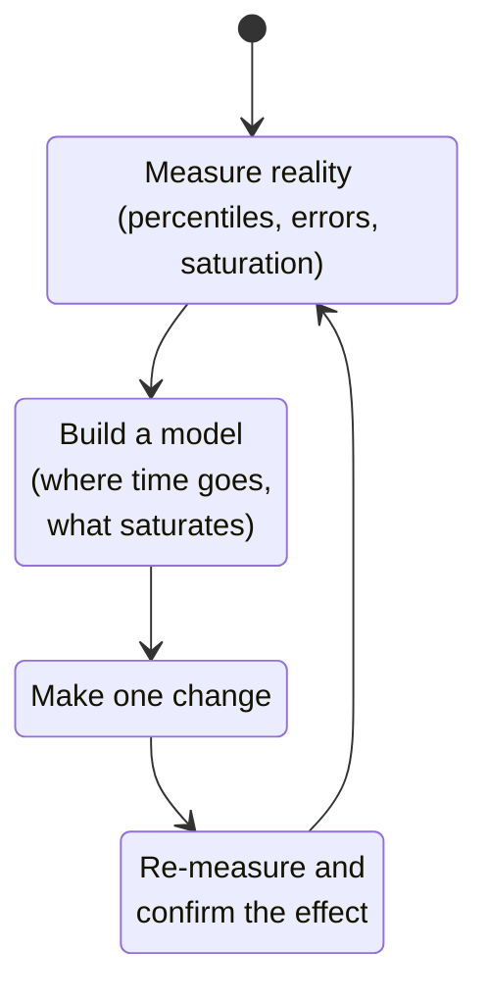
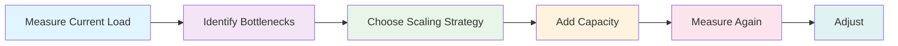
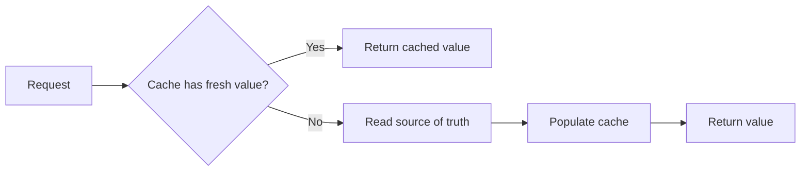

# Domain Knowledge Reference

Auto-generated from blog posts. Do not edit manually.
Last updated: 2026-03-03

---

## Source: fundamentals-of-software-performance

URL: https://jeffbailey.us/blog/2025/12/16/fundamentals-of-software-performance

## Introduction

Have you had a system that looked fine on dashboards, but users still found it slow?

That gap defines performance work. Software performance is the time from user intent to a useful result along the slowest path.

Performance covers response time distribution, system capacity under load, and balancing speed with reliability.

In this article, I explain a mental model for performance: where latency comes from, why percentiles beat averages, how bottlenecks form, and what sorts of changes usually make a difference.

> Type: **Explanation** (understanding-oriented).  
> Primary audience: **beginner** developers and leaders who want a usable model for performance, not a list of tools.

## Scope and audience

**Scope:** software performance across backend services, databases, and user-facing applications. I focus on fundamentals that apply whether you write Python, Rust, JavaScript, or something else.

**Not a how-to:** I will show small examples, but I am not walking through a specific profiler or cloud vendor.

**Prerequisites:** basic familiarity with shipping software and reading metrics and logs. If you want the adjacent foundation, start with [Fundamentals of monitoring and observability](/blog/2025/11/16/fundamentals-of-monitoring-and-observability/) and [Fundamentals of metrics](/blog/2025/11/09/fundamentals-of-metrics/).

## TL;DR: software performance in one pass

When performance is bad, four questions clarify what is happening:

* **What is slow, for whom, and when?** Define the failure in terms of percentiles and scope.
* **Where is time going?** Split latency into components (compute, input/output, network, dependency waits).
* **What is saturating?** Find the resource at or near capacity (processor time, memory, disk, network, locks, queues, connection pools).
* **What change will reduce work or waiting, and how will I prove it?** Make one change, measure again, and confirm the effect.

If you skip the first step and jump to “optimize code”, you will often fix the wrong thing.

If you are skimming, read this section, then jump to “Why percentiles matter more than averages” and “Where performance usually goes wrong”. The rest of the article fills in the model.

## A mental model: performance is time and waiting

Most performance problems are not “my code is slow” problems. They are “my code is waiting” problems.

At a high level, request latency is:

$$
\text{latency} = \text{service time} + \text{queue time}
$$

* **Service time** is actual work: computation, serialization, database work, compression, encryption.
* **Queue time** is waiting: waiting for a thread, a lock, a database connection, I/O, the network, or a downstream service.

An analogy is a lunchtime coffee shop. Service time is how long it takes to make a drink. Queue time is how long you wait in line when there are more orders than baristas. Near capacity, the line grows quickly even if each drink takes the same time.

"It was fine yesterday” can coexist with “it is slow today" because increased load or decreased capacity quickly leads to queueing.

## End-to-end performance is a critical path problem

End-to-end performance is the time it takes a user request to traverse the slowest path.

That path usually crosses boundaries:

* The client (input handling, rendering, JavaScript execution, mobile constraints).
* The network (latency, packet loss, name resolution, encrypted connection setup).
* The edge and load balancer (routing, caching, rate limits).
* The application service (compute, serialization, memory pressure).
* Dependencies (database, cache, queue, third-party services).

If you want concrete “shapes” to picture, I usually see one of these:

* Browser → edge cache → API service → database.
* API service → database with caching.
* API service fan-out to multiple internal services, each with its own dependency.

End-to-end performance work starts by identifying the critical path and measuring the total time spent. For web performance, Web Vitals are a good model for user-perceived speed. Begin with [Web Vitals].

### Why percentiles matter more than averages

Averages hide pain.

If 95% of requests take 100 milliseconds and 5% take 5 seconds, the average seems fine, but users hitting the slow case think the system is broken.

Teams track percentiles like p95 and p99 to capture tail behavior, the slow end of the latency distribution that users remember.

If you have not used percentiles before, p95 is the response time that 95% of requests beat, and the remaining 5% are the tail.

For the classic argument, read [The Tail at Scale] by Jeffrey Dean and Luiz André Barroso, explaining why large systems amplify tails even when each component is “pretty fast”.

## The core performance metrics (and what they imply)

I use a small set of metrics that map cleanly to decisions.

### Latency

Latency answers: “How long does it take?”

* Track the median (p50), the 95th percentile (p95), and the 99th percentile (p99), not just averages.
* Separate client-perceived latency from server-side time when you can.
* Split by endpoint and by cohort (region, device class, customer tier) when it changes the story.

### Throughput

Throughput answers: “How much work per unit time?”

Throughput is usually requests per second, jobs per minute, or rows per second. It is not automatically good or bad. Higher throughput is useful only when latency and correctness stay acceptable.

### Error rate

Error rate answers: “Is it failing while it is fast?”

A system that becomes “fast” by returning errors is not performant. Performance and reliability are coupled.

### Utilization and saturation

Utilization answers: “How busy is the resource?”

Saturation answers: “Is work waiting because this resource is at capacity?”

Many teams mistake high utilization as a problem, but it often signals saturation. Saturated resources can face sharp latency spikes with slight load increases.

For finding saturation, Brendan Gregg’s USE method is effective: check **utilization**, **saturation**, and **errors** for each primary resource. See [The USE Method].

## Performance requirements: what “good” means

Performance work needs a definition of success. Otherwise, you can optimize forever.

I like requirements that look like this:

* “For `POST /checkout`, p95 latency is under 800 milliseconds under expected peak load.”
* “For search, p99 latency is under 2 seconds for logged-in users.”
* “The system sustains 1,000 requests per second with an error rate under 0.1%.”

If you have service level objectives (SLOs), define the term once and reuse it: a **service level objective (SLO)** is a target level of reliability or performance you want to achieve. SLOs help you treat performance as a contract, not a vague preference.

## Measurement is a feature, not a phase

Performance is hard to evaluate without affordable measurement. Performance work is a cycle, not a checklist. The goal is to reduce guessing by tightening the feedback loop.



If you can’t measure, you can’t verify. If you can’t prove measurements, you're guessing.

### A small code example: measuring and summarizing latency

You can build helpful intuition by measuring latency and percentiles, even without a full stack trace.

Here’s a Python example that times an operation and reports p50 and p95.

```python
import time
import statistics

def percentile(samples, p):
    if not samples:
        raise ValueError("no samples")
    samples = sorted(samples)
    k = int((len(samples) - 1) * p)
    return samples[k]

def timed_call(fn, iterations=200):
    durations_ms = []
    for _ in range(iterations):
        start = time.perf_counter()
        fn()
        end = time.perf_counter()
        durations_ms.append((end - start) * 1000)
    return durations_ms

def do_work():
    sum(i * i for i in range(50_000))

samples = timed_call(do_work, iterations=300)
print(f"p50={percentile(samples, 0.50):.1f}ms")
print(f"p95={percentile(samples, 0.95):.1f}ms")
print(f"avg={statistics.mean(samples):.1f}ms")
```

This isn't production-grade benchmarking; it's a way to train your instincts: tails exist even on your laptop.

## Where performance usually goes wrong

Most performance incidents follow common patterns.

### Pattern: saturation and queueing

A resource hits capacity, and work waits in line.

Common culprits:

* Thread pools.
* Database connection pools.
* Locks and contention hotspots.
* Single partitions (a “hot key” in a cache or database).
* Downstream dependencies that slow down.

Queueing theory is a whole field, but a straightforward idea shows up everywhere: **[Little’s Law]** relates the average number of items in a system, the arrival rate, and the time in the system. If the arrival rate increases while the service time remains constant, the system accumulates work. Near capacity, even small traffic rises significantly increase wait times.

### Pattern: the “fast path” gets slower

A “fast” cache slows down due to small size, high miss rate, or stampedes.

Caching improves performance but adds complexity, making invalidation and failure modes more challenging to handle.

### Pattern: work increases silently

The system is doing more than it used to.

Examples:

* A query now returns 5,000 rows instead of 50 due to dataset growth.
* A feature adds a loop that scales with customer size.
* A retry policy turns a partial slowdown into a request storm.

Performance work aims to “make cost proportional."

### Pattern: percentiles drift, not averages

This impacts teams most; the average is flat, but the p95 and p99 are increasing.

If you only track averages, you will miss the early warning.

## Optimization levers that stay true across stacks

Most performance fixes are these when stepping back.

### Reduce the work

* Choose better algorithms and data structures.
* Avoid unnecessary parsing, serialization, and copying.
* Move costly work out of the request path if it can be asynchronous.

### Do the work less often

* Cache results where correctness allows it.
* Precompute (carefully) and invalidate (carefully).
* Batch small operations into fewer larger ones.

### Reduce waiting

* Fix contention and lock hotspots.
* Right-size pools based on downstream capacity.
* Remove unnecessary synchronous dependency calls.

### Add parallelism with care

Parallelism can cut latency but also increase load and tail behavior.

If you add concurrency, verify you did not create:

* [A thundering herd](https://jeffbailey.us/what-is-a-thundering-herd/).
* [Retry storms](https://jeffbailey.us/what-is-a-retry-storm/).
* A shared bottleneck that now saturates faster.

### Performance changes have failure modes

Most performance improvements shift work and risk.

Caching leads to invalidation, stampedes, and stale reads. Adding retries can cause request storms, while tightening timeouts improves tail latency but raises errors. The solution isn't to avoid these entirely but to understand the trade-offs and plan for failure.

## How performance fits with reliability and testing

Performance reflects reliability; if your system is “up” but unusable, users will think it's down.

Two adjacent fundamentals matter most for end-to-end performance work:

* [Fundamentals of monitoring and observability](/blog/2025/11/16/fundamentals-of-monitoring-and-observability/), for understanding production behavior.
* [Fundamentals of reliability engineering](/blog/2025/11/17/fundamentals-of-reliability-engineering/), for the broader system view of risk and user trust.

## Common misconceptions I often see

* “Performance is just speed.” Performance includes tails, capacity, and behavior under load.
* “If the average is good, we’re good.” Averages hide tail pain.
* “We should optimize before we measure.” Without measurement, you are guessing.
* “Caching is always a win.” Caching shifts problems into invalidation, stampedes, and correctness edge cases.
* “Faster is always better.” Some speedups trade away reliability, debuggability, or cost discipline.

## Key takeaways

* Performance is time plus waiting, and waiting grows fast under saturation.
* Percentiles (p95, p99) matter because tails are what users feel.
* A small set of metrics maps to decisions: latency percentiles, throughput, error rate, and saturation.
* The performance loop is measure, explain, change one thing, verify.
* Most optimizations reduce work, reduce frequency, reduce waiting, or add safe parallelism.

## Next steps

If you want to go deeper on adjacent fundamentals:

* [Fundamentals of monitoring and observability](/blog/2025/11/16/fundamentals-of-monitoring-and-observability/).
* [Fundamentals of metrics](/blog/2025/11/09/fundamentals-of-metrics/).
* [Fundamentals of distributed systems](/blog/2025/10/11/fundamentals-of-distributed-systems/).
* If you specifically want load and stress testing fundamentals, read [Fundamentals of software performance testing](/blog/2025/12/01/fundamentals-of-software-performance-testing/).

## Glossary

## References

* [Response Time Limits], for user-perceived response time thresholds.
* [The USE Method], for a practical approach to finding saturation and errors across system resources.
* [The Tail at Scale], for why tail latency dominates large distributed systems.
* [Site Reliability Engineering], for operating concepts that tie performance, reliability, and measurement together.
* [Web Vitals], for user-centered web performance metrics and measurement framing.
* [Little’s Law], for the queueing relationship described in the saturation section.

[Response Time Limits]: https://www.nngroup.com/articles/response-times-3-important-limits/
[The USE Method]: https://www.brendangregg.com/usemethod.html
[The Tail at Scale]: https://research.google/pubs/the-tail-at-scale/
[Site Reliability Engineering]: https://sre.google/books/
[Web Vitals]: https://web.dev/articles/vitals
[Little’s Law]: https://en.wikipedia.org/wiki/Little%27s_law


---

## Source: fundamentals-of-software-scalability

URL: https://jeffbailey.us/blog/2025/12/22/fundamentals-of-software-scalability

## Introduction

Why do some systems handle 10x traffic growth smoothly while others collapse under 2x load? The difference lies in understanding the fundamentals of software scalability.

If you've ever watched a system slow to a crawl when users increase, or spent weeks rewriting code because it couldn't handle growth, this article explains how systems scale and why some approaches work while others fail.

**Software scalability** is a system's ability to handle increased load by adding resources. It's about answering questions like: "Can my system handle 10x more users?" "What happens when traffic doubles?" "Should I scale up or scale out?"

Scalability matters because systems that don't scale become bottlenecks. They limit business growth, frustrate users, and require expensive rewrites. Understanding scalability fundamentals enables you to build systems that grow with demand instead of breaking under it.

**What this is (and isn't):** This article covers core scalability principles like horizontal and vertical scaling, patterns, and trade-offs. It explains why scalability works and how the components fit together, not specific cloud implementations or detailed patterns.

**Why scalability fundamentals matter:**

* **Enable growth** - Scalable systems handle increased demand without breaking, allowing businesses to grow.
* **Control costs** - Understanding scalability helps you scale efficiently, avoiding over-provisioning or expensive rewrites.
* **Prevent outages** - Systems that scale appropriately avoid performance degradation and failures under load.
* **Reduce technical debt** - Building scalability in from the start avoids expensive rewrites later.
* **Better decisions** - Understanding scalability fundamentals helps you choose the right scaling approach for your situation.

Mastering scalability fundamentals shifts you from building systems that work today to building systems that work as demand grows. It balances three forces: handling increased load, controlling costs, and maintaining performance. This article explains how to navigate these trade-offs.

> Type: **Explanation** (understanding-oriented).  
> Primary audience: **beginner to intermediate** engineers and architects learning how systems handle increased load and scale effectively

### Prerequisites & Audience

**Prerequisites:** Basic software development literacy; assumes familiarity with servers, databases, and application deployment. No prior scalability experience needed, but understanding of basic system architecture helps.

**Primary audience:** Beginner to intermediate engineers and architects learning how systems scale, with enough depth for experienced developers to align on foundational concepts.

**Jump to:** [What is Scalability?](#section-1-what-is-scalability) • [Why Scalability Matters](#section-2-why-scalability-matters) • [Scaling Dimensions](#section-3-scaling-dimensions-horizontal-and-vertical) • [Scalability Patterns](#section-4-scalability-patterns) • [Scalability Constraints](#section-5-scalability-constraints-and-bottlenecks) • [Common Mistakes](#section-6-common-scalability-mistakes) • [Misconceptions](#section-7-common-misconceptions) • [When NOT to Scale](#section-8-when-not-to-focus-on-scalability) • [Glossary](#glossary)

### TL;DR – Scalability Fundamentals in One Pass

If you only remember one workflow, make it this:

* **Scale horizontally when possible** so you can add capacity incrementally without hitting hardware limits.
* **Identify bottlenecks first** so you scale the right components instead of wasting resources.
* **Design for statelessness** so you can easily distribute load across multiple instances.
* **Plan for non-linear scaling** so you account for coordination overhead and diminishing returns.

**The Scalability Workflow:**



### Learning Outcomes

By the end of this article, you will be able to:

* Explain why scalability matters and how it differs from performance optimization.
* Describe horizontal vs. vertical scaling and when to use each approach.
* Explain why stateless design enables horizontal scaling and how stateful systems create constraints.
* Learn how bottlenecks limit scalability and how to identify them.
* Describe how scalability patterns work and when to apply them.
* Explain why scalability isn't unrestricted and what trade-offs you make when scaling.

## Section 1: What is Scalability?

Scalability is a system's ability to handle increased load by adding resources. A scalable system can grow to meet demand without fundamental redesign.

Think of scalability like a highway system. A scalable highway can handle more traffic by adding lanes (horizontal scaling) or by making existing lanes wider (vertical scaling). A non-scalable highway becomes a bottleneck that can't be expanded, forcing traffic to find alternate routes or wait.

### The Core Problem Scalability Solves

Systems face increasing load over time. User growth, feature adoption, data growth, and external events all increase demand. When the load exceeds a system's capacity, performance degrades, or the system fails.

Scalability addresses this by enabling systems to grow with demand:

* **Handle growth** - Systems can accommodate increased users, transactions, or data without breaking.
* **Maintain performance** - As load increases, scalable systems maintain acceptable response times and throughput.
* **Add capacity incrementally** - You can add resources gradually instead of requiring complete rewrites.
* **Control costs** - Scalable systems let you add capacity as needed, avoiding over-provisioning.

### Scalability vs. Performance

Scalability and performance are related but different concepts.

**Performance** is how fast a system handles a given load. A fast system might handle 1,000 requests per second, but if it can't handle 10,000 requests per second when demand grows, it lacks scalability.

**Scalability** is how well a system handles increased load. A scalable system might start slower, but can grow to handle much larger loads by adding resources.

You can have high performance without scalability (a fast single-server system that can't grow) or scalability without high performance (a distributed system that handles large loads but with higher latency). The best systems combine both: they perform well and scale effectively.

### Types of Scalability

Scalability happens at different levels:

**Application scalability:** The application's ability to handle increased load. This includes how the code handles concurrency, how data structures perform under load, and how algorithms scale with input size.

**Infrastructure scalability:** The ability of the infrastructure to provide additional resources. This includes adding servers, increasing network capacity, and expanding storage.

**Data scalability:** The data layer's ability to handle increased data volume and query load. This includes database sharding, read replicas, and caching strategies.

**Team scalability:** The development team's ability to work effectively as the system grows. This includes code organization, deployment processes, and operational practices.

These levels interconnect. Application scalability depends on infrastructure scalability. Data scalability enables application scalability. Team scalability determines how quickly you can improve the other types.

### Why Scalability is Challenging

Scalability is challenging because systems have constraints that limit growth:

**Stateful components:** Systems that maintain state (session data, in-memory caches, local file storage) create bottlenecks. You can't easily distribute stateful components across multiple servers.

**Shared resources:** Databases, message queues, and file systems create bottlenecks when multiple components compete for access. These shared resources often become the limiting factor.

**Coordination overhead:** Distributed systems require coordination (e.g., consensus, locking, synchronization), which adds latency and complexity. More components mean more coordination overhead.

**Non-linear scaling:** Adding resources doesn't always provide proportional capacity increases. Coordination overhead, network latency, and contention create diminishing returns.

**Bottlenecks shift:** As you scale one component, another becomes the bottleneck. The database might be the limit today, but after scaling it, the network might become the limit tomorrow.

Despite challenges, scalability is essential. Systems that don't scale become bottlenecks that limit business growth and frustrate users.

## Section 2: Why Scalability Matters

Scalability matters because it directly impacts your ability to handle growth, control costs, and maintain system reliability.

### Enabling Business Growth

The most apparent reason scalability matters is that it enables business growth. When your product succeeds and your user base grows, a scalable system handles the growth. A non-scalable system becomes a bottleneck that limits success.

Scalability enables growth by:

* **Handling user growth** - Systems can accommodate more users without performance degradation.
* **Supporting feature adoption** - As features become popular, scalable systems handle increased usage.
* **Managing traffic spikes** - Marketing campaigns, viral content, and external events create traffic spikes that scalable systems absorb.
* **Enabling geographic expansion** - Scalable systems can expand to new regions without fundamental redesign.

Businesses that can't scale miss opportunities. A successful marketing campaign drives traffic to a system that can't handle it, wasting marketing spend and frustrating potential customers.

### Controlling Costs

Scalability helps control costs by enabling efficient resource usage. You add capacity as needed, rather than over-provisioning upfront or paying for expensive rewrites later.

Scalability supports cost control by:

* **Incremental scaling** - Add resources gradually as demand grows, avoiding significant upfront investments.
* **Right-sizing** - Scale components that need it, not everything at once.
* **Avoiding rewrites** - Scalable systems grow without requiring complete redesigns that cost time and money.
* **Optimizing utilization** - Distribute load efficiently across resources, maximizing utilization without over-provisioning.

Systems that don't scale often require expensive rewrites when they hit limits. A system that worked for 10,000 users might need a complete redesign for 100,000 users, costing months of development time.

### Maintaining Performance Under Load

Scalability maintains performance as load increases. Non-scalable systems degrade under load: response times increase, throughput decreases, and errors become more common.

Scalability maintains performance by:

* **Distributing load** - Spread work across multiple components, preventing any single component from becoming overloaded.
* **Adding capacity** - Increase resources to maintain performance as demand grows.
* **Handling peaks** - Absorb traffic spikes without performance degradation.
* **Isolating failures** - When one component fails, others continue handling the load.

Users notice when systems slow down under load. Slow response times lead to frustration, abandonment, and lost revenue. Scalable systems maintain acceptable performance even as demand grows.

### Reducing Operational Stress

Scalability reduces operational stress by providing headroom for growth and traffic spikes. Teams that build scalable systems sleep better because they know the system can handle unexpected load.

Scalability reduces stress by:

* **Providing headroom** - Extra capacity handles unexpected traffic without emergency response.
* **Enabling proactive scaling** - Add capacity before hitting limits, avoiding reactive firefighting.
* **Handling variability** - Absorb traffic spikes and usage patterns without manual intervention.
* **Building confidence** - Knowing the system can scale reduces anxiety about growth and traffic events.

Teams that don't plan for scalability live in constant fear of traffic spikes and growth. Every marketing campaign becomes a risk. Every feature launch might break the system.

### Supporting Technical Evolution

Scalability supports technical evolution by enabling systems to adapt as requirements change. Scalable architectures provide flexibility to add features, change data models, and integrate new services.

Scalability supports evolution by:

* **Modular design** - Scalable systems often use modular architectures that enable independent scaling and evolution.
* **Loose coupling** - Components can evolve independently without breaking the entire system.
* **Technology flexibility** - Scalable architectures allow swapping technologies as needs change.
* **Incremental improvement** - You can improve components individually without redesigning everything.

Systems that don't scale often become monolithic blocks that resist change. Every modification risks breaking the system, slowing and risking evolution.

## Section 3: Scaling Dimensions, Horizontal and Vertical

Understanding scaling dimensions helps you choose the right approach for your situation. The two primary dimensions are horizontal scaling (scale-out) and vertical scaling (scale-up).

### Horizontal Scaling (Scale Out)

**Horizontal scaling** adds more instances of a component. Instead of making one server bigger, you add more servers.

Think of horizontal scaling like adding more cashiers at a store. Instead of making one cashier faster, you add more cashiers to handle more customers simultaneously.

**How horizontal scaling works:**

* **Add instances** - Deploy additional servers, containers, or processes.
* **Distribute load** - Use load balancers to spread requests across instances.
* **Share state externally** - Store state in databases, caches, or message queues that all instances can access.
* **Scale incrementally** - Add instances one at a time as needed.

**Advantages of horizontal scaling:**

* **No hardware limits** - Maximum server sizes do not limit you. You can add as many instances as needed.
* **Incremental growth** - Add capacity gradually, one instance at a time.
* **Fault tolerance** - If one instance fails, others continue handling the load.
* **Cost efficiency** - Use smaller, cheaper instances instead of expensive, large servers.
* **Geographic distribution** - Deploy instances in multiple regions for lower latency.

**Challenges of horizontal scaling:**

* **State management** - Stateless applications scale horizontally easily. Stateful applications require external state storage.
* **Coordination overhead** - Multiple instances need coordination (load balancing, service discovery, consensus) that adds complexity.
* **Data consistency** - Distributing data across instances creates consistency challenges.
* **Network latency** - Communication between instances adds latency compared to in-process communication.

Horizontal scaling works best for stateless applications, read-heavy workloads, and systems that can partition work independently.

### Vertical Scaling (Scale Up)

**Vertical scaling** adds more resources to existing instances. Instead of adding more servers, you make servers bigger (with more CPU, more memory, and faster storage).

Think of vertical scaling like upgrading a car's engine. Instead of buying more cars, you make one car more powerful.

**How vertical scaling works:**

* **Upgrade hardware** - Add CPU cores, increase memory, and use faster storage.
* **Use larger instances** - Move to bigger cloud instances or physical servers.
* **Optimize utilization** - Make better use of existing resources through optimization.
* **Scale in place** - Improve capacity without changing architecture.

**Advantages of vertical scaling:**

* **Simplicity** - No need to change architecture or handle distributed system complexity.
* **No coordination overhead** - Single instance avoids coordination between multiple components.
* **Better for stateful systems** - Applications with local state can scale vertically without external state management.
* **Lower latency** - In-process communication is faster than network communication.
* **Easier debugging** - A single instance is simpler to monitor and debug.

**Challenges of vertical scaling:**

* **Hardware limits** - Maximum server sizes create ceilings you can't exceed.
* **Single point of failure** - One large instance is a bigger risk than multiple smaller instances.
* **Cost efficiency** - Larger instances often cost more per unit of capacity than smaller instances.
* **Limited incremental growth** - You must upgrade in larger steps (e.g., 4 cores to 8 cores, not 4 to 5).
* **Downtime for upgrades** - Upgrading hardware often requires downtime.

Vertical scaling works best for stateful applications, CPU-intensive workloads, and systems where simplicity matters more than unlimited growth.

### Choosing Between Horizontal and Vertical Scaling

The choice between horizontal and vertical scaling depends on your constraints and requirements.

**Choose horizontal scaling when:**

* You need to scale beyond hardware limits.
* You want incremental, granular capacity additions.
* Fault tolerance is critical (multiple instances provide redundancy).
* You have stateless applications or can externalize state.
* Cost efficiency matters (more minor instances are often cheaper per unit of capacity).

**Choose vertical scaling when:**

* Simplicity is more important than unlimited growth.
* You have stateful applications that are hard to make stateless.
* Coordination overhead would be too expensive.
* You're not near hardware limits yet.
* Single-instance performance is critical.

**Use both approaches:** Many systems use both, scaling vertically until the limits are reached, then horizontally; or horizontally for stateless components and vertically for stateful ones.

### Elasticity: Automatic Scaling

**Elasticity** is the ability to automatically add or remove capacity in response to demand. Elastic systems scale up during peak load and scale down during low load.

Think of elasticity like a restaurant that automatically opens more dining sections and adds servers during dinner rush, then closes sections and reduces staff during slow periods.

**How elasticity works:**

* **Monitor metrics** - Track CPU utilization, request rate, queue depth, or custom metrics.
* **Set thresholds** - Define when to scale up (e.g., CPU > 70%) and when to scale down (e.g., CPU < 30%).
* **Automate provisioning** - Automatically add or remove instances based on thresholds.
* **Handle scale-down** - Safely drain traffic from instances before removing them.

**Elasticity benefits:**

* **Cost optimization** - Pay only for the capacity you use, scaling down during low-demand periods.
* **Handle traffic spikes** - Automatically scale up to handle unexpected load.
* **Reduce manual work** - No need to manually provision capacity for events or growth.

**Elasticity challenges:**

* **Scale-up delay** - Adding capacity takes time. Sudden spikes might exceed capacity before scaling completes.
* **Scale-down caution** - Removing capacity too aggressively can cause capacity shortages if traffic increases.
* **Cost of thrashing** - Rapid scale-up and scale-down cycles waste resources and money.

Elasticity works best for systems with variable, predictable load patterns and stateless applications that can start and stop quickly.

## Section 4: Scalability Patterns

Recognizing common scalability patterns helps you apply scalability principles effectively. Different patterns suit different constraints and requirements.

### Stateless Design Pattern

The **stateless design pattern** eliminates server-side state, making applications easy to scale horizontally.

**How it works:** Applications don't store user session data, temporary state, or context in server memory. Instead, they store state in external systems (databases, caches, client-side storage) or encode it in requests.

**Why it enables scaling:** Stateless applications can run on any instance. Load balancers can route requests to any example without worrying about where the state lives. You can add or remove instances without affecting user sessions.

**Example:** A web application stores session data in a Redis cache instead of server memory. Any web server instance can handle any request by reading session data from Redis.

**Trade-offs:** Stateless design requires external state storage (databases, caches) that becomes a dependency. It adds latency (reading state from external storage) compared to an in-memory state. Some applications are inherently stateful and complex to make stateless.

### Caching Pattern

The **caching pattern** stores frequently accessed data in fast storage (memory) to reduce load on slower systems (such as databases).

**How it works:** Applications check the cache before querying the database. Cache hits return data immediately. Cache misses query the database and store results in the cache for future requests.

**Why it improves scalability:** Caching reduces database load, allowing databases to handle more requests. It improves response times, reducing the capacity needed to hold a given request rate.

**Example:** A news website caches article content in Redis. Most requests are served from cache, reducing database queries by 90%.

**Trade-offs:** Caching adds complexity (cache invalidation, consistency). It uses memory that could be used for other purposes. Stale cache data can cause correctness issues.

### Database Read Replicas Pattern

The **read replicas pattern** creates copies of databases that handle read queries, distributing read load across multiple instances.

**How it works:** Write queries go to the primary database, which replicates data to read replicas. Read queries go to replicas, distributing load.

**Why it improves scalability:** Read-heavy workloads can scale reads horizontally by adding replicas. The primary database focuses on writes to improve write performance.

**Example:** An e-commerce site uses one primary database for writes and five read replicas for product catalog queries. Read capacity scales with replica count.

**Trade-offs:** Read replicas add replication lag (replicas might have slightly stale data). They require storage and network capacity for replication. Write capacity doesn't scale (only the primary handles writes).

### Sharding Pattern

The **sharding pattern** partitions data across multiple databases, with each shard handling a subset of data.

**How it works:** Data is divided into shards (e.g., by user ID, geographic region, or date range). Each shard is a separate database. Applications route queries to the appropriate shard.

**Why it improves scalability:** Sharding distributes data and load across multiple databases, enabling horizontal scaling of both storage and query capacity.

**Example:** A social media platform shards user data by user ID. Users 1-1,000,000 are in shard 1, users 1,000,001-2,000,000 are in shard 2, etc. Each shard handles a fraction of total users.

**Trade-offs:** Sharding adds complexity (routing logic, cross-shard queries are complex). It makes transactions across shards challenging. Uneven data distribution creates hot shards.

### Load Balancing Pattern

The **load-balancing pattern** distributes requests across multiple instances, preventing any single instance from becoming overloaded.

**How it works:** Load balancers sit in front of application instances. They receive requests and route them to available instances using algorithms (round-robin, least connections, geographic proximity).

**Why it enables scaling:** Load balancers enable horizontal scaling by distributing load across instances. They provide fault tolerance by routing around failed instances.

**Example:** A web application runs 10 instances behind a load balancer. The load balancer distributes 1,000 requests/second across instances, giving each instance ~100 requests/second.

**Trade-offs:** Load balancers are single points of failure (though they can be made highly available). They add latency (one extra hop). Session affinity (sticky sessions) can create uneven load distribution.

### Microservices Pattern

The **microservices pattern** decomposes applications into small, independent services that can scale independently.

**How it works:** Applications are split into services (user service, product service, order service). Each service can be scaled independently based on its load.

**Why it enables scaling:** Services with high load can be scaled independently of services with low load. You scale only what needs scaling, improving cost efficiency.

**Example:** An e-commerce platform has separate services for product catalog (read-heavy, needs many instances) and order processing (write-heavy, needs fewer but larger instances). Each scales based on its load pattern.

**Trade-offs:** Microservices add complexity (service communication, distributed transactions, deployment coordination). They require operational maturity (monitoring, debugging across services). Network latency between services can impact performance.

### Message Queue Pattern

The **message queue pattern** decouples components using asynchronous messaging, enabling independent scaling of producers and consumers.

**How it works:** Components send messages to queues instead of calling each other directly. Other components consume messages from queues at their own pace.

**Why it enables scaling:** Producers and consumers scale independently. You can add more consumers to process messages faster, or add more producers to generate more messages.

**Example:** An image processing service receives upload requests and queues them. Worker instances consume messages from the queue and process images. You can scale workers based on queue depth.

**Trade-offs:** Message queues add complexity (queue management, message ordering, dead letter handling). They add latency (asynchronous processing). They require durability and reliability (messages must not be lost).

## Section 5: Scalability Constraints and Bottlenecks

Understanding constraints and bottlenecks helps you identify what limits scalability and how to address it.

### Identifying Bottlenecks

A **bottleneck** is the component that limits system capacity. No matter how fast other components are, the bottleneck determines overall performance.

Think of bottlenecks like a narrow bridge on a highway. No matter how many lanes the highway has before and after the bridge, traffic is limited by the bridge's width.

**How to identify bottlenecks:**

* **Measure everything** - Monitor CPU, memory, disk I/O, network, database connections, and application-specific metrics.
* **Find the limit** - The component at or near its limit is likely the bottleneck.
* **Load test** - Increase load and observe which component fails first or degrades most.
* **Profile applications** - Use profiling tools to find where applications spend time.

**Common bottleneck types:**

* **CPU-bound** - Processing capacity limits throughput. Adding CPU or optimizing algorithms helps.
* **Memory-bound** - Available memory limits capacity. Adding memory or reducing memory usage helps.
* **I/O-bound** - Disk or network I/O limits capacity. Faster storage or a network helps.
* **Database-bound** - Database capacity limits system capacity. Scaling databases (read replicas, sharding, caching) helps.
* **Application-bound** - Application design limits capacity. Code optimization or architectural changes help.

### The Scalability Ceiling

Every system has a **scalability ceiling**, a point where adding resources provides diminishing returns or no benefit.

**Why ceilings exist:**

* **Coordination overhead** - More components require more coordination (consensus, locking, synchronization), adding latency and reducing efficiency.
* **Shared bottlenecks** - Some resources can't be scaled (single database, shared file system, external API rate limits).
* **Amdahl's Law** - The non-parallelizable portion of work limits speedup. Even with infinite parallelization, sequential portions create limits.
* **Network effects** - More components mean more network communication, increasing latency and reducing throughput.

**Recognizing the ceiling:**

* **Diminishing returns** - Each additional resource provides less capacity increase than the previous one.
* **Performance plateaus** - Adding resources no longer improves performance.
* **Coordination dominates** - More time is spent coordinating than doing work.

When you hit the ceiling, architectural changes are needed, not just more resources.

### State as a Scalability Constraint

Stateful components create scalability constraints because state must be managed consistently across instances.

**Why state limits scalability:**

* **State locality** - Stateful components must run on specific instances where state lives, preventing load distribution.
* **State synchronization** - Multiple instances with state require synchronization, adding coordination overhead.
* **State migration** - Moving state between instances is complex and risky.
* **Failure recovery** - Recovering state after failures is more complex with distributed state.

**Making stateful systems scalable:**

* **Externalize state** - Store state in databases, caches, or message queues that all instances can access.
* **Partition state** - Divide the state into shards that can be scaled independently.
* **Use stateless design** - Eliminate server-side state when possible, storing state client-side or in external systems.

### Network as a Scalability Constraint

Network capacity and latency can limit scalability, especially in distributed systems.

**Why network limits scalability:**

* **Bandwidth limits** - Network links have a maximum throughput that can't be exceeded.
* **Latency** - Network communication adds latency that accumulates across multiple hops.
* **Congestion** - Network congestion under load reduces adequate bandwidth.
* **Geographic distribution** - Wide-area networks have higher latency than local networks.

**Addressing network constraints:**

* **Reduce communication** - Minimize network calls, batch requests, and use compression.
* **Co-locate components** - Place frequently communicating components in the same data center or region.
* **Use caching** - Cache data locally to reduce network requests.
* **Optimize protocols** - Use efficient protocols (HTTP/2, gRPC) that reduce overhead.

### Database as a Scalability Constraint

Databases are common scalability bottlenecks because they're shared resources that handle both reads and writes.

**Why databases limit scalability:**

* **Single point of contention** - All components compete for database access.
* **Write limits** - Write capacity is harder to scale than read capacity.
* **Transaction overhead** - ACID transactions require coordination that limits throughput.
* **Connection limits** - Database connection pools create hard limits.

**Scaling databases:**

* **Read replicas** - Distribute read load across multiple database instances.
* **Sharding** - Partition data across multiple databases.
* **Caching** - Cache frequently accessed data to reduce database load.
* **Denormalization** - Reduce join complexity by duplicating data.
* **Async processing** - Move work to background jobs to reduce database load.

## Section 6: Common Scalability Mistakes

Even with pattern recognition, teams fall into predictable scalability mistakes. Understanding what goes wrong helps you avoid expensive problems.

### Scaling the Wrong Component

Teams often scale components that aren't bottlenecks, wasting resources without improving performance.

**The mistake:** Adding more web servers when the database is the bottleneck. The web servers sit idle while the database struggles.

**Why it happens:** Teams scale what's easy to scale (stateless web servers) instead of identifying actual bottlenecks.

**How to avoid it:** Measure all components to identify bottlenecks before scaling. Scale the limiting component, not the easiest component.

### Ignoring State

Teams try to scale stateful applications horizontally without addressing state, causing session loss and data inconsistency.

**The mistake:** Running multiple instances of a stateful application with local session storage. Users lose sessions when load balancers route them to different instances.

**Why it happens:** Teams assume horizontal scaling works for all applications without considering state requirements.

**How to avoid it:** Externalize state (databases, caches) or use session affinity (sticky sessions) if state must be local. Prefer stateless design when possible.

### Premature Optimization

Teams optimize for scalability before understanding actual requirements, adding complexity without benefit.

**The mistake:** Building a microservices architecture for an application that will never need to scale beyond a single server.

**Why it happens:** Teams assume they need maximum scalability from the start, unaware that most systems never reach a scale that requires complex architectures.

**How to avoid it:** Start simple—scale when you have the evidence you need. Add complexity only when benefits justify costs.

### Over-Engineering for Scale

Teams build complex, scalable architectures when simpler approaches would suffice, wasting development time and operational complexity.

**The mistake:** Implementing database sharding when read replicas would handle the load for years.

**Why it happens:** Teams want to "do it right" from the start, not realizing that simpler solutions often work longer than expected.

**How to avoid it:** Use the most straightforward approach that meets the requirements. You can always add complexity later when needed. Premature complexity is more complicated to change than simple systems.

### Not Planning for Scale-Down

Teams plan for scaling up but not scaling down, wasting money on unused capacity.

**The mistake:** Manually scaling up for an event, then forgetting to scale down afterward, leaving expensive resources running unused.

**Why it happens:** Scaling up feels urgent (handling load). Scaling down feels less urgent (saving money), so it gets forgotten.

**How to avoid it:** Automate scaling with elasticity. Set up alerts for unused capacity. Make scaling down part of your operational procedures.

### Ignoring Coordination Overhead

Teams add many instances without accounting for coordination overhead, finding that more instances yield less benefit than expected.

**The mistake:** Scaling from 10 instances to 100 instances and finding that capacity only increases 3x instead of 10x due to coordination overhead.

**Why it happens:** Teams assume linear scaling (10x instances = 10x capacity) without accounting for coordination costs.

**How to avoid it:** Measure actual capacity increases as you scale. Account for coordination overhead in capacity planning. Understand that scaling has diminishing returns.

## Section 7: Common Misconceptions

Common misconceptions about scalability include:

* **"Scalability is the same as performance."** Performance measures speed handling load; scalability measures capacity increase. A fast single-server has high performance, but low scalability. A slower distributed system may have lower performance but greater scalability.

* **"You need to scale from day one."** Most systems stay small enough for simple, monolithic designs. Add scalability only when evidence shows it's needed.

* **"Horizontal scaling is always better than vertical scaling."** Horizontal scaling offers benefits like no hardware limits and fault tolerance, but incurs costs such as coordination overhead and complexity. Vertical scaling is simpler and often enough. Choose based on constraints.

* **"More instances always mean more capacity."** Coordination overhead, shared bottlenecks, and network effects lead to diminishing returns. Scaling up yields less benefit, eventually reaching a ceiling.

* **"Stateless design is always possible."** Some applications are inherently stateful (like games or real-time collaboration). Making them stateless might be impossible or require major redesigns. Use stateful design when needed, but consider scalability limits.

* **"Scalability is free."** Scalability incurs costs such as complexity, coordination, operational overhead, and development overhead. While often worthwhile, they are not zero.

* **"You can scale anything."** Some systems have limits (single database, API rate limits, sequential algorithms). Knowing these helps plan for scalability.

## Section 8: When NOT to Focus on Scalability

Scalability isn't always necessary or appropriate. Understanding when to skip it helps you focus effort where it matters.

**Prototypes and experiments** - For temporary systems with short lifespans, detailed scalability planning is usually unnecessary. Use simple architectures and scale only if the experiment succeeds.

**Minimal, stable systems** - For systems with few users and stable, predictable demand, simple architectures are sufficient. You can add scalability later if demand grows.

**Systems with known limits** - If you see a system that will never exceed certain limits (internal tools, one-time data processing), scalability beyond those limits is unnecessary.

**When complexity cost exceeds benefit** - If the cost of building a scalable architecture exceeds the benefit (you'll never need the scale), use simpler approaches.

**When you lack data** - If you have no evidence of the need for scalability (no growth trajectory, no traffic spikes), don't optimize prematurely. Measure first, then scale.

Even when you skip detailed scalability planning, some scalability considerations are usually valuable. Use a stateless design when it's easy. Avoid hard-coded limits. Design for horizontal scaling, even if you start with vertical scaling. These practices make future scaling easier without adding much complexity.

## Building Scalable Systems

Understanding the fundamentals of scalability enables you to build systems that grow with demand. Here's how the concepts connect.

### Key Takeaways

* **Scalability enables growth** - Systems that scale handle increased demand without breaking, allowing businesses to grow.
* **Choose the right scaling approach** - Horizontal scaling for unlimited growth, vertical scaling for simplicity. Use both when appropriate.
* **Design for statelessness** - Stateless applications scale horizontally easily. Externalize the state when you can't eliminate it.
* **Identify bottlenecks first** - Scale the limiting component, not the easiest component.
* **Account for coordination overhead** - Scaling has diminishing returns. More instances provide less benefit due to coordination costs.

### How These Concepts Connect

Scalability begins with understanding load patterns and bottlenecks. Choose scaling strategies (horizontal vs. vertical) based on constraints. Apply patterns like caching, read replicas, and sharding to resolve bottlenecks. Design for statelessness to facilitate horizontal scaling. Measure and adjust during scaling, considering coordination overhead and diminishing returns.

### Getting Started with Scalability

If you're new to scalability, start with measurement and simple patterns:

1. **Measure current load** - Understand what resources you use and where bottlenecks exist.
2. **Identify the bottleneck** - Find the component that limits capacity.
3. **Apply simple patterns** - Use caching, read replicas, or load balancing to address bottlenecks.
4. **Measure again** - Validate that scaling improved capacity and identify the next bottleneck.
5. **Iterate** - Repeat as demand grows and new bottlenecks emerge.

Once this feels routine, you can apply more advanced patterns (such as sharding and microservices) when simpler approaches no longer suffice.

### Next Steps

**Immediate actions:**

* Measure current system capacity and identify bottlenecks.
* Review architecture for stateful components that limit scalability.
* Plan scaling strategy (horizontal vs. vertical) based on constraints.

**Learning path:**

* Learn about /blog/2025/12/22/fundamentals-of-capacity-planning/ to understand how to plan for resource needs.
* Study /blog/2025/12/16/fundamentals-of-software-performance/ to understand performance optimization that complements scalability.
* Explore /blog/2025/10/11/fundamentals-of-distributed-systems/ to understand distributed system constraints that affect scalability.

**Practice exercises:**

* Run load tests to identify bottlenecks.
* Implement caching to reduce database load.
* Set up read replicas for a read-heavy workload.

**Questions for reflection:**

* What are the bottlenecks in your current systems?
* Could your applications be made more stateless?
* What scaling approach (horizontal vs. vertical) fits your constraints?

### The Scalability Workflow: A Quick Reminder

Before we conclude, here's the core workflow one more time:

```text
Measure Load → Identify Bottlenecks → Choose Strategy → 
Add Capacity → Measure Again → Adjust
```

This workflow applies whether you're scaling horizontally, vertically, or both. The key is measuring to understand what limits capacity, then scaling the right components.

### Final Quick Check

Before you move on, see if you can answer these out loud:

1. What's the difference between scalability and performance?
2. When should you scale horizontally vs. vertically?
3. Why does stateless design enable horizontal scaling?
4. What creates scalability ceilings?
5. How do you identify bottlenecks?

If any answer feels fuzzy, revisit the matching section and review the examples.

### Self-Assessment – Can You Explain These in Your Own Words?

Before moving on, see if you can explain these concepts in your own words:

* Horizontal vs. vertical scaling
* Why stateful design limits scalability
* How bottlenecks determine system capacity
* Why scaling has diminishing returns

If you can explain these clearly, you've internalized the fundamentals.

## Future Trends & Evolving Standards

Scalability practices continue to evolve. Understanding upcoming changes helps you prepare for the future.

### Serverless and Function-as-a-Service

Serverless computing (Functions-as-a-Service, FaaS) abstracts infrastructure management, enabling automatic scaling without manual provisioning.

**What this means:** Applications decompose into functions that automatically scale, with the platform managing scaling and eliminating the need for servers, load balancers, or policies.

**How to prepare:** Understand serverless constraints such as cold starts, execution limits, and state management. Design stateless functions and use serverless for tasks like event processing, APIs, and background jobs.

### Edge Computing

Edge computing brings computation nearer to users, lowers latency, and spreads load geographically.

**What this means:** Applications operate at global edge locations, not only in central data centers. This reduces latency for users and spreads the load.

**How to prepare:** Design applications for edge locations, considering data locality, platform constraints, and capabilities.

### Auto-Scaling Improvements

Auto-scaling systems are advancing, using machine learning to predict load and scale proactively.

**What this means:** Systems scale proactively before load arrives, not just reactively. Predictive scaling reduces delays and improves cost efficiency.

**How to prepare:** Understand predictive scaling in your platform. Provide metrics for accurate predictions. Design applications to start quickly and enable proactive scaling.

## Limitations & When to Involve Specialists

Scalability fundamentals provide a strong foundation, but some situations require specialist expertise.

### When Fundamentals Aren't Enough

Some scalability challenges go beyond the fundamentals.

**Extreme scale:** Systems managing millions of requests per second demand expertise in distributed systems, consensus algorithms, and performance tuning.

**Complex data models:** Scaling systems with complex relational data, cross-shard transactions, or strict consistency needs requires database architecture expertise.

**Real-time systems:** Low-latency systems (trading, gaming, real-time collaboration) face scalability limits requiring specialized architectures.

### When to Involve Scalability Specialists

Consider involving specialists when:

* You're hitting scalability ceilings despite following best practices.
* You need to scale beyond what standard patterns provide.
* You have complex consistency or transaction requirements that limit scaling options.
* Performance requirements are extreme (sub-millisecond latency, very high throughput).

**How to find specialists:** Seek engineers experienced in scaling systems like yours. Consult platform providers with scaling expertise, and consider hiring consultants for specific challenges.

### Working with Specialists

When working with specialists:

* Share your constraints and requirements clearly (load patterns, performance targets, cost limits).
* Provide access to metrics and monitoring data that show current bottlenecks.
* Be open to architectural changes that enable better scalability.
* Understand that some scalability improvements require trade-offs (consistency, complexity, cost).

## Glossary

## References

### Industry Standards

* [ISO/IEC 25010:2011](https://www.iso.org/standard/35733.html): Systems and software Quality Requirements and Evaluation (SQuaRE) - System and software quality models, including scalability as a quality attribute.

### Books & Papers

* [Designing Data-Intensive Applications](https://dataintensive.net/) by Martin Kleppmann, for comprehensive coverage of scalability patterns, distributed systems, and data system design.

* [The Tail at Scale](https://research.google/pubs/pub40801/) by Jeffrey Dean and Luiz André Barroso, for why tail latency dominates large distributed systems and how to address it.

* [Scalability Rules: 50 Principles for Scaling Web Sites](https://www.amazon.com/Scalability-Rules-Principles-Scaling-Sites/dp/0321753887) by Martin L. Abbott and Michael T. Fisher, for practical scalability principles and patterns.

* [Building Scalable Web Sites](https://www.oreilly.com/library/view/building-scalable-web/0596102356/) by Cal Henderson, for practical approaches to building scalable web applications.

### Tools & Resources

* [AWS Well-Architected Framework - Performance Efficiency Pillar](https://docs.aws.amazon.com/wellarchitected/latest/performance-efficiency-pillar/welcome.html): Guidance on designing scalable, performant systems.

* [Google SRE Book - Reliable Product Launches at Scale](https://sre.google/sre-book/reliable-product-launches/): How Google approaches capacity planning, load testing, and scaling for product launches.

### Community Resources

* [High Scalability](http://highscalability.com/): Real-world scalability case studies and patterns from large-scale systems.

### Note on Verification

Scalability practices and technologies evolve. Verify current information and test scalability approaches with actual systems to ensure they work for your constraints and requirements.


---

## Source: fundamentals-of-software-caching

URL: https://jeffbailey.us/blog/2025/12/24/fundamentals-of-software-caching

## Introduction

Caching often improves performance quickly. It also introduces new failure modes and new correctness questions.

Adding a cache to slow systems reduces latency and backend load but can cause stale data bugs, confusing misses, expiry load spikes, or cache dependency failures in production.

Caching is straightforward as a concept. It speeds up systems by avoiding redundant work. It also creates a second copy of the data, which has its own rules.

**What this is (and isn't):** This article explains caching concepts, trade-offs, and failure modes, focusing on *why* caching works and why it sometimes backfires. It does not walk through a step-by-step setup for Redis, a content delivery network, or browser caching.

**Why software caching fundamentals matter:**

* **Lower latency** - Serving from memory or nearby edge is faster than recomputing or reloading.
* **Higher throughput** - Your expensive backend does less work per request.
* **Better resilience** - A cache absorbs spikes and can keep serving during partial failures.
* **Fewer surprise outages** - Understanding stampedes, staleness, and eviction reduces incident amplification.

Caching is a trade that works well when constraints are explicit.

I use a simple mental model when I evaluate a cache:

1. **Decide what “fresh enough” means**.
2. **Pick a caching pattern** that matches your write and read behavior.
3. **Plan for misses** (cold start, eviction, invalidation).
4. **Design for predictable failure** (stampede protection, fallbacks, observability).

> Type: **Explanation** (understanding-oriented).  \
> Primary audience: **beginner to intermediate** software engineers building services that read data more often than they change

### Prerequisites & Audience

**Prerequisites:** Basic understanding of HTTP requests, databases, and what it means for data to be “stale”.

**Primary audience:** Engineers working on web services, APIs, and backend systems. Also useful if you own a system and want to monitor its performance or reliability.

**Jump to:** [Why caching works](#section-1-why-caching-works--avoiding-work) • [Freshness and correctness](#section-2-freshness-and-correctness--the-price-of-a-second-reality) • [Common caching patterns](#section-3-common-caching-patterns--why-they-exist) • [Failure modes](#section-4-cache-failure-modes--why-they-hurt) • [When not to cache](#section-5-when-not-to-use-caching) • [Misconceptions](#section-6-common-caching-misconceptions) • [Observability](#section-7-observability-for-caches--measure-the-trade-offs) • [Glossary](#glossary) • [References](#references)

### TL;DR: Caching fundamentals in one pass

Caching trades repeated work for state management. The performance win is measurable. The added complexity shows up later as staleness, misses, and operational risk.

* **Caches are about avoiding work** (computation, network calls, disk reads).
* **Freshness is a product requirement** (not a technical detail).
* **Misses are guaranteed** (cold start, eviction, invalidation).
* **A cache is part of reliability** (it can fail, overload, and amplify incidents).

**The caching workflow:**

```text
[FRESH ENOUGH?] → [PATTERN] → [MISS PLAN] → [FAILURE PLAN]
```

This is the basic flow:



### Learning outcomes

By the end of this article, you will be able to:

* Explain **why** caching reduces latency and load, and why the benefit depends on locality.
* Explain **why** freshness is the central design constraint (and why “cache invalidation” is really product semantics).
* Describe **why** common patterns exist (cache-aside, read-through, write-through, write-back).
* Explain **why** cache stampedes happen and how to reason about preventing them.
* Explain **why** a cache can reduce or increase system availability depending on how you integrate it.

## Section 1: Why caching works – Avoiding work

At a high level, caching is keeping a copy of something expensive so I can reuse it.

The “something expensive” is usually one of these:

* A network trip to another service.
* A database query with input/output (I/O) and locking.
* A slow disk read.
* A computation that is expensive and repeatable.

Caching occurs at multiple layers, even if not labeled as such. CPU caches, OS page cache, browser caches, DNS caches, CDN caches, and application caches exist because repeated work and reuse are cheaper than recomputing.

### Locality is the real engine

Caching only works when requests repeat in a way the cache can exploit. This is locality.

* **Temporal locality:** The same thing is requested again soon.
* **Spatial locality:** Related things are requested near each other (for example, nearby keys).

If your access pattern is genuinely random, a cache introduces overhead. That’s the workload's reality, not a bug.

### Hit rate is not a vanity metric

This simple model is useful:

$$
L_{avg} \approx (H \cdot L_{hit}) + ((1 - H) \cdot L_{miss})
$$

Where:

* $L_{avg}$ is average latency.
* $H$ is the hit rate (0 to 1).
* $L_{hit}$ is the latency to serve from cache.
* $L_{miss}$ is the latency on a miss (including the backend call and possibly populating the cache).

Two implications matter:

* A cache with a “pretty good” hit rate can still lose if misses are catastrophically slow.
* Improving hit rate is only valuable if it reduces the misses that matter.

Caching work pairs well with [monitoring and observability](/blog/2025/11/16/fundamentals-of-monitoring-and-observability/). Track hit rate, hit latency, miss latency, and backend saturation together.

## Section 2: Freshness and correctness – The price of a second reality

Caching is not about storage; it's about meaning.

Caching claims: “This value is sufficiently accurate for a time.” It involves a product decision, whether admitted or not.

A photo of a whiteboard is a helpful analogy; it's easier to share than bringing someone into the room, but it can also be wrong if the board changes.

### “Fresh enough” is a requirement, not an implementation detail

Early on, let's define the cost of being wrong for a bounded window (e.g., 30 seconds): who is harmed and how.

Some data tolerates staleness:

* Blog content.
* Product catalogs that change slowly.
* Analytics dashboards.

Some data does not:

* Money movement.
* Permissions.
* Inventory at the last item.

Caching sensitive data is possible, but the constraints are stricter. This is where [fundamentals of software security](/blog/2025/12/02/fundamentals-of-software-security/) and [fundamentals of privacy and compliance](/blog/2025/12/19/fundamentals-of-privacy-and-compliance/) apply directly to caching decisions.

### Time-to-live is an opinion in seconds

Time-to-live (TTL) specifies how long cached data is considered valid.

TTL works well when:

* Data changes slowly compared to reads.
* Staleness is acceptable.
* You can tolerate a minor inconsistency.

TTL breaks down when:

* Updates need to be visible quickly.
* A wrong answer is worse than a slow answer.
* Data changes unpredictably, so there is no safe TTL.

### How caches go stale (and why invalidation is hard)

“Cache invalidation” is notorious for involving multiple issues: detecting changes, defining what “changed” means, and displaying updates quickly.

Here are three common ways staleness is managed:

* **Time-based expiry (TTL):** The cache expires after a set time, which is robust and straightforward but imprecise. It can serve stale data for up to the TTL, and cause misses even when the data hasn't changed.
* **Explicit invalidation:** A write triggers cache deletion or update, which is accurate but couples your write to cache behavior. If invalidation fails, the incorrect data persists until the TTL expires or is manually corrected.

* **Versioned keys:** Instead of deleting keys, you move to a new key version when data changes, simplifying correctness as old values become unreachable. However, it increases cache churn and may raise memory pressure.

None of these is universally “best”. The choice depends on product semantics and operational constraints.

### Consistency vs performance, pick your pain consciously

Caching is an explicit trade between strict consistency and performance.

When strict correctness matters, either:

* Avoid caching that data.
* Couple cache visibility tightly to updates (invalidation, versioning, or transactional approaches).

When performance outweighs correctness, accept some staleness and tailor product behavior accordingly.

## Section 3: Common caching patterns – Why they exist

Patterns exist because teams keep tripping over the same problems.

This section identifies common patterns and explains what they assume and why they work.

### Cache-aside (lazy loading)

**Idea:** The application reads from cache first. On a miss, it loads from the source of truth (usually a database) and writes to the cache.

**Why it’s popular:** It keeps the cache optional. If the cache is down, you can still serve from the database (maybe slower, but alive).

**Where it bites:** Miss storms and stale data on writes.

This minimal example shows the shape of the code. It is not a production cache client.

```python
import time

class TTLCache:
	def __init__(self):
		self._store = {}

	def get(self, key):
		item = self._store.get(key)
		if not item:
			return None
		value, expires_at = item
		if time.time() >= expires_at:
			self._store.pop(key, None)
			return None
		return value

	def set(self, key, value, ttl_seconds):
		self._store[key] = (value, time.time() + ttl_seconds)

def get_user_profile(user_id, cache, db):
	cache_key = f"user:{user_id}:profile"
	cached = cache.get(cache_key)
	if cached is not None:
		return cached

	profile = db.load_user_profile(user_id)
	cache.set(cache_key, profile, ttl_seconds=60)
	return profile
```

A hit avoids the backend call. The key design questions are freshness (TTL or invalidation) and miss behavior under load.

### Read-through

**Idea:** The cache is responsible for loading data on a miss, usually via a callback or integration.

**Why it exists:** It centralizes cache population. That can improve consistency and reduce duplicated logic.

**When to use it:** Use read-through when you want the cache layer to handle all data-loading logic, such as when multiple services need the same cached data, and you want centralized cache management.

**Trade-off:** It couples your cache layer more tightly to the source of truth, which can make failures sharper.

### Write-through

**Idea:** Writes go to the cache and the source of truth at the same time, and the write only "succeeds" when both are done.

**Why it exists:** It reduces stale reads immediately after a write.

**When to use it:** Use write-through when read-after-write consistency is required, and you can accept the write latency cost, such as user profile updates that must be immediately visible.

**Trade-off:** You pay write latency on every write. You also have to decide what happens when the cache is down.

### Write-back (write-behind)

**Idea:** Writes go to the cache first. The cache asynchronously flushes changes to the source of truth.

**Why it exists:** It speeds up writes and smooths write spikes.

**When to use it:** Use write-back when write throughput is critical and you can tolerate potential data loss if the cache fails, such as analytics event logging, where losing a few events is acceptable.

**Trade-off:** It can lose data if the cache fails, and it makes consistency harder to reason about.

Write-back is an advanced move because it changes durability and correctness assumptions.

### HTTP caching and content delivery networks

HTTP caching often gets overlooked because it lives “outside” the application.

HTTP caching is powerful because it reduces network round-trip times. Round-trip latency dominates overall latency, and it compounds tail latency. For tail behavior in distributed systems, read [The Tail at Scale] by Jeffrey Dean and Luiz André Barroso.

When caching rules can be expressed in HTTP (Cache-Control, Entity Tag (ETag), If-None-Match), caching happens at browsers, reverse proxies, and content delivery networks, not just in the application.

## Section 4: Cache failure modes – Why they hurt

Caching is a performance feature that changes failure behavior. That’s why it belongs in the same mental bucket as [fundamentals of software availability](/blog/2025/12/23/fundamentals-of-software-availability/).

### Cold start and cache warmup

After deploying a new cache cluster or restarting a cache, the hit rate often drops toward zero for a while. That means the backend sees full load.

If the backend cannot handle the full load, the cache is not optional, and the system is fragile.

### Cache stampede (dogpile) on expiration

A stampede typically looks like this:

* A hot key expires.
* Many requests arrive at the same time.
* They all miss.
* They all hit the backend.

If the backend is slow, those concurrent requests queue, time out, and retry. The cache “optimization” becomes the trigger for an incident.

One conceptual fix is request coalescing, sometimes called single-flight: one request recomputes, and the rest wait.

Another conceptual fix is to avoid synchronized expiry. If all instances set identical TTLs, hot keys can expire together across the fleet. Jittered expiry and stale-while-refresh behavior spreads load over time instead of concentrating it.

```text
Many requests → one recompute → shared result
```

### Cache penetration

Penetration is when you repeatedly request keys that do not exist, so you always miss.

This can come from:

* User input that creates high-cardinality keys.
* Bots scraping random IDs.
* A bug generating nonsense cache keys.

This bypasses the cache by definition and pushes load to the backend.

### Cache poisoning and unsafe keying

If a cache key does not include all the inputs that affect the output, the cache can serve the wrong data.

This ranges from annoying to catastrophic. Personalization bugs are nasty. Authorization bugs are worse.

This is one place where caching is a security surface, not just a performance feature.

### Eviction surprises

If the cache is full, it will evict something. Eviction is not a failure, but it is a source of unpredictability.

Eviction surprises happen when:

* The working set is larger than the cache capacity.
* A new feature changes access patterns and thrashes the cache.
* A few huge values crowd out many useful small ones.

Eviction explains many cases where performance regresses without a noticeable code change.

### Negative caching and “not found” bugs

Caching “not found” results can be a significant optimization. It can also create hard-to-debug behavior when the data later appears.

If you negative-cache, you need an obvious story for how a later write becomes visible.

### Read-after-write surprises

One common correctness failure is read-after-write inconsistency: a user changes something and immediately sees an older value.

This happens because caching changes visibility. The source of truth updates, but a cached read can still return an earlier copy. If the product expects immediate visibility after a write, this is a correctness issue, not just a performance side effect.

The key decision is whether read-your-writes consistency is required for this data. If it is necessary, caching behavior must enforce it.

### Quick check: failure mode recognition

These are the core recognition signals:

* **Cold start:** Hit rate collapses, and the backend absorbs full traffic.
* **TTL-driven stampede:** Expiry synchronizes misses for hot keys and concentrates load.
* **Penetration:** Sustained misses driven by nonexistent or effectively uncacheable keys (often high-cardinality input).

## Section 5: When not to use caching

Caching works best when there is repetition and an acceptable freshness window. Without those, caching is usually the wrong first move.

Here are common situations to avoid or postpone:

* **The data must be correct right now** (authorization, payments, safety-critical state).
* **The access pattern is too random** (low locality workloads).
* **The system is already fragile** and a cache would become a new dependency.
* **The main issue is slow code, not repeated work** (a cache hides a bottleneck instead of fixing it).
* **You cannot observe it** (no hit/miss metrics, no per-key visibility, no alerting).

If the problem is latency, start with [fundamentals of software performance testing](/blog/2025/12/01/fundamentals-of-software-performance-testing/). A cache can help, but only after understanding the baseline and the bottleneck.

## Section 6: Common caching misconceptions

Caching problems are often reasoning problems. The implementation can be correct, but the mental model can be wrong.

Here are a few misconceptions that come up repeatedly:

* **“A high hit rate means the cache is working.”** Hit rate matters, but it isn't enough on its own. Focus on what the cache protects (backend saturation) and its costs (staleness bugs, stampedes, operational risks).
* **“TTL is a correctness guarantee.”** TTL is a freshness policy, not a correctness policy. A value can be “not expired” but still wrong if the world changed.
* **“Caches are safe because they’re optional.”** They are optional only if the backend can survive cold starts and miss storms.
* **“Invalidation is always better than TTL.”** Invalidation is more precise but adds coupling, which can be desirable or break the system.

* **“Caching is a performance change, not a product change.”** If users can see stale data, it’s a product behavior whether you like it or not.

### Quick check: misconceptions

These are common ways the mental model drifts:

* **High hit rate, slow system:** Tail misses dominate perceived latency.
* **TTL set, still stale:** Staleness is about update visibility and invalidation, not just expiry.
* **“Optional cache” assumption:** A cache is only optional if the backend can absorb full load and miss storms.

## Section 7: Observability for caches – Measure the trade-offs

If a cache can't be measured, it's a risk, not an optimization.

These are the signals to look for first:

* **Hit rate, by endpoint and by key family.** One global hit rate hides the ugly parts.
* **Hit latency vs miss latency.** This shows the value of a hit versus the cost of a miss.
* **Backend load as hit rate changes.** If backend load does not drop, the cache is not protecting what it is intended to protect.
* **Evictions and memory pressure.** Eviction is a common reason performance regresses after an initial improvement.
* **Error rates and timeouts to the cache.** A cache can become a dependency even when you didn’t mean it to.

Also, track whether users and operators trust the data. If caching causes repeated correctness disputes, the performance gain is usually not worth the damage to the product.

## Integrating caching without instability

Caching should exhibit predictable behavior under load and during failures.

### The connections that matter

Caching sits at the intersection of a few fundamentals:

* **Performance:** lower latency and lower backend load.
* **Scalability:** higher throughput by doing less work per request.
* **Availability:** degraded operation during backend incidents (if you design for it).
* **Correctness:** defined staleness rules, safe keying, and safe invalidation.

If you’re thinking about growth, pair this with [fundamentals of software scalability](/blog/2025/12/22/fundamentals-of-software-scalability/) and [fundamentals of reliability engineering](/blog/2025/11/17/fundamentals-of-reliability-engineering/).

### Questions to answer next

When moving from understanding to implementation, these decisions matter most.

* What “fresh enough” means for the highest-volume read paths.
* Which cache signals will you treat as first-class health indicators (hit rate, hit latency, miss latency, backend saturation)?
* What misbehavior is acceptable during an incident (wait, fall back, or fail fast).

### A quick conclusion

Caching exploits locality and avoids repeated work, but it fails if freshness, eviction, and failure behaviors aren't explicitly defined.

When those rules are explicit, caching is a predictable tool. When implicit, caching causes intermittent correctness issues and incident amplification.

**What you now understand:**

You have a mental model for evaluating any caching decision using four questions: (1) What does "fresh enough" mean for this data? (2) Which caching pattern matches your read and write behavior? (3) How will you handle misses (cold start, eviction, invalidation)? (4) How will the cache behave during failures (stampede protection, fallbacks, observability)?

This framework helps you make caching decisions that improve performance without introducing surprise outages or correctness bugs. Apply it to your next caching decision, and you'll see the trade-offs more clearly.

## Glossary

## References

* [RFC 9111: HTTP Caching], for authoritative HTTP caching semantics and header behavior.
* [RFC 9110: HTTP Semantics], for the broader HTTP semantics that caching relies on.
* [Scaling Memcache at Facebook], for a practical look at large-scale cache infrastructure and failure handling.
* [The Tail at Scale], for why tail latency dominates perceived performance in distributed systems.
* [RFC 5861: HTTP Cache-Control Extensions for Stale Content], for the stale-while-revalidate and stale-if-error directives.
* [OSTEP: Paging, Introduction], for a clear explanation of locality and why caching works in memory systems.

[RFC 9111: HTTP Caching]: https://www.rfc-editor.org/rfc/rfc9111
[RFC 9110: HTTP Semantics]: https://www.rfc-editor.org/rfc/rfc9110
[Scaling Memcache at Facebook]: https://www.usenix.org/conference/nsdi13/technical-sessions/presentation/nishtala
[The Tail at Scale]: https://research.google/pubs/the-tail-at-scale/
[RFC 5861: HTTP Cache-Control Extensions for Stale Content]: https://www.rfc-editor.org/rfc/rfc5861
[OSTEP: Paging, Introduction]: https://pages.cs.wisc.edu/~remzi/OSTEP/vm-paging.pdf
