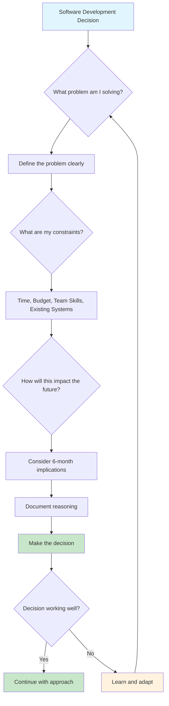
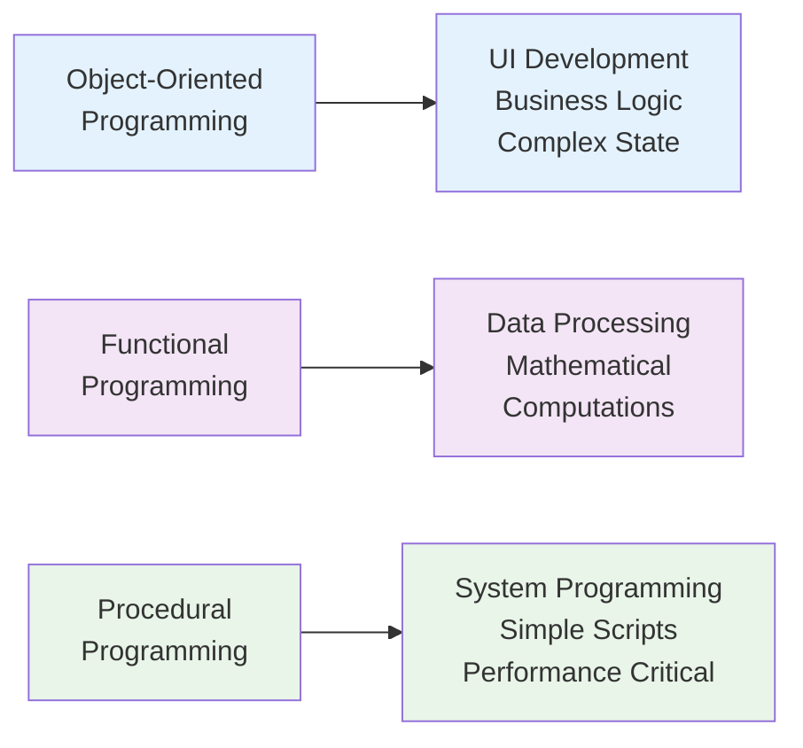
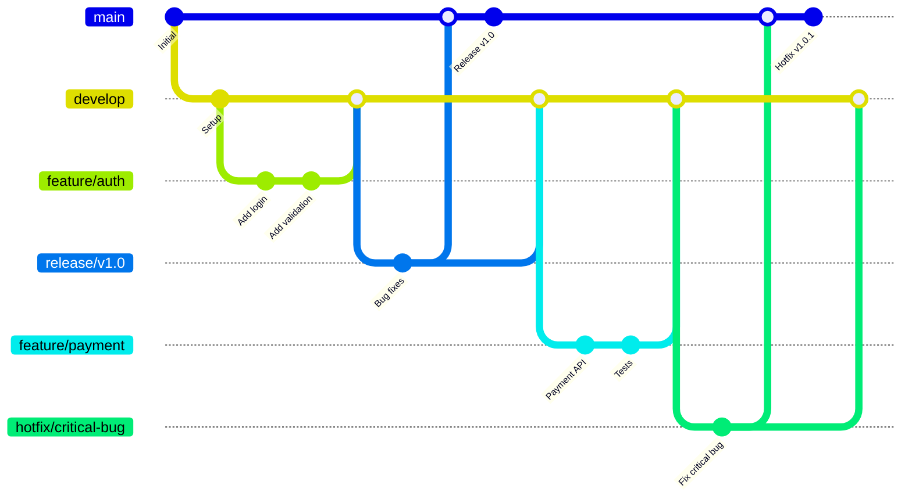
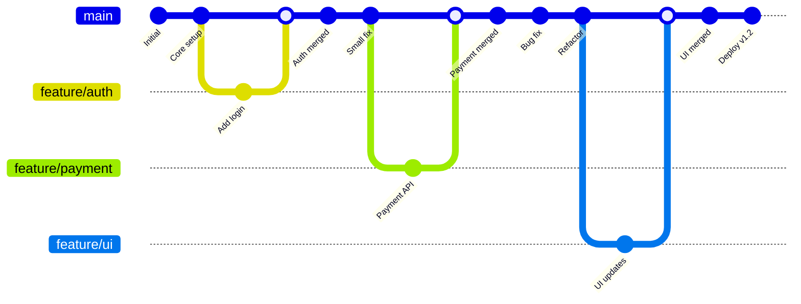
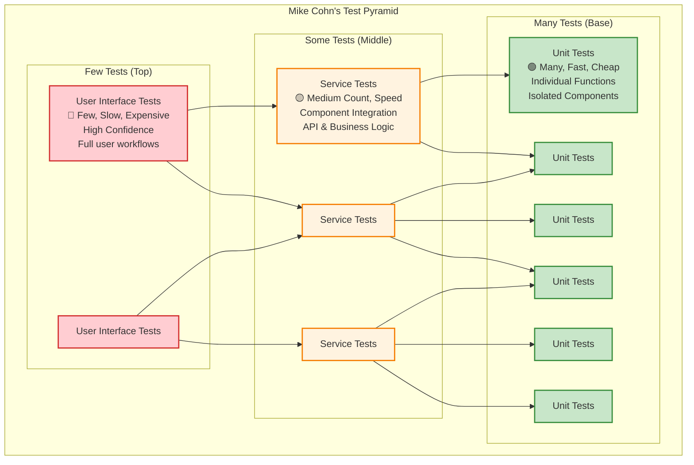
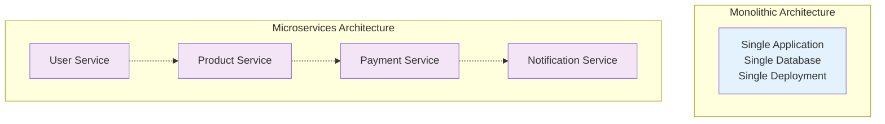
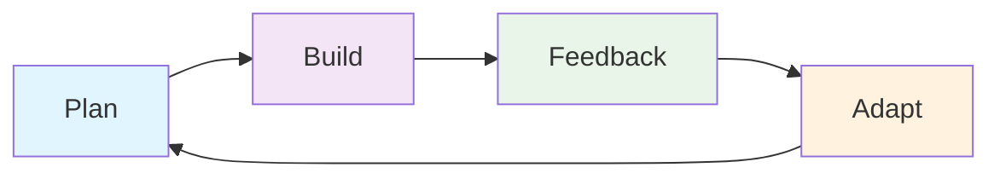
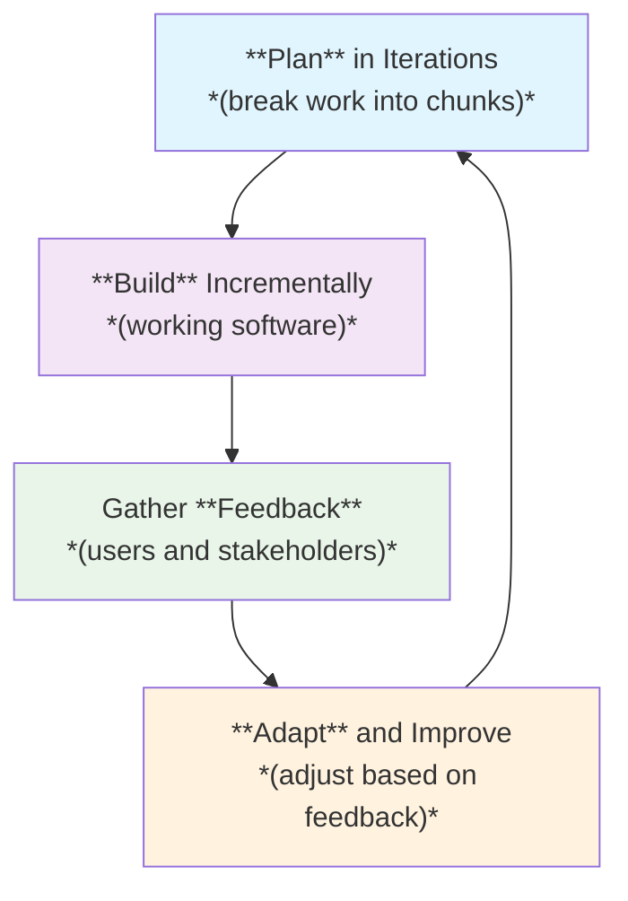
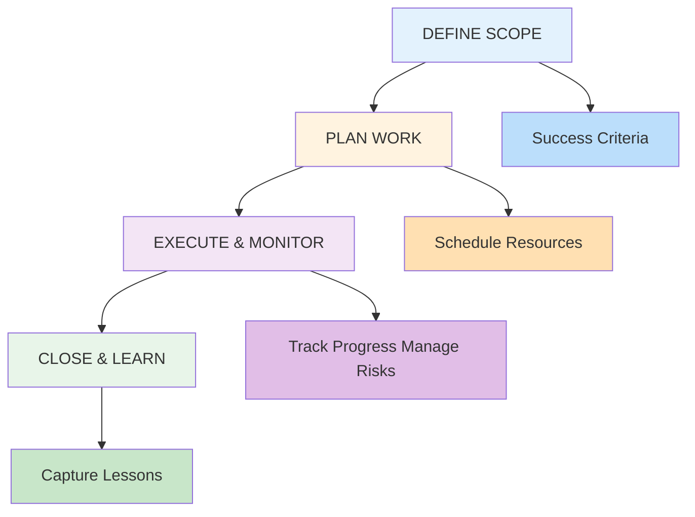
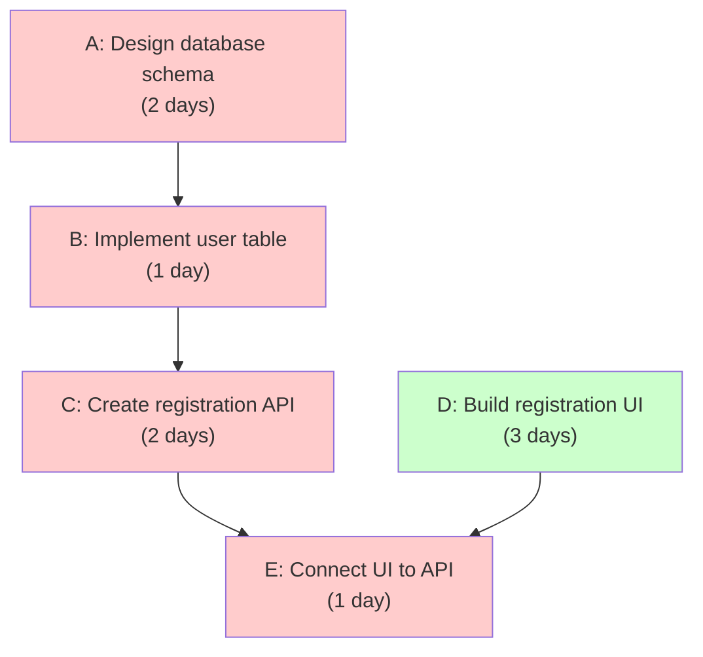

# Domain Knowledge Reference

Auto-generated from blog posts. Do not edit manually.
Last updated: 2026-03-03

---

## Source: fundamentals-of-software-development

URL: https://jeffbailey.us/blog/2025/10/02/fundamentals-of-software-development

### Introduction

What is **software development**? It's not just writing code and following tutorials. Software development is fundamentally about **making decisions**, **solving problems**, and building systems that work reliably. These fundamentals align with my [software development philosophy](https://jeffbailey.us/a-software-development-philosophy/) that guides how I approach building software.

*Developers face thousands of **micro-decisions**:* 

Should I use this library or that one? How do I structure this code? What happens when this fails? These decisions compound into the software that governs our world, from the apps on your phone to the systems that process your bank transactions.

As Simon Wardley puts it, "**Software engineering is a decision-making discipline**." The best developers aren't just skilled at writing code; they're also adept at making the **right decisions** at the **right time**. This aligns with my philosophy of [making decisions at the right moment](https://jeffbailey.us/a-software-development-philosophy#measure-then-commit/) rather than rushing into solutions.

### Section 1: The Decision-Making Foundation

Software development is fundamentally about **making decisions** in uncertain situations. Every line of code represents a **choice**, and those choices have **consequences**.

#### Understanding the Decision Landscape

* **Technical Decisions**: Which programming language, framework, or architecture to use?
* **Business Decisions**: What features to build, what problems to solve.
* **User Decisions**: How users will interact with your software.
* **Maintenance Decisions**: Keeping the system running and evolving.

The key insight from experienced developers is that there are **no perfect solutions**, only **better ones** given the context. A solution option that's right for a startup might be wrong for an enterprise, and vice versa. For more on this philosophy, see [A Software Development Philosophy](/a-software-development-philosophy/#no-perfect-solutions).


> Type: **Explanation** (understanding-oriented).  
> Primary audience: **all levels** - developers learning software development principles and decision-making

#### The Context-Driven Approach

* **Understand the problem first**: What problem are you trying to solve?
* **Consider the constraints**: Time, budget, team skills, and existing systems.
* **Think about the future**: How will this decision impact you in six months?
* **Document your reasoning**: Why did you choose this approach?



### Section 2: Programming Languages and Tools

Choosing the **proper programming language** is one of the first major decisions you'll make. But the language itself matters less than **how you use it**. Adhering to fundamental software development principles is more important.

#### Popular Programming Languages

Here are some widely used programming languages today.

*Most can be used in multiple domains, so don't feel limited by these descriptions or languages.*

**💡 Languages are tools** that help you solve problems. *Pick the right tool for the job.* This principle of [using the right tool](https://jeffbailey.us/a-software-development-philosophy#use-the-right-tool/) extends beyond programming languages to frameworks, databases, and development methodologies.

* **Python**: Great for beginners, powerful for data science, web development, and automation.
* **C++**: High-performance applications, game development, and system software.
* **C**: The foundation of most operating systems and embedded systems.
* **Java**: Enterprise-grade applications, backend development, Android apps, and large-scale systems.
* **C#**: Microsoft's language for Windows applications, web development, and game development with Unity.
* **JavaScript**: The language of the web that runs everywhere, from frontend to backend with Node.js.
* **Go**: Fast, simple, great for backend services, microservices, and cloud applications.
* **Perl**: Great for text processing, web development, and system administration.
* **SQL**: The language of databases, used to query and manipulate data.
* **Swift**: Apple's language for iOS development and macOS applications.
* **Kotlin**: Google's preferred language for Android, also excellent for backend development.
* **Rust**: Memory-safe systems programming, web backends, and performance-critical applications.

Review the [TIOBE Index], [IEEE Spectrum], and [RedMonk] for comprehensive lists of programming languages and their popularity.

#### Programming Language Paradigms

Before exploring languages, understanding **programming paradigms** helps you solve problems more effectively, as each offers a unique approach to structuring and solving issues.

**Object-Oriented Programming (OOP):**

Think of OOP as a company where employees (objects) have roles (methods) and responsibilities (data). Employees are aware of their tasks and interact with others.

```python
class BankAccount:
    def __init__(self, balance=0):
        self.balance = balance
    
    def deposit(self, amount):
        if amount > 0:
            self.balance += amount
            return True
        return False
    
    def withdraw(self, amount):
        if amount > 0 and amount <= self.balance:
            self.balance -= amount
            return True
        return False
```

**Functional Programming:**

Functional programming treats computation as evaluating mathematical functions, emphasizing immutability and avoiding side effects to make programs more predictable and testable.

```javascript
// Pure function - same input always produces the same output
const addTax = (price, taxRate) => price * (1 + taxRate);

// Higher-order function - takes or returns functions
const calculateTotal = (items, taxRate) => 
    items.map(item => addTax(item.price, taxRate))
         .reduce((sum, price) => sum + price, 0);
```

**Procedural Programming:**

This is the most straightforward approach: writing procedures (functions) that perform step-by-step data operations.

```c
#include <stdio.h>

int calculateArea(int length, int width) {
    return length * width;
}

int main() {
    int roomLength = 10;
    int roomWidth = 12;
    int area = calculateArea(roomLength, roomWidth);
    printf("Room area: %d square feet\n", area);
    return 0;
}
```

**When to Use Each Paradigm:**

* **OOP**: Great for modeling entities, building UIs, and managing complex states.
* **Functional**: Ideal for data processing, computations, and concurrency.
* **Procedural**: Ideal for simple scripts, system programming, and performance-critical tasks.



#### The Language Selection Framework

*When choosing a language, consider:*

* **Project requirements**: What does the system need to do?
* **Team expertise**: What does your team already know?
* **Ecosystem**: What libraries and tools are available?
* **Performance needs**: How fast does it need to be?
* **Maintenance**: How easy is it to find developers?

### Section 3: Version Control Mastery

**Version control** is required in modern software development. It's how teams **collaborate**, **track changes**, and **recover from mistakes**.

#### Git Fundamentals

**Git** is the industry standard for version control. 

*Here are the **essential concepts**:*

**Basic Workflow:**

```bash
# Create a new repository
git init

# Add files to staging
git add .

# Commit changes
git commit -m "Add user authentication"

# Push to remote repository
git push origin main
```

**Branching Strategy:**

Choose between two common approaches:

#### Option 1: Git Flow (Branch-Based Development)

* **Main branch**: Production-ready code.
* **Feature branches**: New features or bug fixes.
* **Release branches**: Preparing for releases.
* **Hotfix branches**: Emergency fixes.

**Pros:**

* Clear separation of concerns.
* Safe for teams new to Git.
* Easy to track feature progress.

**Cons:**

* It's a more complex workflow.
* Longer integration cycles.
* Merge conflicts can accumulate.



#### Option 2: Trunk-Based Development

* **Main branch**: Single integration point for all changes.
* **Short-lived feature branches**: Merge quickly (within hours or days).
* **Feature flags**: Control feature rollout without branches.
* **Mainline Integration**: Teams can commit directly to the main branch without feature branches.

**Pros:**

* Faster integration and feedback.
* It's a simpler workflow.
* Reduces merge conflicts.
* Smaller teams can commit directly to mainline, eliminating branching overhead entirely.

**Cons:**

* Requires disciplined practices.
* It can be risky without proper testing.
* It may overwhelm new team members.



Trunk-based development requires robust CI/CD pipelines and well-disciplined teams.

*For more details on trunk-based development and mainline integration patterns, see [Martin Fowler's comprehensive guide to branching patterns](https://martinfowler.com/articles/branching-patterns.html#Trunk-basedDevelopment).*

#### Best Practices

* **Commit often**: Small, focused commits are easier to understand and review.
* **Write clear commit messages**: Explain what and why; try [Conventional Commits](https://jeffbailey.us/what-are-conventional-commits/).
* **Choose your branching strategy**: Either use branches OR trunk-based development consistently.
* **Review code with focused pull requests**: Small, concentrated pull requests catch bugs, share knowledge, and are easier to review and merge.
* **Keep history clean**: Rebase and squash when appropriate.

#### GitOps: Infrastructure as Code

**GitOps** extends version control principles to **infrastructure and deployment**. Instead of manually configuring servers or clicking through web interfaces, you **store your entire infrastructure** in Git repositories.

**Core GitOps Principles:**

* **Declarative**: Define what you want, not how to get there.
* **Version controlled**: All infrastructure changes are tracked in Git.
* **Automated**: Changes trigger automatic deployments.
* **Observable**: Monitor and audit all infrastructure changes.

**How GitOps Works:**

1. **Infrastructure as Code**: Define servers, databases, and networks in code files.
2. **Git as Single Source of Truth**: Store all configuration in Git repositories.
3. **Automated Synchronization**: Tools like ArgoCD or Flux watch Git for changes.
4. **Continuous Deployment**: Changes automatically deploy to environments.

**Example GitOps Workflow:**

```yaml
# infrastructure.yaml
apiVersion: apps/v1
kind: Deployment
metadata:
  name: web-app
spec:
  replicas: 3
  selector:
    matchLabels:
      app: web-app
  template:
    metadata:
      labels:
        app: web-app
    spec:
      containers:
      - name: web-app
        image: myapp:v1.2.0
        ports:
        - containerPort: 8080
```

**Benefits:**

* **Consistency**: Same infrastructure across development, staging, and production.
* **Auditability**: Complete history of who changed what and when.
* **Rollback capability**: Easy to revert to previous working states.
* **Collaboration**: Teams can review infrastructure changes, like code changes.
* **Compliance**: Meet regulatory requirements with documented, traceable changes.

**GitOps Tools:**

* **ArgoCD**: Kubernetes-native GitOps tool.
* **Flux**: GitOps operator for Kubernetes.
* **Terraform**: Infrastructure as Code for cloud resources.
* **Ansible**: Configuration management and automation.

GitOps transforms infrastructure from **manual, error-prone processes** into **reliable, automated workflows** that teams can trust and scale.

### Section 4: Database Fundamentals

**Databases** are the backbone of most applications, storing and retrieving data efficiently. Understanding database fundamentals is crucial for building reliable software systems.

#### Core Database Concepts

* **Relational Databases**: Store data in tables with predefined relationships using SQL
* **NoSQL Databases**: Handle unstructured data with flexible schemas
* **ACID Properties**: Ensure data integrity through atomicity, consistency, isolation, and durability
* **Indexing**: Speed up data retrieval by creating pointers to data locations
* **Normalization**: Organize data to reduce redundancy and improve integrity

#### Database Types and Use Cases

* **MySQL/PostgreSQL**: Great for web applications and complex queries
* **MongoDB**: Ideal for rapid development and flexible data structures
* **Redis**: Perfect for caching and real-time applications
* **SQLite**: Lightweight option for mobile apps and small projects

#### Essential Database Skills

* **SQL Proficiency**: Write efficient queries and understand query optimization
* **Database Design**: Create normalized schemas that support your application needs
* **Performance Tuning**: Use indexes, connection pooling, and caching strategies
* **Security**: Implement proper authentication, authorization, and data encryption

For a comprehensive guide covering database types, design principles, SQL fundamentals, performance optimization, security, and modern trends, see [Fundamentals of Databases](/blog/2025/09/24/fundamentals-of-databases/).

### Section 5: Software Design Principles

Good **software design** makes code easier to **understand**, **modify**, and **extend**. These **principles** guide you toward better decisions.

#### Programming Paradigm Applicability

Understanding which **programming paradigms** these principles apply to helps you use them effectively:

**Universal Principles (Apply to All Paradigms):**

* **Single Responsibility** - Every function, class, or module should have one reason to change.
* **DRY (Don't Repeat Yourself)** - Every knowledge piece should have a single authoritative representation, avoiding duplication of behavior, rules, and logic. Repeating code isn't always bad.
* **KISS (Keep It Simple, Stupid)** - Prefer simple solutions over complex ones.
* **YAGNI (You Aren't Gonna Need It)** - Don't build features until you actually need them.

**Paradigm-Specific Principles:**

**Object-Oriented Programming (OOP):**

* **SOLID principles** - Designed specifically for OOP and work best with classes, inheritance, and polymorphism.
* **Composition over Inheritance** - Helps avoid deep inheritance hierarchies.
* **Interface Segregation** - Applies when working with abstract classes and interfaces.

**Functional Programming:**

* **Pure Functions** - Functions that don't have side effects and always return the same output for the same input.
* **Immutability** - Data structures that don't change after creation.
* **Higher-Order Functions** - Functions that take other functions as parameters or return functions.

**Procedural Programming:**

* **Modular Design** - Breaking code into logical, reusable modules.
* **Top-Down Design** - Starting with high-level concepts and breaking them down into smaller parts.

**Mixed Paradigms:**

Most modern applications combine paradigms. A web application might use:

* **OOP** for business logic and data modeling.
* **Functional** approaches for data transformation.
* **Procedural** code for utility functions and scripts.

The key is understanding which principles enhance your chosen paradigm and applying them appropriately.

#### SOLID Principles

**Single Responsibility Principle (SRP):**
Each class should have one reason to change. This principle aligns with my philosophy of [single responsibility](https://jeffbailey.us/a-software-development-philosophy#single-responsibility/) in software design, where I isolate software components to reduce complexity.

```python
# Bad: Multiple responsibilities
class User:
    def __init__(self, name, email):
        self.name = name
        self.email = email
    
    def save_to_database(self):
        # Database logic here
        pass
    
    def send_email(self):
        # Email logic here
        pass

# Good: Single responsibility
class User:
    def __init__(self, name, email):
        self.name = name
        self.email = email

class UserRepository:
    def save(self, user):
        # Database logic here
        pass

class EmailService:
    def send(self, user):
        # Email logic here
        pass
```

**Open/Closed Principle (OCP):**
Software should be open for extension but closed for modification.

*Best suited for OOP with inheritance and polymorphism.*

```python
# Good: Open for extension, closed for modification
from abc import ABC, abstractmethod

class PaymentProcessor(ABC):
    @abstractmethod
    def process(self, amount):
        pass

class CreditCardProcessor(PaymentProcessor):
    def process(self, amount):
        return f"Processing ${amount} via credit card"

class PayPalProcessor(PaymentProcessor):
    def process(self, amount):
        return f"Processing ${amount} via PayPal"
```

**Liskov Substitution Principle (LSP):**
Objects should be replaceable with instances of their subtypes.

*Applies specifically to OOP inheritance hierarchies.*

```python
# Bad: Violates LSP
class Bird:
    def fly(self):
        return "Flying"

class Penguin(Bird):
    def fly(self):
        raise Exception("Penguins can't fly!")  # Breaks substitution

# Good: Follows LSP
class Bird:
    def move(self):
        return "Moving"

class FlyingBird(Bird):
    def fly(self):
        return "Flying"

class Penguin(Bird):
    def swim(self):
        return "Swimming"
```

**Interface Segregation Principle (ISP):**
Clients shouldn't depend on interfaces they don't use.

*Primarily applies to OOP with interfaces/abstract classes.*

```python
# Bad: Fat interface
class Worker:
    def work(self): pass
    def eat(self): pass
    def sleep(self): pass

# Good: Segregated interfaces
from abc import ABC, abstractmethod

class Workable(ABC):
    @abstractmethod
    def work(self): pass

class Eatable(ABC):
    @abstractmethod
    def eat(self): pass

class Sleepable(ABC):
    @abstractmethod
    def sleep(self): pass
```

**Dependency Inversion Principle (DIP):**
Depend on abstractions, not concretions.

*Works best in OOP with dependency injection patterns.*

```python
# Bad: Depends on concrete implementation
class EmailService:
    def send(self, message):
        # Direct dependency on SMTP
        smtp_client = SMTPClient()
        smtp_client.send(message)

# Good: Depends on the abstraction
class EmailService:
    def __init__(self, email_client):
        self.email_client = email_client
    
    def send(self, message):
        self.email_client.send(message)
```

#### Concrete Code Examples

**DRY (Don't Repeat Yourself):**

```python
# Bad: Repeated logic
def calculate_tax_retail(price):
    return price * 0.08

def calculate_tax_wholesale(price):
    return price * 0.08  # Same logic repeated

# Good: DRY approach
def calculate_tax(price, rate=0.08):
    return price * rate
```

**KISS (Keep It Simple, Stupid):**

```python
# Bad: Overcomplicated
def is_even(number):
    return True if number % 2 == 0 else False

# Good: Simple
def is_even(number):
    return number % 2 == 0
```

**YAGNI (You Aren't Gonna Need It):**

```python
# Bad: Building for a hypothetical future
class User:
    def __init__(self, name, email, phone, address, social_security):
        # Building for features you don't need yet
        self.name = name
        self.email = email
        self.phone = phone
        self.address = address
        self.social_security = social_security

# Good: Build what you need now
class User:
    def __init__(self, name, email):
        self.name = name
        self.email = email
```

This principle connects to my philosophy of [solutions looking for a problem](https://jeffbailey.us/a-software-development-philosophy#solutions-looking-for-a-problem/) — ask yourself if a feature is valuable before building it.

**Composition over Inheritance:**

```python
# Bad: Deep inheritance
class Animal:
    def eat(self): pass

class Mammal(Animal):
    def breathe(self): pass

class Dog(Mammal):
    def bark(self): pass

# Good: Composition
class EatingBehavior:
    def eat(self): pass

class BreathingBehavior:
    def breathe(self): pass

class BarkingBehavior:
    def bark(self): pass

class Dog:
    def __init__(self):
        self.eating_behavior = EatingBehavior()
        self.breathing_behavior = BreathingBehavior()
        self.sound_behavior = BarkingBehavior()
```

### Section 6: Testing Strategies

**Testing** isn't about finding bugs; it's about **preventing them**. Well-designed tests give you **confidence** to change code without breaking things. As I believe, you should [test for life](https://jeffbailey.us/a-software-development-philosophy#test-for-life/) because testing prevents future pain and helps you sleep at night. Testing builds upon [fundamental software concepts](/blog/2025/10/11/fundamental-software-concepts/) like error handling and defensive programming.

#### Types of Testing

**Unit Testing:**
Test individual functions or methods in isolation.

```python
def test_add_numbers():
    assert add(2, 3) == 5
    assert add(-1, 1) == 0
    assert add(0, 0) == 0

def add(a, b):
    return a + b
```

**Integration Testing:**
Test how different parts work together.

**System Testing:**
Test the complete system as a whole.

**Acceptance Testing:**
Test from the user's perspective.



#### Test-Driven Development (TDD)

**TDD** (Test-Driven Development) flips the traditional approach:

1. **Write a failing test** for the feature you want.
2. **Write the minimum code** to make the test pass.
3. **Refactor** the code while maintaining a green test suite.
4. **Repeat** for the next feature.

**Benefits:**

* Forces you to think about the interface first.
* Ensures your code is testable.
* Creates a safety net for refactoring.
* Documents how your code should work.

### Section 7: Debugging and Problem-Solving

**Debugging** skills separate good developers from great ones. It involves fixing bugs and understanding systems to find their root cause. Effective debugging requires [collecting all the logs in the forest](https://jeffbailey.us/a-software-development-philosophy#all-the-logs-in-the-forest/) because you never know what they might reveal when investigating a problem.

When facing complex debugging challenges, remember that [there are no big problems](https://jeffbailey.us/a-software-development-philosophy#there-are-no-big-problems/) — just a lot of minor problems. Break down what appears to be a big problem into manageable pieces.

#### Systematic Debugging Approach

**1. Reproduce the Problem:**

* Can you make it happen consistently?
* What are the exact reproducible steps?
* What's the expected vs. actual behavior?

**2. Gather Information:**

* Check logs and error messages.
* Use debugging tools and profilers.
* Add logging to understand execution flow.

**3. Form Hypotheses:**

* What could be causing this?
* Test your theories one at a time.
* Don't assume, verify.

**4. Fix and Verify:**

* Make minute changes.
* Test that the fix works.
* Run tests to verify nothing else is broken.

#### Debugging Tools and Techniques

* **Debuggers**: Step through code line by line.
* **Logging**: Add strategic print statements.
* **Profiling**: Find performance bottlenecks.
* **Unit Tests**: Isolate the problem.
* **Peer Code Reviews**: Fresh eyes see different things.

### Section 8: Code Quality and Maintainability

Writing code that works is only half the battle. Writing understandable and modifiable code is the other half. This connects to my philosophy of [driving human value](https://jeffbailey.us/a-software-development-philosophy#drive-human-value/) — prioritizing end-user needs and simplicity over complexity.

#### Code Readability

**Meaningful Names:**

```python
# Bad
def calc(x, y):
    return x * y * 3.14159

# Good
import math

def calculate_circle_area(radius):
    return radius * radius * math.pi
```

This follows my principle of [naming things with purpose](https://jeffbailey.us/a-software-development-philosophy#name-things-with-purpose/) — when naming variables, name them in ways that make them easy to rename and call things exactly what they are.

**Small Functions:**
Functions should do one thing and do it right.

**Comments That Explain Why:**
Code should be self-documenting, but comments should explain the "why" behind complex logic.

#### Code Organization

* **Consistent formatting**: Use linters and formatters.
* **Logical structure**: Group related code together.
* **Clear interfaces**: Make it obvious how to use your code.
* **Error handling**: Plan for potential issues that may arise.

### Section 9: Documentation and Communication

**Code is written once but read many times**. Good **documentation** makes your code accessible to others and your future self. This aligns with my principle of [being empathetic](https://jeffbailey.us/a-software-development-philosophy#be-empathetic/) — writing code anyone can understand by eliminating questions collected through solicited feedback.

#### Types of Documentation

* **Code Comments**: Explain complex logic and business rules.
* **API Documentation**: How to use your functions and classes.
* **Architecture Documentation**: How the system is designed and why.
* **User Documentation**: How end users interact with your software.

#### Writing Effective Documentation

* **Start with the user**: What do they need to know?
* **Use examples**: Show, don't just tell.
* **Keep it current**: Outdated docs are worse than no docs.
* **Make it discoverable**: Place documents where people can easily find them.

### Section 10: Design Patterns

**Design patterns** are reusable solutions to common problems in software design. They're not code you can copy and paste, but rather **templates** for solving recurring design challenges. Understanding patterns helps you communicate effectively with other developers and choose the most appropriate solutions.

Design patterns fall into three main categories:

* **Creational patterns** (Singleton, Factory, Builder) - manage object creation
* **Structural patterns** (Adapter, Decorator, Facade) - handle object composition
* **Behavioral patterns** (Observer, Strategy, Command) - define communication between objects

The key is using patterns appropriately. Don't overuse them, understand the problem first, and keep solutions simple. Design patterns are tools in your toolbox, not rules to follow mindlessly.

For a comprehensive guide to design patterns with detailed examples and best practices, see [Fundamentals of Software Design](/blog/2025/11/05/fundamentals-of-software-design/).

### Section 11: Software Maturity Attributes

**Software maturity** refers to how well your software handles real-world challenges beyond just working correctly. These attributes determine whether your software will succeed in production environments.

#### Reliability

**Reliability** is the ability of software to perform its required functions under stated conditions for a specified period of time.

**Key Aspects:**

* **Fault tolerance**: System continues operating despite component failures.
* **Error handling**: Graceful degradation when things go wrong.
* **Recovery mechanisms**: Ability to restore service after failures.

#### Performance

**Performance** measures how efficiently software uses system resources and responds to user requests.

**Key Metrics:**

* **Response time**: How quickly the system responds to requests.
* **Throughput**: Number of requests processed per unit time.
* **Resource utilization**: CPU, memory, and disk usage.

#### Scalability

**Scalability** is the ability of software to handle increased load by adding resources.

**Types of Scalability:**

* **Horizontal**: Add more servers/machines.
* **Vertical**: Add more power to existing machines.

#### Maintainability

**Maintainability** is the ease with which software can be modified to correct faults, improve performance, or adapt to changing requirements.

**Key Factors:**

* **Code readability**: Clear, self-documenting code.
* **Modularity**: Well-defined interfaces between components.
* **Documentation**: Clear explanations of how and why.
* **Testing**: Comprehensive test coverage.

#### Security

**Security** protects software and data from unauthorized access, modification, or destruction.

**Key Principles:**

* **Authentication**: Verify user identity.
* **Authorization**: Control access to resources.
* **Data encryption**: Protect sensitive information.
* **Input validation**: Prevent injection attacks.

#### Usability

**Usability** measures how easily users can accomplish their goals with the software.

**Key Aspects:**

* **User interface design**: Intuitive and responsive interfaces.
* **Error messages**: Clear, helpful feedback.
* **Documentation**: Easy-to-follow instructions.
* **Accessibility**: Usable by people with disabilities.

#### Measuring Maturity

**Maturity Assessment:**

* **Code reviews**: Regular peer review of code quality.
* **Testing coverage**: Percentage of code covered by tests.
* **Performance monitoring**: Track response times and resource usage.
* **User feedback**: Collect and analyze user experience data.
* **Security audits**: Regular security assessments.

These maturity attributes work together to create software that not only works but thrives in real-world conditions. Focus on improving one attribute at a time, and remember that perfect software doesn't exist, but better software does.

### Section 12: System Design Fundamentals

**System design** is about building software that can handle real-world demands. It's not about writing perfect code; it's about creating systems that work when thousands of users hit your application simultaneously.

#### Scalability Principles

**Horizontal vs. Vertical Scaling:**

* **Vertical Scaling**: Add more power to your existing server (more CPU, RAM).
* **Horizontal Scaling**: Add more servers to handle the load.

Vertical scaling hits limits quickly. Horizontal scaling is where the real power lies.

**Load Balancing:**

Think of a load balancer like a traffic director at a busy intersection. It routes incoming requests to the server that can handle them best.

```nginx
# Simple load balancer configuration
upstream backend {
    server app1.example.com:3000;
    server app2.example.com:3000;
    server app3.example.com:3000;
}

server {
    listen 80;
    location / {
        proxy_pass http://backend;
    }
}
```

#### Reliability Patterns

**Redundancy:**

Never rely on a single point of failure. If your database goes down, your entire application will also go down—design for failure.

**Circuit Breaker Pattern:**

When a service is failing, stop calling it immediately instead of waiting for timeouts to occur.

```python
import time

class CircuitBreaker:
    def __init__(self, failure_threshold=5, timeout=60):
        self.failure_threshold = failure_threshold
        self.timeout = timeout
        self.failure_count = 0
        self.last_failure_time = None
        self.state = 'CLOSED'  # CLOSED, OPEN, HALF_OPEN
    
    def call(self, func, *args, **kwargs):
        if self.state == 'OPEN':
            if time.time() - self.last_failure_time > self.timeout:
                self.state = 'HALF_OPEN'
            else:
                raise Exception("Circuit breaker is OPEN")
        
        try:
            result = func(*args, **kwargs)
            self.on_success()
            return result
        except Exception as e:
            self.on_failure()
            raise e
    
    def on_success(self):
        self.failure_count = 0
        self.state = 'CLOSED'
    
    def on_failure(self):
        self.failure_count += 1
        self.last_failure_time = time.time()
        if self.failure_count >= self.failure_threshold:
            self.state = 'OPEN'
```

#### Data Storage Strategies

**Database Sharding:**

Split your data across multiple databases based on a key (like user ID).

```python
def get_shard_for_user(user_id):
    return f"shard_{user_id % 4}"  # 4 shards

def get_user_data(user_id):
    shard = get_shard_for_user(user_id)
    return database_connections[shard].query(
        "SELECT * FROM users WHERE id = %s", (user_id,)
    )
```

**Caching Strategies:**

* **Write-through**: Write to cache and database simultaneously.
* **Write-behind**: Write to cache first, then batch write to the database.
* **Cache-aside**: Application manages cache manually.

```python
import redis
import json

redis_client = redis.Redis(host='localhost', port=6379, db=0)

def get_user_cached(user_id):
    # Try cache first
    cached_user = redis_client.get(f"user:{user_id}")
    if cached_user:
        return json.loads(cached_user)
    
    # Cache miss - get from database
    user = database.query("SELECT * FROM users WHERE id = %s", (user_id,))
    
    # Store in cache for next time (3600 seconds = 1 hour)
    redis_client.setex(f"user:{user_id}", 3600, json.dumps(user))
    return user
```

#### Performance Optimization

**Database Query Optimization:**

* **Indexes**: Speed up lookups but slow down writes.
* **Query optimization**: Use EXPLAIN to understand query execution.
* **Connection pooling**: Reuse database connections.

**CDN (Content Delivery Network):**

Serve static content from servers closer to your users.

```html
<!-- Instead of serving images from your server -->


<!-- Serve from CDN -->

```

### Section 13: Software Architecture Patterns

**Architecture** is the blueprint for how your software components interact with each other. It's not about choosing the "best" architecture; it's about selecting the right one for your specific context. Remember that [there's always a design](https://jeffbailey.us/a-software-development-philosophy#theres-always-a-design/) — an unplanned design is terrible, but it's still a design. For advanced architectural patterns and distributed systems, see [fundamentals of distributed systems](/blog/2025/10/11/fundamentals-of-distributed-systems/).

#### Monolithic Architecture

A **monolith** is like a single building that contains everything. All your code lives in one application, one database, and one deployment.

**When Monoliths Work:**

* **Small teams**: Easier to coordinate changes across the entire system.
* **Simple applications**: No need for complex service boundaries.
* **Rapid prototyping**: Get to market faster with less complexity.

```bash
# Simple monolithic structure
app/
├── models/
│   ├── user.py
│   └── product.py
├── views/
│   ├── auth.py
│   └── products.py
├── services/
│   ├── email.py
│   └── payment.py
└── main.py
```

**Monolith Challenges:**

* **Scaling**: Can't scale individual components independently.
* **Technology lock-in**: Hard to use different languages or frameworks for different parts.
* **Team coordination**: Multiple teams working on the same codebase create conflicts.

#### Microservices Architecture

**Microservices** break your application into small, independent services. Each service owns its data and can be developed, deployed, and scaled independently.

**Microservices Benefits:**

* **Independent scaling**: Scale only the services that need it.
* **Technology diversity**: Use Python for ML, Go for APIs, JavaScript for frontend.
* **Team autonomy**: Teams can work independently on their services.

```python
# User Service
class UserService:
    def create_user(self, user_data):
        # Handle user creation
        return {"id": 1, "name": user_data.get("name"), "email": user_data.get("email")}
    
    def get_user(self, user_id):
        # Return user data
        return {"id": user_id, "name": "John Doe", "email": "john@example.com"}

# Product Service  
class ProductService:
    def create_product(self, product_data):
        # Handle product creation
        return {"id": 1, "name": product_data.get("name"), "price": product_data.get("price")}
    
    def get_product(self, product_id):
        # Return product data
        return {"id": product_id, "name": "Sample Product", "price": 99.99}

# API Gateway routes requests to appropriate services
@app.route('/users/<user_id>')
def get_user(user_id):
    return user_service.get_user(user_id)

@app.route('/products/<product_id>')
def get_product(product_id):
    return product_service.get_product(product_id)
```

**Microservices Challenges:**

* **Complexity**: More moving parts to manage and monitor.
* **Network latency**: Services communicate over the network.
* **Data consistency**: Harder to maintain consistency across services.

#### Architectural Patterns

**Layered Architecture:**

Organize code into layers with clear responsibilities.

```python
# Presentation Layer
class UserController:
    def __init__(self, user_service):
        self.user_service = user_service
    
    def create_user(self, request):
        user_data = request.get_json()
        return self.user_service.create_user(user_data)

# Business Logic Layer
class UserService:
    def __init__(self, user_repository):
        self.user_repository = user_repository
    
    def create_user(self, user_data):
        # Business logic here
        user = User(user_data.get('name'), user_data.get('email'))
        return self.user_repository.save(user)

# Data Access Layer
class UserRepository:
    def save(self, user):
        # Database operations
        pass
```

**Event-Driven Architecture:**

Services communicate through events instead of direct calls.

```python
import json

# Event Publisher
class EventPublisher:
    def publish_user_created(self, user):
        event = {
            'type': 'user.created',
            'data': {
                'user_id': user.id,
                'email': user.email
            }
        }
        # Send to message queue
        message_queue.publish('user.events', json.dumps(event))

# Event Handler
class EmailService:
    def handle_user_created(self, event):
        event_data = json.loads(event) if isinstance(event, str) else event
        if event_data['type'] == 'user.created':
            self.send_welcome_email(event_data['data']['email'])

# User Service publishes events
class UserService:
    def __init__(self, event_publisher):
        self.event_publisher = event_publisher
    
    def create_user(self, user_data):
        user = User(user_data.get('name'), user_data.get('email'))
        # Save user
        self.event_publisher.publish_user_created(user)
        return user
```

#### Choosing Your Architecture

**Start Simple:**

* **Begin with a monolith** for most applications.
* **Extract services** when you have clear boundaries and team separation.
* **Don't over-engineer** from the start.

This approach follows my principle of [investing lightly](https://jeffbailey.us/a-software-development-philosophy#invest-lightly/) — limiting keystrokes and producing thoughtful, low-maintenance software architectures.



**Signs You Need Microservices:**

* **Different scaling requirements**: Some parts need more resources than others.
* **Team boundaries**: Clear ownership of different business domains.
* **Technology requirements**: Different parts need different tech stacks.

**Signs You Should Stay Monolithic:**

* **Small team**: Easier to coordinate changes in one codebase.
* **Simple domain**: No clear service boundaries.
* **Rapid iteration**: Need to move fast without architectural overhead.

### Section 14: Modern Development Practices

The software development landscape is **constantly evolving**.

*Here are the **trends** shaping how we build software today.*

#### Cloud-Native Development

* **Microservices**: Break large applications into small, independent services.
* **Containers**: Package applications with their dependencies.
* **Serverless**: Run code without managing servers.
* **Infrastructure as Code**: Define infrastructure with code.

#### AI-Assisted Development

* **Code Generation**: AI tools that write code from prompts and specifications.
* **Code Review**: Automated suggestions for improvements.
* **Testing**: AI-generated test cases.
* **Documentation**: Auto-generated documentation from code.

#### Security-First Development

* **Secure by Design**: Build security in from the start.
* **Dependency Management**: Keep third-party libraries up to date.
* **Code Scanning**: Automated security vulnerability detection.
* **Threat Modeling**: Think about potential attacks.

### Section 15: The Learning Mindset

Software development is a field where you **never stop learning**. The technologies change, the problems evolve, and the solutions get better.

#### Continuous Learning Strategies

* **Build projects**: Apply what you learn in real projects.
* **Read code**: Study well-written open source projects.
* **Write about it**: Teaching others solidifies your understanding.
* **Join communities**: Learn from other developers.
* **Experiment**: Try new technologies and approaches.

#### Common Learning Pitfalls

* **Tutorial Hell**: Following tutorials without building anything.
* **Shiny Object Syndrome**: Jumping between technologies too quickly.
* **Imposter Syndrome**: Feeling like you don't belong.
* **Analysis Paralysis**: Overthinking instead of building.

### Section 16: Building Your Development Career

Software development offers excellent career opportunities, despite the rise of AI, but success requires more than just technical skills.

#### Essential Non-Technical Skills

* **Communication**: Explain technical concepts to non-technical people.
* **Collaboration**: Work effectively in teams.
* **Problem-Solving**: Break down complex problems.
* **Time Management**: Balance multiple priorities.
* **Continuous Learning**: Stay current with technology trends and [learn effectively](https://jeffbailey.us/learning-earning-and-growing/ "Learning, Earning, and Growing").

#### Career Growth Paths

* **Individual Contributor (IC)** – Progression often moves from **senior developer** to **technical lead** or **architect**, then into advanced roles such as **principal engineer** or **distinguished engineer/architect**.
* **Management**: Engineering manager, director, CTO.
* **Specialization**: Security, performance, mobile, AI/ML. Consider whether you want to be a [full-stack developer or specialized software developer](https://jeffbailey.us/full-stack-developer-vs-specialized-software-developer/ "Full Stack Developer VS Specialized Software Developer").
* **Entrepreneurship**: Start your own company and develop a new product or service.

#### Finding Your Next Job

 It will be challenging to master the fundamentals of software development if you can't find a job, so it's essential to learn this skill quickly.

**Key Strategies:**

* **Optimize your resume for ATS systems** - Most resumes get filtered out before a human ever sees them. Learn how to [optimize your resume to get past ATS and land interviews](https://jeffbailey.us/how-do-i-optimize-my-resume/ "How Do I Optimize My Resume to Get Past ATS and Land Interviews?").
* **Build a strong online presence** by maintaining an active GitHub profile, contributing to open-source projects, and showcasing your work.
* **Network strategically** by attending meetups, conferences, and joining online communities. Many opportunities come through referrals.
* **Practice technical interviews** by using coding challenges to prepare for them. <!-- Draft-only link removed: learn-java-coding-challenges -->
* **Research companies thoroughly** - Understand their tech stack, culture, and recent developments before applying.

#### Salary and Compensation

Understanding your worth and [negotiating your salary](https://jeffbailey.us/salary-negotiation-for-programmers/ "Salary Negotiation Guide for Software Developers") is crucial for career success. Research market rates, understand your value, and approach negotiations with confidence.

### Conclusion

💡 *Software development is fundamentally about making good decisions under uncertainty. Technical skills matter, but thinking skills matter more.*

Mastering software development fundamentals isn't about **memorizing syntax** or **following tutorials** but about developing **judgment**, **discipline**, and **curiosity** to make informed decisions, write maintainable code, and continually learning.

The best developers I know aren't the ones who know the most languages or frameworks. They're the ones who can take a **complex problem**, **break it down** into manageable pieces, and **build a solution** that works in the real world.

### Call to Action

Ready to become a **rock star developer** and master the fundamentals of software development? Start by picking **one fundamental skill** and focusing on it for the next month. Whether it's writing better tests, improving your debugging skills, or learning a new programming language, **consistent practice** consistently beats sporadic learning. Consider contributing to [open source projects](/blog/2025/03/06/fundamentals-of-open-source/) to see these fundamentals applied in real-world codebases.

Here are some resources to help you get started:

* **Practice Platforms**: [Exercism], [LeetCode], [HackerRank], [Codewars]
* **Learning Resources**: [freeCodeCamp], [The Odin Project], [MDN Web Docs]
* **Community**: [Stack Overflow], [GitHub], [Dev.to]
* **Books**: [Clean Code], [The Pragmatic Programmer], [Design Patterns]

### Related Articles

*Related fundamentals articles:*

**Software Engineering:** [Fundamentals of Software Design](/blog/2025/11/05/fundamentals-of-software-design/) teaches you how to design maintainable code that's easier to test and modify. [Fundamentals of Software Architecture](/blog/2025/10/19/fundamentals-of-software-architecture/) helps you understand how to structure larger systems and make architectural decisions. [Fundamentals of Software Testing](/blog/2025/11/30/fundamentals-of-software-testing/) shows how to verify your code works correctly and catch bugs early.

**Engineering Practices:** [Fundamentals of Backend Engineering](/blog/2025/10/14/fundamentals-of-backend-engineering/) shows how to build server-side systems and APIs. [Fundamentals of Frontend Engineering](/blog/2025/11/26/fundamentals-of-frontend-engineering/) teaches you how to build user interfaces and client-side applications.

**Product Development:** [Fundamentals of Software Product Development](/blog/2025/11/28/fundamentals-of-software-product-development/) shows how software development fits into building products that solve user problems.

**Communication:** [Fundamentals of Technical Writing](/blog/2025/10/12/fundamentals-of-technical-writing/) helps you write code comments, documentation, and user-facing text that serves your users.

**Collaboration:** [Fundamentals of Open Source](/blog/2025/03/06/fundamentals-of-open-source/) shows how to contribute to and maintain open source projects, which is excellent practice for software development skills.

## Glossary

## References

* [Software Engineering as Decision Making - Simon Wardley]
* [Computer Science Principles Cheat Code - Kaivalya Apte]
* [Dear Software Engineers - Rajya Vardhan]
* [Clean Code: A Handbook of Agile Software Craftsmanship]
* [The Pragmatic Programmer: Your Journey to Mastery]
* [Design Patterns: Elements of Reusable Object-Oriented Software]
* [Test-Driven Development: By Example]
* [Refactoring: Improving the Design of Existing Code]
* [The Practical Test Pyramid]

[Software Engineering as Decision Making - Simon Wardley]: https://www.linkedin.com/posts/simonwardley_software-engineering-is-a-decision-making-activity-7343644580237520897-RNR3
[Computer Science Principles Cheat Code - Kaivalya Apte]: https://www.linkedin.com/posts/kaivalyaapte_computer-science-principles-cheat-code-activity-7345076805046812673-x5oy
[Dear Software Engineers - Rajya Vardhan]: https://www.linkedin.com/posts/rajya-vardhan_dear-software-engineers-youll-definitely-activity-7365233240497901568-wWJw
[Clean Code: A Handbook of Agile Software Craftsmanship]: https://www.amazon.com/Clean-Code-Handbook-Software-Craftsmanship/dp/0132350882
[The Pragmatic Programmer: Your Journey to Mastery]: https://www.amazon.com/Pragmatic-Programmer-journey-mastery-Anniversary/dp/0135957052
[Design Patterns: Elements of Reusable Object-Oriented Software]: https://www.amazon.com/Design-Patterns-Elements-Reusable-Object-Oriented/dp/0201633612
[Test-Driven Development: By Example]: https://www.amazon.com/Test-Driven-Development-Kent-Beck/dp/0321146530
[Refactoring: Improving the Design of Existing Code]: https://www.amazon.com/Refactoring-Improving-Design-Existing-Code/dp/0134757599
[Exercism]: https://exercism.org/
[LeetCode]: https://leetcode.com/
[HackerRank]: https://www.hackerrank.com/
[Codewars]: https://www.codewars.com/
[freeCodeCamp]: https://www.freecodecamp.org/
[The Odin Project]: https://www.theodinproject.com/
[MDN Web Docs]: https://developer.mozilla.org/
[Stack Overflow]: https://stackoverflow.com/
[GitHub]: https://github.com/
[Dev.to]: https://dev.to/
[Clean Code]: https://www.amazon.com/Clean-Code-Handbook-Software-Craftsmanship/dp/0132350882
[The Pragmatic Programmer]: /blog/2020/12/19/a-pragmatic-programmer-book-review/
[Design Patterns]: https://www.amazon.com/Design-Patterns-Elements-Reusable-Object-Oriented/dp/0201633612?crid=I2WLJSESCTK5&dib=eyJ2IjoiMSJ9.mTRaTOPYqsPcUsGD8azntQP7U0dev0vjzfyX1Yj7tw96sCGzC0GNJUnUlAi3XLo9EquTACXHPDD2Y-f0Hk9cWSs1LY7uOw-HaH4a1-4W2sRH8KKqTiEBLYar8uuOfHk0LA4JVMsVKWbk8QYQ7kmuLzTnJOJByBD7L2QSfQcqi2rk70ye1y2G9RBzOwBXbkmYLcQ35TGX5mWR8EKgNKRZS065Si1h5HVFNLQ7VPyukWA.YTnAtfyssdrGT0GNf6LKUXAYniWrltmM3B2r_o0oGBI&dib_tag=se&keywords=design+patterns&qid=1759374790&sprefix=design+patterns%2Caps%2C180&sr=8-3
[TIOBE Index]: https://www.tiobe.com/tiobe-index/
[IEEE Spectrum]: https://spectrum.ieee.org/top-programming-languages-2025
[RedMonk]: https://redmonk.com/sogrady/2025/06/18/language-rankings-1-25
[The Practical Test Pyramid]: https://martinfowler.com/articles/practical-test-pyramid.html


---

## Source: fundamentals-of-agile-software-development

URL: https://jeffbailey.us/blog/2025/12/23/fundamentals-of-agile-software-development

## Introduction

Why do some teams deliver working software consistently while others struggle with late projects and missed requirements? The difference lies in understanding the fundamentals of agile software development.

Agile development emphasizes iterative work, collaboration, and adapting to change, creating a feedback loop: deliver small, learn, then adjust to avoid investing in the wrong thing.

Most developers know about agile, but many teams hold meetings without gaining benefits. This article covers fundamentals—the key components and trade-offs of adoption.

**Scope:** This article explains why agile works, the feedback loop behind it, and the trade-offs of adopting it. It is not a checklist or an adoption guide.

**Why agile software development fundamentals matter:**

* **Deliver value faster**: Ship in small increments instead of waiting for one big release.
* **Respond to change**: Adapt to changing requirements in real projects.
* **Reduce coordination failures**: Identify misunderstandings earlier to fix them at a lower cost.
* **Protect quality**: Catch problems earlier through tight feedback and integration.

Mastering agile fundamentals shifts you from following processes to understanding why they work.

This article uses a simple mental model you can reuse:



1. **Plan**: Choose a small slice of value you can finish.
2. **Build**: Produce working software, not partial work.
3. **Feedback**: Put the result in front of reality (users, stakeholders, production).
4. **Adapt**: Update priorities and design based on what you learned.

> Type: **Explanation** (understanding-oriented).  
> Primary audience: **all levels** - developers and team leads learning agile principles and practices

### Prerequisites & Audience

**Prerequisites:** You should be familiar with basic software development concepts and working on a team. Familiarity with [software development fundamentals](/blog/2025/10/02/fundamentals-of-software-development/) helps but isn't required. No prior agile experience is needed.

**Primary audience:** Beginner to intermediate developers, including team leads and project managers, seeking a stronger foundation in agile software development.

**Jump to:** [What is Agile?](#section-1-what-is-agile-software-development) • [The Agile Manifesto](#section-2-the-agile-manifesto) • [Iterative Development](#section-3-iterative-development) • [Collaboration](#section-4-collaboration-and-communication) • [Responding to Change](#section-5-responding-to-change) • [Common Frameworks](#section-6-common-agile-frameworks) • [Case Study](#section-7-case-study) • [Common Mistakes](#section-8-common-agile-mistakes) • [Misconceptions](#section-9-misconceptions-and-when-not-to-use) • [Building Teams](#section-10-building-agile-teams) • [Modern Delivery](#section-11-where-agile-meets-modern-delivery) • [Limitations](#section-12-limitations) • [Glossary](#glossary)

**Beginner Path:** If you're brand new to agile, read Sections 1–3 and the Case Study (Section 7), then jump to Common Mistakes (Section 8). Come back later for frameworks, collaboration, and advanced topics.

**Escape routes:** If you need a refresher on iterative development and collaboration, read Sections 3 and 4, then skip to Section 8: Common Agile Mistakes.

### TL;DR - Agile Software Development Fundamentals in One Pass

The core workflow: **Plan → Build → Feedback → Adapt**. Remember this as the **PBFA cycle**:

* **P (Plan):** Break work into small iterations that deliver value.
* **B (Build):** Create working software incrementally, not all at once.
* **F (Feedback):** Gather input from users and stakeholders continuously.
* **A (Adapt):** Use feedback to adjust plans and improve processes.



### Learning Outcomes

By the end of this article, you will be able to:

* Explain **why** agile uses short iterations over long releases and when iterative development suits your project.
* Explain **why** continuous feedback is vital and how it helps shape software to meet real user needs.
* Explain **why** the four Agile Manifesto values work together and when to prioritize flexibility over rigid plans.
* Explain **why** collaboration practices reduce failures and when face-to-face communication adds the most value.
* Explain **how** responding to change impacts project results and when to accept or defer change requests.
* Explain **how** popular agile frameworks work and when to use Scrum, Kanban, or XP.

## Section 1: What is Agile Software Development?

Agile software development emphasizes delivering functional software quickly in short cycles, collaborating with stakeholders, and adapting to change.

Think of agile development as building a house room by room: finish the kitchen first, move in, gather feedback, then design bedrooms based on what you've learned. Each room provides value and insights before proceeding. Traditional development, however, constructs the whole house before use.

### The Core Problem Agile Solves

Traditional software development follows a linear process: gather all requirements, design the entire system, build everything, then test and release. This approach assumes requirements won't change and you can predict everything upfront.

Requirements constantly change as users find new needs, priorities shift, and constraints emerge. By the time you build your plan, it may no longer solve the current problem.

Agile embraces change by working in short cycles that let teams quickly adjust direction.

### How Agile Development Works

Agile development works through four core practices:

**Short iterations:** Work occurs in time-boxed periods of one to four weeks, with each iteration delivering functioning software, not just documentation or partial code.

**Continuous feedback:** Teams gather user and stakeholder feedback during development to guide each iteration, not at the end.

**Collaborative planning:** Rather than one person making a detailed plan upfront, the team collaborates regularly and adjusts plans as they learn.

**Incremental delivery:** Software releases in small, valuable increments, each building on the last and gradually adding new capabilities.

These practices work together: short iterations enable continuous feedback, which informs collaborative planning and guides incremental delivery. The cycle repeats, maintaining alignment between the project and needs.

### Why Agile Development Matters

Agile development matters because it aligns with the actual practice of software development. Requirements change, priorities shift, and new info emerges. Teams that can't adapt struggle to deliver value.

Agile boosts team morale by providing quick, visible results, motivating continued effort.

Quality improves with continuous testing and feedback that catches problems early, when they're cheaper to fix. Small iterations help identify issues and prevent future errors.

### Trade-offs and Limitations

Agile development isn't perfect; it needs discipline and commitment. Teams must resist skipping feedback or extending iterations near deadlines to prevent chaos.

Agile is ideal for requirements that are uncertain or changing. Traditional methods might suit fixed, well-understood projects.

Agile requires active stakeholder participation; without regular feedback, it loses its primary advantage. Some organizations struggle with this cultural shift.

### When Agile Isn't the Right Choice

Agile isn't always best. Projects with fixed requirements, strict regulations, or limited stakeholder participation tend to prefer traditional methods.

Understanding your context is key. Agile principles still apply, but may be implemented differently or combined with other approaches.

### Quick Check: What is Agile Software Development?

Before moving on, test your understanding:

* Can you explain why short iterations are more valuable than long release cycles?
* How does continuous feedback influence software development outcomes?
* Can you identify when agile isn't suitable for a project?

**Answer guidance:** **Ideal result:** Explain that short iterations enable faster learning and course correction. Continuous feedback keeps the team aligned with real needs. Agile is most effective when requirements are uncertain or continuously changing.

If these concepts are unclear, reread the feedback loop section and the section on how iterations enable adjustments.

## Section 2: The Agile Manifesto

The [Agile Manifesto][agile-manifesto] is a set of values and principles guiding agile software development, helping decision-making when frameworks and practices conflict.

### The Four Values

The Agile Manifesto states four values:

**Individuals and interactions over processes and tools:** People matter more than processes. Great teams with simple processes outperform mediocre teams with complex processes.

**Working software over comprehensive documentation:** Software that works is more valuable than perfect documentation. Documentation has value, but it shouldn't block progress.

**Customer collaboration over contract negotiation:** Work with customers to solve problems, don't just follow a contract. Contracts are necessary, but collaboration creates better outcomes.

**Responding to change over following a plan:** Plans are useful, but change is inevitable. Adapting to change creates more value than sticking to outdated plans.

The phrase "over" doesn't mean "instead of." It means "value more highly." You still need processes, documentation, contracts, and plans. Agile just prioritizes the items on the left when you must choose.

### The Twelve Principles

The Agile Manifesto includes twelve principles that expand on these values:

1. **Satisfy customers through early and continuous delivery** of valuable software.
2. **Welcome changing requirements**, even late in development.
3. **Deliver working software frequently**, from a couple of weeks to a couple of months.
4. **Business people and developers must work together** daily throughout the project.
5. **Build projects around motivated individuals** and give them the support they need.
6. **Face-to-face conversation** is the most efficient method of conveying information.
7. **Working software is the primary measure of progress**.
8. **Agile processes promote sustainable development** at a constant pace.
9. **Continuous attention to technical excellence** enhances agility.
10. **Simplicity** is essential.
11. **Self-organizing teams** produce the best architectures, requirements, and designs.
12. **Teams reflect on how to become more effective** and adjust accordingly.

These principles guide decision-making. When choosing between options, ask which better aligns with these principles.

### Why the Manifesto Matters

The Agile Manifesto offers a shared foundation. When teams disagree on practices, they can refer to these values to find common ground.

The manifesto prevents agile from becoming dogmatic, focusing on embodying values and principles rather than specific practices, and on adaptability to your context.

### Common Misunderstandings

Some teams treat the manifesto as a checklist, focusing on words without grasping underlying values, leading to cargo cult agile, where teams perform tasks without benefits.

Other teams ignore the manifesto, calling anything "agile" if it involves short iterations or daily meetings. Without the values and principles, you're not doing agile; you're just doing short waterfall.

The manifesto guides decisions, not judging teams' agile correctness.

### Quick Check: The Agile Manifesto

Before moving on, test your understanding:

* Can you explain the four values in your own words?
* Can you identify which of the twelve principles are most relevant to your work?
* Can you use the manifesto to resolve a disagreement about agile practices?

**Answer guidance:** **Ideal result:** The manifesto values people over processes, working software over documentation, collaboration over contracts, and responding to change over following plans. The principles guide decision-making.

If values or principles seem abstract, review your projects for real examples of these trade-offs.

## Section 3: Iterative Development

Iterative development involves building software in repeated cycles, with each cycle producing working software that improves on the previous version.

Think of iterative development as writing a book: draft, get feedback, revise, repeat. Each iteration improves the book.

### How Iterative Development Works

Iterative development follows a simple pattern:

**Plan the iteration:** Decide what to build this cycle, focusing on the most valuable features to complete within the available time.

**Build the features:** Create usable software, not just prototypes or partials, even if limited.

**Test and integrate:** Verify the software works and integrates properly; fix issues before proceeding.

**Review and adapt:** Show the software to users and stakeholders, gather feedback, and use insights to plan the next iteration.

This cycle repeats, with each iteration building on the last to add new capabilities or improvements.

### Why Iterations Matter

Iterations offer multiple chances to get things right. Building everything at once and being wrong wastes months. Iterations help identify problems early and adapt quickly.

Iterations offer regular wins, keeping teams motivated with frequent progress. Long projects without visible results demoralize teams.

Short iterations force prioritization, requiring selection of what matters most since everything can't be built in two weeks. This improves software by focusing on high-value features.

### Iteration Length

Common iteration lengths range from one to four weeks. Shorter iterations offer faster feedback but need more planning and review. Longer iterations enable bigger features but slow feedback.

Choose iteration length based on your context. Teams new to agile often start with two-week iterations. As they improve, they might shorten to 1 week or extend to 3 or 4 weeks for larger features.

Consistency is key. Regular rhythm enables teams to plan and stakeholders to anticipate updates.

### What Goes Into an Iteration

Each iteration should include:

**User-visible features:** Provide usable software, even if limited. Avoid building infrastructure or internal tools unless they enable user features.

**Testing:** Verify the software with automated, manual, and user acceptance tests.

**Documentation:** Update documentation to include new features, keeping it minimal and accurate.

**Integration:** Ensure new code integrates with existing systems and fix issues early.

Avoid carrying unfinished work. If it isn't done, it doesn't count. This discipline prevents false progress when nothing works.

### Common Iteration Mistakes

Teams make several common mistakes with iterations:

**Extending iterations:** When work isn't finished, teams extend iterations rather than reducing scope, breaking rhythm, and delaying feedback.

**Building partial features:** Teams develop parts of a feature over multiple iterations, with nothing usable until the feature is complete. Each iteration should deliver working software.

**Skipping feedback:** Teams develop features but delay showing them to users; feedback guides iterations.

**Ignoring technical debt:** Teams focus solely on features, amassing technical debt that impedes future progress. Balance feature work with maintenance.

Avoid mistakes by maintaining discipline. Short, consistent iterations with working software and regular feedback deliver agile benefits.

### Quick Check: Iterative Development

Before moving on, test your understanding:

* Why should each iteration produce working software?
* Can you identify suitable work for a single iteration?
* Can you describe common iteration mistakes and how to avoid them?

**Answer guidance:** **Ideal result:** Working software in each iteration opens up feedback. Iterations should be time-boxed and deliver usable features, not partial ones.

If iteration planning is unclear, focus on finishing small, workable increments for user evaluation.

## Section 4: Collaboration and Communication

Agile development stresses collaboration and communication since software is created by people working together. Good processes can't fix poor communication.

Think of collaboration like a band. Musicians play their parts, listen, and adjust as needed, similar to software teams.

### Why Collaboration Matters

Software development relies on collaboration among developers, designers, product managers, users, and stakeholders. Miscommunication leads to rework, missed requirements, and frustration.

Agile creates regular communication through daily standups, iteration planning, and retrospectives.

Collaboration enhances decision quality by allowing team members to share knowledge and perspectives, leading to better choices than individuals working alone.

### Daily Communication Practices

Agile teams use communication patterns not for ceremony but to reduce information lag, enabling the team to steer work before small misunderstandings cause costly rework.

**Daily standups:** A daily sync where the team shares changes, next steps, and blocks. When effective, it's a quick feedback loop for coordination; when not, it becomes a manager's status meeting.

**Pair programming:** Two developers collaborate at one computer; one codes, the other reviews and plans. This spreads knowledge and boosts quality.

**Mob programming:** The team collaborates on one problem to improve understanding and future maintenance.

**Informal communication:** Low-friction questions and quick clarifications keep shared context fresh between meetings.

Different teams choose various mixes, but all agile teams need to maintain shared understanding.

### Cross-Functional Collaboration

Agile teams include people with diverse skills: developers, designers, testers, and product managers. These roles must collaborate effectively.

**Shared understanding:** Everyone should understand the problem, not just their part. Regular discussions build this understanding.

**Early involvement:** Involve all roles from the start. Collaborate throughout instead of designing first, then handing to developers and testers.

**Respect for expertise:** Each role offers valuable expertise: designers on user experience, testers on quality, and product managers on business value.

**Common goals:** Focus on delivering value to users over completing tasks. This shared goal helps resolve conflicts.

### Communication with Stakeholders

Stakeholders include users, business owners, executives, and anyone affected by the software. Agile teams communicate with them regularly.

**Regular demos:** Show working software often, not just at the end, to let stakeholders see progress and give feedback early.

**Transparent planning:** Share plans and progress openly so stakeholders understand what's coming and can adjust expectations.

**Accessible language:** Explain technical decisions clearly to stakeholders, avoiding jargon to prevent misunderstandings.

**Honest communication:** Share problems and challenges, not just successes, so stakeholders understand the situation and can help.

### Remote Collaboration

Many teams work remotely, which requires extra attention to communication:

**Higher-bandwidth communication:** Remote work reduces ambient context, leading teams to use higher-bandwidth conversations like video, which carry more signal than audio alone.

**Shared tools:** Planning, documentation, and code review require shared artifacts accessible to all.

**More explicit coordination:** Teams make decisions and next steps more explicit because what feels obvious in person can be ambiguous remotely.

**Human connection:** Remote work can feel isolating, but teams that intentionally connect collaborate better under stress.

**Time zone awareness:** Respect different time zones when scheduling meetings and responses.

### Common Collaboration Mistakes

Teams make several common mistakes:

**Meetings without purpose:** Standups and planning meetings that don't enhance decisions or coordination are unnecessary overhead.

**Siloed work:** Team members work independently, causing integration issues and knowledge gaps.

**Avoiding conflict:** Teams avoid tough talks, causing issues to fester and later appear as rework or resentment.

**One-way communication:** Managers or leads communicate to the team but don't listen. Communication must flow both ways.

**Assuming understanding:** Teams assume shared context but later realize they were solving different problems.

Collaboration is essential for short iterations and feedback, not just a 'soft skill'.

## Section 5: Responding to Change

Agile development emphasizes responding to change as requirements and priorities evolve, and teams that can't adapt deliver software that doesn't meet current needs.

Think of responding to change as navigating a river. You can't control the current but can adjust your course. Fighting it exhausts you; working with it gets you downstream faster.

### Why Change Happens

Change happens for many reasons:

**Learning:** As you build software, you learn more about the problem and solution, revealing better approaches.

**Market shifts:** Business priorities shift with market, competition, or opportunities. Software must adapt to stay relevant.

**User feedback:** Real users' feedback updates your understanding of their needs. It is valuable, not a problem.

**Technical discoveries:** You might find technical constraints or opportunities that alter implementation approaches.

**Stakeholder evolution:** Stakeholders' understanding and priorities evolve with working software and market conditions.

Change isn't failure; it's a sign of learning and adapting. Teams embracing change deliver better software.

### How Agile Teams Respond to Change

Agile teams respond to change through several practices:

**Short iterations:** Frequent planning cycles let teams quickly adjust direction, avoiding months-long delays.

**Prioritization:** Teams reprioritize work as understanding evolves; what was crucial last month may no longer be so.

**Flexible architecture:** Software is designed to accommodate change, while tightly coupled systems resist it. Loosely coupled systems adapt easily.

**Continuous feedback:** Regular feedback from users and stakeholders catches needed changes early, making them easier to implement.

**Retrospectives:** Teams reflect on what's working and adapt processes accordingly.

These practices work together: short iterations enable reprioritization, flexible architecture supports change, continuous feedback identifies needed changes, and retrospectives enhance the team's responsiveness.

### Change Management

Responding to change doesn't mean accepting every request immediately. Teams need processes for managing change:

**Evaluate impact:** Assess how changes impact work, timeline, and architecture; not all are worthwhile.

**Prioritize changes:** Compare requested changes to current priorities; some are more valuable than planned work.

**Communicate trade-offs:** Explain to stakeholders how changes affect other work to help them make informed decisions.

**Maintain quality:** Don't sacrifice quality for rapid change; skipping testing or cutting corners quickly builds technical debt.

**Document decisions:** Record why you made changes and what you learned. This aids future decision-making.

### When Not to Change

Not every change request should be accepted. Some changes are:

**Low value:** The change lacks enough value to justify the effort or disruption.

**Poorly understood:** The problem isn't clear enough; gather more information.

**Architecturally risky:** The change needs major rework, risking technical debt.

**Out of scope:** The change is outside the project's goals and would distract from more important work.

Teams need to balance flexibility and focus; too much change causes chaos, too little leads to irrelevant software.

### Change and Planning

Some teams think change renders planning pointless, but this misunderstands its purpose.

Planning isn't about perfect prediction but aligning the team around current understanding and priorities. As understanding evolves, plans should too.

Agile planning happens at multiple levels:

**Long-term vision:** High-level goals and direction that stay stable.

**Release planning:** Features and capabilities for upcoming months, updated regularly.

**Iteration planning:** Specific work for the next one to four weeks, detailed and committed.

**Daily planning:** Tasks for today, based on yesterday's progress and today's priorities.

Each level provides value and adapts to change at its own pace. Long-term vision changes slowly, while daily planning changes constantly.

### Common Change Mistakes

Teams make several common mistakes:

**Resisting all change:** Teams view change requests as failures and resist them, leading to software that doesn't meet current needs.

**Accepting all change:** Teams accept every change request immediately, causing chaos and hindering progress.

**No change process:** Teams can't evaluate or prioritize changes, causing ad-hoc decisions and confusion.

**Ignoring technical impact:** Teams change without considering technical risks, accumulating debt.

**Poor communication:** Teams change things without explaining why or the impact, causing confusion and frustration.

Avoid mistakes by establishing clear change management, responding thoughtfully to change.

### Quick Check: Responding to Change

Before moving on, test your understanding:

* Why is change normal and expected in software projects?
* How do agile teams evaluate and prioritize change requests?
* Can you identify when to reject a change request?

**Answer guidance:** **Ideal result:** Change reflects learning and evolving requirements. Teams need processes to evaluate impact, prioritize changes, and maintain quality while staying flexible.

If change management feels overwhelming, focus on the core idea: flexibility with discipline, not chaos.

## Section 6: Common Agile Frameworks

Agile frameworks offer practices and structures for implementing principles. Knowing common frameworks helps in choosing the right one for your context.

### Scrum

Scrum, outlined in the Scrum Guide, is the most widely used agile framework, defining roles, events, and artifacts that organize agile work.

**Roles:**

* **Product Owner:** Defines, prioritizes work, and represents stakeholders.
* **Scrum Master:** Facilitates process, removes blockers, and coaches the team.
* **Development Team:** Builds software, self-organizes to complete work.

**Events:**

* **Sprint:** Time-boxed iteration usually lasts two weeks.
* **Sprint Planning:** Team plans sprint work.
* **Daily Scrum:** Brief daily sync.
* **Sprint Review:** Demo working software to stakeholders.
* **Sprint Retrospective:** Team reflects and improves.

**Artifacts:**

* **Product Backlog:** Prioritized list of work.
* **Sprint Backlog:** Work chosen for this sprint.
* **Increment:** Working software produced during the sprint.

Scrum offers structure without dictating technical practices. Teams decide how to build software, but Scrum guides when and what to develop.

This role separation works because Product Owners decide what to build and why, while Scrum Masters focus on team processes. Development teams self-organize on how to build. This division prevents overwhelm and adds checks and balances.

### Kanban

Kanban visualizes a workflow to spot bottlenecks and boost throughput. Its flexible approach, unlike Scrum, eases incremental adoption.

**Core practices:**

* **Visualize work:** A board makes work visible so bottlenecks don't disappear in people's minds.
* **Limit work in progress:** Restrict items per stage.
* **Manage flow:** Focus on moving work smoothly.
* **Make policies explicit:** Document work stages.
* **Improve collaboratively:** Use data to identify and fix problems.

Kanban suits teams doing continuous, unpredictable work, as it’s flexible, needing no iterations or specific roles.

Kanban enhances flow by visualizing work to reveal bottlenecks and limiting WIP to ensure work is completed before starting new tasks. This reduces multitasking and maintains predictable cycle times.

### Extreme Programming (XP)

Extreme Programming (XP) emphasizes technical practices for agility, often combined with Scrum or used alone.

**Core practices:**

* **Test-Driven Development (TDD):** Tests guide design to testable seams and reveal regressions.
* **Pair Programming:** Two developers work together.
* **Continuous Integration:** Frequent integration reduces merge pain and detects breakage early.
* **Refactoring:** Regular cleanup keeps change cheap as code evolves.
* **Simple Design:** The simplest solution that works reduces overbuilding and shortens feedback cycles.
* **Collective Code Ownership:** Anyone can modify any code.

XP emphasizes technical excellence, allowing teams to respond quickly to change. Without solid practices, agility suffers.

XP's practices foster agility by making change inexpensive. TDD provides safety for refactoring. Continuous integration detects problems in hours, not weeks. Refactoring maintains a flexible codebase. Without these, agile's "responding to change" is costly and risky.

### Lean Software Development

Lean software development applies principles from lean manufacturing to software, focusing on eliminating waste and delivering value efficiently. It is often introduced via [Lean Software Development: An Agile Toolkit][lean-book].

**Core principles:**

* **Eliminate waste:** Remove anything that doesn't add value.
* **Amplify learning:** Build knowledge through short cycles.
* **Decide as late as possible:** Delay decisions until you have enough information.
* **Deliver as fast as possible:** Reduce cycle time to deliver value quickly.
* **Empower the team:** Give teams authority to make decisions.
* **Build integrity in:** Ensure quality from the start.
* **See the whole:** Understand the system as a whole, not just your part.

Lean thinking helps teams focus on what matters and eliminate unnecessary work.

### Choosing a Framework

No framework is perfect for every situation. Consider:

**Team size:** Scrum suits teams of five to nine; Kanban better scales for larger or smaller teams.

**Work predictability:** Scrum suits two-week planning; Kanban handles unpredictable, ongoing work.

**Technical maturity:** XP's technical practices demand discipline. New agile teams can begin with Scrum and gradually incorporate XP practices.

**Organizational culture:** Some organizations resist Scrum roles and ceremonies; Kanban's incremental approach may be easier to adopt.

**Regulatory requirements:** Some contexts need documentation or approval processes outside standard agile frameworks. Adapt frameworks to your constraints.

Many teams combine frameworks, using Scrum for structure and XP for technical excellence, or Kanban for workflow and Scrum events for planning.

The key is understanding your context and choosing helpful practices rather than following a framework dogmatically.

## Section 7: Case Study

A mid-size e-commerce company faced long release cycles and missed deadlines. They adopted agile development to improve delivery.

### The Problem

The company's development process followed a traditional approach:

* Product managers authored detailed requirements documents.
* Developers built features in three to six months.
* QA tested everything at the end.
* Releases happened quarterly, often delayed.

This process caused several problems:

* Features took months to reach users.
* Requirements changed during development, causing rework.
* Testing found major issues late, leading to costly fixes.
* Teams felt disconnected from business goals.

### The Transition

The company began with a pilot team using Scrum, but not with two-week sprints. The change reduced the time between the decision and potential disagreement with reality.

They established a regular cycle of planning, delivering, and learning, ending each with a demo and retrospective. This prompted the team to ask two key questions: *“What did we ship?”* and *“What should we change based on lessons learned?”

### The Results

After three months, the results were clear:

**Faster delivery:** Features were released to users biweekly, not quarterly, with feedback guiding the next sprint.

**Better quality:** Continuous testing caught problems early, reducing bugs in production.

**Improved morale:** Team members quickly saw their work in users' hands, with regular wins keeping momentum.

**Better alignment:** Product Owner collaborated with the team to align features with business needs.

**Adaptation:** When market conditions changed, the team quickly adjusted priorities in the next sprint.

### What Made It Hard (and What It Revealed)

The transition was rough; the problems encountered weren't edge cases, highlighting why agile needs discipline and buy-in.

**Resistance to change:** Some team members preferred the old process, not out of stubbornness but risk management. It felt predictable, even if slow.

**Stakeholder expectations:** Stakeholders expect detailed long-term plans. Agile replaces false certainty with shorter feedback cycles, which can seem like “no plan” until stakeholders observe a few cycles of reliable delivery.

**Technical debt:** Early momentum can lead to rushed work. Agile reveals debt sooner as teams ship more often, making friction apparent.

**Distributed team:** Remote collaboration increased misalignment costs, requiring clearer shared artifacts and more deliberate communication than when the team was co-located.

### Lessons Learned

Key lessons from this case study:

* Start small with one team before scaling.
* Training and coaching mattered because “agile” is a different set of habits, not a new vocabulary.
* Tools helped, but didn't further collaboration or discipline alone.
* Resistance provided insight into perceived system risks.
* Working software was a better progress measure than process metrics.
* The framework needed adaptation; otherwise, it would become a cargo cult.

This case study illustrates agile development in practice. The company didn't achieve perfection but made significant improvements by focusing on fundamentals: short iterations, continuous feedback, and adaptation.

## Section 8: Common Agile Mistakes

Teams new to agile often make predictable mistakes. Recognizing these helps avoid them.

### Mistake 1: Following Practices Without Understanding Principles

Teams follow Scrum ceremonies or Kanban boards without understanding why they work, going through motions without gaining benefits.

**What it looks like:**

* Daily standups that fail to improve coordination.
* Sprint planning lacking shared understanding.
* Retrospectives that lack improvements.

**What changes it:**

* The team needs shared understanding of the Agile Manifesto and principles to ensure practices have a clear "why” behind them.
* Practices should be explainable by the outcomes they enhance, like feedback speed, quality, or alignment, not tradition.
* Working software and feedback are better signals than ceremony attendance.

### Mistake 2: Extending Iterations When Work Isn't Done

Teams extend sprints if they can't finish, breaking rhythm and delaying feedback.

**What it looks like:**

* Sprints frequently overrun their time box.
* Work that often carries over between sprints.
* Planning ignores actual velocity.

**What changes it:**

* The time box stays fixed, scope moves.
* Overcommitment reflects team work estimates, not a reason to extend the iteration.
* “Not done” is a valuable signal. It should enhance planning, not be hidden by extending the calendar.

### Mistake 3: Building Partial Features Across Multiple Iterations

Teams build features across multiple sprints, leaving nothing usable until completing the final one. This defeats iteration benefits.

**What it looks like:**

* Features that span multiple sprints without working software.
* Demos that show incomplete features.
* Users unable to give feedback as nothing works.

**What changes it:**

* Value should be divided into finishable increments; otherwise, “iteration” is an illusion.
* Starting work is easy; finishingarn. Agile depen is where you leds on completing tasks.
* If something can't be finished in a cycle, the slice is wrong, not the calendar.

### Mistake 4: Skipping Retrospectives or Not Acting on Them

Teams hold retrospectives but don't act on them, wasting time and frustrating teammates.

**What it looks like:**

* Same problems discussed in every retrospective.
* No action items or action items that never get done.
* Team members who stop participating because nothing changes.

**What changes it:**

* A retrospective only matters if it leads to at least one small experiment that the team actually tries.
* Changes must be concrete and owned by someone responsible for follow-through.
* The loop ends when the retrospective assesses if the experiment helped.

### Mistake 5: Treating Agile as a Development-Only Process

Teams adopt agile but retain traditional processes for requirements, testing, and deployment, causing friction and reducing benefits.

**What it looks like:**

* Product managers who write detailed requirements.
* QA teams that test only at the end.
* Deployment processes with lengthy approval cycles.

**What changes it:**

* Agile is a system. If only developers are “agile," queues and delays shift elsewhere.
* Testing and integration are part of the feedback loop, not a phase that occurs after “building.”
* Frequent deliveries need lower release costs, making automation essential.
* Stakeholders need a shared model of progress (working increments), or they'll keep requesting old artifacts.

### Mistake 6: Ignoring Technical Practices

Teams focus on process and ceremonies but ignore technical practices like testing, refactoring, and continuous integration, creating technical debt that slows future work.

**What it looks like:**

* Code that's difficult to change.
* Long integration cycles.
* Frequent production bugs.
* Slowing velocity over time.

**What changes it:**

* Technical practices make change affordable; without them, “responding to change” is just hope.
* Refactoring is essential in an iterative model to keep the system adaptable.
* Teams need feedback on technical health, not only feature throughput.
* Tooling helps, but the goal is a shorter, safer path from change to deployed, working software.

### Mistake 7: Not Adapting to Context

Teams follow a framework dogmatically without adapting to their context, causing friction and reducing effectiveness.

**What it looks like:**

* Practices that don't fit the team's work.
* Resistance from team members or stakeholders.
* Processes that seem like overhead, not help.

**What changes it:**

* Context matters: team size, workile, organizational constraints. type, risk prof
* Frameworks are scaffolding, not scripture. They help make feedback faster and improve quality.
* Principles survive despite changing practices.
* Regular evaluation prevents “agile” from becoming purposeless habit.

### Mistake 8: Measuring the Wrong Things

Teams focus on process metrics like velocity or story points rather than outcomes such as working software and user value.

**What it looks like:**

* Focus on increasing velocity, not value.
* Comparing team velocities.
* Optimizing for metrics instead of outcomes.

**What changes it:**

* “Working software in use” is a stronger outcome signal than a number on a board.
* User and business outcomes guide trade-offs, even if they can't be measured perfectly.
* Process metrics aid internal improvement but are easily manipulated when used for comparison.
* Metrics are indicators, not goals. The goal is learning and value delivery.

These mistakes aren't moral failures; they are common feedback loop failures. Naming the failure helps identify the broken part.

## Section 9: Misconceptions and When Not to Use

Several misconceptions about agile development cause problems. Understanding them helps you avoid pitfalls.

### Misconception 1: Agile Means No Planning

Some believe agile means no planning, but that's false. Agile teams plan continuously, just differently from traditional teams.

Agile planning occurs at multiple levels, adjusting plans based on feedback rather than sticking to outdated ones, while maintaining long-term vision and release plans.

### Misconception 2: Agile Means No Documentation

Agile values working software over extensive documentation, but it still requires documenting architecture, APIs, and decisions. They avoid unnecessary documentation.

The key is documenting what's needed, when it's needed, in a useful format. Avoid creating unreadable or quickly outdated documentation.

### Misconception 3: Agile Means No Process

Agile isn't about lack of process but a different approach emphasizing adaptation and collaboration over rigid procedures.

Agile teams have lightweight, adaptable processes for planning, development, testing, and deployment.

### Misconception 4: Agile Works for Everything

Agile isn't always best. Some projects have fixed requirements, strict regulations, or stakeholders unavailable often. Traditional methods may work better for them.

Understand your context and choose fitting practices. Don't force agile where it doesn't fit.

### Misconception 5: Agile Guarantees Success

Adopting agile doesn't guarantee success; teams can do it poorly, like traditional development.

Success depends on understanding principles, practicing discipline, and ongoing improvement. Agile offers a framework, but execution is key.

### When Not to Use Agile

Agile isn't appropriate for every situation:

**Fixed requirements:** Projects with stable, well-understood requirements might benefit from traditional approaches that prioritize efficiency over flexibility.

**Regulatory constraints:** Some industries have strict documentation and approval processes that don't fit agile's iterative style, so you may need to adapt agile to these constraints.

**Unavailable stakeholders:** Agile depends on active stakeholder feedback; without it, its main advantage is lost.

**Large, distributed teams:** Agile works best with small, co-located teams; larger or distributed teams need more coordination and may benefit from hybrid approaches.

**Crisis situations:** When quick results are needed and iteration isn't possible, agile's incremental method might be too slow.

Even in these situations, agile principles still apply; they might be implemented differently or combined with other approaches, but their core values stay useful.

### Hybrid Approaches

Many teams combine agile with traditional practices:

**Agile for development, traditional for requirements:** Use agile for building software, but traditional methods for initial requirements.

**Agile for features, traditional for infrastructure:** Use agile for user-facing features, more planned for infrastructure.

**Agile for innovation, traditional for maintenance:** Use agile for new products, traditional for legacy systems.

Hybrid approaches work well if you understand your trade-offs and goals.

## Section 10: Building Agile Teams

Agile development requires teams that collaborate, decide, and continually improve beyond processes.

### Team Composition

Agile teams work best when they include:

**Cross-functional skills:** Teams need all skills—development, design, testing, product management—to deliver working software. Avoid reliance on external specialists.

**Right size:** Teams of five to nine people work well; smaller teams might lack skills, and larger teams face communication issues.

**Co-location when possible:** Teams that sit together communicate better; for remote work, use tools that support collaboration.

**Stable membership:** Teams that work together build trust and improve effectiveness over time. Constant churn disrupts this.

### Team Culture

Agile teams require a culture of collaboration and improvement.

**Psychological safety:** Team members must feel safe sharing ideas, asking questions, and admitting mistakes. Without safety, teams can't improve.

**Shared ownership:** Everyone shares responsibility for the team's success, choosing collaboration over competition.

**Continuous learning:** Teams that learn and adapt improve. Promote experimentation and learn from failures.

**Focus on outcomes:** Teams focus on delivering value, not just tasks, leading to better decisions.

### Leadership in Agile Teams

Agile teams need different leadership than traditional teams:

**Servant leadership:** Leaders support the team by removing blockers, facilitating decisions, and coaching, not commanding and controlling.

**Empowerment:** Teams decide how to do their work, with leaders providing context and constraints but avoiding micromanagement.

**Coaching:** Leaders help teams improve by asking questions, giving feedback, and teaching, not just providing answers.

**Protection:** Leaders shield teams from external pressure that could compromise quality or cause skipped practices.

### Developing Agile Teams

Teams develop agility over time, not overnight:

**Start with basics:** Implement simple practices like daily standups and short iterations. Don't attempt to adopt everything at once.

**Learn continuously:** Teams should study agile principles, attend training, and learn from others. Knowledge enables better practice.

**Practice discipline:** Agile demands discipline to keep practices under pressure; teams must avoid shortcuts that weaken agility.

**Reflect and improve:** Regular retrospectives help teams identify what's working and what isn't, then adjust accordingly.

**Seek feedback:** Teams should gather feedback from users, stakeholders, and other teams to reveal blind spots.

### Common Team Challenges

Agile teams face common challenges:

**Resistance to change:** Some team members prefer traditional approaches. Address concerns directly and demonstrate benefits through experience.

**Skill gaps:** Teams might lack necessary skills. Provide training, hire specialists, or adjust team composition.

**External pressure:** Organizations may pressure teams to skip practices or sacrifice quality. Leaders must protect teams and educate stakeholders.

**Tool limitations:** Poor tools hinder collaboration. Invest in tools that support agile practices, but remember that principles are key.

**Distributed teams:** Remote work raises coordination overhead, requiring clearer shared artifacts and more deliberate communication to prevent drift.

Address these challenges proactively. Great teams require intentional development and support, not by chance.

## Section 11: Where Agile Meets Modern Delivery

Agile began as a software development talk, but feedback doesn't end at “done in code review.” The quickest learning occurs from deployed software, where users, load, and failure modes reveal themselves.

### DevOps and operations as part of the loop

High release costs slow the loop, so agile practices like automated delivery, infrastructure-as-code, and monitoring extend feedback into production. These aren't separate but part of the same feedback extension.

### Scaling and remote work raise coordination cost

As teams grow or expand geographically, coordination becomes a bottleneck. Organizations use frameworks like SAFe, LeSS, or Nexus to coordinate. The core issue remains: shared understanding erodes as more people join, requiring stronger shared artifacts and clearer decisions to maintain effective collaboration.

## Section 12: Limitations

Agile development has limitations. Knowing them helps you use agile effectively and decide when to adapt or combine approaches.

### Requires Discipline

Agile requires discipline to uphold practices under pressure; teams must avoid shortcuts that harm agility.

**Common failures:**

* Skipping retrospectives when busy.
* Extending iterations instead of reducing scope.
* Accepting technical debt to meet deadlines.
* Ignoring feedback when it's inconvenient.

**Mitigation:**

* Leadership must support agile practices.
* Teams need coaching to maintain discipline.
* Measure outcomes, not just activities, to demonstrate value.

### Needs Active Stakeholders

Agile needs stakeholders for quick feedback and decisions.

**When this fails:**

* Stakeholders are unavailable for demos or planning.
* Decision-making is slow or requires many approvals.
* Stakeholders misunderstand agile, expecting traditional deliverables.

**Mitigation:**

* Educate stakeholders on agile principles and benefits.
* Adapt practices to fit stakeholder availability.
* Use representatives or proxies when direct access isn't possible.

### Works Best with Small Teams

Agile works best with small, co-located teams; larger or distributed teams need more coordination.

**Challenges:**

* Communication becomes harder with more people.
* Coordination overhead increases.
* Maintaining shared understanding is harder.

**Mitigation:**

* Some organizations use scaling frameworks like SAFe or LeSS to coordinate many teams.
* Break large teams into smaller sub-teams.
* Invest in tools and practices that support distributed work.

### Can Accumulate Technical Debt

Teams rushing features may accrue technical debt without maintenance time.

**Risks:**

* Code becomes harder to change.
* Velocity slows as debt accumulates.
* Quality suffers, causing more bugs and rework.

**Mitigation:**

* Allocate time for refactoring over each iteration.
* Measure technical health over feature completion.
* Balance feature work with technical improvements.

### Not Always Faster

Agile delivers value faster through incremental shipping, but total time might be similar or longer.

**Misunderstanding:**

* Teams expect agile to speed everything up.
* When it doesn't, they question the approach.

**Reality:**

* Agile provides earlier value via incremental releases.
* Total project time may be similar, but users benefit sooner.
* Early feedback may reveal needed changes, extending timelines.

### Requires Cultural Change

Agile requires cultural change that some organizations resist.

**Challenges:**

* Traditional management styles conflict with agile principles.
* Performance reviews based on individual work don't suit team-based approaches.
* Organizational structures that separate roles hinder cross-functional teams.

**What tends to help:**

* Pilot teams can reveal trade-offs without risking the entire organization.
* Leaders need a shared understanding of what and why changes are necessary.
* Performance management must reward team outcomes; otherwise, the system opposes agility.
* Cultural change takes time and is rarely linear.

### Not a Silver Bullet

Agile addresses many issues but not all. Teams still face technical challenges, resource constraints, and tough problems.

**Reality:**

* Agile improves team work but doesn't eliminate all issues.
* Teams must solve tough technical problems.
* Agile improves odds but doesn't guarantee success.

**Perspective:**

* Agile is a tool, not a religion.
* Hybrid approaches make sense when constraints are real.
* Outcomes matter more than perfect compliance with the framework.

Understanding these limitations helps you use agile effectively. Don't expect it to solve every problem, but do expect it to improve how you work when applied thoughtfully.

## Glossary

## Building Agile Teams and Systems

Agile software development is a set of principles, not a single practice or framework. It creates a feedback loop linking decisions to reality, enabling teams to learn quickly and deliver value continuously when the loop is fast and healthy.

### Key Takeaways

* **Iterations create learning opportunities.** Short cycles with working software help detect issues early and adjust before costly mistakes.
* **Feedback shapes outcomes.** Continuous user and stakeholder input keeps software aligned with real needs.
* **Collaboration reduces coordination failures.** Shared understanding among developers, designers, testers, and stakeholders prevents costly rework caused by miscommunication.
* **Change is normal.** Requirements evolve. Agile teams adapt thoughtfully via prioritization, flexible architecture, and continuous planning.
* **Technical practices enable agility.** Test-driven development, continuous integration, and refactoring make change cheap. Without these, "agile" becomes a hollow label.

### How These Concepts Connect

The four core practices work together as a system:

* **Short iterations** create opportunities for **continuous feedback**.
* **Continuous feedback** informs **collaborative planning**.
* **Collaborative planning** guides **incremental delivery**.
* **Incremental delivery** enables **responding to change**.

When parts break, feedback slows. Skipping retrospectives or building partial features limits feedback, and ignoring technical practices leads to costly debt.

### Getting Started with Agile

If you're new to agile, start with a narrow, repeatable workflow:

1. **Choose a small, cross-functional team** (five to seven people) for a pilot project.
2. **Select a framework** that fits your context (Scrum for structured teams, Kanban for continuous flow).
3. **Run short iterations** (two weeks is common) that produce working software.
4. **Hold regular demos** to gather feedback from stakeholders.
5. **Conduct retrospectives** to identify improvements and adjust practices.

Once this feels routine, expand the same workflow to other teams and projects.

### Next Steps

**Immediate actions:**

* Read the [Agile Manifesto][agile-manifesto] and discuss the four values with your team.
* Identify one project to pilot agile practices with a small team.
* Schedule your first iteration planning meeting and commit to a two-week cycle.

**Learning path:**

* If feedback is slow, read [Fundamentals of CI/CD and Release Engineering](/blog/2025/12/23/fundamentals-of-ci-cd-and-release-engineering/).
* If quality collapses under speed, read [Fundamentals of Software Testing](/blog/2025/11/30/fundamentals-of-software-testing/) and [Fundamentals of Software Debugging](/blog/2025/12/25/fundamentals-of-software-debugging/).
* If production is a black box, read [Fundamentals of Monitoring and Observability](/blog/2025/11/16/fundamentals-of-monitoring-and-observability/).
* If change is painful, read [Fundamentals of Software Architecture](/blog/2025/10/19/fundamentals-of-software-architecture/) and [Fundamentals of Reliability Engineering](/blog/2025/11/17/fundamentals-of-reliability-engineering/).

**Practice exercises:**

* Break a current project into small, deliverable increments that each provide user value.
* Map your current development process to the **Plan → Build → Feedback → Adapt** cycle and identify bottlenecks.
* Hold a retrospective with your team using a simple format: What went well? What didn't? What will we try differently?

**Questions for reflection:**

* Where in your current process does feedback arrive too late to be useful?
* Which agile principle would have the biggest impact on your team's effectiveness?
* What organizational constraints prevent adopting agile practices, and how could you work within them?

### The Agile Workflow: A Quick Reminder

Before we conclude, here's the core workflow one more time:

```text
PLAN → BUILD → FEEDBACK → ADAPT
```

**Plan** work in small iterations. **Build** working software incrementally. **Gather feedback** from users and stakeholders continuously. **Adapt** your plans based on what you learn. Repeat.

This is the mechanism. Frameworks provide structure. Technical practices make it sustainable. Collaboration makes it effective.

### Final Quick Check

Before you move on, see if you can answer these out loud:

1. Why are short iterations more valuable than long release cycles?
2. How do the four Agile Manifesto values work together?
3. What's the difference between Scrum, Kanban, and Extreme Programming (XP)?
4. Why is continuous feedback vital to agile development?
5. When should you reject a change request?

If any answer feels fuzzy, revisit the matching section and skim the examples again.

### Self-Assessment - Can You Explain These in Your Own Words?

Before proceeding, try to explain these concepts in your own words.

* The *PBFA* cycle (Plan → Build → Feedback → Adapt) and why each step matters.
* Why agile teams work in cross-functional groups instead of specialized departments.
* How technical practices like continuous integration and refactoring enable responding to change.

If you can explain these clearly, you've internalized the fundamentals.

## Future Trends and Evolving Standards

Agile software development is evolving. Knowing emerging trends helps you prepare for changes.

### Trend 1: Remote-First Agile

Remote work has become standard, but Agile practices, designed for co-located teams, need adaptation for remote teams.

**What this means:** Teams need better communication tools, clearer shared artifacts, and intentional team-building methods. Practices once based on physical boards and hallway chats now require digital counterparts.

**How to prepare:** Invest in collaboration tools for real-time work, create clear documentation and decision records, and facilitate social connections through virtual team activities.

### Trend 2: Continuous Delivery and DevOps Integration

The boundary between development and operations blurs as Agile teams take on deployment, monitoring, and operational tasks.

**What this means:** "Done" means deployed and monitored, not just code complete. Teams need skills in infrastructure, observability, and incident response.

**How to prepare:** Learn continuous delivery, automate testing and deployment, and build monitoring and alerts into your workflow.

### Trend 3: AI-Assisted Development

AI tools are transforming coding, testing, and debugging, requiring Agile practices to adapt and utilize these capabilities.

**What this means:** Iteration speed can increase with AI help, but teams need new skills in prompt engineering, reviewing AI-generated code, and validating AI suggestions.

**How to prepare:** Experiment with AI coding assistants, develop judgment on when suggestions improve or degrade quality, and maintain testing practices to catch AI errors.

### Trend 4: Data-Driven Process Improvement

Teams increasingly rely on metrics and data to enhance their agile processes, surpassing subjective retrospectives.

**What this means:** Cycle time, lead time, deployment frequency, and change failure rate are standard metrics. Teams analyze data to find bottlenecks and confirm improvements.

**How to prepare:** Instrument your development process to measure key metrics. Learn to interpret data without gaming metrics. Use data to inform, not replace, human judgment.

### Trend 5: Scaling Frameworks Mature

Organizations refine how to coordinate agile across multiple teams, with approaches such as the Scaled Agile Framework (SAFe) and Large-Scale Scrum (LeSS) evolving based on real-world experience.

**What this means:** Large organizations have proven agile scaling patterns, but scaling adds coordination overhead, which small teams avoid.

**How to prepare:** Understand scaling challenges before adopting frameworks. Start small, expand gradually. Focus on principles over practices.

## Limitations and When to Involve Specialists

Agile fundamentals provide a foundation, but some situations need specialist expertise or different approaches.

### When Fundamentals Aren't Enough

Some agile challenges go beyond the fundamentals.

**Scaling to large organizations:** Coordinating many teams needs specialized frameworks and change management, beyond basic agile principles.

**Regulated industries:** Healthcare, finance, and aerospace have compliance needs that must be carefully integrated with agile practices. Specialists in regulated agile can assist.

**Legacy system transformation:** Migrating from waterfall to agile with legacy systems needs transition strategies and architectural expertise.

### When Not to DIY Agile

There are situations where fundamentals alone aren't enough:

* **Organizational transformation** affecting hundreds of people requires change management expertise.
* **Complex compliance integration** needs specialists who understand both agile and regulatory requirements.
* **Custom framework design** for unique contexts benefits from experienced agile coaches.

### When to Involve Agile Specialists

Consider involving specialists when:

* Your agile transformation involves multiple teams and needs organizational coordination.
* You face regulatory or compliance requirements conflicting with standard agile practices.
* Your team has tried agile for six months without seeing improvements in delivery or quality.
* You need to integrate agile with existing processes like ITIL (Information Technology Infrastructure Library), CMMI (Capability Maturity Model Integration), or other frameworks.

**How to find specialists:** Look for Scrum Alliance Certified Scrum Professionals (CSP), Scaled Agile Program Consultants (SPC), or experienced agile coaches with relevant industry experience. Ask for references and examples of similar transformations.

### Working with Specialists

When working with specialists:

* **Define clear goals** for what you want to achieve, not just "become agile."
* **Start small** with a pilot team before committing to organization-wide changes.
* **Learn principles**, not just practices, so you can adapt after the specialist leaves.
* **Measure outcomes** like delivery speed and quality, not process compliance.

## References

### Foundational Documents

* [Manifesto for Agile Software Development][agile-manifesto]: The original four values and twelve principles that define agile software development.
* [The Scrum Guide][scrum-guide]: The canonical description of Scrum, maintained by Ken Schwaber and Jeff Sutherland.

### Books and Resources

* [Kanban: Successful Evolutionary Change for Your Technology Business][kanban-book] by David J. Anderson: Kanban's flow-first model and why evolutionary change works better than big-bang transformations.
* [Lean Software Development: An Agile Toolkit][lean-book] by Mary and Tom Poppendieck: How lean manufacturing principles apply to software, with focus on eliminating waste and amplifying learning.
* [Scrum and XP from the Trenches][trenches] by Henrik Kniberg: A practical view of how Scrum and XP work in real teams, including what fails and why.

### Scaling Frameworks

* [Large-Scale Scrum (LeSS)][less-book]: One approach to coordinating multiple Scrum teams. Focus on descaling organizational complexity rather than scaling processes.

### Note on Verification

Agile practices and frameworks continue to evolve. Verify current information with official guides and test approaches with your team to ensure they work in your context.

[agile-manifesto]: https://agilemanifesto.org/
[scrum-guide]: https://scrumguides.org/scrum-guide.html
[lean-book]: https://www.informit.com/store/lean-software-development-an-agile-toolkit-9780321150783
[less-book]: https://less.works/
[trenches]: https://www.infoq.com/minibooks/scrum-xp-from-the-trenches/


---

## Source: fundamentals-of-software-project-management

URL: https://jeffbailey.us/blog/2026/01/12/fundamentals-of-software-project-management

## Introduction

Why do some projects finish on time and under budget while others spiral into chaos?

Software project management is the discipline of planning, executing, and controlling development to meet goals within constraints. It includes understanding requirements, organizing resources and teams, and adapting to changing needs, not just rigid processes or forms.

This matters because most software work is done through projects such as new features, migrations, launches, and infrastructure changes. Without basic project management, deadlines are missed, scope expands, teams burn out, and software fails.

**What this is (and isn't):** This article explains software project management principles and trade-offs, focusing on *why* software projects succeed or fail and how the core pieces fit together. It doesn't cover specific methodologies ([Agile](/blog/2025/12/23/fundamentals-of-agile-software-development/)
, Waterfall, PRINCE2) or project management software tools.

**Why software project management fundamentals matter:**

* **Predictability** - You can estimate when work will finish and communicate realistic timelines
* **Resource efficiency** - You avoid wasted effort on the wrong work or duplicated work
* **Risk management** - You identify problems early when they're cheaper to fix
* **Stakeholder alignment** - Everyone understands what's being built and why

Understanding these fundamentals means you can deliver work that actually solves problems, on time, without destroying your team.

This article outlines a basic workflow for every project:

1. **Define what you're building** – Establish clear scope and success criteria
2. **Plan the work** – Break it down, estimate effort, identify dependencies
3. **Execute and monitor** – Do the work while tracking progress and risks
4. **Close and learn** – Deliver the result and capture lessons

> Type: **Explanation** (understanding-oriented).  
> Primary audience: **beginner to intermediate** individual contributors, team leads, and anyone who needs to deliver work through projects

### Prerequisites & Audience

**Prerequisites:** Basic understanding of software development, work organization, and team collaboration. No formal software project management training required.

**Primary audience:** Software engineers, designers, program managers, product managers, and team leads who need to understand how projects work, whether you're running one or contributing to one.

**Jump to:** [The Triple Constraint](#section-1-the-triple-constraint--why-projects-have-limits) • [Project Lifecycle](#section-2-project-lifecycle--how-projects-flow) • [Scope Management](#section-3-scope-management--defining-what-youre-building) • [Planning & Scheduling](#section-4-planning--scheduling--organizing-the-work) • [Risk Management](#section-5-risk-management--preparing-for-problems) • [Common Mistakes](#section-6-common-software-project-management-mistakes--what-to-avoid) • [Misconceptions](#section-7-common-misconceptions) • [When NOT to Use](#section-8-when-not-to-use-formal-software-project-management)

If you're brand new to software project management, read the sections in order. If you've managed small software projects before, start with Section 3 (Scope Management) and Section 5 (Risk Management), then skim the rest.

**Escape routes:** If you need to understand why your project is behind schedule, read Section 4 (Planning & Scheduling), then skip to Section 6 (Common Mistakes).

### TL;DR – Software Project Management Fundamentals in One Pass

If you only remember one workflow, make it this:

* **Define a clear scope** so everyone knows what you're building
* **Plan realistically** so you can deliver on time
* **Monitor actively** so you catch problems early
* **Close properly** so you learn for next time

**The Software Project Management Workflow:**



### Learning Outcomes

By the end of this article, you will be able to:

* Explain **why** the triple constraint (scope, time, cost) shapes every project decision and when to prioritize each constraint.
* Describe **why** a clear scope is critical and how ambiguous requirements lead to project failure.
* Explain **why** realistic scheduling works and when to use bottom-up versus top-down estimation.
* Learn how risk management works and how to identify and mitigate project risks.
* Explain how stakeholder communication impacts project success and when to use formal or informal communication.
* Explain how project monitoring works and when to use leading versus lagging indicators.

## Section 1: The Triple Constraint – Why Projects Have Limits

Every project operates under three fundamental constraints: scope (what you're building), time (when it needs to be done), and cost (the resources available). These constraints are interdependent. Change one, and at least one of the others must change.

Think of it like planning a software release: you choose the features (scope), the shipping time (time), and the engineering resources (cost). Adding features needs more time or engineers; shipping faster requires cutting features or adding engineers. These constraints form a triangle: you can't change one side without affecting the others.

### Understanding the Three Constraints

**Scope:** What work gets done and what the deliverable includes. This is the destination. A vague scope means you don't know when you're done. Expanding scope without adjusting time or cost creates the classic death march project.

**Time:** The schedule covers the overall deadline and task timeline, which are often fixed by external factors such as product launches, regulatory deadlines, or market windows.

**Cost:** Resources include engineers, infrastructure, tools, and third-party services. In most projects, the main cost is engineering labor. More engineers don't always accelerate progress due to coordination overhead, as [Fred Brooks documented in The Mythical Man-Month][mythical-man-month].

### Why This Works

The triple constraint demands trade-offs. When stakeholders request more features (scope), ask which of the time or cost they want to adjust. This stops the assumption that the project can do everything instantly and for free.

The constraint model reveals hidden assumptions. Saying "just add this one thing" shows its impact on the schedule or budget, making trade-offs clear and open to discussion.

### Examples

**Software release:**

```text
Original plan:
- Scope: User authentication, basic dashboard
- Time: 3 months
- Cost: 2 engineers

Stakeholder request: "Can we add social media login?"

Options:
1. Increase time: Push deadline to 3.5 months
2. Increase cost: Add another engineer for 1 month
3. Reduce scope: Drop dashboard, deliver auth + social login
4. Accept lower quality: Rush implementation, fix bugs later
```

The triple constraint framework clarifies options; without it, teams may unknowingly choose option 4.

### Trade-offs and Limitations

The triple constraint is a simplification; real projects face additional constraints, such as quality, risk, budget overruns, and stakeholder satisfaction. Some methodologies add quality as a fourth constraint, forming a "quadruple constraint" or "project management diamond."

The model assumes rational trade-offs, but in reality, politics, emotions, and organizational issues override logic. A CEO might impose deadlines for irrational reasons, forcing compromises in scope or quality regardless of sense.

### When the Triple Constraint Isn't Enough

Some software projects face constraints beyond the triangle.

* **Regulatory compliance** - You can't trade off security, privacy, or industry-specific requirements (GDPR, HIPAA, PCI-DSS)
* **Quality and reliability** - Some quality aspects are non-negotiable (uptime service level agreements, security standards)
* **Technical constraints** - Platform limitations, legacy dependencies, or architectural choices override logical trade-offs.

Treat additional constraints as fixed and work within what's left.

### Quick Check: Triple Constraint

Understanding check:

* If your project deadline is fixed and you can't hire more people, what's your only lever for handling increased scope?
* Why does adding more people to a late project sometimes delay it further?
* When a stakeholder asks for "just one more feature," what three questions should you ask?

**Answer guidance:** **Ideal result:** You can explain that fixed time and cost mean increased scope requires reducing other areas or accepting lower quality. Adding people raises coordination overhead. Ask: "What to cut?" "Extend deadline?" or "Add resources?"

If this is unclear, review the Examples section and consider how it applies to a project you've worked on.

## Section 2: Project Lifecycle – How Projects Flow

Projects follow predictable phases from start to finish. Understanding these stages helps you schedule work appropriately and avoid rushing ahead.

The lifecycle exists because different work types need different mindsets and skills. Planning requires needs analysis and documentation; execution requires focus and problem-solving; and closing involves reflection and communication. Mixing activities causes confusion and inefficiency.

### The Five Phases

**Initiation:** Define the problem and assess if a software project is suitable. Create a project charter outlining the business case, scope, stakeholders, and success criteria. This phase determines "Should we build this software?"

**Planning:** Define how the work will get done, including scope, schedule, budget, communication plans, and risk assessment. Planning answers "How will we do this project?"

**Execution:** Do the work: write code, build features, deploy system. Most time and effort go here. Execution yields the actual software deliverables.

**Monitoring and Controlling:** Monitor progress, identify variances, and take corrective action alongside execution. Monitoring answers "Are we on track?"

**Closing:** Formally complete the project, hand off deliverables, document lessons learned, and release resources. Closing answers "What did we learn?"

### Why This Works

The lifecycle prevents mistakes. Without initiation, you start unnecessary projects. Without planning, you execute unthinkingly and find issues too late. Without monitoring, you only realize you're off track at the deadline. Without closing, you repeat errors in future projects.

Each phase relies on the previous one: planning depends on initiation, and monitoring depends on a baseline schedule. Phases form a logical progression from idea to completion.

### Lifecycle in Practice

Real projects don't follow a strict phase order; you may revisit planning after discoveries during execution. Closing occurs throughout as you finish deliverables, not only at the end.

The lifecycle is a mental model, not a rigid process. Use it to organize your thinking about what needs to happen and when.

**Small project example (2-4 weeks):**

```text
Initiation: 1 day
- Define problem and success criteria
- Identify stakeholders
- Get approval to proceed

Planning: 2-3 days
- Break down work into tasks
- Estimate effort
- Create a schedule
- Identify top 3 risks

Execution: 2-3 weeks
- Build the thing
- Daily check-ins on progress

Monitoring: Throughout execution
- Weekly progress reviews
- Risk check-ins
- Adjust plan as needed

Closing: 1 day
- Hand off deliverable
- 30-minute retrospective
- Document lessons
```

### Trade-offs and Limitations

The lifecycle model assumes predictability, so it's not suitable for exploratory or research work where outcomes are uncertain. In such cases, you might cycle through the process multiple times, exploring different hypotheses.

The model assumes a discrete software project with a clear start and end; ongoing operational work, such as continuous delivery or service operation, requires frameworks like [Software Development Operations](/blog/2026/01/13/fundamentals-of-software-development-operations/) or Site Reliability Engineering (SRE).

### When the Lifecycle Isn't Enough

Some situations require modified lifecycles:

* **Emergencies** - You might skip or compress initiation and planning to respond quickly
* **Research projects** - You might iterate through multiple mini-cycles of planning, execution, and evaluation
* **Continuous delivery** - You might have rolling planning and continuous deployment rather than distinct phases

### Quick Check: Project Lifecycle

Understanding check:

* What's the difference between execution and monitoring?
* Why is it necessary to go through the planning stage before moving on to execution?
* When should closing activities happen?

**Answer guidance:** **Ideal result:** You can explain that execution is doing the work, while monitoring is tracking whether the work is on track. You understand that skipping planning means you don't know what to build, how long it takes, or when you're done. You know that closing should happen at the project's end and continuously as you complete deliverables.

If distinguishing between monitoring and execution is hard, review that section and consider projects where issues went unnoticed until it was too late.

## Section 3: Scope Management – Defining What You're Building

Scope defines deliverables and exclusions, ensuring everyone understands what "done" entails. An ambiguous scope often causes project failure.

Without a clear scope, estimating effort, planning schedules, or knowing when you're done is impossible. Stakeholders have different expectations, leading to frustration.

### Defining Scope

Good scope statements specify what's in scope and explicitly include out-of-scope items to prevent misunderstandings.

**In scope example:**

```text
Build a user authentication system that:
- Supports email/password login
- Includes password reset via email
- Stores passwords securely using bcrypt
- Logs authentication events
- Works on web browsers (Chrome, Firefox, Safari)

Out of scope:
- Social media login (Google, Facebook)
- Two-factor authentication
- Mobile app support
- Single sign-on integration
```

This scope is clear and testable. You can verify whether the system includes in-scope items and excludes out-of-scope items.

### Why Clear Scope Matters

A vague scope creates three problems:

**Scope creep:** Stakeholders keep adding "small" requirements, which seem trivial but accumulate, causing delays. A clear scope provides a baseline for evaluating changes.

**Rework:** The team builds something that doesn't meet stakeholder expectations. You discover the mismatch late and must rebuild. A clear scope identifies these issues early in planning, not during delivery.

**No done state:** Without a clear scope, you never reach "done." There's always another feature, improvement, or polish. A clear scope defines the finish line.

### Scope Decomposition

Large scope statements break down into smaller pieces, called a Work Breakdown Structure (WBS). You decompose until each piece is small enough to estimate accurately and assign.

**Example decomposition:**

```text
User Authentication System
├── User Registration
│   ├── Registration form UI
│   ├── Email validation
│   ├── Password strength requirements
│   └── Account creation API
├── Login Flow
│   ├── Login form UI
│   ├── Credential validation
│   ├── Session management
│   └── Failed login handling
├── Password Reset
│   ├── Reset request form
│   ├── Reset email generation
│   ├── Reset token validation
│   └── Password update form
└── Security Features
    ├── Password hashing (bcrypt)
    ├── Authentication logging
    ├── Rate limiting
    └── Session timeout
```

Each bottom-level item is specific enough to estimate and implement.

### Trade-offs and Limitations

A perfect scope is impossible at the start of a project. You'll learn during execution that changes your understanding of what's needed. The goal isn't perfect prediction, but enough clarity to start and manage changes.

Some projects, especially research or exploratory work, can't define scope precisely upfront. Use time-boxed iterations instead of "Build X"; define scope as "Spend 2 weeks exploring X, then report findings."

### When Scope Management Isn't Enough

Scope management assumes stakeholders can articulate their needs, but sometimes they can't. They know they have a problem but lack solutions. In these cases, discovery work such as prototypes, user research, and feasibility studies is needed to clarify the scope.

### Quick Check: Scope Management

Understanding check:

* What's the difference between in-scope and out-of-scope?
* Why is a vague requirement like "make it user-friendly" problematic?
* How do you know when the scope is decomposed enough?

**Answer guidance:** **Ideal result:** You can explain that out-of-scope explicitly lists what won't be delivered to prevent misunderstandings. You understand that "user-friendly" is subjective and untestable. You know the scope is decomposed enough when you can estimate effort and assign work.

If the scope is unclear, practice by breaking down a recent feature into parts.

## Section 4: Planning & Scheduling – Organizing the Work

Planning turns scope into a schedule by breaking work into tasks, estimating durations, identifying dependencies, and sequencing to ensure timely delivery.

Schedules answer three questions: What work happens? When does it happen? Who does it? Without a schedule, you don't know if you can meet the deadline, what resources you need, or what to work on next.

### Task Estimation

Estimating means predicting task duration. Humans are poor at this due to optimism, forgetting interruptions, and underestimating complexity.

Two estimation approaches help:

**Bottom-up estimation:** Break work into small tasks (4-16 hours), estimate each, then sum the estimates. More accurate but time-consuming.

**Top-down estimation:** Estimate large chunks based on past work; faster but less accurate.

For new or unfamiliar work, use a bottom-up approach. For routine data, use top-down.

**Example estimates:**

```text
Registration form UI: 8 hours
- Form HTML structure: 2 hours
- CSS styling: 3 hours
- Client-side validation: 2 hours
- Testing: 1 hour

Email validation: 12 hours
- Email uniqueness check: 4 hours
- Email format validation: 2 hours
- Verification email flow: 4 hours
- Testing: 2 hours
```

Notice the tasks are small, making them easier to estimate. If you say "somewhere between 2 days and 2 weeks," break it down further.

### Adding Buffer

Your estimates are always wrong. Add a buffer to account for this.

Three types of buffer:

**Task buffer:** Add 20-50% to individual estimates. If you think something takes 4 hours, estimate 5-6 hours.

**Project buffer:** Add 20-30% to the overall schedule. If tasks sum to 10 weeks, plan for 12-13 weeks.

**Contingency reserve:** Set aside extra time for known risks. If you're using a new technology, add additional time for learning.

Buffer isn't padding or slacking. It's acknowledging that estimates are probabilistic, not precise.

### Dependencies and Sequencing

Some tasks can't start until others finish, a relationship known as a dependency. Identifying these determines your critical path, the sequence of dependent tasks that sets the minimum project duration.

**Example dependencies:**



The critical path sets your minimum schedule. Delays in critical tasks delay the whole project. Non-critical tasks have slack, giving extra time before affecting the schedule.

### Resource Allocation

Schedules assume work gets done; resource allocation assigns tasks and checks for overbooking.

**Common resource mistakes:**

```text
Problem: Assigning someone to 40 hours of task work per week
Reality: Meetings, email, and context-switching consume 20-40% of time
Solution: Plan for 24-32 hours of productive work per person per week

Problem: Assuming people can multitask efficiently
Reality: Context-switching destroys productivity
Solution: Limit people to 1-2 concurrent projects
```

### Trade-offs and Limitations

Detailed planning takes time. For small projects (under 1 month), spending a week on planning isn't sensible. Use lightweight planning: list main tasks, rough estimates, and key dependencies.

Plans become outdated as reality unfolds. Don't treat the schedule as sacred; update it with new information. The plan is a decision-making tool, not a fixed commitment.

### When Planning Isn't Enough

Some work is too uncertain to plan in detail:

* **Research projects** - You don't know what you'll find
* **Exploratory development** - You're testing feasibility
* **Emergency response** - You need to act now, plan later

Use time-boxed iterations or rolling wave planning: plan the next phase in detail while keeping distant work at a high level.

### Quick Check: Planning & Scheduling

Understanding check:

* Why are small tasks easier to estimate than large ones?
* What's the difference between the critical path and non-critical tasks?
* Why should you plan for less than 40 hours of productive work per person per week?

**Answer guidance:** **Ideal result:** You can explain that small tasks have fewer unknowns and a more precise scope. You understand that critical path tasks directly impact project duration, while non-critical tasks have slack. You know that meetings, email, and context-switching consume significant time.

If estimation is challenging, track your time on your next project and compare estimates to actuals to identify patterns.

## Section 5: Risk Management – Preparing for Problems

Risk management involves identifying potential issues and planning responses to them. Risks are uncertain events that, if they happen, could damage the project.

Projects fail when risks become reality, and no one is prepared. The database migration takes three times longer. A key team member quits. The third-party API doesn't support your use case. Risk management doesn't prevent these issues, but helps you handle them.

### Identifying Risks

Good risk identification asks "What could go wrong?" across different categories:

**Technical risks:**

* New technology has a steep learning curve
* Performance doesn't meet requirements
* Integration with external systems fails
* Technical debt slows development

**Resource risks:**

* Key person leaves or gets pulled to another project
* Can't hire specialized skills in time
* Budget gets cut mid-project

**Schedule risks:**

* Dependencies slip and block your work
* Estimates are too optimistic
* Scope creep extends the timeline

**External risks:**

* Vendor goes out of business
* Regulatory requirements change
* Market conditions shift

### Assessing Risks

Not all risks matter equally. Assess risks on two dimensions:

**Probability:** How likely is this to happen? (Low, medium, high)

**Impact:** If it happens, how bad is it? (Low, medium, high)

High-probability, high-impact risks need urgent attention; low-probability, low-impact risks may not warrant concern.

**Risk assessment example:**

```text
Risk: Key frontend developer leaves mid-project
Probability: Medium (she's mentioned being burned out)
Impact: High (4-6 week delay to train replacement)
Priority: High - need mitigation plan

Risk: UI design trends change before launch
Probability: Low (6-month project)
Impact: Low (aesthetic, not functional)
Priority: Low - monitor but don't plan for it
```

### Risk Response Strategies

Four ways to handle risks:

**Avoid:** Change the plan to eliminate risk; if new technology is risky, use proven technology.

**Mitigate:** Reduce risk by cross-training team members if a key person's departure is a concern.

**Transfer:** Make someone else responsible. If vendor reliability is the risk, add contract penalties for downtime or buy insurance.

**Accept:** Acknowledge the risk and deal with it if it occurs. For low-priority risks, acceptance is often the best option.

### Example Risk Register

A risk register documents identified risks and response plans:

```text
Risk: Database migration takes longer than estimated
Probability: High
Impact: High
Response: Mitigate
- Add 3-week buffer to migration schedule
- Run migration in the test environment first
- Have a rollback plan ready
- Allocate a senior engineer full-time to migration

Risk: Third-party API changes without notice
Probability: Medium
Impact: Medium
Response: Mitigate + Accept
- Build an abstraction layer to isolate API dependencies (see [API design principles](/blog/2026/01/16/fundamentals-of-api-design-and-contracts/))
- Monitor API health daily
- Have an alert for API failures
- If API breaks, pivot to alternative provider (2-week delay)
```

### Trade-offs and Limitations

Risk management can become risk theater, with endless documentation of unlikely scenarios that hampers decision-making. Focus on the top 5-10 risks; tracking 50 risks means you aren't managing any.

Some teams avoid discussing risks because it feels pessimistic, but this is dangerous. Naming risks doesn't increase their likelihood; it helps you prepare for them.

### When Risk Management Isn't Enough

Some situations have systemic risks that individual project risk management can't address.

* **Organizational dysfunction** - If the organization is chaotic, your project risk management won't save you.
* **Market disruption** - If your industry is disrupted, project risks are secondary
* **Regulatory uncertainty** - If regulations might invalidate your project, prioritize strategic decision-making over risk mitigation.

### Quick Check: Risk Management

Understanding check:

* What's the difference between a risk and an issue?
* Why do you assess risks on both probability and impact?
* When is accepting a risk the right strategy?

**Answer guidance:** **Ideal result:** You can explain that a risk is something that might happen, while an issue is something that has occurred. You understand that high-probability, low-impact risks may not require attention, while low-probability, high-impact risks do. You know that accepting risks makes sense when mitigation costs more than the risk impact or when the risk is low-priority.

If risks are unclear, reflect on what went wrong in your last project and whether those issues could have been predicted.

## Section 6: Common Software Project Management Mistakes – What to Avoid

Common mistakes cause delays, cost overruns, and team burnout. Recognizing them helps you avoid these issues.

### Mistake 1: Starting Without Clear Success Criteria

**Description:** The project starts without clear success criteria. The team creates something, stakeholders disapprove, and the project drags on, chasing unclear goals.

**Why it's problematic:** Without success criteria, you can't make good trade-off decisions, tell stakeholders how close you are, or truly reach 'done' because there's always more.

**Incorrect:**

```text
Project goal: "Improve the user dashboard."
Success criteria: "Make it better."
Timeline: "A few months."
```

**Correct:**

```text
Project goal: Increase user engagement with the dashboard
Success criteria:
- 50% of active users visit the dashboard at least once per week
- Average session time increases from 2 min to 5 min
- User satisfaction score (NPS) increases from 20 to 40
Timeline: 3 months to design, build, and launch
Measurement: Track metrics for 1 month post-launch
```

### Mistake 2: Optimistic Estimation Without Buffer

**Description:** Estimating under perfect conditions with no issues, sickness, changes, or delays.

**Why it's problematic:** Perfect conditions never exist. Optimistic estimates guarantee you'll be late, destroying trust and leading to rushed, low-quality work.

**Incorrect:**

```text
Task: Build user registration
Estimate: 2 days (assuming I understand requirements perfectly,
          have no meetings, encounter no bugs, and the API
          documentation is accurate)
```

**Correct:**

```text
Task: Build user registration
Base estimate: 2 days of focused work
Realistic estimate: 3-4 days, accounting for:
- Requirements clarification: 0.5 days
- Meetings and interruptions: 20% overhead
- Unexpected complexity: 0.5 days buffer
- Code review and fixes: 0.5 days
```

### Mistake 3: Ignoring Dependencies

**Description:** Planning tasks as if they can all happen simultaneously, ignoring dependencies.

**Why it's problematic:** You find halfway that you're blocked waiting on someone else's work, disrupting your schedule.

**Incorrect:**

```text
Week 1: All tasks start simultaneously
- Design API
- Implement API
- Build UI
- Test everything
Estimated completion: 1 week
```

**Correct:**

```text
Week 1-2: Design API
Week 2-3: Implement API (starts after design is 50% done)
Week 2-4: Build UI (can happen in parallel with API)
Week 4-5: Integration and testing (starts after API and UI are done)
Estimated completion: 5 weeks
```

### Mistake 4: No Change Control Process

**Description:** Accepting all feature requests and scope changes without assessing impact on schedule, cost, or quality.

**Why it's problematic:** Scope creep kills projects, as each "small" change accumulates, causing delays and burnout.

**Incorrect:**

```text
Stakeholder: "Can we add social media sharing?"
Team: "Sure, no problem!"
(No evaluation of impact on schedule or priorities)
```

**Correct:**

```text
Stakeholder: "Can we add social media sharing?"
Team: "Let me evaluate that. It's approximately 5 days of work,
       which would push our deadline from June 1 to June 8.
       Alternatively, we could drop the analytics dashboard
       to keep the same deadline. Which would you prefer?"
```

### Mistake 5: Tracking Only Task Completion

**Description:** Measuring progress solely by completed tasks without considering if remaining work fits in the remaining time.

**Why it's problematic:** You think you're 75% done because most tasks are complete, but the remaining 25% of tasks are 60% of the work, as you finished the easy parts first.

**Incorrect:**

```text
Progress report: "We've completed 8 out of 10 tasks (80% done)."
Reality: The remaining 2 tasks are the hardest and will take 60%
         of the total project time
```

**Correct:**

```text
Progress report:
- Tasks completed: 8 out of 10
- Effort completed: 40 out of 100 hours (40% done)
- The burn-down chart shows we're completing 10 hours per week
- Forecast completion: 6 weeks from now
- Original deadline: 4 weeks from now
- Status: Red - need to reduce scope or extend deadline
```

### Mistake 6: No Regular Status Updates

**Description:** Going silent for weeks, then delivering bad news: "We're going to be two months late."

**Why it's problematic:** Problems addressed early become crises; stakeholders lose trust, and decisions are delayed due to a lack of current information.

**Incorrect:**

```text
Week 1: Project kickoff
Week 2-7: Heads-down development, no updates
Week 8: "Surprise! We discovered major blockers and need
         to extend the deadline by two months."
```

**Correct:**

```text
Week 1: Project kickoff
Week 2-8: Weekly status updates, including:
- What we completed this week
- What's planned for next week
- Current risks and blockers
- Schedule forecast (on track / at risk / behind)
Week 4 update: "We encountered a blocker with the API.
                Adding 2 weeks to the schedule. Options to discuss..."
```

### Quick Check: Common Mistakes

Test your understanding:

* Why is it better to report bad news early rather than wait?
* What's wrong with accepting every change request?
* Why doesn't "80% of tasks complete" mean the project is 80% done?

**Answer guidance:** **Ideal result:** You understand that early bad news allows stakeholders to adjust plans when options still exist. You know that scope changes consume time and force trade-offs. You recognize that tasks vary in effort, and the remaining work may be the most challenging.

If you've made these mistakes, think about the signals that could have caught them earlier.

## Section 7: Common Misconceptions

Common misconceptions about software project management include:

* **"If we just work harder, we can make up the lost time."** This rarely works. Projects fall behind mainly due to poor estimates or scope issues, not effort. Pushing longer hours causes burnout, mistakes, and slows progress. Better to reduce scope, extend deadlines, or add resources carefully.

* **"Adding more people will speed up a late project."** Fred Brooks in [The Mythical Man-Month][mythical-man-month] shows that adding team members to a late software project delays it further because new members require onboarding, increase communication, and disrupt the team. This works only for early parallelizable work, not late rescue efforts.

* **"Agile means we don't need planning."** Agile distributes planning throughout the project with shorter sprints, not a single initial plan. You still need to understand scope, estimate effort, identify dependencies, and track progress.

* **"A good project manager can manage any software project."** Project management skills transfer across domains, but technical knowledge is crucial. Managing a mobile app project requires understanding development constraints, app store requirements, and platform-specific issues. Infrastructure projects need knowledge of distributed systems, scalability, and operational concerns (understanding [centralized vs. distributed system fundamentals](/blog/2026/01/19/fundamentals-of-centralized-software-systems/) is essential here). Data science projects demand understanding ML workflows, deployment, and data pipelines. While essential, generic management skills alone are insufficient.

* **"The plan is a commitment."** The plan is a forecast based on current info, so it should change when info updates. Treating the original plan as sacred risks ignoring reality or overburdening the team to meet unrealistic targets.

## Section 8: When NOT to Use Formal Software Project Management

Software project management isn't always necessary; skipping it allows focus on what matters.

**Small, routine work (less than 1 week)** - For minor bug fixes, small refactors, or tiny features doable by one engineer in days, formal project management is overhead; a brief description and due date suffice.

**Exploratory or research work** - If unsure about what you'll find or technical feasibility, traditional project management isn't suitable. Use time-boxed investigations: "Spend 1 week exploring X, then report findings and recommend whether to proceed."

**Production incidents** - If production is down, customers suffer, or critical bugs impact users, prioritize immediate incident response over project planning. Address the emergency first, then conduct a post-mortem to identify root causes and prevent future issues.

**Continuous operations** - If you're running a service or doing DevOps, you're engaging in operational practices like incident response, change management, and capacity planning, not project management.

**Highly uncertain environments** - If requirements change daily, technology is unproven, or the market shifts rapidly, traditional management creates an illusion of control. Use adaptive methods like lean startup, discovery sprints, or proof-of-concept iterations.

Even when skipping formal software project management, some lightweight planning helps. Define your goal, how you'll know you're done, and when you'll check progress.

## Building Successful Software Projects

Software project management fundamentals provide a framework for delivering software on time and within budget, while maintaining code quality and team health.

### Key Takeaways

* **The triple constraint (scope, time, cost) forces explicit trade-offs** - You can't expand one without affecting others. Explicit constraints make trade-offs rational, not emotional.

* **Clear scope prevents rework and scope creep** - Ambiguous requirements lead to building the wrong thing, discovering late, and rebuilding. Clearly define scope and out-of-scope items.

* **Realistic planning includes buffer and dependencies** - Perfect-case estimates guarantee failure. Add a buffer for uncertainty and map dependencies to identify your critical path.

* **Risk management prepares you for problems** - Identify potential issues and plan responses. You can't prevent all problems, but you can avoid surprises from predictable ones.

* **Regular communication prevents surprises** - Brief, frequent updates enable early course corrections; silence followed by bad news damages trust.

### How These Concepts Connect

The software project management pieces form a system:

1. Clear scope (Section 3) defines what you're building
2. Planning (Section 4) turns scope into a realistic schedule
3. Risk management (Section 5) identifies threats to that schedule
4. The triple constraint (Section 1) frames trade-off discussions when risks become reality
5. The project lifecycle (Section 2) organizes these activities into a coherent flow

Each piece reinforces the others. A good scope eases planning, which reveals risks. Managing risks prevents schedule overruns. Understanding constraints allows rational trade-offs when problems occur.

### Getting Started with Software Project Management

Begin by understanding how these concepts apply in practice. Fundamentals form a system: a clear scope enables realistic planning and reveals risks to manage. The triple constraint provides a framework for trade-offs when issues arise.

For your first project, focus on understanding these connections instead of following a strict process. Notice how an unclear scope hampers planning, missing dependencies cause schedule issues, and unrecognized risks turn into problems.

As you work with these concepts, you'll develop a workflow suited to your context. The goal isn't perfect steps but understanding why each part matters and how they support each other.

### Where to Go From Here

**Understanding what to explore next:**

These concepts form a foundation for understanding software project management. To deepen your understanding, consider:

* **The relationship between planning and uncertainty:** How do you balance detailed planning with changing requirements? Knowing this guides when to plan more or less.

* **The psychology of estimation:** Why are humans bad at estimating? Understanding cognitive biases helps improve processes.

* **The dynamics of team coordination:** Why does adding people slow things down? Understanding coordination overhead aids better resource decisions.

* **The connection between project management and organizational culture:** How do organizational dynamics override rational project management? Understanding this helps you work within constraints rather than fight them.

**Resources for deeper understanding:**

* [The Mythical Man-Month][mythical-man-month] by Fred Brooks explains why adding people to late projects makes them later and other software project dynamics.

* Study past projects to learn which practices worked, considering your organization's unique constraints and culture.

* Find mentors who have delivered similar projects. Learn how they applied these fundamentals in practice.

**Questions to explore:**

* What project mistakes have you seen, and how could understanding fundamentals have prevented them?

* How does your organization balance planning overhead and project uncertainty? Knowing this helps decide when to push for more planning or accept less.

* What risks are you ignoring because acknowledging them feels uncomfortable? Understanding why we avoid risk discussion helps create safer spaces for it.

### The Software Project Management Workflow: A Quick Reminder

The core workflow:


Every project needs a clear success scope, a realistic plan accounting for dependencies and uncertainties, active monitoring to catch issues early, and disciplined closing to capture lessons for future projects.

### Final Quick Check

To verify your understanding, consider these questions:

1. What are the three constraints that shape every project decision?
2. Why is a vague scope more dangerous than an ambitious scope?
3. What's the difference between optimistic and realistic estimation?
4. How do you decide which risks to manage or accept actively?
5. Why does adding more people to a late project often delay it further?

If any answer feels fuzzy, revisit the matching section and skim the examples again.

### Self-Assessment – Can You Explain These in Your Own Words?

To verify you've internalized the fundamentals, explain these concepts in your own words:

* Why the triple constraint forces trade-offs and how to use it in stakeholder conversations
* How a clear scope prevents rework and when uncertain scopes are okay.
* Why realistic estimates include a buffer and how to size it
* How the critical path determines project duration and which tasks need close monitoring
* When is formal software project management overhead versus essential?

If you can clearly explain these, you've internalized the fundamentals.

## Future Trends & Evolving Standards

Software project management standards evolve; understanding upcoming changes prepares you for the future.

### Trend 1: Hybrid Approaches

Traditional waterfall and agile project management are merging into hybrid models that employ the appropriate tool for each situation.

**What this means:** Software teams choose practices based on project needs, not labels like "agile" or "waterfall." Stable requirements often use traditional planning, while uncertain ones favor iterative delivery. Most projects mix approaches.

**How to prepare:** Learn traditional and agile practices, understanding when each fits. Build flexibility into your project approach instead of rigidly sticking to one methodology.

### Trend 2: Continuous Delivery and Software Project Management

As organizations adopt continuous delivery, the 'project' definition shifts from discrete projects with clear ends to ongoing work with rolling priorities.

**What this means:** Software project management still matters but now emphasizes shorter cycles like 2-week sprints over 6-month projects. Key skills like scope, planning, monitoring, and risk are still important at smaller scales.

**How to prepare:** Learn to scale software project management based on work size and complexity. A 2-week feature requires lightweight planning, not a 50-page charter.

### Trend 3: Distributed and Asynchronous Teams

Remote work and global teams now require adapting software project management practices originally designed for co-located teams.

**What this means:** Focus on written communication, asynchronous updates, and clear documentation. Eliminate hallway chats and whiteboard sessions. Use tools like Git workflows, code reviews, and async standups for distributed teams development.

**How to prepare:** Practice clear writing and learn tools for asynchronous collaboration, such as wikis, project tracking, and videos. Develop processes that account for different timezones and availabilities.

### Trend 4: AI-Assisted Software Project Management

AI tools are emerging for estimation, scheduling, risk identification, and progress tracking. Learn more about how AI tools integrate through protocols like [Model Context Protocol (MCP)](/blog/2026/01/15/what-is-mcp/) and [Agent2Agent Protocol (A2A)](/blog/2026/01/18/what-is-the-agent2agent-protocol-a2a/).

**What this means:** AI can craft initial project plans from scope, spot risks using past data, and flag schedule issues early.

**How to prepare:** Understand fundamentals to evaluate AI suggestions. AI won't replace project management judgment, but may reveal missed options and patterns. Stay skeptical. Verify suggestions against reality and team capacity.

## Limitations & When to Involve Specialists

Software project management fundamentals provide a foundation, but some situations need specialist expertise.

### When Fundamentals Aren't Enough

Some software project management challenges exceed basic concepts.

**Large-scale software programs:** Projects with 50+ engineers, multiple teams, complex dependencies, and 1+ year timelines require program management practices beyond individual projects. You need portfolio management, governance, and specialized tools.

**Regulated software environments:** Healthcare (HIPAA), financial (PCI-DSS, SOX), and other regulated industries have compliance requirements that influence project management. Specialists must understand regulations, security, and audits.

**Complex software procurement:** Projects with large SaaS vendors, cloud contracts, enterprise software licenses, or international procurement require specialized contract management and legal expertise beyond standard software project management.

### When Not to DIY Project Management

Some situations require more than software project management fundamentals.

* **Critical software infrastructure projects** - If failure causes outages, security breaches, or financial losses, hire experienced specialists.
* **First-of-a-kind software projects** - If you're building something no one else in your organization has before, bring in expertise.
* **Projects with significant organizational change** - If your software project needs restructuring teams, changing practices, or transforming how the organization builds software, you need change management specialists.

### When to Involve Software Project Management Specialists

Consider involving specialists when:

* Your software project budget exceeds $1M, or the timeline exceeds 1 year
* You're managing multiple interconnected software projects (program management)
* Regulatory compliance is complex (healthcare, finance, security-critical systems), or project failure has legal implications
* Your project involves a significant organizational change or cultural transformation in how software is built
* You lack experience with the software domain (mobile, infrastructure, ML, etc.), and the stakes are high

**How to find specialists:** Look for Project Management Professionals (PMP) or Program Management Professionals (PgMP) credentials for traditional software projects. Look for Certified Scrum Masters (CSM) or SAFe Program Consultants (SPC) for agile software programs. Ask for case studies of similar software projects they've managed and check references thoroughly.

### Working with Specialists

When working with specialists:

* **Be clear about what you need** - Explain the project context, constraints, and your specific concerns rather than assuming they know
* **Understand their recommendations** - Ask why they suggest specific approaches and what problems those approaches solve
* **Adapt their practices to your context** - Specialists bring experience from other environments. Not everything translates directly. Discuss adaptations.
* **Learn from them** - Working with specialists is a chance to level up your skills. Ask questions. Understand their decision-making process.

## Glossary

## References

### Foundational Texts

* [The Mythical Man-Month][mythical-man-month]: Essays on Software Engineering by Fred Brooks, for understanding why adding people to late projects makes them later, and other software project dynamics
* [A Guide to the Project Management Body of Knowledge (PMBOK Guide)][pmbok]: Project Management Institute's standard reference for traditional project management practices (applies to software projects)

[mythical-man-month]: https://en.wikipedia.org/wiki/The_Mythical_Man-Month
[pmbok]: https://www.pmi.org/pmbok-guide-standards/foundational/pmbok

### Professional Organizations

* [Project Management Institute (PMI)](https://www.pmi.org/): Professional organization offering certifications (PMP, PgMP) and resources
* [Agile Alliance](https://www.agilealliance.org/): Resources and community for agile software project management approaches

### Tools & Resources

* [ProjectManagement.com](https://www.projectmanagement.com/): Articles, templates, and community discussions
* [Gantt chart tools](https://en.wikipedia.org/wiki/Gantt_chart): Visual timeline tools for project scheduling (various commercial and open-source options available)

### Note on Verification

Software project management standards evolve; verify current info and test approaches with actual projects to ensure they fit your organization.
