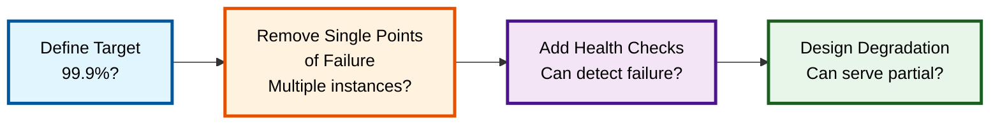
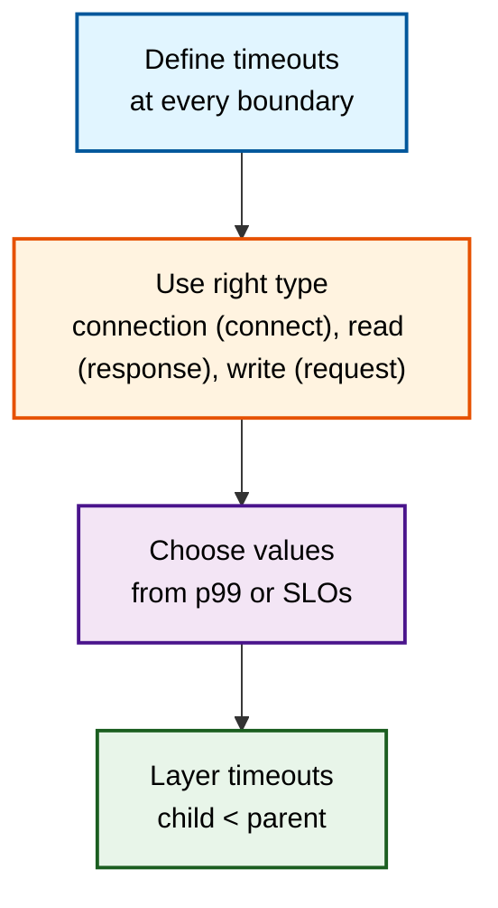
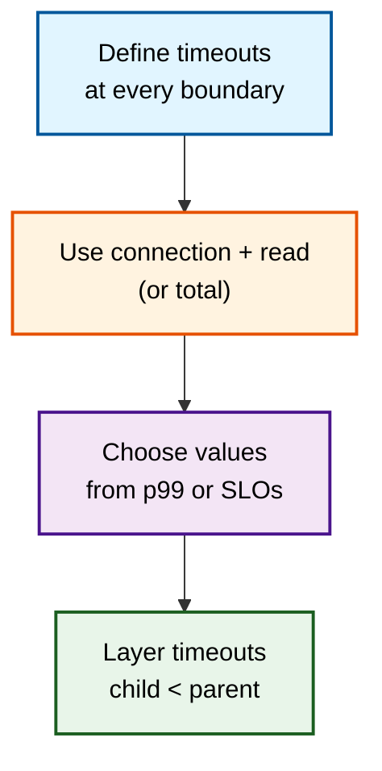

# Domain Knowledge Reference

Auto-generated from blog posts. Do not edit manually.
Last updated: 2026-03-03

---

## Source: fundamentals-of-reliability-engineering

URL: https://jeffbailey.us/blog/2025/11/17/fundamentals-of-reliability-engineering

## Introduction

Why do some teams confidently ship features while others fear deployments? The key difference is their grasp of reliability engineering fundamentals.

If you're making reliability decisions based on gut feeling or aiming for "five nines" without understanding why, this article explains how to define reliability targets, balance reliability with innovation, and make data-driven decisions about system reliability.

**Reliability engineering** designs and operates systems to meet reliability targets. Reliability is the gap between user expectations and what is delivered. Sound reliability engineering balances user needs with business goals, enabling innovation and trust. Poor reliability causes over-engineering or frequent outages.

The software industry uses SLOs, error budgets, and design practices to ensure reliability. Some strive for perfect uptime ignoring costs and user needs, while others react only after incidents. Knowing reliability basics helps set realistic goals, make better trade-offs, and create dependable systems.

**What this is (and isn't):** This article discusses reliability engineering principles and trade-offs, explaining why targets matter and how to balance reliability with other goals. It emphasizes systematic thinking over specific uptime checklists.

**Why reliability engineering fundamentals matter:**

* **Informed decision-making** - Clear reliability targets guide data-driven decisions on releases and features.
* **Balanced innovation:** Error budgets allow controlled risk-taking without sacrificing reliability.
* **User trust** - Reliable systems boost user confidence and satisfaction.
* **Cost efficiency** - Proper reliability targets avoid over-engineering and resource waste.
* **Team alignment** - Shared reliability goals help teams prioritize and resolve conflicts.

You'll see **when to deprioritize reliability**, such as early-stage products or experimental features where learning outweighs uptime.

Mastering reliability engineering fundamentals moves you from guessing to making informed decisions that balance user needs, business goals, and technical constraints.


> Type: **Explanation** (understanding-oriented).  
> Primary audience: **beginner to intermediate** engineers learning to define reliability targets and design reliable systems

**Prerequisites:** Basic software development literacy; assumes familiarity with system design, deployment, and monitoring—no reliability engineering or SRE experience needed.

**Primary audience:** Beginner–Intermediate engineers learn to define reliability targets and design reliable systems, providing enough depth for experienced developers to align on foundational concepts.

**Jump to:** [What Is Reliability Engineering](#section-1-what-is-reliability-engineering) • [SLOs and SLIs](#section-2-slos-and-slis--defining-reliability-targets) • [Error Budgets](#section-3-error-budgets--balancing-reliability-and-innovation) • [Designing for Reliability](#section-4-designing-for-reliability) • [Testing for Reliability](#section-5-testing-for-reliability) • [Monitoring Reliability](#section-6-monitoring-reliability) • [Evaluating Reliability](#evaluating-your-reliability-engineering) • [Common Pitfalls](#section-7-common-pitfalls) • [When NOT to Focus on Reliability](#when-not-to-focus-on-reliability) • [Future Trends](#future-trends-in-reliability-engineering) • [Getting Started](#getting-started-with-reliability-engineering) • [Glossary](#glossary)

### Learning Outcomes

By the end of this article, you will be able to:

* Define appropriate Service Level Objectives (SLOs) for your systems.
* Use error budgets to balance reliability with innovation.
* Design systems with reliability in mind from the start.
* Test reliability systematically before production.
* Monitor reliability effectively using SLOs and error budgets.
* Recognize common reliability engineering pitfalls and avoid them.

## Section 1: What Is Reliability Engineering

Reliability engineering involves designing, building, and operating systems to meet reliability targets by making deliberate choices about acceptable failure levels and trade-offs. It isn't about perfect uptime but about setting appropriate goals.

### Reliability vs Availability

**Reliability** is the chance that a system performs correctly over time, including correctness, availability, and performance. A system that's up but gives wrong answers isn't reliable.

**Availability** is the percentage of time a system is operational and able to serve requests, representing one aspect of reliability.

Think of reliability like a car. Availability is whether the car starts. Reliability includes starting, proper driving, and performing as expected. A car that starts but has broken brakes isn't reliable, even if available.

### Quick Comparison: Reliability, Availability, Resilience

**Reliability** asks: "Does the system do the right thing over time?" It focuses on failures such as incorrect data or missed latency SLOs.

**Availability** asks: "Is the system up and able to respond?" It focuses on failures such as downtime, 5xx errors, and outages.

**Resilience** asks: "How well does the system recover from failure?" It focuses on failures such as systems not failing over to backups or healing after incidents.

Thinking in these three dimensions prevents confusing "no downtime" with "good reliability."

### Why Reliability Matters

Reliability matters because users depend on systems to work correctly. Unreliable systems erode trust, cause frustration, and drive users away.

**User impact:** When systems fail, users can't finish tasks, leading to lost sales, broken conversations, failed transactions, and damaged trust.

**Business impact:** Reliability impacts revenue, reputation, and costs. Outages lead to lost sales, increased support, and engineering time spent firefighting rather than developing features.

**Team impact:** Unreliable systems cause stress, burnout, and firefighting, diverting teams from improvements.

### The Reliability Spectrum

Reliability isn't binary; systems require varying levels based on purpose and user needs.

**Critical systems** such as payment processing, medical devices, and safety systems require high reliability because failures can cause serious harm.

**Important systems** require high reliability. While e-commerce, communication, and productivity apps need dependable operation, brief outages are tolerable.

**Non-critical systems**, like internal tools, development environments, and experimental features, can have lower reliability targets.

Match reliability targets to actual needs, not aim for maximum everywhere.

**Section Summary:** Reliability engineering sets targets and makes trade-offs. Reliability covers correctness, availability, and performance, not just uptime. Different systems need different reliability levels based on purpose and user needs.

**Quick Check:**

1. What's the difference between reliability and availability?
2. How do reliability failures affect your users and business?
3. Which systems need the highest reliability, and why?

## Section 2: SLOs and SLIs – Defining Reliability Targets

Service Level Objectives (SLOs) and Service Level Indicators (SLIs) define system reliability and measurement.

### What Are SLIs?

**Service Level Indicators (SLIs)** are metrics that measure reliability and answer the question: "What should we measure to understand reliability?"

Common SLIs include:

* **Availability** - Percentage of successful requests.
* **Latency** - Response time percentiles (P50, P95, P99).
* **Error rate** - Percentage of requests that fail.
* **Throughput** - Requests processed per second.

SLIs measure user experience, not internal metrics. Users notice latency, not CPU use. Latency SLIs track slow responses affecting users. See [Fundamentals of Monitoring and Observability](/blog/2025/11/16/fundamentals-of-monitoring-and-observability/) for more on user-focused metrics.

**Example:** For an API, availability SLI measures the percentage of successful requests. A 99.9% availability means 999 out of 1000 requests succeed.

### What Are SLOs?

**Service Level Objectives (SLOs)** are targets for SLIs that indicate the desired reliability level.

SLOs specify reliability levels. A 99.9% availability SLO means the system should succeed 99.9% of the time, allowing a 0.1% failure rate.

**SLO characteristics:**

* **User-focused** - SLOs measure user experience, not internal metrics.
* **Measurable** - SLOs use specific SLIs that can be tracked objectively.
* **Achievable** - SLOs should be realistic within system limits.
* **Time-bound** - SLOs apply to specific time windows (daily, weekly, monthly).

**Example:** "API availability should be 99.9% over rolling 30-day windows" clearly states an SLO, defining the measure (availability), target (99.9%), and time frame (30 days).

### Setting Appropriate SLOs

Setting appropriate SLOs requires understanding user needs, business goals, and technical constraints.

**User needs:** Understand what reliability users require. A payment system needs higher reliability than a blog. Know user expectations before setting targets.

**Business goals:** Consider how reliability targets impact revenue, reputation, and costs. Balance user needs with business constraints; higher reliability costs more to achieve and maintain.

**Technical constraints:** Assess what your current architecture and resources can support. Setting SLOs beyond your capabilities causes frustration and wasted effort.

**Use percentiles for latency:** Avoid using averages for latency SLOs. If average latency is 100ms but P95 is 500ms, 5% of users face slow responses. Use P95 or P99 to better reflect user experience.

**Consider cost vs benefit:** Each extra "nine" of availability costs more than the last. Going from 99% to 99.9% may need architecture changes. From 99.9% to 99.99%, it might require multi-region redundancy and 24/7 on-call. The real question isn't "How high can we go?" but "What reliability justifies the added cost and complexity?"

**Example SLOs:**

* **E-commerce checkout:** 99.95% availability, P95 latency < 500ms.
* **Internal admin tool:** 99% availability, P95 latency < 2 seconds.
* **Payment processing:** 99.99% availability, P99 latency < 1 second, zero tolerance for incorrect transactions.

### SLO Best Practices

Following best practices helps you set SLOs that drive sound decisions.

**Set SLOs before incidents:** Define SLOs proactively to guide design and operations, not just record past failures.

**Make SLOs public:** Share SLOs with users and stakeholders to foster accountability, set expectations, and clarify reliability. Focus on user-facing SLOs that matter externally, avoiding publishing every internal SLO, which can confuse stakeholders.

**Review SLOs regularly:** SLOs aren't permanent. Review quarterly or when needs change. Update as systems evolve and requirements shift.

**Start conservative:** It's easier to relax SLOs than tighten them. Start with achievable targets and improve gradually.

**Use multiple SLOs:** Systems require multiple SLOs: availability, latency, and error rate, to provide a complete reliability picture.

**Section Summary:** SLIs measure reliability metrics, and SLOs set targets based on user needs, business goals, and technical limits. Use percentiles for latency, publish SLOs, and review regularly.

**Quick Check:**

1. What SLIs would you use to measure your primary system's reliability?
2. What SLO targets suit your users' needs?
3. How would you communicate SLOs to users and stakeholders?

**Reflection Prompt:**

Consider a system you work on today. If you had to define one availability SLO and one latency SLO, what would they be, and what trade-offs would they entail?

## Section 3: Error Budgets – Balancing Reliability and Innovation

Error budgets define acceptable levels of unreliability to meet SLOs, enabling controlled risk and balancing reliability with innovation.

### What Are Error Budgets?

**Error budgets** are the gap between 100% reliability and your SLO, showing acceptable unreliability for deployments, experiments, or activities that might cause failures. For example, if your SLO is 99.9% availability, your error budget is 0.1% failure rate, you can use it for risky changes as long as you stay within budget.

**Example:** With a 30-day SLO window, your error budget permits 43 minutes of downtime monthly. You can use this for risky deployments or brief outages, as long as total downtime stays within budget.

### How Error Budgets Work

Error budgets provide a framework for reliability decisions.

**When you're under budget,** you can take risks by deploying new features, experimenting, or optimizing. It means some failures are acceptable.

**When at budget,** you've used acceptable unreliability. Focus on stability, avoid risky changes, and prioritize reliability. Being on a budget means you must be cautious.

**When over budget,** you've exceeded acceptable unreliability. Stop new deployments, focus on fixing problems first, then add features. Prioritize reliability, applying the [Fundamentals of Incident Management](/blog/2025/11/16/fundamentals-of-incident-management/) systematically.

**Example:** Your team has 20 minutes of error budget left this month. A risky deployment could cause 15 minutes of downtime. You can deploy since you're under budget, but you're close to the limit. If over budget, you'd delay until reliability improves.

**Micro Quick Check:**

If your SLO permits 60 minutes of downtime monthly and you've used 45 minutes, how should that affect your remaining deployment plans?

### Using Error Budgets for Decision-Making

Error budgets guide release and feature choices.

**Release decisions:** Use error budgets to guide deployment timing: deploy confidently when under budget, delay when over budget.

**Feature prioritization:** When over budget, prioritize reliability work over new features. Error budgets make reliability a first-class priority, not an afterthought.

**Risk assessment:** Error budgets assess risk: deployments using 10% are low risk, while those risking 80% are high risk and need careful evaluation.

**Team alignment:** Error budgets foster shared understanding, keeping everyone informed about reliability and enabling informed decisions, eliminating debates over deployment risks.

### Error Budget Policies (Burn Rate, Reset, Allocation)

Error budget policies guide teams on error budget usage.

**Burn rate:** Your error budget is being used up quickly. A high burn rate indicates faster consumption. Monitor it to predict when it'll run out.

**Budget reset:** Error budgets reset each SLO window; monthly SLOs reset monthly. Use reset periods for planning reliability work and risky deployments.

**Budget allocation:** Some teams allocate error budgets with 50% for planned deployments, 30% for incidents, and 20% buffer to help plan reliability work.

**Example policy:** "When error budget drops below 25%, freeze new deployments and focus on reliability; when over budget, all feature work halts until reliability improves."

**Section Summary:** Error budgets measure acceptable unreliability, guiding risk in releases, work, and assessments. Under budget, risks are doable; over, focus on reliability.

### Case Study: Error Budgets in Practice

A payment processing team set an SLO of 99.95% availability, allowing about 22 minutes of monthly downtime. After a 15-minute database migration, they had 7 minutes of error budget left.

The team decided to deploy a new fraud detection feature using their error budget framework, enabling innovation with added monitoring and a rollback plan. The deployment was successful, demonstrating that error budgets support innovation while maintaining reliability.

This example illustrates how error budgets turn reliability into a clear decision-making tool.

**Quick Check:**

1. What's your current error budget status for your primary system?
2. How would error budgets affect your deployment choices?
3. What policies would help your team use error budgets effectively?

## Section 4: Designing for Reliability

Reliability begins with design; systems built for it are easier to operate, maintain, and improve than those designed without it.

### Reliability Design Principles

Design principles that enhance reliability:

**Fail gracefully:** Systems should manage failures by degrading functionality rather than failing completely. For example, a search that defaults to basic results is more reliable than one that crashes.

**Isolate failures:** Prevent failures from cascading by isolating them with circuit breakers, bulkheads, and timeouts.

**Design for recovery:** Systems should automatically recover from failures using health checks, automatic restarts, and self-healing, reducing manual intervention.

**Monitor everything:** You can't improve what you don't measure—design systems with observability in mind. See [Fundamentals of Monitoring and Observability](/blog/2025/11/16/fundamentals-of-monitoring-and-observability/) for detailed guidance.

**Test failure modes:** Design systems to handle failures, testing dependency crashes, network splits, or resource exhaustion.

### Redundancy and High Availability

Redundancy provides backup capacity when primary systems fail.

**Multiple instances:** Run multiple service instances to prevent outages; load balancers distribute traffic across healthy ones.

**Multiple regions:** Deploy across multiple regions to prevent complete outages; users can still access systems if one region fails.

**Multiple providers:** Use multiple cloud providers for critical dependencies so outages don't cause total system failures.

**Trade-offs:** Redundancy raises costs and complexity. More redundancy improves reliability but adds operational burden. Balance redundancy with costs and complexity.

### Fault Tolerance

Fault tolerance allows systems to operate despite failures.

**Retries:** Automatically retry failed operations. Transient failures often succeed on retry. Use exponential backoff to avoid overwhelming failing systems.

**Circuit breakers:** Stop calling failing services to prevent cascading failures. Circuit breakers open when failure rates exceed thresholds, allowing services to recover.

**Timeouts:** Set timeouts on external calls to avoid indefinite waits. Timeouts prevent slow dependencies from blocking requests.

**Graceful degradation:** A video streaming service might reduce quality during high load rather than fail entirely.

### Capacity Planning

Capacity planning guarantees systems have enough resources.

**Understand growth:** Predict load increase over time due to traffic, user growth, and feature usage.

**Plan for peaks:** Design for peak load, not average. Black Friday, product launches, and viral events cause traffic spikes.

**Monitor utilization:** Monitor resource usage to anticipate capacity limits. Proactive scaling avoids outages.

**Auto-scaling:** Automatically adjust capacity based on load; auto-scaling manages traffic spikes without manual intervention.

The goal isn't to eliminate all capacity risk but to make conscious trade-offs between cost, performance, and accepted risk during peak events.

**Section Summary:** Design reliable systems from the start with redundancy, fault tolerance, and capacity planning to handle failures and load. Ensure graceful failure, isolation, and automatic recovery. Monitor all aspects to understand system behavior.

**Quick Check:**

1. How does your system handle component failures?
2. What redundancy do you have for critical components?
3. How do you plan for capacity growth and traffic spikes?

## Section 5: Testing for Reliability

Testing ensures systems meet reliability goals pre-production, identifying issues early when easier and cheaper to fix.

### Types of Reliability Testing (Load, Stress, Chaos)

Different testing methods verify various reliability aspects.

**Load testing:** Verify systems handle expected load by testing with production-like traffic volumes to ensure normal operation.

**Stress testing:** Find breaking points by stress testing beyond expected load to reveal capacity limits and failure modes.

**Chaos testing:** Intentionally break systems to test resilience by killing services, injecting latency, and simulating failures, which validates the system's ability to recover from failure, not just avoid it.

**Failure injection:** Test failure scenarios like network partitions, database failures, and dependency outages to verify fault tolerance.

**End-to-end testing:** Verify full user journeys; end-to-end tests catch issues unit tests miss.

### Testing Best Practices

Following best practices ensures effective reliability testing.

**Test in production-like environments:** Staging environments should mirror production because different environments hide production-specific problems.

**Test failure scenarios:** Don't only test happy paths; also test failures. Systems should handle failures gracefully.

**Automate testing:** Manual testing doesn't scale. Automate reliability tests and run them regularly. Continuous testing catches regressions early.

**Measure what matters:** Test against SLOs, not arbitrary metrics. Ensure you can meet a 99.9% availability SLO under expected load.

**Test recovery:** Verify systems can recover from failures. Ensure automatic recovery works and manual procedures are documented and tested.

### Reliability Testing Trade-offs

Reliability testing balances coverage and effort.

**More testing finds more problems,** but requires more time and resources. Focus on critical paths, use lighter testing for less critical features.

**Production testing is most accurate**, but risks user impact. Use canary deployments and feature flags to test safely in production.

**Automated testing scales** but needs maintenance. Invest in test infrastructure for long-term gains.

**Section Summary:** Test reliability before production using load, stress, chaos testing, and failure injection to verify systems meet SLOs. Test failure scenarios, automate tests, and verify recovery.

**Quick Check:**

1. What reliability testing do you currently perform?
2. How do you test failure scenarios?
3. What would happen if you killed a critical service in production?

## Section 6: Monitoring Reliability

Monitoring reliability ensures systems meet SLOs, helps identify when to use error budgets, and tracks SLIs against SLOs to alert on degradation.

### Monitoring SLIs

Monitor the SLIs that define your reliability targets.

**Availability monitoring:** Track successful request rates and compare to availability SLOs to assess current reliability.

**Latency monitoring:** Track response-time percentiles (P50, P95, P99) and compare them with latency SLOs to identify performance issues.

**Error rate monitoring:** Monitor failure rates; high errors signal reliability issues.

**Throughput monitoring:** Monitor request volumes; throughput impacts capacity and reliability.

### Tracking Error Budgets

Monitor error budget to inform decisions.

**Budget remaining:** Track remaining error budget and display it prominently to inform teams of reliability status.

**Burn rate:** Monitor your error budget burn rate; high rates signal issues.

**Budget trends:** Track error budget trends over time. Declining trends suggest improved reliability, while increasing trends indicate degradation.

**Forecasting:** Predict when error budgets will run out to plan reliability efforts and deployments.

### Alerting on SLO Violations

Alert when SLOs are violated or error budgets are at risk.

**SLO violation alerts:** Alert when SLIs fall below SLOs; violations signal reliability issues needing quick action.

**Budget exhaustion alerts:** Alert when error budgets near exhaustion to give teams early warning and time to improve reliability.

**Burn rate alerts:** Alert when error budget burn rates are high, indicating faster-than-expected consumption.

**Alert on symptoms:** Alert on user experience, not internal metrics. SLO alerts focus on outcomes that matter to users.

See [Fundamentals of Monitoring and Observability](/blog/2025/11/16/fundamentals-of-monitoring-and-observability/) for detailed guidance on building effective monitoring and alerting systems.

### Reliability Dashboards

Dashboards show system health and reliability status.

**SLO status:** Show current SLI values against SLO targets with indicators for target achievement.

**Error budget status:** Show error budgets and burn rates; budget status aids deployment decisions.

**Trends:** Display reliability trends over time to show whether reliability is improving or degrading.

**Historical context:** Compare current reliability to historical baselines. Context differentiates real problems from normal variation.

**Section Summary:** Monitor reliability using SLIs, compare to SLOs, and alert on violations. Track error budget use and burn rates for informed decisions. Use dashboards to visualize reliability and trends. In [Evaluating Your Reliability Engineering](#evaluating-your-reliability-engineering), we'll interpret these metrics with user feedback and incident patterns.

**Quick Check:**

1. How do you currently monitor reliability?
2. Do you track error budgets and burn rates?
3. What alerts do you have for SLO violations?

## Evaluating Your Reliability Engineering

How do you know if your reliability engineering works? Look at three signals:

* **SLO compliance:** Are you consistently meeting your SLOs over realistic time windows?

* **User experience:** Are users still complaining about reliability, or has support volume shifted from outages to feature questions?

* **Incident profile:** Are incidents becoming less frequent, shorter, and easier to resolve?

If all three trends are positive, reliability engineering matches reality. If not, you're likely measuring the wrong metrics or setting SLOs that don't reflect user concerns.

**Quick Check:**

Consider your system today. Are your SLOs, user feedback, and incident patterns aligned or pointing in different directions?

## Section 7: Common Pitfalls

Understanding common mistakes helps avoid reliability engineering issues that waste effort or foster false confidence.

### Aiming for Perfect Reliability

**The problem:** Teams target "five nines" (99.999% availability) without knowing cost constraints or user needs.

**Why it's a problem:** Perfect reliability is costly and usually unnecessary. Most systems don't require 99.999% uptime. Over-engineering wastes resources and delays progress.

**Solution:** Set SLOs based on user needs and business goals, matching reliability targets to system importance—critical systems require higher reliability.

### Setting SLOs Without Data

**The problem:** Teams set SLOs based on guesses or industry standards without knowing their systems' capabilities.

**Why it's a problem:** Unrealistic SLOs cause frustration and missed targets since teams can't meet what they don't understand or can't achieve.

**Solution:** Establish baselines first, then set achievable SLOs. Begin conservatively and improve over time.

### Ignoring Error Budgets

**The problem:** Teams define SLOs but neglect error budgets in decisions.

**Why it's a problem:** Without error budgets, teams struggle to balance reliability and innovation. Deployments seem risky, or reliability work is deprioritized.

**Solution:** Use error budgets actively; make deployment decisions based on budget status and prioritize reliability work when budgets are depleted.

### Monitoring Implementation Details

**The problem:** Teams monitor low-level metrics like CPU usage instead of user-visible SLIs.

**Why it's a problem:** Implementation metrics don't assess reliability. High CPU may be normal; low CPU doesn't indicate user satisfaction.

**Solution:** Monitor SLIs that track user experience, such as availability, latency, and error rates. Use implementation metrics for debugging, not reliability.

### Not Testing Failure Scenarios

**The problem:** Teams only test happy paths, assuming systems handle failures correctly.

**Why it's a problem:** Systems fail unpredictably; testing failures ensures recovery mechanisms work.

**Solution:** Test failure scenarios systematically, using chaos testing and failure injection to verify resilience and observe outcomes when dependencies fail.

### Setting SLOs Too High

**The problem:** Teams set overly optimistic SLOs to appear reliable.

**Why it's a problem:** High SLOs cause pressure and missed targets, leading teams to waste effort on unnecessary reliability.

**Solution:** Set SLOs based on user needs, not vanity metrics. Consistently meeting a 99% SLO is better than often missing a 99.9% SLO.

### Not Reviewing SLOs

**The problem:** Teams set SLOs once and never review them.

**Why it's a problem:** User needs change, systems evolve, and SLOs become outdated, which then don't reflect current requirements.

**Solution:** Review SLOs regularly and update them as user needs change or systems evolve. They should guide current decisions, not document past assumptions.

### Section Summary

Common pitfalls include aiming for perfect reliability, setting SLOs without data, ignoring error budgets, monitoring implementation details, failing to test failures, setting SLOs too high, and not reviewing SLOs. Avoid these by setting targets, using error budgets, monitoring SLIs, testing failures, and reviewing regularly.

**Reflection Prompt:** Which pitfalls have you encountered? How might avoiding them improve your reliability engineering practices?

## When NOT to Focus on Reliability

Reliability engineering isn't always the priority; sometimes other goals come first.

### Early-Stage Products

Early-stage products prioritize validation over reliability. If user demand isn't clear, perfect reliability is unnecessary. Focus on learning and iteration first, then enhance reliability as products mature.

### Experimental Features

Experimental features may have lower reliability targets. Use feature flags and canary deployments to test ideas with limited impact. Once proven valuable, increase reliability.

### Non-Critical Systems

Internal tools don't need production-level reliability. Match reliability to system importance and avoid over-engineering less critical systems.

### When Reliability Costs Outweigh Benefits

Sometimes reliability improvements aren't worth the cost. If boosting reliability from 99% to 99.9% takes much engineering effort but offers little user benefit, the trade-off may not be justified.

### When Other Goals Are More Important

Sometimes, speed, features, or cost outweigh reliability. A prototype might prioritize speed, and a cost-sensitive product may accept lower reliability to cut infrastructure costs.

The key is making informed trade-offs, not ignoring reliability. Understand what you're trading off and why.

## Future Trends in Reliability Engineering

Tools and practices around reliability are evolving quickly, but the fundamentals stay stable.

A few trends to watch:

* **SLO-first tooling:** Many platforms now treat SLOs and error budgets as main objects, simplifying their definition, monitoring, and alerting.

* **Shift-left reliability:** Reliability concerns are now addressed earlier, during design reviews, CI pipelines, and local development tools.

* **Automated incident response:** Runbooks, auto-remediation, and AI-assisted debugging reduce manual toil during incidents.

* **Business-level SLOs:** Some organizations now define SLOs using business metrics like orders placed and messages delivered, not just technical ones.

Tools don't change the fundamentals: clear targets (SLOs), honest measurement (SLIs), and explicit trade-offs via error budgets.

As you explore these trends, ask which practices are tooling-driven or grounded in the fundamentals from this article.

## Conclusion

Reliability engineering involves setting targets, balancing reliability and innovation, and making data-driven decisions so users can depend on your systems.

Reliability engineering links user needs, business goals, and technical limits into a decision-making framework. SLOs set targets, error budgets allow innovation, and systematic design ensures dependability. Testing verifies reliability before deployment, while monitoring tracks it continuously.

Master these fundamentals to set reliable targets, use error budgets, design, test, and monitor systems effectively.

**You now understand** how to define SLOs and SLIs, use error budgets, design and test systems for reliability, monitor effectively, and avoid common pitfalls.

### Key Takeaways

* **SLOs define reliability targets** based on user needs and business goals.
* **Error budgets enable innovation** by quantifying acceptable unreliability.
* **Design for reliability** from the start using redundancy, fault tolerance, and capacity planning.
* **Test reliability systematically** using load testing, stress testing, and chaos testing.
* **Monitor reliability continuously** by tracking SLIs and error budgets.

## Getting Started with Reliability Engineering

Begin building reliability engineering fundamentals today. Choose one area to improve and make it better.

1. **Define your first SLO** - Choose one critical system and set an availability SLO based on user needs to establish a concrete reliability target rather than relying on gut feeling.
2. **Calculate your error budget** - Determine how much unreliability you can accept to meet your SLO, forming a framework for deployment decisions.
3. **Monitor your SLI** - Start tracking metrics that define your reliability target to compare reality with expectations and adjust targets or design as needed.
4. **Review your design** - Compare a system against reliability principles like graceful failure and isolation to see how design choices impact reliability.
5. **Test a failure scenario** - Intentionally break something (Chaos Engineering) in a test environment to verify recovery mechanisms and understand system behavior when issues arise.

*Here are resources to help you begin:*

**Recommended Reading Sequence:**

1. This article (Foundations: SLOs, error budgets, reliability design)
2. [Fundamentals of Monitoring and Observability](/blog/2025/11/16/fundamentals-of-monitoring-and-observability/) (measuring system behavior and detecting problems)
3. [Fundamentals of Incident Management](/blog/2025/11/16/fundamentals-of-incident-management/) (responding when reliability targets aren't met)
4. [Fundamentals of Metrics](/blog/2025/11/09/fundamentals-of-metrics/) (choosing and using metrics effectively)

* See the [References](#references) section below for books, frameworks, and tools.

### Self-Assessment

Test your understanding of reliability engineering fundamentals and revisit your Quick Checks answers.

<!-- markdownlint-disable MD033 -->
1. **What's the difference between an SLI and an SLO?**
   <details><summary>Show answer</summary>

   SLIs measure reliability metrics like availability or latency, while SLOs set targets for those metrics, specifying desired reliability levels.

   </details>

2. **How do error budgets balance reliability and innovation?**
   
   <details><summary>Show answer</summary>
   
   Error budgets measure acceptable unreliability. Being under budget allows risk-taking like deploying new features, while being over budget shifts focus to reliability. This helps decide when to innovate or prioritize stability.
   
   </details>
   
3. **What are the key principles for designing reliable systems?**
   
   <details><summary>Show answer</summary>
   
   Key principles include designing for graceful failure (degrade instead of crash), isolating failures (prevent cascading), designing for recovery (automatic healing), monitoring everything (measure what matters), and testing failure modes (verify resilience).
   
   </details>
   
4. **Why use percentiles over averages for latency SLOs?**
   
   <details><summary>Show answer</summary>
   
   Averages conceal tail pain. The average latency is 100ms, but P95 is 500ms, indicating 5% of users face delays. Percentiles better represent user experience and ensure SLOs reflect reality.
   
   </details>
   
5. **What's a common pitfall when setting SLOs?**
   
   <details><summary>Show answer</summary>
   
   Common pitfalls include aiming for perfect reliability without understanding the costs, setting SLOs without baseline data, ignoring error budgets, monitoring implementation details rather than user-visible SLIs, and not reviewing SLOs regularly.
   
   </details>
   <!-- markdownlint-enable MD033 -->

### Glossary

## References

### Related Articles

*Related fundamentals articles:*

**Production Systems:** [Fundamentals of Monitoring and Observability](/blog/2025/11/16/fundamentals-of-monitoring-and-observability/) helps you understand how to measure system behavior and detect reliability problems. [Fundamentals of Incident Management](/blog/2025/11/16/fundamentals-of-incident-management/) shows how to respond when reliability targets aren't met. [Fundamentals of Metrics](/blog/2025/11/09/fundamentals-of-metrics/) teaches you how to choose and use metrics to measure reliability effectively.

**Software Engineering:** [Fundamentals of Software Architecture](/blog/2025/10/19/fundamentals-of-software-architecture/) helps you understand how architectural decisions affect system reliability. [Fundamentals of Software Testing](/blog/2025/11/30/fundamentals-of-software-testing/) shows how testing contributes to system reliability and helps you set quality targets.

### Industry/Frameworks

* [Google SRE Book](https://sre.google/sre-book/table-of-contents/): Guide to site reliability engineering, covering SLOs, error budgets, and reliability design.
* [The Site Reliability Workbook](https://sre.google/workbook/table-of-contents/): Practical examples and case studies for implementing SRE practices.
* [What to Measure: Using SLIs](https://sre.google/workbook/implementing-slos/#what-to-measure-using-slis): Guide to selecting appropriate Service Level Indicators.
* [Implementing SLOs](https://sre.google/workbook/implementing-slos/): Step-by-step guide to implementing Service Level Objectives.
* [Google SRE Practices](https://sre.google/): Overview of Google's site reliability engineering practices.

### Academic/Research

* [SRE Research Papers](https://sre.google/resources/): Collection of research papers and academic resources on site reliability engineering.

### Tools and Platforms

* [Google Cloud Monitoring](https://cloud.google.com/monitoring): SLO monitoring and error budget tracking.
* [Prometheus](https://prometheus.io/): Metrics collection for SLI monitoring.
* [Grafana](https://grafana.com/): Visualization and SLO dashboards.


---

## Source: fundamentals-of-monitoring-and-observability

URL: https://jeffbailey.us/blog/2025/11/16/fundamentals-of-monitoring-and-observability

## Introduction

Why do some teams debug production issues in minutes while others spend days guessing what went wrong? The difference is their understanding of monitoring and observability fundamentals.

If you're staring at dashboards full of numbers but still can't figure out why your system is slow, this article explains how metrics, logs, and traces work together to help you understand what's happening in your systems.

**Monitoring** involves collecting and analyzing data about system behavior to detect issues and track performance. **Observability** enables understanding a system's internal state through its outputs. Monitoring indicates problems; observability reveals why.

The software industry relies on monitoring and observability to understand system behavior, debug issues, and make decisions. Some teams collect all metrics, logs, and traces, creating noise. Knowing the fundamentals helps build systems that offer insight without data overload.

**What this is (and isn't):** This article explains core principles of monitoring and observability, highlighting how telemetry types work together. It's not a tool tutorial or a monitoring checklist, but it emphasizes why they matter and how to use them effectively. Focused on understanding concepts and trade-offs, it helps you make better decisions without covering specific tool configuration.

**Why monitoring and observability fundamentals matter:**

* **Faster debugging** - Good observability helps find root causes quickly.
* **Proactive problem detection** - Monitoring surfaces issues before users notice them.
* **Better decisions** - Understanding system behavior aids informed decision-making.
* **Reduced incident duration** - When problems occur, observability tools help you resolve them faster.
* **System understanding** - It shows how systems truly behave, not just perceived.

Mastering monitoring and observability fundamentals shifts you from reacting to alerts to understanding systems and preventing problems early.


> Type: **Explanation** (understanding-oriented).  
> Primary audience: **beginner to intermediate** engineers learning what to monitor and how to design observability systems

**Prerequisites:** Basic software development literacy; assumes familiarity with APIs, databases, and application deployment—no monitoring or observability experience needed.

**Primary audience:** Beginner–Intermediate engineers learn what to monitor and how to design observability systems, with enough depth for experienced developers to align on foundational concepts.

**Jump to:** [Monitoring vs Observability](#section-1-monitoring-versus-observability) • [Three Pillars](#section-2-the-three-pillars-of-observability) • [Working Together](#section-3-how-metrics-logs-and-traces-work-together) • [Common Patterns](#section-4-common-monitoring-and-observability-patterns) • [Pitfalls](#section-5-common-pitfalls) • [When NOT to Use](#when-not-to-add-more-telemetry) • [Misconceptions](#common-misconceptions) • [Implementation](#section-6-implementing-monitoring-and-observability) • [Examples](#section-7-monitoring-and-observability-in-practice) • [Evaluation & Validation](#section-8-evaluation--validation) • [Future Trends](#future-trends-in-observability) • [Getting Started](#getting-started-with-monitoring-and-observability) • [Glossary](#glossary)

### Learning Outcomes

By the end of this article, you will be able to:

* Distinguish monitoring from observability and understand when each applies.
* Explain how metrics, logs, and traces complement each other.
* Identify which telemetry type to use for different debugging scenarios.
* Recognize common monitoring and observability pitfalls and avoid them.
* Design observability systems that provide insight without creating noise.

## Section 1: Monitoring Versus Observability

Knowing the difference between monitoring and observability improves system understanding.

### What Is Monitoring?

**Monitoring** involves watching metrics, setting alerts, and responding to issues when thresholds are exceeded.

Think of monitoring like a car dashboard with gauges for speed, fuel, engine temperature, and oil pressure—known metrics you watch. When a gauge hits a red zone, you pull over. Monitoring works similarly: define metrics, set thresholds, and respond when alerts fire.

**Monitoring characteristics:**

* **Predefined metrics** - You decide what to measure before deploying.
* **Threshold-based alerts** - You set limits and get notified when exceeded.
* **Reactive** - Alerts fire when problems occur.
* **Known unknowns** - You know what might go wrong and monitor for it.

**Example:** You monitor CPU, memory, and errors. When CPU exceeds 80% for five minutes, an alert fires. You find a memory leak causing high CPU usage.

### What Is Observability?

**Observability** is understanding a system's internal state from its outputs without knowing beforehand, enabling the questions being explored and discovered.

Think of observability like a flight data recorder: when a plane crashes, investigators examine the recorder's data to understand what happened. It works the same way—collect telemetry data and analyze it to understand system behavior, even in the face of unexpected problems.

**Observability characteristics:**

* **Exploratory** - You can ask new questions about system behavior.
* **Rich telemetry** - Metrics, logs, and traces provide multiple views of the system.
* **Unknown unknowns** - You can discover problems you didn't know to monitor for.
* **Context-rich** - Traces and logs provide context about what happened and why.

**Example:** Users report slow responses, but monitored metrics seem normal. Using observability, traces reveal slow code paths, logs show database timeouts, and metrics confirm the pattern affects only specific user segments.

### The Relationship Between Monitoring and Observability

Monitoring and observability complement each other—monitoring detects known issues quickly, while observability helps understand unknown ones.

**Monitoring without observability:** You get alerts but can't understand why problems happen, and debugging takes hours or days.

**Observability without monitoring:** You can debug problems after users report them. You understand issues well, but detection is slow.

**Monitoring and observability together:** You quickly detect problems via monitoring, then use observability to find root causes and resolve them efficiently.

**Section Summary:** Monitoring watches known metrics and alerts on thresholds, while observability explores system behavior to understand unknown problems. Use monitoring for detection and observability for understanding; both are vital for production systems.

**Quick Check:**

1. In your system, which problems are "known unknowns" you already monitor?
2. When was the last time you faced an "unknown unknown," and what telemetry could have helped you understand it faster?

## Section 2: The Three Pillars of Observability

Observability depends on three telemetry types: metrics, logs, and traces, each offering a unique system view, together forming a complete picture.

### Metrics: Quantitative Measurements Over Time

**Metrics** are measurements over time that aggregate events into data that reveal trends, patterns, and anomalies.

Think of metrics like a weather report. You don't need every raindrop; you need average temperature, total rainfall, and wind speed—metrics aggregate events into summaries showing patterns.

**Metrics characteristics:**

* **Aggregated** - Many events become single data points.
* **Time-series** - Values tracked over time show trends.
* **Efficient** - Low storage and processing costs.
* **Trend-focused** - Best for understanding patterns, not individual events.

**Common metric types:**

* **Counters** - Incrementing values like total requests or errors.
* **Gauges** - Current values like CPU usage or active connections.
* **Histograms** - Distributions like response time percentiles.
* **Summaries** - Pre-aggregated statistics like average latency.

**When to use metrics:**

* Tracking system health over time.
* Detecting anomalies and trends.
* Setting up alerts on thresholds.
* Understanding aggregate behavior.

**Metrics limitations:**

* Don't show individual events.
* Lose context about specific requests.
* Can't explain why something happened.
* Metrics give you strong signals about *when* something changed, but almost no detail about *which* individual events were affected.

**Example:** Your error rate is now 2%, up from 0.1% yesterday, indicating a problem, but not showing which requests failed, why, or what changed.

### Logs: Detailed Event Records

**Logs** are detailed event records that show what happened, when, and often why.

Logs are like a ship's logbook, recording key events with details on who, what, when, and conditions, to understand what happened.

**Logs characteristics:**

* **Event-focused** - Each log entry represents a specific event.
* **Context-rich** - Include details about what happened and why.
* **Searchable** - Can filter and search for specific events.
* **Detailed** - Provide information that metrics can't capture.

**Common log types:**

* **Application logs** - Business logic events, user actions, errors.
* **Access logs** - HTTP requests, authentication events, API calls.
* **System logs** - Operating system events, service starts, and crashes.
* **Audit logs** - Security events, permission changes, data access.

**When to use logs:**

* Understanding what happened in a specific request.
* Debugging errors with full context.
* Investigating security incidents.
* Tracking user actions for compliance.

**Logs limitations:**

* High storage costs for high-volume systems.
* It can create noise if not structured properly.
* Hard to see patterns across many events.
* Require parsing and searching to extract insights.

**Example:** Your error rate is 2%. When searching logs from the last hour, you find database connection timeouts, including details on timed-out queries, parameters, and database instances involved.

### Traces: Request Flow Through Systems

**Traces** show how requests flow through your system from entry to completion, connecting operations across services, databases, and APIs to illustrate the whole journey.

Think of traces like a package tracking system. When you ship a package, you can see every stop it makes: picked up, sorted, loaded on a truck, and delivered. Traces work the same way; they show every service and operation a request touches, with timing for each step.

**Traces characteristics:**

* **Distributed** - Connect operations across multiple services.
* **Hierarchical** - Show parent-child relationships between operations.
* **Timed** - Include duration for each operation.
* **Contextual** - Carry context like user ID and request ID through the system.

**Common trace components:**

* **Spans** - Individual operations within a trace.
* **Trace ID** - Unique identifier connecting related spans.
* **Parent-child relationships** - Show how operations call each other.
* **Attributes** - Metadata like HTTP method, status code, and database query.

**When to use traces:**

* Understanding request flow through microservices.
* Finding bottlenecks in distributed systems.
* Debugging slow requests across services.
* Understanding service dependencies.

**Traces limitations:**

* Require instrumentation in every service.
* Can generate high volume in high-traffic systems.
* Need sampling strategies to manage costs.
* Often perceived as less critical in simple monolithic applications, but still helpful in understanding internal call paths and pinpointing slow components.

**Example:** A user reports a slow checkout. The trace shows that the payment service took 3 seconds, including 2.8 seconds to call an external API. The payment service is the bottleneck, not your code.

### The Fourth Pillar: Profiles

While metrics, logs, and traces are the three pillars, modern systems add profiles to capture runtime performance data for analysis.

**Profiles** show where code spends time during execution by sampling CPU, memory, or other resources to find performance bottlenecks.

**Profiles characteristics:**

* **Code-level** - Show which functions and lines consume resources.
* **Sampled** - Collect data periodically to minimize overhead.
* **Detailed** - Provide granular performance insights.
* **Resource-focused** - Track CPU, memory, I/O, or other resources.

**When to use profiles:**

* Optimizing hot code paths.
* Understanding memory usage patterns.
* Finding CPU bottlenecks in specific functions.
* Debugging performance issues in production.

**Example:** Traces show checkout requests spend most time in the pricing service. Profiles reveal which functions and code lines consume the most CPU. Metrics indicate slowness, traces identify the service, and profiles pinpoint code to optimize.

**Section Summary:** Metrics aggregate events into trends, logs record detailed events, traces show request flow, and profiles reveal performance. Each offers unique insights, forming complete observability.

Think of metrics as trend detectors, logs as storytellers, traces as request maps, and profiles as magnifying glasses.

**Quick Check:**

1. Which telemetry type helps identify why a user's request failed?
2. Which telemetry type best detects upward error trends over the past month?
3. When debugging a slow request across multiple services, which telemetry type shows the complete flow?

## Section 3: How Metrics, Logs, and Traces Work Together

Metrics, logs, and traces aren't separate tools; they work together to provide a complete understanding of the system. Knowing their complementarity helps in practical use.

### The Observability Workflow

Metrics, logs, and traces work together in practice through this workflow:

#### Step 1: Detection (Metrics)

Metrics show issues: error rate jumps from 0.1% to 2%, and P95 response time increases from 200ms to 800ms. They indicate change but not why.

#### Step 2: Investigation (Traces)

Traces reveal slow requests and the services involved. Filtering high-latency requests shows payment service calls taking 3 seconds instead of 200ms. While traces identify where the problem is, they don't show the cause.

#### Step 3: Understanding (Logs)

Logs reveal root causes by showing query timing-out details, error messages, and start times. They explain why issues occur.

#### Step 4: Validation (Metrics)

After fixing the issue, metrics show the solution worked: error rates dropped to 0.1%, and latency normalized, confirming the fix resolved the problem.

### Complementary Strengths

Each telemetry type has strengths that complement each other.

**Metrics complement traces:**

* Metrics display aggregate patterns while traces show individual request behaviors.
* Metrics detect anomalies, and traces identify affected requests.
* Metrics provide historical context. Traces show request flow.

**Traces complement logs:**

* Traces identify request flow issues; logs explain why they happen.
* Traces link operations across services; logs detail each operation.
* Traces show timing; logs provide error messages and stack traces.

**Logs complement metrics:**

* Metrics show trends; logs show events.
* Metrics aggregate data; logs preserve context.
* Metrics identify issues. Logs reveal causes.

### Example: Debugging a Production Issue

Metrics, logs, and traces together help debug a core issue.

**The problem:** Users report slow page loads, but your dashboard shows all metrics are normal.

**Using metrics:**

You check metrics; P95 latency increased slightly but is within normal variation. Error rates and resource usage are within normal limits. No clear issue, but something feels off.

**Using traces:**

You find a pattern in traces: requests with a specific API call are slow, taking 2 seconds to call an external service. The issue is request-specific, not system-wide.

**Using logs:**

You search the logs for external API call timeouts and find that about 10% are due to network issues, not application errors. The logs show the external service is unreliable, not your code.

**The solution:**

You implement retry logic with exponential backoff for external API calls. Metrics confirm that error rates are dropping and latency is improving. Traces show retries work. Logs show fewer connection errors. All telemetry validates the fix.

**Section Summary:** Metrics indicate problems, traces show where, logs reveal why. Together, they provide enough context to debug and make confident decisions.

**Quick Check:**

1. Think about your last production bug. Which telemetry type did you first use, and why?
2. If metrics show high latency but traces indicate all services are fast individually, what could be the issue?
3. How can logs help determine why a service call is slow?

## Section 4: Common Monitoring and Observability Patterns

Understanding common patterns helps implement effective monitoring and observability by solving recurring problems with proven approaches.

### The Golden Signals

**The golden signals** are four metrics—latency, traffic, errors, and saturation—that provide crucial information about system health.

**Latency:** Track request percentiles (P50, P95, P99) to understand user experience, not just averages.

**Traffic:** How much demand your system handles—requests/sec, users, or data rates.

**Errors:** Monitor request failure rates, covering client errors (4xx) and server errors (5xx), indicating various issues.

**Saturation:** How "full" your system is, including CPU usage, memory, disk I/O, and network bandwidth.

These four signals give a complete view of system health. If any are abnormal, there's a problem to investigate.

### The RED Method

The **RED method** focuses on three metrics for microservices: Rate, Errors, and Duration.

**Rate:** Number of requests per second your service handles.

**Errors:** Number of failed requests per second.

**Duration:** Distribution of request latencies, typically P50, P95, and P99.

RED metrics are simple, actionable, and effective for service-level monitoring. They answer three questions: traffic volume, failure count, and response speed.

### The USE Method

The **USE method** helps you monitor resources: Utilization, Saturation, and Errors.

**Utilization:** This is the percentage of time a resource, like the CPU, is busy executing instructions.

**Saturation:** Degree of resource overload, including queue lengths, wait times, and contention.

**Errors:** Count of error events, including hardware errors, failed operations, and corruption.

USE metrics help monitor resources and identify CPU, memory, disk, or network bottlenecks.

### Structured Logging

**Structured logging** formats log entries as JSON, instead of free-form text.

**Benefits of structured logging:**

* Easy to parse and search.
* Enables log aggregation and analysis.
* Supports filtering and correlation.
* Works well with log analysis tools.

**Example structured log:**

```json
{
  "timestamp": "2025-11-09T10:30:45Z",
  "level": "ERROR",
  "service": "payment-service",
  "trace_id": "abc123",
  "user_id": "user456",
  "message": "Payment processing failed",
  "error": "Database connection timeout",
  "duration_ms": 5000
}
```

Structured logs enable queries such as "show errors for user456 in the last hour" or "find payment-service errors over 3 seconds."

### Distributed Tracing Patterns

**Distributed Tracing** needs consistent patterns across services.

**Trace context propagation:**

Services must pass trace context (trace ID, span ID) through communication mechanisms; without it, traces break across services.

**Sampling strategies:**

Tracing every request produces excessive data. Use sampling to cut volume while preserving insights. Common strategies include:

* **Head-based sampling** - Decide at trace start whether to sample. Fast and efficient, but may miss rare events that become interesting later.
* **Tail-based sampling** - Sample traces based on outcomes (errors, slow requests). Captures important cases but requires buffering traces until outcomes are known.
* **Adaptive sampling** - Adjust sampling rate based on system load to balance coverage and resource constraints, though it adds complexity.

**Span naming conventions:**

Use consistent span names for filtering and analysis, such as service.operation (e.g., payment-service.process-payment) or HTTP.method.path (e.g., GET /api/users).

### Alerting Best Practices

Effective alerting requires careful design to prevent alert fatigue.

**Alert on symptoms, not causes:**

Alert on user-visible issues, such as high error rates or slow responses, not on low-level metrics like high CPU usage. CPU might be high for good reasons, but users care about errors and latency.

**Use multiple signals:**

Combine metrics to reduce false positives by alerting when both error rate and latency increase, not just one.

**Set appropriate thresholds:**

Use percentiles and baselines to set realistic thresholds—alert on P95 latency over 500ms for 5 minutes, not on a single slow request.

**Document alert runbooks:**

Every alert should include a runbook that explains its meaning, the investigation steps, and the resolution. Without runbooks, alerts cause confusion instead of action.

**Section Summary:** Golden signals provide key health metrics. The RED method monitors service levels, while the USE method checks resources. Structured logging allows thorough analysis, and distributed tracing needs consistent patterns. Effective alerting targets symptoms, uses multiple signals, and includes runbooks.

**Quick Check:**

1. Which method (Golden Signals, RED, or USE) would you use to monitor a single microservice?
2. Why is structured logging more powerful than plain text logs?
3. What's the difference between alerting on symptoms and causes?

## Section 5: Common Pitfalls

Understanding common mistakes helps avoid creating monitoring systems that cause more problems than they solve.

### The Metrics Explosion

**The problem:** Collecting every metric creates overwhelming dashboards that hide signals in noise.

**Symptoms:**

* Dashboards with hundreds of metrics.
* No one knows which metrics matter.
* Alerts fire constantly for unimportant changes.
* Teams ignore dashboards because they're too complex.

**Solution:** Start with golden signals or RED metrics. Add metrics only when they inform decisions. Remove irrelevant metrics. Keep dashboards focused on 5-10 key metrics.

### Logging Everything

**The problem:** Logging all events increases storage costs and hampers information retrieval.

**Symptoms:**

* Log storage costs exceed application hosting costs.
* Log searches take minutes or fail.
* Important events buried in noise.
* Teams avoid checking logs because they're overwhelming.

**Solution:** Log at appropriate levels using structured logs with consistent fields. Implement sampling for high-volume events and set retention policies. Focus on errors, key business events, and debugging info.

### Trace Sampling Too Aggressive

**The problem:** Sampling too many traces causes you to miss key requests during debugging.

**Symptoms:**

* Can't find traces for reported issues.
* Missing traces for error cases.
* Incomplete picture of the request flow.
* Debugging takes longer because data is missing.

**Solution:** Use tail-based sampling to retain error and slow traces. Implement adaptive sampling based on system load—more for routine requests, less for mistakes and slow requests.

### Alert Fatigue

**The problem:** Too many false alerts cause teams to ignore all.

**Symptoms:**

* Alerts fire constantly.
* Teams mute or ignore alerts.
* Real problems go unnoticed.
* On-call engineers burn out.

**Solution:** Alert on symptoms, not causes. Use multiple signals to reduce false positives. Set thresholds with baselines and percentiles, document runbooks. Regularly review and tune alerts. Remove non-actionable alerts.

### Context Loss in Distributed Systems

**The problem:** Without trace context propagation, you can't track requests across services.

**Symptoms:**

* Traces break at service boundaries.
* Can't correlate logs across services.
* Debugging distributed issues is impossible.
* No visibility into service dependencies.

**Solution:** Implement trace context propagation across all services using headers like `traceparent` or `X-Trace-Id`. Ensure message queues and RPC calls propagate context and test end-to-end traces.

### Monitoring Implementation Details

**The problem:** Monitoring low-level implementation details instead of user-visible outcomes.

**Symptoms:**

* Metrics for framework internals.
* Alerts on implementation-specific thresholds.
* Can't connect metrics to user experience.
* Metrics become irrelevant when technology changes.

**Solution:** Monitor outcomes, not implementations. Focus on user-visible metrics like error rates and latency. Use implementation metrics only for debugging, not alerting. Apply the time test: will this metric matter if we change frameworks?

### Ignoring Costs

**The problem:** Collecting too much telemetry data creates high storage and processing costs.

**Symptoms:**

* Observability costs exceed application costs.
* Teams avoid adding instrumentation due to cost concerns.
* Storage fills up quickly.
* Query performance degrades.

**Solution:** Set retention policies for logs and traces, use sampling to reduce trace volume, aggregate metrics, and monitor costs to optimize observability—balancing insight with expense.

### When NOT to Add More Telemetry

Observability data is only valid if it improves decisions. Don't add new metrics, logs, or traces when:

* You can't articulate a specific question that the data will help you answer.
* The added data duplicates existing signals without improving clarity.
* The cost of collecting and storing it outweighs the value of the insight.
* You're adding instrumentation "just in case" without a clear use case.

When unsure, link new telemetry signals to a decision, runbook, or alert. Don't collect signals if you can't explain the action on change.

### Common Misconceptions

Several misconceptions about monitoring and observability can mislead teams:

**Misconception: Monitoring and observability are competing ideas.**

This is false. They're complementary. Monitoring detects known problems quickly, while observability helps understand unknown issues. You need both: monitoring for detection and observability for understanding.

**Misconception: More telemetry is always better.**

This is false. Quality matters more than quantity. Collecting all metrics, logs, and traces creates noise that hides signals. Focus on golden signals or RED metrics first, then add telemetry to inform decisions.

**Misconception: You need fancy tools to do observability.**

This is false. Good questions and basic metrics, logs, and traces are enough to start. You can build effective observability with simple tools. Fancy platforms help, but understanding fundamentals is more important than the latest tools.

**Misconception: Observability is only for microservices.**

This is false. Monoliths still need metrics and logs, even if distributed systems benefit most from traces. Simple apps benefit from understanding system behavior. Start with what you have, then add complexity as needed.

**Misconception: Once you set up observability, you're done.**

This is false. Observability needs continuous effort: review metrics, tune alerts, update runbooks, and remove outdated telemetry. It's a practice, not a one-time setup.

### Section Summary

Common pitfalls are metrics explosion, logging everything, aggressive trace sampling, alert fatigue, context loss, monitoring details, and ignoring costs. Avoid these by focusing on outcomes, appropriate sampling, realistic alerts, context propagation, and cost management.

**Reflection Prompt:** Identify a metric, log stream, and trace configuration in your system that may generate more noise than insight. What decision does each support?

## Section 6: Implementing Monitoring and Observability

Building effective monitoring and observability requires more than just tools. You need a strategy, data collection patterns, and processes to make telemetry useful.

### Instrumentation Strategy

**What to instrument:**

Instrument at key boundaries: HTTP endpoints, database queries, API calls, message queue operations, and critical business logic. These are problem points requiring visibility.

**How much to instrument:**

Start minimal and add instrumentation as needed. Over-instrumentation causes noise and costs; under-instrumentation creates blind spots. Balance by instrumenting critical paths first, then add more if debugging shows gaps.

**Where to instrument:**

Instrument at the framework level when possible, as most frameworks offer middleware or interceptors for HTTP requests, database queries, and message processing. This covers most cases without code changes.

### OpenTelemetry: The Standard

**OpenTelemetry** is the standard for observability, offering vendor-neutral APIs for metrics, logs, traces, and profiles.

**Benefits of OpenTelemetry:**

* **Vendor-neutral** - Instrument once, use with any observability backend.
* **Standard APIs** - Consistent instrumentation across languages and frameworks.
* **Rich ecosystem** - Libraries and tools for common frameworks and services.
* **Future-proof** - Standards evolve without vendor lock-in.

**OpenTelemetry components:**

* **APIs** - Language-specific APIs for creating telemetry data.
* **SDKs** - Implementations that process and export telemetry.
* **Collectors** - Services that receive, process, and export telemetry data.
* **Instrumentation libraries** - Auto-instrumentation for common frameworks.

Using OpenTelemetry allows switching observability backends without changing instrumentation code.

### Data Collection Architecture

Effective observability needs a thoughtful data-collection architecture.

**Agent-based collection:**

Agents run alongside applications, collecting telemetry and forwarding it to backends, decoupling observability from application reliability and helping prevent data loss during failures. They buffer data, reduce load, and handle network issues gracefully.

**Direct export:**

Applications export telemetry directly to backends, simplifying architecture but requiring applications to manage retries, batching, and network failures.

**Collector-based:**

OpenTelemetry Collectors gather application telemetry, process it (sampling, filtering, enrichment), and export to backends. They offer flexibility and lower application overhead.

**Hybrid approaches:**

Many systems use combinations: applications export to collectors, collectors process and forward to backends, and agents handle infrastructure metrics.

### Storage and Retention

Telemetry data needs storage strategies that balance insight and cost.

**Metrics storage:**

Metrics are time-series data. Use specialized databases. Retention policies vary: short-term for alerts (days to weeks), long-term for trends (months to years).

**Log storage:**

Logs need varied storage: hot for recent days, warm for weeks/months, cold for years. Use compression and indexing to reduce costs.

**Trace storage:**

Traces are high-volume and detailed. Use sampling to reduce volume. Store full traces briefly (hours to days), sampled traces longer (weeks). Some systems retain trace metadata longer than they retain complete trace data.

### Query and Analysis Tools

Effective observability needs tools for telemetry analysis.

**Metrics dashboards:**

Tools like Grafana provide metric visualization by creating dashboards focused on key metrics, using variables and templating to enable reusability across services.

**Log analysis:**

Tools such as Elasticsearch, Splunk, or cloud log services allow searching and analyzing logs. Use structured logging for powerful queries and create saved searches for common investigations.

**Trace analysis:**

Tools like Jaeger, Zipkin, or cloud trace services visualize distributed traces. Use trace IDs to correlate with logs and metrics. Filter traces by service, operation, duration, or error status.

**Unified observability platforms:**

Many platforms unify metrics, logs, and traces, enabling correlated telemetry and integrated debugging workflows.

### Building Observability Culture

Observability thrives in cultures valuing learning and improvement.

**Blame-free incident response:**

When incidents happen, prioritize understanding and prevention over blame. Use observability data to learn, not punish.

**Shared understanding:**

Ensure teams understand key metrics and their importance. Create runbooks for using observability tools in everyday scenarios. Share effective debugging workflows.

**Continuous improvement:**

Regularly review observability to ensure dashboards are useful, alerts prompt action, and teams can debug quickly. Use feedback to enhance instrumentation and processes.

**Section Summary:** Implement monitoring and observability by instrumenting key boundaries, using OpenTelemetry for vendor-neutral instrumentation, designing data collection architecture, setting storage and retention policies, choosing query tools, and building an observability culture focused on learning.

**Quick Check:**

1. Where would you place collectors, agents, or direct export in your architecture, and why?
2. Which telemetry data (metrics, logs, traces, profiles) do you keep longer than you use?
3. How can you tell if your observability culture is improving?

## Section 7: Monitoring and Observability in Practice

Understanding how monitoring and observability work in real scenarios helps you apply these concepts effectively.

### Example: Debugging a Slow API Endpoint

**The problem:** Users report slow responses from the user profile API.

**Using metrics:**

You notice the P95 latency for `/api/users/{id}` rose from 200ms to 2 seconds in the last hour, while error rates remain normal, indicating an issue with this endpoint.

**Using traces:**

Traces for slow requests show that the endpoint executes a database query that takes 1.8 seconds, selecting all columns from a large table without proper indexing.

**Using logs:**

Logs reveal that the SQL query executed for this endpoint does a full table scan, starting after a recent deployment changed the query logic.

**The solution:**

Adding an index on WHERE columns reduces latency to 200ms, with traces showing a 50ms query time. Logs confirm index usage, and all telemetry types validate the fix.

### Example: Understanding a Production Incident

**The problem:** Error rates rise to 10%, stay elevated for 30 minutes, then return to normal.

**Using metrics:**

Metrics reveal that the error spike affected all services simultaneously, indicating an infrastructure issue rather than a bug. The spike aligns with a deployment, which completed successfully.

**Using traces:**

Traces show that all services experienced errors simultaneously, mainly database connection timeouts, not application errors.

**Using logs:**

Database logs show a connection pool exhaustion caused by a configuration change that reduced the pool size, leading to exhaustion during peak traffic. Connections became available again after traffic subsided.

**The solution:**

You increase the connection pool size and add monitoring for pool utilization. Metrics confirm error rates stay normal even during peak traffic. Traces show no more connection timeouts. Logs confirm the pool has sufficient capacity.

### Example: Optimizing a Microservices Architecture

**The problem:** You want to understand service dependencies and optimize request flow.

**Using traces:**

Traces show how checkout requests call six services sequentially, with each waiting for the previous one. The total request time equals the sum of all service latencies.

**Using metrics:**

Metrics indicate that each service has low latency on its own, but end-to-end latency is high because services spend most of their time waiting for others rather than processing requests.

**Using logs:**

Logs reveal service call sequences and timing, showing that most time is spent in network calls between services rather than processing.

**The solution:**

You redesign the request flow to call services in parallel instead of sequentially. Traces show this reduces latency by 60%. Metrics confirm low latency for all services. Logs show parallel calls succeed.

### Key Takeaways

* Let metrics show when behavior changes and if fixes succeed.
* Let traces reveal where time and failures concentrate across services.
* Let logs explain what happened and *why* it failed.
* Use profiles to identify slow services and specific code paths that consume CPU or memory.
* Combine all three telemetry types for full observability.
* Begin with detection metrics, then use traces and logs for investigation.

## Section 8: Evaluation & Validation

How do you know your observability setup works? Use these signals:

**Metrics confirm fixes:**

After changes, metrics confirm the solutions worked: error rates drop, latency improves, and system health is normal. If metrics don't improve, you might have fixed a symptom rather than the root cause.

**Traces show improved flow:**

Traces show whether optimizations improved request flow, with reduced latency, fewer retries, and smoother paths. They verify if changes enhanced the user experience.

**Logs provide validation details:**

Logs confirm fixes work at a detailed level, showing fewer error messages, successful retries, and proper error handling. They reveal not just improvement but how it occurred.

**Cultural indicators:**

Effective observability influences team behavior. Teams troubleshoot faster, make data-driven decisions, and use tools proactively. When observability becomes integral to their work, it's successful.

### Future Trends in Observability

Observability practices evolve rapidly. Tools and standards will change, but the fundamentals in this article remain useful.

**Standardization:**

OpenTelemetry unifies metrics, logs, traces, and profiles, reducing vendor lock-in and simplifying switching observability backends without modifying code.

**Cost-aware observability:**

More teams are designing telemetry with cost and value in mind from day one, leading to innovative sampling, retention policies, and selective data collection tailored to specific needs.

**Shift-left observability:**

Observability is incorporated earlier in design and development rather than added later in production. Teams plan telemetry during design, enabling better instrumentation and quicker debugging.

**AI-assisted analysis:**

Machine learning identifies patterns in telemetry data that humans might miss. AI surfaces anomalies, identifies root causes, and predicts problems in advance. Still, human judgment is vital for validating AI suggestions and aligning insights with outcomes.

Understanding fundamentals like metrics, logs, traces, and patterns such as RED and USE helps adapt as tools change. Principles stay constant despite technological evolution.

**Reflection Prompt:** Which of these trends (standardization, cost-awareness, shift-left, AI-assisted analysis) is most relevant to your team now, and what small change could you make next month to advance it?

## Conclusion

Monitoring and observability help understand system behavior, debug problems, and make informed decisions. Monitoring detects known issues via metrics and alerts, while observability explores system behavior to identify unknown problems through metrics, logs, and traces.

Good monitoring and observability systems offer insight without noise. They prioritize outcomes over implementations, enabling quick debugging with rich telemetry data. They foster learning cultures that constantly enhance systems.

Master these fundamentals to build understandable systems, debug quickly, prevent issues early, and trust your systems.

**You should now understand** the difference between monitoring and observability, how metrics, logs, and traces complement each other, common patterns like golden signals and structured logging, pitfalls such as metrics explosion and alert fatigue, and how to implement effective observability systems.

### Related Articles

*Related fundamentals articles:*

**Production Systems:** [Fundamentals of Metrics](/blog/2025/11/09/fundamentals-of-metrics/) helps you understand how to choose and use metrics effectively. [Fundamentals of Reliability Engineering](/blog/2025/11/17/fundamentals-of-reliability-engineering/) shows how monitoring and observability contribute to system reliability. [Fundamentals of Incident Management](/blog/2025/11/16/fundamentals-of-incident-management/) explains how observability helps you detect and respond to incidents.

**Software Engineering:** [Fundamentals of Software Design](/blog/2025/11/05/fundamentals-of-software-design/) helps you understand how design decisions affect observability. [Fundamentals of Software Architecture](/blog/2025/10/19/fundamentals-of-software-architecture/) shows how architectural patterns influence what you can observe in your systems.

### Practice Scenarios

#### Scenario 1: E-commerce Checkout Slowdown

Users report slow checkout, but monitoring shows all services are healthy.

* **Metrics approach:** Check P95 latency, error rates, and service health of checkout endpoint.
* **Traces approach:** Check traces for slow checkout requests to identify bottlenecks.
* **Logs approach:** Search logs for errors, database queries, and API calls to identify root causes.

#### Scenario 2: Intermittent Errors

Error rates spike randomly, but the issue isn't reproducible.

* **Metrics approach:** Correlate error spikes with traffic, deployment, and infrastructure changes.
* **Traces approach:** Sample error traces show failed requests and involved services.
* **Logs approach:** Search logs for error patterns, stack traces, and context around failure times to identify common factors.

### Glossary

## Getting Started with Monitoring and Observability

Begin building the fundamentals of monitoring and observability today. Select an area of your system and assess if you have the telemetry to understand it.

1. **Identify critical paths** - What are the most crucial user journeys in your system?
2. **Add basic instrumentation** - Start with golden signals or RED metrics for key services.
3. **Implement structured logging** - Format logs as JSON with consistent fields.
4. **Set up distributed tracing** - Add trace context propagation to connect operations across services.
5. **Create focused dashboards** - Build dashboards with 5-10 key metrics, not hundreds.
6. **Document runbooks** - Write guides explaining how to use observability tools for common scenarios.

*Here are resources to help you begin:*

**Recommended Reading Sequence:**

1. This article (Foundations: monitoring vs observability, three pillars)
2. [Fundamentals of Metrics](/blog/2025/11/09/fundamentals-of-metrics/) (choosing and using metrics effectively)
3. [Fundamentals of Incident Management](/blog/2025/11/16/fundamentals-of-incident-management/) (using observability during incidents)
4. [Fundamentals of Distributed Systems](/blog/2025/10/11/fundamentals-of-distributed-systems/) (understanding systems that need observability)
5. [Fundamentals of Reliability Engineering](/blog/2025/11/17/fundamentals-of-reliability-engineering/) (setting reliability targets and using error budgets)

* **Books:** [Observability Engineering](https://www.oreilly.com/library/view/observability-engineering/9781492076438/) by Charity Majors, [Distributed Systems Observability](https://www.oreilly.com/library/view/distributed-systems-observability/9781492033431/) by Cindy Sridharan.

* **Standards:** [OpenTelemetry](https://opentelemetry.io/) (vendor-neutral observability), [OpenTracing](https://opentracing.io/) (distributed tracing standard, merged into OpenTelemetry).

* **Tools:** [Prometheus](https://prometheus.io/) (metrics), [Grafana](https://grafana.com/) (visualization), [Jaeger](https://www.jaegertracing.io/) (distributed tracing), [Elasticsearch](https://www.elastic.co/elasticsearch/) (log analysis), [Datadog](https://www.datadoghq.com/) (unified observability platform), [SigNoz](https://signoz.io/) (open-source observability platform).

### Self-Assessment

Test your understanding of monitoring and observability fundamentals:

<!-- markdownlint-disable MD033 -->
1. **What's the difference between monitoring and observability?**
   <details><summary>Show answer</summary>

   Monitoring watches known metrics and alerts on thresholds. Observability enables exploring system behavior to understand unknown problems. Monitoring detects problems. Observability helps you know why they occur.

   </details>

2. **How do metrics, logs, and traces complement each other?**
   <details><summary>Show answer</summary>

   Metrics detect problems and show trends. Traces show request flow and identify bottlenecks. Logs provide context and explain root causes. Together, they provide complete observability: metrics for detection, traces for investigation, logs for understanding.

   </details>

3. **What are the golden signals?**
   <details><summary>Show answer</summary>

   The golden signals are four essential metrics: latency (how long requests take), traffic (how much demand), errors (the failure rate), and saturation (how complete the system is). These four signals provide a full picture of system health.

   </details>

4. **Why is structured logging important?**
   <details><summary>Show answer</summary>

   Structured logging formats logs as machine-readable data (typically JSON) instead of free-form text. This enables powerful queries, log aggregation, filtering, and correlation. Structured logs work well with log analysis tools, making it easier to find specific events.

   </details>

5. **What is OpenTelemetry and why does it matter?**
   <details><summary>Show answer</summary>

   OpenTelemetry is a vendor-neutral standard for observability instrumentation. It provides APIs for metrics, logs, traces, and profiles. Using OpenTelemetry means you can instrument once and use it with any observability backend, avoiding vendor lock-in and enabling flexibility.

   </details>
   <!-- markdownlint-enable MD033 -->

## References

### Academic/Standards

* [OpenTelemetry Specification](https://opentelemetry.io/docs/specs/): Vendor-neutral observability standard providing APIs for metrics, logs, traces, and profiles.
* [Distributed Tracing](https://opentracing.io/) (OpenTracing, merged into OpenTelemetry): Standard for distributed tracing across services.

### Industry/Frameworks

* [Google SRE Book - Monitoring](https://sre.google/sre-book/monitoring-distributed-systems/): Google's approach to monitoring distributed systems, including the four golden signals.
* [The RED Method](https://grafana.com/blog/2018/08/02/the-red-method-how-to-instrument-your-services/): Rate, Errors, and Duration metrics for microservices monitoring.
* [The USE Method](http://www.brendangregg.com/usemethod.html): Utilization, Saturation, and Errors method for resource monitoring.

### Books

* [Observability Engineering](https://www.oreilly.com/library/view/observability-engineering/9781492076438/) by Charity Majors, Liz Fong-Jones, and George Miranda: Comprehensive guide to building observability systems.
* [Distributed Systems Observability](https://www.oreilly.com/library/view/distributed-systems-observability/9781492033431/) by Cindy Sridharan: Deep dive into observability for distributed systems.

### Tools and Platforms

* [Prometheus](https://prometheus.io/): Open-source metrics collection and monitoring system.
* [Grafana](https://grafana.com/): Open-source visualization and analytics platform.
* [Jaeger](https://www.jaegertracing.io/): Open-source distributed tracing system.
* [Elasticsearch](https://www.elastic.co/elasticsearch/): Search and analytics engine for log analysis.
* [OpenTelemetry](https://opentelemetry.io/): Vendor-neutral observability instrumentation standard.


---

## Source: fundamentals-of-software-availability

URL: https://jeffbailey.us/blog/2025/12/23/fundamentals-of-software-availability

## Introduction

Why do some services stay online during outages while others collapse at the first sign of trouble?

Software availability measures system accessibility when users need it. It's more than just preventing failures (reliability) or quick response (performance). It means staying reachable and functional, even during system failures.

When a payment processor fails during holiday shopping, a server crashes during a call, or a user sees a blank error page instead of cached content, it's an availability problem.

**What this is (and isn't):** This article explains availability principles, trade-offs, and design patterns, highlighting why they work and how they fit together. It doesn't cover cloud tools, disaster recovery, or chaos engineering.

**Why availability fundamentals matter:**

* **Revenue protection** - Downtime costs money. Amazon estimated in 2013 that every second of downtime cost them $66,240 in lost sales.
* **User trust** - Users expect services to work; repeated outages drive users away.
* **Competitive advantage** - In markets with similar products, the effective one wins.
* **Career impact** - Understanding availability helps you design systems that don't wake you up at 3 am.

Building available systems means designing for partial failure from the start.

This article outlines a basic workflow for every project:

1. **Define availability targets** – What uptime do you actually need?
2. **Eliminate single points of failure** – Add redundancy where it matters
3. **Implement health checks** – Detect problems before users do
4. **Design for graceful degradation** – Fail partially, not completely

> Type: **Explanation** (understanding-oriented).  
> Primary audience: **beginner to intermediate** software engineers, backend developers, and anyone responsible for keeping services running

### Prerequisites & Audience

**Prerequisites:** Basic understanding of client-server architecture, HTTP concepts, and what happens when you make an API call. No deep distributed systems knowledge required.

**Primary audience:** Software engineers building web services, APIs, or backend systems. Also useful for product managers who need to understand what availability costs are and why they matter.

**Jump to:** [Understanding Availability](#section-1-understanding-availability--measuring-uptime) • [Redundancy](#section-2-redundancy-and-replication--eliminating-single-points-of-failure) • [Health Checks](#section-3-health-checks-and-monitoring--detecting-problems-early) • [Graceful Degradation](#section-4-graceful-degradation--failing-partially-not-completely) • [Failure Modes](#section-5-failure-modes--what-goes-wrong-and-why) • [Pitfalls & Misconceptions](#section-6-pitfalls-limits-and-misconceptions) • [Future Trends](#future-trends--evolving-standards) • [Limitations & Specialists](#limitations--when-to-involve-specialists) • [Glossary](#glossary)

If you're designing a new system, read the whole article. If you're debugging an outage, jump to [Section 5: Failure Modes](#section-5-failure-modes--what-goes-wrong-and-why) then come back.

**Escape routes:** If you need to understand metrics first, read Section 1, then skip to Section 6 for common mistakes. If you're planning redundancy, read Sections 1 and 2, then jump to Section 8 to understand when you don't need it.

### TL;DR – Availability Fundamentals in One Pass

Each step in the availability workflow answers a key question and builds on the previous step. First, define your availability target to know what you're aiming for. Then remove single points of failure through redundancy. Add health checks to quickly detect failures. Finally, design graceful degradation so that partial failures don't become total outages.

If you only remember one workflow, make it this:

* **Measure uptime** so you know what you're actually achieving
* **Add redundancy** so single failures don't take down the whole system
* **Monitor health** so you detect problems before they cascade
* **Degrade gracefully** so partial failures don't become total outages

**The Availability Workflow:**



### Learning Outcomes

By the end of this article, you will be able to:

* Explain **why** availability is measured in "nines" and what different availability targets mean in practice.
* Explain **why** redundancy alone isn't enough for availability and what additional measures are needed.
* Explain **why** health checks prevent cascading failures and when passive monitoring isn't enough.
* Explain how graceful degradation maintains core functions and how load shedding strategies impact user experience during failures.
* Describe how different failure modes affect availability and when network partitions are worse than crashes.
* Explain how load balancers improve availability and when to use active-active versus active-passive configurations.

## Section 1: Understanding Availability – Measuring Uptime

Availability is the percentage of time a system is accessible and functional when users need it.

Think of it like a store's hours: a 24/7 store has higher availability than one open 9 am-5 pm, but even it can face problems if door locks break or registers stop working.

### The Math of Uptime

Availability is calculated as:

$$
\text{Availability} =
$$

$$
\frac{\text{Total Time} - \text{Downtime}}{\text{Total Time}}
$$

If your service is down for 8.76 hours in a year:

$$
\text{Availability} = 
$$

$$
\frac{8760 \text{ hours} - 8.76 \text{ hours}}{8760 \text{ hours}}
$$

$$
= 0.999 = 99.9\%
$$

That's "three nines" of availability.

### Why "Nines" Matter

The industry discusses availability in "nines" because each additional nine becomes exponentially more difficult and expensive to achieve.

**99% availability** ("two nines"): Down for 3.65 days per year. This is acceptable for internal tools or hobby projects.

**99.9% availability** ("three nines"): Down for 8.76 hours per year. This is the baseline for most business applications.

**99.99% availability** ("four nines"): Down for 52.56 minutes per year. This is where you need redundancy and automated failover.

**99.999% availability** ("five nines"): Down for 5.26 minutes per year. This requires multi-region deployments and significant engineering effort.

**99.9999% availability** ("six nines"): Down for 31.5 seconds per year. This is extremely expensive and is usually justified only for life-critical systems.

### Why Measuring Matters

You can't improve what you don't measure. Teams often claim "high availability" without tracking uptime, only to find they've been down for hours unnoticed.

Availability measurement answers three questions:

1. Are you meeting your commitments to users?
2. Are your availability investments working?
3. What are the root causes of your availability issues?

### What Counts as "Available"

This is trickier than it sounds. 

Is your system available if:

* The homepage loads, but checkout is broken?
* Requests succeed but take 60 seconds?
* 90% of requests succeed, and 10% fail?
* The system is up, but the database is down?

Most definitions use "successful requests" as the measure:

$$
\text{Availability} =
$$

$$
\frac{\text{Successful Requests}}{\text{Total Requests}}
$$

But you need to define "successful." 

Common definitions:

* HTTP 200 responses (but what if the response is garbage?)
* Responses under a latency threshold (if it's too slow, treat it as down)
* Responses that complete specific user flows (can users actually do what they came to do?)

### SLA, SLO, and SLI

These terms get thrown around interchangeably, but they mean different things.

**Service Level Indicator (SLI):** The actual measurement. "99.5% of requests returned 200 status in under 1 second."

**Service Level Objective (SLO):** Your internal target. "Teams typically aim for 99.9% availability."

**Service Level Agreement (SLA):** Your external contract with consequences. "The SLA guarantees 99.5% availability, or customers get a refund."

To measure SLIs and detect when you're violating SLOs, you need effective [monitoring and observability](/blog/2025/11/16/fundamentals-of-monitoring-and-observability/). Metrics provide the data for SLIs, while alerting helps you know when SLOs are at risk.

Your SLA should be below your SLO. If you promise 99.9% to customers, aim for 99.95% internally to give yourself an error budget.

### Error Budgets

If you have a 99.9% availability target, you have a 0.1% error budget. That's 43.8 minutes per month.

This budget is for:

* Planned maintenance
* Unplanned outages
* Deployments that cause brief downtime
* Experiments that might reduce availability

When you burn through the budget, you stop shipping features and focus on stability. This prevents the "move fast and break things" mentality from destroying availability.

### Trade-offs and Limitations

Higher availability costs more. You pay in:

* Infrastructure (multiple servers, multiple regions)
* Engineering time (building redundancy, testing failure modes)
* Operational complexity (more moving parts to monitor and maintain)
* Development velocity (more careful deployments, more testing)

Going from 99% to 99.9% might double your infrastructure costs. Going from 99.9% to 99.99% might quadruple them.

### When Uptime Metrics Aren't Enough

Availability percentages hide pain. 99.9% availability means 43 minutes of downtime per month.

But is that:

* One 43-minute outage during business hours?
* Forty-three 1-minute outages scattered randomly?
* Thirteen 3-minute outages on Monday mornings?

The impact varies wildly. Track outage frequency and duration separately.

### Quick Check: Understanding Availability

Before moving on, test your understanding:

* What's the difference between 99.9% and 99.99% availability in actual downtime?
* Why is your SLA typically lower than your SLO?
* If your service has 99.9% uptime but checkout fails 5% of the time during business hours, is that actually 99.9% availability?

If you can't answer these, reread the examples above.

**Answer guidance:** The difference is 8.76 hours versus 52.56 minutes per year, nearly 10x less downtime. The SLA is below the SLO to provide a cushion for the error budget. If checkout fails during business hours, availability for that function is effectively 0%, regardless of server uptime metrics.

## Section 2: Redundancy and Replication – Eliminating Single Points of Failure

A single point of failure refers to any component whose failure can cause the entire system to collapse.

Imagine a restaurant with one cash register. If it breaks, no one can pay, even though the kitchen and tables work fine. That cash register is a single point of failure.

### Why Redundancy Works

Redundancy involves having backup components, such as additional servers and database replicas, ready to take over if the primary components fail.

The math is simple: if each server has 99% availability, two independent servers give you:

$$
\text{Probability both fail} = 0.01 \times 0.01
$$

$$
= 0.0001 = 0.01\%
$$

$$
\text{Combined availability} = 99.99\%
$$

This works only if failures are independent; shared power, network switch, or bad deployment can cause simultaneous failures.

### Types of Redundancy

**Active-Active:** Multiple components manage traffic; if one fails, others continue running.

Example: Three web servers behind a load balancer, each handling 33%. If one fails, the remaining two handle 50% each.

**Active-Passive:** One component manages traffic; others stand by. If active fails, passive takes over.

Example: Primary database with hot standby; reads and writes go to primary. On failure, standby promotes to primary.

**Geographic Redundancy:** Components are in different locations; if one data center loses power, others keep serving traffic.

Example: Servers in us-east-1, us-west-2, and eu-west-1. If an entire AWS region goes down, traffic routes to the remaining regions.

### Load Balancers: Traffic Distribution

Load balancers distribute requests across multiple servers.

They improve availability by:

* Routing around failed servers
* Distributing load so no single server gets overwhelmed
* Providing a single entry point that handles backend changes

Common algorithms:

**Round Robin:** Send request 1 to server A, request 2 to server B, request 3 to server C, request 4 to server A, etc. Simple, but doesn't account for server capacity or health.

**Least Connections:** Send requests to whichever server has the fewest active connections. Better for long-lived connections like WebSockets.

**Weighted:** Give some servers more traffic than others. Useful when servers have different capacities.

**Sticky Sessions:** Send all requests from one user to the same server. Required when servers maintain session state.

### Database Replication

Databases are single points of failure. Replication copies data across multiple instances.

**Read Replicas:** Handle read queries with the primary for writes; if the primary fails, writes are lost, but reads continue. If a replica fails, reads go to other replicas.

**Primary-Replica (Master-Slave):** All writes go to the primary, which replicates to replicas; replicas can be promoted if the primary fails.

**Multi-Primary (Multi-Master):** Multiple databases accept writes and replicate, eliminating the primary as a single point of failure.

### Replication Lag and Consistency

Replication isn't instant; replicas may lag milliseconds to seconds when writing to a primary.

This creates consistency problems:

1. User updates their profile picture on server A (writes to primary)
2. User refreshes page, request goes to server B
3. Server B reads from the replica that hasn't received the update yet
4. User sees old profile picture

Solutions:

* Read from primary for recently-updated data
* Use sticky sessions (same user always hits the same server)
* Accept eventual consistency if staleness is tolerable

### Trade-offs and Limitations

Redundancy adds complexity:

* More components to configure, monitor, and update
* Synchronization overhead (keeping data consistent across instances)
* Cost (paying for capacity you don't use during regular operation)
* Split-brain risk (multiple components think they're primary)

Redundancy doesn't ensure availability; health checks detect failures, and automated failover reroutes around them.

### When Redundancy Isn't Enough

Redundancy protects against individual component failures. 

It doesn't protect against:

* Application bugs (all servers run the same buggy code)
* Bad deployments (new version breaks things on all servers)
* Cascading failures (failure of one component overloads others)
* Shared dependencies (all servers use the same failing database)

You need defense in depth: redundancy, health checks, graceful degradation, and circuit breakers.

### Quick Check: Redundancy

Before moving on, test your understanding:

* Why doesn't adding a second server always double your availability?
* What's the difference between active-active and active-passive redundancy?
* If you have three database replicas but they all lag 10 seconds behind the primary, does replication help if the primary fails?

If these questions feel unclear, reread the sections on types of redundancy and replication lag.

**Answer guidance:** Redundancy helps only if failures are independent; correlated failures (the same bug, shared infrastructure, a bad deployment to all servers) defeat it. Active-active distributes load, while active-passive keeps backups idle. Lagging replicas serve reads immediately, but block writes until a primary is promoted.

## Section 3: Health Checks and Monitoring – Detecting Problems Early

Health checks tell you whether a component is working before you send traffic to it.

Think of a restaurant kitchen: before sending an order, you check if the chef is present, the equipment is on, and the ingredients are stocked. Health checks do the same for servers.

### Why Health Checks Matter

Without health checks, you only learn about failures when users report problems. That's too late.

Load balancers use health checks to route traffic. If a server fails, it stops receiving requests until it recovers.

This prevents the "send requests into the void" problem, where:

1. Server crashes
2. The load balancer doesn't know
3. 33% of requests fail
4. Users see errors
5. Five minutes later, monitoring alerts fire
6. The engineer investigates
7. Ten minutes later, the engineer removes the dead server from the load balancer
8. Users stop seeing errors

With health checks:

1. Server crashes
2. Health check fails within seconds
3. Load balancer stops routing to that server
4. Users don't see errors as other servers handle their requests.
5. Monitoring alerts fire
6. The engineer investigates at a reasonable pace

### Types of Health Checks

**TCP Health Check:** Can the system connect to the port?

```bash
nc -zv myserver.com 8080
```

This checks if the server process is running, but not if it's functional. A server may accept connections but return errors for all requests.

**HTTP Health Check:** Does the endpoint return a 200 status code?

```bash
curl https://myserver.com/health
```

Better than TCP. Checks that the web server is responding to requests.

**Deep Health Check:** Does the application actually work?

```bash
curl https://myserver.com/health
# Server checks:
# - Can connect to database
# - Can read from cache
# - Can access required APIs
# - Memory usage is reasonable
```

This detects more issues, but increases latency and load. A database health-check query runs every few seconds, adding load to the system.

### Health Check Endpoints

A typical health check endpoint:

```python
@app.route('/health')
def health():
    # Quick check: is the process running?
    if not app.is_running:
        return jsonify({'status': 'unhealthy'}), 503
    
    # Check critical dependencies
    if not database.can_connect():
        return jsonify({'status': 'unhealthy', 'reason': 'database'}), 503
    
    return jsonify({'status': 'healthy'}), 200
```

Return HTTP 200 if healthy, 503 if unhealthy. Load balancers check this endpoint every few seconds.

### Passive vs Active Health Checks

**Active Health Checks:** The load balancer periodically pings the health endpoint. If N consecutive checks fail, mark the server unhealthy.

Pro: Detects problems proactively.  
Con: Adds monitoring load.

**Passive Health Checks:** Load balancer monitors actual request success rate. If the error rate exceeds the threshold, mark the server unhealthy.

Pro: No extra monitoring load.  
Con: Users see errors before the server is marked unhealthy.

Best practice: Use both. Active checks catch early problems; passive checks catch issues missed by health checks, like a server passing health checks but failing real requests.

### Health Check Pitfalls

**Too Shallow:** Health checks that only test TCP connectivity miss most problems.

**Too Deep:** Health checks that query databases on every check add significant load and worsen outages.

**Too Slow:** Health checks that take 30 seconds to run delay detection and recovery.

**Too Aggressive:** Marking servers unhealthy after a single failed check causes flapping, with servers bouncing between healthy and unhealthy states.

**False Positives:** Health checks that fail when the service is actually fine remove working servers from rotation.

### Health Check Parameters and Trade-offs

Health-check behavior balances quick failure detection with false positive risk, aiming to catch failures fast while avoiding unnecessary removals.

**Check frequency** affects failure detection speed but increases monitoring load, consuming CPU, memory, and network resources on both the checker and target.

**Response timeouts** determine check failures. Shorter timeouts detect slow failures faster but also increase false positives due to network delays. Longer timeouts reduce false positives but delay failure detection.

**Threshold requirements** prevent flapping by requiring multiple failures before marking a server unhealthy, thereby avoiding false negatives due to packet loss. However, higher thresholds delay the detection of actual failures.

This creates a three-way trade-off among detection speed, resource use, and false positives. You can optimize two, but the third suffers.

### Trade-offs and Limitations

Health checks increase monitoring overhead, pinging each server every few seconds. For 100 servers checked every 5 seconds, that's 1,200 checks per minute.

Health checks cause thundering herd problems: if a database fails, all servers mark themselves unhealthy and retry simultaneously when it recovers.

Health checks may miss issues; a server can pass but still serve errors due to load, bad state, or specific code paths.

### When Health Checks Aren't Enough

Health checks detect individual server failures.

They don't prevent:

* Systemic problems affecting all servers
* Downstream failures (your service is healthy, but a dependency is down)
* Slow failures (degrading performance that doesn't cross the failure threshold)
* Split-brain scenarios (multiple components think they're primary)

You need multiple layers: health checks, circuit breakers, graceful degradation, plus monitoring.

### Quick Check: Health Checks

Before moving on, test your understanding:

* Why is a TCP health check often insufficient for most applications?
* If health checks hit the database, what happens when it slows down?
* Why mark a server unhealthy after 2-3 failures instead of 1?

If you're unsure, reread the sections on types of health checks and pitfalls.

**Answer guidance:** TCP checks only verify listening ports, not application responses. Slow databases can make health checks add load and worsen outages. 2-3 failures prevent false positives from brief network issues. One timeout might be random packet loss, not failure.

## Section 4: Graceful Degradation – Failing Partially, Not Completely

Graceful degradation means continuing to provide core functionality when parts of the system fail.

Imagine a website with a broken search, but you can still browse categories and buy products. The failure limits feature, but doesn't stop the purchase. That's graceful degradation.

### Why Partial Failure Is Better

When a non-critical component fails, you have two choices:

1. Fail (return errors to all users)
2. Fail partially (turn off one feature but keep the rest working)

Option 2 is almost always better. Users can often accomplish their goals with limited functionality. They can't do anything if the whole service is down.

### Identifying Critical vs Non-Critical

For an e-commerce site:

**Critical:**

* Product search
* Checkout
* Payment processing

**Non-Critical:**

* Product recommendations
* Recently viewed items
* Reviews
* Wish lists

If recommendations fail, show generic products instead. If the 'recently viewed' fails, hide that section. Users can still shop.

### Fallback Strategies

**Cached Data:** If the database is slow or down, serve stale data from cache.

```python
def get_product(product_id):
    try:
        return database.query(product_id)
    except DatabaseError:
        # Fall back to cached data
        cached = redis.get(f'product:{product_id}')
        if cached:
            return cached
        # If no cache, return defaults (may show stale price/inventory)
        # Monitor default_product_data() call rate to detect database issues
        return default_product_data(product_id)
```

**Static Defaults:** If personalization fails, show default content.

```python
def get_recommendations(user_id):
    try:
        return recommendation_service.get(user_id)
    except ServiceError:
        # Fall back to top products
        return get_popular_products()
```

**Feature Flags:** Disable features remotely without deploying code.

```python
if feature_flags.is_enabled('product_reviews'):
    reviews = get_reviews(product_id)
else:
    reviews = None
```

When reviews service is down, flip the flag to turn off reviews site-wide.

### Circuit Breakers

Circuit breakers prevent cascading failures by stopping requests to failing services.

States:

**Closed (Normal):** Requests flow through. If the error rate exceeds the threshold, open the circuit.

**Open (Failing):** Requests fail fast without calling the service. After a timeout, transition to half-open.

**Half-Open (Testing):** Allow a few requests through. If they succeed, close the circuit. If they fail, open again.

```python
class CircuitBreaker:
    def __init__(self, failure_threshold=5, timeout=60):
        self.failure_count = 0
        self.failure_threshold = failure_threshold
        self.timeout = timeout
        self.state = 'closed'
        self.last_failure_time = None
    
    def call(self, func):
        if self.state == 'open':
            if time.time() - self.last_failure_time > self.timeout:
                self.state = 'half-open'
            else:
                raise CircuitOpenError()
        
        try:
            result = func()
            if self.state == 'half-open':
                self.state = 'closed'
                self.failure_count = 0
            return result
        except Exception as e:
            self.failure_count += 1
            self.last_failure_time = time.time()
            if self.failure_count >= self.failure_threshold:
                self.state = 'open'
            raise e
```

Circuit breakers prevent:

* Wasting resources calling a service that's down
* Waiting for timeouts on every request
* Overloading a struggling service with more requests

### Timeouts: Failing Fast

Always set timeouts on external calls. Without timeouts, a slow service can cause your threads to hang indefinitely.

```python
# Bad: no timeout
response = requests.get('https://api.example.com/data')

# Good: fail after 5 seconds
response = requests.get('https://api.example.com/data', timeout=5)
```

Choose timeout values based on acceptable user experience. If users expect a response in 2 seconds, set upstream timeouts to 1 second so you have time to return a helpful response.

### Retry Logic with Backoff

Retries help with transient failures but can make outages worse if done wrong.

**Bad Retry:**

```python
for i in range(10):
    try:
        return call_service()
    except Exception:
        pass  # Immediately retry
```

This hammers the service with 10 requests in quick succession.

**Good Retry with Exponential Backoff:**

```python
import time
import random

def call_with_retry(func, max_attempts=3):
    for attempt in range(max_attempts):
        try:
            return func()
        except RetryableError:
            if attempt == max_attempts - 1:
                raise
            # Exponential backoff with jitter
            backoff = (2 ** attempt) + random.uniform(0, 1)
            time.sleep(backoff)
```

This waits 1-2 seconds, then 2-3 seconds, then 4-5 seconds between retries. Jitter prevents thundering herds (all clients retrying at the same time).

### Trade-offs and Limitations

Graceful degradation adds complexity:

* More code paths to test
* More edge cases to handle
* More configuration to maintain
* Harder to reason about system behavior

Degraded functionality can hide problems. If you always serve stale cache when the database is slow, you might not notice the database is unhealthy until the cache expires.

### When Graceful Degradation Isn't Enough

Some failures can't degrade gracefully:

* Payment processing (users need to complete transactions)
* Authentication (users need to log in)
* Critical data writes (can't silently drop writes)

For critical paths, fail loudly and explicitly rather than pretending everything is fine.

### Quick Check: Graceful Degradation

Before moving on, test your understanding:

* Why is serving stale cached data often better than returning an error?
* What's the difference between a circuit breaker and a timeout?
* Why should retries use exponential backoff instead of immediate retry?

If you're uncertain, reread the sections on fallback strategies and retry logic.

**Answer guidance:** Stale data lets users continue working while errors block them altogether. Timeouts limit how long a single request waits before giving up. Circuit breakers stop all attempts after detecting repeated failures, protecting the downstream service from traffic it can't handle. Immediate retries from thousands of clients create thundering herds that overwhelm recovering services.

## Section 5: Failure Modes – What Goes Wrong and Why

Understanding how systems fail helps you design for availability. Failures aren't random; they follow patterns.

### Common Failure Modes

**Process Crashes:** Application terminates unexpectedly due to bugs, out-of-memory errors, or unhandled exceptions.

Impact: Server stops responding. Health checks fail—load balancer routes around it.

Detection: Easy (process exits, health checks fail immediately).

**Slow Failures:** Server responds but slowly (10+ seconds instead of 100ms).

Impact: Requests pile up. Timeouts fire. Cascading slowness.

Detection: Harder (health checks might still pass if they're quick).

**Partial Failures:** Some requests succeed, others fail (maybe 10% error rate).

Impact: Users see intermittent errors. Hard to debug.

Detection: Hard (health checks often pass, low error rate doesn't trigger alerts).

**Silent Corruption:** Server returns wrong data without errors.

Impact: Users see incorrect information. Worst failure mode because it's invisible.

Detection: Tough (requires data validation and consistency checks).

**Network Partitions:** Servers can't communicate with each other or dependencies.

Impact: Split-brain scenarios. Data inconsistency.

Detection: Moderate (depends on network monitoring).

**Cascading Failures:** One component's failure triggers failures in other components.

Impact: Outage spreads through the system like a domino effect.

Detection: Easy after it starts, hard to prevent.

### Why Networks Create Unique Failure Patterns

Network failures differ fundamentally from process failures because they create ambiguity about the system state.

When server A can't reach server B, the failure is indistinguishable from B crashing. A sees the same symptoms (no response) regardless of whether B is dead or just unreachable. This ambiguity creates the **split-brain problem** where multiple components believe they're the primary because they can't see each other.

Consider two database servers in a primary-replica setup. When the network fails between them, both think the other has crashed. Both promote themselves to the primary. Both start accepting writes. Data diverges, creating inconsistencies that are expensive to resolve.

This is why network partitions are often considered worse than crashes. A crashed server is definitely down. You can restart it and recover. A partitioned server might be running fine, serving other clients, creating a conflicting state that's harder to reconcile.

The fundamental challenge is that distributed systems must make decisions with incomplete information. When you can't distinguish between "slow" and "dead," you must choose between availability (keep serving requests) and consistency (stop serving to avoid conflicts). This is the essence of the CAP (Consistency, Availability, Partition tolerance) theorem.

### Why Immediate Retries Create Thundering Herds

When a shared service fails and recovers, the client's retry timing determines whether the subsequent attempt succeeds or fails.

Imagine 1000 application servers calling a database that crashes and restarts. Without retry delays, all servers detect the failure simultaneously and retry immediately when the database is back online. This results in 1000 connection attempts per second, overwhelming the database during startup, causing it to crash again, and creating a cycle in which recovery attempts hinder actual recovery.

This thundering herd effect occurs because clients synchronize during failures, detect issues simultaneously, and retry together, causing waves that overwhelm the recovering service.

Exponential backoff with jitter spreads retries over time, reducing the number of simultaneous attempts from 1000 to a few per second over minutes. This allows the service to stabilize and handle increasing load gradually.

### Why Cascading Failures Spread

Cascading failures occur in interdependent systems, where failure in one component alters the load on others.

The cascade pattern: failure leads to increased load, exhaustion, more failures, and system collapse.

A slow database causes web servers to crash by increasing query times from 10ms to 10s, making server threads wait 1000x longer. Thread pools handle fewer requests, leading to queuing, memory spikes, and server shutdown.

The remaining servers handle more traffic, increasing the likelihood of failures, creating a feedback loop that raises the chance of further failures.

Cascades are dangerous because they often begin with performance degradation instead of failure. A database that's 50% slower might not trigger alerts but can exhaust thread pools and crash services, causing multiple failures before detection.

### Why Correlated Failures Break Redundancy

Redundancy math assumes independent failures. Three servers with 99% availability each should give 99.9999% overall availability (0.01³ = 0.000001 failure probability). But this fails when failures are correlated.

Correlated failures occur because redundant components often share more than you realize: they run the same code (same bugs), use the same infrastructure (power grid, network switch), get the same configuration updates (human errors), and depend on the same external services (database, payment processor).

When a bad deployment affects all servers at once, redundancy offers no protection. If the shared database fails, all application servers fail. When the data center loses power, geographic redundancy is useless.

Genuine redundancy needs diversity: varied code paths, infrastructure, deployment schedules, and dependencies. Shared components increase failure risk and reduce the protection provided by redundancy.

### Trade-offs and Limitations

You can't prevent all failures.

The goal is to:

* Detect failures quickly
* Limit their blast radius
* Recover automatically when possible
* Fail gracefully when recovery isn't possible

Perfect failure handling is impossible. Focus on the failure modes that actually happen in your system.

### Quick Check: Failure Modes

Before moving on, test your understanding:

* Why are network partitions harder to handle than process crashes?
* What makes cascading failures different from independent failures?
* Why do retries without backoff make outages worse?

If you're unsure, reread sections on network and cascading failures.

**Answer guidance:** Network partitions create ambiguity: you can't tell whether a node crashed or just became unreachable, leading to split-brain scenarios in which multiple nodes think they're primary. Cascading failures spread through dependencies, triggering additional failures, while independent failures remain isolated. Simultaneous client retries cause load spikes that hinder recovery.

## Section 6: Pitfalls, Limits, and Misconceptions

Understanding common mistakes, misconceptions, and situational limits helps build realistic expectations for availability engineering.

### Common Availability Mistakes – What to Avoid

Common mistakes create availability problems. Understanding these mistakes helps you avoid them.

### Mistake 1: No Timeouts on External Calls

Calling external services without timeouts causes threads to hang indefinitely when services slow down.

**Incorrect:**

```python
# No timeout - hangs forever if service is slow
response = requests.get('https://api.example.com/data')
```

**Correct:**

```python
# Fails fast after 5 seconds
response = requests.get('https://api.example.com/data', timeout=5)
```

Without timeouts, one slow dependency can exhaust your thread pool and take down your entire service.

### Mistake 2: Health Checks That Only Test TCP

TCP health checks verify the port is open, but not that the application works.

**Incorrect:**

```bash
# Only checks if port 8080 is listening
nc -zv server.com 8080
```

**Correct:**

```python
@app.route('/health')
def health():
    # Test actual functionality
    if not database.can_connect():
        return jsonify({'status': 'unhealthy'}), 503
    return jsonify({'status': 'healthy'}), 200
```

A server might accept connections but return 500 errors for all requests.

### Mistake 3: Shared Single Points of Failure

Adding redundant servers sharing dependencies doesn't eliminate single points of failure.

**Incorrect:**

* Three web servers (redundant)
* One database (single point of failure)
* One load balancer (single point of failure)

**Correct:**

* Three web servers
* Primary database with replicas
* Two load balancers in active-active or active-passive

Find every shared dependency and add redundancy to each of them.

### Mistake 4: No Circuit Breakers

Calling failing services without circuit breakers wastes resources and delays failures.

**Incorrect:**

```python
def get_recommendations():
    # Calls failing service on every request
    return recommendation_service.get()
```

**Correct:**

```python
circuit_breaker = CircuitBreaker()

def get_recommendations():
    try:
        return circuit_breaker.call(recommendation_service.get)
    except CircuitOpenError:
        return default_recommendations()
```

Circuit breakers fail fast when services are down, rather than waiting for timeouts.

### Mistake 5: Immediate Retries Without Backoff

Retrying immediately after failures creates thundering herds during outages.

**Incorrect:**

```python
for i in range(3):
    try:
        return call_service()
    except Exception:
        continue  # Retry immediately
```

**Correct:**

```python
def call_with_backoff():
    for attempt in range(3):
        try:
            return call_service()
        except RetryableError:
            if attempt < 2:
                time.sleep((2 ** attempt) + random.uniform(0, 1))
            else:
                raise
```

Exponential backoff with jitter spreads the retry load over time.

### Mistake 6: Treating All Failures the Same

Retrying non-idempotent operations can create duplicate data or charges.

A payment might fail due to a network timeout, but succeed with the payment processor. Automatically retrying charges the user twice.

Solution: Use idempotency keys. Include a unique request ID that prevents duplicate processing:

```python
response = payment_service.charge(
    amount=100,
    idempotency_key=f"{user_id}-{order_id}-{timestamp}"
)
```

### Mistake 7: No Graceful Shutdown

Killing servers abruptly terminates in-flight requests.

**Incorrect:**

```bash
# Immediately kills the process
kill -9 $(pidof myapp)
```

**Correct:**

```python
import signal
import sys

def graceful_shutdown(signum, frame):
    print("Shutting down gracefully...")
    # Stop accepting new requests
    server.stop_accepting()
    # Wait for in-flight requests to complete
    server.wait_for_completion(timeout=30)
    # Close database connections
    database.close()
    sys.exit(0)

signal.signal(signal.SIGTERM, graceful_shutdown)
```

Graceful shutdown lets requests complete before terminating.

### Quick Check: Common Mistakes

Test your understanding:

* Why are timeouts critical for external service calls?
* What's wrong with health checks that only verify TCP connectivity?
* Why do immediate retries make outages worse?

**Answer guidance:** Timeouts prevent thread exhaustion by stopping threads from hanging due to slow services, which can exhaust the thread pool. TCP checks verify only open ports and miss application failures, such as 500 errors. When 1000 clients retry immediately, the service is overwhelmed.

### Common Misconceptions

Common misconceptions about availability include:

* **"99.9% uptime means my service is almost always available."** 99.9% uptime means 43 minutes of monthly downtime, impacting thousands if during peak hours. Timing matters as much as percentage.

* **"Adding more servers automatically improves availability."** Servers sharing dependencies (same database, network, buggy code) fail together. Redundancy helps only if failures are independent.

* **"Health checks guarantee I won't send traffic to dead servers."** Health checks have delays, with checks every 5 seconds causing up to 5 seconds of bad traffic. Shallow checks miss application issues, while deep checks add load during outages.

* **"If my service is redundant, I don't need circuit breakers."** Circuit breakers protect dependencies, not just your service. Without them, redundant servers call the failing database, exhausting thread pools.

* **"Availability is the same as reliability."** Reliability means not breaking; availability means staying accessible when failure occurs. A reliable system rarely fails, while an available system keeps working despite component failures.

### When NOT to Over-Engineer Availability

Availability isn't always necessary; knowing when to skip it helps focus on what's important.

**Internal tools with small user bases** - If 10 people use a tool and can wait an hour for fixes, 99% availability suffices. Don't build multi-region redundancy for internal dashboards.

**Early-stage products proving product-market fit** - Ship quickly and learn. Availability engineering delays development. Prioritize getting customers, then enhance availability once downtime becomes costly.

**Batch processing jobs** - If a nightly data processing job can retry tomorrow, high availability isn't necessary. Idempotent jobs that restart from checkpoints don't require the same availability as user-facing services.

**Read-only documentation sites** - Static site hosting is highly available; adding database replication and load balancing to a static blog is unnecessary.

**Low-value features** - Product recommendations shouldn't halt checkout or require same investment as payment processing.

Even if you skip detailed availability engineering, some basic practices remain valuable:

* Set timeouts on external calls
* Log errors for debugging
* Have a way to restart failed processes
* Monitor uptime metrics

## Building Available Systems

Understanding availability fundamentals helps balance cost, complexity, and uptime.

### Key Takeaways

* **Availability is measured in nines** - Each additional nine costs exponentially more. Choose your target based on business needs, not aspirations.
* **Redundancy eliminates single points of failure** - But only if failures are independent. Shared dependencies and correlated failures break redundancy.
* **Health checks detect failures early** - Active checks catch problems proactively. Passive checks catch issues that bypass health checks.
* **Graceful degradation maintains core functionality** - Disable non-critical features when dependencies fail. Fail partially, not completely.
* **Failure modes matter** - Design for the failures that actually happen in your system, not theoretical worst cases.

### How These Concepts Connect

Availability isn't one technique, it's a system:

1. **Define targets** based on business impact (Section 1)
2. **Add redundancy** at every level with shared dependencies (Section 2)
3. **Implement health checks** to detect failures quickly (Section 3)
4. **Design graceful degradation** so failures don't cascade (Section 4)
5. **Understand failure modes** to know what can go wrong (Section 5)

Each layer depends on the last. Without health checks, traffic hits dead servers; without graceful degradation, partial failures cause total outages.

### Understanding Your Availability Journey

Building systems requires knowing your current state and goals. Most teams begin with basic monitoring and add complexity as needed.

The progression usually goes: measure, identify key risks, address them, then repeat. Each improvement exposes new failure modes and opportunities.

**Early stage focus:** Understanding uptime, identifying failures, and implementing health checks significantly improve availability with minimal complexity.

**Intermediate stage focus:** Adding redundancy, circuit breakers, and testing failure scenarios make availability engineering a discipline, not an afterthought.

**Advanced-stage focus:** Multi-region deployments, monitoring, chaos engineering, and automated recovery are costly and complex but essential for high-availability systems.

Availability is a journey, not a destination. Each stage builds on the last, and skipping stages often causes complex solutions that miss core issues.

### The Path Forward

Availability engineering follows predictable maturity patterns, helping you recognize your systems' current stage and future challenges.

**Foundation building** establishes basic practices to prevent common availability issues. Timeouts prevent thread exhaustion, health checks aid recovery, and uptime measurements show system behavior. These key practices effectively address most failure modes.

**Systematic improvement** eliminates single points of failure and adds redundancy where necessary. It requires understanding system dependencies and failure modes to prioritize investments, aiming to reduce failure impact rather than prevent all failures.

**Advanced resilience** includes multi-region deployments, chaos engineering, and automated recovery. It suits systems with strict availability needs and dedicated engineering resources.

**Continuous evolution** recognizes that availability requirements change as a system grows. Solutions for 100 users won't suit 100,000, and internal tools differ from customer-facing services. Availability engineering is an ongoing discipline, not a one-time project.

Successful teams build availability gradually, learning from each improvement to enhance reliability in a virtuous cycle.

### The Availability Workflow: A Quick Reminder

Before I conclude, here's the core workflow one more time:


Start with measurement to establish a baseline. Add redundancy to avoid single points of failure. Implement health checks to detect problems quickly. Design graceful degradation to prevent partial failures from causing outages.

### Final Quick Check

Before you move on, see if you can answer these out loud:

1. What's the difference between 99.9% and 99.99% availability in minutes per year?
2. Why doesn't adding a second server always double your availability?
3. What's the purpose of a circuit breaker?
4. Why are network partitions harder to handle than process crashes?
5. When should you NOT invest in high availability?

If any answer feels fuzzy, revisit the matching section and skim the examples again.

### Self-Assessment – Can You Explain These in Your Own Words?

Before moving on, see if you can explain these concepts:

* Why availability targets should be based on business impact, not technical ideals
* How redundancy, health checks, and graceful degradation work together
* The difference between failing fast and failing gracefully

If you can explain these clearly, you've internalized the fundamentals.

### Next Steps

Now that you understand availability fundamentals, here's how to apply them:

* **Assess your current system** - Calculate your actual availability metrics for the past month. Identify your single points of failure.
* **Review your architecture** - Map out your dependencies and identify where redundancy, health checks, or graceful degradation would help most.
* **Start with measurement** - If you're not tracking availability, start there. You can't improve what you don't measure.
* **Prioritize by impact** - Focus availability improvements on systems where downtime costs money or loses users, not on internal tools that can wait.

For deeper dives, read the [Google SRE Book] for comprehensive reliability engineering practices, or explore [The Tail at Scale] to understand how latency affects availability in distributed systems.

## Future Trends & Evolving Standards

Availability standards and practices continue to evolve. Understanding upcoming changes helps you prepare for the future.

### Trend 1: Multi-Cloud and Multi-Region by Default

Cloud providers themselves have outages. AWS us-east-1 going down shouldn't take your service offline.

**What this means:** Future systems will assume multi-region deployment as standard for serious apps. Tools such as Kubernetes federation and global load balancers simplify multi-region deployments.

**How to prepare:** Design services to be stateless when possible. Use managed databases that handle cross-region replication. Test your failover procedures regularly.

### Trend 2: Chaos Engineering Becoming Standard Practice

Netflix pioneered chaos engineering by randomly killing production servers to test resilience. This practice is spreading to more organizations.

**What this means:** Instead of hoping your failover works, you'll regularly test it by intentionally causing failures in production.

**How to prepare:** Start small. Kill one server in staging and verify recovery. Graduate to controlled production experiments during low-traffic periods.

### Trend 3: Service Mesh for Automatic Resilience

Service meshes (Istio, Linkerd, Consul) handle retries, circuit breakers, and timeouts at the infrastructure level instead of in application code.

**What this means:** Availability patterns become configuration instead of code. Every service gets circuit breakers and retries, even though they're not implemented.

**How to prepare:** Learn service mesh concepts even if you're not using one yet. The patterns (circuit breakers, retries, timeouts) are the same whether implemented in code or infrastructure.

## Limitations & When to Involve Specialists

Availability fundamentals provide a strong foundation, but some situations require specialist expertise.

### When Fundamentals Aren't Enough

Some availability challenges go beyond the fundamentals covered in this article.

**Distributed consensus:** Building systems in which multiple nodes must agree on state (e.g., distributed databases) requires understanding algorithms such as Raft and Paxos.

**Global traffic management:** Routing users to the nearest data center while handling regional failures requires DNS-based or Anycast routing.

**Financial transactions:** Payment systems have unique requirements around atomicity, idempotency, and exactly-once processing.

### When Not to DIY Availability

There are situations where fundamentals alone aren't enough:

* **Data replication across continents** - Cross-region consistency is challenging. Use managed database services.
* **Consensus in distributed systems** - Raft and Paxos are complex. Use proven libraries like etcd or Consul.
* **Global load balancing** - DNS, Anycast, and GeoDNS require specialized knowledge. Use cloud provider solutions.

### When to Involve Availability Specialists

Consider involving specialists when:

* Building systems with 99.99% or higher availability requirements
* Designing distributed databases or consensus systems
* Planning disaster recovery across multiple cloud providers
* Handling compliance requirements for financial or healthcare systems
* Debugging complex cascading failure scenarios

**How to find specialists:** Look for Site Reliability Engineers (SREs), distributed systems engineers, or consultants with production experience at scale. Google's SRE book and AWS Solutions Architects are good starting points.

### Working with Specialists

When working with specialists:

* Share your availability requirements and business constraints upfront
* Ask about trade-offs (cost, complexity, development speed)
* Request documentation and runbooks for incident response
* Pair with specialists on initial implementation to learn the patterns

## References

### Industry Standards

* [Google SRE Book], a comprehensive guide to Site Reliability Engineering, including chapters on SLOs, error budgets, and managing availability.
* [AWS Well-Architected Framework - Reliability Pillar], best practices for building reliable and available systems on AWS.
* [Azure Architecture Framework - Reliability], Microsoft's guidance on designing reliable applications.

### Foundational Papers

* [The Tail at Scale] explains how tail latency affects availability in distributed systems and why the 99th percentile matters more than averages.
* [Harvest, Yield, and Scalable Tolerant Systems] explores trade-offs between data completeness and availability in distributed systems.

### Tools & Resources

* [Chaos Monkey], Netflix's tool for testing resilience by randomly terminating instances.
* [Kubernetes], container orchestration with built-in health checks and self-healing.
* [Istio], service mesh providing circuit breakers, retries, and timeouts.

### Community Resources

* [High Scalability Blog], case studies of availability at scale.
* [SRE Weekly], newsletter covering reliability and availability topics.

### Note on Verification

Availability best practices evolve with technology. The fundamentals—redundancy, health checks, graceful degradation—remain constant, but their implementation changes. Verify your cloud provider's current recommendations and test your requirements.

[Google SRE Book]: https://sre.google/sre-book/table-of-contents/
[AWS Well-Architected Framework - Reliability Pillar]: https://docs.aws.amazon.com/wellarchitected/latest/reliability-pillar/welcome.html
[Azure Architecture Framework - Reliability]: https://learn.microsoft.com/en-us/azure/architecture/framework/resiliency/overview
[The Tail at Scale]: https://research.google/pubs/pub40801/
[Harvest, Yield, and Scalable Tolerant Systems]: https://s3.amazonaws.com/systemsandpapers/papers/FOX_Brewer_99-Harvest_Yield_and_Scalable_Tolerant_Systems.pdf
[Chaos Monkey]: https://netflix.github.io/chaosmonkey/
[Kubernetes]: https://kubernetes.io/docs/concepts/workloads/
[Istio]: https://istio.io/
[High Scalability Blog]: http://highscalability.com/
[SRE Weekly]: https://sreweekly.com/

## Glossary


---

## Source: fundamentals-of-timeouts

URL: https://jeffbailey.us/blog/2026/02/01/fundamentals-of-timeouts

## Introduction

<!-- markdownlint-disable MD052 -->
<!-- Link reference definitions (used reference-style in body and References). -->
[tail-at-scale]: https://research.google/pubs/pub40801/
[sre-book]: https://sre.google/sre-book/table-of-contents/
[sre-cascading]: https://sre.google/sre-book/addressing-cascading-failures/
[availability]: /blog/2025/12/23/fundamentals-of-software-availability/
[distributed-systems]: /blog/2025/10/11/fundamentals-of-distributed-systems/
[backoff]: /blog/2026/02/01/what-is-the-exponential-backoff-pattern/
[jitter]: /blog/2025/12/17/what-is-jitter/
[cascading]: #section-4-timeouts-in-distributed-systems

Why do some services hang until clients give up, while others fail fast and recover?

Timeouts limit how long an operation can run before it's considered failed, preventing indefinite blocking of resources due to unreliable networks and dependencies, which could hide real failures.

When a payment call hangs for 60 seconds, a database read blocks a request, or a slow dependency exhausts the connection pool, it's a timeout problem. I see timeouts as the essential protection at every boundary.

**What this is (and isn't):** This article explains why timeouts exist, how different types behave, and how to choose and layer them. It doesn't cover cloud SDK defaults, load testing, or TCP keepalive.

**Why timeout fundamentals matter:**

* **Resource protection** – Without timeouts, a single stuck call can hold connections, threads, or memory until the process restarts.
* **User experience** – Fail fast with a clear error rather than making users wait on a spinner.
* **System stability** – Timeouts, retries, and circuit breakers prevent [cascading failures][cascading] during dependency slowdowns or failures.
* **Operational clarity** – Timeouts reveal failures, making debugging easier than just saying "it just hung."

This article outlines a workflow for projects communicating with services or the network.

1. **Define timeouts at every boundary** – No call to the network or another service should be unbounded.
2. **Use the right timeout type** – Connection, read, write, and idle each answer a different question.
3. **Choose values from data** – Use percentiles and dependency SLAs, not guesses.
4. **Layer timeouts** – Child timeouts should be shorter than parent timeouts for the caller to react.

> Type: **Explanation** (understanding-oriented).  
> Primary audience: **beginner to intermediate** developers building services that call APIs, databases, or other systems.

### Prerequisites & Audience

**Prerequisites:** Basic familiarity with HTTP, client-server calls, and that "the network is unreliable." No deep distributed systems background needed.

**Primary audience:** Developers writing backend services, APIs, or integration code that call databases, third-party APIs, or internal microservices.

**Jump to:** [What Timeouts Are](#section-1-what-timeouts-are--why-they-exist) • [Types of Timeouts](#section-2-types-of-timeouts--connection-read-write-idle) • [Choosing Timeout Values](#section-3-choosing-timeout-values) • [Timeouts in Distributed Systems](#section-4-timeouts-in-distributed-systems) • [Retries and Timeouts](#section-5-retries-backoff-and-timeouts) • [Common Mistakes](#section-6-common-timeout-mistakes) • [Misconceptions](#section-7-common-misconceptions) • [When Not to Rely Only on Timeouts](#section-8-when-not-to-rely-only-on-timeouts) • [Future Trends](#future-trends--evolving-practices) • [Limitations & Specialists](#limitations--when-to-involve-specialists) • [Glossary](#glossary)

If you're adding timeouts to an existing codebase, read Sections 1–3, then Section 6. If you're debugging a hang or cascade, jump to Sections 4 and 5.

**Escape routes:** If you only need a rule of thumb, read the TL;DR and Section 3. If you're designing a new service, read Sections 1–5 and Section 8.

### TL;DR – Timeout Fundamentals in One Pass

If you only remember one workflow, make it this:

* **Set a timeout on every outbound call** so no call can block indefinitely.
* **Use connection and read (or total) timeouts** so you can tell "can't connect" from "connected but slow."
* **Base values on p99 or dependency SLOs** so timeouts reflect real behavior, not guesses.
* **Make child timeouts shorter than parent timeouts** so the caller can fail and retry or degrade.

**The Timeout Workflow:**



### Learning Outcomes

By the end of this article, you will be able to:

* Explain **why timeouts exist** and what occurs when they're absent.
* Describe why connection timeout and read timeout address different issues and when to use each.
* Explain **why timeout values should come from percentiles** or SLOs, not arbitrary constants.
* Explain how **timeout layering** stops parent operations from outlasting callers.
* Explain how **retries and timeouts** interact and why retries must respect the total budget.
* Explain how **cascading failures** relate to timeouts and what "child timeout less than parent" achieves.

## Section 1: What Timeouts Are – Why They Exist

A **timeout** is the maximum duration for an operation. When reached, the caller stops waiting and treats it as a failure, which can lead to retries, fallback, or error.

Think of it like a bus stop: if the bus doesn't arrive in time, you stop waiting and choose another route. Otherwise, you could stand there indefinitely.

### Why Timeouts Exist

Networks and remote services can fail in various ways, such as server crashes, dropped packets, or slow dependencies. If the caller has no wait limit, then:

* **Resources stay held** – Threads, connections, and memory stay allocated to a call that may never complete.
* **Failures stay hidden** – The system seems to be "working" (no errors) as users wait and backlogs grow.
* **One bad dependency can starve the rest** – A few stuck calls can exhaust connection pools or threads, causing work to fail.

Timeouts turn "waiting forever" into "wait this long, then treat as failed," making failure visible and freeing resources for retries, fast failure, or degradation.

### What Happens When a Timeout Fires

When the timeout is reached, the client typically:

* Closes or abandons the in-flight request.
* Returns a timeout error or throws, depending on the language.
* Releases the connection, thread, or handle for reuse.

The remote side may still be working and complete the operation later, but the client has given up intentionally to prevent unbounded delay.

### Trade-offs and Limitations

Timeouts don't fix slow systems; they only specify when the caller gives up. If dependencies are often slow, you'll see many timeout errors unless you increase the timeout or fix the dependency.

A short timeout causes false failures if the dependency is slow but healthy, while a long timeout leads to slow failure and resource hold-up when it's down. Choosing a balance is a trade-off between false failures and delayed detection.

### Quick Check: What Timeouts Are

Test your understanding:

* What problem do timeouts solve that simply waiting for the server response does not?
* Why might a timeout fire despite eventual success of the remote service?
* Who benefits from a client timeout: the client, the server, or both?

**Answer guidance:** Timeouts prevent endless waiting, freeing resources and detecting failures. The client stops waiting; the server may still finish the work. Failing fast benefits the client and users, although the server may still consume resources for a request no longer actively waited for.

## Section 2: Types of Timeouts – Connection, Read, Write, Idle

Not all timeouts measure the same. Connection, read, write, and idle timeouts address different questions and apply at various request phases.

### Connection Timeout

**Connection timeout** is the maximum time to establish a connection, like completing a TCP or TLS handshake. It determines: "How long will I wait for a connection?"

If the server is down, unreachable, or overloaded, the connection never completes. Without a timeout, the client blocks until the OS gives up (often for minutes).

Example: Your service calls a payment API with a 5-second timeout. If the load balancer doesn't accept a connection within this time, it fails, and you can retry or show an error.

### Read Timeout

**Read timeout** is the maximum wait time for *data after connection is established*; it indicates how long to wait for the next byte or chunk of response.

It begins after sending the request. If the server accepts but doesn't respond or is very slow, the read timeout triggers. This indicates a "server stuck" or 'overloaded server not responding."

Example: You sent a GET to the payment API. The connection succeeded, but the server didn't send a response body within 30 seconds. The read timeout fires, and you treat the request as failed.

### Write Timeout

**Write timeout** is the maximum time to send a request (e.g., request body to socket). It answers: "How long will I wait to finish sending my request?"

If the server accepts the connection but doesn't read from it (like being stuck or overloaded), your write can block. A write timeout limits how long you'll wait to send the request.

Many clients set only a 'request' or 'read' timeout; in these cases, 'read timeout' usually covers the entire round trip after connection. When both are configurable, set both.

### Idle Timeout

**Idle timeout** applies to open, unused connections (e.g., in a connection pool). It determines: "How long can a connection remain idle before closing?"

Idle connections waste resources and can become stale if closed by the server or proxy. Closing them after a set time keeps the pool current and prevents using closed connections.

### Why Multiple Types Matter

Connection timeout and read timeout address different issues. Setting only a read timeout:

* You might wait a long time just to *get* a connection if the server or network is slow or down. The "connection" phase could be unbounded.

If you only set a connection timeout:

* Once connected, a slow or stuck response would block indefinitely. You'd know you're connected but wouldn't know when to stop waiting.

In practice, set at least **connection** and **read** (or a single **total request** timeout covering start to finish). Add write and idle if your client and environment support them.

### Quick Check: Types of Timeouts

Test your understanding:

* What does a connection timeout protect you from that a read timeout does not?
* When would a read timeout occur without a connection timeout?
* Why set an idle timeout on a connection pool?

**Answer guidance:** Connection timeout limits wait to establish a connection (e.g., server down, network unreachable). Read timeout limits waiting for a response after connection (if server is slow or stuck). Idle timeout closes unused connections to prevent stale or unnecessary ones in the pool connections.

## Section 3: Choosing Timeout Values

Short timeouts cause failures with slow dependencies; long timeouts delay failure detection and waste resources. Choose a value reflecting dependency behavior and tolerance.

### Why Not As High as Possible

Some teams set timeouts to 5 minutes or "no timeout" to avoid false failures. The cost:

* When the dependency is down or degraded, each call holds a connection for 5 minutes. Hundreds of such calls can exhaust the pool and disrupt your service.
* Users and upstream callers wait long before an error, hurting user experience and causing cascades (callers might timeout and give up first).

High timeouts hide failures and increase blast radius, not fix slow dependencies.

### Why Not As Low as Possible

Very low timeouts (e.g., 100 ms per call) cause false failures during normal spikes (e.g., p99 latency 200 ms). This marks healthy requests as failed and may cause unnecessary retries, increasing load on the dependency and your system.

### Use Data: Percentiles and SLOs

A better approach is to base timeouts on dependency performance.

* **Percentiles** – If 99% of calls to the payment API finish within 2 seconds, a 3–5 second read timeout allows for p99 without hanging. Use p99 or p99.9, not p50.
* **Dependency SLOs (Service Level Objectives)** – Set your timeout slightly above 5 seconds, like 6–8 seconds, if the payment API's SLA states "99.9% of requests complete within 5 seconds" to avoid failing faster than their commitment.
* **User or caller constraints** – If your API must respond within 10 seconds, all downstream timeouts plus processing must stay under 10 seconds.

I set timeout values based on p99 or the dependency's SLO, leaving headroom for the caller's budget. The timeout should be high enough for the dependency's p99 or SLO but low enough to respect the caller's budget and prevent holding resources when the dependency fails.

### Layering: Child Timeout Less Than Parent

In a call chain (browser → your API → payment API → database), each stage has its own timeout. **Child timeouts should be shorter than parent ones.**

Example: Your API has a 15-second request timeout. The payment call is one step. Set the payment client timeout to 10 seconds. If the payment API hangs, you hit the 10-second timeout, return an error to the user, and free resources. If the payment timeout were 20 seconds, your API would wait 20 seconds before failing, and your 15-second API timeout would never be the one that fires; the user would wait 20 seconds, and your API would be the one timing out from the user's perspective in a confusing way.

Rule of thumb: child timeout < parent timeout, with a 2–5 second gap for the parent to handle and respond.

### Quick Check: Choosing Values

Test your understanding:

* Why is "no timeout" or a 5-minute timeout risky for a service calling other APIs?
* Why use p99 instead of p50 for timeouts?
* In a chain A → B → C, why should C's timeout be less than B's, and B's less than A's?

**Answer guidance:** A very high timeout means a failing dependency can monopolize connections, starving the system. p50 behavior shows timeouts must accommodate slow but successful cases (p99). Shorter child timeouts ensure they fail first, allowing the parent to return a clear error and stay within its timeout budget.

## Section 4: Timeouts in Distributed Systems

In distributed systems, a slow or failing component can cause others to back up and fail. Timeouts help prevent this cascade.

### Cascading Failures

A **cascading failure** happens when a slow component causes others to fail. For example, a slow database leads to connections holding up, filling all threads. New requests then can't connect, fail, or timeout, making the service seem down even if the database is just slow.

Timeouts limit how long each request holds a connection. If the database is slow, requests fail after the timeout instead of holding connections indefinitely. That doesn't fix the database, but it prevents one slow dependency from exhausting your resources and taking down your service.

### Tail Latency

In distributed systems, the **tail** (e.g., p99, p99.9) often dominates user-visible latency. A few slow requests can skew the average and affect user experience. [The Tail at Scale][tail-at-scale] and similar work show that at scale, designing for the tail is essential.

Timeouts limit request durations and, with retries and hedging, ensure most users get responses quickly, even if some dependencies are slow.

### Timeouts and Availability

Availability means staying reachable and functional. Timeouts help maintain this by:

* Freeing resources so the system can serve other requests instead of blocking on one stuck call.
* Making failure visible enables monitoring, alerting, and operator action.
* Allow retries or fallbacks (e.g., cached response, degraded feature) instead of indefinite wait.

They don't increase dependency availability but improve your service's responsiveness when dependencies are slow or down. For more on designing for availability, see [Fundamentals of Software Availability][availability].

### Quick Check: Distributed Systems

Test your understanding:

* How can a slow database make your entire service unavailable even if it never fully "goes down"?
* Why is "child timeout less than parent timeout" important in service chains?
* How do timeouts enhance your service's availability rather than dependency?

**Answer guidance:** If your service lacks or has long database timeouts, requests hold connections until the database responds. Slow databases tie up connections, blocking new requests and halting service. Child timeouts shorter than parent allow dependencies to fail first, returning errors and maintaining SLA. Timeouts free resources, reveal failures, and enable continued service and failure detection.

## Section 5: Retries, Backoff, and Timeouts

Retries and timeouts collaborate: retries allow transient failures to succeed, and timeouts limit attempt durations. Ignoring total time may breach caller's budget or overload a failing dependency.

### Retry and Timeout Interaction

Each attempt should have its own 10-second timeout. If the first attempt times out, the second also has 10 seconds. Three attempts could take up to 30 seconds, exceeding a 15-second response limit.

Options:

* **Shorter per-attempt timeout** – e.g., 5 seconds per attempt, 3 attempts, so worst case ~15 seconds plus backoff.
* **Total budget** – Cap total time for all retries (e.g., "give up after 12 seconds total") so you don't exceed the parent's timeout.
* **Fewer retries** – One or two retries with a reasonable timeout often suffice for transient failures.

### Exponential Backoff and Jitter

When retrying, wait between attempts. [**Exponential backoff**][backoff] (e.g., 1 s, 2 s, 4 s) prevents overloading a failing service. [**Jitter**][jitter] introduces random wait variation to avoid simultaneous retries when a dependency recovers (thundering herd).

Timeouts apply to each attempt: backoff is the delay *between* attempts; timeout is the limit *per* attempt.

### When Not to Retry

Not every timeout should be retried. Consistent timeouts may worsen the system. Use circuit breakers or failure rates to prevent retries on unhealthy dependencies. For patterns like circuit breakers and graceful degradation, see [Fundamentals of Software Availability][availability].

### Quick Check: Retries and Timeouts

Test your understanding:

* If you allow 3 retries with a 10-second timeout each, what's the worst-case time before returning to the caller?
* Why add jitter to retry delays?
* When might retrying on every timeout be a bad idea?

**Answer guidance:** Worst case is about 30 seconds plus backoff, which can exceed a 15-second timeout. Jitter spreads retries, preventing many clients from hitting the dependency at once. If the dependency fails consistently, retries on every timeout increase load and worsen the outage; use circuit breakers to back off.

## Section 6: Common Timeout Mistakes

These mistakes often cause hangs, cascades, or noisy failures in production.

### No Timeout (Unbounded Wait)

**Mistake:** Calling an external API or database with no timeout.

**Result:** When dependency hangs, calls block until OS or process gives up, often taking minutes. One stuck call can hold a thread or connection; many can exhaust the pool and crash your service.

**Fix:** Set a configurable timeout on outbound calls using connection and read timeouts, allowing tuning without code changes.

### Timeout Too High

**Mistake:** Setting a 2-minute or 5-minute timeout "to be safe."

**Result:** When the dependency is down or degraded, each call holds resources for minutes, risking connection exhaustion with few concurrent calls. Failure detection is slow, and user-visible latency is high.

**Fix:** Choose a timeout based on p99 or dependency SLO with modest headroom (e.g., 1.5–2× p99). Prefer failing, retrying, or degrading over holding resources for minutes.

### Timeout Too Low

**Mistake:** Setting a 100 ms timeout on a dependency whose p99 is 500 ms.

**Result:** Many healthy requests fail; retries increase load and cause errors even if dependencies are healthy.

**Fix:** Use metrics (p99, p99.9) or dependency SLOs to set a timeout that lets slow requests succeed; only increase when data shows the dependency can meet the higher bar.

### Inconsistent or Unlayered Timeouts

**Mistake:** Child service times out after 30 seconds; parent API after 10 seconds.

**Result:** The parent times out first, causing a generic API timeout. The child may still run and eventually fail, leading to confusing debugging and potentially doing unnecessary work.

**Fix:** Ensure child timeout < parent timeout at each layer. Document the chain and the intended budget for each layer.

### One Global Timeout for Everything

**Mistake:** Using a 5-second timeout for both fast cache and slow reporting API.

**Result:** The cache has a long timeout, wasting time on failure; the reporting API has a short timeout, causing false failures. One size doesn't fit all.

**Fix:** Set timeouts per dependency or operation type based on their behavior and importance.

### Quick Check: Common Mistakes

Test your understanding:

* What's the risk of no timeout on database calls when the database slows?
* Why is "child timeout < parent timeout" important for user-visible errors?
* Why might a single global timeout for all outbound calls be problematic?

**Answer guidance:** No timeout means each call keeps a connection until the DB responds. If the DB is slow, all connections are held, stopping your service from accepting new work. Child & parent ensure the failing layer fails first, so the parent can return a clear error within its own budget. Different dependencies have varied latency profiles; one global value won't suit all.

## Section 7: Common Misconceptions

* **"Timeouts fix slow systems."** They don't. They define when the caller gives up. Fixing slowness requires improving the dependency or its path.

* **"Longer timeout means fewer errors."** Longer timeouts reduce errors but increase resource hold-up and delay failure detection. When dependencies are down, long timeouts worsen outages.

* **"I only need a read timeout."** If supported, set a connection timeout to prevent long delays during server or network issues, which can cause 'establishing connection' to block.

* **"Timeouts are enough for resilience."** Timeouts prevent unbounded waits, but resilience also requires retries with backoff and jitter, circuit breakers, fallbacks, and observability. Timeouts are necessary but not enough.

* **"Default timeouts are fine."** Many clients have very long or infinite defaults. Always set explicit timeouts for production; base them on data.

## Section 8: When Not to Rely Only on Timeouts

Timeouts are vital at process boundaries, like talking to the network or another process, but they're not the only tool.

**When the dependency has no SLA or unknown behavior:** Timeouts protect you, but choosing a value is guesswork. Measure dependency first, then set timeouts; until then, use a conservative value and tune with data.

**When you need stronger guarantees:** Timeouts don't guarantee exactly-once or ordered delivery. For critical workflows like payments, combine timeouts with idempotency, confirmation, and reconciliation.

**When the "operation" is long-running by design:** For short jobs like batch exports, a single request timeout may not apply. Use heartbeat or progress checks with separate 'no progress' timeouts instead of one large timeout for the entire job.

**When you're the bottleneck:** If your service is slow and callers time out, focus on fixing latency and capacity rather than just tweaking timeouts. Timeouts protect boundaries but don't replace performance improvements.

Even with retries, circuit breakers, and fallbacks, keep timeouts on every outbound call as the foundational protection.

## Building Timeout-Aware Systems

### Key Takeaways

* **Set a timeout on outbound calls** to prevent indefinite blocking and make failures visible.
* **Use connection and read (or total) timeouts** to distinguish "can't connect" from "connected but no response."
* **Choose values from p99 or dependency SLOs** to match timeouts with reality, avoiding false failures and unbounded waits.
* **Layer timeouts (child < parent)** ensure failing layers fail first, allowing callers to respond within their budget.
* **Combine timeouts with retries, backoff, and circuit breakers** to allow retrying transient failures and prevent overload from persistent failures.

### How These Concepts Connect

Timeouts set the waiting limit, retries define attempt count, and circuit breakers pause efforts. Together, they keep services responsive when dependencies are slow or down, with timeouts freeing resources and retries and circuit breakers managing their use.

### Getting Started with Timeouts

If you're adding timeouts to an existing codebase:

1. **Audit outbound calls** – Identify all API, database, or network service calls and set explicit timeouts.
2. **Set connection and read (or total) timeouts** – Prefer per-dependency values; avoid a single global value.
3. **Check the chain** – Ensure child timeouts are shorter than parent timeouts for each request path.
4. **Add or use metrics** – Track latency percentiles and timeout rate to tune values from data.
5. **Document and make configurable** – Explain each timeout's purpose and expose values in config to tune without code changes.

### Next Steps

**Immediate actions:**

* Add or review timeouts on all outbound HTTP/gRPC/database clients.
* Verify that the timeout layering is child < parent for each call chain.
* Enable or review latency (p50, p99) and timeout metrics per dependency.

**Learning path:**

* Read [The Tail at Scale][tail-at-scale] for why tail latency dominates at scale.
* Review your dependency SLAs and align timeouts with them.
* Look at [Fundamentals of Software Availability][availability] for redundancy, health checks, and graceful degradation.

**Questions for reflection:**

* What is the longest timeout in your service today? Is it justified by data?
* If your main dependency had 10× normal latency, would your service exhaust connections or threads? How would timeouts affect this?

### The Timeout Workflow: A Quick Reminder



Timeouts at boundaries are mandatory; set them based on data, layered to reveal and contain failures.

### Final Quick Check

See if you can answer these out loud:

1. Why are timeouts needed when you have retries?
2. What's the difference between connection timeout and read timeout?
3. Why should a child's timeout be less than its parent's?
4. Why is "no timeout" dangerous in a service that calls other APIs?
5. How do timeouts help prevent cascading failures?

If any answer feels fuzzy, revisit the matching section.

## Future Trends & Evolving Practices

### Configurable and Dynamic Timeouts

More systems expose timeouts as configuration or feature flags for operators to tune without code changes. Some experiments with dynamic timeouts based on recent latency, like scaling the timeout with recent p99. Static timeouts tied to SLOs remain the standard; dynamic tuning is under active development.

### Service Meshes and Infrastructure-Level Timeouts

Service meshes (like Istio, Linkerd) and API gateways enforce infrastructure timeouts, providing a centralized way to configure and monitor them across services. Application timeouts remain crucial: they safeguard the service and define retries and fallback rules.

### Better Observability for Timeouts

Distributed tracing and metrics reveal where time is spent and when timeouts occur. Correlating errors with dependency latency helps tune values and detect degradation early.

## Limitations & When to Involve Specialists

Timeout fundamentals apply to most services, but deeper work may be needed when:

* **Very strict latency or availability targets** – e.g., sub-second p99.99 across many hops, requiring custom timeouts, retries, and close work with dependency owners.
* **Complex retry and backoff policies** – For probabilistic retries, custom backoff, or integration with circuit breakers and bulkheads, SRE or platform engineers can help design and standardize.
* **Cross-region or multi-cloud** – Latency and failure modes differ by region and provider. Timeout and retry tuning should be region- or path-specific.

**How to find specialists:** Seek SREs, backend, or platform engineers experienced with production services relying on many downstream APIs. Refer to [Google SRE Book][sre-book] and cloud provider reliability pillars.

## Glossary

## References

### Foundational Papers and Articles

* [The Tail at Scale][tail-at-scale], Jeff Dean and Luiz André Barroso, on why tail latency dominates in large distributed systems.
* [Google SRE Book – Addressing Cascading Failures][sre-cascading], for patterns that include timeouts, retries, and circuit breakers.

### Related Fundamentals

* [Fundamentals of Software Availability][availability], for redundancy, health checks, graceful degradation, and how timeouts fit into availability design.
* [Fundamentals of Distributed Systems][distributed-systems], for consistency, fault tolerance, and communication in distributed systems.

### Note on Verification

Timeout best practices are stable, but defaults and tools differ by client and platform. Verify your HTTP, gRPC, and database client defaults; set explicit production timeouts; and tune with your metrics and SLAs.
