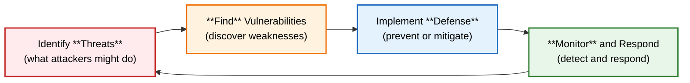

# Domain Knowledge Reference

Auto-generated from blog posts. Do not edit manually.
Last updated: 2026-03-03

---

## Source: fundamentals-of-software-security

URL: https://jeffbailey.us/blog/2025/12/02/fundamentals-of-software-security

## Introduction

Why do some apps protect user data while others leak sensitive info? The key is understanding the fundamentals of software security.

Software security protects systems by safeguarding data and users from attacks, preventing breaches, and maintaining trust. Poor security causes data leaks and financial and reputational losses.

Most developers understand security but lack fundamentals, leading to systems that work in development but fail under attack. This article explains how security works and why it matters, complementing [software development fundamentals](/blog/2025/10/02/fundamentals-of-software-development/).

This article explains core mental models like the CIA triad and TFDM loop, helping you understand security, attack, defense, or failure modes.

**What this is (and isn't):** This article explains security principles and trade-offs, focusing on why security works and how core pieces fit together, but it doesn't cover every attack vector or provide a complete security checklist.

**Why software security fundamentals matter:**

* **Protect user data** - Understanding security helps prevent data breaches and protect privacy.
* **Maintain trust** - Secure systems build user confidence and protect reputation.
* **Reduce risk** - Security fundamentals help you identify and mitigate risks early.
* **Compliance** - Many regulations require security measures, and understanding fundamentals helps meet requirements.

Mastering security fundamentals moves you from hoping systems are secure to knowing they protect users and data.

This article outlines a basic workflow for every project:

1. **Identify threats** – understand what attackers might do to your system.
2. **Find vulnerabilities** – discover weaknesses that attackers could exploit.
3. **Implement defenses** – add security controls that prevent or mitigate attacks.
4. **Monitor and respond** – detect attacks and respond to security incidents.


> Type: **Explanation** (understanding-oriented).  
> Primary audience: **all levels** - developers and security engineers learning security fundamentals

### Prerequisites & Audience

**Prerequisites:** You should be familiar with basic software development concepts and system architecture. Familiarity with [software development fundamentals](/blog/2025/10/02/fundamentals-of-software-development/) is helpful but not required. No prior security experience is needed.

**Primary audience:** Beginner to intermediate developers seeking a stronger foundation in software security.

**Jump to:** [What is Software Security?](#section-1-what-is-software-security--protecting-systems-and-data) | [Threats](#section-2-threats--understanding-what-attackers-do) | [Vulnerabilities](#section-3-vulnerabilities--finding-weaknesses) | [Authentication and Authorization](#section-4-authentication-and-authorization--verifying-identity-and-permissions) | [Encryption](#section-5-encryption--protecting-data) | [Secure Development Practices](#section-6-secure-development-practices--building-security-in) | [Case Study](#section-7-case-study--securing-a-web-application) | [Evaluating Security](#section-8-evaluating-and-validating-security) | [Common Mistakes](#section-9-common-security-mistakes--what-to-avoid) | [Misconceptions](#section-10-misconceptions-and-when-not-to-use) | [Glossary](#glossary)

**Beginner Path:** If you're new to software security, read Sections 1–3 and the Case Study (Section 7), then go to Common Mistakes (Section 9). Return later for authentication, encryption, and advanced topics.

**Escape routes:** If you need a refresher on threats and vulnerabilities, read Sections 2 and 3, then skip to Section 9: Common Security Mistakes.

### TL;DR – Software Security Fundamentals in One Pass

The core workflow: **Identify Threats → Find Vulnerabilities → Implement Defenses → Monitor and Respond**. Remember this as the **TFDM loop**:

* **T – Threats:** Understand what attackers might do.
* **F – Find:** Discover weaknesses in your system.
* **D – Defenses:** Add security controls to prevent attacks.
* **M – Monitor:** Detect attacks and respond to incidents.

*Screen reader note: The diagram below shows the four-step TFDM workflow (Threats → Find → Defenses → Monitor).*



Any time you feel lost in security work, ask one question: *Where am I in the TFDM loop right now, Threats, Find, Defenses, or Monitor?*

### Learning Outcomes

By the end of this article, you will be able to:

* Explain **why** threats matter and how to identify them for your system. *(Sections 1–2)*
* Describe **why** vulnerabilities exist and how to find them systematically. *(Sections 1 & 3)*
* Explain **why** authentication differs from authorization and when to use each approach. *(Section 4)*
* Explain how encryption protects data and when different encryption methods apply. *(Section 5)*
* Describe how secure development practices integrate security into the development process. *(Section 6)*
* Explain how security monitoring detects attacks and enables response. *(Sections 6–8)*

## Section 1: What is Software Security? – Protecting Systems and Data

Think of software security like door locks. It checks if your system protects data and users from unauthorized access, ensuring security before attackers find weaknesses.

### Understanding Software Security

Software security protects systems, data, and users from threats by building systems that resist attacks and protect what matters from the start, not just adding security features.

**Security goals:** Software security has three main goals:

* **Confidentiality** – data remains private and accessible only to authorized users.
* **Integrity** – data remains accurate and unmodified by unauthorized changes.
* **Availability** – systems remain accessible to authorized users when needed.

These goals comprise the CIA triad, a core security model. Security measures safeguard one or more of these goals.

### Why Software Security Matters

Development systems often fail under attack; security fundamentals help close that gap before attackers find it.

**Protect user data:** Security prevents data breaches exposing sensitive info like passwords, financial data, and personal details.

**Maintain trust:** Secure systems build user confidence, but security incidents harm reputation and drive users away.

**Reduce risk:** Security fundamentals help identify and mitigate risks early, reducing security incident likelihood and impact.

**Compliance:** Many regulations require security measures, and understanding fundamentals helps meet standards like GDPR, HIPAA, and PCI DSS.

### The Software Security Workflow (TFDM Loop)

Software security uses a process called the **TFDM Loop**.

* **Identify Threats** – understand what attackers might do to your system.

* **Find Vulnerabilities** – discover the weaknesses they could exploit.

* **Implement Defenses** – add security controls that prevent or mitigate attacks.

* **Monitor and Respond** – detect attacks and respond to security incidents.

Integrate security early so each step builds on the last: threats identify risks, vulnerabilities reveal weaknesses, defenses prevent attacks, and monitoring detects incidents and triggers a response. Any time you're working on security, you should be able to point to where you are in the **TFDM loop**.

## Section 2: Threats – Understanding What Attackers Do

*This section deep-dives Step 1: Identify Threats from the software security workflow.*

Threats are attacks that could harm your system. In a web app where users create accounts and manage personal info (as in the case study), understanding threats helps prioritize security.

Think of threats as potential attackers with goals like stealing data, disrupting service, or modifying info. Knowing motives aids in defending against them.

### Common Threat Types

Different threats target various security goals.

**Data theft:** Attackers steal sensitive info like credentials, financial data, or intellectual property.

**Service disruption:** Attackers block legitimate users via denial of service attacks.

**Data modification:** Attackers modify data to cause harm, such as changing financial records or permissions.

**Unauthorized access:** Attackers access unauthorized systems or data.

**Privilege escalation:** Attackers gain excessive permissions.

### Threat Modeling

Threat modeling systematically identifies threats by understanding your system, assets, and potential attacker actions.

**Identify assets:** What does your system protect? User data, financial info, intellectual property, system uptime.

**Identify attackers:** Who might attack your system? External attackers, insiders, competitors, and nation-states.

**Identify attack vectors:** How might attackers access your system? Through network attacks, application vulnerabilities, social engineering, or physical access.

**Prioritize threats:** Which threats matter most? Focus security on likelihood and impact.

Threat modeling helps identify security risks and prioritize defenses; it's an ongoing, evolving process.

### Why Threats Matter

Understanding threats helps you:

* **Prioritize security efforts** – focus on threats that matter most for your system.
* **Design appropriate defenses** – choose security controls that address specific threats.
* **Communicate risk** – explain security concerns to stakeholders in terms of threats and impacts.

Without understanding threats, you can't effectively secure your system. You might protect against the wrong things or miss critical risks.

### Quick Check: Understanding Threats

Test your understanding:

* Can you identify your system's main assets?
* Do you know who might attack your system and why?
* Have you considered various attack vectors attackers might use?

**Answer guidance:** **Ideal result:** Identify assets, potential attackers, and attack vectors; prioritize threats by likelihood and impact.

If you found gaps, review the threat modeling process and apply it to your system.

## Section 3: Vulnerabilities – Finding Weaknesses

*This section deep-dives Step 2: Find Vulnerabilities from the software security workflow.*

Vulnerabilities are weaknesses attackers can exploit, like unlocked doors. In our web app example, these flaws—such as unsafe SQL queries or missing access checks—could let attackers steal or change data. Detecting them early seals these doors before attackers find them.

### Common Vulnerability Types

Different vulnerabilities lead to various risks.

#### Quick Reference: Vulnerability → Risk → Prevention

**Injection**

*Primary Risk:* Data theft, modification

*Prevention:* Parameterized queries, input validation, output encoding
--card--
**Broken auth**

*Primary Risk:* Account takeover

*Prevention:* MFA, hashing, strong password policies
--card--
**Broken access control**

*Primary Risk:* Unauthorized access

*Prevention:* Consistent authorization checks
--card--
**Crypto failures**

*Primary Risk:* Confidentiality loss

*Prevention:* Strong algorithms, proper key management
**Injection vulnerabilities:** Attackers inject malicious code or data that your system executes or processes unsafely. Common examples include SQL injection and command injection.

**Authentication vulnerabilities:** Weak authentication lets attackers impersonate users or access accounts unlawfully.

**Authorization vulnerabilities:** Flaws in permission checks let attackers access unauthorized resources.

**Cryptographic vulnerabilities:** Weak encryption or poor key management lets attackers decrypt data or bypass security.

**Configuration vulnerabilities:** Misconfigured systems reveal sensitive info or grant unnecessary access.

**Input validation vulnerabilities:** Systems without input validation let attackers submit malicious data causing harm.

### Finding Vulnerabilities

Finding vulnerabilities requires systematic approaches.

**Code review:** Review code for security issues like injection, authentication, and authorization flaws.

**Security testing:** Use tools such as static analysis to scan code, dynamic analysis to test applications, and penetration testing to simulate attacks to detect vulnerabilities.

**Dependency scanning:** Check third-party libraries and dependencies for vulnerabilities.

**Threat modeling:** Use threat modeling to identify vulnerabilities based on attack vectors.

**Security audits:** Regular security audits identify vulnerabilities early.

### The OWASP Top 10

The Open Web Application Security Project (OWASP) keeps a list of the top 10 most critical web app security risks. Treat it as a reference, not a checklist to memorize. If you're new to security, focus on how it relates to vulnerability types we've discussed.

1. **Broken Access Control** – failures in authorization that allow unauthorized access.
2. **Cryptographic Failures** – weaknesses in encryption or key management.
3. **Injection** – vulnerabilities that allow attackers to inject malicious code.
4. **Insecure Design** – security flaws in system design.
5. **Security Misconfiguration** – incorrect security settings.
6. **Vulnerable and Outdated Components** – using components with known vulnerabilities.
7. **Authentication and Session Management Failures** – weaknesses in authentication systems.
8. **Software and Data Integrity Failures** – failures to verify software and data integrity.
9. **Security Logging and Monitoring Failures** – insufficient logging and monitoring.
10. **Server-Side Request Forgery (SSRF)** – vulnerabilities that allow attackers to make requests from the server.

These vulnerabilities are common because they're easy to introduce and hard to detect. As a beginner, pay special attention to:

* **Broken access control** – connects directly to the authorization problems discussed earlier.

* **Injection** – ties into input validation and safe database access.

* **Security misconfiguration** – often shows up as "insecure defaults" or forgotten settings.

Understanding these patterns helps you avoid common mistakes instead of chasing many bugs.

### Why Vulnerabilities Matter

Finding vulnerabilities helps you:

* **Fix issues before attacks** – address weaknesses before attackers discover them.
* **Prioritize security work** – focus on vulnerabilities that pose the greatest risk.
* **Improve security posture** – systematically reduce attack surface over time.

Without identifying vulnerabilities, you can't effectively secure your system and may have unknown critical weaknesses.

### Quick Check: Finding Vulnerabilities

Test your understanding:

* Can you identify common vulnerability types in your codebase?
* Do you use systematic approaches to find vulnerabilities?
* Have you checked your dependencies for known vulnerabilities?

**Answer guidance:** **Ideal result:** Identify vulnerability types, systematically find them, and regularly check dependencies. Prioritize vulnerabilities by risk.

If you found gaps, review the vulnerability types above and apply systematic finding approaches to your system.

## Section 4: Authentication and Authorization – Verifying Identity and Permissions

*This section explores authentication and authorization, key defenses in software security.*

Authentication and authorization are key security controls that ensure only authorized users access resources.

Think of authentication as showing ID to enter a building, and authorization as having the right keycard for specific floors. Authentication verifies your identity, while authorization determines your permissions.

### Authentication: Verifying Identity

Authentication confirms users' identities, answering: "Are you really this person?"

**Authentication factors:** Authentication uses one or more factors to verify identity:

* **Something you know** – passwords, PINs, security questions.
* **Something you have** – security tokens, smart cards, mobile devices.
* **Something you are** – biometrics like fingerprints or facial recognition.

**Multi-factor authentication (MFA):** Using multiple factors enhances security. Multi-factor authentication needs two or more factors, making it tougher for attackers to impersonate users.

**Usable security:** Strong authentication must be usable; if MFA is too painful, users may avoid or bypass it, creating risks. The aim is to increase attacker costs without burdening legitimate users.

**Password security:** Passwords are common but often weak. Implementing strong password policies, hashing, and using password managers can enhance security.

**Session management:** After authentication, systems maintain sessions to prevent re-authentication and ensure security by avoiding hijacking and proper expiration.

### Authorization: Controlling Access

Authorization defines what users can do, answering: "Are you allowed to do this?"

**Access control models:** Different models control access:

* **Role-based access control (RBAC)** – users have roles, roles have permissions.
* **Attribute-based access control (ABAC)** – access based on user attributes, resource attributes, and environmental conditions.
* **Discretionary access control (DAC)** – resource owners control access.
* **Mandatory access control (MAC)** – system-enforced access policies.

**Principle of least privilege:** Users should have minimal permissions to limit damage if accounts are compromised.

**Access control enforcement:** Systems must enforce authorization checks consistently; missing or misplaced checks create vulnerabilities.

### Authentication vs. Authorization

Authentication and authorization work together but serve different purposes:

**Authentication:** Verifies identity. "Who are you?"

**Authorization:** Controls access. "What can you do?"

You need both. Without authentication, anyone can access everything; without authorization, you don't know who is accessing resources.

#### Quick Comparison: Authentication vs. Authorization

*Comparison of authentication and authorization, their questions, and common failure modes.*

**Authentication**

**Core question:** "Who are you?"

**Example:** Showing your ID at the front desk

**Data used:** Passwords, MFA, biometrics

**Typical failures:** Account takeover, weak passwords
--card--
**Authorization**

**Core question:** "What are you allowed to do?"

**Example:** Your keycard only opens certain doors

**Data used:** Roles, permissions, attributes, policies

**Typical failures:** Broken access control, privilege escalation
### Common Authentication and Authorization Mistakes

**Weak passwords:** Allowing weak passwords risks account compromise.

**Missing authorization checks:** Forgetting to check permissions risks unauthorized access.

**Insecure session management:** Weak session handling permits session hijacking.

**Privilege escalation:** Allowing users to gain excessive permissions.

**Broken access control:** Authorization checks that can be bypassed or are faulty.

### Why Authentication and Authorization Matter

Authentication and authorization are fundamental because:

* **They control access** – they're the primary mechanism for preventing unauthorized access.
* **They're required everywhere** – almost every system needs authentication and authorization.
* **They're often implemented incorrectly** – common mistakes create vulnerabilities.

Understanding authentication and authorization helps avoid mistakes by ensuring correct implementation.

### Quick Check: Authentication and Authorization Controls

Test your understanding:

* Can you explain the difference between authentication and authorization?
* Do you use multi-factor authentication where appropriate?
* Have you implemented the principle of least privilege?

**Answer guidance:** **Ideal result:** You understand the difference between authentication and authorization, use multi-factor authentication, and implement least privilege. Your authorization checks are consistent and can't be bypassed.

If you found gaps, review the authentication and authorization concepts above and apply them to your system.

## Section 5: Encryption – Protecting Data

*This section deep-dives encryption, a critical defense for protecting data.*

Encryption protects data by making it unreadable without the correct key. It's essential for protecting data in transit and at rest.

Think of encryption like a safe. You put valuable items in the safe and lock it with a key. Without the key, the items are inaccessible. Encryption works similarly for data.

### How Encryption Works

Encryption converts plaintext into ciphertext with an algorithm and key; decryption reverses this process using the same or a related key.

**Symmetric encryption:** The same key encrypts and decrypts data, making it fast and efficient but requiring secure key distribution.

**Asymmetric encryption:** Different keys encrypt and decrypt data; a public key encrypts, a private key decrypts. It allows secure communication without sharing secrets but is slower than symmetric encryption.

**Hybrid approaches:** Systems often combine symmetric and asymmetric encryption. Asymmetric encryption secures key exchange, symmetric encryption secures data.

### Encryption in Transit vs. at Rest

Encryption protects data in different states:

**Encryption in transit:** Protects data while it moves between systems. Transport Layer Security (TLS) encrypts web traffic, preventing attackers from reading data in transit.

**Encryption at rest:** Protects data stored on disk or in databases. It prevents attackers who gain access to storage from reading data.

Both matter. Encrypting only in transit risks data exposure if storage is accessed; encrypting only at rest leaves data vulnerable during transmission.

### Key Management

Key management is vital for encryption; poor management renders encryption ineffective.

**Key generation:** Use cryptographically secure random number generators for keys; weak randomness leads to predictable keys.

**Key storage:** Store keys securely. Hardcoding keys in code, storing keys in version control, or using weak key storage defeats encryption.

**Key rotation:** Rotate keys periodically. Compromised keys should be rotated immediately.

**Key access control:** Limit who can access keys. Unauthorized key access compromises encryption.

### Common Encryption Mistakes

**Weak algorithms:** Using outdated or weak encryption algorithms that attackers can break.

**Poor key management:** Storing keys insecurely, using weak keys, or not rotating keys.

**Encrypting the wrong things:** Encrypting data that doesn't need protection or not encrypting sensitive data.

**Misunderstanding encryption scope:** Thinking encryption solves all security problems or protects against all threats.

### Why Encryption Matters

Encryption is vital for protecting sensitive info and often mandated by rules. However, it can be tricky to implement correctly. Knowing how encryption works and where it can fail enables effective use instead of just ticking a box.

### Quick Check: Encryption Implementation

Test your understanding:

* Do you encrypt sensitive data in transit and at rest?
* Are your encryption keys managed securely?
* Do you use strong, current encryption algorithms?

**Answer guidance:** **Ideal result:** You encrypt sensitive data in transit and at rest, manage keys securely, and use strong encryption algorithms. You understand the scope and limitations of encryption.

If you found gaps, review encryption concepts above and apply them to your system.

## Section 6: Secure Development Practices – Building Security In

*This section deep-dives secure development practices that integrate security into the development process.*

Secure development practices integrate security into software development from the start. They prevent security issues rather than fixing them later.

Think of secure development like building a house with security features from the foundation up, rather than adding locks after construction. It's easier, cheaper, and more effective than retrofitting security later.

### Security by Design

Security by design means considering security throughout the development process, not as an afterthought.

**Threat modeling:** Identify threats and design defenses during design, not after implementation.

**Secure architecture:** Design systems with security in mind. Consider attack surfaces, trust boundaries, and security controls.

**Defense in depth:** Use multiple layers of security controls. If one fails, others provide protection.

**Fail securely:** Systems should fail in secure states. Errors shouldn't expose sensitive information or create vulnerabilities.

### Secure Coding Practices

Secure coding practices prevent common vulnerabilities:

**Input validation:** Validate and sanitize all input. Don't trust user input.

**Output encoding:** Encode output to prevent injection attacks. Don't output user input without encoding.

**Error handling:** Handle errors securely. Don't expose sensitive information in error messages.

**Cryptography:** Use established cryptographic libraries, not custom implementations. Follow best practices for key management.

**Dependencies:** Keep dependencies up to date and scan for vulnerabilities.

### Security Testing

Security testing finds vulnerabilities before production:

**Static analysis:** Automated tools scan code for security issues.

**Dynamic analysis:** Tools test running applications for vulnerabilities.

**Penetration testing:** Security experts simulate attacks to find vulnerabilities.

**Dependency scanning:** Tools check dependencies for known vulnerabilities.

**Security code review:** Security-focused code reviews find issues automated tools miss.

### Security in the Development Lifecycle

Integrate security throughout the development lifecycle:

**Requirements:** Include security requirements in specifications.

**Design:** Consider security during architecture and design.

**Implementation:** Follow secure coding practices during development.

**Testing:** Include security testing in test plans.

**Deployment:** Secure deployment processes and configurations.

**Operations:** Monitor for security issues and respond to incidents.

### Why Secure Development Practices Matter

Secure development practices are essential because:

* **They prevent issues** – finding and fixing security problems early is cheaper and easier than fixing them later.
* **They're more effective** – building security in is better than retrofitting it.
* **They reduce risk** – fewer vulnerabilities mean fewer opportunities for attackers.

Understanding secure development practices helps you build more secure systems from the start.

### Quick Check: Secure Development Integration

Test your understanding:

* Do you consider security during design and development?
* Do you use security testing to find vulnerabilities?
* Have you integrated security into your development lifecycle?

**Answer guidance:** **Ideal result:** You consider security throughout development, perform security testing, and integrate security into your lifecycle. You follow secure coding practices and keep dependencies updated.

If gaps are found, review and integrate secure development practices into your process.

## Section 7: Case Study – Securing a Web Application

Let's walk through securing a web application to see how security fundamentals work together.

### The Application

Throughout this article, we've referenced a simple web application that allows users to create accounts, log in, and manage their personal information. Let's now use that same app explicitly to see how security fundamentals work together.

### Identifying Threats

First, we identify threats:

* **Data theft** – attackers might steal user credentials or personal information.
* **Unauthorized access** – attackers might gain access to user accounts.
* **Data modification** – attackers might change user data or permissions.
* **Service disruption** – attackers might prevent legitimate users from accessing the system.

### Finding Vulnerabilities in the Application

Next, we look for vulnerabilities:

* **Weak authentication** – simple passwords, no multi-factor authentication.
* **SQL injection** – user input directly used in database queries.
* **Broken access control** – users can access other users' data.
* **Insecure session management** – sessions don't expire, session tokens predictable.
* **Missing encryption** – data transmitted and stored without encryption.

### Implementing Defenses

We implement defenses:

* **Strong authentication** – require strong passwords, implement multi-factor authentication.
* **Input validation** – validate and sanitize all user input, use parameterized queries.
* **Access control** – verify users can only access their own data.
* **Secure sessions** – use secure, random session tokens, implement session expiration.
* **Encryption** – use Transport Layer Security (TLS) for data in transit, encrypt sensitive data at rest.

### Monitoring and Response

We add monitoring:

* **Log security events** – authentication failures, authorization denials, suspicious activity.
* **Monitor for attacks** – detect common attack patterns.
* **Incident response plan** – know how to respond to security incidents.

### How TFDM and CIA Fit Together in This App

This web application also shows how the **TFDM loop** and the **CIA triad** work together in practice:

* **Threats (T)** – Data theft and unauthorized access threaten **confidentiality**. Service disruption threatens **availability**. Data modification threatens **integrity**.

* **Find (F)** – When you identify weak authentication, SQL injection, or broken access control, you're finding specific vulnerabilities that could break confidentiality, integrity, or availability.

* **Defenses (D)** – Strong authentication and access control protect confidentiality and integrity. TLS and encryption at rest protect confidentiality. Secure sessions and input validation reduce attack surface across all three.

* **Monitor (M)** – Logging failed logins, unusual access patterns, and suspicious queries helps you detect attacks on all three CIA goals and respond before damage grows.

This mapping is the point of security fundamentals: you learn one small set of mental models—TFDM and CIA—and then apply them to any system, not just this simple web application.

### Lessons Learned

This case study shows:

* **Security is systematic** – follow the threat, vulnerability, defense, monitor workflow.
* **Multiple defenses matter** – use defense in depth, don't rely on single controls.
* **Security is ongoing** – monitor for new threats and vulnerabilities.

Security fundamentals apply to any system. The specific threats, vulnerabilities, and defenses vary, but the approach remains the same.

## Section 8: Evaluating and Validating Security

Evaluating security helps you understand how well your system resists attacks and where to improve.

### Security Assessment Methods

Different methods evaluate different aspects of security:

**Vulnerability scanning:** Automated tools scan systems for known vulnerabilities.

**Penetration testing:** Security experts simulate attacks to find vulnerabilities and test defenses.

**Security audits:** Systematic reviews of security controls and practices.

**Code review:** Security-focused code reviews find vulnerabilities in implementation.

**Threat modeling:** Systematic identification of threats and evaluation of defenses.

### Security Metrics

Metrics help you measure security:

**Vulnerability count:** Number of known vulnerabilities, severity distribution.

**Time to fix:** How quickly vulnerabilities are addressed.

**Security test coverage:** Percentage of code or functionality covered by security testing.

**Incident frequency:** Number and severity of security incidents.

**Compliance status:** Adherence to security standards and regulations.

Metrics help you track security over time and identify areas for improvement.

**Example:** A team might track high-severity vulnerabilitiesfix times. Repeated issues or increasing fix times signal the need for better design, testing, or training in that area. per sprint and 

### Security Validation

Validation confirms security controls work:

**Test authentication:** Verify authentication prevents unauthorized access.

**Test authorization:** Verify authorization controls access correctly.

**Test encryption:** Verify encryption protects data effectively.

**Test input validation:** Verify input validation prevents injection attacks.

**Test error handling:** Verify errors don't expose sensitive information.

Validation ensures security controls function as intended.

### Why Evaluation Matters

Evaluating security shows how well your system resists attacks, identifies improvement areas, and confirms if you're meeting requirements. Without it, you won't know if your security measures are effective or just provide a false sense of safety.

### Quick Check: Security Evaluation Methods

Test your understanding:

* Do you regularly assess your system's security?
* Do you use metrics to track security over time?
* Have you validated that your security controls work?

**Answer guidance:** **Ideal result:** You regularly assess security, track it with metrics, validate controls, and systematically address improvements.

If you found gaps, review security evaluation methods and apply them to your system.

## Section 9: Common Security Mistakes – What to Avoid

Common security mistakes create vulnerabilities. Understanding them helps you avoid them.

### Trusting User Input

Assuming user input is safe creates security issues.

**Incorrect:** Using user input directly in database queries, command execution, or output without validation.

**Correct:** Validate and sanitize all user input using parameterized queries, output encoding, and validation libraries.

### Weak Authentication

Weak authentication enables attackers to impersonate users or access systems unlawfully.

**Incorrect:** Allowing weak passwords, storing them in plaintext, or not using multi-factor authentication.

**Correct:** Require strong passwords, hash them securely, and enable multi-factor authentication for sensitive accounts.

### Missing Authorization Checks

Forgetting to check permissions allows unauthorized access to resources.

**Incorrect:** Assuming users can only access their own data without verifying permissions.

**Correct:** Check authorization for every access request. Verify users have permission before allowing access.

### Insecure Defaults

Using insecure default configurations exposes systems to attacks.

**Incorrect:** Using default passwords, enabling unnecessary services, or leaving debug modes enabled in production.

**Correct:** Change default passwords, disable unnecessary services, and use secure default configurations.

### Poor Error Handling

Error messages that expose sensitive information help attackers understand your system.

**Incorrect:** Showing detailed error messages with stack traces, database structure, or file paths to users.

**Correct:** Show generic error messages to users, log detailed errors securely, and don't expose sensitive information.

### Not Updating Dependencies

Using outdated dependencies with known vulnerabilities creates security risks.

**Incorrect:** Using old versions of libraries with known security vulnerabilities.

**Correct:** Keep dependencies updated, scan for vulnerabilities, and patch promptly.

### Insufficient Logging and Monitoring

Without logging and monitoring, you can't detect attacks or respond to incidents.

**Incorrect:** Not logging security events or monitoring for suspicious activity.

**Correct:** Log authentication attempts, authorization failures, and suspicious activity. Monitor logs for security incidents.

### Quick Check: Avoiding Common Security Mistakes

**Pause and check yourself:**

* Can you identify security mistakes in your current project?
* Do you validate all user input?
* Are your authentication and authorization controls secure?

**What "good" looks like:** Identify security mistakes, validate input, ensure secure authentication and authorization. Use secure defaults, handle errors securely, update dependencies, and log security events.

If you found issues, review the common mistakes above and update your security practices accordingly.

## Section 10: Misconceptions and When Not to Use

Misconceptions about software security cause problems. Understanding them helps avoid issues.

### Misconception: Security Is Only for Production

Security should be integrated during development, not just before production, to prevent problems early and lower remediation costs.

**What to do instead:** Integrate security into your development workflow by considering security during design, following secure coding practices, and testing for security issues during development.

**Example:** Use threat modeling during design, follow secure coding practices during implementation, and include security testing in your test plan.

### Misconception: Encryption Solves All Security Problems

Encryption secures data but doesn't address all security issues. You still need authentication, authorization, input validation, and other controls.

**What to do instead:** Use encryption within a layered security strategy by combining it with other controls.

**Example:** Encrypt sensitive data and ensure strong authentication, proper authorization, and input validation.

### Misconception: Security Tools Are Enough

Security tools assist but can't replace understanding fundamentals. They generate data, but humans must analyze and decide.

**What to do instead:** Use tools to support security, but understand principles. Analyze results and make informed decisions.

**Example:** Use vulnerability scanners to find issues, but also understand why vulnerabilities exist and how to fix them properly.

### Misconception: Security Slows Development

Security doesn't have to slow development. Building security in from the start is faster than fixing security issues later.

**What to do instead:** Integrate security into your development process by considering security during design, following secure coding practices, and testing for security issues.

**Example:** Use secure coding practices, include security testing in your plan, and address security issues promptly.

### When Full-Scale Security Is Overkill

Security fundamentals are broad, but not every project warrants a full enterprise security program. Apply core fundamentals and scale down formal processes when risk is low.

You probably **don't** need comprehensive security when:

* **The system handles no sensitive data**, has no external users, and has no security requirements (like a short-lived internal tool). Basic security may suffice if the risk is low and unlikely to escalate.

* **You're building a prototype** to validate an idea, not a production system. Focus on functionality, and add security before moving to production.

* **You depend on a fully managed platform** where you can't meaningfully change security characteristics. Rely on the platform's security.

In these cases, focus on:

* Understanding what security your system actually needs.

* Following basic security practices like input validation and secure defaults.

* Planning for security when moving to production.

### When Fundamentals Alone Aren't Enough

Security fundamentals are broad, but complex systems, unique needs, or strict rules often require specialists. Start with fundamentals and involve experts when faced with constraints or risks beyond your experience.

**Example:** If you're building a payment system, healthcare platform, or identity provider, fundamentals alone aren’t enough. These systems need specialist review, threat modeling, and regulatory compliance beyond basics.

The fundamentals in this article offer a starting point. Keep learning, testing, and improving your security practices.

### Quick Check: Security Misconceptions

Test your understanding:

* Have you integrated security into your development workflow?

* Do you use encryption as part of a comprehensive security strategy?

* Do you understand security principles, not just use security tools?

**Answer guidance:** **Ideal result:** Security is integrated into your workflow, you use encryption as part of a comprehensive strategy, and you understand security principles. You build security in from the start rather than adding it later.

If you answered no to any question, review the misconceptions above and implement the "What to do instead" actions.

## Building Secure Systems

Building secure systems requires understanding fundamentals and applying them consistently. The workflow we covered, identifying threats, finding vulnerabilities, implementing defenses, and monitoring for attacks, creates systems that protect users and data.

### Future Trends – Why Fundamentals Always Matter

Security tools, threats, and tech will evolve with AI attacks, new cloud services, and regulations. But core principles—understanding threats, finding vulnerabilities, layered defenses, and monitoring—are constant. Frameworks like NIST use different labels but share basic ideas: identifying risks, protecting, detecting, and responding. New tools change how you apply these, not the need for them.

### Key Takeaways

* **Threats identify risks** – understand what attackers might do to prioritize security efforts.

* **Vulnerabilities reveal weaknesses** – find and fix vulnerabilities before attackers exploit them.

* **Authentication and authorization control access** – verify identity and enforce permissions consistently.

* **Encryption protects data** – use encryption to protect sensitive data in transit and at rest.

* **Secure development practices prevent issues** – build security in from the start rather than retrofitting it.

* **Security is ongoing** – monitor for threats, identify vulnerabilities, and continuously improve defenses.

### How These Concepts Connect

Threats define risks, vulnerabilities reveal weaknesses, defenses prevent attacks, and monitoring detects incidents. Understanding threats is vital for prioritizing security. Identifying vulnerabilities is essential to fixing weaknesses. Defenses are necessary to prevent attacks. Monitoring enables detection and response.

These concepts work together: threats guide efforts, vulnerabilities reveal what to fix, defenses prevent attacks, and monitoring enables response.

### Getting Started with Software Security: Your First 5 Steps

If you're new to software security, start with a narrow, repeatable workflow instead of trying to secure everything at once.

1. **Pick one critical feature** in your product as your "security lab".

2. **Identify threats** to that feature: what attackers might do, what they might want.

3. **Find vulnerabilities** in that feature: review code, test for common issues.

4. **Implement defenses** to address the threats and vulnerabilities you found.

5. **Monitor and validate** that your defenses work and detect any issues.

Once this becomes routine for one feature, apply the same workflow to the rest of your product.

### Next Steps

**Immediate actions:**

* Identify threats to a key feature in your project.

* Review code for vulnerabilities like injection and missing authorization.

* Implement basic security controls, such as input validation and secure authentication.

**Learning path:**

* Practice threat modeling for various systems and use cases.

* Learn to use security testing tools to find vulnerabilities.

* Study secure coding practices for your technology stack.

**Practice exercises:**

* Perform a threat model for a web application.

* Review code for security vulnerabilities and fix them.

* Implement authentication and authorization for a simple application.

**Questions for reflection:**

* What threats matter most for your current project?

* Where would security issues cause the most problems for users?

* How can you integrate security into your development workflow?

Software security is an ongoing practice, not a one-time activity, to protect users and data. Building security early is easier than retrofitting. Fundamentals provide a foundation, but continuous learning, testing, and improvement are vital.

### The Software Security Workflow: A Quick Reminder

Before we conclude, here's the core workflow one more time:

*Screen reader note: The diagram below shows the four-step TFDM workflow (Threats → Find → Defenses → Monitor).*

```text
THREATS → FIND → DEFENSES → MONITOR
```

This four-step process involves understanding threats to assess risks, identifying vulnerabilities, implementing defenses, and monitoring to detect incidents.

### Final Quick Check

Before you move on, see if you can answer these out loud:

1. Why do threats matter before you start securing your system?

2. What are two concrete differences between authentication and authorization?

3. When would you choose to encrypt data in transit versus at rest?

4. Why can't security tools replace understanding security fundamentals?

5. In your current product, where would security issues cause the most problems?

If any answer feels fuzzy, revisit the matching section and skim the examples again.

### Self-Assessment – Can You Explain These in Your Own Words?

Before moving on, see if you can explain these concepts in your own words:

* **Threats** – what they are, why they matter, and how to identify them.

* **Vulnerabilities** – what they are, common types, and how to find them.

* **Authentication and authorization** – the difference between them and why both matter.

* **Encryption** – how it works, when to use it, and common mistakes.

* **Secure development practices** – how they integrate security into development.

* **Security monitoring** – why it matters and what to monitor.

If you can explain these concepts clearly, you understand the fundamentals of software security. If any concept is unclear, revisit the relevant section.

Ultimately, every security decision relies on understanding threats, identifying weaknesses, selecting defenses, and monitoring outcomes.

## Glossary

## Related Articles

Use these related fundamentals articles to deepen specific aspects of security, development, and operations:

### Software Engineering

* **[Fundamentals of Software Development](/blog/2025/10/02/fundamentals-of-software-development/)** - Core software development practices that integrate security into the development lifecycle, showing how security fits into the broader development process.

* **[Fundamentals of Software Design](/blog/2025/11/05/fundamentals-of-software-design/)** - Design principles that guide you in building secure systems from the beginning, including how to design for security and avoid common design flaws.

* **[Fundamentals of Software Architecture](/blog/2025/10/19/fundamentals-of-software-architecture/)** - Architectural decisions impacting system security, including designing secure architectures and understanding security trade-offs.

### Engineering Practices

* **[Fundamentals of Backend Engineering](/blog/2025/10/14/fundamentals-of-backend-engineering/)** - Backend security practices like API, database, and server controls protect systems.

* **[Fundamentals of Frontend Engineering](/blog/2025/11/26/fundamentals-of-frontend-engineering/)** - Frontend security considerations include client-side security, secure UIs, and vulnerability protection.

* **[Fundamentals of Software Testing](/blog/2025/11/30/fundamentals-of-software-testing/)** - Security testing approaches include testing for vulnerabilities, validating security controls, and integrating security testing into your test strategy.

### Production Systems

* **[Fundamentals of Monitoring and Observability](/blog/2025/11/16/fundamentals-of-monitoring-and-observability/)** - Security practices for monitoring attacks, tracking events, and responding to incidents.

* **[Fundamentals of Reliability Engineering](/blog/2025/11/17/fundamentals-of-reliability-engineering/)** - Explains how security enhances system reliability and how to build secure, reliable systems, highlighting the link between security and availability.

* **[Fundamentals of Incident Management](/blog/2025/11/16/fundamentals-of-incident-management/)** - Security incident response includes detecting, responding to, and recovering from security incidents using incident management principles.

* **[Fundamentals of Metrics](/blog/2025/11/09/fundamentals-of-metrics/)** - Security metrics and measurement practices help track security posture, measure effectiveness, and support data-driven decisions.

### Data and Infrastructure

* **[Fundamentals of Databases](/blog/2025/09/24/fundamentals-of-databases/)** - Database security includes access control, encryption, and data at rest, focusing on protecting sensitive data in systems.

* **[Fundamentals of Distributed Systems](/blog/2025/10/11/fundamentals-of-distributed-systems/)** - Security challenges in distributed systems include secure communication, trust boundaries, and protecting architectures from attacks.

## References

### Industry Standards and Frameworks

* **OWASP Top 10** – The Open Web Application Security Project maintains a list of the top 10 most critical web application security risks. This resource helps developers understand common vulnerabilities and how to prevent them. [OWASP Top 10](https://owasp.org/www-project-top-ten/)

* **NIST Cybersecurity Framework** – The National Institute of Standards and Technology provides a framework for improving cybersecurity. It offers guidance on identifying, protecting, detecting, responding to, and recovering from cybersecurity threats. [NIST Cybersecurity Framework](https://www.nist.gov/cyberframework)

* **CWE Top 25** – The Common Weakness Enumeration project maintains a list of the most dangerous software weaknesses. This resource helps developers understand common coding errors that create vulnerabilities. [CWE Top 25](https://cwe.mitre.org/top25/)

### Security Best Practices

* **OWASP Secure Coding Practices** – The Open Web Application Security Project provides secure coding practices to help developers write more secure code. [OWASP Secure Coding Practices](https://owasp.org/www-project-secure-coding-practices-quick-reference-guide/)

* **SANS Secure Coding** – The SANS Institute provides resources on secure coding practices and security training. [SANS Security Training](https://www.sans.org/)

### Authentication and Authorization

* **NIST Digital Identity Guidelines** – The National Institute of Standards and Technology provides guidelines for digital identity systems, including authentication and identity proofing. [NIST Digital Identity Guidelines](https://pages.nist.gov/800-63-3/)

### Encryption

* **NIST Cryptographic Standards** – The National Institute of Standards and Technology provides cryptographic standards and guidelines for encryption. [NIST Cryptographic Standards](https://csrc.nist.gov/projects/cryptographic-standards-and-guidelines)

### Threat Modeling Resources

* **OWASP Threat Modeling** – The Open Web Application Security Project provides guidance on threat modeling for web applications. [OWASP Threat Modeling](https://owasp.org/www-community/Threat_Modeling)

### Security Testing Resources

* **OWASP Testing Guide** – The Open Web Application Security Project provides a comprehensive guide to security testing. [OWASP Testing Guide](https://owasp.org/www-project-web-security-testing-guide/)

### Note on Verification

Security practices and threats evolve; this article reflects 2025 best practices, but readers should verify current guidance and stay updated on threats. Security requires continuous learning and adaptation.


---

## Source: fundamentals-of-privacy-and-compliance

URL: https://jeffbailey.us/blog/2025/12/19/fundamentals-of-privacy-and-compliance

## Introduction

Privacy and compliance are engineering constraints on how systems handle personal data.

Most privacy failures are not malicious. They are accidental propagation: personal data shows up in debug logs, analytics events, support exports, backups, and vendor tools.

In this article, I define privacy, compliance, and security in engineering terms. I use a simple data lifecycle model to make data flow and retention explicit, then map that model to practical controls that reduce risk and produce audit-ready evidence.

Privacy and compliance exist because software systems collect personal data at scale and replicate it across multiple systems for reliability and convenience. Once personal data spreads across services, logs, analytics, and vendors, it becomes harder to control access, retention, and deletion. That is the practical engineering problem these disciplines address.

> Type: **Explanation** (understanding-oriented).  
> Primary audience: **beginner to intermediate** developers and tech leads who need a practical mental model, not a pile of policies.

## Scope (what this is and is not)

**Scope:** I cover the fundamentals connecting privacy, compliance, and security, and their role in daily engineering work.

**Not legal advice:** I include checklists and examples, but this isn't a substitute for legal counsel or a complete compliance program.

By the end, this should support a concrete sketch of a system’s personal data lifecycle (collect, store, use, share, retain, delete) and an explicit mapping between privacy goals, security controls, and compliance evidence.

For security foundations, read [Fundamentals of Software Security](/blog/2025/12/02/fundamentals-of-software-security/). Privacy and compliance overlap heavily with security, but they are not the same thing.

## Prerequisites & audience

**Prerequisites:** Comfort with shipping software that includes a database, logs, and a few third-party services.

**Primary audience:** Developers and tech leads responsible for privacy and compliance requirements, who want practical guidance grounded in code, architecture, and operations.

**Jump to:** [The data lifecycle](#a-simple-mental-model-the-data-lifecycle) | [Privacy vs compliance vs security](#tldr-privacy-compliance-and-security-in-one-pass) | [Where teams get surprised](#where-teams-get-surprised-compliance-gotchas) | [Next steps](#practical-next-steps)

**Reading order:** Begin with the TL;DR and data lifecycle for the mental model. For incident response or audits, focus on “What reduces privacy and compliance risk in practice” and “Where teams get surprised (compliance gotchas)."

## TL;DR: Privacy, compliance, and security in one pass

I separate the problem into three questions:

* **Privacy:** What personal data is collected, why it's needed, and the promises made to users.
* **Security:** What controls reduce the chance of unauthorized access, misuse, or loss?
* **Compliance:** What rules apply and what evidence shows they are followed?

One operational rule:

* **If the data flow is unknown, it is not controlled**.

## A simple mental model: the data lifecycle

Most privacy failures come from not thinking end-to-end. I use this lifecycle to make data flow explicit:

* **Collect:** What is asked for and what is inferred (sign-up forms, analytics events, device identifiers).
* **Store:** Databases, object stores, caches, backups, data warehouses.
* **Use:** Product features, internal tooling, support workflows, machine learning (when relevant).
* **Share:** Vendors, integrations, exports, internal data access.
* **Retain:** How long data is kept, including logs and backups.
* **Delete:** What deletion means across primary stores, replicas, and backups.

Treat the inability to quickly sketch a system's lifecycle as a risk signal, often indicating unclear downstream copies and retention.

## What privacy means in software

In software, privacy **involves handling personal data appropriately**, based on factors such as user expectations, product promises, and laws.

Personal data is broader than many teams assume. It can include:

* **Direct identifiers:** Names, email addresses, phone numbers.
* **Indirect identifiers:** Device identifiers, cookies, IP addresses (often treated as personal data under many frameworks).
* **Sensitive data:** Health data, location, payment, government IDs, biometric data, and similar types, depending on jurisdiction.

### Privacy has two complex parts

**The first tricky part is minimization.** If it is never collected, it cannot be leaked.

**The second tricky part is propagation.** Once personal data enters logs, metrics, warehouses, chat exports, and vendor tools, it becomes costly to contain.

Propagation is a distributed systems issue, with each new copy adding deletion and access-control challenges, like cache invalidation across replicas.

## What compliance means in software

Compliance is the set of **external rules** that apply to a system, plus the evidence that they are followed.

Some rules come from laws and regulations, such as the [General Data Protection Regulation (GDPR)][GDPR] or the [California Consumer Privacy Act (CCPA)][CCPA].

Some rules come from contracts and industry standards, such as the [Payment Card Industry Data Security Standard (PCI DSS),][PCI] when storing, processing, or transmitting payment card data. Customers may also request a System and Organization Controls 2 (SOC 2) report, which is based on the [AICPA Trust Services Criteria][TSC].

A common engineering gap: compliance requires both correct behavior and evidence that it happened.

### Compliance is easier in boring systems

Compliance tends to favor:

* Clear boundaries (what services touch personal data).
* Least-privilege access (few people and systems can access sensitive data).
* Deterministic retention (data expires on purpose, not by accident).
* Audit trails (allowing reconstruction of who accessed what, when, and why).

Compliance struggles in “it depends” systems.

## Why security is necessary, but not sufficient

Security reduces unauthorized access, misuse, or loss. Privacy raises questions security alone doesn't answer.

* Whether the data should be collected at all.
* Whether it can be used for a new purpose later.
* What users are owed in terms of transparency, consent, and control.

**Example:** Encrypting all data in a database is good security practice, but collecting extra personal data “just in case” can violate privacy principles and legal requirements.

## What reduces privacy and compliance risk in practice

I treat privacy and compliance as engineering constraints in design docs, code reviews, and runbooks, which tend to pay off quickly.

### Maintain a data inventory (and keep it small)

At minimum, track:

* **Data categories:** What is collected (email addresses, postal addresses, purchase history, support messages).
* **Purpose:** Why it is needed (authentication, billing, shipping, fraud prevention).
* **Where it lives:** Systems of record, replicas, analytics, logs.
* **Who can access it:** Humans and services.
* **Retention:** How long it stays, and what triggers deletion.
* **Vendors:** What is shared, and why?

A lightweight way to keep this honest is to store a `data-inventory.yml` in the repo and treat changes like code.

### Collect less data than seems necessary

This is often the best privacy improvement. When debating a new field, ask questions like these:

* Is it required to deliver the feature, or is it “nice to have”?
* Can it be derived on-device or on-the-fly rather than stored?
* Can it be optional, or collected only when the user uses the feature?

### Separate identifiers from content

Architecturally, it helps to keep:

* **Identity stores:** Accounts, authentication, and authorization.
* **Content stores:** User-generated content, files, messages.
* **Event stores:** Analytics events and telemetry.

This makes retention, deletion, and access control less prone to error.

### Treat logs as a data store (because they are)

In practice, logs behave like a database: they are searchable, replicated, and retained.

What tends to work:

* **Redact by default:** Mask emails, tokens, session IDs, and any secrets.
* **Ban high-risk fields:** Never log passwords, authentication tokens, password reset links, payment card numbers, or government identifiers.
* **Set log retention intentionally:** Keep only what is needed for debugging and security monitoring.
* **Restrict access:** Broad access to production logs is a common path to a privacy incident.

This is a trade-off. Logs need enough detail to debug incidents (see [Fundamentals of Incident Management](/blog/2025/11/16/fundamentals-of-incident-management/)), but not so much that logs become a shadow database of personal data.

### Make deletion real (and define what “delete” means)

Deletion usually needs to address:

* Primary database rows.
* Search indexes.
* Caches.
* Data warehouse copies.
* Object storage.
* Backups (often handled via retention and “delete on restore” controls, not immediate purge).

If a product offers “delete my account,” it must define what deletion means for each of those locations.

### Design a process for user rights requests

Many privacy frameworks include user rights like access, correction, and deletion. Having a process, even if not legally required, reduces operational risk.

A process that holds up under pressure usually includes:

* **Intake:** A support ticket or form that triggers a tracked workflow.
* **Identity verification:** Confirm the requester is the user.
* **Data retrieval:** Pull from systems of record first, then downstream systems.
* **Deletion and confirmation:** Delete what is possible, document exceptions, and confirm completion.

## Where teams get surprised (compliance gotchas)

### Vendors are part of the compliance boundary

When personal data is sent to vendors such as analytics tools, support tools, logging systems, or email providers, these details matter:

* What data is shared?
* Whether the vendor is a processor or sub-processor under the applicable framework.
* What contract terms apply (for example, data processing addendums)?
* How deletion is handled when a user requests deletion.

### Access control is compliance, not just security

Expect questions about:

* Who has access to production data?
* Whether access is least-privilege.
* Whether access is logged and reviewed.
* Whether access can be removed quickly when someone leaves.

A team can “feel secure” and still fail this if access is informal.

### Backups and data warehouses break the privacy story

Teams often do the right thing in the application database and then copy everything into:

* A data warehouse with different access controls.
* Long retention backups that nobody can restore safely.
* Analytics tools with permissive sharing.

Data sprawl is often the highest-leverage fix.

## Why privacy work succeeds or fails in practice (workflow lens)

Privacy work usually follows a pattern: teams first reduce uncertainty, then exposure, then sprawl.

One sequence that tends to work:

1. **Draw the data lifecycle.** If the destinations are unknown, the data is not controlled.
2. **Identify the highest-risk data.** This creates clarity on what must never appear in logs, analytics, or wide-access systems.
3. **Reduce who can touch production data.** This shrinks the blast radius of mistakes and insider risk.
4. **Fix logging and retention.** Logs are often the largest uncontrolled copy of personal data.
5. **Make deletion and rights requests coherent.** This forces confrontation with downstream copies, warehouses, and vendors.
6. **Document the boundary.** A small inventory and vendor list turns one-off fixes into a maintainable system.

Good sequences begin by visualizing data flows and then reducing those flows.

## Common misconceptions that waste time

* **“Compliance is paperwork; engineering doesn’t matter.”** Engineering decisions shape data flow; paperwork can't undo data sprawl.
* **“If it’s encrypted, it’s fine.”** Encryption helps, but over-collection and retention still pose privacy risks.
* **“We don’t store personal data.”** If an organization has accounts, logs, analytics, or support tickets, it almost certainly does.
* **“We’ll build this later.”** Privacy debt compounds; once data spreads to five systems, “later” becomes a project.

## Practical next steps

To act on this without boiling the ocean:

* Create a one-page data inventory for the most critical user flows.
* Pick one log source and implement redaction and reduced retention.
* Audit who has access to production data, and remove default access that cannot be justified.
* Define a minimum viable account-deletion process and test it end-to-end.

For more context on the foundations this builds on, start with [Fundamentals of Software Security](/blog/2025/12/02/fundamentals-of-software-security/), [Fundamentals of Databases](/blog/2025/09/24/fundamentals-of-databases/), and [Fundamentals of Monitoring and Observability](/blog/2025/11/16/fundamentals-of-monitoring-and-observability/), then connect those back to privacy outcomes.

## Synthesis

Privacy and compliance are manageable when personal data is viewed as a system boundary, not just a legal note. The key is making data flow visible, reducing it, and demonstrating it remains controlled.

The data lifecycle model (collect, store, use, share, retain, delete) maps data propagation, retention, and undefined deletion points. Security controls reduce risk, and compliance evidence demonstrates that these controls are adequate in production.

## Glossary

## References

* [General Data Protection Regulation (GDPR)][GDPR], for definitions and baseline privacy obligations in the European Union.
* [California Consumer Privacy Act (CCPA)][CCPA], for consumer privacy rights and disclosures in California.
* [National Institute of Standards and Technology (NIST) Privacy Framework][NIST-PRIV], for privacy risk management concepts and vocabulary.
* [National Institute of Standards and Technology (NIST) Cybersecurity Framework][NIST-CSF], for security controls and program structure that often support compliance.
* [Payment Card Industry Data Security Standard (PCI DSS)][PCI], for requirements when handling payment card data.
* [American Institute of Certified Public Accountants (AICPA) Trust Services Criteria][TSC], which underpin SOC 2 examinations.

[GDPR]: https://eur-lex.europa.eu/eli/reg/2016/679/oj
[CCPA]: https://leginfo.legislature.ca.gov/faces/codes_displayText.xhtml?lawCode=CIV&division=3.&title=1.81.5.&part=4.&chapter=&article=
[NIST-PRIV]: https://www.nist.gov/privacy-framework
[NIST-CSF]: https://www.nist.gov/cyberframework
[PCI]: https://www.pcisecuritystandards.org/standards/
[TSC]: https://www.aicpa-cima.com/resources/landing/system-and-organization-controls-soc-suite-of-services
