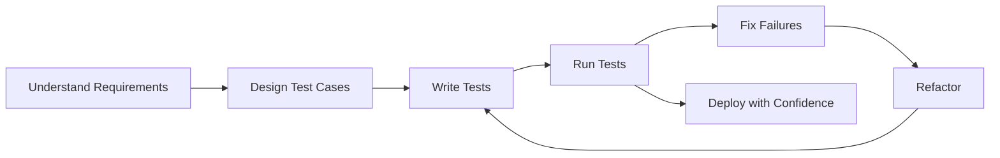
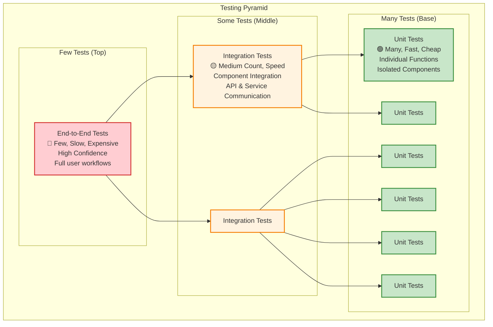
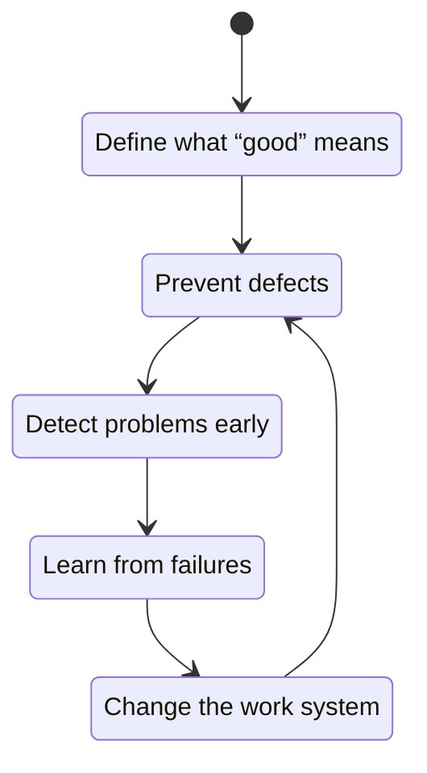

# Domain Knowledge Reference

Auto-generated from blog posts. Do not edit manually.
Last updated: 2026-03-03

---

## Source: fundamentals-of-software-testing

URL: https://jeffbailey.us/blog/2025/11/30/fundamentals-of-software-testing

## Introduction

You've written working code, tested through multiple runs, and interface clicks. Yet, after deployment, users report unexpected bugs.

Sound familiar? This occurs when we confuse "code that runs" with "code that works correctly."

Software testing is about building confidence that your code works correctly under all conditions, not just the manually tested happy path.

Most developers learn testing by writing code first and adding tests later, treating testing as an afterthought. Seeing testing as a confidence system, not just bug-spotting, unlocks reliability and safe refactoring.

This article explains why software testing works and how to build confidence in your code systematically.


> Type: **Explanation** (understanding-oriented).  
> Primary audience: **all levels** - developers learning testing fundamentals and building confidence in code

### What You'll Learn

By the end, you'll be able to:

* Explain what software testing does beyond "finding bugs."
* Describe the main test types and their use cases.
* Understand how TDD, automation, and the testing pyramid fit together.
* Recognize common testing mistakes and avoid them.

## Jump to

[Prerequisites](#prerequisites) | [What You'll Learn](#what-youll-learn) | [What Software Testing Actually Does](#what-software-testing-actually-does) | [The Core Problem Testing Solves](#the-core-problem-testing-solves) | [Why Testing Matters (Conceptual)](#why-testing-matters-conceptual) | [The Software Testing Workflow](#the-software-testing-workflow) | [Types of Testing](#types-of-testing) | [Test-Driven Development (TDD)](#test-driven-development-tdd) | [Test Design Principles](#test-design-principles) | [Test Automation](#test-automation) | [Common Testing Mistakes](#common-testing-mistakes) | [Testing in Practice](#testing-in-practice) | [Examples: What This Looks Like in Practice](#examples-what-this-looks-like-in-practice) | [Troubleshooting: What Could Go Wrong](#troubleshooting-what-could-go-wrong) | [Future Trends in Testing (While Fundamentals Stay the Same)](#future-trends-in-testing-while-fundamentals-stay-the-same) | [Key Takeaways](#key-takeaways)

## Prerequisites

Before diving into testing, understand these foundations:

**Basic Programming Skills:**

* **Writing functions and classes** - You need to write code before you can test it.
* **Understanding control flow** - Know how if/else, loops, and exceptions work.
* **Working with data structures** - Understand lists, dictionaries, and objects.

**Software Development Concepts:**

* **Code organization** - Know how to structure code into modules and functions.
* **Error handling** - Understand how to handle exceptions and edge cases.
* **API design** - Know how to design interfaces that are easy to test.

**Testing Tools (Nice to Have, Not Required):**

* **Test frameworks** – Examples include pytest (Python), Jest (JavaScript), JUnit (Java), or similar.
* **Assertion libraries** – Tools for verifying expected outcomes.
* **Mocking libraries** – Tools for creating fake dependencies for testing.

If you don't know these tools yet, that's okay. You'll see how they fit into the concepts as you read, and you can come back to this section later as a checklist when you choose a framework.

You don't need to be an expert tester; you just need basic programming competency. This guide focuses on the *concepts* that make tests useful, whatever tools you pick.

Now that we've set expectations, let's explore what software testing does and why it matters.

## What Software Testing Actually Does

Software testing verifies that your code behaves correctly under expected and unexpected conditions.

When you write tests, you're answering questions like:

* Does this function return the correct result for valid inputs?
* What happens when someone passes invalid data?
* Does this feature work correctly when other parts of the system fail?
* Can users accomplish their goals with this software?

These are confidence questions, not coverage questions. Understanding them differentiates testing that prevents problems from busywork.

But why do we need systematic testing? Let's examine the core problem it solves.

## The Core Problem Testing Solves

Every software system faces the same fundamental challenge: complexity grows faster than our ability to verify correctness manually.

A simple function might have a few code paths, but as it grows, it must handle edge cases, errors, various input types, and system interactions. Each new feature increases the number of state and behavior combinations.

Without systematic testing, you **resort to manual testing**: clicking through the happy path, assuming success, and hoping users avoid untested edge cases.

Manual testing feels busy, but doesn't build confidence.

Good testing prevents issues through automated checks that verify behavior across various scenarios, acting like a tireless robot that explores as many important paths and edge cases as you design it to test.

**Confidence replaces hope.**

Now that we understand the problem, let's see what well-designed tests actually provide.

## Why Testing Matters (Conceptual)

Well-designed tests reduce uncertainty and enable confident change, transforming software development from "hope it works" to "know it works."

Good tests reduce uncertainty, increase safety, and enable confident code changes. Here's how:

* **Confidence to change code** - When tests pass, you know your changes didn't break existing functionality.
* **Documentation of behavior** - Tests demonstrate how code functions, acting as executable documentation.
* **Early bug detection** - Tests catch problems before they reach users.
* **Design feedback** - If code is hard to test, it's a sign of design issues.

*For actionable steps, see:*

* **How-to:** [Write effective unit tests](https://jeffbailey.us/how-to-write-effective-unit-tests/) (workflow & steps)
* **Reference:** [Testing Checklist](https://jeffbailey.us/reference-testing-checklist/)
* **How-to:** [Add tests to an existing codebase](https://jeffbailey.us/how-to-add-tests-to-existing-codebase/)

With this foundation, let's examine the effective testing process.

## The Software Testing Workflow

Effective testing follows a systematic process:



*Figure 1. The software testing workflow loop.*

Each step builds confidence in functionality, reliability, and maintainability.

**Memory mnemonic:** **"R-T-R-C" — Requirements → Tests → Run → Confidence**

### 1. Understand What You're Testing

First, understand what correct behavior looks like. It isn't easy.

*Ask yourself:* What should this code do? What are the valid inputs? What should happen with invalid inputs? What are the edge cases?

For example, a function calculating shipping costs might have these requirements:

* **Valid inputs:** weight (positive number), distance (positive number)
* **Expected output:** cost in dollars (positive number)
* **Edge cases:** zero weight, zero distance, huge numbers, negative numbers

Each requirement is a behavior to verify. Knowing requirements beforehand prevents testing the wrong behavior.

### 2. Design Test Cases

Once you know what correct behavior looks like, design test cases that verify it.

*The key question is:* What scenarios will verify this code behaves correctly?

Think of test cases as experiments. Each sets specific conditions and checks a specific outcome. Good test cases are:

* **Specific** - Each test verifies one behavior
* **Independent** - Tests don't depend on each other
* **Repeatable** - Running the same test multiple times produces the same result
* **Fast** - Tests run quickly, so you can run them frequently

### 3. Write Tests

Now you write code that implements your test cases. This is where most developers start, but it's the third step for a reason.

Writing tests before understanding requirements results in verifying random behavior rather than the needed behavior.

### 4. Run Tests

Running tests shows if your code works correctly, starting the feedback loop.

### 5. Fix Failures

When tests fail, it indicates either a code error or a test mistake. Both offer valuable feedback.

If the code is wrong, the test catches bugs before users; if the test is incorrect, it clarifies your understanding of the code's purpose.

### 6. Refactor with Confidence

Once tests pass, you can refactor code confidently, knowing tests will catch regressions. Testing allows change without fear.

Each step in testing aims to build confidence that your code works correctly. Without systematic thinking, bugs grow faster than they can be fixed.

**Quick Check (1 min) — Why Each Step?**

1. Why understand requirements before writing tests? (**To ensure tests verify the correct behavior.**)
2. How does refactoring with tests improve code quality? (**It enables safe changes that improve design without breaking functionality.**)

**Reflection:** Consider your recent code. How would it change if you understood requirements and designed test cases before coding?

**Mini-Recap:** You now understand what testing is (confidence, not coverage), why complexity makes testing necessary, and where value comes from (early detection and safe refactoring). Next, we'll break down the types of tests and when to use them.

## Types of Testing

Different problems need different testing types:

Think of test types like building with Lego: **Unit tests** check each brick in isolation, **Integration tests** snap sections together to see if they connect, and **End-to-end tests** play with the whole castle to verify the complete experience.

### Unit Testing

Unit tests verify functions in isolation. They're fast, focused, and form the foundation of your test suite.

**When to use:** Testing small functions, methods, or components.

**Trade-offs:** Fast and focused, but don't catch integration issues.

**If you rely only on unit tests:** Individual pieces may look correct, but user flows can break when components interact.

```python
def test_calculate_shipping_cost():
    # Test normal case
    assert calculate_shipping_cost(weight=5, distance=100) == 10.50
    
    # Test edge case: zero weight
    with pytest.raises(ValueError):
        calculate_shipping_cost(weight=0, distance=100)
    
    # Test edge case: negative distance
    with pytest.raises(ValueError):
        calculate_shipping_cost(weight=5, distance=-10)

def calculate_shipping_cost(weight, distance):
    if weight <= 0:
        raise ValueError("Weight must be positive")
    if distance <= 0:
        raise ValueError("Distance must be positive")
    return weight * distance * 0.021
```

### Integration Testing

Integration tests assess how system components collaborate, emphasizing interactions rather than individual components.

**When to use:** Testing API endpoints, database interactions, service communication.

**Trade-offs:** More realistic, but slower and more complex than unit tests.

**If you skip integration tests:** Components may work in isolation but fail when communicating with databases, APIs, or services.

```python
def test_user_registration_flow(database, email_service):
    # Test that user registration creates a user and sends a welcome email
    user_data = {"email": "test@example.com", "name": "Test User"}
    
    result = register_user(user_data, database, email_service)
    
    assert result["id"] is not None
    assert database.user_exists(result["id"])
    assert email_service.welcome_email_sent(result["id"])
```

### System Testing

System tests verify the entire system end-to-end from the user's perspective.

**When to use:** Testing complete user workflows, verifying system behavior under load.

**Trade-offs:** Most realistic, but slowest and most brittle.

```python
def test_complete_purchase_flow(browser):
    # Test that a user can browse products, add to cart, and complete purchase
    browser.visit("/products")
    browser.click("Add to Cart")
    browser.visit("/cart")
    browser.click("Checkout")
    browser.fill("email", "user@example.com")
    browser.fill("card", "4111111111111111")
    browser.click("Purchase")
    
    assert browser.has_text("Order Confirmed")
    assert browser.has_text("Order #12345")
```

### Acceptance Testing

Acceptance tests verify the system meets business requirements, written from the user's perspective to confirm features deliver value.

**When to use:** Verifying features meet requirements and user stories.

**Trade-offs:** Business-focused but might miss technical issues.

### The Testing Pyramid

Mike Cohn's testing pyramid illustrates the ideal distribution of test types.



The pyramid suggests many fast unit tests, some integration tests, and a few slow end-to-end tests to balance speed, confidence, and maintenance.

**Memory mnemonic:** **"U-I-E = Units first, Integrations next, E2E sparingly."**

**When NOT to rely on E2E tests alone:** If most tests are at the top of the pyramid, your suite will be slow and flaky. Use E2E tests for critical user journeys, not for every tiny behavior.

**Failure mode:** If most tests are E2E, your pipeline slows and reliability collapses.

#### Quick Check — Matching Tests to Problems

* Which test type would you use to verify that a single pricing function behaves correctly?
* Which test type verifies a signup flow involving the database and email?
* What happens to test speed if you invert the pyramid and write mostly E2E tests?

**Reflection:** What's the current distribution of test types in your project? Does it match the testing pyramid, or is it inverted?

**Mini-Recap:** You now understand the main test types (unit, integration, system, acceptance), the testing pyramid, and when to use each. Next, we'll explore writing tests effectively with Test-Driven Development.

## Test-Driven Development (TDD)

Test-Driven Development (TDD) is a way of writing tests before code so behavior drives design.

The TDD cycle has three steps:

1. **Red** - Write a failing test for the behavior you want
2. **Green** - Write the minimum code to make the test pass
3. **Refactor** - Improve the code while keeping tests green

```python
# Step 1: Red - Write a failing test
def test_calculate_total():
    items = [{"price": 10}, {"price": 20}]
    assert calculate_total(items) == 30

# Step 2: Green - Write minimum code to pass
def calculate_total(items):
    return 30  # Simplest implementation

# Step 3: Refactor - Make it actually work
def calculate_total(items):
    return sum(item["price"] for item in items)
```

**Benefits of TDD:**

* **Forces you to think about the interface first** - You design how the code will be used before implementing it
* **Ensures your code is testable** - If you can't write a test, the code is probably too complex
* **Creates a safety net** – Tests catch regressions when you refactor. A **regression** is when something that used to work breaks after a change, usually because a new change disturbed existing behavior.
* **Documents behavior** - Tests show how code should work

**When TDD helps:**

* Building new features from scratch
* Fixing bugs (write a test that reproduces the bug, then fix it)
* Refactoring (write tests first to ensure you don't break anything)

**When TDD might not help:**

* Exploring new technologies or APIs
* Prototyping to understand requirements
* Working with legacy code that's hard to test

TDD isn't a religion. It's a tool that helps you write better code when used appropriately.

Whether you use TDD or write tests afterward, solid design principles make your tests maintainable and effective.

## Test Design Principles

Good tests follow principles that make them maintainable and effective:

### Test One Thing

Each test should verify one specific behavior. When a test fails, you should know exactly what's wrong.

```python
# Bad: Testing multiple things
def test_user_operations():
    user = create_user("test@example.com")
    assert user.email == "test@example.com"
    assert user.is_active == True
    assert user.can_login() == True

# Good: Testing one thing per test
def test_create_user_sets_email():
    user = create_user("test@example.com")
    assert user.email == "test@example.com"

def test_new_user_is_active():
    user = create_user("test@example.com")
    assert user.is_active == True

def test_active_user_can_login():
    user = create_user("test@example.com", active=True)
    assert user.can_login() == True
```

### Use Descriptive Names

Test names should describe what they're testing. A good test name reads like documentation.

```python
# Bad: Unclear what this tests
def test_user():
    # ...

# Good: Clear what this test does
def test_create_user_with_valid_email_returns_user_object():
    # ...

# Better: Describes the scenario
def test_create_user_with_valid_email_returns_user_with_correct_email():
    # ...
```

### Arrange, Act, Assert

Structure tests in three clear sections:

* **Arrange** - Set up test data and conditions
* **Act** - Execute the code being tested
* **Assert** - Verify the results

```python
def test_calculate_discount_applies_10_percent_for_premium_users():
    # Arrange
    user = User(plan="premium")
    price = 100.00
    
    # Act
    discounted_price = calculate_discount(user, price)
    
    # Assert
    assert discounted_price == 90.00
```

### Test Edge Cases

Don't just test the happy path. Test boundary conditions, invalid inputs, and error cases.

```python
def test_clamp_value():
    # Happy path: value within range
    assert clamp(value=5, min_value=0, max_value=10) == 5
    
    # Edge case: value at minimum boundary
    assert clamp(value=0, min_value=0, max_value=10) == 0
    
    # Edge case: value at maximum boundary
    assert clamp(value=10, min_value=0, max_value=10) == 10
    
    # Edge case: value below minimum
    assert clamp(value=-5, min_value=0, max_value=10) == 0
    
    # Edge case: value above maximum
    assert clamp(value=15, min_value=0, max_value=10) == 10
    
    # Invalid input: min greater than max
    with pytest.raises(ValueError, match="min_value must be less than max_value"):
        clamp(value=5, min_value=10, max_value=0)

def clamp(value, min_value, max_value):
    if min_value >= max_value:
        raise ValueError("min_value must be less than max_value")
    return max(min_value, min(max_value, value))
```

This boundary-heavy function is ideal for edge-case testing, as most of its value depends on its behavior at the limits.

### Keep Tests Fast

Slow tests are infrequent; fast tests integrate into development.

```python
# Bad: Slow test that hits the real database
def test_user_creation():
    db = connect_to_real_database()
    user = create_user("test@example.com", db)
    assert user.email == "test@example.com"

# Good: Fast test with mock database
def test_user_creation():
    db = MockDatabase()
    user = create_user("test@example.com", db)
    assert user.email == "test@example.com"
```

#### Quick Check — Test Design Principles

* What's the difference between testing behavior and testing implementation?
* Why should each test verify one specific behavior?
* How does the Arrange-Act-Assert pattern help structure tests?

**Mini-Recap:** You now understand how TDD influences code design and structuring tests. Next, we'll examine how to scale automated testing with your codebase.

#### Quick Check — Mid-Article Reinforcement

Before we move to automation, let's reinforce what you've learned so far:

* What's the difference between unit tests and integration tests?
* Why does the testing pyramid recommend many unit tests and few E2E tests?
* How does TDD differ from writing tests after code?
* What does "test behavior, not implementation" mean in practice?

If you can answer these confidently, you're ready to explore test automation.

## Test Automation

Manual testing doesn't scale; as your codebase grows, automated tests are needed to run consistently and catch regressions.

### Continuous Integration (CI)

Run tests automatically on each code change to catch problems early before they reach others.

You don't need to memorize this configuration or copy it line by line. The key idea, from an *explanation* perspective, is that **CI automatically runs tests on code changes**. The syntax varies by platform, but the pattern remains: checkout code → set up environment → install dependencies → run tests.

Treat the YAML below as a conceptual example of "where tests live" in your pipeline, not a recipe.

```yaml
# Example GitHub Actions workflow
name: Run Tests

on: [push, pull_request]

jobs:
  test:
    runs-on: ubuntu-latest
    steps:
      - uses: actions/checkout@v2
      - name: Install uv
        uses: astral-sh/setup-uv@v3
      - name: Set up Python
        uses: actions/setup-python@v2
        with:
          python-version: '3.9'
      - name: Install dependencies
        run: uv sync
      - name: Run tests
        run: uv run pytest
```

Treat this as a concrete illustration of *what CI does*, not a step-by-step recipe.

When you're ready to implement CI, the important questions are:

* Where do tests run?
* When do they run (push, pull request, scheduled)?
* What has to be set up first (dependencies, environment, secrets)?

The exact YAML will vary by platform, but the pattern stays the same.

### Test Coverage

Test coverage shows the percentage of code run by tests, but it's a helpful metric, not a goal.

**Coverage tells you what's tested, not whether it's tested well.**

Think of it as noting which rooms you've walked through, not whether you checked for leaks, broken outlets, or loose floorboards.

A simple way to choose what to test:

* **Test where the cost of being wrong is high** (money, data loss, security, user trust).
* **Test where the code is likely to change** (complex logic, hotspots, experiments).
* **Relax on trivial, obvious code** where both impact and change likelihood are low.

```python
# 100% coverage, but terrible test
def test_function():
    my_function()  # Calls function, but doesn't verify output

# Lower coverage, but better test
def test_function_returns_correct_result():
    result = my_function(input="test")
    assert result == expected_output
```

Aim for high coverage of essential code paths, not 100% coverage of everything.

### Test Maintenance

Tests are code. They need maintenance just as much as production code.

* **Keep tests simple** - Complex tests are hard to understand and maintain
* **Remove obsolete tests** - Delete tests for features that no longer exist
* **Refactor test code** - Apply the same quality standards to test code as production code
* **Review test failures** - When tests fail, understand why before fixing

#### Quick Check — Test Automation

* Why does CI run tests automatically on every code change?
* What's the difference between test coverage as a metric and as a goal?
* When should you remove obsolete tests?

**Mini-Recap:** You now understand test design, CI/CD automation, and test maintenance. Having learned to write and automate tests, let's explore common mistakes that undermine testing effectiveness.

## Common Testing Mistakes

Most testing problems come from a few common mistakes:

### Mistake 1: Testing Implementation Instead of Behavior

You test how the code works internally instead of what it does.

**Why it's wrong:** Implementation details change, breaking tests despite correct behavior.

**Better approach:** Test the behavior, not the implementation.

**Rule to remember:**

* **Behavior** = what the code does from the outside (inputs, outputs, side effects, errors)
* **Implementation** = how the code is structured on the inside (methods, fields, algorithms)

*Good tests focus on behavior and remain indifferent to implementation.*

```python
# Bad: Testing implementation
def test_calculator():
    calc = Calculator()
    assert calc._multiply(2, 3) == 6  # Testing private method

# Good: Testing behavior
def test_calculator_multiplies_numbers():
    calc = Calculator()
    assert calc.multiply(2, 3) == 6  # Testing public interface
```

### Mistake 2: Writing Tests After Code

You write code first, then add tests as an afterthought.

**Why it's wrong:** Code written without tests is hard to test, leading to tests that verify the code rather than the behavior.

**Better approach:** Write tests first, or at least think about testability while writing code.

### Mistake 3: Brittle Tests

Tests break when you change unrelated code.

**Why it's wrong:** Brittle tests slow down development and create fear of refactoring.

**Better approach:** Test behavior, not implementation. Use mocks and stubs to isolate code under test.

```python
# Bad: Brittle test that depends on implementation
def test_user_email():
    user = User()
    assert user._email_field == "test@example.com"  # Breaks if field name changes

# Good: Stable test that depends on behavior
def test_user_email():
    user = User(email="test@example.com")
    assert user.email == "test@example.com"  # Works regardless of implementation
```

### Mistake 4: Testing Everything

You write tests for every function, even trivial ones.

**Why it's wrong:** Not all code needs tests; simple getters and setters don't require them. Focus on logic, error handling, or system integration.

**Better approach:** Test code that has behavior worth verifying.

```python
# Probably doesn't need a test
class User:
    def __init__(self, name):
        self.name = name
    
    def get_name(self):
        return self.name

# Definitely needs a test
def calculate_shipping_cost(weight, distance):
    if weight <= 0 or distance <= 0:
        raise ValueError("Weight and distance must be positive")
    return weight * distance * 0.021
```

### Testing Mistakes Summary

#### Testing Implementation

* **Why it happens:** Focusing on code structure
* **Better approach:** Test behavior and outcomes

#### Writing Tests After Code

* **Why it happens:** Treating tests as afterthought
* **Better approach:** Write tests first or design for testability

#### Brittle Tests

* **Why it happens:** Coupling tests to implementation
* **Better approach:** Test behavior, use mocks for isolation

#### Testing Everything

* **Why it happens:** Assuming all code needs tests
* **Better approach:** Test code with meaningful behavior

Now that you know what to avoid, let's see how to include testing in your daily development workflow.

## Testing in Practice

If you're comfortable with the concepts and want to see concrete scenarios, this section and the following examples are for you. If skimming, skip to *Troubleshooting* or the *Key Takeaways*, and revisit the examples later.

Testing works best when integrated into your development process rather than as a separate phase. Think "write code and" not "throw code over the wall to QA."

### When to Write Tests

Write tests:

* **Before writing code** (TDD approach)
* **When fixing bugs** (write a test that reproduces the bug first)
* **When refactoring** (ensure tests pass before and after)
* **For new features** (verify they work correctly)

Don't write tests:

* **For trivial code** (simple getters, setters, data structures)
* **When exploring** (prototyping to understand requirements)
* **For code you're about to delete** (waste of time)

### Test Organization

Organize tests parallel to the code they test:

```tree
project/
├── src/
│   ├── user.py
│   └── product.py
└── tests/
    ├── test_user.py
    └── test_product.py
```

Or organize tests near the code they test:

```tree
project/
├── src/
│   ├── user.py
│   └── user_test.py
│   └── product.py
│   └── product_test.py
```

Choose one approach and stick with it.

### Running Tests

Run tests frequently:

* **Before committing code** - Catch problems early
* **After pulling changes** - Ensure you didn't break anything
* **During development** - Get immediate feedback
* **In CI/CD** - Automatically verify all tests pass

Fast tests run often; slow tests get skipped, losing their purpose.

### When NOT to Use Certain Testing Approaches

This is your "When NOT to use" fundamentals checklist. Understanding when *not* to test in a certain way is as important as knowing when to use that technique.

* **Don't rely on E2E tests for every behavior** - Keep them for critical user journeys, not every tiny behavior. They're slow and brittle.

* **Don't chase 100% coverage** - Aim for strong coverage on critical paths. Coverage shows what's tested, not quality.

* **Don't force TDD on explorations** - When discovering the problem, it's okay to spike code first and add tests later once the shape stabilizes.

* **Don't test trivial code** - Simple getters, setters, and data structures don't need tests; focus on code with meaningful behavior.

* **Don't write tests for code you're about to delete** – Testing non-existent code is pointless.

* **Don't over-test trivial code** – Simple getters, basic data containers, or one-line pass-throughs rarely justify tests. Save your energy for logic where being wrong is expensive.

Let's see these principles in action with real code examples.

## Examples: What This Looks Like in Practice

Here are examples that show why testing principles work in real-world scenarios.

### Example 1: Testing a Function with Multiple Paths

This example shows why testing edge cases prevents bugs that manual testing misses.

**Function to test:**

```python
def calculate_discount(user, price):
    if user.plan == "premium":
        return price * 0.9  # 10% discount
    elif user.plan == "basic":
        return price * 0.95  # 5% discount
    else:
        return price  # No discount
```

**Comprehensive test suite:**

```python
def test_premium_user_gets_10_percent_discount():
    user = User(plan="premium")
    assert calculate_discount(user, price=100) == 90

def test_basic_user_gets_5_percent_discount():
    user = User(plan="basic")
    assert calculate_discount(user, price=100) == 95

def test_free_user_gets_no_discount():
    user = User(plan="free")
    assert calculate_discount(user, price=100) == 100

def test_discount_with_zero_price():
    user = User(plan="premium")
    assert calculate_discount(user, price=0) == 0

def test_discount_with_negative_price():
    user = User(plan="premium")
    with pytest.raises(ValueError):
        calculate_discount(user, price=-10)
```

**Why this works:** The test suite checks all code paths, including edge cases that manual testing might overlook. Tests detect regressions immediately when the function changes.

### Example 2: Testing API Endpoints

This example shows why integration tests catch problems that unit tests miss. The code snippets below illustrate *what* integration testing looks like in practice, not a step-by-step guide to implementing it.

**API endpoint:**

```python
@app.route("/api/users", methods=["POST"])
def create_user():
    data = request.get_json()
    user = UserService.create(data)
    return jsonify(user.to_dict()), 201
```

**Integration test:**

```python
def test_create_user_endpoint(client, database):
    response = client.post("/api/users", json={
        "email": "test@example.com",
        "name": "Test User"
    })
    
    assert response.status_code == 201
    assert response.json["email"] == "test@example.com"
    assert database.user_exists(email="test@example.com")

def test_create_user_with_duplicate_email(client, database):
    # Create the first user
    client.post("/api/users", json={
        "email": "test@example.com",
        "name": "Test User"
    })
    
    # Try to create duplicate
    response = client.post("/api/users", json={
        "email": "test@example.com",
        "name": "Another User"
    })
    
    assert response.status_code == 409  # Conflict
    assert "already exists" in response.json["error"]
```

**Why this works:** Integration tests verify that the API, service layer, and database work together correctly, catching issues such as database constraints or serialization errors that unit tests may miss.

### Example 3: Test-Driven Development Workflow

This example illustrates the TDD cycle in practice.

#### Step 1: Write Failing Test

```python
def test_calculate_total_with_tax():
    items = [{"price": 10}, {"price": 20}]
    assert calculate_total_with_tax(items, tax_rate=0.08) == 32.40
```

#### Step 2: Write Minimum Code to Pass

```python
def calculate_total_with_tax(items, tax_rate):
    return 32.40  # Simplest implementation
```

#### Step 3: Refactor to Actual Implementation

```python
def calculate_total_with_tax(items, tax_rate):
    subtotal = sum(item["price"] for item in items)
    tax = subtotal * tax_rate
    return subtotal + tax
```

**Why this works:** TDD encourages designing interfaces first, ensures testability, and provides a safety net for refactoring.

Even with solid software development principles, you'll face problems. Here's how to diagnose and fix common testing issues.

## Troubleshooting: What Could Go Wrong

Here are common testing problems and how to fix them:

### Problem: Tests Are Too Slow

When tests take too long to run, developers skip them, and CI/CD pipelines become bottlenecks.

**Symptoms:**

* Developers skip running tests
* CI/CD pipelines take too long
* Tests timeout in CI

**Solutions:**

* **Use mocks and stubs** - Replace slow dependencies with fast fakes
* **Run tests in parallel** - Use test runners that support parallel execution
* **Separate fast and slow tests** - Run fast tests frequently, slow tests less often
* **Optimize test setup** - Reduce database operations, file I/O, and network calls

### Problem: Tests Are Brittle

Brittle tests break with unrelated code changes, risking refactoring and causing frustration.

**Symptoms:**

* Tests break when you change unrelated code
* Tests fail randomly
* Fixing one test breaks another

**Solutions:**

* **Test behavior, not implementation** - Verify outcomes, not internal details
* **Use dependency injection** - Pass database connections and services as parameters instead of creating them inside functions. This improves testability and replaceability.
* **Isolate tests** - Each test should be independent and repeatable
* **Avoid shared state** - Don't rely on global variables or shared databases

### Problem: Low Test Coverage

Untested code paths allow bugs and make refactoring risky.

**Symptoms:**

* Many code paths aren't tested
* Bugs appear in untested code
* Refactoring is risky

**Solutions:**

* **Start with critical paths** - Test code that handles money, security, or user data
* **Add tests when fixing bugs** - Write a test that reproduces the bug, then fix it
* **Test edge cases** - Don't just test the happy path
* **Use coverage tools** - Identify untested code paths

### Problem: Tests Don't Catch Real Bugs

When tests pass, but bugs show in production, your tests aren't verifying the right things.

**Symptoms:**

* Tests pass, but bugs appear in production
* Tests verify the wrong behavior
* Tests are too simple

**Solutions:**

* **Test realistic scenarios** - Use real data and realistic inputs
* **Test error conditions** - Verify that errors are handled correctly
* **Test integration points** - Verify that components work together
* **Review test quality** - Ensure tests actually verify correct behavior

### Problem: Maintaining Tests Takes Too Much Time

When testing burdens developers, it slows development and diminishes its value.

**Symptoms:**

* Updating code requires updating many tests
* Tests are hard to understand
* Test code is duplicated

**Solutions:**

* **Keep tests simple** - Complex tests are hard to maintain
* **Use test helpers** - Extract common setup into reusable functions
* **Follow DRY principles** - Don't repeat test code unnecessarily
* **Refactor test code** - Apply the same quality standards to tests as production code

## Future Trends in Testing (While Fundamentals Stay the Same)

Testing tools evolve with new tech like AI-assisted generation, contract testing, and property-based testing, but core principles stay the same.

**Tools that are evolving:**

* **AI-assisted test generation** - Tools that generate test cases from code or requirements. [Just-in-Time Catching Test Generation](https://jeffbailey.us/what-is-just-in-time-catching-test-generation/) creates tests on-the-fly for each code change to catch bugs before they land.
* **Contract testing** - Verifying that services communicate correctly without full integration tests
* **Property-based testing** - Generating random inputs to find edge cases automatically
* **Visual regression testing** - Automated checks for UI changes

**Fundamentals that stay the same:**

* **Focus on behavior, not implementation** - Tests should verify what code does, not how it does it
* **The testing pyramid** - Many fast unit tests, some integration tests, few E2E tests
* **Confidence over coverage** - Building confidence that code works correctly matters more than hitting coverage targets
* **Test design principles** - Clear, independent, fast tests that verify important behaviors

Successful systems use new tools for new problems, maintaining principles that ensure tests are maintainable and effective. The workflow stays consistent: understand requirements, design tests, write, run, fix failures, and refactor confidently.

Let's synthesize your learnings into immediate, key takeaways.

## Key Takeaways

Software testing isn't about 100% coverage or strict processes. It's about ensuring your code works correctly in all conditions.

The fundamentals are simple:

* Understand what correct behavior looks like before writing tests
* Design test cases that verify important behaviors
* Write tests that are fast, independent, and maintainable
* Use the testing pyramid to balance speed and confidence
* Integrate testing into your development workflow

Applying these fundamentals requires practice and judgment. Focus on critical code paths, learn from test failures, and gradually improve your testing skills.

The goal isn't to become a testing expert overnight, but to develop a habit of thinking about correctness, since tested code survives.

## Quick Check

Before moving forward, test your understanding:

* **Can you explain why testing behavior is more important than testing implementation?** Consider how behavior-focused tests withstand code changes.
* **What trade-offs exist between unit and integration tests?** Consider both speed and confidence.
* **When is TDD helpful, and when might it not be?** Remember that TDD is a tool, not a religion.
* **How does the testing pyramid help balance speed and confidence?** Think about the distribution of test types.

If you can answer these questions confidently, you're ready to apply testing principles to your next project.

## Self-Assessment Quiz (2–3 minutes)

Try answering these without looking back. If any feel shaky, revisit the linked sections.

<!-- markdownlint-disable MD033 -->
1. **In your own words, what's the difference between testing behavior and testing implementation?**

   <details><summary>Show answer</summary>
   
   Behavior is what the code does externally (inputs, outputs, side effects, errors), while implementation is its internal structure (methods, fields, algorithms). Good tests focus on behavior, ignoring implementation, so they withstand code changes and refactoring.
   
   </details>

2. **When would you choose an integration test instead of a unit test?**

   <details><summary>Show answer</summary>
   
   Use integration tests to verify how system components work together, such as API endpoints, database interactions, and service communication. Unit tests check individual functions in isolation, while integration tests ensure components collaborate correctly.
   
   </details>

3. **Why is "Understand Requirements" the first step in the testing workflow?**

   <details><summary>Show answer</summary>
   
   Understanding requirements before writing tests ensures correct behavior verification; writing tests beforehand leads to verifying random, not needed, behaviors. Each requirement indicates a specific behavior to verify.
   
   </details>

4. **How does the Arrange–Act–Assert pattern improve test clarity?**

   <details><summary>Show answer</summary>
   
   The Arrange–Act–Assert pattern divides tests into three clear sections: set up data (Arrange), run code (Act), and verify results (Assert). This structure improves test readability, understanding, and maintenance by separating setup, execution, and verification.
   
   </details>

5. **Why is chasing 100% coverage usually the wrong goal?**

   <details><summary>Show answer</summary>
   
   Coverage shows what's tested, not quality. You might have full coverage with poor tests that don't verify behavior. Prioritize testing critical paths where mistakes are costly. Focus on meaningful testing over just hitting coverage targets.
   
   </details>

## Scenario Exercise: Apply What You've Learned

Choose a recent function. Write a test for expected behavior and two edge cases. How did your untested code behave when requirements changed?

This exercise connects learning to practice. Writing tests for your code reveals:

* Whether your function's behavior is clear enough to test
* What edge cases have you missed
* How testing changes how you think about code design

If you struggle with this exercise, revisit the sections on *Test Design Principles* and *Test Edge Cases*.

## Next Steps

Ready to apply these concepts? Here are your next steps:

* **Start testing critical code** - Add tests to code that handles important business logic
* **Practice TDD on a small feature** - Try writing tests first for your next feature
* **Set up CI/CD** - Automate test execution on every code change
* **Learn testing tools** - Deep dive into the testing framework for your language

The best way to learn software testing is to practice it. Start thinking systematically about correctness in your next project, and you'll begin to see the difference it makes.

### Related Articles

Use these related fundamentals articles to deepen specific aspects of testing, design, and production systems:

**Software Engineering:** [Fundamentals of Software Development](/blog/2025/10/02/fundamentals-of-software-development/) shows how testing fits into the broader software development process. [Fundamentals of Software Design](/blog/2025/11/05/fundamentals-of-software-design/) teaches you how to design code that's testable and maintainable. [Fundamentals of Software Architecture](/blog/2025/10/19/fundamentals-of-software-architecture/) helps you understand how architectural decisions affect testing strategies.

**Engineering Practices:** [Fundamentals of Backend Engineering](/blog/2025/10/14/fundamentals-of-backend-engineering/) shows how to test backend services and APIs. [Fundamentals of Frontend Engineering](/blog/2025/11/26/fundamentals-of-frontend-engineering/) teaches you how to test user interfaces and frontend components.

**Production Systems:** [Fundamentals of Reliability Engineering](/blog/2025/11/17/fundamentals-of-reliability-engineering/) helps you understand how testing contributes to system reliability and how to set quality targets. [Fundamentals of Monitoring and Observability](/blog/2025/11/16/fundamentals-of-monitoring-and-observability/) explains how test results fit into your observability strategy. [Fundamentals of Metrics](/blog/2025/11/09/fundamentals-of-metrics/) teaches you how to measure test effectiveness and connect testing metrics to business outcomes.

**Product Development:** [Fundamentals of Software Product Development](/blog/2025/11/28/fundamentals-of-software-product-development/) shows how testing fits into building products that solve user problems. [Fundamentals of Technical Writing](/blog/2025/10/12/fundamentals-of-technical-writing/) helps you write test code that serves as executable documentation.

## Glossary

## References

**Academic Sources:**

* Myers, G. J., Sandler, C., & Badgett, T. (2011). The Art of Software Testing. John Wiley & Sons.
* Beck, K. (2002). Test-Driven Development: By Example. Addison-Wesley Professional.
* Martin, R. C. (2008). Clean Code: A Handbook of Agile Software Craftsmanship. Prentice Hall.

**Industry Reports:**

* State of Testing Report (2024). Current trends in software testing practices and tools.
* Thoughtworks Technology Radar (2024). Testing tools and practices in enterprise software development.

**Practical Resources:**

* Martin Fowler's Testing Blog - Real-world testing patterns and practices
* The Practical Test Pyramid - Mike Cohn's guide to test distribution
* pytest Documentation - Comprehensive guide to Python testing
* Jest Documentation - Complete guide to JavaScript testing

**Expert Opinions:**

* Kent Beck on Test-Driven Development (2002). Test-Driven Development: By Example.
* Michael Feathers on Working Effectively with Legacy Code (2004).
* Gerard Meszaros on xUnit Test Patterns (2007). xUnit Test Patterns: Refactoring Test Code.

**Testing Frameworks and Tools:**

* pytest - Python testing framework
* Jest - JavaScript testing framework
* JUnit - Java testing framework
* RSpec - Ruby testing framework
* Cypress - End-to-end testing framework
* Selenium - Browser automation for testing

*Note: Software testing practices evolve rapidly. While these fundamentals remain constant, specific tools and techniques change frequently. Always verify current best practices for your specific technology stack and use case.*


---

## Source: fundamentals-of-software-quality-assurance

URL: https://jeffbailey.us/blog/2025/12/16/fundamentals-of-software-quality-assurance

## Introduction

Software can behave correctly in staging and still fail in production. The environments differ, the load differs, and the edge cases show up at the worst time.

Software quality assurance exists because *“it worked last time”* is not a quality strategy. Teams that treat quality as a phase often see it as a consequence.

Quality assurance involves creating systems that increase the chance of good outcomes. It isn't a job title or *just testing*.

This article explains why quality assurance exists, what it changes (and cannot change), and its relationship to testing, reviews, metrics, and incident fundamentals.


> Type: **Explanation** (understanding-oriented).  
> Primary audience: **beginner** developers and leaders who want a practical mental model for QA (quality assurance), not a checklist.

### What you’ll learn

By the end, you’ll be able to:

* Explain why quality assurance exists and how it differs from testing.
* Describe the difference between quality assurance and quality control, and why both are necessary.
* Use a feedback-loop model to evaluate quality, speed, and risk.
* Identify quality misconceptions that lead to *“busy work”* and production surprises.

## Scope and audience

**Scope:** Quality assurance in software teams involves practices and feedback loops that prevent defects and reduce risks over time.

**Not a how-to:** I mention standard practices like tests, reviews, and continuous integration, but avoid step-by-step recipes.

**Prerequisites:** Basic familiarity with shipping software, even for small projects.

## TL;DR: quality assurance in one pass

Quality assurance works when viewing it as a learning loop.

* Define what “good” means for this system (correctness, reliability, usability, security, performance).
* Design work to make defects harder to create, such as through reviews, small changes, and clear definitions.
* Detect problems early through automated tests, continuous integration, static analysis, and monitoring signals.
* Learn from failures (bug reviews, incident postmortems, trend analysis).
* Change the work system to reduce the same failure type next time.

Doing only detection may leave you busy and still produce surprises.

## A mental model: quality is an output of a system

When a team requests more quality assurance, it often indicates frequent surprises.

A manufacturing analogy clarifies this. Adding more inspectors at the end of a factory producing inconsistent parts doesn't fix the root issue; it catches more defects but still incurs rework and scrap costs. Quality assurance aims to change the factory to prevent defects.

That surprise comes from a mismatch:

* The team’s process produces changes outpacing validation.
* The system’s behavior is more complex than the team’s mental model.
* The feedback loop is slower than the rate of change.

Quality assurance is the work of fixing that mismatch. I think of it as designing a **feedback system**.



Fast, honest loops improve quality; slow or reactive ones increase cost.

## Software quality vs quality assurance vs quality control

These terms get mixed up, which matters because each suggests a different lever.

### Software quality

Software quality measures how well software remains fit for use over time, in real-world conditions, and with real people.

Quality is multi-dimensional. Even if your system is “correct” but unusable, users still see it as low quality.

### Quality assurance (QA)

Quality assurance shapes the software development process, focusing on prevention.

Examples include:

* Choosing definitions of done that include tests and documentation.
* Making small changes for reviewability.
* Using continuous integration for fast feedback.
* Treat incidents as learning, not failures.

### Quality control (QC)

Quality control involves evaluating products for defects and gaps, with a focus on detection.

Examples include:

* Running automated test suites.
* Exploratory testing.
* Release checks and acceptance criteria.

Software testing is a standard quality control method. It improves when quality assurance minimizes changes, provides quick feedback, and clarifies expectations. For a deeper understanding, see  [Fundamentals of software testing](/blog/2025/11/30/fundamentals-of-software-testing/).

Quality assurance and control rely on each other. Prevention alone is futile; detection alone is costly.

## Why quality assurance exists (the root problem)

The root problem isn't developers' carelessness; it's that software evolves faster than humans can reliably understand.

As systems grow:

* The number of possible states grows.
* The number of interactions grows.
* The blast radius of small changes grows.

Quality assurance ensures safe change, allowing teams to move fast without risking user trust.

## What “quality” means in practice (attributes and tensions)

People often see quality as a single thing, but it comprises conflicting properties.

I like [ISO/IEC 25002:2024(en)](https://www.iso.org/obp/ui/en/#iso:std:iso-iec:25002:ed-1:v1:en) because it reminds me that “quality” includes more than correctness.

This standard exists to:

* create a **shared mental model of “quality”** across stakeholders,
* ensure non-functional qualities are **explicit, structured, and measurable**,
* align requirements, measurement, and evaluation around a **single quality language**,
* make high-quality models usable throughout the entire lifecycle, not just during testing.

Here are a few attributes from the model that show up in real teams:

* **Functional suitability**: Does it provide the functions stakeholders need, correctly and completely?
* **Performance efficiency**: Does it meet latency, throughput, and resource expectations under real load?
* **Compatibility**: Does it coexist and interoperate cleanly with other systems in its environment?
* **Usability**: Can users achieve goals effectively and without unnecessary friction?
* **Reliability**: Does it behave consistently over time, including when things go wrong?
* **Security**: Does it protect confidentiality, integrity, and access appropriately?
* **Maintainability**: Can the team understand, modify, and validate changes without fear?
* **Portability**: Can it be deployed or adapted across environments without rework?

The tension is that improving one attribute can hurt another. Moving faster can reduce maintainability. Locking down security can hurt usability. Adding checks can slow delivery.

Quality assurance is the deliberate management of these trade-offs.

## The mechanisms that make QA work

We can strip QA down to three mechanisms.

### 1. Short feedback loops

Fast feedback reduces the cost of mistakes; a failing unit test in a pull request is cheaper than a production incident.

This is why continuous integration matters: it turns “find out later” into “find out now.”

### 2. Constraints that prevent easy mistakes

Teams improve quality by removing choices that routinely cause defects.

*Examples:*

* Linters and formatters eliminate style debates and minimize low-value errors.
* Type systems prevent runtime surprises.
* Guardrails in deployment prevent accidental changes.

The goal is not to introduce bureaucracy, but to ensure the safe route is the simplest option.

### 3. Learning from reality, not stories

Quality improves when the team believes production signals.

If monitoring says “users are failing checkout,” and the team argues that “it should work,” quality assurance is already broken. Reality wins.

This links directly to:

* [Fundamentals of monitoring and observability](/blog/2025/11/16/fundamentals-of-monitoring-and-observability/).
* [Fundamentals of metrics](/blog/2025/11/09/fundamentals-of-metrics/).

## Trade-offs and failure modes

Quality assurance fails in predictable ways. Most of them are trade-offs mishandled.

### Trade-off: speed now vs speed later

Skipping checks feels fast this week. It creates rework and fear next month.

To see this trade-off, examine lead time. Teams that ship quickly over time invest in QA early.

### Trade-off: more checks vs more noise

Adding checks can reduce defects, but may create noise that people ignore.

If your test suite is flaky, developers stop trusting it. That is not a testing problem; it is a quality assurance problem.

### Trade-off: metrics vs gaming

Metrics help, but teams can optimize quantity over outcome.

Rewarding “test coverage" alone leads to coverage theater and tests optimized for the metric, which is useful but not proof of quality.

## Common misconceptions I see a lot

These show up everywhere, especially in early-career teams.

* “QA is a person or team that tests at the end.” QA is a system involving the entire team.
* "More testing means higher quality." Tests boost confidence but don't fix a broken process.
* “If it passed continuous integration, it is good.” Continuous integration catches some failures, not all.
* “Quality means no bugs.” Quality means the software works well enough for its purpose in the real world at an acceptable risk level.

## A concrete example: a checkout bug, two different outcomes

Imagine a checkout change causing a subtle pricing error for some discount combos.

In a weak QA system:

* The change is significant, the review is superficial, and the tests are limited.
* The bug ships.
* A support ticket arrives, an incident occurs, then someone applies a hotfix.
* The team moves on, and a similar bug returns later.

In a stronger QA system:

* The change is small and reviewable.
* A unit test encodes the tricky discount rule.
* Continuous integration catches regressions on the next change.
* If it still escapes, monitoring detects abnormal refund rates, and the postmortem produces a process change, not just a patch.

The difference is not talent. The difference is the quality system.

## Synthesis: what to remember

Quality assurance designs work to ensure quality is intentional, not accidental.

If you want one sentence to keep, use this:

Quality assurance is a feedback system that prevents defects, detects ongoing ones, and learns quickly to reduce recurrence.

## Key takeaways

* Quality assurance is about prevention and learning, not just "testing at the end.”
* Quality control is detection; quality assurance prevents a treadmill.
* Short feedback loops create leverage.
* Constraints and guardrails remove common failure paths.
* Metrics help when reflecting reality, and hurt when they reward theater.

## Next steps

If you want to go deeper on adjacent fundamentals:

* [Fundamentals of software testing](/blog/2025/11/30/fundamentals-of-software-testing/).
* [Fundamentals of software performance](/blog/2025/12/16/fundamentals-of-software-performance/).
* [Fundamentals of software security](/blog/2025/12/02/fundamentals-of-software-security/).
* [Fundamentals of reliability engineering](/blog/2025/11/17/fundamentals-of-reliability-engineering/).
* [Fundamentals of incident management](/blog/2025/11/16/fundamentals-of-incident-management/).
* [Fundamentals of technical writing](/blog/2025/10/12/fundamentals-of-technical-writing/).

## Glossary

## References

* [Diátaxis documentation framework](https://diataxis.fr/), for the Explanation criteria this article targets.
* [ISO/IEC 25010:2011 systems and software quality models](https://www.iso.org/standard/35733.html), for a widely used software quality model.
