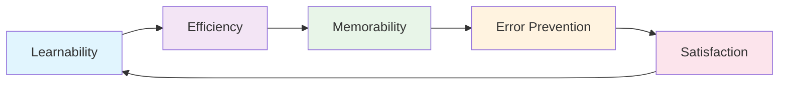

# Domain Knowledge Reference

Auto-generated from blog posts. Do not edit manually.
Last updated: 2026-09-26

---

## Source: fundamentals-of-software-usability

URL: https://jeffbailey.us/blog/2026/01/01/fundamentals-of-software-usability

## Introduction

Why do some software interfaces feel intuitive while others require constant help documentation? The difference lies in understanding the fundamentals of software usability.

Software usability became a field in the 1980s when researchers observed that functional software often failed because users struggled, made errors, or abandoned it. This gap between software capabilities and user success prompted the study of how effectively users can complete tasks with software.

Software usability measures effectiveness: can users learn, use efficiently, remember, avoid errors, and feel satisfied? Unlike user experience, which covers the whole journey, usability focuses on these five dimensions.

Most teams build functional software but struggle with usability. Without understanding usability, they create interfaces that work but frustrate users, causing abandoned features, support tickets, and low adoption. Knowing usability helps teams create software users can effectively use.

**What this is (and isn't):** This article explains software usability principles and trade-offs, focusing on *why* usability matters and how core elements interconnect. It doesn't cover detailed design tool tutorials, specific UI frameworks, or all aspects of user experience design.

**Why software usability fundamentals matter:**

Usability relies on core elements: learnability for first-time use, efficiency for experienced users, memorability for returning users, error prevention for safety, and satisfaction for continued use. These elements form a system that makes software truly usable.

> Type: **Explanation** (understanding-oriented).  
> Primary audience: **beginner to intermediate** software developers, designers, and product builders learning why usability matters and how to achieve it

### Prerequisites & Audience

**Prerequisites:** Know basic software development concepts. Experience building user interfaces helps, but no specific design background is required.

**Primary audience:** Beginner to intermediate software developers, designers, and product builders seeking to understand why usability matters and how to achieve it in practice.

**Jump to:** [Learnability](#section-1-learnability--first-time-use) • [Efficiency](#section-2-efficiency--rapid-task-completion) • [Memorability](#section-3-memorability--returning-users) • [Error Prevention](#section-4-error-prevention--avoiding-mistakes) • [Satisfaction](#section-5-satisfaction--positive-experiences) • [Usability Testing](#section-6-usability-testing--evaluating-effectiveness) • [Common Mistakes](#section-7-common-usability-mistakes--what-to-avoid) • [Misconceptions](#section-8-common-misconceptions) • [When NOT to Focus on Usability](#section-9-when-not-to-focus-on-usability) • [Future Trends](#future-trends--evolving-standards) • [Limitations & Specialists](#limitations--when-to-involve-specialists) • [Glossary](#glossary)

New developers should focus on learnability and error prevention, while experienced developers can prioritize efficiency and satisfaction.

**Escape routes:** For a quick refresher on learnability, read Section 1, then skip to "Common Usability Mistakes".

### TL;DR – Software Usability Fundamentals in One Pass

Understanding software usability involves recognizing how core elements function as a system:

* **Learnability** helps users complete basic tasks quickly, minimizing training and answering "Can users figure this out?"
* **Efficiency** enables users to complete tasks quickly, boosting productivity. It asks, "How fast can users work?"
* **Memorability** enables returning users to be productive faster by reducing relearning time. It asks, "Can users remember how to use this?"
* **Error prevention** prevents mistakes via good design, lowering frustration and consequences. It asks, "Does this prevent user errors?"
* **Satisfaction** creates positive experiences, encouraging continued use and building loyalty. It asks, "Do users enjoy this?"

These elements form a system: learnability enables first use, efficiency supports productivity, memorability reduces relearning, error prevention avoids frustration, and satisfaction encourages continued use. Each relies on the others for effectiveness. High learnability creates positive first impressions, increasing satisfaction, while error prevention builds trust that supports memorability. Efficiency without learnability limits use to experts, while learnability without efficiency frustrates experienced users. The elements work together, not in isolation.



*Figure 1. The software usability system includes learnability for first-time use, efficiency for rapid task completion, memorability for returning users, error prevention for avoiding mistakes, and satisfaction for continued use.*

### Learning Outcomes

By the end of this article, readers can:

* Explain **why** learnability matters and how to design intuitive interfaces for first use.
* Explain **why** efficiency matters and how to enable quick task completion.
* Explain **why** memorability aids returning users and how to design for retention.
* Explain how error prevention reduces frustration and the design patterns that prevent mistakes.
* Explain how satisfaction influences continued use and what creates positive experiences.
* Explain how usability testing assesses effectiveness and appropriate timing for tests.

## Section 1: Learnability – First-Time Use

Learnability indicates how easily users can perform basic tasks on first use. High learnability shows users can understand the interface without training or documentation.

Think of learnability as a first impression. When users encounter new software, they quickly judge if they can use it. Interfaces with high learnability feel familiar and predictable, while low learnability causes confusion and abandonment.

### Understanding Learnability

Learnability comes from several principles working together:

**Familiar patterns** use conventions users know. A disk icon for save is more learnable than a custom symbol since users recognize it from years of software use. Familiar patterns leverage users' existing knowledge.**

**Clear affordances** show what users can do: buttons look clickable, text fields look editable, and links appear navigable. They communicate function through appearance.

**Discoverable features** are findable without documentation. Important actions are visible, and navigation is intuitive. Hidden features reduce learnability because users can't find them.

**Consistent language** uses familiar terms, as technical jargon hampers learnability. Labels should match users' vocabulary.

**Progressive disclosure** reveals complexity gradually. Simple interfaces are easier to learn than complex ones. Showing advanced features after basic ones helps users learn incrementally.

**Why learnability works:** Human cognition relies on pattern matching. Familiar patterns allow users to predict behavior without learning new rules, reducing cognitive load and enabling faster task completion. They activate mental models from previous software use, making new software seem intuitive rather than requiring learning from scratch.

### Design Patterns for Learnability

Several design patterns improve learnability:

**Standard layouts** follow common conventions: navigation on top, content in the center, actions on the right—familiar web patterns. Deviating from standards forces users to learn new layouts, increasing cognitive load.

**Icon conventions** use universal symbols, such as a trash can for delete, a magnifying glass for search, and a plus sign for add. Custom icons require learning.

**Wizard patterns** guide users through multi-step processes. Installation wizards in macOS and Windows break complex setups into clear steps with progress indicators, making it understandable even for non-technical users.

**Tooltips and hints** offer quick help without clutter. Brief explanations are provided as needed to support efficient learning.

**Why these patterns work:** They leverage existing knowledge. Users don't need to learn new conventions because they already know standard patterns. This reduces learning time and builds confidence.

### Trade-offs and Limitations of Learnability

Learnability involves trade-offs: highly learnable interfaces may sacrifice efficiency for experienced users, and familiar patterns may limit innovation. The goal is balance, not perfection.

**When learnability isn't enough:** Learnable interfaces are essential but not enough for usability. Even highly learnable software can still be inefficient, hard to remember, or error-prone. While learnability aids first-time use, other factors influence long-term usability.

### When Learnability Fails

Learnability declines if interfaces use unfamiliar patterns, hide key features, or need specialized knowledge.

**Signs of poor learnability:** Users often ask, "How do I...?" due to an unclear interface, leading first-timers to abandon tasks and submit basic usage support requests. They need training or documentation for simple tasks.

### Quick Check: Learnability

Test understanding:

* Can users accomplish basic tasks without training or documentation?
* Do interfaces use familiar patterns and conventions?
* Are important features discoverable without help?

If unclear, observe first-time users: can they complete basic tasks independently?

**Answer guidance:** **Ideal result:** Users can complete basic tasks on first use through familiar patterns, clear affordances, and discoverable features.

If learnability is unclear, test with first-time users and watch their difficulties.

## Section 2: Efficiency – Rapid Task Completion

Efficiency measures how quickly users complete tasks. High efficiency indicates users work rapidly without delays or unnecessary steps.

Think of efficiency as productivity. Experienced users want to complete tasks quickly, and efficient interfaces support that goal. Inefficient interfaces force users through unnecessary steps, slowing work and creating frustration.

### Understanding Efficiency

Efficiency comes from several principles:

**Keyboard shortcuts** enable quick input, preferred by power users over mouse clicks.

**Bulk operations** let users handle multiple items simultaneously, saving time by applying actions to many at once instead of one by one.

**Smart defaults** simplify choices, allowing users to accept them most of the time, which reduces clicks and mental effort.

**Minimal steps** eliminate unnecessary actions, saving time and reducing errors. Efficient interfaces keep steps few and clear.

**Contextual actions** appear when needed, reducing navigation and searching by providing relevant actions for the current context.

**Why efficiency works:** Experienced users develop mental models from practice. Efficient interfaces match these models, allowing quick, effortless work without cognitive load. When interfaces align with user workflows, users work naturally without struggling or translating between their mental model and the interface.

### Design Patterns for Efficiency

Several patterns improve efficiency:

**Command palettes** give quick access to features. Apps like VS Code and Sublime Text let users type `Ctrl+P` to search for commands, which is much faster than navigating menus.

**Keyboard navigation** provides full control via the keyboard, using Tab, arrow keys, and shortcuts so users can operate without a mouse.

**Batch processing** manages multiple items at once by selecting and applying actions to minimize time and repetition.

**Auto-complete and suggestions** reduce typing and decision-making. Gmail's email autocomplete and Google Search's query suggestions help users complete tasks faster by predicting needs based on context.

**Why these patterns work:** They respect experienced users' knowledge and preferences. Power users want speed, and these patterns deliver it. They don't sacrifice learnability because they're optional enhancements, not replacements for basic functionality.

### Trade-offs and Limitations of Efficiency

Efficiency involves trade-offs: highly efficient interfaces may be less learnable, and power-user features may complicate basic use. The goal is to support both beginners and experts.

**When efficiency isn't enough:** Efficient interfaces matter, but aren't enough for usability. Even efficient software can be hard to learn, remember, or prone to errors. Efficiency benefits experienced users, but other factors are crucial for overall usability.

### When Efficiency Fails

Efficiency drops when interfaces have unnecessary steps, lack shortcuts, or impose slow workflows.

**Signs of poor efficiency:** Experienced users find workflows slow, with tasks taking longer than necessary. They request shortcuts or automation. Power users avoid the software despite its features.

### Quick Check: Efficiency

Test understanding:

* Can experienced users complete tasks quickly without extra steps?
* Are keyboard shortcuts available for everyday actions?
* Do interfaces support bulk operations when appropriate?

If unclear, observe experienced users: how quickly do they complete daily tasks?

**Answer guidance:** **Ideal result:** Experienced users can complete tasks rapidly using keyboard shortcuts, bulk operations, and minimal steps.

If efficiency is unclear, measure task completion times for experienced users and identify bottlenecks.

## Section 3: Memorability – Returning Users

Memorability measures how easily users recall software after disuse, enabling quick productivity without relearning.

Think of memorability as retention. Memorable interfaces help users return efficiently, while low memorability leads to relearning, wasted time, and frustration.

### Understanding Memorability

Memorability comes from several principles:

**Consistent patterns** use the same conventions throughout, helping users remember and apply them across interfaces.

**Logical organization** groups related features, helping users find them through understanding rather than memorization.

**Clear visual hierarchy** highlights essential elements, helping users recall where to find items in order of importance.

**Meaningful labels** use descriptive terms that help users remember their purpose through understanding, rather than arbitrary names.

**Predictable behavior** is consistent across similar contexts, enabling users to recall patterns rather than specific instances.

**Why memorability works:** Human memory depends on patterns and associations. Consistent interface patterns help users form stable mental models that last over time through pattern recognition. These models enable rapid recall upon return, minimizing relearning because patterns remain familiar even after absence.

### Design Patterns for Memorability

Several patterns improve memorability:

**Consistent navigation** maintains the same structure across applications like GitHub, helping users remember where features are even after months away.

**Standard terminology** employs consistent terms for concepts, helping users remember their meanings.

**Visual consistency** employs uniform styles and layouts, helping users remember appearances and locations.

**Logical grouping** organizes features by function, helping users remember them by purpose.

**Why these patterns work:** They create stable mental models. Consistent interfaces help users form reliable, persistent memories, enabling quick recall and faster productivity for returning users.

### Trade-offs and Limitations of Memorability

Memorability involves trade-offs: highly memorable interfaces may sacrifice innovation, and consistency can limit flexibility. The goal is balance, not perfection.

**When memorability isn't enough:** Memorable interfaces are valuable but not sufficient for usability. Even memorable software can be inefficient, hard to learn, or error-prone. Memorability aids returning users, but other factors also impact usability.

### When Memorability Fails

Memorability drops with inconsistent patterns, random organization, or unpredictable behavior.

**Signs of poor memorability:** Returning users forget how to use the software and must relearn basic tasks. Support requests also come from experienced users who forget how things work.

### Quick Check: Memorability

Test understanding:

* Can returning users be productive quickly without relearning?
* Are interfaces consistent enough to build stable mental models?
* Do patterns persist across software areas?

If unclear, observe returning users: how quickly can they resume work?

**Answer guidance:** **Ideal result:** Returning users become productive quickly due to consistent patterns, organization, and predictable behavior.

Test returning users after a break to measure how quickly they resume productive work.

## Section 4: Error Prevention – Avoiding Mistakes

Error prevention measures evaluate how well interfaces avoid user mistakes. High error prevention indicates mistakes are rare and recovery is easy.

Treat error prevention as safety. User errors cause lost work, incorrect data, or wasted time. Preventing errors protects users and reduces frustration.

### Understanding Error Prevention

Error prevention comes from several principles:

**Constraints** prevent invalid actions by disabling buttons and validating input.

**Confirmation** requires explicit approval for destructive actions. Delete confirmations prevent data loss, and dialog boxes avoid irreversible errors.

**Clear feedback** shows results instantly, indicating success or failure and preventing repeats.

**Undo functionality** allows users to reverse actions, promoting experimentation and reducing anxiety.

**Input validation** prevents invalid data entry and displays errors in real time, reducing errors early.

**Why error prevention works:** Human error is inevitable, but good design minimizes mistakes through constraints, confirmations, and validation. Error-preventing interfaces help users avoid frustration and issues. Prevention is better than recovery, reducing problems, frustration, and system complexity from error handling.

### Design Patterns for Error Prevention

Several patterns prevent errors:

**Disabled states** disable the submit button until required fields are filled, preventing invalid submissions and errors.

**Confirmation dialogs** require approval for destructive actions. Delete confirmations avoid accidental data loss, while confirmation dialogs prevent irreversible mistakes.

**Input validation** prevents invalid data entry by showing errors in real-time.**

**Undo and redo** allow users to reverse actions. Text editors like Google Docs and VS Code provide undo, fostering experimentation, reducing anxiety, and enabling exploration.

**Progressive enhancement** offers basic functionality first, then adds features. When the core works, users avoid errors from missing features.

**Why these patterns work:** Interfaces prevent errors, helping users avoid consequences and frustration. Prevention is preferable to recovery, as it stops problems before they occur.

### Trade-offs and Limitations of Error Prevention

Error prevention involves trade-offs: constrained interfaces reduce flexibility, and confirmations may slow experienced users. The goal is to prevent errors without sacrificing usability.

**When error prevention isn't enough:** Preventing errors helps but isn't enough for usability. Error-free software can still be hard, inefficient, or forgettable. While error prevention ensures safety, other factors also influence usability.

### When Error Prevention Fails

Error prevention drops when interfaces allow invalid actions, lack confirmation, or give unclear feedback.

**Signs of poor error prevention:** Users frequently make errors, such as accidental deletions or incorrect data entry, leading to support requests. They also avoid features, fearing mistakes.

### Quick Check: Error Prevention

Test understanding:

* Do interfaces prevent invalid actions through constraints?
* Are destructive actions confirmed before execution?
* Can users recover from mistakes easily?

If any answer is unclear, observe users: do they make preventable errors?

**Answer guidance:** **Ideal result:** Interfaces prevent errors with constraints, confirmations, and validation, allowing easy recovery when mistakes happen.

If error prevention is unclear, track user errors and identify preventable mistakes.

## Section 5: Satisfaction – Positive Experiences

Satisfaction assesses the enjoyment of using software. High satisfaction indicates positive experiences that promote continued use.

Think of satisfaction as delight. Unlike effectiveness, satisfaction emphasizes enjoyment. Satisfying software elicits positive associations that promote continued use.

### Understanding Satisfaction

Satisfaction comes from several principles:

**Pleasant aesthetics** create appealing interfaces. While aesthetics don't replace functionality, attractive interfaces are more satisfying.

**Responsive feedback** provides immediate responses, making interfaces feel quick and user-controlled, thereby boosting satisfaction.

**Polished interactions** are smooth and refined, with animations, transitions, and micro-interactions that enhance satisfaction.

**Helpful messaging** provides clear, friendly communication that supports users and enhances satisfaction.

**Respectful behavior** treats users with dignity. When software respects users' time, preferences, and data, users feel valued, increasing satisfaction.

**Why satisfaction works:** Human psychology links positive experiences with continued use through emotional memory. When software satisfies users, it fosters positive associations that encourage return and loyalty. Satisfaction boosts enjoyment and long-term use without replacing functionality.

### Design Patterns for Satisfaction

Several patterns increase satisfaction:

**Micro-interactions** provide subtle feedback, such as Twitter's post-like animation or iPhone's haptic feedback, thereby enhancing user satisfaction.

**Polished animations** make interfaces smooth, purposeful, and satisfying.

**Helpful error messages** provide clear, user-friendly support, reducing frustration and maintaining satisfaction.

**Personalization** tailors to user preferences, making users feel valued and boosting satisfaction.

**Why these patterns work:** They create positive experiences, and respectful interfaces foster positive user associations, encouraging continued use, boosting satisfaction and retention.

### Trade-offs and Limitations of Satisfaction

Satisfaction involves trade-offs: polished interfaces may take longer to build, and aesthetics can distract from functionality. The goal is satisfaction that enhances, not replaces, effectiveness.

**When satisfaction isn't enough:** Satisfying software is valuable but not sufficient for usability. It can still be difficult to learn, inefficient, or error-prone. Satisfaction increases enjoyment, but other factors are vital for usability.

### When Satisfaction Fails

Satisfaction decreases with unpolished interfaces, poor feedback, or disrespect.

**Signs of low satisfaction:** Users find the interface unpolished and avoid the software despite its functionality, citing negative feedback mainly about the user experience.

### Quick Check: Satisfaction

Test understanding:

* Do users have positive experiences with the software?
* Are interfaces polished and respectful?
* Do interactions feel smooth and responsive?

If any answer is unclear, survey users: do they enjoy using the software?

**Answer guidance:** **Ideal result:** Users enjoy polished, respectful, smooth, and responsive interfaces.

If satisfaction is unclear, survey users about their experience and identify areas for improvement.

## Section 6: Usability Testing – Evaluating Effectiveness

Usability testing evaluates how effectively users use software, finds issues, and confirms improvements to meet usability goals.

Think of usability testing as validation. Without testing, teams guess about usability. Testing offers evidence of what works and what doesn't, enabling data-driven improvements.

### Understanding Usability Testing

Usability testing comes in several forms:

**Moderated testing** involves observing users perform tasks, with moderators asking questions and probing issues to gather detailed qualitative data.

**Unmoderated testing** lets users complete tasks at their own pace, providing quantitative data.

**Remote testing** allows testing from anywhere, broadening participant pools and lowering costs for more frequent testing.

**In-person testing** offers direct observation, rich interaction, and immediate follow-up, yielding detailed insights.

**Why usability testing works:** It highlights usability issues teams might overlook. Watching users struggle uncovers real problems. Testing confirms that fixes assist users and prevent worsening issues. Without it, teams guess and may focus on the wrong problems.

### Testing Methods

Several methods evaluate usability:

**Task-based testing** has users complete specific tasks, and observing helps identify usability problems by showing where users struggle.

**Think-aloud protocols** ask users to verbalize thoughts, revealing mental models and confusion sources for usability insights.

**A/B testing** compares designs to find the best ones, enabling data-driven choices.

**Analytics** track user behavior to reveal usability problems by analyzing patterns where users struggle.

**Why these methods work:** They provide various evidence types: task-based testing finds problems, think-aloud shows thinking, A/B compares solutions, and analytics reveal patterns, offering comprehensive usability insights.

### Trade-offs and Limitations of Usability Testing

Usability testing involves trade-offs: thorough testing takes time, and small samples may not reflect all users. The aim is valuable testing at a reasonable cost.

**When usability testing isn't enough:** Testing finds problems but doesn't fix them. Teams must act on results, fix issues, and validate improvements. Testing is valuable, but action is essential.

### When Usability Testing Fails

Testing fails if teams ignore results, test with wrong users, or focus on incorrect tasks.

**Signs of ineffective testing:** Test results don't lead to changes; teams test but don't improve, and usability problems persist.

### Quick Check: Usability Testing

Test understanding:

* Do teams regularly test usability with real users?
* Are test results used to improve software?
* Do tests evaluate the right tasks and users?

If any answer is unclear, review testing practices: are tests driving improvement?

**Answer guidance:** **Ideal result:** Teams test usability with real users, use results to improve software, and evaluate suitable tasks and users.

If testing is unclear, conduct regular usability testing and use the results to inform improvement.

## Section 7: Common Usability Mistakes – What to Avoid

Common mistakes hinder usability. Knowing them helps me avoid errors.

### Mistake 1: Hiding Important Features

Hiding key features behind menus or requiring discovery hampers learnability and efficiency, as users can't access features they can't find.

**Incorrect:**

```text
Important action buried in a three-level menu:
File → Settings → Advanced → Enable Feature
```

**Correct:**

```text
Important action visible and accessible:
Primary button: "Enable Feature"
```

### Mistake 2: Inconsistent Patterns

Using different patterns for similar functions decreases memorability as users must learn multiple ways to do the same thing.

**Incorrect:**

```text
Some forms use "Submit" button, others use "Save",
others use "Continue", with no clear pattern.
```

**Correct:**

```text
Consistent pattern: Primary actions use "Save",
secondary actions use "Cancel", navigation uses "Next".
```

### Mistake 3: Poor Error Messages

Unclear error messages hinder error prevention and user satisfaction, as users can't fix problems they don't understand.

**Incorrect:**

```text
Error: "Invalid input"
```

**Correct:**

```text
Error: "Email address must include @ symbol.
Please enter a valid email address."
```

### Mistake 4: No Keyboard Shortcuts

Requiring mouse clicks for everything reduces efficiency. Experienced users prefer keyboard shortcuts.

**Incorrect:**

```text
All actions require mouse clicks, no keyboard support.
```

**Correct:**

```text
Common actions have keyboard shortcuts:
Ctrl+S for save, Ctrl+Z for undo, Tab for navigation.
```

### Mistake 5: No Undo Functionality

Irreversible actions lower error prevention and user satisfaction, as users avoid features they can't undo.

**Incorrect:**

```text
Delete action is permanent, no way to recover.
```

**Correct:**

```text
Delete action moves to trash, can be restored.
Destructive actions require confirmation.
```

### Quick Check: Common Mistakes

Test understanding:

* Are important features visible and accessible?
* Do interfaces use consistent patterns?
* Are error messages clear and helpful?
* Do interfaces support keyboard shortcuts?
* Can users undo actions?

**Answer guidance:** **Ideal result:** Important features are visible, patterns are consistent, error messages are clear, keyboard shortcuts are available, and undo is supported.

If mistakes are found, prioritize fixes based on impact and frequency.

## Section 8: Common Misconceptions

Common misconceptions about usability include:

* * **"Usability is about making things pretty."** Usability focuses on effectiveness rather than aesthetics. Attractive interfaces can be unusable if they hide features or confuse users. Functional designs can be satisfying without polish. Aesthetics boost satisfaction but don't replace learnability, efficiency, or error prevention.

* **"Users will learn it eventually."** High learnability accelerates adoption by reducing training time and preventing early abandonment due to poor first impressions. Even after learning, low learnability boosts support costs and lowers user confidence.

* **"Power users don't need usability."** Even power users benefit from usability, which improves efficiency, memorability, and error prevention. Speed, recall, and error prevention help all users, including experts, by reducing cognitive load and mistakes.

* **"Usability testing is expensive."** Usability testing can be simple and inexpensive, with five users revealing most problems. Informal testing with colleagues or observing support tickets costs little but offers valuable insights. Expensive testing is optional.

* **"Usability is subjective."** Usability is measurable through objective metrics like task completion, time, errors, and satisfaction scores, which validate effectiveness. While satisfaction involves subjective preferences, effectiveness can be objectively assessed.

## Section 9: When NOT to Focus on Usability

Usability isn't always the top priority. Knowing when to skip detailed usability work helps me focus on what's important.

**Prototypes and experiments** - Early prototypes focus on validating concepts rather than polishing. Basic usability suffices for learning; detailed usability work can wait until concepts are validated.

**Internal tools with expert users** - Tools used by expert developers may prioritize efficiency over learnability, valuing power-user features more than beginner-friendly design.

**One-time scripts and utilities** - Scripts used once don't require high memorability; learnability matters, but detailed memorability work isn't necessary.

**Highly specialized domains** - Software for domain experts uses specialized terminology and workflows. Usability differs from that for general users.

**Time-constrained projects** - When deadlines are tight, prioritize critical usability: learnability and error prevention. Polish can wait.

Even skipping detailed usability work, some usability is valuable. Basic learnability and error prevention aid all users.

## Building Usable Software

### Key Takeaways

* **Learnability enables adoption** - Users should be able to use software immediately. High learnability cuts training time and boosts adoption.

* **Efficiency supports productivity** - Experienced users need quick task completion. High efficiency boosts productivity for power users.

* **Memorability reduces relearning** - Returning users must be productive fast; high memorability cuts relearning time and frustration.

* **Error prevention protects users** - User errors have consequences. High error prevention protects users and reduces frustration.

* **Satisfaction encourages use** - Positive experiences lead to continued use, as high satisfaction boosts loyalty and retention.

### How These Concepts Connect

Usability elements form an integrated system, supporting each other. Weakness in one impacts others. When strong, they produce software that users learn quickly, use efficiently, remember easily, trust fully, and enjoy.

### Getting Started with Usability

For those new to usability, start with a focused approach:

1. **Test learnability** with first-time users on main flows
2. **Measure efficiency** by timing experienced users on common tasks
3. **Evaluate memorability** by testing returning users after a break
4. **Track errors** and identify preventable mistakes
5. **Survey satisfaction** to understand user experience

Once this feels routine, expand the approach to the rest of the software.

### Next Steps

**Immediate actions:**

* Conduct usability testing on main user flows
* Identify and fix the highest-impact usability problems
* Establish regular usability testing practices

**Learning path:**

* Study usability principles and design patterns
* Practice conducting usability tests
* Learn from usability testing results

**Practice exercises:**

* Apply the "Getting Started with Usability" steps to your own software

**Questions for reflection:**

* What usability problems do users encounter most?
* Which usability elements need the most improvement?
* How can usability testing inform design decisions?

### Final Quick Check

Test understanding by answering these questions:

1. What makes software learnable?
2. How does efficiency differ from learnability?
3. Why does memorability matter for returning users?
4. How can interfaces prevent user errors?
5. What creates satisfaction in software?

If any answer feels fuzzy, revisit the matching section and review the examples again.

### Self-Assessment – Can You Explain These in Your Own Words?

Test whether you can explain these concepts in your own words:

* Learnability and how it enables first-time use
* Efficiency and how it supports experienced users
* Memorability and how it helps returning users
* Error prevention and how it protects users
* Satisfaction and how it encourages continued use

If you can explain these clearly, you've internalized the fundamentals.

## Future Trends & Evolving Standards

Usability standards and practices continue to evolve. Understanding upcoming changes helps me prepare for the future.

### Accessibility Integration

Usability now includes accessibility, as usable software must serve all users. Accessibility is a core part of usability, not a separate issue.

**What this means:** Usability work must include diverse users, like those with disabilities. Accessible design benefits all.

**How to prepare:** Learn accessibility fundamentals and incorporate them into usability. Test with diverse users, including those with disabilities.

### AI and Personalization

AI provides personalized interfaces that adapt to users, boosting efficiency and satisfaction by aligning with their preferences and patterns.

**What this means:** Interfaces learn from user behavior and adapt, enhancing efficiency and satisfaction.

**How to prepare:** Understand personalization trade-offs. Consider how it impacts learnability and memorability, ensuring adaptations don't confuse users.

### Voice and Conversational Interfaces

Voice interfaces and conversational UIs are increasingly common, requiring different usability considerations than traditional graphical interfaces.

**What this means:** Usability principles apply to voice interfaces but are implemented differently. Learnability, efficiency, and error prevention are viewed differently in voice interfaces.

**How to prepare:** Understand voice interface principles, focusing on learnability, efficiency, and error prevention in conversations.

### Mobile-First Design

Mobile devices are primary interfaces for many users. Mobile-first design prioritizes mobile usability and adapts to larger screens.

**What this means:** Usability must be optimized for small screens with touch input. Mobile constraints impact learnability, efficiency, and error prevention.

**How to prepare:** Design for mobile first, then adapt to larger screens. Test usability on mobile devices, not just desktop.

## Limitations & When to Involve Specialists

Usability fundamentals offer a strong foundation, but some situations need specialist expertise.

### When Fundamentals Aren't Enough

Some usability challenges go beyond the fundamentals.

**Complex information architecture:** Organizing large information requires architecture expertise. Specialists help structure content and navigation.

**Advanced interaction design:** Complex interactions may need interaction design expertise. Specialists can craft sophisticated interactions while maintaining usability.

**Accessibility compliance:** Meeting accessibility standards may require expertise. Specialists ensure compliance and usability for diverse users.

### When Not to DIY Usability

There are situations where fundamentals alone aren't enough:

* **Legal compliance requirements** - Accessibility and usability regulations may require expert knowledge
* **Complex user research** - Advanced research methods may require research expertise
* **Specialized domains** - Domain-specific usability may require domain expertise

### When to Involve Usability Specialists

Consider involving specialists when:

* Usability problems persist despite improvements
* Complex information architecture is needed
* Accessibility compliance is required
* Advanced user research is necessary

**How to find specialists:** Look for usability professionals, UX researchers, or accessibility experts. Professional organizations and communities can help find qualified specialists.

### Working with Specialists

When working with specialists:

* Share context about your users and goals
* Involve specialists early in the design process
* Use specialist expertise to complement, not replace, team knowledge
* Learn from specialists to build internal capability

## Glossary

## References

### Industry Standards

* [ISO 9241-11:2018](https://www.iso.org/standard/63500.html): Ergonomics of human-system interaction, Part 11: Usability: Definitions and concepts. International Organization for Standardization.

* [WCAG 2.1](https://www.w3.org/WAI/WCAG21/quickref/): Web Content Accessibility Guidelines. World Wide Web Consortium.

### Foundational Works

* [Nielsen, J. (1994). Usability Engineering](https://www.nngroup.com/books/usability-engineering/). Morgan Kaufmann. The foundational work on usability engineering principles and methods.

* [Norman, D. (2013). The Design of Everyday Things](https://jnd.org/books/the-design-of-everyday-things-revised-and-expanded-edition/). Basic Books. Explains fundamental design principles including affordances, constraints, and feedback.

### Usability Testing

* [Rubin, J., & Chisnell, D. (2008). Handbook of Usability Testing](https://www.wiley.com/en-us/Handbook+of+Usability+Testing%2C+2nd+Edition-p-9780470185483). Wiley. Comprehensive guide to planning and conducting usability tests.

* [Krug, S. (2014). Rocket Surgery Made Easy](https://www.sensible.com/rocket-surgery-made-easy/). New Riders. Practical guide to do-it-yourself usability testing.

### Usability Principles

* [Nielsen's 10 Usability Heuristics](https://www.nngroup.com/articles/ten-usability-heuristics/). Nielsen Norman Group. Ten general principles for interaction design.

* [Shneiderman's Eight Golden Rules of Interface Design](https://www.cs.umd.edu/users/ben/goldenrules.html). University of Maryland. Eight principles for designing effective user interfaces.

### Tools & Resources

* [Nielsen Norman Group](https://www.nngroup.com/): Research and articles on usability and user experience.

* [Usability.gov](https://www.usability.gov/): Usability basics and guidelines from the U.S. Department of Health and Human Services.

### Note on Verification

Usability standards and best practices evolve. Verify current information and test with actual users to ensure your software meets usability goals. Usability testing with real users provides the most reliable validation of usability improvements.
